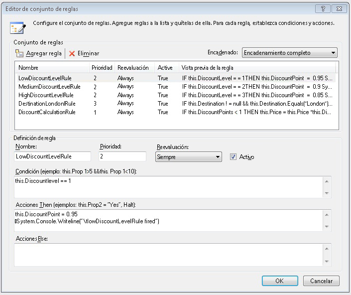
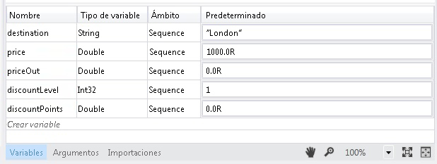
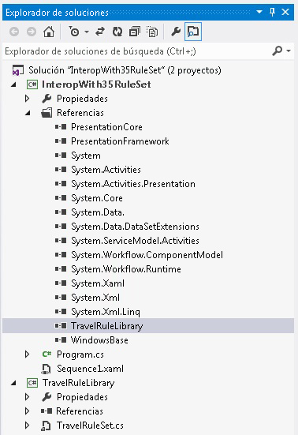
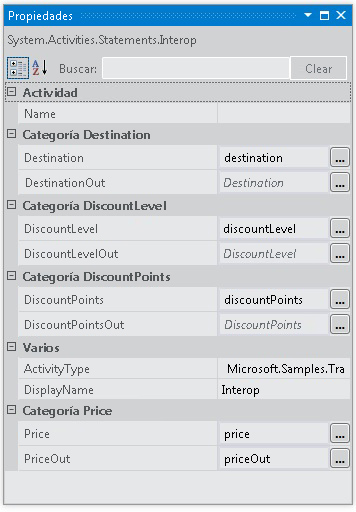

# <a name="interop-with-35-rule-set"></a>Interoperabilidad con un conjunto de reglas 3.5
Este ejemplo muestra el uso de la <xref:System.Activities.Statements.Interop> actividad para integrarse con una actividad personalizada en [!INCLUDE[netfx35_short](../../../../includes/netfx35-short-md.md)] con <!--zz <xref:System.Workflow.Activities.Policy> --> `System.Workflow.Activities.Policy` y reglas. Pasa los datos a la actividad personalizada enlazando las variables [!INCLUDE[netfx_current_long](../../../../includes/netfx-current-long-md.md)] a las propiedades de dependencia expuestas por la actividad personalizada.  
  
## <a name="requirements"></a>Requisitos  
  
1.  [!INCLUDE[vs_current_long](../../../../includes/vs-current-long-md.md)]  
  
2.  [!INCLUDE[netfx_current_long](../../../../includes/netfx-current-long-md.md)]  
  
3.  [!INCLUDE[netfx35_long](../../../../includes/netfx35-long-md.md)]  
  
## <a name="demonstrates"></a>Demostraciones  
 <xref:System.Activities.Statements.Interop> actividad, <!--zz <xref:System.Workflow.Activities.Policy> --> `System.Workflow.Activities.Policy` actividad en [!INCLUDE[netfx35_short](../../../../includes/netfx35-short-md.md)] con propiedades de dependencia  
  
## <a name="discussion"></a>Explicación  
 En el ejemplo se muestra uno de los escenarios de integración para integrar con una actividad de [!INCLUDE[netfx35_short](../../../../includes/netfx35-short-md.md)]. Este ejemplo incluye una [!INCLUDE[netfx35_short](../../../../includes/netfx35-short-md.md)] actividad personalizada que invoca un <!--zz <xref:System.Workflow.Activities.Policy> --> `System.Workflow.Activities.Policy` actividad.  
  
## <a name="travelrulelibrary"></a>TravelRuleLibrary  
 Al abrir TravelRuleSet.cs en el diseñador, se muestra una actividad secuencial personalizada que contiene una actividad Policy de la siguiente forma  
  
   
  
 Haga doble clic en el **DiscountPolicy** actividad de directiva para examinar las reglas. Aparece el editor de reglas para mostrar las reglas.  
  
   
  
 Haga clic en el **DiscountPolicy** actividad y seleccione el **ver código** opción para examinar el código lateral código C# que va con esta actividad. Observe el valor de propiedad de dependencia para `DiscountLevel`. Es equivalente a un <xref:System.Activities.Argument> en [!INCLUDE[netfx_current_short](../../../../includes/netfx-current-short-md.md)].  
  
```  
public static DependencyProperty DiscountLevelProperty = DependencyProperty.Register("DiscountLevel", typeof(int), typeof(TravelRuleSet));  
  
[DescriptionAttribute("DiscountLevel")]  
[CategoryAttribute("DiscountLevel Category")]  
[BrowsableAttribute(true)]  
[DesignerSerializationVisibilityAttribute(DesignerSerializationVisibility.Visible)]  
public int DiscountLevel  
{  
   get  
   {  
return ((int)base.GetValue(TravelRuleSet.DiscountLevelProperty)));  
   }  
   set  
   {  
base.SetValue(TravelRuleSet.DiscountLevelProperty, value);  
   }  
}  
```  
  
## <a name="interopwith35ruleset"></a>InteropWith35RuleSet  
 Es un proyecto de flujo de trabajo secuencial de [!INCLUDE[netfx_current_short](../../../../includes/netfx-current-short-md.md)] que utiliza la actividad <xref:System.Activities.Statements.Interop> para integrar con el conjunto de reglas personalizado creado en el proyecto TravelRuleLibrary. Las variables se crean en el nivel superior de <xref:System.Activities.Statements.Sequence> como sigue.  
  
   
  
   
  
 Por último, la actividad <xref:System.Activities.Statements.Interop> se utiliza para integrar con TravelRuleSet. Las variables que se declararon anteriormente en <xref:System.Activities.Statements.Sequence> se utilizan para enlazar a las propiedades de dependencia.  
  
   
  
   
  
   
  
> [!IMPORTANT]
>  Puede que los ejemplos ya estén instalados en su equipo. Compruebe el siguiente directorio (predeterminado) antes de continuar.  
>   
>  `<InstallDrive>:\WF_WCF_Samples`  
>   
>  Si este directorio no existe, vaya a [Windows Communication Foundation (WCF) y ejemplos de Windows Workflow Foundation (WF) para .NET Framework 4](http://go.microsoft.com/fwlink/?LinkId=150780) para descargar todos los Windows Communication Foundation (WCF) y [!INCLUDE[wf1](../../../../includes/wf1-md.md)] ejemplos. Este ejemplo se encuentra en el siguiente directorio.  
>   
>  `<InstallDrive>:\WF_WCF_Samples\WF\Basic\Built-InActivities\InteropWith35RuleSet`
