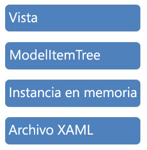

# <a name="programming-model-item-tree"></a><span data-ttu-id="6b705-102">Programar el árbol de elementos de modelo</span><span class="sxs-lookup"><span data-stu-id="6b705-102">Programming Model Item Tree</span></span>
<span data-ttu-id="6b705-103">En este ejemplo se muestra cómo navegar hasta el árbol <xref:System.Activities.Presentation.Model.ModelItem> utilizando el enlace de datos declarativo de la vista de árbol de [!INCLUDE[avalon1](../../../../includes/avalon1-md.md)].</span><span class="sxs-lookup"><span data-stu-id="6b705-103">This sample demonstrates how to navigate the <xref:System.Activities.Presentation.Model.ModelItem> tree using declarative data binding from the [!INCLUDE[avalon1](../../../../includes/avalon1-md.md)] Tree View.</span></span>  
  
## <a name="sample-details"></a><span data-ttu-id="6b705-104">Detalles del ejemplo</span><span class="sxs-lookup"><span data-stu-id="6b705-104">Sample Details</span></span>  
 <span data-ttu-id="6b705-105">El árbol <xref:System.Activities.Presentation.Model.ModelItem> es la abstracción que usa la infraestructura de [!INCLUDE[wfd1](../../../../includes/wfd1-md.md)] para mostrar los datos sobre la instancia subyacente que se está editando.</span><span class="sxs-lookup"><span data-stu-id="6b705-105">The <xref:System.Activities.Presentation.Model.ModelItem> tree is the abstraction that is used by the [!INCLUDE[wfd1](../../../../includes/wfd1-md.md)] infrastructure to expose the data about the underlying instance being edited.</span></span> <span data-ttu-id="6b705-106">La siguiente ilustración describe los diferentes niveles de infraestructura dentro de [!INCLUDE[wfd2](../../../../includes/wfd2-md.md)].</span><span class="sxs-lookup"><span data-stu-id="6b705-106">The following illustration is a depiction of the various layers of infrastructure within the [!INCLUDE[wfd2](../../../../includes/wfd2-md.md)].</span></span>  
  
 <span data-ttu-id="6b705-107"></span><span class="sxs-lookup"><span data-stu-id="6b705-107"></span></span>  
  
 <span data-ttu-id="6b705-108">Un objeto <xref:System.Activities.Presentation.Model.ModelItem> consta de un puntero al valor subyacente, así como de una colección de objetos <xref:System.Activities.Presentation.Model.ModelProperty>.</span><span class="sxs-lookup"><span data-stu-id="6b705-108">A <xref:System.Activities.Presentation.Model.ModelItem> consists of a pointer to the underlying value, as well as a collection of <xref:System.Activities.Presentation.Model.ModelProperty> objects.</span></span> <span data-ttu-id="6b705-109">Un objeto <xref:System.Activities.Presentation.Model.ModelProperty> a su vez consta de datos como el nombre y tipo de la propiedad, y un puntero al valor que, a su vez, es otro objeto <xref:System.Activities.Presentation.Model.ModelItem>.</span><span class="sxs-lookup"><span data-stu-id="6b705-109">A <xref:System.Activities.Presentation.Model.ModelProperty> object in turn, consists of data such as the name and type of the property and then a pointer to the value, which in turn, is another <xref:System.Activities.Presentation.Model.ModelItem>.</span></span> <span data-ttu-id="6b705-110">Se utiliza un convertidor de valores para manipular algunos de los objetos <xref:System.Activities.Presentation.Model.ModelItem> que devuelve <xref:System.Activities.Presentation.Model.ModelProperty> para que aparezcan correctamente en la vista de árbol.</span><span class="sxs-lookup"><span data-stu-id="6b705-110">A value converter is used to manipulate some of the <xref:System.Activities.Presentation.Model.ModelItem>s returned from a <xref:System.Activities.Presentation.Model.ModelProperty> to make them appear correctly in the tree view.</span></span> <span data-ttu-id="6b705-111">A continuación, el ejemplo muestra cómo programar de manera imperativa en el árbol <xref:System.Activities.Presentation.Model.ModelItem> utilizando la sintaxis imperativa, tal y como se puede ver en el siguiente ejemplo.</span><span class="sxs-lookup"><span data-stu-id="6b705-111">The sample then demonstrates how to imperatively program against the <xref:System.Activities.Presentation.Model.ModelItem> tree using the imperative syntax, as seen in the following example.</span></span>  
  
```csharp  
ModelItem mi = wd.Context.Services.GetService<ModelService>().Root;  
ModelProperty mp = mi.Properties["Activities"];  
mp.Collection.Add(new Persist());  
ModelItem justAdded = mp.Collection.Last();  
justAdded.Properties["DisplayName"].SetValue("new name");  
```  
  
#### <a name="to-use-this-sample"></a><span data-ttu-id="6b705-112">Para utilizar este ejemplo</span><span class="sxs-lookup"><span data-stu-id="6b705-112">To use this sample</span></span>  
  
1.  <span data-ttu-id="6b705-113">Abra la solución ProgrammingModelItemTree.sln en [!INCLUDE[vs2010](../../../../includes/vs2010-md.md)].</span><span class="sxs-lookup"><span data-stu-id="6b705-113">Open the ProgrammingModelItemTree.sln solution in [!INCLUDE[vs2010](../../../../includes/vs2010-md.md)].</span></span>  
  
2.  <span data-ttu-id="6b705-114">Compile la solución seleccionando **generar solución** desde el **generar** menú.</span><span class="sxs-lookup"><span data-stu-id="6b705-114">Build the solution by selecting **Build Solution** from the **Build** menu.</span></span>  
  
3.  <span data-ttu-id="6b705-115">Presione F5 para ejecutar la aplicación.</span><span class="sxs-lookup"><span data-stu-id="6b705-115">Press F5 to run the application.</span></span> <span data-ttu-id="6b705-116">A continuación se muestra el formulario de [!INCLUDE[avalon2](../../../../includes/avalon2-md.md)].</span><span class="sxs-lookup"><span data-stu-id="6b705-116">The [!INCLUDE[avalon2](../../../../includes/avalon2-md.md)] form is then displayed.</span></span>  
  
4.  <span data-ttu-id="6b705-117">Haga clic en el **Load WF** botón para cargar el <xref:System.Activities.Presentation.Model.ModelItem> y enlazarla a la vista de árbol.</span><span class="sxs-lookup"><span data-stu-id="6b705-117">Click the **Load WF** button to load the <xref:System.Activities.Presentation.Model.ModelItem> and bind it to the tree view.</span></span>  
  
5.  <span data-ttu-id="6b705-118">Al hacer clic en el **Change Model Item Tree** botón ejecuta el código anterior para agregar un elemento en el árbol y establecer una propiedad.</span><span class="sxs-lookup"><span data-stu-id="6b705-118">Clicking the **Change Model Item Tree** button executes the preceding code to add an item into the tree and set a property.</span></span>  
  
> [!IMPORTANT]
>  <span data-ttu-id="6b705-119">Puede que los ejemplos ya estén instalados en su equipo.</span><span class="sxs-lookup"><span data-stu-id="6b705-119">The samples may already be installed on your computer.</span></span> <span data-ttu-id="6b705-120">Compruebe el siguiente directorio (predeterminado) antes de continuar.</span><span class="sxs-lookup"><span data-stu-id="6b705-120">Check for the following (default) directory before continuing.</span></span>  
>   
>  `<InstallDrive>:\WF_WCF_Samples`  
>   
>  <span data-ttu-id="6b705-121">Si no existe este directorio, vaya a la página [Windows Communication Foundation (WCF) and Windows Workflow Foundation (WF) Samples for .NET Framework 4](http://go.microsoft.com/fwlink/?LinkId=150780) [Ejemplos de Windows Communication Foundation (WCF) y Windows Workflow Foundation (WF) para .NET Framework 4] para descargar todos los ejemplos de [!INCLUDE[indigo1](../../../../includes/indigo1-md.md)] y [!INCLUDE[wf1](../../../../includes/wf1-md.md)] .</span><span class="sxs-lookup"><span data-stu-id="6b705-121">If this directory does not exist, go to [Windows Communication Foundation (WCF) and Windows Workflow Foundation (WF) Samples for .NET Framework 4](http://go.microsoft.com/fwlink/?LinkId=150780) to download all [!INCLUDE[indigo1](../../../../includes/indigo1-md.md)] and [!INCLUDE[wf1](../../../../includes/wf1-md.md)] samples.</span></span> <span data-ttu-id="6b705-122">Este ejemplo se encuentra en el siguiente directorio.</span><span class="sxs-lookup"><span data-stu-id="6b705-122">This sample is located in the following directory.</span></span>  
>   
>  `<InstallDrive>:\WF_WCF_Samples\WF\Basic\Designer\ProgrammingModelItemTree`  
  
## <a name="see-also"></a><span data-ttu-id="6b705-123">Vea también</span><span class="sxs-lookup"><span data-stu-id="6b705-123">See Also</span></span>  
 <xref:System.Windows.Data.IValueConverter>
