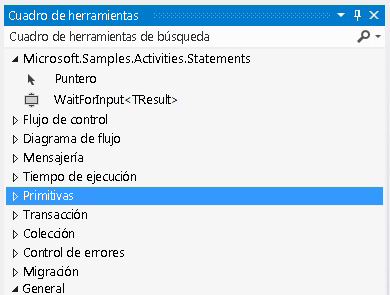

# Actividad Wait For Input
Este ejemplo muestra cómo crear marcadores con nombre en un flujo de trabajo. [!INCLUDE[wf](../../../../includes/wf-md.md)] no proporciona una actividad para la creación declarativa de marcadores. Por consiguiente, si desea crear un marcador en su flujo de trabajo, deberá escribir una actividad personalizada que lo cree. La actividad `WaitForInput` definida en este ejemplo proporciona esta funcionalidad, para que los usuarios puedan crear los marcadores mediante declaración dentro de un flujo de trabajo.  
  
## Proyectos en este ejemplo  
  
|**Nombre del proyecto**|**Descripción**|**Archivos principales**|  
|-|-|-|  
|WaitForInput|Contiene la actividad `WaitForInput` y su diseñador.|WaitForInput.cs   Definición de la actividad `WaitForInput`.|  
|||WaitForInputDesigner.xaml   Diseñador personalizado para la actividad `WaitForInput`.|  
|||TypeToFirstGenericArgumentConverter.cs   Convertidor de tipos de WPF utilizado para actualizar el tipo genérico de la actividad en el diseñador.|  
|WaitForInputTestClient|Aplicación cliente de muestra que configura y ejecuta un flujo de trabajo mediante varias actividades WaitForInput con el diseñador de flujo de trabajo.|Sequence1.xaml   Flujo de trabajo secuencial que utiliza la actividad `WaitForInput`.|  
|||Program.cs   Ejecuta una instancia de flujo de trabajo definida en Sequence1.xaml.|  
  
## Actividad WaitForInput  
 La actividad `WaitForInput` crea un marcador con nombre en un flujo de trabajo. El marcador espera una señal y recibe datos de su tipo configurado. Una vez reanudado el marcador, los datos pasados al flujo de trabajo están disponibles a través de la propiedad `Result`.  
  
 La actividad `WaitForInput` se deriva de la clase <xref:System.Activities.NativeActivity> porque debe crear marcadores, que solo son accesibles a través de la clase <xref:System.Activities.NativeActivityContext>.  
  
 La actividad tiene tres atributos aplicados para enlazar un diseñador, agregando la característica de argumento genérico que se puede actualizar y estableciendo el tipo genérico predeterminado como cadena. La actividad también tiene los argumentos enumerados en la siguiente tabla.  
  
|**Nombre**|**ype**|**Descripción**|  
|-|-|-|  
|
          TResult|El argumento genérico (TResult)|El tipo del marcador. Este es el tipo de datos que se va a pasar al marcador cuando se reanude.|  
|BookmarkName|InArgument\<cadena >|Nombre del marcador.|  
|Resultado|InArgument\<TResult >|Los datos pasados a la actividad cuando se reanuda el marcador.|  
  
## Diseñador de la actividad de WaitForInput  
 El diseñador de la actividad `WaitForInput` se implementa en el archivo WaitForInputDesigner.xaml. La actividad `WaitForInput` y su diseñador están incluidos en el mismo ensamblado. El siguiente gráfico muestra la actividad `WaitForInput` en el cuadro de herramientas dentro de una categoría que tiene el mismo nombre que el ensamblado.  
  
   
  
 El siguiente gráfico muestra el diseñador de `WaitForInput`. Dado que la actividad `WaitForInput` es muy básica, el diseñador permite establecer el valor de todos sus argumentos directamente en la superficie del diseñador.  
  
   
  
#### Para utilizar este ejemplo  
  
1.  Abra el archivo WaitForInput.sln con [!INCLUDE[vs2010](../../../../includes/vs2010-md.md)].  
  
2.  Para compilar la solución, presione Ctrl+MAYÚS+B.  
  
3.  Para iniciar el ejemplo sin depurar, presione CTRL+F5.  
  
> [!IMPORTANT]
>  Puede que los ejemplos ya estén instalados en su equipo. Compruebe el siguiente directorio (predeterminado) antes de continuar.  
>   
>  `<InstallDrive>:\WF_WCF_Samples`  
>   
>  Si no existe este directorio, vaya a la página [Windows Communication Foundation (WCF) and Windows Workflow Foundation (WF) Samples for .NET Framework 4](http://go.microsoft.com/fwlink/?LinkId=150780) [Ejemplos de Windows Communication Foundation (WCF) y Windows Workflow Foundation (WF) para .NET Framework 4] para descargar todos los ejemplos de [!INCLUDE[indigo1](../../../../includes/indigo1-md.md)] y [!INCLUDE[wf1](../../../../includes/wf1-md.md)] . Este ejemplo se encuentra en el siguiente directorio.  
>   
>  `<InstallDrive>:\WF_WCF_Samples\WF\Scenario\ActivityLibrary\WaitForInput`