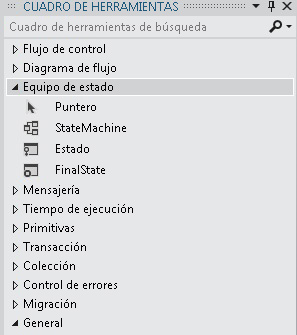

# Flujos de trabajo de máquina de estados
Una máquina de estados es un paradigma conocido para el desarrollo de programas. La actividad <xref:System.Activities.Statements.StateMachine> , junto con <xref:System.Activities.Statements.State>, <xref:System.Activities.Statements.Transition>, y otras actividades se pueden usar para compilar programas de flujo de trabajo de máquina de estados. Este tema proporciona información general sobre cómo crear flujos de trabajo de máquina de estados.  
  
## Información general del flujo de trabajo de máquina de estados  
 Los flujos de trabajo de máquina de estados proporcionan un estilo de modelado con el que puede modelar su flujo de trabajo de una manera orientada a eventos. Una actividad <xref:System.Activities.Statements.StateMachine> contiene los estados y las transiciones que constituyen la lógica de la máquina de estados, y se puede usar en cualquier lugar donde se puede usar una actividad. Hay varias clases en el tiempo de ejecución de máquina de estados:  
  
-   <xref:System.Activities.Statements.StateMachine>  
  
-   <xref:System.Activities.Statements.State>  
  
-   <xref:System.Activities.Statements.Transition>  
  
 Para crear un flujo de trabajo de máquina de estados, los estados se agregan a una actividad <xref:System.Activities.Statements.StateMachine> y las transiciones se usan para controlar el flujo entre estados. La siguiente captura de pantalla de la [Tutorial de introducción](../../../docs/framework/windows-workflow-foundation/getting-started-tutorial.md) paso [Cómo: crear un flujo de trabajo de máquina de estados](../../../docs/framework/windows-workflow-foundation/how-to-create-a-state-machine-workflow.md), muestra un flujo de trabajo de máquina de Estados con tres estados y transiciones de tres. **Inicializar destino** es el estado inicial y representa el primer estado del flujo de trabajo. Esto lo designa la línea que conduce a él desde el **iniciar** nodo. El estado final del flujo de trabajo se denomina **FinalState**y representa el momento en que se completó el flujo de trabajo.  
  
   
  
 Un flujo de trabajo de máquina de estados debe tener un único estado inicial y por lo menos un estado final. Cada estado que no es un estado final debe tener al menos una transición. Las secciones siguientes tratan sobre cómo crear y configurar estados y transiciones.  
  
## Crear y configurar estados  
 <xref:System.Activities.Statements.State> representa un estado en el que una máquina de estados puede estar. Para agregar una <xref:System.Activities.Statements.State> a un flujo de trabajo, arrastre el **estado** Diseñador de actividad de la **máquina de estados** sección de la **cuadro de herramientas** y colóquela en una <xref:System.Activities.Statements.StateMachine> actividad en el [!INCLUDE[wfd1](../../../includes/wfd1-md.md)] superficie.  
  
   
  
 Para configurar un estado como el **estado inicial del**, haga clic en el estado y seleccione **establecer como estado inicial**. Además, si no hay ningún estado inicial actual, el estado inicial puede designarse arrastrando una línea desde el **iniciar** nodo en la parte superior del flujo de trabajo al estado deseado. Cuando un <xref:System.Activities.Statements.StateMachine> actividad se coloca en el Diseñador de flujo de trabajo, está preconfigurada con un estado inicial denominado **State1**. Un flujo de trabajo de máquina de estados debe tener un único estado inicial.  
  
 Un estado que representa un estado de terminación en una máquina de estados se denomina un estado final. Un estado final es un estado que tiene su propiedad <xref:System.Activities.Statements.State.IsFinal%2A> establecida en `true`, no tiene ninguna actividad <xref:System.Activities.Statements.State.Exit%2A> y ninguna transición procede de ella. Para agregar un estado final a un flujo de trabajo, arrastre un **FinalState** Diseñador de actividad desde la **máquina de estados** sección de la **cuadro de herramientas** y colóquela en una <xref:System.Activities.Statements.StateMachine> actividad en el [!INCLUDE[wfd1](../../../includes/wfd1-md.md)] superficie. Un flujo de trabajo de máquina de estados debe tener al menos un estado final.  
  
### Configurar acciones de entrada y de salida  
 Un estado puede tener una acción <xref:System.Activities.Statements.State.Entry%2A> y una acción <xref:System.Activities.Statements.State.Exit%2A>. (Un estado configurado como estado final solo puede tener una acción de entrada). Cuando una instancia de flujo de trabajo entra en un estado, se ejecutan las actividades de la acción de entrada. Cuando se completa la acción de entrada, los desencadenadores de las transiciones del estado se programan. Cuando se confirma una transición a otro estado, las actividades de la acción de salida se ejecutan, incluso si el estado vuelve a cambiar al mismo estado. Después de que la acción de salida se completa, se ejecutan las actividades de la acción de la transición, se cambia al nuevo estado y se programan sus acciones de entrada.  
  
> [!NOTE]
>  Al depurar un flujo de trabajo de máquina de estados, los puntos de interrupción se pueden colocar en la actividad de la máquina de estados raíz y los estados del flujo de trabajo de máquina de estados. Los puntos de interrupción no se pueden colocar directamente en las transiciones, pero pueden colocar en cualquier actividad contenida dentro de los estados y las transiciones.  
  
## Crear y configurar transiciones  
 Todos los estados deben tener al menos una transición, a excepción de un estado final que no puede tener transiciones. Los cambios pueden agregarse después de agregar un estado a un flujo de trabajo de máquina de estados o se pueden crear cuando se coloca el estado.  
  
 Para agregar una <xref:System.Activities.Statements.State> y crear una transición en un solo paso, arrastre un **estado** actividad desde la **máquina de estados** sección de la **cuadro de herramientas** y mantenga el mouse sobre otro estado en el Diseñador de flujo de trabajo. Cuando el <xref:System.Activities.Statements.State> arrastrado está sobre a otro <xref:System.Activities.Statements.State>, aparecerán cuatro triángulos alrededor del otro <xref:System.Activities.Statements.State>. Si <xref:System.Activities.Statements.State> se coloca sobre uno de los cuatro triángulos, se agrega a la máquina de estados y se crea una transición desde el <xref:System.Activities.Statements.State> de origen al <xref:System.Activities.Statements.State> de destino colocado. Para obtener más información, consulte [Diseñador de actividad Transition](/visualstudio/workflow-designer/transition-activity-designer).  
  
 Para crear una transición después de agregar un estado, hay dos opciones. La primera opción es arrastrar el estado desde la superficie del diseñador de flujo de trabajo y mantener el mouse sobre un estado existente y colocarla en uno de los puntos de colocación. Esto es muy similar al método descrito en la sección anterior. También puede mantener el mouse sobre el estado de origen deseado y arrastrar una línea hasta el estado de destino deseado.  
  
> [!NOTE]
>  Un solo estado en una máquina de estados puede tener hasta 76 transiciones creadas con el diseñador de flujo de trabajo. El límite de transiciones para un estado para los flujos de trabajo creados fuera del diseñador está limitado por los recursos del sistema.  
  
 Una transición puede tener <xref:System.Activities.Statements.Transition.Trigger%2A>, <xref:System.Activities.Statements.Transition.Condition%2A> y <xref:System.Activities.Statements.Transition.Action%2A>. El <xref:System.Activities.Statements.Transition.Trigger%2A> de una transición se programa cuando se completa la acción <xref:System.Activities.Statements.State.Entry%2A> del estado de origen de la transición. Normalmente <xref:System.Activities.Statements.Transition.Trigger%2A> es una actividad que espera que se produzca algún tipo de evento, pero puede ser cualquier actividad o ninguna actividad. Una vez completada la actividad <xref:System.Activities.Statements.Transition.Trigger%2A> , se evalúa <xref:System.Activities.Statements.Transition.Condition%2A>, si existe. Si no hay ninguna actividad <xref:System.Activities.Statements.Transition.Trigger%2A>, <xref:System.Activities.Statements.Transition.Condition%2A> se evalúa inmediatamente. Si la condición se evalúa como `false`, la transición se cancela y se reprograma la actividad <xref:System.Activities.Statements.Transition.Trigger%2A> para todas las transiciones desde el estado. Si hay otras transiciones que comparten el mismo estado de origen que la transición actual, esas acciones <xref:System.Activities.Statements.Transition.Trigger%2A> se cancelan y se reprograman también. Si <xref:System.Activities.Statements.Transition.Condition%2A> se evalúa como `true`, o no hay ninguna condición, entonces la acción <xref:System.Activities.Statements.State.Exit%2A> del estado de origen se ejecuta y a continuación se ejecuta la <xref:System.Activities.Statements.Transition.Action%2A> de la transición. Cuando el <xref:System.Activities.Statements.Transition.Action%2A> completa, el control se transfiere a la **destino** estado  
  
 Las transiciones que comparten un desencadenador común se conocen como transiciones compartidas de desencadenador. Cada transición de un grupo de transiciones compartidas de desencadenador tiene el mismo desencadenador, pero una <xref:System.Activities.Statements.Transition.Condition%2A> y una acción únicas. Para agregar acciones adicionales a una transición y crear una transición compartida, haga clic en el círculo que indica el inicio de la transición deseada y arrástrelo hasta el estado deseado. La nueva transición compartirá un mismo desencadenador que la transición inicial, pero tendrá una condición y una acción únicas. Las transiciones compartidas también pueden crear desde el Diseñador de transición haciendo clic en **Agregar transición de desencadenador compartida** en la parte inferior del Diseñador de transición y, a continuación, seleccione el estado de destino deseado en el  **Estados disponibles para conectar** lista desplegable.  
  
> [!NOTE]
>  Tenga en cuenta que si la condición <xref:System.Activities.Statements.Transition.Condition%2A> de una transición se evalúa en `False` (o todas las condiciones de una transición de desencadenador compartido se evalúan en `False`), la transición no se producirá y se reprogramarán todos los desencadenadores para todas las transiciones desde el estado.  
  
 Para obtener más información sobre la creación de flujos de trabajo de máquina de Estados, vea [Cómo: crear un flujo de trabajo de máquina de estados](../../../docs/framework/windows-workflow-foundation/how-to-create-a-state-machine-workflow.md), [Diseñador de actividades StateMachine](/visualstudio/workflow-designer/statemachine-activity-designer), [Diseñador de actividad de estado](/visualstudio/workflow-designer/state-activity-designer), [Diseñador de actividad FinalState](/visualstudio/workflow-designer/finalstate-activity-designer), y [transición Diseñador de actividad](/visualstudio/workflow-designer/transition-activity-designer).  
  
## Terminología de la máquina de estados  
 Esta sección define el vocabulario de la máquina de estados usado en este tema.  
  
 Estado  
 La unidad básica que compone una máquina de estados. Una máquina de estados puede estar en un estado en un momento dado.  
  
 Acción de entrada  
 Actividad que se ejecuta cuando se entra en el estado  
  
 Acción de salida  
 Actividad que se ejecuta cuando se sale del estado  
  
 Transición  
 Una relación dirigida entre dos estados que representa la respuesta completa de una máquina de estados en una aparición de un evento de un tipo determinado.  
  
 Transición compartida  
 Una transición que comparte un estado y un desencadenador de origen con una o más transiciones, pero tiene una condición y una acción únicas.  
  
 Desencadenador  
 Una actividad de desencadenamiento que produce una transición.  
  
 Condición  
 Una restricción que se debe evaluar como `true` después de que se produzca el desencadenador para que se complete la transición.  
  
 Acción de transición  
 Actividad que se ejecuta al realizar cierta transición.  
  
 Transición condicional  
 Una transición con una condición explícita.  
  
 Transición a sí mismo  
 Una transición que transita de un estado a sí mismo.  
  
 Estado inicial  
 Estado que representa el punto inicial de la máquina de estados.  
  
 Estado final  
 Estado que representa la finalización de la máquina de estados.  
  
## Vea también  
 [Crear un flujo de trabajo de máquina de estados](../../../docs/framework/windows-workflow-foundation/how-to-create-a-state-machine-workflow.md)  
 [Diseñador de actividad StateMachine](/visualstudio/workflow-designer/statemachine-activity-designer)  
 [Diseñador de actividad State](/visualstudio/workflow-designer/state-activity-designer)  
 [Diseñador de actividad FinalState](/visualstudio/workflow-designer/finalstate-activity-designer)  
 [Diseñador de actividad Transition](/visualstudio/workflow-designer/transition-activity-designer)
