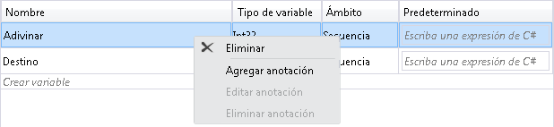
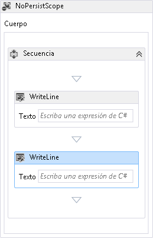
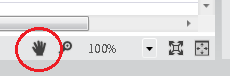
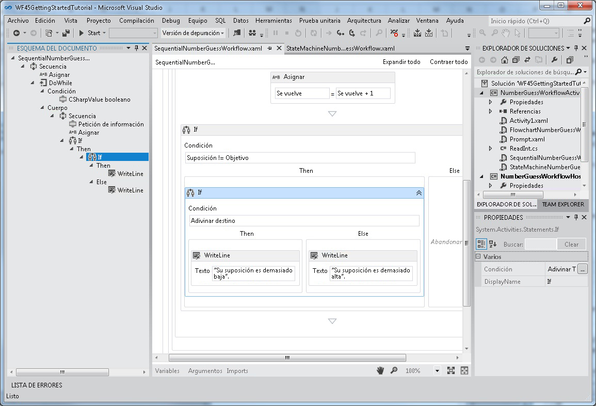
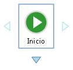
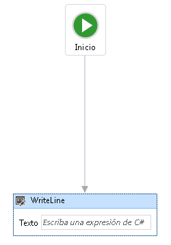
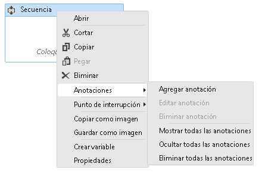

# <a name="what39s-new-in-windows-workflow-foundation-in-net-45"></a><span data-ttu-id="33e6a-102">¿Qué&#39;s de Windows Workflow Foundation en .NET Framework 4.5</span><span class="sxs-lookup"><span data-stu-id="33e6a-102">What&#39;s New in Windows Workflow Foundation in .NET 4.5</span></span>
<span data-ttu-id="33e6a-103">Windows Workflow Foundation (WF) en [!INCLUDE[net_v45](../../../includes/net-v45-md.md)] presenta muchas características nuevas, como nuevas actividades, funciones de diseñador y modelos de desarrollo de flujo de trabajo.</span><span class="sxs-lookup"><span data-stu-id="33e6a-103">Windows Workflow Foundation (WF) in [!INCLUDE[net_v45](../../../includes/net-v45-md.md)] introduces many new features, such as new activities, designer capabilities, and workflow development models.</span></span> <span data-ttu-id="33e6a-104">Aunque no todas, muchas de las nuevas características de flujo de trabajo presentadas en [!INCLUDE[net_v45](../../../includes/net-v45-md.md)] se admiten en el diseñador de flujo de trabajo que se ha vuelto a hospedar.</span><span class="sxs-lookup"><span data-stu-id="33e6a-104">Many, but not all, of the new workflow features introduced in [!INCLUDE[net_v45](../../../includes/net-v45-md.md)] are supported in the re-hosted workflow designer.</span></span> [!INCLUDE[crabout](../../../includes/crabout-md.md)]<span data-ttu-id="33e6a-105"> las nuevas características que se admiten, consulte [compatibilidad con nuevas características de flujo de trabajo Foundation 4.5 en el Diseñador de flujo de trabajo Rehospedados](../../../docs/framework/windows-workflow-foundation/wf-features-in-the-rehosted-workflow-designer.md).</span><span class="sxs-lookup"><span data-stu-id="33e6a-105"> the new features that are supported, see [Support for New Workflow Foundation 4.5 Features in the Rehosted Workflow Designer](../../../docs/framework/windows-workflow-foundation/wf-features-in-the-rehosted-workflow-designer.md).</span></span> [!INCLUDE[crabout](../../../includes/crabout-md.md)]<span data-ttu-id="33e6a-106"> migración de .NET 3.0 y 3.5 de .NET de aplicaciones de flujo de trabajo para usar la versión más reciente, consulte [Guía de migración](../../../docs/framework/windows-workflow-foundation/migration-guidance.md).</span><span class="sxs-lookup"><span data-stu-id="33e6a-106"> migrating .NET 3.0 and .NET 3.5 workflow applications to use the latest version, see [Migration Guidance](../../../docs/framework/windows-workflow-foundation/migration-guidance.md).</span></span> <span data-ttu-id="33e6a-107">Este tema proporciona información general de las nuevas características de flujo de trabajo presentadas en [!INCLUDE[net_v45](../../../includes/net-v45-md.md)].</span><span class="sxs-lookup"><span data-stu-id="33e6a-107">This topic provides an overview of the new workflow features introduced in [!INCLUDE[net_v45](../../../includes/net-v45-md.md)].</span></span>  
  
> [!WARNING]
>  <span data-ttu-id="33e6a-108">Las nuevas características de Windows Workflow Foundation introducidas en [!INCLUDE[net_v45](../../../includes/net-v45-md.md)] no están disponibles para los proyectos que tienen como destino versiones anteriores de framework.</span><span class="sxs-lookup"><span data-stu-id="33e6a-108">The new Windows Workflow Foundation features introduced in [!INCLUDE[net_v45](../../../includes/net-v45-md.md)] are not available for projects that target previous versions of the framework.</span></span> <span data-ttu-id="33e6a-109">Si un proyecto destinado a [!INCLUDE[net_v45](../../../includes/net-v45-md.md)] se reorienta a una versión anterior del marco de trabajo, puede que haya varios problemas.</span><span class="sxs-lookup"><span data-stu-id="33e6a-109">If a project that targets [!INCLUDE[net_v45](../../../includes/net-v45-md.md)] is re-targeted to a previous version of the framework, several issues can occur.</span></span>  
>   
>  -   <span data-ttu-id="33e6a-110">Expresiones de C# se reemplazará en el diseñador con el mensaje **valor se estableció en XAML**.</span><span class="sxs-lookup"><span data-stu-id="33e6a-110">C# expressions will be replaced in the designer with the message **Value was set in XAML**.</span></span>  
> -   <span data-ttu-id="33e6a-111">Aparecerán muchos errores de compilación, incluido el siguiente.</span><span class="sxs-lookup"><span data-stu-id="33e6a-111">Many build errors will occur, including the following error.</span></span>  
>   
>  <span data-ttu-id="33e6a-112">**El formato de archivo no es compatible con .NET framework de destino actual. Para convertir el formato de archivo, guarde explícitamente el archivo. Este mensaje de error desaparecerá después de guardar el archivo y vuelva a abrir el diseñador.**</span><span class="sxs-lookup"><span data-stu-id="33e6a-112">**The file format is not compatible with current targeting framework. To convert the file format, please explicitly save the file. This error message will go away after you save the file and reopen the designer.**</span></span>  
  
##  <a name="BKMK_Versioning"></a> <span data-ttu-id="33e6a-113">Control de versiones de flujo de trabajo</span><span class="sxs-lookup"><span data-stu-id="33e6a-113">Workflow Versioning</span></span>  
 [!INCLUDE[net_v45](../../../includes/net-v45-md.md)]<span data-ttu-id="33e6a-114"> ha presentado nuevas características de control de versiones basadas en la nueva clase <xref:System.Activities.WorkflowIdentity>.</span><span class="sxs-lookup"><span data-stu-id="33e6a-114"> introduced several new versioning features based around the new <xref:System.Activities.WorkflowIdentity> class.</span></span> <span data-ttu-id="33e6a-115"><xref:System.Activities.WorkflowIdentity> proporciona a los autores de la aplicación de flujo de trabajo un mecanismo para asignar una instancia de flujo de trabajo persistente con su definición.</span><span class="sxs-lookup"><span data-stu-id="33e6a-115"><xref:System.Activities.WorkflowIdentity> provides workflow application authors a mechanism for mapping a persisted workflow instance with its definition.</span></span>  
  
-   <span data-ttu-id="33e6a-116">Los desarrolladores que usen el hospedaje <xref:System.Activities.WorkflowApplication> pueden usar <xref:System.Activities.WorkflowIdentity> para habilitar el hospedaje de varias versiones de un flujo de trabajo en paralelo.</span><span class="sxs-lookup"><span data-stu-id="33e6a-116">Developers using <xref:System.Activities.WorkflowApplication> hosting can use <xref:System.Activities.WorkflowIdentity> to enable hosting multiple versions of a workflow side-by-side.</span></span> <span data-ttu-id="33e6a-117">Las instancias de flujo de trabajo persistentes se pueden cargar mediante la nueva clase <xref:System.Activities.WorkflowApplicationInstance> y el host puede usar <xref:System.Activities.WorkflowApplicationInstance.DefinitionIdentity%2A> para proporcionar la versión correcta de la definición de flujo de trabajo al crear instancias de <xref:System.Activities.WorkflowApplication>.</span><span class="sxs-lookup"><span data-stu-id="33e6a-117">Persisted workflow instances can be loaded using the new <xref:System.Activities.WorkflowApplicationInstance> class, and then the <xref:System.Activities.WorkflowApplicationInstance.DefinitionIdentity%2A> can be used by the host to provide the correct version of the workflow definition when instantiating the <xref:System.Activities.WorkflowApplication>.</span></span> <span data-ttu-id="33e6a-118">Para obtener más información, consulte [utilizando WorkflowIdentity y control de versiones](../../../docs/framework/windows-workflow-foundation/using-workflowidentity-and-versioning.md) y [Cómo: Host varias versiones de un flujo de trabajo paralelo](../../../docs/framework/windows-workflow-foundation/how-to-host-multiple-versions-of-a-workflow-side-by-side.md).</span><span class="sxs-lookup"><span data-stu-id="33e6a-118">For more information, see [Using WorkflowIdentity and Versioning](../../../docs/framework/windows-workflow-foundation/using-workflowidentity-and-versioning.md) and [How to: Host Multiple Versions of a Workflow Side-by-Side](../../../docs/framework/windows-workflow-foundation/how-to-host-multiple-versions-of-a-workflow-side-by-side.md).</span></span>  
  
-   <span data-ttu-id="33e6a-119"><xref:System.ServiceModel.WorkflowServiceHost> es ahora un host multiversión.</span><span class="sxs-lookup"><span data-stu-id="33e6a-119"><xref:System.ServiceModel.WorkflowServiceHost> is now a multi-version host.</span></span> <span data-ttu-id="33e6a-120">Cuando se implementa una nueva versión de un servicio de flujo de trabajo, se crean nuevas instancias mediante el nuevo servicio, pero las instancias existentes se completan mediante la versión anterior.</span><span class="sxs-lookup"><span data-stu-id="33e6a-120">When a new version of a workflow service is deployed, new instances are created using the new service, but existing instances complete using the previous version.</span></span> <span data-ttu-id="33e6a-121">Para obtener más información, consulte [control de versiones en paralelo en WorkflowServiceHost](../../../docs/framework/wcf/feature-details/side-by-side-versioning-in-workflowservicehost.md).</span><span class="sxs-lookup"><span data-stu-id="33e6a-121">For more information, see [Side by Side Versioning in WorkflowServiceHost](../../../docs/framework/wcf/feature-details/side-by-side-versioning-in-workflowservicehost.md).</span></span>  
  
-   <span data-ttu-id="33e6a-122">Se incluye la actualización dinámica que proporciona un mecanismo para actualizar la definición de una instancia de flujo de trabajo persistente.</span><span class="sxs-lookup"><span data-stu-id="33e6a-122">Dynamic update is introduced which provides a mechanism for updating the definition of a persisted workflow instance.</span></span> <span data-ttu-id="33e6a-123">Para obtener más información, consulte [actualización dinámica](../../../docs/framework/windows-workflow-foundation/dynamic-update.md) y [Cómo: actualizar la definición de una instancia de flujo de trabajo ejecuta](../../../docs/framework/windows-workflow-foundation/how-to-update-the-definition-of-a-running-workflow-instance.md).</span><span class="sxs-lookup"><span data-stu-id="33e6a-123">For more information, see [Dynamic Update](../../../docs/framework/windows-workflow-foundation/dynamic-update.md) and [How to: Update the Definition of a Running Workflow Instance](../../../docs/framework/windows-workflow-foundation/how-to-update-the-definition-of-a-running-workflow-instance.md).</span></span>  
  
-   <span data-ttu-id="33e6a-124">Se proporciona un script de base de datos SqlWorkflowInstanceStoreSchemaUpgrade.sql para actualizar las bases de datos de persistencia creadas mediante los scripts de base de datos de [!INCLUDE[netfx40_short](../../../includes/netfx40-short-md.md)].</span><span class="sxs-lookup"><span data-stu-id="33e6a-124">A SqlWorkflowInstanceStoreSchemaUpgrade.sql database script is provided to upgrade persistence databases created using the [!INCLUDE[netfx40_short](../../../includes/netfx40-short-md.md)] database scripts.</span></span> <span data-ttu-id="33e6a-125">Este script actualiza las bases de datos de persistencia de [!INCLUDE[netfx40_short](../../../includes/netfx40-short-md.md)] para admitir las nuevas funciones de control de versiones presentadas en [!INCLUDE[net_v45](../../../includes/net-v45-md.md)].</span><span class="sxs-lookup"><span data-stu-id="33e6a-125">This script updates [!INCLUDE[netfx40_short](../../../includes/netfx40-short-md.md)] persistence databases to support the new versioning capabilities introduced in [!INCLUDE[net_v45](../../../includes/net-v45-md.md)].</span></span> <span data-ttu-id="33e6a-126">Las instancias de flujo de trabajo persistentes en la base de datos reciben valores de control de versión predeterminados y pueden participar en ejecuciones en paralelo y en actualizaciones dinámicas.</span><span class="sxs-lookup"><span data-stu-id="33e6a-126">The persisted workflow instances in the database are given default versioning values, and can participate in side-by-side execution and dynamic update.</span></span> <span data-ttu-id="33e6a-127">Para obtener más información, consulte [actualizar .NET Framework 4 persistencia bases de datos al control de versiones de flujo de trabajo de compatibilidad con](../../../docs/framework/windows-workflow-foundation/using-workflowidentity-and-versioning.md#UpdatingWF4PersistenceDatabases).</span><span class="sxs-lookup"><span data-stu-id="33e6a-127">For more information, see [Upgrading .NET Framework 4 Persistence Databases to Support Workflow Versioning](../../../docs/framework/windows-workflow-foundation/using-workflowidentity-and-versioning.md#UpdatingWF4PersistenceDatabases).</span></span>  
  
##  <a name="BKMK_NewActivities"></a> <span data-ttu-id="33e6a-128">Actividades</span><span class="sxs-lookup"><span data-stu-id="33e6a-128">Activities</span></span>  
 <span data-ttu-id="33e6a-129">La biblioteca integrada de actividades contiene nuevas actividades y características para las actividades existentes.</span><span class="sxs-lookup"><span data-stu-id="33e6a-129">The built-in activity library contains new activities and new features for existing activities.</span></span>  
  
###  <a name="BKMK_NoPersistScope"></a> <span data-ttu-id="33e6a-130">Ámbito de NoPersist</span><span class="sxs-lookup"><span data-stu-id="33e6a-130">NoPersist Scope</span></span>  
 <span data-ttu-id="33e6a-131"><xref:System.Activities.Statements.NoPersistScope> es una nueva actividad de contenedor que impide que un flujo de trabajo sea persistente cuando se están ejecutando actividades secundarias de NoPersistScope.</span><span class="sxs-lookup"><span data-stu-id="33e6a-131"><xref:System.Activities.Statements.NoPersistScope> is a new container activity that prevents a workflow from being persisted when the NoPersistScope’s child activities are executing.</span></span> <span data-ttu-id="33e6a-132">Esto es útil en escenarios donde no es apropiado que el flujo de trabajo sea persistente, por ejemplo, cuando el flujo de trabajo está usando recursos específicos del equipo como identificadores de archivo o durante transacciones de base de datos.</span><span class="sxs-lookup"><span data-stu-id="33e6a-132">This is useful in scenarios where it is not appropriate for the workflow to be persisted, such as when the workflow is using machine-specific resources such as file handles, or during database transactions.</span></span> <span data-ttu-id="33e6a-133">Anteriormente, para evitar la persistencia durante la ejecución de una actividad, era necesaria una <xref:System.Activities.NativeActivity> personalizada que usara un <xref:System.Activities.NoPersistHandle>.</span><span class="sxs-lookup"><span data-stu-id="33e6a-133">Previously, to prevent persistence from occurring during an activity's execution, a custom <xref:System.Activities.NativeActivity> that used a <xref:System.Activities.NoPersistHandle> was required.</span></span>  
  
###  <a name="BKMK_NewFlowchartCapabilities"></a> <span data-ttu-id="33e6a-134">Nuevas capacidades de diagrama de flujo</span><span class="sxs-lookup"><span data-stu-id="33e6a-134">New Flowchart Capabilities</span></span>  
 <span data-ttu-id="33e6a-135">Se han actualizado los diagramas de flujo para [!INCLUDE[net_v45](../../../includes/net-v45-md.md)] y tienen las siguientes capacidades nuevas:</span><span class="sxs-lookup"><span data-stu-id="33e6a-135">Flowcharts are updated for [!INCLUDE[net_v45](../../../includes/net-v45-md.md)] and have the following new capabilities:</span></span>  
  
-   <span data-ttu-id="33e6a-136">Se puede editar la propiedad `DisplayName` de una actividad <xref:System.Activities.Statements.FlowSwitch%601> o <xref:System.Activities.Statements.FlowDecision>.</span><span class="sxs-lookup"><span data-stu-id="33e6a-136">The `DisplayName` property of a <xref:System.Activities.Statements.FlowSwitch%601> or <xref:System.Activities.Statements.FlowDecision> activity is editable.</span></span> <span data-ttu-id="33e6a-137">Esto permitirá al diseñador de actividades mostrar más información sobre el propósito de la actividad.</span><span class="sxs-lookup"><span data-stu-id="33e6a-137">This will let the activity designer show more information about the activity's purpose.</span></span>  
  
-   <span data-ttu-id="33e6a-138">Los diagramas de flujo tienen una nueva propiedad denominada <xref:System.Activities.Statements.Flowchart.ValidateUnconnectedNodes%2A>; el valor predeterminado para esta propiedad es `False`.</span><span class="sxs-lookup"><span data-stu-id="33e6a-138">Flowcharts have a new property called <xref:System.Activities.Statements.Flowchart.ValidateUnconnectedNodes%2A>; the default for this property is `False`.</span></span> <span data-ttu-id="33e6a-139">Si esta propiedad se establece en `True`, los nodos no conectados del diagrama de flujo generarán errores de validación.</span><span class="sxs-lookup"><span data-stu-id="33e6a-139">If this property is set to `True`, then unconnected flowchart nodes will produce validation errors.</span></span>  
  
## <a name="support-for-partial-trust"></a><span data-ttu-id="33e6a-140">Compatibilidad con la confianza parcial</span><span class="sxs-lookup"><span data-stu-id="33e6a-140">Support for Partial Trust</span></span>  
 <span data-ttu-id="33e6a-141">Los flujos de trabajo en [!INCLUDE[netfx40_long](../../../includes/netfx40-long-md.md)] requerían un dominio de aplicación de plena confianza.</span><span class="sxs-lookup"><span data-stu-id="33e6a-141">Workflows in [!INCLUDE[netfx40_long](../../../includes/netfx40-long-md.md)] required a fully trusted application domain.</span></span> <span data-ttu-id="33e6a-142">En [!INCLUDE[net_v45](../../../includes/net-v45-md.md)], los flujos de trabajo pueden funcionar en un entorno de confianza parcial.</span><span class="sxs-lookup"><span data-stu-id="33e6a-142">In [!INCLUDE[net_v45](../../../includes/net-v45-md.md)], workflows can operate in a partial trust environment.</span></span> <span data-ttu-id="33e6a-143">En un entorno de confianza parcial, los componentes de terceros se pueden usar sin garantizarles acceso completo a los recursos del host.</span><span class="sxs-lookup"><span data-stu-id="33e6a-143">In a partial trust environment, third-party components can be used without granting them full access to the resources of the host.</span></span> <span data-ttu-id="33e6a-144">A continuación, se presentan algunas cuestiones sobre la ejecución de flujos de trabajo en confianza parcial:</span><span class="sxs-lookup"><span data-stu-id="33e6a-144">Some concerns about running workflows in partial trust are as follows:</span></span>  
  
1.  <span data-ttu-id="33e6a-145">El uso de componentes heredados (incluidas las reglas) incluidos en la actividad <xref:System.Activities.Statements.Interop> no se admite en la confianza parcial.</span><span class="sxs-lookup"><span data-stu-id="33e6a-145">Using legacy components (including Rules) contained in the <xref:System.Activities.Statements.Interop> activity is not supported under partial trust.</span></span>  
  
2.  <span data-ttu-id="33e6a-146">No se admite la ejecución de flujos de trabajo en confianza parcial en <xref:System.ServiceModel.WorkflowServiceHost>.</span><span class="sxs-lookup"><span data-stu-id="33e6a-146">Running workflows in partial trust in <xref:System.ServiceModel.WorkflowServiceHost> is not supported.</span></span>  
  
3.  <span data-ttu-id="33e6a-147">La persistencia de excepciones en un escenario de confianza parcial constituye una amenaza de seguridad potencial.</span><span class="sxs-lookup"><span data-stu-id="33e6a-147">Persisting exceptions in a partial-trust scenario is a potential security threat.</span></span> <span data-ttu-id="33e6a-148">Para deshabilitar la persistencia de excepciones, se debe agregar una extensión de tipo <xref:System.Activities.ExceptionPersistenceExtension> al proyecto con el fin de descartar la persistencia de las excepciones.</span><span class="sxs-lookup"><span data-stu-id="33e6a-148">To disable persisting of exceptions, an extension of type <xref:System.Activities.ExceptionPersistenceExtension> must be added to the project in order to opt out of persisting exceptions.</span></span> <span data-ttu-id="33e6a-149">En el ejemplo de código siguiente, se muestra cómo implementar este tipo.</span><span class="sxs-lookup"><span data-stu-id="33e6a-149">The following code example demonstrates how to implement this type.</span></span>  
  
    ```  
    public class ExceptionPersistenceExtension   
    {  
        public ExceptionPersistenceExtension()   
        {   
            this.PersistExceptions = false;   
        }   
        public bool PersistExceptions { get; set; }   
    }  
    ```  
  
     <span data-ttu-id="33e6a-150">Si no se tienen que serializar excepciones, asegúrese de que se usan en un objeto <xref:System.Activities.Statements.NoPersistScope>.</span><span class="sxs-lookup"><span data-stu-id="33e6a-150">If exceptions are not to be serialized, ensure that exceptions are used within a <xref:System.Activities.Statements.NoPersistScope>.</span></span>  
  
4.  <span data-ttu-id="33e6a-151">Los autores de actividades deben invalidar <xref:System.Activities.Activity.CacheMetadata%2A> para que el runtime del flujo de trabajo ejecute la reflexión automáticamente en el tipo.</span><span class="sxs-lookup"><span data-stu-id="33e6a-151">Activity authors should override <xref:System.Activities.Activity.CacheMetadata%2A> to avoid having the workflow runtime automatically execute reflection against the type.</span></span> <span data-ttu-id="33e6a-152">Los argumentos y las actividades secundarias no deben ser NULL y se debe llamar a <xref:System.Activities.ActivityMetadata.Bind%2A> explícitamente.</span><span class="sxs-lookup"><span data-stu-id="33e6a-152">Arguments and child activities must be non-null, and <xref:System.Activities.ActivityMetadata.Bind%2A> must be called explicitly.</span></span> <span data-ttu-id="33e6a-153">Para obtener más información sobre cómo reemplazar <xref:System.Activities.Activity.CacheMetadata%2A>, consulte [exponer datos con CacheMetadata](../../../docs/framework/windows-workflow-foundation/exposing-data-with-cachemetadata.md).</span><span class="sxs-lookup"><span data-stu-id="33e6a-153">For more information on overriding <xref:System.Activities.Activity.CacheMetadata%2A>, see [Exposing data with CacheMetadata](../../../docs/framework/windows-workflow-foundation/exposing-data-with-cachemetadata.md).</span></span> <span data-ttu-id="33e6a-154">Además, las instancias de los argumentos que son de un tipo que es `internal` o **privada** debe crearse explícitamente en <xref:System.Activities.Activity.CacheMetadata%2A> para evitar la creación por reflexión.</span><span class="sxs-lookup"><span data-stu-id="33e6a-154">Also, instances of arguments that are of a type that is `internal` or **private** must be explicitly created in  <xref:System.Activities.Activity.CacheMetadata%2A> to avoid being created by reflection.</span></span>  
  
5.  <span data-ttu-id="33e6a-155">Los tipos no usarán <xref:System.Runtime.Serialization.ISerializable> o <xref:System.SerializableAttribute> para la serialización; los tipos que se van a serializar deben admitir <xref:System.Runtime.Serialization.DataContractSerializer>.</span><span class="sxs-lookup"><span data-stu-id="33e6a-155">Types will not use <xref:System.Runtime.Serialization.ISerializable> or <xref:System.SerializableAttribute> for serialization; types that are to be serialized must support <xref:System.Runtime.Serialization.DataContractSerializer>.</span></span>  
  
6.  <span data-ttu-id="33e6a-156">Las expresiones que usan <xref:System.Activities.Expressions.LambdaValue%601> requieren <xref:System.Security.Permissions.ReflectionPermissionAttribute.RestrictedMemberAccess%2A> y, por lo tanto, no funcionarán con la confianza parcial.</span><span class="sxs-lookup"><span data-stu-id="33e6a-156">Expressions that use <xref:System.Activities.Expressions.LambdaValue%601> require <xref:System.Security.Permissions.ReflectionPermissionAttribute.RestrictedMemberAccess%2A>, and thus will not work under partial trust.</span></span> <span data-ttu-id="33e6a-157">Los flujos de trabajo que usan <xref:System.Activities.Expressions.LambdaValue%601> deben reemplazar dichas expresiones por actividades que se deriven de <xref:System.Activities.CodeActivity%601>.</span><span class="sxs-lookup"><span data-stu-id="33e6a-157">Workflows that use <xref:System.Activities.Expressions.LambdaValue%601> should replace those expressions with activities that derive from <xref:System.Activities.CodeActivity%601>.</span></span> <span data-ttu-id="33e6a-158">.</span><span class="sxs-lookup"><span data-stu-id="33e6a-158">.</span></span>  
  
7.  <span data-ttu-id="33e6a-159">Las expresiones no se pueden compilar mediante <xref:System.Activities.XamlIntegration.TextExpressionCompiler> o el compilador hospedado de Visual Basic en confianza parcial, pero se pueden ejecutar las expresiones compiladas anteriormente.</span><span class="sxs-lookup"><span data-stu-id="33e6a-159">Expressions cannot be compiled using <xref:System.Activities.XamlIntegration.TextExpressionCompiler> or the Visual Basic hosted compiler in partial trust, but previously compiled expressions can be run.</span></span>  
  
8.  <span data-ttu-id="33e6a-160">Un único ensamblado que usa [transparencia de nivel 2](http://aka.ms/Level2Transparency) no se puede usar en [!INCLUDE[netfx40_short](../../../includes/netfx40-short-md.md)], [!INCLUDE[netfx_current_short](../../../includes/netfx-current-short-md.md)] en plena confianza, y [!INCLUDE[netfx_current_short](../../../includes/netfx-current-short-md.md)] en confianza parcial.</span><span class="sxs-lookup"><span data-stu-id="33e6a-160">A single assembly that uses [Level 2 Transparency](http://aka.ms/Level2Transparency) cannot be used in [!INCLUDE[netfx40_short](../../../includes/netfx40-short-md.md)], [!INCLUDE[netfx_current_short](../../../includes/netfx-current-short-md.md)] in full trust, and [!INCLUDE[netfx_current_short](../../../includes/netfx-current-short-md.md)] in partial trust.</span></span>  
  
##  <a name="BKMK_NewDesignerCapabilites"></a> <span data-ttu-id="33e6a-161">Nuevas capacidades de diseñador</span><span class="sxs-lookup"><span data-stu-id="33e6a-161">New Designer Capabilities</span></span>  
  
###  <a name="BKMK_DesignerSearch"></a> <span data-ttu-id="33e6a-162">Búsqueda de diseñador</span><span class="sxs-lookup"><span data-stu-id="33e6a-162">Designer Search</span></span>  
 <span data-ttu-id="33e6a-163">Para que los flujos de trabajo mayores sean más fáciles de administrar, ahora se pueden buscar flujos de trabajo por palabra clave.</span><span class="sxs-lookup"><span data-stu-id="33e6a-163">To make larger workflows more manageable, workflows can now be searched by keyword.</span></span> <span data-ttu-id="33e6a-164">Esta característica solo está disponible en Visual Studio; Esta característica no está disponible en un diseñador hospedado.</span><span class="sxs-lookup"><span data-stu-id="33e6a-164">This feature is only available in Visual Studio; this feature is not available in a rehosted designer.</span></span> <span data-ttu-id="33e6a-165">Hay dos tipos de búsquedas disponibles:</span><span class="sxs-lookup"><span data-stu-id="33e6a-165">There are two kinds of searches available:</span></span>  
  
-   <span data-ttu-id="33e6a-166">Búsqueda rápida, que se inicia con **CTRL+f** o **editar**, **buscar y reemplazar**, **búsqueda rápida**.</span><span class="sxs-lookup"><span data-stu-id="33e6a-166">Quick Find, initiated with either **Ctrl+F** or **Edit**, **Find and Replace**, **Quick Find**.</span></span>  
  
-   <span data-ttu-id="33e6a-167">Buscar en archivos, inicia con **Ctrl + Mayús + F** o **editar**, **buscar y reemplazar**, **buscar en archivos**.</span><span class="sxs-lookup"><span data-stu-id="33e6a-167">Find in Files, initiated with either **Ctrl+Shift+F** or **Edit**, **Find and Replace**, **Find in Files**.</span></span>  
  
 <span data-ttu-id="33e6a-168">Observe que Reemplazar no se admite.</span><span class="sxs-lookup"><span data-stu-id="33e6a-168">Note that Replace is not supported.</span></span>  
  
####  <a name="BKMK_QuickFind"></a> <span data-ttu-id="33e6a-169">Búsqueda rápida</span><span class="sxs-lookup"><span data-stu-id="33e6a-169">Quick Find</span></span>  
 <span data-ttu-id="33e6a-170">Las palabras clave buscadas en los flujos de trabajo coincidirán con los elementos del diseñador siguientes:</span><span class="sxs-lookup"><span data-stu-id="33e6a-170">Keywords searched in workflows will match the following designer items:</span></span>  
  
-   <span data-ttu-id="33e6a-171">Propiedades de los objetos <xref:System.Activities.Activity>, <xref:System.Activities.Statements.FlowNode>, <xref:System.Activities.Statements.State> y <xref:System.Activities.Statements.Transition>, así como otros elementos de control de flujo personalizados.</span><span class="sxs-lookup"><span data-stu-id="33e6a-171">Properties of <xref:System.Activities.Activity> objects, <xref:System.Activities.Statements.FlowNode> objects, <xref:System.Activities.Statements.State> objects, <xref:System.Activities.Statements.Transition> objects, and other custom flow-control items.</span></span>  
  
-   <span data-ttu-id="33e6a-172">Variables</span><span class="sxs-lookup"><span data-stu-id="33e6a-172">Variables</span></span>  
  
-   <span data-ttu-id="33e6a-173">Argumentos</span><span class="sxs-lookup"><span data-stu-id="33e6a-173">Arguments</span></span>  
  
-   <span data-ttu-id="33e6a-174">Expresiones</span><span class="sxs-lookup"><span data-stu-id="33e6a-174">Expressions</span></span>  
  
 <span data-ttu-id="33e6a-175">La búsqueda rápida se realiza en el árbol de <xref:System.Activities.Presentation.Model.ModelItem> del diseñador.</span><span class="sxs-lookup"><span data-stu-id="33e6a-175">Quick Find is performed on the designer's <xref:System.Activities.Presentation.Model.ModelItem> tree.</span></span> <span data-ttu-id="33e6a-176">La búsqueda rápida no encontrará espacios de nombres importados en la definición de flujo de trabajo.</span><span class="sxs-lookup"><span data-stu-id="33e6a-176">Quick Find will not locate namespaces imported in the workflow definition.</span></span>  
  
####  <a name="BKMK_FindInFiles"></a> <span data-ttu-id="33e6a-177">Buscar en archivos</span><span class="sxs-lookup"><span data-stu-id="33e6a-177">Find in Files</span></span>  
 <span data-ttu-id="33e6a-178">Las palabras clave buscadas en flujos de trabajo coincidirán con el contenido real de los archivos de flujo de trabajo.</span><span class="sxs-lookup"><span data-stu-id="33e6a-178">Keywords searched in workflows will match the actual content of the workflow files.</span></span> <span data-ttu-id="33e6a-179">Los resultados de la búsqueda se mostrarán en el panel de la vista Resultados de la búsqueda de Visual Studio.</span><span class="sxs-lookup"><span data-stu-id="33e6a-179">The search results will be shown in Visual Studio Find Results view pane.</span></span> <span data-ttu-id="33e6a-180">Al hacer doble clic, el elemento de resultado navegará a la actividad que contiene la coincidencia en el diseñador de flujo de trabajo.</span><span class="sxs-lookup"><span data-stu-id="33e6a-180">Double-clicking the result item will navigate to the activity which contains the match in workflow designer.</span></span>  
  
###  <a name="BKMK_VariableDeleteContextMenu"></a> <span data-ttu-id="33e6a-181">Eliminar un elemento de menú contextual en el Diseñador de variables y argumentos</span><span class="sxs-lookup"><span data-stu-id="33e6a-181">Delete context menu item in variable and argument designer</span></span>  
 <span data-ttu-id="33e6a-182">En [!INCLUDE[netfx40_short](../../../includes/netfx40-short-md.md)], las variables y los argumentos solo se podían eliminar en el diseñador con el teclado.</span><span class="sxs-lookup"><span data-stu-id="33e6a-182">In [!INCLUDE[netfx40_short](../../../includes/netfx40-short-md.md)], variables and arguments could only be deleted in the designer using the keyboard.</span></span> <span data-ttu-id="33e6a-183">A partir de [!INCLUDE[net_v45](../../../includes/net-v45-md.md)], las variables y los argumentos se pueden eliminar mediante el menú contextual.</span><span class="sxs-lookup"><span data-stu-id="33e6a-183">Starting with [!INCLUDE[net_v45](../../../includes/net-v45-md.md)], variables and arguments can be deleted using the context menu.</span></span>  
  
 <span data-ttu-id="33e6a-184">En la captura de pantalla siguiente se muestra el menú contextual del diseñador de variables y argumentos.</span><span class="sxs-lookup"><span data-stu-id="33e6a-184">The following screenshot shows the variable and argument designer context menu.</span></span>  
  
 <span data-ttu-id="33e6a-185"></span><span class="sxs-lookup"><span data-stu-id="33e6a-185"></span></span>  
  
###  <a name="BKMK_AutoSurround"></a> <span data-ttu-id="33e6a-186">Rodear de forma automática con secuencia</span><span class="sxs-lookup"><span data-stu-id="33e6a-186">Auto-surround with Sequence</span></span>  
 <span data-ttu-id="33e6a-187">Debido a que un flujo de trabajo o determinadas actividades de contenedor (como <xref:System.Activities.Statements.NoPersistScope>) solo pueden contener una única actividad de cuerpo, para agregar una segunda actividad el desarrollador tenía que eliminar la primera actividad, agregar una actividad <xref:System.Activities.Statements.Sequence> y, a continuación, agregar ambas actividades a la actividad de secuencia.</span><span class="sxs-lookup"><span data-stu-id="33e6a-187">Since a workflow or certain container activities (such as <xref:System.Activities.Statements.NoPersistScope>) can only contain a single body activity, adding a second activity required the developer to delete the first activity, add a <xref:System.Activities.Statements.Sequence> activity, and then add both activities to the sequence activity.</span></span> <span data-ttu-id="33e6a-188">A partir de [!INCLUDE[net_v45](../../../includes/net-v45-md.md)], al agregar una segunda actividad a la superficie del diseñador, se creará una actividad `Sequence` automáticamente para incluir ambas actividades.</span><span class="sxs-lookup"><span data-stu-id="33e6a-188">Starting with [!INCLUDE[net_v45](../../../includes/net-v45-md.md)], when adding a second activity to the designer surface, a `Sequence` activity will be automatically created to wrap both activities.</span></span>  
  
 <span data-ttu-id="33e6a-189">La captura de pantalla siguiente muestra una actividad `WriteLine` en `Body` de `NoPersistScope`.</span><span class="sxs-lookup"><span data-stu-id="33e6a-189">The following screenshot shows a `WriteLine` activity in the `Body` of a `NoPersistScope`.</span></span>  
  
 <span data-ttu-id="33e6a-190"></span><span class="sxs-lookup"><span data-stu-id="33e6a-190"></span></span>  
  
 <span data-ttu-id="33e6a-191">La captura de pantalla siguiente muestra la actividad `Sequence` creada automáticamente en `Body` cuando se coloca un segundo elemento `WriteLine` debajo del primero.</span><span class="sxs-lookup"><span data-stu-id="33e6a-191">The following screenshot shows the automatically created `Sequence` activity in the `Body` when a second `WriteLine` is dropped below the first.</span></span>  
  
 <span data-ttu-id="33e6a-192"></span><span class="sxs-lookup"><span data-stu-id="33e6a-192"></span></span>  
  
###  <a name="BKMK_PanMode"></a> <span data-ttu-id="33e6a-193">Modo panorámico</span><span class="sxs-lookup"><span data-stu-id="33e6a-193">Pan Mode</span></span>  
 <span data-ttu-id="33e6a-194">Para navegar con mayor facilidad en un flujo de trabajo grande en el diseñador, se puede habilitar el modo panorámico, lo que permite al desarrollador hacer clic y arrastrar para mover la parte visible del flujo de trabajo, en lugar de tener que usar las barras de desplazamiento.</span><span class="sxs-lookup"><span data-stu-id="33e6a-194">To more easily navigate a large workflow in the designer, pan mode can be enabled, allowing the developer to click and drag to move the visible portion of the workflow, rather than needing to use the scroll bars.</span></span> <span data-ttu-id="33e6a-195">El botón para activar el modo panorámico está en la esquina inferior derecha del diseñador.</span><span class="sxs-lookup"><span data-stu-id="33e6a-195">The button to activate pan mode is in the lower right corner of the designer.</span></span>  
  
 <span data-ttu-id="33e6a-196">En la captura de pantalla siguiente se muestra el botón de panorámica que se encuentra en la esquina inferior derecha del diseñador de flujo de trabajo.</span><span class="sxs-lookup"><span data-stu-id="33e6a-196">The following screenshot shows the pan button which is located at the bottom right corner of the workflow designer.</span></span>  
  
 <span data-ttu-id="33e6a-197"></span><span class="sxs-lookup"><span data-stu-id="33e6a-197"></span></span>  
  
 <span data-ttu-id="33e6a-198">El botón central del mouse o la barra espaciadora también se pueden usar para aplicar la panorámica al diseñador de flujo de trabajo.</span><span class="sxs-lookup"><span data-stu-id="33e6a-198">The middle mouse button or space bar can also be used to pan the workflow designer.</span></span>  
  
###  <a name="BKMK_MultiSelect"></a> <span data-ttu-id="33e6a-199">Selección múltiple</span><span class="sxs-lookup"><span data-stu-id="33e6a-199">Multi-select</span></span>  
 <span data-ttu-id="33e6a-200">Se pueden seleccionar varias actividades al mismo tiempo; para ello, se arrastra un rectángulo alrededor de ellas (cuando no se ha habilitado el modo panorámico) o manteniendo presionada la tecla CTRL y se hace clic en las actividades deseadas una por una.</span><span class="sxs-lookup"><span data-stu-id="33e6a-200">Multiple activities can be selected at one time, either by dragging a rectangle around them (when pan mode is not enabled), or by holding down Ctrl and click the desired activities one by one.</span></span>  
  
 <span data-ttu-id="33e6a-201">Asimismo, se pueden arrastrar y colocar en el diseñador selecciones múltiples de actividad, y también se puede interactuar con ellas mediante el menú contextual.</span><span class="sxs-lookup"><span data-stu-id="33e6a-201">Multiple activity selections can also be dragged and dropped within the designer, and can also be interacted with using the context menu.</span></span>  
  
###  <a name="BKMK_DocumentOutline"></a> <span data-ttu-id="33e6a-202">Vista de esquema de elementos de flujo de trabajo</span><span class="sxs-lookup"><span data-stu-id="33e6a-202">Outline view of workflow items</span></span>  
 <span data-ttu-id="33e6a-203">Para que sea más fácil navegar en los flujos de trabajo jerárquicos, los componentes de un flujo de trabajo se muestran en una vista de esquema de árbol.</span><span class="sxs-lookup"><span data-stu-id="33e6a-203">In order to make hierarchical workflows easier to navigate, components of a workflow are shown in a tree-style outline view.</span></span> <span data-ttu-id="33e6a-204">La vista esquema se muestra en el **esquema del documento** vista.</span><span class="sxs-lookup"><span data-stu-id="33e6a-204">The outline view is displayed in the **Document Outline** view.</span></span> <span data-ttu-id="33e6a-205">Para abrir esta vista, en el menú superior, seleccione **vista**, **otras ventanas**, **esquema del documento**, o presione Ctrl W, U.</span><span class="sxs-lookup"><span data-stu-id="33e6a-205">To open this view, from the top menu, select **View**, **Other Windows**, **Document Outline**, or press Ctrl W,U.</span></span> <span data-ttu-id="33e6a-206">Al hacer clic en un nodo en la vista de esquema navegará a la actividad correspondiente en el diseñador de flujo de trabajo, y la vista de esquema se actualizará para mostrar las actividades seleccionadas en el diseñador.</span><span class="sxs-lookup"><span data-stu-id="33e6a-206">Clicking on a node in outline view will navigate to the corresponding activity in the workflow designer, and the outline view will be updated to show activities that are selected in the designer.</span></span>  
  
 <span data-ttu-id="33e6a-207">La siguiente captura de pantalla de flujo de trabajo completado de la [Tutorial de introducción](../../../docs/framework/windows-workflow-foundation/getting-started-tutorial.md) muestra la vista de esquema con un flujo de trabajo secuencial.</span><span class="sxs-lookup"><span data-stu-id="33e6a-207">The following screenshot of the completed workflow from the [Getting Started Tutorial](../../../docs/framework/windows-workflow-foundation/getting-started-tutorial.md) shows the outline view with a sequential workflow.</span></span>  
  
 <span data-ttu-id="33e6a-208"></span><span class="sxs-lookup"><span data-stu-id="33e6a-208"></span></span>  
  
###  <a name="BKMK_CSharpExpressions"></a> <span data-ttu-id="33e6a-209">Expresiones de C#</span><span class="sxs-lookup"><span data-stu-id="33e6a-209">C# Expressions</span></span>  
 <span data-ttu-id="33e6a-210">Antes de [!INCLUDE[net_v45](../../../includes/net-v45-md.md)], todas las expresiones de flujos de trabajo solo se podían escribir en Visual Basic.</span><span class="sxs-lookup"><span data-stu-id="33e6a-210">Prior to [!INCLUDE[net_v45](../../../includes/net-v45-md.md)], all expressions in workflows could only be written in Visual Basic.</span></span> <span data-ttu-id="33e6a-211">En [!INCLUDE[net_v45](../../../includes/net-v45-md.md)], las expresiones de Visual Basic solo se usan para los proyectos creados con Visual Basic.</span><span class="sxs-lookup"><span data-stu-id="33e6a-211">In [!INCLUDE[net_v45](../../../includes/net-v45-md.md)], Visual Basic expressions are only used for projects created using Visual Basic.</span></span> <span data-ttu-id="33e6a-212">Los proyectos de Visual C# ahora usan C# para expresiones.</span><span class="sxs-lookup"><span data-stu-id="33e6a-212">Visual C# projects now use C# for expressions.</span></span> <span data-ttu-id="33e6a-213">Se proporciona un editor de expresiones de C# totalmente funcional con capacidades tales como resaltado de gramática e IntelliSense.</span><span class="sxs-lookup"><span data-stu-id="33e6a-213">A fully functional C# expression editor is provided which capabilities such as grammar highlighting and intellisense.</span></span> <span data-ttu-id="33e6a-214">Seguirán funcionando los proyectos de flujo de trabajo de C# creados en versiones anteriores que usan expresiones de Visual Basic.</span><span class="sxs-lookup"><span data-stu-id="33e6a-214">C# workflow projects created in previous versions that use Visual Basic expressions will continue to work.</span></span>  
  
 <span data-ttu-id="33e6a-215">Las expresiones de C# se validan en tiempo de diseño.</span><span class="sxs-lookup"><span data-stu-id="33e6a-215">C# expressions are validated at design-time.</span></span> <span data-ttu-id="33e6a-216">Los errores en las expresiones de C# se marcan con un subrayado ondulado rojo.</span><span class="sxs-lookup"><span data-stu-id="33e6a-216">Errors in C# expressions will be marked with a red wavy underline.</span></span>  
  
 [!INCLUDE[crabout](../../../includes/crabout-md.md)]<span data-ttu-id="33e6a-217"> Expresiones de C#, vea [expresiones de C#](../../../docs/framework/windows-workflow-foundation/csharp-expressions.md).</span><span class="sxs-lookup"><span data-stu-id="33e6a-217"> C# expressions, see [C# Expressions](../../../docs/framework/windows-workflow-foundation/csharp-expressions.md).</span></span>  
  
###  <a name="BKMK_Visibility"></a> <span data-ttu-id="33e6a-218">Más control de visibilidad de la barra de shell y de encabezado de los elementos</span><span class="sxs-lookup"><span data-stu-id="33e6a-218">More control of visibility of shell bar and header items</span></span>  
 <span data-ttu-id="33e6a-219">En un diseñador rehospedado, algunos de los controles estándar de la interfaz de usuario pueden no tener significado para un flujo de trabajo determinado y se pueden desactivar.</span><span class="sxs-lookup"><span data-stu-id="33e6a-219">In a rehosted designer, some of the standard UI controls may not have meaning for a given workflow, and may be turned off.</span></span> <span data-ttu-id="33e6a-220">En [!INCLUDE[netfx40_short](../../../includes/netfx40-short-md.md)], solo la barra de shell de la parte inferior del diseñador admite esta personalización.</span><span class="sxs-lookup"><span data-stu-id="33e6a-220">In [!INCLUDE[netfx40_short](../../../includes/netfx40-short-md.md)], this customization is only supported by the shell bar at the bottom of the designer.</span></span> <span data-ttu-id="33e6a-221">En [!INCLUDE[net_v45](../../../includes/net-v45-md.md)], la visibilidad de los elementos de encabezado de shell en la parte superior del diseñador puede ajustarse si se establece <xref:System.Activities.Presentation.View.DesignerView.WorkflowShellHeaderItemsVisibility%2A> con el valor adecuado de <xref:System.Activities.Presentation.View.ShellHeaderItemsVisibility>.</span><span class="sxs-lookup"><span data-stu-id="33e6a-221">In [!INCLUDE[net_v45](../../../includes/net-v45-md.md)], the visibility of shell header items at the top of the designer can be adjusted by setting <xref:System.Activities.Presentation.View.DesignerView.WorkflowShellHeaderItemsVisibility%2A> with the appropriate <xref:System.Activities.Presentation.View.ShellHeaderItemsVisibility> value.</span></span>  
  
###  <a name="BKMK_AutoConnect"></a> <span data-ttu-id="33e6a-222">La conexión automática e inserción automáticas en flujos de trabajo de diagrama de flujo y máquina de Estados</span><span class="sxs-lookup"><span data-stu-id="33e6a-222">Auto-connect and auto-insert in Flowchart and State Machine workflows</span></span>  
 <span data-ttu-id="33e6a-223">En [!INCLUDE[netfx40_short](../../../includes/netfx40-short-md.md)], las conexiones entre los nodos de un flujo de trabajo de diagrama de flujo tenían que agregarse manualmente.</span><span class="sxs-lookup"><span data-stu-id="33e6a-223">In [!INCLUDE[netfx40_short](../../../includes/netfx40-short-md.md)], connections between nodes in a Flowchart workflow had to be added manually.</span></span> <span data-ttu-id="33e6a-224">En [!INCLUDE[net_v45](../../../includes/net-v45-md.md)], los nodos de diagrama de flujo y de máquina de estados tienen puntos de conexión automática que se hacen visibles cuando se arrastra una actividad del cuadro de herramientas a la superficie del diseñador.</span><span class="sxs-lookup"><span data-stu-id="33e6a-224">In [!INCLUDE[net_v45](../../../includes/net-v45-md.md)], Flowchart and State Machine nodes have auto-connect points that become visible when an activity is dragged from the toolbox onto the designer surface.</span></span> <span data-ttu-id="33e6a-225">Al colocar una actividad en uno de estos puntos se agrega automáticamente la actividad junto con la conexión necesaria.</span><span class="sxs-lookup"><span data-stu-id="33e6a-225">Dropping an activity on one of these points automatically adds the activity along with the necessary connection.</span></span>  
  
 <span data-ttu-id="33e6a-226">La captura de pantalla siguiente muestra los puntos de unión que se hacen visibles cuando se arrastra una actividad desde el cuadro de herramientas.</span><span class="sxs-lookup"><span data-stu-id="33e6a-226">The following screenshot shows the attachment points that become visible when an activity is dragged from the toolbox.</span></span>  
  
 <span data-ttu-id="33e6a-227"></span><span class="sxs-lookup"><span data-stu-id="33e6a-227"></span></span>  
  
 <span data-ttu-id="33e6a-228">Las actividades también se pueden arrastrar a las conexiones entre los nodos y estados de un diagrama de flujo para insertar automáticamente el nodo entre otros dos nodos.</span><span class="sxs-lookup"><span data-stu-id="33e6a-228">Activities can also be dragged onto connections between flowchart nodes and states to auto-insert the node between two other nodes.</span></span> <span data-ttu-id="33e6a-229">La captura de pantalla siguiente muestra la línea de conexión resaltada donde se pueden arrastrar y colocar actividades del cuadro de herramientas.</span><span class="sxs-lookup"><span data-stu-id="33e6a-229">The following screenshot shows the highlighted connecting line where activities can be dragged from the toolbox and dropped.</span></span>  
  
 <span data-ttu-id="33e6a-230"></span><span class="sxs-lookup"><span data-stu-id="33e6a-230"></span></span>  
  
###  <a name="BKMK_Annotations"></a> <span data-ttu-id="33e6a-231">Anotaciones del diseñador</span><span class="sxs-lookup"><span data-stu-id="33e6a-231">Designer Annotations</span></span>  
 <span data-ttu-id="33e6a-232">Para facilitar el desarrollo de flujos de trabajo de mayor tamaño, el diseñador admite ahora agregar anotaciones para ayudar a realizar el seguimiento del proceso de diseño.</span><span class="sxs-lookup"><span data-stu-id="33e6a-232">To facilitate developing larger workflows, the designer now supports adding annotations to help keep track of the design process.</span></span> <span data-ttu-id="33e6a-233">Se pueden agregar anotaciones a actividades, estados, nodos del diagrama de flujo, variables y argumentos.</span><span class="sxs-lookup"><span data-stu-id="33e6a-233">Annotation can be added to activities, states, flowchart nodes, variables and arguments.</span></span> <span data-ttu-id="33e6a-234">En la captura de pantalla siguiente se muestra el menú contextual usado para agregar anotaciones al diseñador.</span><span class="sxs-lookup"><span data-stu-id="33e6a-234">The following screenshot shows the context menu used to add annotations to the designer.</span></span>  
  
 <span data-ttu-id="33e6a-235"></span><span class="sxs-lookup"><span data-stu-id="33e6a-235"></span></span>  
  
### <a name="debugging-states"></a><span data-ttu-id="33e6a-236">Estados de depuración</span><span class="sxs-lookup"><span data-stu-id="33e6a-236">Debugging states</span></span>  
 <span data-ttu-id="33e6a-237">En [!INCLUDE[netfx40_short](../../../includes/netfx40-short-md.md)], los elementos de no actividad no podían admitir puntos de interrupción de depuración porque no eran unidades de ejecución.</span><span class="sxs-lookup"><span data-stu-id="33e6a-237">In [!INCLUDE[netfx40_short](../../../includes/netfx40-short-md.md)], non-activity elements could not support debug breakpoints since they were not units of execution.</span></span> <span data-ttu-id="33e6a-238">Esta versión proporciona un mecanismo para agregar puntos de interrupción a objetos <xref:System.Activities.Statements.State>.</span><span class="sxs-lookup"><span data-stu-id="33e6a-238">This release provides a mechanism for adding breakpoints to <xref:System.Activities.Statements.State> objects.</span></span> <span data-ttu-id="33e6a-239">Cuando se establece un punto de interrupción en un <xref:System.Activities.Statements.State>, la ejecución se interrumpirá cuando se cambie al estado, antes de que se programen las actividades o desencadenadores de entrada.</span><span class="sxs-lookup"><span data-stu-id="33e6a-239">When a breakpoint is set on a <xref:System.Activities.Statements.State>, execution will break when the state is transitioned to, before its entry activities or triggers are scheduled.</span></span>  
  
###  <a name="BKMK_ActivityDelegates"></a> <span data-ttu-id="33e6a-240">Definir y usar objetos ActivityDelegate en el diseñador</span><span class="sxs-lookup"><span data-stu-id="33e6a-240">Define and consume ActivityDelegate objects in the designer</span></span>  
 <span data-ttu-id="33e6a-241">Las actividades de [!INCLUDE[netfx40_short](../../../includes/netfx40-short-md.md)] usaban objetos <xref:System.Activities.ActivityDelegate> para exponer puntos de ejecución donde otras partes del flujo de trabajo podían interactuar con la ejecución de un flujo de trabajo, pero para usar estos puntos de ejecución a menudo era necesaria una cantidad de código considerable.</span><span class="sxs-lookup"><span data-stu-id="33e6a-241">Activities in [!INCLUDE[netfx40_short](../../../includes/netfx40-short-md.md)] used <xref:System.Activities.ActivityDelegate> objects to expose execution points where other parts of the workflow could interact with a workflow's execution, but using these execution points usually required a fair amount of code.</span></span> <span data-ttu-id="33e6a-242">En esta versión, los desarrolladores pueden definir y usar delegados de actividad mediante el diseñador de flujo de trabajo.</span><span class="sxs-lookup"><span data-stu-id="33e6a-242">In this release, developers can define and consume activity delegates using the workflow designer.</span></span> <span data-ttu-id="33e6a-243">Para obtener más información, consulte [Cómo: definir y utilizar delegados de actividad en el Diseñador de flujo de trabajo](/visualstudio/workflow-designer/how-to-define-and-consume-activity-delegates-in-the-workflow-designer).</span><span class="sxs-lookup"><span data-stu-id="33e6a-243">For more information, see [How to: Define and consume activity delegates in the Workflow Designer](/visualstudio/workflow-designer/how-to-define-and-consume-activity-delegates-in-the-workflow-designer).</span></span>  
  
###  <a name="BKMK_BuildTimeValidation"></a> <span data-ttu-id="33e6a-244">Validación en tiempo de compilación</span><span class="sxs-lookup"><span data-stu-id="33e6a-244">Build-time validation</span></span>  
 <span data-ttu-id="33e6a-245">En [!INCLUDE[netfx40_short](../../../includes/netfx40-short-md.md)], los errores de validación del flujo de trabajo no se contaban como errores de compilación durante la compilación de un proyecto de flujo de trabajo.</span><span class="sxs-lookup"><span data-stu-id="33e6a-245">In [!INCLUDE[netfx40_short](../../../includes/netfx40-short-md.md)], workflow validation errors weren’t counted as build errors during the build of a workflow project.</span></span> <span data-ttu-id="33e6a-246">Esto significaba que la compilación de un proyecto de flujo de trabajo podía realizarse correctamente aunque hubiera errores de validación del flujo de trabajo.</span><span class="sxs-lookup"><span data-stu-id="33e6a-246">This meant that building a workflow project could succeed even when there were workflow validation errors.</span></span> <span data-ttu-id="33e6a-247">En [!INCLUDE[net_v45](../../../includes/net-v45-md.md)], los errores de validación del flujo de trabajo provocan un error en la compilación.</span><span class="sxs-lookup"><span data-stu-id="33e6a-247">In [!INCLUDE[net_v45](../../../includes/net-v45-md.md)], workflow validation errors cause the build to fail.</span></span>  
  
###  <a name="BKMK_DesignTimeValidation"></a> <span data-ttu-id="33e6a-248">Validación en segundo plano de tiempo de diseño</span><span class="sxs-lookup"><span data-stu-id="33e6a-248">Design-time background validation</span></span>  
 <span data-ttu-id="33e6a-249">En [!INCLUDE[netfx40_short](../../../includes/netfx40-short-md.md)], los flujos de trabajo se validaban como un proceso en primer plano, lo que podría hacer que la interfaz de usuario no respondiera durante un proceso de validación complejo o largo.</span><span class="sxs-lookup"><span data-stu-id="33e6a-249">In [!INCLUDE[netfx40_short](../../../includes/netfx40-short-md.md)], workflows were validated as a foreground process, which could potentially hang the UI during complex or time-consuming validation processes.</span></span> <span data-ttu-id="33e6a-250">La validación del flujo de trabajo ahora tiene lugar en un subproceso de fondo, para no bloquear la interfaz de usuario.</span><span class="sxs-lookup"><span data-stu-id="33e6a-250">Workflow validation now takes place on a background thread, so that the UI is not blocked.</span></span>  
  
###  <a name="BKMK_ViewState"></a> <span data-ttu-id="33e6a-251">Estado de vista que se encuentra en una ubicación diferente en archivos XAML</span><span class="sxs-lookup"><span data-stu-id="33e6a-251">View state located in a separate location in XAML files</span></span>  
 <span data-ttu-id="33e6a-252">En [!INCLUDE[netfx40_short](../../../includes/netfx40-short-md.md)], la información de estado de la vista para un flujo de trabajo se almacena en el archivo XAML en muchas ubicaciones diferentes.</span><span class="sxs-lookup"><span data-stu-id="33e6a-252">In [!INCLUDE[netfx40_short](../../../includes/netfx40-short-md.md)], the view state information for a workflow is stored across the XAML file in many different locations.</span></span> <span data-ttu-id="33e6a-253">Esto es un problema para los desarrolladores que desean leer directamente XAML o escribir código para quitar la información de estado de la vista.</span><span class="sxs-lookup"><span data-stu-id="33e6a-253">This is inconvenient for developers who want to read XAML directly, or write code to remove the view state information.</span></span> <span data-ttu-id="33e6a-254">En [!INCLUDE[net_v45](../../../includes/net-v45-md.md)], la información de estado de vista en el archivo XAML se serializa como un elemento independiente en el archivo XAML.</span><span class="sxs-lookup"><span data-stu-id="33e6a-254">In [!INCLUDE[net_v45](../../../includes/net-v45-md.md)], the view state information in the XAML file is serialized as a separate element in the XAML file.</span></span>  <span data-ttu-id="33e6a-255">Los desarrolladores fácilmente pueden localizar y editar la información de estado de vista de una actividad o quite por completo el estado de vista.</span><span class="sxs-lookup"><span data-stu-id="33e6a-255">Developers can easily locate and edit the view state information of an activity, or remove the view state altogether.</span></span>  
  
###  <a name="BKMK_ExpressionExtensibility"></a> <span data-ttu-id="33e6a-256">Extensibilidad de la expresión</span><span class="sxs-lookup"><span data-stu-id="33e6a-256">Expression extensibility</span></span>  
 <span data-ttu-id="33e6a-257">En [!INCLUDE[net_v45](../../../includes/net-v45-md.md)], se proporciona una manera para que los desarrolladores creen su propia expresión y su propia experiencia de creación de expresiones que se puede conectar en el diseñador de flujo de trabajo.</span><span class="sxs-lookup"><span data-stu-id="33e6a-257">In [!INCLUDE[net_v45](../../../includes/net-v45-md.md)], we provide a way for developers to create their own expression and expression authoring experience that can be plugged into the workflow designer.</span></span>  
  
###  <a name="BKMK_BackwardCompatRehostedDesigner"></a> <span data-ttu-id="33e6a-258">Participar en las características de flujo de trabajo 4.5 en el diseñador rehospedado</span><span class="sxs-lookup"><span data-stu-id="33e6a-258">Opt-in for Workflow 4.5 features in rehosted designer</span></span>  
 <span data-ttu-id="33e6a-259">Para mantener la compatibilidad con versiones anteriores, algunas características nuevas incluidas en [!INCLUDE[net_v45](../../../includes/net-v45-md.md)] no están habilitadas de forma predeterminada en el diseñador rehospedado.</span><span class="sxs-lookup"><span data-stu-id="33e6a-259">To preserve backward compatibility, some new features included in [!INCLUDE[net_v45](../../../includes/net-v45-md.md)] are not enabled by default in the rehosted designer.</span></span> <span data-ttu-id="33e6a-260">Esto sirve para asegurarse de que las aplicaciones existentes que usan el diseñador rehospedado no dejen de funcionar por la actualización a la versión más reciente.</span><span class="sxs-lookup"><span data-stu-id="33e6a-260">This is to ensure that existing applications that use the rehosted designer are not broken by updating to the latest version.</span></span> <span data-ttu-id="33e6a-261">Para habilitar las nuevas características en el diseñador rehospedado, establezca <xref:System.Activities.Presentation.DesignerConfigurationService.TargetFrameworkName%2A> en ".NET Framework 4.5" o establezca miembros individuales de <xref:System.Activities.Presentation.DesignerConfigurationService> para habilitar características individuales.</span><span class="sxs-lookup"><span data-stu-id="33e6a-261">To enable new features in the rehosted designer, either set <xref:System.Activities.Presentation.DesignerConfigurationService.TargetFrameworkName%2A> to ".NET Framework 4.5", or set individual members of <xref:System.Activities.Presentation.DesignerConfigurationService> to enable individual features.</span></span>  
  
##  <a name="BKMK_NewWFModels"></a> <span data-ttu-id="33e6a-262">Nuevos modelos de desarrollo de flujo de trabajo</span><span class="sxs-lookup"><span data-stu-id="33e6a-262">New Workflow Development Models</span></span>  
 <span data-ttu-id="33e6a-263">Además de los modelos de desarrollo de flujo de trabajo de diagrama de flujo y secuenciales, esta versión incluye flujos de trabajo de máquina de estados y servicios de flujo de trabajo de contrato primero.</span><span class="sxs-lookup"><span data-stu-id="33e6a-263">In addition to flowchart and sequential workflow development models, this release includes State Machine workflows, and contract-first workflow services.</span></span>  
  
###  <a name="BKMK_StateMachine"></a> <span data-ttu-id="33e6a-264">Flujos de trabajo de máquina de Estados</span><span class="sxs-lookup"><span data-stu-id="33e6a-264">State machine workflows</span></span>  
 <span data-ttu-id="33e6a-265">Los flujos de trabajo de máquina de estados se incluyeron como parte de .NET Framework 4, versión 4.0.1 en el [actualización de la plataforma Microsoft .NET Framework 4 1](http://go.microsoft.com/fwlink/?LinkID=215092).</span><span class="sxs-lookup"><span data-stu-id="33e6a-265">State machine workflows were introduced as part of the .NET Framework 4, version 4.0.1 in the [Microsoft .NET Framework 4 Platform Update 1](http://go.microsoft.com/fwlink/?LinkID=215092).</span></span> <span data-ttu-id="33e6a-266">Esta actualización incluía varias clases y actividades nuevas que permitían a los desarrolladores crear flujos de trabajo de máquina de estados.</span><span class="sxs-lookup"><span data-stu-id="33e6a-266">This update included several new classes and activities which allowed developers to create state machine workflows.</span></span> <span data-ttu-id="33e6a-267">Estas clases y actividades se han actualizado para [!INCLUDE[net_v45](../../../includes/net-v45-md.md)].</span><span class="sxs-lookup"><span data-stu-id="33e6a-267">These classes and activities have been updated for [!INCLUDE[net_v45](../../../includes/net-v45-md.md)].</span></span> <span data-ttu-id="33e6a-268">Las actualizaciones incluyen:</span><span class="sxs-lookup"><span data-stu-id="33e6a-268">Updates include:</span></span>  
  
1.  <span data-ttu-id="33e6a-269">Capacidad de establecer puntos de interrupción en estados</span><span class="sxs-lookup"><span data-stu-id="33e6a-269">The ability to set breakpoints on states</span></span>  
  
2.  <span data-ttu-id="33e6a-270">Capacidad de copiar y pegar transiciones en el diseñador de flujo de trabajo</span><span class="sxs-lookup"><span data-stu-id="33e6a-270">The ability to copy and paste transitions in the workflow designer</span></span>  
  
3.  <span data-ttu-id="33e6a-271">Compatibilidad del diseñador para la creación de transiciones de desencadenador compartidas</span><span class="sxs-lookup"><span data-stu-id="33e6a-271">Designer support for shared trigger transition creation</span></span>  
  
4.  <span data-ttu-id="33e6a-272">Actividades usadas para crear flujos de trabajo de máquina de estados, incluidas: <xref:System.Activities.Statements.StateMachine>, <xref:System.Activities.Statements.State> y <xref:System.Activities.Statements.Transition></span><span class="sxs-lookup"><span data-stu-id="33e6a-272">Activities used to create State Machine workflows, including: <xref:System.Activities.Statements.StateMachine>, <xref:System.Activities.Statements.State>, and <xref:System.Activities.Statements.Transition></span></span>  
  
 <span data-ttu-id="33e6a-273">Captura de pantalla siguiente muestra el flujo de trabajo de máquina de estado completado de la [Tutorial de introducción](../../../docs/framework/windows-workflow-foundation/getting-started-tutorial.md) paso [Cómo: crear un flujo de trabajo de máquina de estados](../../../docs/framework/windows-workflow-foundation/how-to-create-a-state-machine-workflow.md).</span><span class="sxs-lookup"><span data-stu-id="33e6a-273">The following screenshot shows the completed state machine workflow from the [Getting Started Tutorial](../../../docs/framework/windows-workflow-foundation/getting-started-tutorial.md) step [How to: Create a State Machine Workflow](../../../docs/framework/windows-workflow-foundation/how-to-create-a-state-machine-workflow.md).</span></span>  
  
 <span data-ttu-id="33e6a-274"></span><span class="sxs-lookup"><span data-stu-id="33e6a-274"></span></span>  
  
 <span data-ttu-id="33e6a-275">Para obtener más información sobre la creación de flujos de trabajo de máquina de Estados, vea [flujos de trabajo de máquina de estados](../../../docs/framework/windows-workflow-foundation/state-machine-workflows.md).</span><span class="sxs-lookup"><span data-stu-id="33e6a-275">For more information on creating state machine workflows, see [State Machine Workflows](../../../docs/framework/windows-workflow-foundation/state-machine-workflows.md).</span></span>  
  
###  <a name="BKMK_ContractFirst"></a> <span data-ttu-id="33e6a-276">Desarrollo de flujo de trabajo de contrato primero</span><span class="sxs-lookup"><span data-stu-id="33e6a-276">Contract-first workflow development</span></span>  
 <span data-ttu-id="33e6a-277">La herramienta de desarrollo de flujo de trabajo de contrato primero permite al desarrollador diseñar un contrato en code first y, después, con unos pocos clics en Visual Studio, generar automáticamente una plantilla de actividad en el cuadro de herramientas que representa cada operación.</span><span class="sxs-lookup"><span data-stu-id="33e6a-277">The contract-first workflow development tool allows the developer to design a contract in code first, then, with a few clicks in Visual Studio, automatically generate an activity template in the toolbox representing each operation.</span></span> <span data-ttu-id="33e6a-278">Estas actividades se usan para crear un flujo de trabajo que implemente las operaciones definidas por el contrato.</span><span class="sxs-lookup"><span data-stu-id="33e6a-278">These activities are then used to create a workflow that implements the operations defined by the contract.</span></span> <span data-ttu-id="33e6a-279">El diseñador de flujo de trabajo validará el servicio de flujo de trabajo para garantizar que estas operaciones se implementan y la signatura del flujo de trabajo coincide con la signatura del contrato.</span><span class="sxs-lookup"><span data-stu-id="33e6a-279">The workflow designer will validate the workflow service to ensure that these operations are implemented and the signature of the workflow matches the contract signature.</span></span> <span data-ttu-id="33e6a-280">El desarrollador también puede asociar un servicio de flujo de trabajo a una colección de contratos implementados.</span><span class="sxs-lookup"><span data-stu-id="33e6a-280">The developer can also associate a workflow service with a collection of implemented contracts.</span></span> <span data-ttu-id="33e6a-281">Para obtener más información sobre el desarrollo de servicios de flujo de trabajo de contrato primero, consulte [Cómo: crear un servicio de flujo de trabajo que consume un contrato de servicio existente](../../../docs/framework/windows-workflow-foundation/how-to-create-a-workflow-service-that-consumes-an-existing-service-contract.md).</span><span class="sxs-lookup"><span data-stu-id="33e6a-281">For more information on contract-first workflow service development, see [How to: Create a workflow service that consumes an existing service contract](../../../docs/framework/windows-workflow-foundation/how-to-create-a-workflow-service-that-consumes-an-existing-service-contract.md).</span></span>
