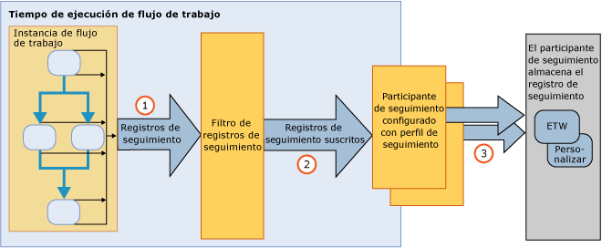

# Seguimiento y traza del flujo de trabajo
El seguimiento de Windows Workflow es una característica de [!INCLUDE[netfx_current_long](../../../includes/netfx-current-long-md.md)] diseñada para proporcionar visibilidad en la ejecución del flujo de trabajo. Proporciona una infraestructura de seguimiento para realizar el seguimiento de la ejecución de una instancia de flujo de trabajo. La infraestructura de seguimiento de WF sirve para que un flujo de trabajo emita registros de forma transparente que reflejen eventos clave durante la ejecución. Esta funcionalidad está disponible de forma predeterminada para cualquier flujo de trabajo de [!INCLUDE[netfx_current_short](../../../includes/netfx-current-short-md.md)]. No es necesario hacer ningún cambio en un flujo de trabajo de [!INCLUDE[netfx_current_long](../../../includes/netfx-current-long-md.md)] para que se produzca el seguimiento. Simplemente se trata de decidir cuántos datos de seguimiento desea recibir. Cuando una instancia de flujo de trabajo se inicia o se completa, se emiten registros de seguimiento de procesamiento. El seguimiento también puede extraer datos comerciales relevantes asociados a las variables de flujo de trabajo. Por ejemplo, si el flujo de trabajo representa en un sistema de procesamiento de pedidos, el id. de pedido se puede extraer junto con el objeto <xref:System.Activities.Tracking.TrackingRecord>. En general, al habilitar el seguimiento de WF se facilita el acceso a los datos de diagnóstico o analíticos empresariales desde la ejecución de un flujo de trabajo.  
  
 Estos componentes de seguimiento son equivalentes al servicio de seguimiento en [!INCLUDE[vstecwinfx](../../../includes/vstecwinfx-md.md)]. En [!INCLUDE[netfx_current_short](../../../includes/netfx-current-short-md.md)], se ha mejorado el rendimiento y se ha simplificado el modelo de programación para la característica de seguimiento de WF. El tiempo de ejecución de seguimiento sirve para que una instancia de flujo de trabajo emita eventos relacionados con el ciclo de vida y las actividades del flujo de trabajo, y los eventos personalizados.  
  
 Windows Server App Fabric también proporciona la capacidad de supervisar la ejecución de WCF y los servicios de flujo de trabajo. [!INCLUDE[crdefault](../../../includes/crdefault-md.md)][Supervisión de Windows Server App Fabric](http://go.microsoft.com/fwlink/?LinkId=201273) y [supervisar aplicaciones con Windows Server AppFabric](http://go.microsoft.com/fwlink/?LinkId=201287)  
  
 Para solucionar problemas del tiempo de ejecución del flujo de trabajo, puede activar la traza de flujo de trabajo de diagnóstico. [!INCLUDE[crdefault](../../../includes/crdefault-md.md)][Seguimiento de flujo de trabajo](../../../docs/framework/windows-workflow-foundation/workflow-tracing.md).  
  
 Para entender el modelo de programación, los componentes primarios de la infraestructura de seguimiento se tratan en este tema:  
  
-   Los objetos <xref:System.Activities.Tracking.TrackingRecord> emitidos a partir del tiempo de ejecución del flujo de trabajo. [!INCLUDE[crdefault](../../../includes/crdefault-md.md)][Registros de seguimiento](../../../docs/framework/windows-workflow-foundation/tracking-records.md).  
  
-   Los objetos <xref:System.Activities.Tracking.TrackingParticipant> se suscriben para los objetos <xref:System.Activities.Tracking.TrackingRecord>. Los participantes de seguimiento contienen la lógica para procesar la carga de los objetos <xref:System.Activities.Tracking.TrackingRecord> (por ejemplo, podrían elegir escribir en un archivo). [!INCLUDE[crdefault](../../../includes/crdefault-md.md)][Participantes de seguimiento](../../../docs/framework/windows-workflow-foundation/tracking-participants.md).  
  
-   Los objetos <xref:System.Activities.Tracking.TrackingProfile> filtran los registros de seguimiento emitidos desde una instancia de flujo de trabajo. [!INCLUDE[crdefault](../../../includes/crdefault-md.md)][Perfiles de seguimiento](../../../docs/framework/windows-workflow-foundation/tracking-profiles.md).  
  
## Infraestructura de seguimiento de flujos de trabajo  
 La infraestructura de seguimiento del flujo de trabajo sigue un paradigma de publicación y suscripción. La instancia de flujo de trabajo es el publicador de registros de seguimiento mientras que los suscriptores de los registros de seguimiento se registran como extensiones para el flujo de trabajo. Estas extensiones que se suscriben a los objetos <xref:System.Activities.Tracking.TrackingRecord> se denominan "participantes del seguimiento". Los participantes se seguimiento son puntos de extensibilidad que tienen acceso a los objetos <xref:System.Activities.Tracking.TrackingRecord> y los procesan de la manera en que se haya especificado que lo hagan. La infraestructura de seguimiento permite la aplicación de un filtro en los registros de seguimiento saliente para permitir que un participante se suscriba a un subconjunto de registros. Este mecanismo de filtrado se logra a través de un archivo de perfil de seguimiento.  
  
 Se muestra una vista de alto nivel de la infraestructura de seguimiento en la siguiente ilustración.  
  
   
  
## En esta sección  
 [Registros de seguimiento](../../../docs/framework/windows-workflow-foundation/tracking-records.md)  
 Describe los registros de seguimiento que el tiempo de ejecución del flujo de trabajo emite.  
  
 [Perfiles de seguimiento](../../../docs/framework/windows-workflow-foundation/tracking-profiles.md)  
 Trata cómo se usan los perfiles de seguimiento.  
  
 [Participantes de seguimiento](../../../docs/framework/windows-workflow-foundation/tracking-participants.md)  
 Describe cómo usar el participante del seguimiento proporcionado por el sistema o cómo crear los participantes de seguimiento personalizados.  
  
 [Configuración del seguimiento para un flujo de trabajo](../../../docs/framework/windows-workflow-foundation/configuring-tracking-for-a-workflow.md)  
 Describe cómo configurar el seguimiento para un flujo de trabajo.  
  
 [Traza de flujos de trabajo](../../../docs/framework/windows-workflow-foundation/workflow-tracing.md)  
 Describe las dos maneras de habilitar la traza de depuración para un flujo de trabajo.  
  
 [Determinación de la duración de la ejecución de flujos de trabajo mediante traza](../../../docs/framework/windows-workflow-foundation/determining-workflow-execution-duration-using-tracing.md)  
 Describe cómo usar mensajes de seguimiento para determinar la duración de la ejecución del flujo de trabajo.  
  
## Vea también  
 [Seguimiento de SQL](../../../docs/framework/windows-workflow-foundation/samples/sql-tracking.md)
