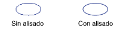

# Suavizado de contorno con líneas y curvas
Cuando usas [!INCLUDE[ndptecgdiplus](../../../../includes/ndptecgdiplus-md.md)] para dibujar una línea, se proporcionan el punto de partida y el punto final de la línea, pero no tendrá que proporcionar toda la información sobre los píxeles individuales en la línea. [!INCLUDE[ndptecgdiplus](../../../../includes/ndptecgdiplus-md.md)] funciona junto con el software de controlador de vídeo para determinar qué píxeles se activará para mostrar la línea en un dispositivo de presentación determinado.  
  
## Creación de alias  
 Considere la posibilidad de la línea recta de color rojo que va desde el punto (4, 2) al punto (16, 10). Suponga que el sistema de coordenadas tiene su origen en la esquina superior izquierda y que la unidad de medida es el píxel. También se supone que el eje x apunta hacia la derecha y el eje y apunta hacia abajo. La siguiente ilustración muestra una vista ampliada de la línea roja dibujada en un fondo de varios colores.  
  
   
  
 Los píxeles rojos utilizados para representar la línea son opacos. No hay ningún píxel parcialmente transparente en la línea. Este tipo de representación de línea le da la línea de una apariencia escalonada y la línea es bastante similar a una escalera. Esta técnica de representar una línea con una escalera se denomina "aliasing"; la escalera es un alias de la línea teórica.  
  
## suavizado de contorno  
 Una técnica más sofisticada para representar una línea implica el uso de píxeles parcialmente transparentes junto con píxeles opacos. Los píxeles se establecen en rojo puro o en cierta mezcla de rojo y el color de fondo, dependiendo de cómo cerrar son a la línea. Este tipo de representación se denomina suavizado de contorno y da como resultado una línea que el ojo humano percibe como más suave. La siguiente ilustración muestra cómo ciertos píxeles se mezclan con el fondo para generar una línea con suavizado de contorno.  
  
   
  
 Suavizado de contorno, también llamado suavizado, también puede aplicarse a las curvas. La siguiente ilustración muestra una vista ampliada de una elipse suavizada.  
  
   
  
 La siguiente ilustración muestra la misma elipse en su tamaño real, una vez sin suavizado de contorno y otra vez con suavizado de contorno.  
  
   
  
 Para dibujar líneas y curvas que utilizan el suavizado de contorno, cree una instancia de la <xref:System.Drawing.Graphics> clase y establezca su <xref:System.Drawing.Graphics.SmoothingMode%2A> propiedad <xref:System.Drawing.Drawing2D.SmoothingMode.AntiAlias> o <xref:System.Drawing.Drawing2D.SmoothingMode.HighQuality>. A continuación, llame a uno de los métodos de dibujo de ese mismo <xref:System.Drawing.Graphics> clase.  
  
 [!code-csharp[LinesCurvesAndShapes#81](~/samples/snippets/csharp/VS_Snippets_Winforms/LinesCurvesAndShapes/CS/Class1.cs#81)]
 [!code-vb[LinesCurvesAndShapes#81](~/samples/snippets/visualbasic/VS_Snippets_Winforms/LinesCurvesAndShapes/VB/Class1.vb#81)]  
  
## Vea también

- <xref:System.Drawing.Drawing2D.SmoothingMode?displayProperty=nameWithType>
- [Líneas, curvas y formas](lines-curves-and-shapes.md)
- [Cómo: Usa suavizado de contorno con texto](how-to-use-antialiasing-with-text.md)
