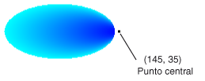

# C&#243;mo: Crear un degradado de trazado
La clase <xref:System.Drawing.Drawing2D.PathGradientBrush> permite personalizar el modo de rellenar una forma con colores que cambian gradualmente.  Por ejemplo, se puede especificar un color para el centro de un trazado y otro para el límite del mismo.  También se pueden especificar colores distintos para cada uno de varios puntos situados en el límite de un trazado.  
  
> [!NOTE]
>  En [!INCLUDE[ndptecgdiplus](../../../../includes/ndptecgdiplus-md.md)], un trazado es una secuencia de líneas y curvas mantenida por un objeto <xref:System.Drawing.Drawing2D.GraphicsPath>.  Para obtener más información sobre los trazados de [!INCLUDE[ndptecgdiplus](../../../../includes/ndptecgdiplus-md.md)], vea [Trazados de gráficos en GDI\+](../../../../docs/framework/winforms/advanced/graphics-paths-in-gdi.md) y [Crear y dibujar trazados](../../../../docs/framework/winforms/advanced/constructing-and-drawing-paths.md).  
  
### Para rellenar una elipse con un degradado de trazado  
  
-   En el siguiente ejemplo se rellena una elipse con un pincel degradado de trazado:  El color central se establece en azul y el color del límite se establece en aguamarina.  En la siguiente ilustración se muestra la elipse rellena.  
  
       
  
     De forma predeterminada, un pincel degradado de trazado no sobrepasa el límite del trazado.  Si utiliza el pincel degradado de trazado para rellenar una figura que sobrepasa el límite del trazado, no se rellenará el área de la pantalla fuera del trazado.  
  
     En la siguiente ilustración, se muestra lo que sucede si cambia la llamada a <xref:System.Drawing.Graphics.FillEllipse%2A> en el siguiente código a `e.Graphics.FillRectangle(pthGrBrush, 0, 10, 200, 40)`.  
  
       
  
     [!code-csharp[System.Drawing.UsingaGradientBrush#11](../../../../samples/snippets/csharp/VS_Snippets_Winforms/System.Drawing.UsingaGradientBrush/CS/Class1.cs#11)]
     [!code-vb[System.Drawing.UsingaGradientBrush#11](../../../../samples/snippets/visualbasic/VS_Snippets_Winforms/System.Drawing.UsingaGradientBrush/VB/Class1.vb#11)]  
  
     El ejemplo de código anterior se ha diseñado para usarlo con Windows Forms y requiere el objeto <xref:System.Windows.Forms.PaintEventArgs> e, que es un parámetro de <xref:System.Windows.Forms.PaintEventHandler>.  
  
### Para especificar los puntos en el límite  
  
-   En el ejemplo siguiente se construye un pincel degradado de trazado a partir de un trazado en forma de estrella.  El código establece la propiedad <xref:System.Drawing.Drawing2D.PathGradientBrush.CenterColor%2A>, que establece en rojo el color del centroide de la estrella.  Después, el código establece la propiedad <xref:System.Drawing.Drawing2D.PathGradientBrush.SurroundColors%2A> para especificar diversos colores \(almacenados en la matriz `colors`\) en cada uno de los puntos de la matriz `points`.  La última instrucción del código rellena el trazado en forma de estrella con el pincel degradado de trazado.  
  
     [!code-csharp[System.Drawing.UsingaGradientBrush#12](../../../../samples/snippets/csharp/VS_Snippets_Winforms/System.Drawing.UsingaGradientBrush/CS/Class1.cs#12)]
     [!code-vb[System.Drawing.UsingaGradientBrush#12](../../../../samples/snippets/visualbasic/VS_Snippets_Winforms/System.Drawing.UsingaGradientBrush/VB/Class1.vb#12)]  
  
-   El ejemplo siguiente dibuja un degradado de trazado sin un objeto <xref:System.Drawing.Drawing2D.GraphicsPath> en el código.  El constructor <xref:System.Drawing.Drawing2D.PathGradientBrush.%23ctor%2A> concreto del ejemplo recibe una matriz de puntos pero no requiere un objeto <xref:System.Drawing.Drawing2D.GraphicsPath>.  Además, observe que se utiliza el <xref:System.Drawing.Drawing2D.PathGradientBrush> para rellenar un rectángulo y no un trazado.  El rectángulo es más grande que el trazado cerrado utilizado para definir el pincel, por lo que parte del rectángulo queda sin pintar.  En la ilustración siguiente se muestra el rectángulo \(línea de puntos\) y la parte del rectángulo pintada por el pincel degradado de trazado.  
  
       
  
     [!code-csharp[System.Drawing.UsingaGradientBrush#13](../../../../samples/snippets/csharp/VS_Snippets_Winforms/System.Drawing.UsingaGradientBrush/CS/Class1.cs#13)]
     [!code-vb[System.Drawing.UsingaGradientBrush#13](../../../../samples/snippets/visualbasic/VS_Snippets_Winforms/System.Drawing.UsingaGradientBrush/VB/Class1.vb#13)]  
  
### Para personalizar un degradado de trazado  
  
-   Una forma de personalizar un pincel degradado de trazado consiste en establecer su propiedad <xref:System.Drawing.Drawing2D.PathGradientBrush.FocusScales%2A>.  Las escalas del foco especifican un trazado interno situado dentro del trazado principal.  El color central se muestra en todo el interior de ese trazado interno y no sólo en el punto central.  
  
     En el ejemplo siguiente se crea un pincel degradado de trazado a partir de un trazado elíptico.  El código establece el color del límite en azul, el color central en aguamarina y, a continuación, utiliza el pincel degradado de trazado para rellenar el trazado elíptico.  
  
     Después, el código establece las escalas del foco del pincel degradado de trazado.  La escala del foco x se establece en 0,3 y la escala del foco y se establece en 0,8.  El código llama al método <xref:System.Drawing.Graphics.TranslateTransform%2A> de un objeto <xref:System.Drawing.Graphics> para que la siguiente llamada a <xref:System.Drawing.Graphics.FillPath%2A> rellene una elipse situada a la derecha de la primera elipse.  
  
     Para ver el efecto de las escalas del foco, imagínese una elipse pequeña que comparte su centro con la elipse principal.  La elipse pequeña \(interna\) es la elipse principal cuyo tamaño se ha ajustado \(en torno al centro\) horizontalmente por un factor de 0,3 y verticalmente por un factor de 0,8.  Al desplazarse del límite de la elipse externa al límite de la interna, el color cambia gradualmente de azul a aguamarina.  Al desplazarse del límite de la elipse interna al centro compartido, el color sigue siendo aguamarina.  
  
     En la siguiente ilustración se muestra el resultado del código siguiente.  La elipse de la izquierda es de color aguamarina sólo en el punto central.  La elipse de la derecha es de color aguamarina en todo el interior del trazado interno.  
  
   
  
 [!code-csharp[System.Drawing.UsingaGradientBrush#14](../../../../samples/snippets/csharp/VS_Snippets_Winforms/System.Drawing.UsingaGradientBrush/CS/Class1.cs#14)]
 [!code-vb[System.Drawing.UsingaGradientBrush#14](../../../../samples/snippets/visualbasic/VS_Snippets_Winforms/System.Drawing.UsingaGradientBrush/VB/Class1.vb#14)]  
  
### Para personalizar con interpolación  
  
-   Otra manera de personalizar un pincel degradado de trazado consiste en especificar una matriz de colores de interpolación y una matriz de posiciones de interpolación.  
  
     En el ejemplo siguiente se crea un pincel degradado de trazado basado en un triángulo.  El código establece la propiedad <xref:System.Drawing.Drawing2D.PathGradientBrush.InterpolationColors%2A> del pincel degradado de trazado para especificar una matriz de colores de interpolación \(verde oscuro, aguamarina, azul\) y una matriz de posiciones de interpolación \(0, 0.25, 1\).  Al desplazarse desde el límite del triángulo hacia el punto central, el color cambia gradualmente de verde oscuro a aguamarina y, luego, de aguamarina a azul.  El cambio de verde oscuro a aguamarina se produce en el punto situado a un 25 por ciento de la distancia del verde oscuro al azul.  
  
     En la siguiente ilustración se muestra el triángulo relleno con el pincel degradado de trazado personalizado.  
  
     [!code-csharp[System.Drawing.UsingaGradientBrush#15](../../../../samples/snippets/csharp/VS_Snippets_Winforms/System.Drawing.UsingaGradientBrush/CS/Class1.cs#15)]
     [!code-vb[System.Drawing.UsingaGradientBrush#15](../../../../samples/snippets/visualbasic/VS_Snippets_Winforms/System.Drawing.UsingaGradientBrush/VB/Class1.vb#15)]  
  
### Para establecer el punto central  
  
-   De manera predeterminada, el punto central de un pincel degradado de trazado está en el centroide del trazado utilizado para construir el pincel.  La ubicación del punto central se puede cambiar estableciendo la propiedad <xref:System.Drawing.Drawing2D.PathGradientBrush.CenterPoint%2A> de la clase <xref:System.Drawing.Drawing2D.PathGradientBrush>.  
  
     En el ejemplo siguiente se crea un pincel degradado de trazado a partir de una elipse.  El centro de la elipse está en el punto \(70, 35\), pero el punto central del pincel degradado de trazado se establece en \(120, 40\).  
  
     [!code-csharp[System.Drawing.UsingaGradientBrush#16](../../../../samples/snippets/csharp/VS_Snippets_Winforms/System.Drawing.UsingaGradientBrush/CS/Class1.cs#16)]
     [!code-vb[System.Drawing.UsingaGradientBrush#16](../../../../samples/snippets/visualbasic/VS_Snippets_Winforms/System.Drawing.UsingaGradientBrush/VB/Class1.vb#16)]  
  
     En la siguiente ilustración se muestran la elipse rellena y el punto central del pincel degradado de trazado.  
  
       
  
-   El punto central de un pincel degradado de trazado se puede establecer en una ubicación fuera del trazado utilizado para construir el pincel.  En el siguiente ejemplo se reemplaza la llamada para establecer la propiedad <xref:System.Drawing.Drawing2D.PathGradientBrush.CenterPoint%2A> del código anterior.  
  
     [!code-csharp[System.Drawing.UsingaGradientBrush#17](../../../../samples/snippets/csharp/VS_Snippets_Winforms/System.Drawing.UsingaGradientBrush/CS/Class1.cs#17)]
     [!code-vb[System.Drawing.UsingaGradientBrush#17](../../../../samples/snippets/visualbasic/VS_Snippets_Winforms/System.Drawing.UsingaGradientBrush/VB/Class1.vb#17)]  
  
     En la siguiente ilustración se muestra el resultado con este cambio.  
  
       
  
     En la ilustración anterior, los puntos en el extremo derecho de la elipse no son de un color azul puro \(aunque son de un color muy similar\).  Los colores del degradado se sitúan como si el relleno alcanzara el punto \(145, 35\) donde el color sería azul puro \(0, 0, 255\).  Sin embargo, el relleno nunca llega a \(145, 35\) porque un pincel degradado de trazado sólo pinta dentro de su trazado.  
  
## Compilar el código  
 Los ejemplos anteriores están diseñados para formularios Windows Forms y requieren <xref:System.Windows.Forms.PaintEventArgs> `e`, que es un parámetro del controlador del evento <xref:System.Windows.Forms.Control.Paint>.  
  
## Vea también  
 [Utilizar un pincel degradado para rellenar formas](../../../../docs/framework/winforms/advanced/using-a-gradient-brush-to-fill-shapes.md)