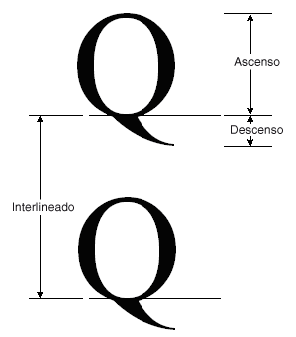

# Procedimiento para obtener métricas de fuentesHow to: Obtain Font Metrics
La <xref:System.Drawing.FontFamily> clase proporciona los siguientes métodos que recuperan diversas métricas para una combinación de familia y estilo concreta:The <xref:System.Drawing.FontFamily> class provides the following methods that retrieve various metrics for a particular family/style combination:  
  
-   <xref:System.Drawing.FontFamily.GetEmHeight%2A>(FontStyle)<xref:System.Drawing.FontFamily.GetEmHeight%2A>(FontStyle)  
  
-   <xref:System.Drawing.FontFamily.GetCellAscent%2A>(FontStyle)<xref:System.Drawing.FontFamily.GetCellAscent%2A>(FontStyle)  
  
-   <xref:System.Drawing.FontFamily.GetCellDescent%2A>(FontStyle)<xref:System.Drawing.FontFamily.GetCellDescent%2A>(FontStyle)  
  
-   <xref:System.Drawing.FontFamily.GetLineSpacing%2A>(FontStyle)<xref:System.Drawing.FontFamily.GetLineSpacing%2A>(FontStyle)  
  
 Los números devueltos por estos métodos están en unidades de diseño de fuente, por lo que son independientes del tamaño y las unidades de una determinada <xref:System.Drawing.Font> objeto.The numbers returned by these methods are in font design units, so they are independent of the size and units of a particular <xref:System.Drawing.Font> object.  
  
 La siguiente ilustración muestra las distintas métricas.The following illustration shows the various metrics.  
  
   
  
## EjemploExample  
 El ejemplo siguiente muestra las métricas para el estilo normal de la familia de fuentes Arial.The following example displays the metrics for the regular style of the Arial font family. El código también crea un <xref:System.Drawing.Font> objeto (basado en la familia Arial) con el tamaño de 16 píxeles y muestra las métricas (en píxeles) para ese <xref:System.Drawing.Font> objeto.The code also creates a <xref:System.Drawing.Font> object (based on the Arial family) with size 16 pixels and displays the metrics (in pixels) for that particular <xref:System.Drawing.Font> object.  
  
 La siguiente ilustración muestra el resultado del código de ejemplo.The following illustration shows the output of the example code.  
  
   
  
 Tenga en cuenta las dos primeras líneas de salida en la ilustración anterior.Note the first two lines of output in the preceding illustration. El <xref:System.Drawing.Font> objeto devuelve un tamaño de 16 y el <xref:System.Drawing.FontFamily> objeto devuelve un alto em de 2048.The <xref:System.Drawing.Font> object returns a size of 16, and the <xref:System.Drawing.FontFamily> object returns an em height of 2,048. Estos dos números (16 y 2.048) son la clave para la conversión entre unidades de diseño de fuente y las unidades (en este caso, píxeles) de la <xref:System.Drawing.Font> objeto.These two numbers (16 and 2,048) are the key to converting between font design units and the units (in this case pixels) of the <xref:System.Drawing.Font> object.  
  
 Por ejemplo, puede convertir el ascenso de unidades de diseño a píxeles como sigue:For example, you can convert the ascent from design units to pixels as follows:  
  
   
  
 El siguiente código coloca el texto verticalmente estableciendo el <xref:System.Drawing.PointF.Y%2A> miembro de datos de un <xref:System.Drawing.PointF> objeto.The following code positions text vertically by setting the <xref:System.Drawing.PointF.Y%2A> data member of a <xref:System.Drawing.PointF> object. La coordenada y se incrementa en `font.Height` para cada nueva línea de texto.The y-coordinate is increased by `font.Height` for each new line of text. El <xref:System.Drawing.Font.Height%2A> propiedad de un <xref:System.Drawing.Font> objeto devuelve el interlineado (en píxeles) para ese <xref:System.Drawing.Font> objeto.The <xref:System.Drawing.Font.Height%2A> property of a <xref:System.Drawing.Font> object returns the line spacing (in pixels) for that particular <xref:System.Drawing.Font> object. En este ejemplo, el número devuelto por <xref:System.Drawing.Font.Height%2A> es 19.In this example, the number returned by <xref:System.Drawing.Font.Height%2A> is 19. Tenga en cuenta que es el mismo que el número (redondeado a un entero) obtenido mediante la conversión de la métrica de espaciado de línea en píxeles.Note that this is the same as the number (rounded up to an integer) obtained by converting the line-spacing metric to pixels.  
  
 Tenga en cuenta que el alto em (también llamado tamaño o tamaño em) no es la suma de ascenso y el descenso.Note that the em height (also called size or em size) is not the sum of the ascent and the descent. La suma de ascenso y el descenso se denomina el alto de celda.The sum of the ascent and the descent is called the cell height. El alto de celda menos el espacio interno es igual que el alto em.The cell height minus the internal leading is equal to the em height. El alto de celda más la inicial externa es igual que el espaciado de línea.The cell height plus the external leading is equal to the line spacing.  
  
 [!code-csharp[System.Drawing.FontsAndText#71](~/samples/snippets/csharp/VS_Snippets_Winforms/System.Drawing.FontsAndText/CS/Class1.cs#71)]
 [!code-vb[System.Drawing.FontsAndText#71](~/samples/snippets/visualbasic/VS_Snippets_Winforms/System.Drawing.FontsAndText/VB/Class1.vb#71)]  
  
## Compilar el códigoCompiling the Code  
 El ejemplo anterior está diseñado para su uso con Windows Forms y requiere <xref:System.Windows.Forms.PaintEventArgs> `e`, que es un parámetro de <xref:System.Windows.Forms.PaintEventHandler>.The preceding example is designed for use with Windows Forms, and it requires <xref:System.Windows.Forms.PaintEventArgs> `e`, which is a parameter of <xref:System.Windows.Forms.PaintEventHandler>.  
  
## Vea tambiénSee also

- [Gráficos y dibujos en Windows FormsGraphics and Drawing in Windows Forms](graphics-and-drawing-in-windows-forms.md)
- [Utilizar fuentes y textoUsing Fonts and Text](using-fonts-and-text.md)
