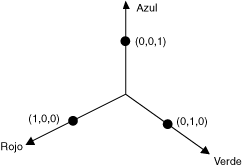

# Cómo: Rotar colores
Rotación en un espacio de colores de cuatro dimensiones es difícil de visualizar. Podemos facilitar la visualizar rotación decidido mantener uno de los componentes de color fijo. Supongamos que se decide mantener el componente alfa fijado en 1 (completamente opaco). A continuación, podemos visualizar un espacio de color tridimensional con ejes de rojos, verde y azules como se muestra en la siguiente ilustración.  
  
   
  
 Un color puede considerarse como un punto en un espacio 3D. Por ejemplo, el punto (1, 0, 0) en un espacio representa el color rojo y el punto (0, 1, 0) en un espacio representa el color verde.  
  
 En la siguiente ilustración se muestra lo que significa para rotar el color (1, 0, 0) a través de un ángulo de 60 grados en el plano rojo y verde. Rotación en un plano paralelo al plano rojo-verde puede considerarse como una rotación sobre el eje azul.  
  
   
  
 La ilustración siguiente muestra cómo inicializar una matriz de color para realizar rotaciones sobre cada uno de los tres ejes de coordenadas (rojo, verde, azul).  
  
   
  
## Ejemplo  
 En el ejemplo siguiente se toma una imagen que es un color (1, 0, 0,6) y se aplica una rotación de 60 grados sobre el eje azul. El ángulo de rotación se trazará en un plano paralelo al plano rojo y verde.  
  
 En la siguiente ilustración se muestra la imagen original a la izquierda y la imagen gira de color de la derecha.  
  
   
  
 En la siguiente ilustración muestra una visualización de la rotación de color realizada en el código siguiente.  
  
   
  
 [!code-csharp[System.Drawing.RotateColors#1](../../../../samples/snippets/csharp/VS_Snippets_Winforms/System.Drawing.RotateColors/CS/Form1.cs#1)]
 [!code-vb[System.Drawing.RotateColors#1](../../../../samples/snippets/visualbasic/VS_Snippets_Winforms/System.Drawing.RotateColors/VB/Form1.vb#1)]  
  
## Compilar el código  
 El ejemplo anterior está diseñado para su uso con Windows Forms y requiere <xref:System.Windows.Forms.PaintEventArgs> `e`, que es un parámetro de la <xref:System.Windows.Forms.Control.Paint> controlador de eventos. Reemplace `RotationInput.bmp` con un nombre de archivo de imagen y la ruta de acceso válida en su sistema.  
  
## Vea también  
 <xref:System.Drawing.Imaging.ColorMatrix>  
 <xref:System.Drawing.Imaging.ImageAttributes>  
 [Gráficos y dibujos en Windows Forms](../../../../docs/framework/winforms/advanced/graphics-and-drawing-in-windows-forms.md)  
 [Cambiar el color de las imágenes](../../../../docs/framework/winforms/advanced/recoloring-images.md)
