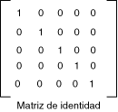

# Filtrar para usar una matriz de colores para transformar un color único
[!INCLUDE[ndptecgdiplus](../../../../includes/ndptecgdiplus-md.md)] proporciona el <xref:System.Drawing.Image> y <xref:System.Drawing.Bitmap> clases para almacenar y manipular imágenes. <xref:System.Drawing.Image> y <xref:System.Drawing.Bitmap> objetos almacenan el color de cada píxel como un número de 32 bits: 8 bits para cada color rojo, verde, azul y alfa. Cada uno de los cuatro componentes es un número comprendido entre 0 y 255, donde 0 representa ninguna intensidad y que representa la intensidad máxima de 255. El componente alfa especifica la transparencia del color: 0 es completamente transparente y 255 es completamente opaco.  
  
 Un vector de color es una tupla de 4 del formulario (rojo, verde, azul, alfa). Por ejemplo, el vector de color (0, 255, 0, 255) representa un color opaco que no tenga ningún rojo o azul, verde intensidad máxima.  
  
 Otra convención para representar los colores utiliza el número 1 de máxima intensidad. Mediante esta convención, el color que se describe en el párrafo anterior podría representarse mediante el vector (0, 1, 0, 1). [!INCLUDE[ndptecgdiplus](../../../../includes/ndptecgdiplus-md.md)] utiliza la convención 1 como intensidad total cuando realiza las transformaciones de color.  
  
 Puede aplicar transformaciones lineales (rotación, escala y similares) a los vectores de color multiplicando los vectores de color por una matriz de 4 x 4. Sin embargo, no se puede utilizar una matriz de 4 x 4 para realizar una conversión (no lineal). Si agrega una quinta coordenada ficticia (por ejemplo, el número 1) a cada uno de los vectores de color, puede usar una matriz de 5 × 5 para aplicar cualquier combinación de conversiones y transformaciones lineales. Una transformación que consta de una transformación lineal seguida de una traducción se denomina una transformación afín.  
  
 Por ejemplo, suponga que desea empezar con el color (0.2, 0.0, 0.4, 1.0) y aplicar las transformaciones siguientes:  
  
1.  Duplique el componente rojo  
  
2.  Agregue 0.2 a los componentes rojos, verde y azules  
  
 La multiplicación de matriz siguientes llevará a cabo el par de transformaciones en el orden mostrado.  
  
   
  
 Los elementos de una matriz de colores se indizan (basado en cero) por fila y, a continuación, la columna. Por ejemplo, la entrada en la quinta fila y la tercera columna de matriz M está indicada por M [4] [2].  
  
 La matriz de identidad de 5 × 5 (se muestra en la siguiente ilustración) tiene 1s en la diagonal y 0s en los demás. Si se multiplica un vector de color por la matriz de identidad, el vector de color no cambia. Una manera cómoda para formar la matriz de transformación de un color es empezar con la matriz de identidad y realice un pequeño cambio que produce la transformación deseada.  
  
   
  
 Para obtener una explicación más detallada de las matrices y las transformaciones, vea [sistemas de coordenadas y transformaciones](coordinate-systems-and-transformations.md).  
  
## Ejemplo  
 El siguiente ejemplo toma una imagen que es un color (0.2, 0.0, 0.4, 1.0) y se aplica la transformación descrita en los párrafos anteriores.  
  
 La siguiente ilustración muestra la imagen original a la izquierda y la imagen transformada de la derecha.  
  
   
  
 El código en el ejemplo siguiente utiliza los siguientes pasos para realizar el cambio de color:  
  
1.  Inicializar un <xref:System.Drawing.Imaging.ColorMatrix> objeto.  
  
2.  Crear un <xref:System.Drawing.Imaging.ImageAttributes> objeto y pase el <xref:System.Drawing.Imaging.ColorMatrix> de objeto para el <xref:System.Drawing.Imaging.ImageAttributes.SetColorMatrix%2A> método de la <xref:System.Drawing.Imaging.ImageAttributes> objeto.  
  
3.  Pase el <xref:System.Drawing.Imaging.ImageAttributes> de objeto para el <xref:System.Drawing.Graphics.DrawImage%2A> método de un <xref:System.Drawing.Graphics> objeto.  
  
 [!code-csharp[System.Drawing.RecoloringImages#21](~/samples/snippets/csharp/VS_Snippets_Winforms/System.Drawing.RecoloringImages/CS/Class1.cs#21)]
 [!code-vb[System.Drawing.RecoloringImages#21](~/samples/snippets/visualbasic/VS_Snippets_Winforms/System.Drawing.RecoloringImages/VB/Class1.vb#21)]  
  
## Compilar el código  
 El ejemplo anterior está diseñado para su uso con Windows Forms y requiere <xref:System.Windows.Forms.PaintEventArgs> `e`, que es un parámetro de la <xref:System.Windows.Forms.Control.Paint> controlador de eventos.  
  
## Vea también

- [Cambiar el color de las imágenes](recoloring-images.md)
- [Sistemas de coordenadas y transformaciones](coordinate-systems-and-transformations.md)
