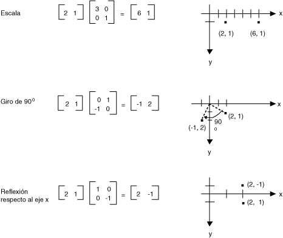
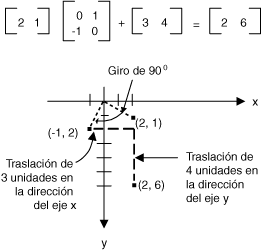
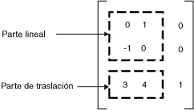

# Representación matricial de transformaciones
Una matriz m × n es un conjunto de números organizados en filas de la m y n columnas. La ilustración siguiente muestra varias matrices.  
  
   
  
 Puede agregar dos matrices del mismo tamaño mediante la adición de elementos individuales. En la siguiente ilustración se muestra dos ejemplos de adición de matrices.  
  
   
  
 Una matriz m × n puede multiplicarse por una matriz de n × p y el resultado es una matriz m × p. El número de columnas en la primera matriz debe ser el mismo que el número de filas de la segunda matriz. Por ejemplo, una matriz de 4 x 2 puede multiplicarse por una matriz de 3 x 2 para generar una matriz de 4 x 3.  
  
 Puntos en el plano y las filas y columnas de una matriz pueden considerarse como vectores. Por ejemplo, (2, 5) es un vector con dos componentes y (3, 7, 1) es un vector con tres componentes. El producto escalar de dos vectores se define como sigue:  
  
 (a, • b) (c, d) = ac + bd  
  
 (a, b, c) • (d, e, f) = ad + ser + cf  
  
 Por ejemplo, el producto escalar de (2, 3) y (5, 4) es (2)(5) + (3)(4) = 22. El producto escalar de (2, 5, 1) y (4, 3, 1) es (2)(4) + (5)(3) + (1)(1) = 24. Tenga en cuenta que el producto escalar de dos vectores es un número, no otro vector. Tenga en cuenta que puede calcular el producto escalar sólo si los dos vectores tienen el mismo número de componentes.  
  
 Permiten A(i, j) será la entrada en la matriz a, en la fila i y la columna jth. Por ejemplo, A (3, 2) es la entrada de matriz a, en la fila 3 y la columna 2. Suponga que A, B y C son matrices y AB = C. Las entradas de C se calculan como sigue:  
  
 C (i, j) = (fila i de A) • (columna j de B)  
  
 En la siguiente ilustración se muestra varios ejemplos de multiplicación de matrices.  
  
   
  
 Si piensa de un punto en un plano como una 1 matriz x 2, se puede transformar dicho punto multiplicándolo por una matriz de 2 x 2. La ilustración siguiente muestra varias transformaciones aplicadas en el punto (2, 1).  
  
   
  
 Todas las transformaciones que se muestra en la ilustración anterior son transformaciones lineales. Otros tipos de transformaciones, como la traslación, no son lineales y no se puede expresar como la multiplicación por una matriz de 2 x 2. Suponga que desea comenzar con el punto (2, 1), girar 90 grados, trasladar 3 unidades en la dirección del eje x y trasladar 4 unidades en la dirección del eje y. Puede hacerlo mediante el uso de una multiplicación de matrices seguida de una suma de la matriz.  
  
   
  
 Una transformación lineal (multiplicación por una matriz de 2 x 2) seguida de una traslación (adición de una 1 matriz x 2) se denomina una transformación afín. Una alternativa al almacenamiento de una transformación afín en un par de matrices (una para la parte lineal) y otra para la traducción es almacenar toda la transformación en una matriz de 3 x 3. Para solucionar este problema, un punto en el plano debe almacenarse en una matriz de 1 x 3 con una 3ª coordenada ficticia. La técnica más habitual es hacer que todas las coordenadas 3rd igual a 1. Por ejemplo, el punto (2, 1) se representa por la matriz [2 1 1]. La siguiente ilustración muestra una transformación afín (Girar 90 grados, traslación de 3 unidades en la dirección del eje x y 4 unidades en la dirección del eje y) se expresa como la multiplicación por una matriz de solo 3 x 3.  
  
   
  
 En el ejemplo anterior, el punto (2, 1) se asigna al punto (2, 6). Tenga en cuenta que la tercera columna de la matriz de 3 x 3 contiene los números 0, 0, 1. Esto siempre será el caso de la matriz de 3 x 3 de una transformación afín. Los números importantes son los seis números en las columnas 1 y 2. La parte de superior izquierda 2 x 2 de la matriz representa la parte lineal de la transformación y las dos primeras entradas en la fila 3ª representan la traslación.  
  
   
  
 En [!INCLUDE[ndptecgdiplus](../../../../includes/ndptecgdiplus-md.md)] puede almacenar una transformación afín en un <xref:System.Drawing.Drawing2D.Matrix> objeto. Dado que la tercera columna de una matriz que representa una transformación afín siempre es (0, 0, 1), sólo se especifican los seis números en las dos primeras columnas cuando se crea un <xref:System.Drawing.Drawing2D.Matrix> objeto. La instrucción `Matrix myMatrix = new Matrix(0, 1, -1, 0, 3, 4)` construye la matriz se muestra en la ilustración anterior.  
  
## Transformaciones compuestas  
 Una transformación compuesta es una secuencia de transformaciones, una tras otra. Tenga en cuenta las matrices y las transformaciones en la lista siguiente:  
  
|||  
|-|-|  
|Matriz A|Girar 90 grados|  
|Matriz B|Escalar por un factor de 2 en la dirección del eje x|  
|Matriz de C|Trasladar 3 unidades en la dirección del eje y|  
  
 Si se comienza con el punto (2, 1), representado por la matriz [2 1 1]: y multiplique por A, B, a continuación, y, a continuación, C, el punto (2, 1) experimentará las tres transformaciones en el orden indicado.  
  
 [2 1 1] ABC = [1 DE 5-2]  
  
 En lugar de almacenar las tres partes de la transformación compuesta en tres matrices independientes, se puede multiplicar A, B y C juntas para obtener una matriz de 3 x 3 único que almacena toda la transformación compuesta. Suponga que ABC = D. A continuación, un punto multiplicado por D da el mismo resultado que un punto multiplicado por A, B, a continuación, y, a continuación, C.  
  
 [2 1 1] D. = [1 DE 5-2]  
  
 En la siguiente ilustración se muestra las matrices A, B, C y D.  
  
   
  
 El hecho de que la matriz de una transformación compuesta pueda crearse multiplicando matrices de transformación individuales significa que cualquier secuencia de transformaciones afines puede almacenarse en una sola <xref:System.Drawing.Drawing2D.Matrix> objeto.  
  
> [!CAUTION]
>  El orden de una transformación compuesta es importante. En general, girar, escalar y, luego, traducir es el mismo como escala, girar, a continuación, traducir. De igual forma, el orden de multiplicación de matrices es importante. En general, ABC no es igual a CPF.  
  
 El <xref:System.Drawing.Drawing2D.Matrix> clase proporciona varios métodos para generar una transformación compuesta: <xref:System.Drawing.Drawing2D.Matrix.Multiply%2A>, <xref:System.Drawing.Drawing2D.Matrix.Rotate%2A>, <xref:System.Drawing.Drawing2D.Matrix.RotateAt%2A>, <xref:System.Drawing.Drawing2D.Matrix.Scale%2A>, <xref:System.Drawing.Drawing2D.Matrix.Shear%2A>, y <xref:System.Drawing.Drawing2D.Matrix.Translate%2A>. En el ejemplo siguiente se crea la matriz de una transformación compuesta que primero, rota 30 grados, a continuación, cambia en un factor de 2 en la dirección del eje y y, a continuación, traslada 5 unidades en la dirección del eje x:  
  
 [!code-csharp[System.Drawing.CoordinateSystems#11](../../../../samples/snippets/csharp/VS_Snippets_Winforms/System.Drawing.CoordinateSystems/CS/Class1.cs#11)]
 [!code-vb[System.Drawing.CoordinateSystems#11](../../../../samples/snippets/visualbasic/VS_Snippets_Winforms/System.Drawing.CoordinateSystems/VB/Class1.vb#11)]  
  
 En la siguiente ilustración se muestra la matriz.  
  
   
  
## Vea también  
 [Sistemas de coordenadas y transformaciones](../../../../docs/framework/winforms/advanced/coordinate-systems-and-transformations.md)  
 [Usar transformaciones en la interfaz GDI+ administrada](../../../../docs/framework/winforms/advanced/using-transformations-in-managed-gdi.md)
