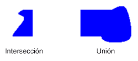

# Regiones de GDI+
Una región es una parte del área de visualización de un dispositivo de salida. Pueden ser regiones simples (un único rectángulo) o complejas (una combinación de polígonos y curvas cerradas). La siguiente ilustración muestra dos regiones: una construida a partir de un rectángulo y el otro construido a partir de una ruta de acceso.  
  
   
  
## Utilizar regiones  
 Las regiones suelen utilizarse para recorte y la prueba de posicionamiento. Recortar implica la restricción de dibujo en una región determinada del área de visualización, normalmente la parte que debe actualizarse. La prueba de posicionamiento implica la comprobación para determinar si el cursor está en una región determinada de la pantalla cuando se presiona un botón del mouse.  
  
 Puede construir una región de un rectángulo o una ruta de acceso. También puede crear regiones complejas mediante la combinación de las regiones existentes. El <xref:System.Drawing.Region> clase proporciona los métodos siguientes para combinar las regiones: <xref:System.Drawing.Region.Intersect%2A>, <xref:System.Drawing.Region.Union%2A>, <xref:System.Drawing.Region.Xor%2A>, <xref:System.Drawing.Region.Exclude%2A>, y <xref:System.Drawing.Region.Complement%2A>.  
  
 La intersección de dos regiones es el conjunto de todos los puntos que pertenecen a ambas regiones. La unión es el conjunto de todos los puntos que pertenecen a uno al otro o a ambas regiones. El complemento de una región es el conjunto de todos los puntos que no están en la región. La siguiente ilustración muestra la intersección y unión de las dos regiones que se muestra en la ilustración anterior.  
  
   
  
 El <xref:System.Drawing.Region.Xor%2A> método, aplicado a un par de regiones, genera una región que contiene todos los puntos que pertenecen a una región o la otra, pero no ambos. El <xref:System.Drawing.Region.Exclude%2A> método, aplicado a un par de regiones, genera una región que contiene todos los puntos de la primera región que no están en la segunda región. La siguiente ilustración muestra las regiones que resultan de aplicar el <xref:System.Drawing.Region.Xor%2A> y <xref:System.Drawing.Region.Exclude%2A> métodos a las dos regiones que se muestran al principio de este tema.  
  
   
  
 Para rellenar una región, necesita un <xref:System.Drawing.Graphics> objeto, un <xref:System.Drawing.Brush> objeto y un <xref:System.Drawing.Region> objeto. El <xref:System.Drawing.Graphics> objeto proporciona el <xref:System.Drawing.Graphics.FillRegion%2A> método y el <xref:System.Drawing.Brush> objeto almacena atributos del relleno, como color o el modelo. El ejemplo siguiente rellena un área con un color sólido.  
  
 [!code-csharp[LinesCurvesAndShapes#61](~/samples/snippets/csharp/VS_Snippets_Winforms/LinesCurvesAndShapes/CS/Class1.cs#61)]
 [!code-vb[LinesCurvesAndShapes#61](~/samples/snippets/visualbasic/VS_Snippets_Winforms/LinesCurvesAndShapes/VB/Class1.vb#61)]  
  
## Vea también
- <xref:System.Drawing.Region?displayProperty=nameWithType>
- [Líneas, curvas y formas](lines-curves-and-shapes.md)
- [Utilizar regiones](using-regions.md)
