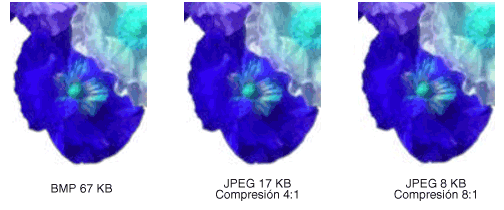

# Tipos de mapas de bitsTypes of Bitmaps
Un mapa de bits es una matriz de bits que especifican el color de cada píxel de una matriz rectangular de píxeles.A bitmap is an array of bits that specify the color of each pixel in a rectangular array of pixels. El número de bits dedicado a un píxel individual determina el número de colores que se pueden asignar a ese píxel.The number of bits devoted to an individual pixel determines the number of colors that can be assigned to that pixel. Por ejemplo, si cada píxel se representa mediante 4 bits, a un píxel determinado se le puede asignar uno de 16 colores diferentes (2 ^ 4 = 16).For example, if each pixel is represented by 4 bits, then a given pixel can be assigned one of 16 different colors (2^4 = 16). En la tabla siguiente se muestran algunos ejemplos del número de colores que se pueden asignar a un píxel representado por un número determinado de bits.The following table shows a few examples of the number of colors that can be assigned to a pixel represented by a given number of bits.  
  
|Bits por píxelBits per pixel|Número de colores que se pueden asignar a un píxelNumber of colors that can be assigned to a pixel|  
|--------------------|------------------------------------------------------|  
|11|2^1 = 22^1 = 2|  
|22|2^2 = 42^2 = 4|  
|44|2^4 = 162^4 = 16|  
|88|2^8 = 2562^8 = 256|  
|1616|2^16 = 65,5362^16 = 65,536|  
|2424|2^24 = 16,777,2162^24 = 16,777,216|  
  
 Los archivos de disco que almacenan mapas de bits normalmente contienen uno o más bloques de información que almacenan información como el número de bits por píxel, el número de píxeles de cada fila y el número de filas de la matriz.Disk files that store bitmaps usually contain one or more information blocks that store information such as the number of bits per pixel, number of pixels in each row, and number of rows in the array. Este tipo de archivo también puede contener una tabla de colores (a veces denominada paleta de colores).Such a file might also contain a color table (sometimes called a color palette). Una tabla de colores asigna números en el mapa de bits a colores específicos.A color table maps numbers in the bitmap to specific colors. En la ilustración siguiente se muestra una imagen ampliada junto con su mapa de bits y tabla de colores.The following illustration shows an enlarged image along with its bitmap and color table. Cada píxel se representa mediante un número de 4 bits, por lo que hay 2 ^ 4 = 16 colores en la tabla de colores.Each pixel is represented by a 4-bit number, so there are 2^4 = 16 colors in the color table. Cada color de la tabla se representa mediante un número de 24 bits: 8 bits para rojo, 8 bits para verde y 8 bits para azul.Each color in the table is represented by a 24-bit number: 8 bits for red, 8 bits for green, and 8 bits for blue. Los números se muestran en formato hexadecimal (base 16): A = 10, B = 11, C = 12, D = 13, E = 14, F = 15.The numbers are shown in hexadecimal (base 16) form: A = 10, B = 11, C = 12, D = 13, E = 14, F = 15.  
  
   
  
 Fíjese en el píxel de la fila 3, columna 5 de la imagen.Look at the pixel in row 3, column 5 of the image. El número correspondiente en el mapa de bits es 1.The corresponding number in the bitmap is 1. La tabla de colores nos indica que 1 representa el color rojo, de modo que el píxel es rojo.The color table tells us that 1 represents the color red so the pixel is red. Todas las entradas de la fila superior del mapa de bits son 3.All the entries in the top row of the bitmap are 3. La tabla de colores nos indica que 3 representa el azul, por lo que todos los píxeles de la fila superior de la imagen son azules.The color table tells us that 3 represents blue, so all the pixels in the top row of the image are blue.  
  
> [!NOTE]
> Algunos mapas de bits se almacenan en formato ascendente; los números de la primera fila del mapa de bits corresponden a los píxeles de la fila inferior de la imagen.Some bitmaps are stored in bottom-up format; the numbers in the first row of the bitmap correspond to the pixels in the bottom row of the image.  
  
 Un mapa de bits que almacena índices en una tabla de colores se denomina mapa de bits indexado por una paleta.A bitmap that stores indexes into a color table is called a palette-indexed bitmap. Algunos mapas de bits no tienen necesidad de una tabla de colores.Some bitmaps have no need for a color table. Por ejemplo, si un mapa de bits usa 24 bits por píxel, dicho mapa de bits puede almacenar los propios colores en lugar de los índices en una tabla de colores.For example, if a bitmap uses 24 bits per pixel, that bitmap can store the colors themselves rather than indexes into a color table. En la ilustración siguiente se muestra un mapa de bits que almacena los colores directamente (24 bits por píxel) en lugar de usar una tabla de colores.The following illustration shows a bitmap that stores colors directly (24 bits per pixel) rather than using a color table. La ilustración también muestra una vista ampliada de la imagen correspondiente.The illustration also shows an enlarged view of the corresponding image. En el mapa de bits, FFFFFF representa el blanco, FF0000 representa rojo, 00FF00 representa el verde y 0000FF representa el azul.In the bitmap, FFFFFF represents white, FF0000 represents red, 00FF00 represents green, and 0000FF represents blue.  
  
   
  
## Formatos de archivo de gráficosGraphics File Formats  
 Existen muchos formatos estándar para guardar mapas de bits en archivos de disco.There are many standard formats for saving bitmaps in disk files. GDI+ es compatible con los formatos de archivo de gráficos descritos en los párrafos siguientes.GDI+ supports the graphics file formats described in the following paragraphs.  
  
### BMPBMP  
 BMP es un formato estándar que usa Windows para almacenar imágenes independientes del dispositivo e independientes de la aplicación.BMP is a standard format used by Windows to store device-independent and application-independent images. El número de bits por píxel (1, 4, 8, 15, 24, 32 o 64) de un archivo BMP determinado se especifica en un encabezado de archivo.The number of bits per pixel (1, 4, 8, 15, 24, 32, or 64) for a given BMP file is specified in a file header. Los archivos BMP con 24 bits por píxel son comunes.BMP files with 24 bits per pixel are common. Los archivos BMP normalmente no se comprimen y, por lo tanto, no son adecuados para la transferencia a través de Internet.BMP files are usually not compressed and, therefore, are not well suited for transfer across the Internet.  
  
### Formato de intercambio de gráficos (GIF)Graphics Interchange Format (GIF)  
 GIF es un formato común para las imágenes que aparecen en páginas Web.GIF is a common format for images that appear on Web pages. Los archivos GIF funcionan bien para los dibujos de líneas, imágenes con bloques de color sólido e imágenes con límites nítidos entre los colores.GIFs work well for line drawings, pictures with blocks of solid color, and pictures with sharp boundaries between colors. Los archivos GIF se comprimen, pero no se pierde información en el proceso de compresión; una imagen descomprimida es exactamente la misma que la original.GIFs are compressed, but no information is lost in the compression process; a decompressed image is exactly the same as the original. Un color de un GIF puede designarse como transparente, de modo que la imagen tendrá el color de fondo de cualquier página web que la muestre.One color in a GIF can be designated as transparent, so that the image will have the background color of any Web page that displays it. Se puede almacenar una secuencia de imágenes GIF en un solo archivo para formar un GIF animado.A sequence of GIF images can be stored in a single file to form an animated GIF. Los archivos GIF almacenan a lo sumo 8 bits por píxel, por lo que están limitados a 256 colores.GIFs store at most 8 bits per pixel, so they are limited to 256 colors.  
  
### Formato JPEG (Joint Photographic Experts Group)Joint Photographic Experts Group (JPEG)  
 JPEG es un esquema de compresión que funciona bien con escenas naturales como fotografías digitalizadas.JPEG is a compression scheme that works well for natural scenes such as scanned photographs. Parte de la información se pierde en el proceso de compresión, pero a menudo la pérdida es imperceptible para el ojo humano.Some information is lost in the compression process, but often the loss is imperceptible to the human eye. Los archivos JPEG almacenan 24 bits por píxel, por lo que son capaces de mostrar más de 16 millones colores.JPEGs store 24 bits per pixel, so they are capable of displaying more than 16 million colors. Los archivos JPEG no admiten transparencia ni animación.JPEGs do not support transparency or animation.  
  
 El nivel de compresión de las imágenes JPEG es configurable, pero los niveles de compresión más altos (archivos más pequeños) producen más pérdida de información.The level of compression in JPEG images is configurable, but higher compression levels (smaller files) result in more loss of information. Una razón de compresión 20:1 suele generar una imagen que el ojo humano encuentra difícil de distinguir de la original.A 20:1 compression ratio often produces an image that the human eye finds difficult to distinguish from the original. En la ilustración siguiente se muestra una imagen BMP y dos imágenes JPEG que se comprimieron a partir de esa imagen BMP.The following illustration shows a BMP image and two JPEG images that were compressed from that BMP image. La primera JPEG tiene una relación de compresión de 4:1 y la segunda tiene una relación de compresión de aproximadamente 8:1.The first JPEG has a compression ratio of 4:1 and the second JPEG has a compression ratio of about 8:1.  
  
   
  
 La compresión JPEG no funciona bien para los dibujos de líneas, los bloques de color sólido y los límites nítidos.JPEG compression does not work well for line drawings, blocks of solid color, and sharp boundaries. En la ilustración siguiente se muestra un BMP junto con dos archivos JPEG y un GIF.The following illustration shows a BMP along with two JPEGs and a GIF. Los archivos JPEG y el GIF se han comprimido a partir del BMP.The JPEGs and the GIF were compressed from the BMP. La razón de compresión es 4:1 para el archivo GIF, 4:1 para el archivo JPEG más pequeño y 8:3 para el archivo JPEG más grande.The compression ratio is 4:1 for the GIF, 4:1 for the smaller JPEG, and 8:3 for the larger JPEG. Tenga en cuenta que el GIF mantiene los límites nítidos a lo largo de las líneas, pero los archivos JPEG tienden a desenfocar los límites.Note that the GIF maintains the sharp boundaries along the lines, but the JPEGs tend to blur the boundaries.  
  
   
  
 JPEG es un esquema de compresión, no un formato de archivo.JPEG is a compression scheme, not a file format. El formato de intercambio de archivos JPEG (JFIF) es un formato de archivo que se usa normalmente para almacenar y transferir imágenes que se han comprimido según el esquema JPEG.JPEG File Interchange Format (JFIF) is a file format commonly used for storing and transferring images that have been compressed according to the JPEG scheme. Los archivos JFIF mostrados por los exploradores web utilizan la extensión. jpg.JFIF files displayed by Web browsers use the .jpg extension.  
  
### Archivo de imagen intercambiable (EXIF)Exchangeable Image File (EXIF)  
 EXIF es un formato de archivo que se usa para las fotografías capturadas por cámaras digitales.EXIF is a file format used for photographs captured by digital cameras. Un archivo EXIF contiene una imagen que se comprime según la especificación JPEG.An EXIF file contains an image that is compressed according to the JPEG specification. Un archivo EXIF también contiene información acerca de la fotografía (fecha de toma, velocidad de obturación, tiempo de exposición, etc.) e información sobre la cámara (fabricante, modelo, etc.).An EXIF file also contains information about the photograph (date taken, shutter speed, exposure time, and so on) and information about the camera (manufacturer, model, and so on).  
  
### Formato PNG (Portable Network Graphics)Portable Network Graphics (PNG)  
 El formato PNG conserva muchas de las ventajas del formato GIF, pero también proporciona capacidades más allá de las de GIF.The PNG format retains many of the advantages of the GIF format but also provides capabilities beyond those of GIF. Al igual que los archivos GIF, los archivos PNG se comprimen sin pérdida de información.Like GIF files, PNG files are compressed with no loss of information. Los archivos PNG pueden almacenar colores con 8, 24 o 48 bits por píxel y escalas de grises con 1, 2, 4, 8 o 16 bits por píxel.PNG files can store colors with 8, 24, or 48 bits per pixel and grayscales with 1, 2, 4, 8, or 16 bits per pixel. En cambio, los archivos GIF solo pueden usar 1, 2, 4 u 8 bits por píxel.In contrast, GIF files can use only 1, 2, 4, or 8 bits per pixel. Un archivo PNG también puede almacenar un valor alfa para cada píxel, que especifica el grado en el que el color de ese píxel se combina con el color de fondo.A PNG file can also store an alpha value for each pixel, which specifies the degree to which the color of that pixel is blended with the background color.  
  
 PNG mejora el formato GIF en su capacidad para mostrar progresivamente una imagen (es decir, para mostrar mejores y mejores aproximaciones de la imagen a medida que llega a través de una conexión de red).PNG improves on GIF in its ability to progressively display an image (that is, to display better and better approximations of the image as it arrives over a network connection). Los archivos PNG pueden contener información de corrección de color y corrección de gamma para que las imágenes se puedan representar con precisión en una variedad de dispositivos de pantalla.PNG files can contain gamma correction and color correction information so that the images can be accurately rendered on a variety of display devices.  
  
### Formato de archivo de imagen de etiqueta (TIFF)Tag Image File Format (TIFF)  
 TIFF es un formato flexible y ampliable que es compatible con una amplia variedad de plataformas y aplicaciones de procesamiento de imágenes.TIFF is a flexible and extendable format that is supported by a wide variety of platforms and image-processing applications. Los archivos TIFF pueden almacenar imágenes con un número arbitrario de bits por píxel y pueden emplear diversos algoritmos de compresión.TIFF files can store images with an arbitrary number of bits per pixel and can employ a variety of compression algorithms. Se pueden almacenar varias imágenes en un único archivo TIFF de varias páginas.Several images can be stored in a single, multiple-page TIFF file. La información relacionada con la imagen (la marca del escáner, el equipo host, el tipo de compresión, la orientación, los ejemplos por píxel, etc.) puede almacenarse en el archivo y organizarse mediante el uso de etiquetas.Information related to the image (scanner make, host computer, type of compression, orientation, samples per pixel, and so on) can be stored in the file and arranged through the use of tags. El formato TIFF puede extenderse según sea necesario mediante la aprobación y la adición de etiquetas nuevas.The TIFF format can be extended as needed by the approval and addition of new tags.  
  
## Vea tambiénSee also

- <xref:System.Drawing.Image?displayProperty=nameWithType>
- <xref:System.Drawing.Bitmap?displayProperty=nameWithType>
- <xref:System.Drawing.Imaging.PixelFormat?displayProperty=nameWithType>
- [Imágenes, mapas de bits y metarchivosImages, Bitmaps, and Metafiles](images-bitmaps-and-metafiles.md)
- [Trabajar con imágenes, mapas de bits, iconos y metarchivosWorking with Images, Bitmaps, Icons, and Metafiles](working-with-images-bitmaps-icons-and-metafiles.md)
