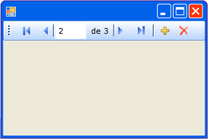

# Informaci&#243;n general sobre el control BindingNavigator (formularios Windows Forms)
Puede usar el control <xref:System.Windows.Forms.BindingNavigator> para crear un medio estandarizado para que los usuarios busquen y cambien los datos en un Windows Form.  El control <xref:System.Windows.Forms.BindingNavigator> suele usarse con el componente <xref:System.Windows.Forms.BindingSource> para que los usuarios puedan desplazarse por los registros de datos en un formulario e interactuar con los registros.  
  
## Cómo funciona BindingNavigator  
 El control <xref:System.Windows.Forms.BindingNavigator> se compone de una <xref:System.Windows.Forms.ToolStrip> con una serie de objetos <xref:System.Windows.Forms.ToolStripItem> para la mayoría de las acciones comunes relacionadas con datos: agregar datos, eliminar datos y navegar por los datos.  De forma predeterminada, el control <xref:System.Windows.Forms.BindingNavigator> contiene estos botones estándar.  La siguiente captura de pantalla muestra el control <xref:System.Windows.Forms.BindingNavigator> en un formulario.  
  
   
  
 En la tabla siguiente se enumeran los controles y se describen sus funciones.  
  
|Control|Función|  
|-------------|-------------|  
|Botón <xref:System.Windows.Forms.BindingNavigator.AddNewItem%2A>|Inserta una nueva fila en el origen de datos subyacente.|  
|Botón <xref:System.Windows.Forms.BindingNavigator.DeleteItem%2A>|Elimina la fila actual del origen de datos subyacente.|  
|Botón <xref:System.Windows.Forms.BindingNavigator.MoveFirstItem%2A>|Se desplaza al primer elemento del origen de datos subyacente.|  
|Botón <xref:System.Windows.Forms.BindingNavigator.MoveLastItem%2A>|Se desplaza al último elemento del origen de datos subyacente.|  
|Botón <xref:System.Windows.Forms.BindingNavigator.MoveNextItem%2A>|Se desplaza al siguiente elemento del origen de datos subyacente.|  
|Botón <xref:System.Windows.Forms.BindingNavigator.MovePreviousItem%2A>|Se desplaza al elemento anterior del origen de datos subyacente.|  
|Cuadro de texto <xref:System.Windows.Forms.BindingNavigator.PositionItem%2A>|Devuelve la posición actual dentro del origen de datos subyacente.|  
|Cuadro de texto <xref:System.Windows.Forms.BindingNavigator.CountItem%2A>|Devuelve el número total de elementos en el origen de datos subyacente.|  
  
 Para cada control de esta colección, hay un miembro correspondiente del componente <xref:System.Windows.Forms.BindingSource> que proporciona la misma funcionalidad de mediante programación.  Por ejemplo, el botón <xref:System.Windows.Forms.BindingNavigator.MoveFirstItem%2A> corresponde al método <xref:System.Windows.Forms.BindingSource.MoveFirst%2A> del componente <xref:System.Windows.Forms.BindingSource>, el botón <xref:System.Windows.Forms.BindingNavigator.DeleteItem%2A> corresponde al método <xref:System.Windows.Forms.BindingSource.RemoveCurrent%2A>, y así sucesivamente.  
  
 Si los botones predeterminados no son adecuados para su aplicación o si necesita otros botones para admitir otro tipo de funcionalidad, puede proporcionar sus propios botones <xref:System.Windows.Forms.ToolStrip>.  Consulte también [Cómo: Agregar los botones Cargar, Guardar y Cancelar al control BindingNavigator de formularios Windows Forms](../../../../docs/framework/winforms/controls/load-save-and-cancel-bindingnavigator.md).  
  
## Vea también  
 <xref:System.Windows.Forms.BindingNavigator>   
 <xref:System.Windows.Forms.BindingSource>   
 [BindingNavigator \(Control\)](../../../../docs/framework/winforms/controls/bindingnavigator-control-windows-forms.md)