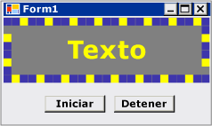

# <a name="walkthrough-creating-a-windows-forms-control-that-takes-advantage-of-visual-studio-design-time-features"></a>Tutorial: Crear un control de formularios Windows Forms que aproveche las características en tiempo de diseño de Visual Studio
Puede mejorar la experiencia en tiempo de diseño para un control personalizado mediante la creación de un diseñador personalizado asociado.  
  
 Este tutorial muestra cómo crear un diseñador personalizado para un control personalizado. Implementará una `MarqueeControl` tipo y una clase de diseñador asociada, denominada `MarqueeControlRootDesigner`.  
  
 El `MarqueeControl` tipo implementa una presentación similar a una marquesina de teatro, con luces animadas y texto parpadeante.  
  
 El diseñador para este control interactúa con el entorno de diseño para proporcionar una experiencia personalizada en tiempo de diseño. Con el diseñador personalizado, puede ensamblar un personalizado `MarqueeControl` implementación con luces animadas y texto parpadeante en muchas combinaciones. Puede utilizar el control ensamblado en un formulario como cualquier otro control de formularios Windows Forms.  
  
 Las tareas ilustradas en este tutorial incluyen:  
  
-   Crear el proyecto  
  
-   Crear un proyecto de biblioteca de controles  
  
-   Hacer referencia el proyecto de Control personalizado  
  
-   Definir un Control personalizado y su diseñador personalizado  
  
-   Crear una instancia del Control personalizado  
  
-   Configurar el proyecto para la depuración en tiempo de diseño  
  
-   Implementar el Control personalizado  
  
-   Crear un Control secundario para el Control personalizado  
  
-   Crear el Control MarqueeBorder secundario  
  
-   Crear un diseñador personalizado para sombrear y filtrar propiedades  
  
-   Gestionar los cambios de componente  
  
-   Agregar verbos de diseñador al diseñador personalizado  
  
-   Crear un UITypeEditor personalizado  
  
-   Probar el Control personalizado en el diseñador  
  
 Cuando haya terminado, el control personalizado tendrá un aspecto similar al siguiente:  
  
   
  
 Para obtener el código completo, vea [Cómo: crear un Windows Forms que toma ventaja de tiempo de diseño características de Control](http://msdn.microsoft.com/library/8e0bad0e-56f3-43d2-bf63-a945c654d97c).  
  
> [!NOTE]
>  Los cuadros de diálogo y comandos de menú que se ven pueden diferir de los descritos en la Ayuda, en función de los valores de configuración o de edición activos. Para cambiar la configuración, elija la opción **Importar y exportar configuraciones** del menú **Herramientas** . Para obtener más información, vea [Personalizar la configuración de desarrollo en Visual Studio](http://msdn.microsoft.com/library/22c4debb-4e31-47a8-8f19-16f328d7dcd3).  
  
## <a name="prerequisites"></a>Requisitos previos  
 Para poder completar este tutorial, necesitará:  
  
-   Permisos suficientes para poder crear y ejecutar proyectos de aplicación de Windows Forms en el equipo donde está instalado Visual Studio.  
  
## <a name="creating-the-project"></a>Crear el proyecto  
 El primer paso es crear el proyecto de aplicación. Este proyecto se utilizará para compilar la aplicación que hospeda el control personalizado.  
  
#### <a name="to-create-the-project"></a>Para crear el proyecto  
  
-   Crear un proyecto de aplicación de Windows Forms llamado "MarqueeControlTest." Para más información, consulte [Cómo: Crear un proyecto de aplicación para Windows](http://msdn.microsoft.com/library/b2f93fed-c635-4705-8d0e-cf079a264efa).  
  
## <a name="creating-a-control-library-project"></a>Crear un proyecto de biblioteca de controles  
 El siguiente paso es crear el proyecto de biblioteca de controles. Se creará un nuevo control personalizado y su diseñador personalizado correspondiente.  
  
#### <a name="to-create-the-control-library-project"></a>Para crear el proyecto de biblioteca de controles  
  
1.  Agregue un proyecto de biblioteca de controles de Windows Forms a la solución. Denomine el proyecto "MarqueeControlLibrary".  
  
2.  Usar **el Explorador de soluciones**, elimine el control predeterminado del proyecto eliminando el archivo de código fuente denominado "UserControl1.cs" o "UserControl1.vb", dependiendo del lenguaje elegido. Para obtener más información, consulte [NIB: Cómo: quitar, eliminar y excluir elementos](http://msdn.microsoft.com/library/6dffdc86-29c8-4eff-bcd8-e3a0dd9e9a73).  
  
3.  Agregue un nuevo <xref:System.Windows.Forms.UserControl> de elemento para el `MarqueeControlLibrary` proyecto. Asigne al archivo de origen nuevo un nombre de base de "MarqueeControl".  
  
4.  Usar **el Explorador de soluciones**, cree una nueva carpeta en el `MarqueeControlLibrary` proyecto. Para obtener más información, consulte [NIB: Cómo: agregar nuevos elementos de proyecto](http://msdn.microsoft.com/library/63d3e16b-de6e-4bb5-a0e3-ecec762201ce). La nueva carpeta el nombre "Diseño".  
  
5.  Haga clic en el **diseño** carpeta y agregue una nueva clase. Asigne al archivo de origen en un nombre de base de "MarqueeControlRootDesigner".  
  
6.  Deberá utilizar los tipos del ensamblado System.Design, así que agregue esta referencia a la `MarqueeControlLibrary` proyecto.  
  
    > [!NOTE]
    >  Para usar el ensamblado System.Design, el proyecto debe tener como destino la versión completa de .NET Framework, no .NET Framework Client Profile. Para cambiar la plataforma de destino, consulte [Cómo: elegir como destino una versión de .NET Framework](/visualstudio/ide/how-to-target-a-version-of-the-dotnet-framework).  
  
## <a name="referencing-the-custom-control-project"></a>Hacer referencia el proyecto de Control personalizado  
 Usará el `MarqueeControlTest` proyecto para probar el control personalizado. El proyecto de prueba se conocen la existencia del control personalizado cuando se agrega una referencia de proyecto a la `MarqueeControlLibrary` ensamblado.  
  
#### <a name="to-reference-the-custom-control-project"></a>Para hacer referencia al proyecto de control personalizado  
  
-   En el `MarqueeControlTest` del proyecto, agregue una referencia de proyecto a la `MarqueeControlLibrary` ensamblado. Asegúrese de utilizar el **proyectos** pestaña en el **Agregar referencia** cuadro de diálogo en lugar de hacer referencia a la `MarqueeControlLibrary` ensamblado directamente.  
  
## <a name="defining-a-custom-control-and-its-custom-designer"></a>Definir un Control personalizado y su diseñador personalizado  
 El control personalizado que se derivará de la <xref:System.Windows.Forms.UserControl> clase. Esto permite al control contener otros controles, y proporciona el control de una gran cantidad de funcionalidad predeterminada.  
  
 El control personalizado tendrá un diseñador personalizado asociado. Esto le permite crear una experiencia de diseño único diseñada específicamente para el control personalizado.  
  
 Asociar el control a su diseñador mediante la <xref:System.ComponentModel.DesignerAttribute> clase. Dado que está desarrollando el comportamiento en tiempo de diseño completo del control personalizado, el diseñador personalizado implementará la <xref:System.ComponentModel.Design.IRootDesigner> interfaz.  
  
#### <a name="to-define-a-custom-control-and-its-custom-designer"></a>Para definir un control personalizado y su diseñador personalizado  
  
1.  Abra la `MarqueeControl` archivo de código fuente en el **Editor de código**. En la parte superior del archivo, importe los espacios de nombres siguientes:  
  
     [!code-csharp[System.Windows.Forms.Design.DocumentDesigner#220](../../../../samples/snippets/csharp/VS_Snippets_Winforms/System.Windows.Forms.Design.DocumentDesigner/CS/marqueecontrol.cs#220)]
     [!code-vb[System.Windows.Forms.Design.DocumentDesigner#220](../../../../samples/snippets/visualbasic/VS_Snippets_Winforms/System.Windows.Forms.Design.DocumentDesigner/VB/marqueecontrol.vb#220)]  
  
2.  Agregar el <xref:System.ComponentModel.DesignerAttribute> a la `MarqueeControl` declaración de clase. Esto asocia el control personalizado a su diseñador.  
  
     [!code-csharp[System.Windows.Forms.Design.DocumentDesigner#240](../../../../samples/snippets/csharp/VS_Snippets_Winforms/System.Windows.Forms.Design.DocumentDesigner/CS/marqueecontrol.cs#240)]
     [!code-vb[System.Windows.Forms.Design.DocumentDesigner#240](../../../../samples/snippets/visualbasic/VS_Snippets_Winforms/System.Windows.Forms.Design.DocumentDesigner/VB/marqueecontrol.vb#240)]  
  
3.  Abra la `MarqueeControlRootDesigner` archivo de código fuente en el **Editor de código**. En la parte superior del archivo, importe los espacios de nombres siguientes:  
  
     [!code-csharp[System.Windows.Forms.Design.DocumentDesigner#520](../../../../samples/snippets/csharp/VS_Snippets_Winforms/System.Windows.Forms.Design.DocumentDesigner/CS/marqueecontrolrootdesigner.cs#520)]
     [!code-vb[System.Windows.Forms.Design.DocumentDesigner#520](../../../../samples/snippets/visualbasic/VS_Snippets_Winforms/System.Windows.Forms.Design.DocumentDesigner/VB/marqueecontrolrootdesigner.vb#520)]  
  
4.  Cambie la declaración de `MarqueeControlRootDesigner` a heredar el <xref:System.Windows.Forms.Design.DocumentDesigner> clase. Aplicar el <xref:System.ComponentModel.ToolboxItemFilterAttribute> para especificar la interacción del diseñador con el **cuadro de herramientas**.  
  
     **Tenga en cuenta** la definición de la `MarqueeControlRootDesigner` clase se ha incluido en un espacio de nombres denominado "MarqueeControlLibrary.Design". Esta declaración coloca el diseñador en un espacio de nombres especial reservado para tipos relacionados con el diseño.  
  
     [!code-csharp[System.Windows.Forms.Design.DocumentDesigner#530](../../../../samples/snippets/csharp/VS_Snippets_Winforms/System.Windows.Forms.Design.DocumentDesigner/CS/marqueecontrolrootdesigner.cs#530)]
     [!code-vb[System.Windows.Forms.Design.DocumentDesigner#530](../../../../samples/snippets/visualbasic/VS_Snippets_Winforms/System.Windows.Forms.Design.DocumentDesigner/VB/marqueecontrolrootdesigner.vb#530)]  
  
5.  Defina el constructor para la `MarqueeControlRootDesigner` clase. Insertar un <xref:System.Diagnostics.Trace.WriteLine%2A> instrucción en el cuerpo del constructor. Esto será útil para fines de depuración.  
  
     [!code-csharp[System.Windows.Forms.Design.DocumentDesigner#540](../../../../samples/snippets/csharp/VS_Snippets_Winforms/System.Windows.Forms.Design.DocumentDesigner/CS/marqueecontrolrootdesigner.cs#540)]
     [!code-vb[System.Windows.Forms.Design.DocumentDesigner#540](../../../../samples/snippets/visualbasic/VS_Snippets_Winforms/System.Windows.Forms.Design.DocumentDesigner/VB/marqueecontrolrootdesigner.vb#540)]  
  
## <a name="creating-an-instance-of-your-custom-control"></a>Crear una instancia del Control personalizado  
 Para observar el comportamiento personalizado en tiempo de diseño del control, colocará una instancia del control en el formulario en `MarqueeControlTest` proyecto.  
  
#### <a name="to-create-an-instance-of-your-custom-control"></a>Para crear una instancia del control personalizado  
  
1.  Agregue un nuevo <xref:System.Windows.Forms.UserControl> de elemento para el `MarqueeControlTest` proyecto. Asigne al archivo de origen nuevo un nombre de base de "DemoMarqueeControl".  
  
2.  Abra la `DemoMarqueeControl` un archivo en el **Editor de código**. En la parte superior del archivo, importe el `MarqueeControlLibrary` espacio de nombres:  
  
```vb  
Imports MarqueeControlLibrary  
```  
  
```csharp  
using MarqueeControlLibrary;  
```  
  
1.  Cambie la declaración de `DemoMarqueeControl` a heredar el `MarqueeControl` clase.  
  
2.  Compile el proyecto.  
  
3.  Abra `Form1` en el Diseñador de Windows Forms.  
  
4.  Buscar el **componentes de MarqueeControlTest** pestaña en el **cuadro de herramientas** y ábralo. Arrastre un `DemoMarqueeControl` desde el **cuadro de herramientas** al formulario.  
  
5.  Compile el proyecto.  
  
## <a name="setting-up-the-project-for-design-time-debugging"></a>Configurar el proyecto para la depuración en tiempo de diseño  
 Cuando está desarrollando una experiencia personalizada en tiempo de diseño, será necesario depurar los controles y componentes. No hay una manera sencilla de configurar el proyecto para permitir la depuración en tiempo de diseño. Para obtener más información, consulte [Tutorial: depurar controles personalizados de formularios de Windows en tiempo de diseño](../../../../docs/framework/winforms/controls/walkthrough-debugging-custom-windows-forms-controls-at-design-time.md).  
  
#### <a name="to-set-up-the-project-for-design-time-debugging"></a>Para configurar el proyecto para la depuración en tiempo de diseño  
  
1.  Haga clic en el `MarqueeControlLibrary` de proyecto y seleccione **propiedades**.  
  
2.  En el cuadro de diálogo "Páginas de propiedades de MarqueeControlLibrary", seleccione la **depurar** página.  
  
3.  En el **acción de inicio** sección, seleccione **programa externo de inicio**. Estará depurando una instancia independiente de Visual Studio, haga clic en el botón de puntos suspensivos () botón para buscar el IDE de Visual Studio. El nombre del archivo ejecutable es devenv.exe, y si ha instalado en la ubicación predeterminada, su ruta de acceso es %programfiles%\Microsoft Visual Studio 9.0\Common7\IDE\devenv.exe.  
  
4.  Haga clic en Aceptar para cerrar el cuadro de diálogo.  
  
5.  Haga clic en el `MarqueeControlLibrary` de proyecto y seleccione "Establecer como proyecto de inicio" para habilitar esta configuración de depuración.  
  
## <a name="checkpoint"></a>Punto de control  
 Ahora está listo para depurar el comportamiento en tiempo de diseño del control personalizado. Una vez que haya determinado que el entorno de depuración se ha configurado correctamente, probará la asociación entre el control personalizado y el diseñador personalizado.  
  
#### <a name="to-test-the-debugging-environment-and-the-designer-association"></a>Para probar el entorno de depuración y la asociación del diseñador  
  
1.  Abra la `MarqueeControlRootDesigner` archivo de código fuente en el **Editor de código** y establecer un punto de interrupción en el <xref:System.Diagnostics.Trace.WriteLine%2A> instrucción.  
  
2.  Presione F5 para iniciar la sesión de depuración. Tenga en cuenta que se crea una nueva instancia de Visual Studio.  
  
3.  En la nueva instancia de Visual Studio, abra la solución "MarqueeControlTest". Puede encontrar fácilmente la solución seleccionando **proyectos recientes** desde el **archivo** menú. El archivo de solución "MarqueeControlTest.sln" se mostrará como los archivos usados recientemente.  
  
4.  Abra el `DemoMarqueeControl` en el diseñador. Tenga en cuenta que la instancia de depuración de Visual Studio adquiere el foco y la ejecución se detiene en el punto de interrupción. Presione F5 para continuar la sesión de depuración.  
  
 En este punto, todo está listo para desarrollar y depurar el control personalizado y su diseñador personalizado asociado. El resto de este tutorial se centrará en los detalles de implementación de las características del control y el diseñador.  
  
## <a name="implementing-your-custom-control"></a>Implementar el Control personalizado  
 El `MarqueeControl` es una <xref:System.Windows.Forms.UserControl> con un poco de personalización. Expone dos métodos: `Start`, que inicia la animación de la marquesina, y `Stop`, lo que detiene la animación. Dado que la `MarqueeControl` contiene controles secundarios que implementan la `IMarqueeWidget` interfaz, `Start` y `Stop` enumerar cada control secundario y llame al método el `StartMarquee` y `StopMarquee` métodos, respectivamente, en cada control secundario que implementa `IMarqueeWidget`.  
  
 La apariencia de la `MarqueeBorder` y `MarqueeText` controles depende del diseño, por lo que `MarqueeControl` invalida la <xref:System.Windows.Forms.Control.OnLayout%2A> método y llama <xref:System.Windows.Forms.Control.PerformLayout%2A> en los controles secundarios de este tipo.  
  
 Se trata de la extensión de la `MarqueeControl` las personalizaciones. Las características de tiempo de ejecución se implementan mediante la `MarqueeBorder` y `MarqueeText` controles y las características de tiempo de diseño se implementan mediante la `MarqueeBorderDesigner` y `MarqueeControlRootDesigner` clases.  
  
#### <a name="to-implement-your-custom-control"></a>Para implementar el control personalizado  
  
1.  Abra la `MarqueeControl` archivo de código fuente en el **Editor de código**. Implemente el `Start` y `Stop` métodos.  
  
     [!code-csharp[System.Windows.Forms.Design.DocumentDesigner#260](../../../../samples/snippets/csharp/VS_Snippets_Winforms/System.Windows.Forms.Design.DocumentDesigner/CS/marqueecontrol.cs#260)]
     [!code-vb[System.Windows.Forms.Design.DocumentDesigner#260](../../../../samples/snippets/visualbasic/VS_Snippets_Winforms/System.Windows.Forms.Design.DocumentDesigner/VB/marqueecontrol.vb#260)]  
  
2.  Invalide el método <xref:System.Windows.Forms.Control.OnLayout%2A>.  
  
     [!code-csharp[System.Windows.Forms.Design.DocumentDesigner#270](../../../../samples/snippets/csharp/VS_Snippets_Winforms/System.Windows.Forms.Design.DocumentDesigner/CS/marqueecontrol.cs#270)]
     [!code-vb[System.Windows.Forms.Design.DocumentDesigner#270](../../../../samples/snippets/visualbasic/VS_Snippets_Winforms/System.Windows.Forms.Design.DocumentDesigner/VB/marqueecontrol.vb#270)]  
  
## <a name="creating-a-child-control-for-your-custom-control"></a>Crear un Control secundario para el Control personalizado  
 El `MarqueeControl` hospedará dos tipos de control secundario: el `MarqueeBorder` control y el `MarqueeText` control.  
  
-   `MarqueeBorder`: Este control dibuja un borde de "luces" alrededor de los bordes. Las luces parpadean en forma secuencial, por lo que parecen que se mueven alrededor del borde. La velocidad a la que las luces parpadean se controla mediante una propiedad denominada `UpdatePeriod`. Varias propiedades personalizadas determinan otros aspectos de la apariencia del control. Dos métodos, denominados `StartMarquee` y `StopMarquee`, controlar cuándo se inicia y detiene la animación.  
  
-   `MarqueeText`: Este control representa una cadena parpadeante. Al igual que el `MarqueeBorder` (control), la velocidad con la que parpadea el texto se controla mediante el `UpdatePeriod` propiedad. El `MarqueeText` control también tiene la `StartMarquee` y `StopMarquee` métodos en común con el `MarqueeBorder` control.  
  
 En tiempo de diseño, el `MarqueeControlRootDesigner` permite que estos dos tipos de control va a agregar a un `MarqueeControl` en cualquier combinación.  
  
 Características comunes de los dos controles se incluyen en una interfaz denominada `IMarqueeWidget`. Esto permite la `MarqueeControl` para detectar todos los controles secundarios relacionados con la marquesina y darles un tratamiento especial.  
  
 Para implementar la característica de animación periódica, utilizará <xref:System.ComponentModel.BackgroundWorker> objetos desde el <xref:System.ComponentModel?displayProperty=nameWithType> espacio de nombres. Puede usar <xref:System.Windows.Forms.Timer> objetos, pero, cuando muchos `IMarqueeWidget` objetos están presentes, el único subproceso de interfaz de usuario posible que no puedo hacer frente a la animación.  
  
#### <a name="to-create-a-child-control-for-your-custom-control"></a>Para crear un control secundario para el control personalizado  
  
1.  Agregar un nuevo elemento de clase para el `MarqueeControlLibrary` proyecto. Asigne al archivo de origen nuevo un nombre de base de "IMarqueeWidget".  
  
2.  Abra la `IMarqueeWidget` archivo de código fuente en el **Editor de código** y cambie la declaración de `class` a `interface`:  
  
     [!code-csharp[System.Windows.Forms.Design.DocumentDesigner#2](../../../../samples/snippets/csharp/VS_Snippets_Winforms/System.Windows.Forms.Design.DocumentDesigner/CS/imarqueewidget.cs#2)]
     [!code-vb[System.Windows.Forms.Design.DocumentDesigner#2](../../../../samples/snippets/visualbasic/VS_Snippets_Winforms/System.Windows.Forms.Design.DocumentDesigner/VB/imarqueewidget.vb#2)]  
  
3.  Agregue el código siguiente a la `IMarqueeWidget` interfaz para exponer dos métodos y una propiedad que manipulan la animación de la marquesina:  
  
     [!code-csharp[System.Windows.Forms.Design.DocumentDesigner#3](../../../../samples/snippets/csharp/VS_Snippets_Winforms/System.Windows.Forms.Design.DocumentDesigner/CS/imarqueewidget.cs#3)]
     [!code-vb[System.Windows.Forms.Design.DocumentDesigner#3](../../../../samples/snippets/visualbasic/VS_Snippets_Winforms/System.Windows.Forms.Design.DocumentDesigner/VB/imarqueewidget.vb#3)]  
  
4.  Agregue un nuevo **Control personalizado** de elemento para el `MarqueeControlLibrary` proyecto. Asigne al archivo de origen nuevo un nombre de base de "MarqueeText".  
  
5.  Arrastre un <xref:System.ComponentModel.BackgroundWorker> componente desde la **cuadro de herramientas** en su `MarqueeText` control. Este componente permitirá el `MarqueeText` control se actualice automáticamente de forma asincrónica.  
  
6.  En la ventana Propiedades, establezca la <xref:System.ComponentModel.BackgroundWorker> del componente `WorkerReportsProgess` y <xref:System.ComponentModel.BackgroundWorker.WorkerSupportsCancellation%2A> propiedades para `true`. Esta configuración permite que el <xref:System.ComponentModel.BackgroundWorker> componente provocar periódicamente el <xref:System.ComponentModel.BackgroundWorker.ProgressChanged> eventos y cancelar las actualizaciones asincrónicas. Para obtener más información, consulte [BackgroundWorker (componente)](../../../../docs/framework/winforms/controls/backgroundworker-component.md).  
  
7.  Abra la `MarqueeText` archivo de código fuente en el **Editor de código**. En la parte superior del archivo, importe los espacios de nombres siguientes:  
  
     [!code-csharp[System.Windows.Forms.Design.DocumentDesigner#120](../../../../samples/snippets/csharp/VS_Snippets_Winforms/System.Windows.Forms.Design.DocumentDesigner/CS/marqueetext.cs#120)]
     [!code-vb[System.Windows.Forms.Design.DocumentDesigner#120](../../../../samples/snippets/visualbasic/VS_Snippets_Winforms/System.Windows.Forms.Design.DocumentDesigner/VB/marqueetext.vb#120)]  
  
8.  Cambie la declaración de `MarqueeText` heredar de <xref:System.Windows.Forms.Label> e implementar el `IMarqueeWidget` interfaz:  
  
     [!code-csharp[System.Windows.Forms.Design.DocumentDesigner#130](../../../../samples/snippets/csharp/VS_Snippets_Winforms/System.Windows.Forms.Design.DocumentDesigner/CS/marqueetext.cs#130)]
     [!code-vb[System.Windows.Forms.Design.DocumentDesigner#130](../../../../samples/snippets/visualbasic/VS_Snippets_Winforms/System.Windows.Forms.Design.DocumentDesigner/VB/marqueetext.vb#130)]  
  
9. Declare las variables de instancia que corresponden a las propiedades expuestas e inicializarlos en el constructor. El `isLit` campo determina si el texto se representa en el color proporcionado por la `LightColor` propiedad.  
  
     [!code-csharp[System.Windows.Forms.Design.DocumentDesigner#140](../../../../samples/snippets/csharp/VS_Snippets_Winforms/System.Windows.Forms.Design.DocumentDesigner/CS/marqueetext.cs#140)]
     [!code-vb[System.Windows.Forms.Design.DocumentDesigner#140](../../../../samples/snippets/visualbasic/VS_Snippets_Winforms/System.Windows.Forms.Design.DocumentDesigner/VB/marqueetext.vb#140)]  
  
10. Implementar la interfaz `IMarqueeWidget`.  
  
     El `StartMarquee` y `StopMarquee` métodos invocan la <xref:System.ComponentModel.BackgroundWorker> del componente <xref:System.ComponentModel.BackgroundWorker.RunWorkerAsync%2A> y <xref:System.ComponentModel.BackgroundWorker.CancelAsync%2A> métodos para iniciar y detener la animación.  
  
     El <xref:System.ComponentModel.CategoryAttribute.Category%2A> y <xref:System.ComponentModel.BrowsableAttribute.Browsable%2A> atributos se aplican a la `UpdatePeriod` propiedad por lo que aparece en una sección personalizada de la ventana Propiedades llamada "Marquesina".  
  
     [!code-csharp[System.Windows.Forms.Design.DocumentDesigner#150](../../../../samples/snippets/csharp/VS_Snippets_Winforms/System.Windows.Forms.Design.DocumentDesigner/CS/marqueetext.cs#150)]
     [!code-vb[System.Windows.Forms.Design.DocumentDesigner#150](../../../../samples/snippets/visualbasic/VS_Snippets_Winforms/System.Windows.Forms.Design.DocumentDesigner/VB/marqueetext.vb#150)]  
  
11. Implemente los descriptores de acceso de propiedad. Va a exponer dos propiedades a los clientes: `LightColor` y `DarkColor`. El <xref:System.ComponentModel.CategoryAttribute.Category%2A> y <xref:System.ComponentModel.BrowsableAttribute.Browsable%2A> los atributos se aplican a estas propiedades, por lo que las propiedades aparecen en una sección personalizada de la ventana Propiedades llamada "Marquesina".  
  
     [!code-csharp[System.Windows.Forms.Design.DocumentDesigner#160](../../../../samples/snippets/csharp/VS_Snippets_Winforms/System.Windows.Forms.Design.DocumentDesigner/CS/marqueetext.cs#160)]
     [!code-vb[System.Windows.Forms.Design.DocumentDesigner#160](../../../../samples/snippets/visualbasic/VS_Snippets_Winforms/System.Windows.Forms.Design.DocumentDesigner/VB/marqueetext.vb#160)]  
  
12. Implemente los controladores para la <xref:System.ComponentModel.BackgroundWorker> del componente <xref:System.ComponentModel.BackgroundWorker.DoWork> y <xref:System.ComponentModel.BackgroundWorker.ProgressChanged> eventos.  
  
     El <xref:System.ComponentModel.BackgroundWorker.DoWork> controlador de eventos se suspende durante el número de milisegundos especificado por `UpdatePeriod` , a continuación, genera el <xref:System.ComponentModel.BackgroundWorker.ProgressChanged> evento, hasta que el código detiene la animación mediante una llamada a <xref:System.ComponentModel.BackgroundWorker.CancelAsync%2A>.  
  
     El <xref:System.ComponentModel.BackgroundWorker.ProgressChanged> controlador de eventos activa o desactiva el texto entre su estado claras y oscuro para dar la impresión de parpadear.  
  
     [!code-csharp[System.Windows.Forms.Design.DocumentDesigner#180](../../../../samples/snippets/csharp/VS_Snippets_Winforms/System.Windows.Forms.Design.DocumentDesigner/CS/marqueetext.cs#180)]
     [!code-vb[System.Windows.Forms.Design.DocumentDesigner#180](../../../../samples/snippets/visualbasic/VS_Snippets_Winforms/System.Windows.Forms.Design.DocumentDesigner/VB/marqueetext.vb#180)]  
  
13. Invalidar el <xref:System.Windows.Forms.Control.OnPaint%2A> método para habilitar la animación.  
  
     [!code-csharp[System.Windows.Forms.Design.DocumentDesigner#170](../../../../samples/snippets/csharp/VS_Snippets_Winforms/System.Windows.Forms.Design.DocumentDesigner/CS/marqueetext.cs#170)]
     [!code-vb[System.Windows.Forms.Design.DocumentDesigner#170](../../../../samples/snippets/visualbasic/VS_Snippets_Winforms/System.Windows.Forms.Design.DocumentDesigner/VB/marqueetext.vb#170)]  
  
14. Presione F6 para compilar la solución.  
  
## <a name="create-the-marqueeborder-child-control"></a>Crear el Control MarqueeBorder secundario  
 El `MarqueeBorder` control es ligeramente más sofisticado que el `MarqueeText` control. Tiene más propiedades y la animación en la <xref:System.Windows.Forms.Control.OnPaint%2A> método es más complicado. En principio, es muy similar a la `MarqueeText` control.  
  
 Dado que la `MarqueeBorder` control puede tener controles secundarios, debe ser consciente de <xref:System.Windows.Forms.Control.Layout> eventos.  
  
#### <a name="to-create-the-marqueeborder-control"></a>Para crear el control MarqueeBorder  
  
1.  Agregue un nuevo **Control personalizado** de elemento para el `MarqueeControlLibrary` proyecto. Asigne al archivo de origen nuevo un nombre de base de "MarqueeControl".  
  
2.  Arrastre un <xref:System.ComponentModel.BackgroundWorker> componente desde la **cuadro de herramientas** en su `MarqueeBorder` control. Este componente permitirá el `MarqueeBorder` control se actualice automáticamente de forma asincrónica.  
  
3.  En la ventana Propiedades, establezca la <xref:System.ComponentModel.BackgroundWorker> del componente `WorkerReportsProgess` y <xref:System.ComponentModel.BackgroundWorker.WorkerSupportsCancellation%2A> propiedades para `true`. Esta configuración permite que el <xref:System.ComponentModel.BackgroundWorker> componente provocar periódicamente el <xref:System.ComponentModel.BackgroundWorker.ProgressChanged> eventos y cancelar las actualizaciones asincrónicas. Para obtener más información, consulte [BackgroundWorker (componente)](../../../../docs/framework/winforms/controls/backgroundworker-component.md).  
  
4.  En la ventana Propiedades, haga clic en el botón de eventos. Adjuntar controladores para la <xref:System.ComponentModel.BackgroundWorker.DoWork> y <xref:System.ComponentModel.BackgroundWorker.ProgressChanged> eventos.  
  
5.  Abra la `MarqueeBorder` archivo de código fuente en el **Editor de código**. En la parte superior del archivo, importe los espacios de nombres siguientes:  
  
     [!code-csharp[System.Windows.Forms.Design.DocumentDesigner#20](../../../../samples/snippets/csharp/VS_Snippets_Winforms/System.Windows.Forms.Design.DocumentDesigner/CS/marqueeborder.cs#20)]
     [!code-vb[System.Windows.Forms.Design.DocumentDesigner#20](../../../../samples/snippets/visualbasic/VS_Snippets_Winforms/System.Windows.Forms.Design.DocumentDesigner/VB/marqueeborder.vb#20)]  
  
6.  Cambie la declaración de `MarqueeBorder` heredar de <xref:System.Windows.Forms.Panel> e implementar el `IMarqueeWidget` interfaz.  
  
     [!code-csharp[System.Windows.Forms.Design.DocumentDesigner#30](../../../../samples/snippets/csharp/VS_Snippets_Winforms/System.Windows.Forms.Design.DocumentDesigner/CS/marqueeborder.cs#30)]
     [!code-vb[System.Windows.Forms.Design.DocumentDesigner#30](../../../../samples/snippets/visualbasic/VS_Snippets_Winforms/System.Windows.Forms.Design.DocumentDesigner/VB/marqueeborder.vb#30)]  
  
7.  Declare dos enumeraciones para administrar el `MarqueeBorder` estado del control: `MarqueeSpinDirection`, que determina la dirección en la que la luz "gira" alrededor del borde y `MarqueeLightShape`, que determina la forma de las luces (cuadradas o circulares). Coloque estas declaraciones antes el `MarqueeBorder` declaración de clase.  
  
     [!code-csharp[System.Windows.Forms.Design.DocumentDesigner#97](../../../../samples/snippets/csharp/VS_Snippets_Winforms/System.Windows.Forms.Design.DocumentDesigner/CS/marqueeborder.cs#97)]
     [!code-vb[System.Windows.Forms.Design.DocumentDesigner#97](../../../../samples/snippets/visualbasic/VS_Snippets_Winforms/System.Windows.Forms.Design.DocumentDesigner/VB/marqueeborder.vb#97)]  
  
8.  Declare las variables de instancia que corresponden a las propiedades expuestas e inicializarlos en el constructor.  
  
     [!code-csharp[System.Windows.Forms.Design.DocumentDesigner#40](../../../../samples/snippets/csharp/VS_Snippets_Winforms/System.Windows.Forms.Design.DocumentDesigner/CS/marqueeborder.cs#40)]
     [!code-vb[System.Windows.Forms.Design.DocumentDesigner#40](../../../../samples/snippets/visualbasic/VS_Snippets_Winforms/System.Windows.Forms.Design.DocumentDesigner/VB/marqueeborder.vb#40)]  
  
9. Implementar la interfaz `IMarqueeWidget`.  
  
     El `StartMarquee` y `StopMarquee` métodos invocan la <xref:System.ComponentModel.BackgroundWorker> del componente <xref:System.ComponentModel.BackgroundWorker.RunWorkerAsync%2A> y <xref:System.ComponentModel.BackgroundWorker.CancelAsync%2A> métodos para iniciar y detener la animación.  
  
     Dado que la `MarqueeBorder` control puede contener controles secundarios, el `StartMarquee` método enumera todos los controles secundarios y llama `StartMarquee` en aquellos que implementa `IMarqueeWidget`. El `StopMarquee` método tiene una implementación similar.  
  
     [!code-csharp[System.Windows.Forms.Design.DocumentDesigner#50](../../../../samples/snippets/csharp/VS_Snippets_Winforms/System.Windows.Forms.Design.DocumentDesigner/CS/marqueeborder.cs#50)]
     [!code-vb[System.Windows.Forms.Design.DocumentDesigner#50](../../../../samples/snippets/visualbasic/VS_Snippets_Winforms/System.Windows.Forms.Design.DocumentDesigner/VB/marqueeborder.vb#50)]  
  
10. Implemente los descriptores de acceso de propiedad. El `MarqueeBorder` control tiene varias propiedades para controlar su apariencia.  
  
     [!code-csharp[System.Windows.Forms.Design.DocumentDesigner#60](../../../../samples/snippets/csharp/VS_Snippets_Winforms/System.Windows.Forms.Design.DocumentDesigner/CS/marqueeborder.cs#60)]
     [!code-vb[System.Windows.Forms.Design.DocumentDesigner#60](../../../../samples/snippets/visualbasic/VS_Snippets_Winforms/System.Windows.Forms.Design.DocumentDesigner/VB/marqueeborder.vb#60)]  
  
11. Implemente los controladores para la <xref:System.ComponentModel.BackgroundWorker> del componente <xref:System.ComponentModel.BackgroundWorker.DoWork> y <xref:System.ComponentModel.BackgroundWorker.ProgressChanged> eventos.  
  
     El <xref:System.ComponentModel.BackgroundWorker.DoWork> controlador de eventos se suspende durante el número de milisegundos especificado por `UpdatePeriod` , a continuación, genera el <xref:System.ComponentModel.BackgroundWorker.ProgressChanged> evento, hasta que el código detiene la animación mediante una llamada a <xref:System.ComponentModel.BackgroundWorker.CancelAsync%2A>.  
  
     El <xref:System.ComponentModel.BackgroundWorker.ProgressChanged> controlador de eventos incrementa la posición de la luz "base", desde el que se determina el estado de claro/oscuro de las otras luces, y llama el <xref:System.Windows.Forms.Control.Refresh%2A> método para hacer que el control a dibujarse.  
  
     [!code-csharp[System.Windows.Forms.Design.DocumentDesigner#90](../../../../samples/snippets/csharp/VS_Snippets_Winforms/System.Windows.Forms.Design.DocumentDesigner/CS/marqueeborder.cs#90)]
     [!code-vb[System.Windows.Forms.Design.DocumentDesigner#90](../../../../samples/snippets/visualbasic/VS_Snippets_Winforms/System.Windows.Forms.Design.DocumentDesigner/VB/marqueeborder.vb#90)]  
  
12. Implemente los métodos auxiliares, `IsLit` y `DrawLight`.  
  
     El `IsLit` método determina el color de una luz en una posición determinada. Luces que se "ilumina" se dibujan en el color proporcionado por la `LightColor` propiedad y las que son "oscuro" se dibujan en el color proporcionado por la `DarkColor` propiedad.  
  
     El `DrawLight` método dibuja una luz utilizando el color adecuado, la forma y la posición.  
  
     [!code-csharp[System.Windows.Forms.Design.DocumentDesigner#80](../../../../samples/snippets/csharp/VS_Snippets_Winforms/System.Windows.Forms.Design.DocumentDesigner/CS/marqueeborder.cs#80)]
     [!code-vb[System.Windows.Forms.Design.DocumentDesigner#80](../../../../samples/snippets/visualbasic/VS_Snippets_Winforms/System.Windows.Forms.Design.DocumentDesigner/VB/marqueeborder.vb#80)]  
  
13. Invalidar el <xref:System.Windows.Forms.Control.OnLayout%2A> y <xref:System.Windows.Forms.Control.OnPaint%2A> métodos.  
  
     El <xref:System.Windows.Forms.Control.OnPaint%2A> método dibuja las luces a lo largo de los bordes de la `MarqueeBorder` control.  
  
     Dado que la <xref:System.Windows.Forms.Control.OnPaint%2A> método depende de las dimensiones de la `MarqueeBorder` (control), debe llamarlo cuando cambia el diseño. Para ello, invalide <xref:System.Windows.Forms.Control.OnLayout%2A> y llame a <xref:System.Windows.Forms.Control.Refresh%2A>.  
  
     [!code-csharp[System.Windows.Forms.Design.DocumentDesigner#70](../../../../samples/snippets/csharp/VS_Snippets_Winforms/System.Windows.Forms.Design.DocumentDesigner/CS/marqueeborder.cs#70)]
     [!code-vb[System.Windows.Forms.Design.DocumentDesigner#70](../../../../samples/snippets/visualbasic/VS_Snippets_Winforms/System.Windows.Forms.Design.DocumentDesigner/VB/marqueeborder.vb#70)]  
  
## <a name="creating-a-custom-designer-to-shadow-and-filter-properties"></a>Crear un diseñador personalizado para sombrear y filtrar propiedades  
 La `MarqueeControlRootDesigner` clase proporciona la implementación para el diseñador raíz. Además de este diseñador, que funciona en el `MarqueeControl`, necesitará un diseñador personalizado que se asocia específicamente el `MarqueeBorder` control. Este diseñador proporciona comportamiento personalizado que es adecuado en el contexto del diseñador raíz personalizado.  
  
 En concreto, el `MarqueeBorderDesigner` se "sombra" y determinadas propiedades del filtro en el `MarqueeBorder` control, cambiar su interacción con el entorno de diseño.  
  
 Llamadas que interceptan al descriptor de acceso de propiedad de un componente se conocen como "Ocultar". Permite a un diseñador realizar un seguimiento del valor establecido por el usuario y opcionalmente pasa ese valor para el componente que está diseñando.  
  
 En este ejemplo, el <xref:System.Windows.Forms.Control.Visible%2A> y <xref:System.Windows.Forms.Control.Enabled%2A> propiedades sombrearán por el `MarqueeBorderDesigner`, lo que impide al usuario realizar el `MarqueeBorder` control invisible o deshabilitado durante el tiempo de diseño.  
  
 Diseñadores también pueden agregar y quitar propiedades. En este ejemplo, el <xref:System.Windows.Forms.Control.Padding%2A> propiedad se quitará en tiempo de diseño, porque el `MarqueeBorder` control establece mediante programación el relleno en función del tamaño de las luces especificado por el `LightSize` propiedad.  
  
 La clase base para `MarqueeBorderDesigner` es <xref:System.ComponentModel.Design.ComponentDesigner>, que tiene métodos que pueden cambiar los atributos, propiedades y eventos expuestos por un control en tiempo de diseño:  
  
-   <xref:System.ComponentModel.Design.ComponentDesigner.PreFilterProperties%2A>  
  
-   <xref:System.ComponentModel.Design.ComponentDesigner.PostFilterProperties%2A>  
  
-   <xref:System.ComponentModel.Design.ComponentDesigner.PreFilterAttributes%2A>  
  
-   <xref:System.ComponentModel.Design.ComponentDesigner.PostFilterAttributes%2A>  
  
-   <xref:System.ComponentModel.Design.ComponentDesigner.PreFilterEvents%2A>  
  
-   <xref:System.ComponentModel.Design.ComponentDesigner.PostFilterEvents%2A>  
  
 Al cambiar la interfaz pública de un componente mediante estos métodos, debe seguir estas reglas:  
  
-   Agregar o quitar elementos en el `PreFilter` métodos solo  
  
-   Modificar los elementos existentes en la `PostFilter` métodos solo  
  
-   Llame siempre a la implementación base en primer lugar la `PreFilter` métodos  
  
-   Llame siempre a la implementación base última la `PostFilter` métodos  
  
 Adhesión a estas reglas se asegura de que todos los diseñadores en el entorno en tiempo de diseño dispone de una vista coherente de todos los componentes que se está diseñando.  
  
 La <xref:System.ComponentModel.Design.ComponentDesigner> clase proporciona un diccionario para administrar los valores de propiedades sombreadas, que evita la necesidad de crear variables de instancia específico.  
  
#### <a name="to-create-a-custom-designer-to-shadow-and-filter-properties"></a>Para crear un diseñador personalizado para sombrear y filtrar propiedades  
  
1.  Haga clic en el **diseño** carpeta y agregue una nueva clase. Asigne al archivo de origen en un nombre de base de "MarqueeBorderDesigner".  
  
2.  Abra la `MarqueeBorderDesigner` archivo de código fuente en el **Editor de código**. En la parte superior del archivo, importe los espacios de nombres siguientes:  
  
     [!code-csharp[System.Windows.Forms.Design.DocumentDesigner#420](../../../../samples/snippets/csharp/VS_Snippets_Winforms/System.Windows.Forms.Design.DocumentDesigner/CS/marqueeborderdesigner.cs#420)]
     [!code-vb[System.Windows.Forms.Design.DocumentDesigner#420](../../../../samples/snippets/visualbasic/VS_Snippets_Winforms/System.Windows.Forms.Design.DocumentDesigner/VB/marqueeborderdesigner.vb#420)]  
  
3.  Cambie la declaración de `MarqueeBorderDesigner` heredar de <xref:System.Windows.Forms.Design.ParentControlDesigner>.  
  
     Dado que la `MarqueeBorder` control puede contener controles secundarios, `MarqueeBorderDesigner` hereda de <xref:System.Windows.Forms.Design.ParentControlDesigner>, que controla la interacción de elementos primarios y secundarios.  
  
     [!code-csharp[System.Windows.Forms.Design.DocumentDesigner#430](../../../../samples/snippets/csharp/VS_Snippets_Winforms/System.Windows.Forms.Design.DocumentDesigner/CS/marqueeborderdesigner.cs#430)]
     [!code-vb[System.Windows.Forms.Design.DocumentDesigner#430](../../../../samples/snippets/visualbasic/VS_Snippets_Winforms/System.Windows.Forms.Design.DocumentDesigner/VB/marqueeborderdesigner.vb#430)]  
  
4.  Invalidar la implementación de la base de <xref:System.ComponentModel.Design.ComponentDesigner.PreFilterProperties%2A>.  
  
     [!code-csharp[System.Windows.Forms.Design.DocumentDesigner#450](../../../../samples/snippets/csharp/VS_Snippets_Winforms/System.Windows.Forms.Design.DocumentDesigner/CS/marqueeborderdesigner.cs#450)]
     [!code-vb[System.Windows.Forms.Design.DocumentDesigner#450](../../../../samples/snippets/visualbasic/VS_Snippets_Winforms/System.Windows.Forms.Design.DocumentDesigner/VB/marqueeborderdesigner.vb#450)]  
  
5.  Implemente las propiedades <xref:System.Windows.Forms.Control.Enabled%2A> y <xref:System.Windows.Forms.Control.Visible%2A>. Estas implementaciones sombrean las propiedades del control.  
  
     [!code-csharp[System.Windows.Forms.Design.DocumentDesigner#440](../../../../samples/snippets/csharp/VS_Snippets_Winforms/System.Windows.Forms.Design.DocumentDesigner/CS/marqueeborderdesigner.cs#440)]
     [!code-vb[System.Windows.Forms.Design.DocumentDesigner#440](../../../../samples/snippets/visualbasic/VS_Snippets_Winforms/System.Windows.Forms.Design.DocumentDesigner/VB/marqueeborderdesigner.vb#440)]  
  
## <a name="handling-component-changes"></a>Gestionar los cambios de componente  
 El `MarqueeControlRootDesigner` clase proporciona la experiencia en tiempo de diseño personalizada para su `MarqueeControl` instancias. La mayor parte de la funcionalidad en tiempo de diseño se hereda de la <xref:System.Windows.Forms.Design.DocumentDesigner> clase; su voluntad de código que se implementan dos personalizaciones específicas: control de cambios en los componentes y la adición de verbos de diseñador.  
  
 Diseño de los usuarios sus `MarqueeControl` instancias, el diseñador raíz realizará el seguimiento cambios a la `MarqueeControl` y sus controles secundarios. El entorno en tiempo de diseño ofrece un servicio adecuado, <xref:System.ComponentModel.Design.IComponentChangeService>, para el seguimiento de los cambios al estado de componente.  
  
 Adquirir una referencia a este servicio consultando el entorno con el <xref:System.ComponentModel.Design.ComponentDesigner.GetService%2A> método. Si la consulta es correcta, el diseñador puede adjuntar un controlador para el <xref:System.ComponentModel.Design.IComponentChangeService.ComponentChanged> eventos y realizar las tareas necesarias para mantener un estado coherente en tiempo de diseño.  
  
 En el caso de los `MarqueeControlRootDesigner` (clase), llamará a la <xref:System.Windows.Forms.Control.Refresh%2A> método en cada `IMarqueeWidget` objeto incluido en el `MarqueeControl`. Esto hará que la `IMarqueeWidget` objeto a dibujarse correctamente cuando su elemento primario, como propiedades <xref:System.Windows.Forms.Control.Size%2A> se cambian.  
  
#### <a name="to-handle-component-changes"></a>Para controlar los cambios de componente  
  
1.  Abra la `MarqueeControlRootDesigner` archivo de código fuente en el **Editor de código** e invalide el <xref:System.Windows.Forms.Design.DocumentDesigner.Initialize%2A> método. Llamar a la implementación base de <xref:System.Windows.Forms.Design.DocumentDesigner.Initialize%2A> y consultar el <xref:System.ComponentModel.Design.IComponentChangeService>.  
  
     [!code-csharp[System.Windows.Forms.Design.DocumentDesigner#580](../../../../samples/snippets/csharp/VS_Snippets_Winforms/System.Windows.Forms.Design.DocumentDesigner/CS/marqueecontrolrootdesigner.cs#580)]
     [!code-vb[System.Windows.Forms.Design.DocumentDesigner#580](../../../../samples/snippets/visualbasic/VS_Snippets_Winforms/System.Windows.Forms.Design.DocumentDesigner/VB/marqueecontrolrootdesigner.vb#580)]  
  
2.  Implemente el <xref:System.ComponentModel.Design.IComponentChangeService.OnComponentChanged%2A> controlador de eventos. Probar el tipo del componente que realiza el envío, y si es un `IMarqueeWidget`, llame a su <xref:System.Windows.Forms.Control.Refresh%2A> método.  
  
     [!code-csharp[System.Windows.Forms.Design.DocumentDesigner#560](../../../../samples/snippets/csharp/VS_Snippets_Winforms/System.Windows.Forms.Design.DocumentDesigner/CS/marqueecontrolrootdesigner.cs#560)]
     [!code-vb[System.Windows.Forms.Design.DocumentDesigner#560](../../../../samples/snippets/visualbasic/VS_Snippets_Winforms/System.Windows.Forms.Design.DocumentDesigner/VB/marqueecontrolrootdesigner.vb#560)]  
  
## <a name="adding-designer-verbs-to-your-custom-designer"></a>Agregar verbos de diseñador al diseñador personalizado  
 Un verbo de diseñador es un comando de menú vinculado a un controlador de eventos. Verbos de diseñador se agregan al menú contextual de un componente en tiempo de diseño. Para obtener más información, consulta <xref:System.ComponentModel.Design.DesignerVerb>.  
  
 Agregará dos verbos de diseñador para los diseñadores: **Ejecutar prueba** y **Detener prueba**. Estos verbos le permitirá ver el comportamiento de tiempo de ejecución de la `MarqueeControl` en tiempo de diseño. Estos verbos se agregarán a la `MarqueeControlRootDesigner`.  
  
 Cuando **Ejecutar prueba** es invoca, el controlador de eventos del verbo llamará el `StartMarquee` método en el `MarqueeControl`. Cuando **Detener prueba** es invoca, el controlador de eventos del verbo llamará el `StopMarquee` método en el `MarqueeControl`. La implementación de la `StartMarquee` y `StopMarquee` métodos llamar a estos métodos en controles contenidos que implementan `IMarqueeWidget`, por lo que cualquier contenido `IMarqueeWidget` controles también participará en la prueba.  
  
#### <a name="to-add-designer-verbs-to-your-custom-designers"></a>Para agregar verbos de diseñador a los diseñadores personalizados  
  
1.  En el `MarqueeControlRootDesigner` de clases, agregue controladores de eventos denominado `OnVerbRunTest` y `OnVerbStopTest`.  
  
     [!code-csharp[System.Windows.Forms.Design.DocumentDesigner#570](../../../../samples/snippets/csharp/VS_Snippets_Winforms/System.Windows.Forms.Design.DocumentDesigner/CS/marqueecontrolrootdesigner.cs#570)]
     [!code-vb[System.Windows.Forms.Design.DocumentDesigner#570](../../../../samples/snippets/visualbasic/VS_Snippets_Winforms/System.Windows.Forms.Design.DocumentDesigner/VB/marqueecontrolrootdesigner.vb#570)]  
  
2.  Conecte estos controladores de eventos a sus verbos de diseñador correspondientes. `MarqueeControlRootDesigner` hereda un <xref:System.ComponentModel.Design.DesignerVerbCollection> de su clase base. Creará dos nuevos <xref:System.ComponentModel.Design.DesignerVerb> objetos y agregarlas a esta colección en la <xref:System.Windows.Forms.Design.DocumentDesigner.Initialize%2A> método.  
  
     [!code-csharp[System.Windows.Forms.Design.DocumentDesigner#590](../../../../samples/snippets/csharp/VS_Snippets_Winforms/System.Windows.Forms.Design.DocumentDesigner/CS/marqueecontrolrootdesigner.cs#590)]
     [!code-vb[System.Windows.Forms.Design.DocumentDesigner#590](../../../../samples/snippets/visualbasic/VS_Snippets_Winforms/System.Windows.Forms.Design.DocumentDesigner/VB/marqueecontrolrootdesigner.vb#590)]  
  
## <a name="creating-a-custom-uitypeeditor"></a>Crear un UITypeEditor personalizado  
 Cuando se crea una experiencia en tiempo de diseño personalizada para los usuarios, a menudo es conveniente crear una interacción personalizada con la ventana Propiedades. Puede hacerlo mediante la creación de un <xref:System.Drawing.Design.UITypeEditor>. Para obtener más información, consulte [Cómo: crear un Editor de tipos de interfaz de usuario](http://msdn.microsoft.com/library/292c6e33-8d85-4012-9b51-05835a6f6dfd).  
  
 El `MarqueeBorder` control expone varias propiedades en la ventana Propiedades. Dos de estas propiedades, `MarqueeSpinDirection` y `MarqueeLightShape` se representan mediante las enumeraciones. Para ilustrar el uso de un editor de tipos de interfaz de usuario, el `MarqueeLightShape` propiedad tendrá asociado un <xref:System.Drawing.Design.UITypeEditor> clase.  
  
#### <a name="to-create-a-custom-ui-type-editor"></a>Para crear un tipo de interfaz de usuario personalizado de editor  
  
1.  Abra la `MarqueeBorder` archivo de código fuente en el **Editor de código**.  
  
2.  En la definición de la `MarqueeBorder` de la clase, declare una clase denominada `LightShapeEditor` que se deriva de <xref:System.Drawing.Design.UITypeEditor>.  
  
     [!code-csharp[System.Windows.Forms.Design.DocumentDesigner#96](../../../../samples/snippets/csharp/VS_Snippets_Winforms/System.Windows.Forms.Design.DocumentDesigner/CS/marqueeborder.cs#96)]
     [!code-vb[System.Windows.Forms.Design.DocumentDesigner#96](../../../../samples/snippets/visualbasic/VS_Snippets_Winforms/System.Windows.Forms.Design.DocumentDesigner/VB/marqueeborder.vb#96)]  
  
3.  Declarar un <xref:System.Windows.Forms.Design.IWindowsFormsEditorService> variable de instancia denominada `editorService`.  
  
     [!code-csharp[System.Windows.Forms.Design.DocumentDesigner#92](../../../../samples/snippets/csharp/VS_Snippets_Winforms/System.Windows.Forms.Design.DocumentDesigner/CS/marqueeborder.cs#92)]
     [!code-vb[System.Windows.Forms.Design.DocumentDesigner#92](../../../../samples/snippets/visualbasic/VS_Snippets_Winforms/System.Windows.Forms.Design.DocumentDesigner/VB/marqueeborder.vb#92)]  
  
4.  Invalide el método <xref:System.Drawing.Design.UITypeEditor.GetEditStyle%2A>. Esta implementación devuelve <xref:System.Drawing.Design.UITypeEditorEditStyle.DropDown>, lo que indica que el entorno de diseño cómo mostrar la `LightShapeEditor`.  
  
     [!code-csharp[System.Windows.Forms.Design.DocumentDesigner#93](../../../../samples/snippets/csharp/VS_Snippets_Winforms/System.Windows.Forms.Design.DocumentDesigner/CS/marqueeborder.cs#93)]
     [!code-vb[System.Windows.Forms.Design.DocumentDesigner#93](../../../../samples/snippets/visualbasic/VS_Snippets_Winforms/System.Windows.Forms.Design.DocumentDesigner/VB/marqueeborder.vb#93)]  
  
5.  Invalide el método <xref:System.Drawing.Design.UITypeEditor.EditValue%2A>. Esta implementación consulta en el entorno de diseño para un <xref:System.Windows.Forms.Design.IWindowsFormsEditorService> objeto. Si tiene éxito, crea un `LightShapeSelectionControl`. El <xref:System.Windows.Forms.Design.IWindowsFormsEditorService.DropDownControl%2A> se invoca el método para iniciar el `LightShapeEditor`. El valor devuelto de esta invocación se devuelve al entorno de diseño.  
  
     [!code-csharp[System.Windows.Forms.Design.DocumentDesigner#94](../../../../samples/snippets/csharp/VS_Snippets_Winforms/System.Windows.Forms.Design.DocumentDesigner/CS/marqueeborder.cs#94)]
     [!code-vb[System.Windows.Forms.Design.DocumentDesigner#94](../../../../samples/snippets/visualbasic/VS_Snippets_Winforms/System.Windows.Forms.Design.DocumentDesigner/VB/marqueeborder.vb#94)]  
  
## <a name="creating-a-view-control-for-your-custom-uitypeeditor"></a>Crear un Control de vista para UITypeEditor personalizado  
  
1.  El `MarqueeLightShape` propiedad admite dos tipos de formas para la iluminación: `Square` y `Circle`. Se creará un control personalizado que se usa únicamente para mostrar gráficamente estos valores en la ventana Propiedades. Usará este control personalizado su <xref:System.Drawing.Design.UITypeEditor> para interactuar con la ventana Propiedades.  
  
#### <a name="to-create-a-view-control-for-your-custom-ui-type-editor"></a>Para crear un control de vista para la interfaz de usuario personalizada editor de tipos  
  
1.  Agregue un nuevo <xref:System.Windows.Forms.UserControl> de elemento para el `MarqueeControlLibrary` proyecto. Asigne al archivo de origen nuevo un nombre de base de "LightShapeSelectionControl".  
  
2.  Arrastre dos <xref:System.Windows.Forms.Panel> controla desde el **cuadro de herramientas** en el `LightShapeSelectionControl`. Denomínelos `squarePanel` y `circlePanel`. Organícelos en paralelo. Establecer el <xref:System.Windows.Forms.Control.Size%2A> propiedad <xref:System.Windows.Forms.Panel> controla a (60, 60). Establecer el <xref:System.Windows.Forms.Control.Location%2A> propiedad de la `squarePanel` el control a (8, 10). Establecer el <xref:System.Windows.Forms.Control.Location%2A> propiedad de la `circlePanel` el control a (80, 10). Por último, establezca el <xref:System.Windows.Forms.Control.Size%2A> propiedad de la `LightShapeSelectionControl` a (150, 80).  
  
3.  Abra la `LightShapeSelectionControl` archivo de código fuente en el **Editor de código**. En la parte superior del archivo, importe el <xref:System.Windows.Forms.Design?displayProperty=nameWithType> espacio de nombres:  
  
```vb  
Imports System.Windows.Forms.Design  
```  
  
```csharp  
using System.Windows.Forms.Design;  
```  
  
1.  Implemente <xref:System.Windows.Forms.Control.Click> controladores de eventos para el `squarePanel` y `circlePanel` controles. Estos métodos invocan <xref:System.Windows.Forms.Design.IWindowsFormsEditorService.CloseDropDown%2A> para finalizar la personalizada <xref:System.Drawing.Design.UITypeEditor> sesión de edición.  
  
     [!code-csharp[System.Windows.Forms.Design.DocumentDesigner#390](../../../../samples/snippets/csharp/VS_Snippets_Winforms/System.Windows.Forms.Design.DocumentDesigner/CS/lightshapeselectioncontrol.cs#390)]
     [!code-vb[System.Windows.Forms.Design.DocumentDesigner#390](../../../../samples/snippets/visualbasic/VS_Snippets_Winforms/System.Windows.Forms.Design.DocumentDesigner/VB/lightshapeselectioncontrol.vb#390)]  
  
2.  Declarar un <xref:System.Windows.Forms.Design.IWindowsFormsEditorService> variable de instancia denominada `editorService`.  
  
```vb  
Private editorService As IWindowsFormsEditorService  
```  
  
```csharp  
private IWindowsFormsEditorService editorService;  
```  
  
1.  Declarar un `MarqueeLightShape` variable de instancia denominada `lightShapeValue`.  
  
     [!code-csharp[System.Windows.Forms.Design.DocumentDesigner#330](../../../../samples/snippets/csharp/VS_Snippets_Winforms/System.Windows.Forms.Design.DocumentDesigner/CS/lightshapeselectioncontrol.cs#330)]
     [!code-vb[System.Windows.Forms.Design.DocumentDesigner#330](../../../../samples/snippets/visualbasic/VS_Snippets_Winforms/System.Windows.Forms.Design.DocumentDesigner/VB/lightshapeselectioncontrol.vb#330)]  
  
2.  En el `LightShapeSelectionControl` constructor, adjunte el <xref:System.Windows.Forms.Control.Click> controladores de eventos para el `squarePanel` y `circlePanel` controles <xref:System.Windows.Forms.Control.Click> eventos. Asimismo, defina una sobrecarga del constructor que asigna el `MarqueeLightShape` valor desde el entorno de diseño hasta la `lightShapeValue` campo.  
  
     [!code-csharp[System.Windows.Forms.Design.DocumentDesigner#340](../../../../samples/snippets/csharp/VS_Snippets_Winforms/System.Windows.Forms.Design.DocumentDesigner/CS/lightshapeselectioncontrol.cs#340)]
     [!code-vb[System.Windows.Forms.Design.DocumentDesigner#340](../../../../samples/snippets/visualbasic/VS_Snippets_Winforms/System.Windows.Forms.Design.DocumentDesigner/VB/lightshapeselectioncontrol.vb#340)]  
  
3.  En el <xref:System.ComponentModel.Component.Dispose%2A> método, separar el <xref:System.Windows.Forms.Control.Click> controladores de eventos.  
  
     [!code-csharp[System.Windows.Forms.Design.DocumentDesigner#350](../../../../samples/snippets/csharp/VS_Snippets_Winforms/System.Windows.Forms.Design.DocumentDesigner/CS/lightshapeselectioncontrol.cs#350)]
     [!code-vb[System.Windows.Forms.Design.DocumentDesigner#350](../../../../samples/snippets/visualbasic/VS_Snippets_Winforms/System.Windows.Forms.Design.DocumentDesigner/VB/lightshapeselectioncontrol.vb#350)]  
  
4.  En el **Explorador de soluciones**, haga clic en el botón **Mostrar todos los archivos**. Abra el archivo LightShapeSelectionControl.Designer.cs o LightShapeSelectionControl.Designer.vb y quite la definición predeterminada de la <xref:System.ComponentModel.Component.Dispose%2A> método.  
  
5.  Implemente la propiedad `LightShape`.  
  
     [!code-csharp[System.Windows.Forms.Design.DocumentDesigner#360](../../../../samples/snippets/csharp/VS_Snippets_Winforms/System.Windows.Forms.Design.DocumentDesigner/CS/lightshapeselectioncontrol.cs#360)]
     [!code-vb[System.Windows.Forms.Design.DocumentDesigner#360](../../../../samples/snippets/visualbasic/VS_Snippets_Winforms/System.Windows.Forms.Design.DocumentDesigner/VB/lightshapeselectioncontrol.vb#360)]  
  
6.  Invalide el método <xref:System.Windows.Forms.Control.OnPaint%2A>. Esta implementación dibujará un cuadrado y círculo rellenados. También resaltará el valor seleccionado dibujando un borde alrededor de una forma u otra.  
  
     [!code-csharp[System.Windows.Forms.Design.DocumentDesigner#380](../../../../samples/snippets/csharp/VS_Snippets_Winforms/System.Windows.Forms.Design.DocumentDesigner/CS/lightshapeselectioncontrol.cs#380)]
     [!code-vb[System.Windows.Forms.Design.DocumentDesigner#380](../../../../samples/snippets/visualbasic/VS_Snippets_Winforms/System.Windows.Forms.Design.DocumentDesigner/VB/lightshapeselectioncontrol.vb#380)]  
  
## <a name="testing-your-custom-control-in-the-designer"></a>Probar el Control personalizado en el diseñador  
 En este punto, puede generar el `MarqueeControlLibrary` proyecto. Probar la implementación mediante la creación de un control que hereda de la `MarqueeControl` clase y su uso en un formulario.  
  
#### <a name="to-create-a-custom-marqueecontrol-implementation"></a>Para crear una implementación de MarqueeControl personalizada  
  
1.  Abra `DemoMarqueeControl` en el Diseñador de Windows Forms. Esto crea una instancia de la `DemoMarqueeControl` escriba y lo muestra en una instancia de la `MarqueeControlRootDesigner` tipo.  
  
2.  En el **cuadro de herramientas**, abra el **componentes de MarqueeControlLibrary** ficha. Verá el `MarqueeBorder` y `MarqueeText` controles que están disponibles para la selección.  
  
3.  Arrastre una instancia de la `MarqueeBorder` controlar en el `DemoMarqueeControl` superficie de diseño. Acoplar esto `MarqueeBorder` hasta el control primario.  
  
4.  Arrastre una instancia de la `MarqueeText` controlar en el `DemoMarqueeControl` superficie de diseño.  
  
5.  Compile la solución.  
  
6.  Haga clic en el `DemoMarqueeControl` y desde el menú contextual, seleccione la **Ejecutar prueba** opción para iniciar la animación. Haga clic en **Detener prueba** para detener la animación.  
  
7.  Abra **Form1** en la vista Diseño.  
  
8.  Coloque dos <xref:System.Windows.Forms.Button> controles del formulario. Denomínelos `startButton` y `stopButton`y cambie el <xref:System.Windows.Forms.Control.Text%2A> valores de propiedad para **iniciar** y **detener**, respectivamente.  
  
9. Implemente <xref:System.Windows.Forms.Control.Click> controladores de eventos para ambos <xref:System.Windows.Forms.Button> controles.  
  
10. En el **cuadro de herramientas**, abra el **componentes de MarqueeControlTest** ficha. Verá el `DemoMarqueeControl` disponibles para su selección.  
  
11. Arrastre una instancia de `DemoMarqueeControl` en el **Form1** superficie de diseño.  
  
12. En el <xref:System.Windows.Forms.Control.Click> invocar controladores de eventos, el `Start` y `Stop` métodos en el `DemoMarqueeControl`.  
  
```vb  
Private Sub startButton_Click(sender As Object, e As System.EventArgs)  
    Me.demoMarqueeControl1.Start()  
End Sub 'startButton_Click  
  
Private Sub stopButton_Click(sender As Object, e As System.EventArgs)  
Me.demoMarqueeControl1.Stop()  
End Sub 'stopButton_Click  
```  
  
```csharp  
private void startButton_Click(object sender, System.EventArgs e)  
{  
    this.demoMarqueeControl1.Start();  
}  
  
private void stopButton_Click(object sender, System.EventArgs e)  
{  
    this.demoMarqueeControl1.Stop();  
}  
```  
  
1.  Establecer el `MarqueeControlTest` proyecto como proyecto de inicio y ejecútelo. Verá el formulario mostrar su `DemoMarqueeControl`. Haga clic en el **iniciar** botón para iniciar la animación. Debería ver el texto parpadeante y las luces desplazándose alrededor del borde.  
  
## <a name="next-steps"></a>Pasos siguientes  
 La `MarqueeControlLibrary` muestra una implementación simple de controles personalizados y diseñadores asociados. Puede realizar este ejemplo más sofisticadas de varias maneras:  
  
-   Cambiar los valores de propiedad de la `DemoMarqueeControl` en el diseñador. Agregar más `MarqueBorder` controla y acoplarlos dentro de sus instancias primarias para crear un efecto anidado. Experimente con diferentes valores para el `UpdatePeriod` y las propiedades relativas a la luz.  
  
-   Crear sus propias implementaciones de `IMarqueeWidget`. Por ejemplo, podría crear un intermitente "neon inicio de sesión" o un signo animado con varias imágenes.  
  
-   Personalizar aún más la experiencia en tiempo de diseño. Puede intentar sombreado más propiedades de <xref:System.Windows.Forms.Control.Enabled%2A> y <xref:System.Windows.Forms.Control.Visible%2A>, y puede agregar nuevas propiedades. Agregue nuevos verbos del diseñador para simplificar las tareas comunes como el acoplamiento de controles secundarios.  
  
-   Licencia el `MarqueeControl`. Para obtener más información, consulte [Cómo: licencia de componentes y controles](http://msdn.microsoft.com/library/8e66c1ed-a445-4b26-8185-990b6e2bbd57).  
  
-   Controlar cómo se serializan los controles y cómo se genera el código para ellos. Para obtener más información, consulte [generación de código fuente dinámico y la compilación](../../../../docs/framework/reflection-and-codedom/dynamic-source-code-generation-and-compilation.md).  
  
## <a name="see-also"></a>Vea también  
 <xref:System.Windows.Forms.UserControl>  
 <xref:System.Windows.Forms.Design.ParentControlDesigner>  
 <xref:System.Windows.Forms.Design.DocumentDesigner>  
 <xref:System.ComponentModel.Design.IRootDesigner>  
 <xref:System.ComponentModel.Design.DesignerVerb>  
 <xref:System.Drawing.Design.UITypeEditor>  
 <xref:System.ComponentModel.BackgroundWorker>  
 [Cómo: Crear un control de Windows Forms que aproveche las características en tiempo de diseño](http://msdn.microsoft.com/library/8e0bad0e-56f3-43d2-bf63-a945c654d97c)  
 [Ampliar compatibilidad en tiempo de diseño](http://msdn.microsoft.com/library/d6ac8a6a-42fd-4bc8-bf33-b212811297e2)  
 [Diseñadores personalizados](http://msdn.microsoft.com/library/ca11988e-d38e-44d8-a05d-71362ae7844d)  
 [Biblioteca de la forma. NET: Diseñador de ejemplo](http://windowsforms.net/articles/shapedesigner.aspx)
