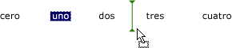

# Cómo: Mostrar una marca de inserción en un control ListView de formularios Windows Forms
La marca de inserción del control <xref:System.Windows.Forms.ListView> muestra a los usuarios el punto en el que se insertarán los elementos arrastrados. Cuando un usuario arrastra un elemento a un punto entre otros dos elementos, la marca de inserción muestra la nueva ubicación esperada del elemento.  
  
> [!NOTE]
>  La característica de marca de inserción solo está disponible en [!INCLUDE[WinXpFamily](../../../../includes/winxpfamily-md.md)] cuando la aplicación llama al método <xref:System.Windows.Forms.Application.EnableVisualStyles%2A?displayProperty=nameWithType>. En sistemas operativos anteriores, cualquier código relacionado con la marca de inserción no tiene ningún efecto y la marca de inserción no aparecerá. Para obtener más información, vea <xref:System.Windows.Forms.ListViewInsertionMark>.  
  
 La siguiente imagen muestra una marca de inserción:  
  
   
  
 El ejemplo de código siguiente muestra cómo utilizar esta característica.  
  
## Ejemplo  
 [!code-cpp[System.Windows.Forms.ListView.InsertionMark#1](../../../../samples/snippets/cpp/VS_Snippets_Winforms/System.Windows.Forms.ListView.InsertionMark/CPP/listviewinsertionmarkexample.cpp#1)]
 [!code-csharp[System.Windows.Forms.ListView.InsertionMark#1](../../../../samples/snippets/csharp/VS_Snippets_Winforms/System.Windows.Forms.ListView.InsertionMark/CS/listviewinsertionmarkexample.cs#1)]
 [!code-vb[System.Windows.Forms.ListView.InsertionMark#1](../../../../samples/snippets/visualbasic/VS_Snippets_Winforms/System.Windows.Forms.ListView.InsertionMark/VB/listviewinsertionmarkexample.vb#1)]  
  
## Compilar el código  
 Para este ejemplo se necesita:  
  
-   Referencias a los ensamblados System y System.Windows.Forms.  
  
 Para obtener información acerca de cómo compilar este ejemplo desde la línea de comandos de Visual Basic o Visual C#, vea [compilar desde la línea de comandos](~/docs/visual-basic/reference/command-line-compiler/building-from-the-command-line.md) o [Command-Line Building With csc.exe](~/docs/csharp/language-reference/compiler-options/command-line-building-with-csc-exe.md). También puede compilar este ejemplo en [!INCLUDE[vsprvs](../../../../includes/vsprvs-md.md)] pegando el código en un nuevo proyecto.  Consulte también [Cómo: Compilar y ejecutar un ejemplo de código completo de Windows Forms en Visual Studio](http://msdn.microsoft.com/library/Bb129228\(v=vs.110\)).  
  
## Vea también  
 <xref:System.Windows.Forms.ListView>  
 <xref:System.Windows.Forms.ListView.InsertionMark%2A?displayProperty=nameWithType>  
 <xref:System.Windows.Forms.ListViewInsertionMark>  
 [ListView (Control)](../../../../docs/framework/winforms/controls/listview-control-windows-forms.md)  
 [Información general del control ListView](../../../../docs/framework/winforms/controls/listview-control-overview-windows-forms.md)  
 [Características de Windows XP y controles de Windows Forms](http://msdn.microsoft.com/library/bc7fab94-fce9-4bf1-a8ad-a5837c91c3c0)  
 [Tutorial: Llevar a cabo una operación de arrastrar y colocar en Windows Forms](../../../../docs/framework/winforms/advanced/walkthrough-performing-a-drag-and-drop-operation-in-windows-forms.md)
