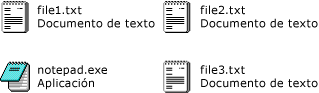

# <a name="how-to-enable-tile-view-in-a-windows-forms-listview-control"></a><span data-ttu-id="050fc-102">Cómo: Habilitar la vista en mosaico en un control ListView de formularios Windows Forms</span><span class="sxs-lookup"><span data-stu-id="050fc-102">How to: Enable Tile View in a Windows Forms ListView Control</span></span>
<span data-ttu-id="050fc-103">Con la característica de vista de mosaico del control <xref:System.Windows.Forms.ListView>, puede proporcionar equilibrio visual entre la información gráfica y de texto.</span><span class="sxs-lookup"><span data-stu-id="050fc-103">With the tile view feature of the <xref:System.Windows.Forms.ListView> control, you can provide a visual balance between graphical and textual information.</span></span> <span data-ttu-id="050fc-104">La información de texto que se muestra para un elemento en la vista de mosaico es igual que la información de columna definida para la vista de detalles.</span><span class="sxs-lookup"><span data-stu-id="050fc-104">The textual information displayed for an item in tile view is the same as the column information defined for details view.</span></span> <span data-ttu-id="050fc-105">La vista de mosaico funciona en combinación con las características de marca de inserción o agrupación del control <xref:System.Windows.Forms.ListView>.</span><span class="sxs-lookup"><span data-stu-id="050fc-105">Tile view works in combination with either the grouping or insertion mark features in the <xref:System.Windows.Forms.ListView> control.</span></span>  
  
 <span data-ttu-id="050fc-106">La vista de mosaico usa un icono de 32 x 32 píxeles y varias líneas de texto, tal y como se muestra en las siguientes imágenes.</span><span class="sxs-lookup"><span data-stu-id="050fc-106">The tile view uses a 32 x 32 pixel icon and several lines of text, as shown in the following images.</span></span>  
  
 <span data-ttu-id="050fc-107"></span><span class="sxs-lookup"><span data-stu-id="050fc-107"></span></span>  
<span data-ttu-id="050fc-108">Texto e iconos de la vista de mosaico</span><span class="sxs-lookup"><span data-stu-id="050fc-108">Tile view icons and text</span></span>  
  
 <span data-ttu-id="050fc-109">Para habilitar la vista de mosaico, establezca la propiedad <xref:System.Windows.Forms.ListView.View%2A> en <xref:System.Windows.Forms.View.Tile>.</span><span class="sxs-lookup"><span data-stu-id="050fc-109">To enable tile view, set the <xref:System.Windows.Forms.ListView.View%2A> property to <xref:System.Windows.Forms.View.Tile>.</span></span> <span data-ttu-id="050fc-110">Puede ajustar el tamaño de los mosaicos estableciendo la propiedad <xref:System.Windows.Forms.ListView.TileSize%2A>, y el número de líneas de texto que se muestran en el mosaico ajustando la colección <xref:System.Windows.Forms.ListView.Columns%2A>.</span><span class="sxs-lookup"><span data-stu-id="050fc-110">You can adjust the size of the tiles by setting the <xref:System.Windows.Forms.ListView.TileSize%2A> property, and the number of text lines displayed in the tile by adjusting the <xref:System.Windows.Forms.ListView.Columns%2A> collection.</span></span>  
  
> [!NOTE]
>  <span data-ttu-id="050fc-111">La vista de mosaico solo está disponible en [!INCLUDE[WinXpFamily](../../../../includes/winxpfamily-md.md)] cuando la aplicación llama al método <xref:System.Windows.Forms.Application.EnableVisualStyles%2A?displayProperty=nameWithType>.</span><span class="sxs-lookup"><span data-stu-id="050fc-111">The tile view is available only on [!INCLUDE[WinXpFamily](../../../../includes/winxpfamily-md.md)] when your application calls the <xref:System.Windows.Forms.Application.EnableVisualStyles%2A?displayProperty=nameWithType> method.</span></span> <span data-ttu-id="050fc-112">En sistemas operativos anteriores, el código relacionado con la vista de mosaico no tiene ningún efecto y el control <xref:System.Windows.Forms.ListView> se muestra en la vista de iconos grandes.</span><span class="sxs-lookup"><span data-stu-id="050fc-112">On earlier operating systems, any code related to the tile view has no effect, and the <xref:System.Windows.Forms.ListView> control displays in the large icon view.</span></span> <span data-ttu-id="050fc-113">Para obtener más información, vea <xref:System.Windows.Forms.ListView.View%2A?displayProperty=nameWithType>.</span><span class="sxs-lookup"><span data-stu-id="050fc-113">For more information, see <xref:System.Windows.Forms.ListView.View%2A?displayProperty=nameWithType>.</span></span>  
  
### <a name="to-set-tile-view-programmatically"></a><span data-ttu-id="050fc-114">Para establecer la vista de mosaico mediante programación</span><span class="sxs-lookup"><span data-stu-id="050fc-114">To set tile view programmatically</span></span>  
  
1.  <span data-ttu-id="050fc-115">Use la enumeración <xref:System.Windows.Forms.View> del control <xref:System.Windows.Forms.ListView>.</span><span class="sxs-lookup"><span data-stu-id="050fc-115">Use the <xref:System.Windows.Forms.View> enumeration of the <xref:System.Windows.Forms.ListView> control.</span></span>  
  
    ```vb  
    ListView1.View = View.Tile  
    ```  
  
    ```csharp  
    listView1.View = View.Tile;  
    ```  
  
## <a name="example"></a><span data-ttu-id="050fc-116">Ejemplo</span><span class="sxs-lookup"><span data-stu-id="050fc-116">Example</span></span>  
 <span data-ttu-id="050fc-117">En el siguiente ejemplo de código completo se muestra la vista de mosaico con mosaicos modificados para mostrar tres líneas de texto.</span><span class="sxs-lookup"><span data-stu-id="050fc-117">The following complete code example demonstrates Tile view with tiles modified to show three lines of text.</span></span> <span data-ttu-id="050fc-118">El tamaño del mosaico se ha adaptado para evitar el ajuste de línea.</span><span class="sxs-lookup"><span data-stu-id="050fc-118">The tile size has been adjusted to prevent line-wrapping.</span></span>  
  
 [!code-cpp[System.Windows.Forms.ListView.Tiling#1](../../../../samples/snippets/cpp/VS_Snippets_Winforms/System.Windows.Forms.ListView.Tiling/CPP/listviewtilingexample.cpp#1)]
 [!code-csharp[System.Windows.Forms.ListView.Tiling#1](../../../../samples/snippets/csharp/VS_Snippets_Winforms/System.Windows.Forms.ListView.Tiling/CS/listviewtilingexample.cs#1)]
 [!code-vb[System.Windows.Forms.ListView.Tiling#1](../../../../samples/snippets/visualbasic/VS_Snippets_Winforms/System.Windows.Forms.ListView.Tiling/VB/listviewtilingexample.vb#1)]  
  
## <a name="compiling-the-code"></a><span data-ttu-id="050fc-119">Compilar el código</span><span class="sxs-lookup"><span data-stu-id="050fc-119">Compiling the Code</span></span>  
 <span data-ttu-id="050fc-120">Para este ejemplo se necesita:</span><span class="sxs-lookup"><span data-stu-id="050fc-120">This example requires:</span></span>  
  
-   <span data-ttu-id="050fc-121">Referencias a los ensamblados System y System.Windows.Forms.</span><span class="sxs-lookup"><span data-stu-id="050fc-121">References to the System and System.Windows.Forms assemblies.</span></span>  
  
-   <span data-ttu-id="050fc-122">Un archivo de icono llamado book.ico en el mismo directorio que el archivo ejecutable.</span><span class="sxs-lookup"><span data-stu-id="050fc-122">An icon file named book.ico in the same directory as the executable file.</span></span>  
  
 <span data-ttu-id="050fc-123">Para obtener información sobre cómo compilar este ejemplo desde la línea de comandos para Visual Basic o Visual C#, vea [compilar desde la línea de comandos](~/docs/visual-basic/reference/command-line-compiler/building-from-the-command-line.md) o [de línea de comandos con csc.exe](~/docs/csharp/language-reference/compiler-options/command-line-building-with-csc-exe.md).</span><span class="sxs-lookup"><span data-stu-id="050fc-123">For information about building this example from the command line for Visual Basic or Visual C#, see [Building from the Command Line](~/docs/visual-basic/reference/command-line-compiler/building-from-the-command-line.md) or [Command-line Building With csc.exe](~/docs/csharp/language-reference/compiler-options/command-line-building-with-csc-exe.md).</span></span> <span data-ttu-id="050fc-124">También puede compilar este ejemplo en Visual Studio pegando el código en un nuevo proyecto.</span><span class="sxs-lookup"><span data-stu-id="050fc-124">You can also build this example in Visual Studio by pasting the code into a new project.</span></span>  <span data-ttu-id="050fc-125">Vea también [Cómo: Compilar y ejecutar un ejemplo de código completo de Windows Forms en Visual Studio](https://msdn.microsoft.com/library/Bb129228\(v=vs.110\)).</span><span class="sxs-lookup"><span data-stu-id="050fc-125">Also see [How to: Compile and Run a Complete Windows Forms Code Example Using Visual Studio](https://msdn.microsoft.com/library/Bb129228\(v=vs.110\)).</span></span>  
  
## <a name="see-also"></a><span data-ttu-id="050fc-126">Vea también</span><span class="sxs-lookup"><span data-stu-id="050fc-126">See Also</span></span>  
 <xref:System.Windows.Forms.ListView>  
 <xref:System.Windows.Forms.ListView.TileSize%2A>  
 [<span data-ttu-id="050fc-127">ListView (Control)</span><span class="sxs-lookup"><span data-stu-id="050fc-127">ListView Control</span></span>](../../../../docs/framework/winforms/controls/listview-control-windows-forms.md)  
 [<span data-ttu-id="050fc-128">Información general del control ListView</span><span class="sxs-lookup"><span data-stu-id="050fc-128">ListView Control Overview</span></span>](../../../../docs/framework/winforms/controls/listview-control-overview-windows-forms.md)  
 [<span data-ttu-id="050fc-129">Características de Windows XP y controles de Windows Forms</span><span class="sxs-lookup"><span data-stu-id="050fc-129">Windows XP Features and Windows Forms Controls</span></span>](https://msdn.microsoft.com/library/bc7fab94-fce9-4bf1-a8ad-a5837c91c3c0)
