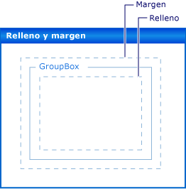

# Márgenes y relleno en controles de formularios Windows Forms
La posición precisa de los controles del formulario es de alta prioridad para muchas aplicaciones. El espacio de nombres <xref:System.Windows.Forms?displayProperty=nameWithType> le ofrece muchas características de diseño para lograrlo. Dos de las más importantes son las propiedades <xref:System.Windows.Forms.Control.Margin%2A> y <xref:System.Windows.Forms.Control.Padding%2A>.  
  
 La propiedad <xref:System.Windows.Forms.Control.Margin%2A> define el espacio alrededor del control que mantiene a los demás controles a una distancia especificada de los bordes del control.  
  
 La propiedad <xref:System.Windows.Forms.Control.Padding%2A> define el espacio en el interior de un control que mantiene el contenido del control (por ejemplo, el valor de su propiedad <xref:System.Windows.Forms.Control.Text%2A>) a una distancia especificada de los bordes del control.  
  
 La siguiente ilustración muestra las propiedades <xref:System.Windows.Forms.Control.Padding%2A> y <xref:System.Windows.Forms.Control.Margin%2A> de un control.  
  
   
  
 Hay compatibilidad en tiempo de diseño para esta característica en Visual Studio. Vea también [Tutorial: diseñar Windows Forms controles con relleno, márgenes y la propiedad AutoSize](windows-forms-controls-padding-autosize.md).  
  
## Consulte también

- <xref:System.Windows.Forms.Control.AutoSize%2A>
- <xref:System.Windows.Forms.Control.Margin%2A>
- <xref:System.Windows.Forms.Control.Padding%2A>
- <xref:System.Windows.Forms.Control.LayoutEngine%2A>
- <xref:System.Windows.Forms.TableLayoutPanel>
- <xref:System.Windows.Forms.FlowLayoutPanel>
