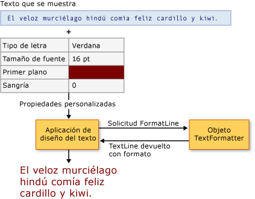

# Formato de texto avanzado
[!INCLUDE[TLA#tla_wpf](../../../../includes/tlasharptla-wpf-md.md)] proporciona un conjunto robusto de [!INCLUDE[TLA#tla_api#plural](../../../../includes/tlasharptla-apisharpplural-md.md)] para incluir texto en las aplicaciones.  Las [!INCLUDE[TLA2#tla_api#plural](../../../../includes/tla2sharptla-apisharpplural-md.md)] de diseño y [!INCLUDE[TLA#tla_ui](../../../../includes/tlasharptla-ui-md.md)], como <xref:System.Windows.Controls.TextBlock>, proporcionan los elementos de uso más común y general para la presentación de texto.  Las [!INCLUDE[TLA2#tla_api#plural](../../../../includes/tla2sharptla-apisharpplural-md.md)] de dibujo, como <xref:System.Windows.Media.GlyphRunDrawing> y <xref:System.Windows.Media.FormattedText>, proporcionan medios para incluir texto con formato en dibujos.  En el nivel más avanzado, [!INCLUDE[TLA2#tla_wpf](../../../../includes/tla2sharptla-wpf-md.md)] proporciona un motor de formato de texto extensible para controlar todos los aspectos de la presentación de texto, como la administración de almacenes de texto, de formatos de ejecución de texto y de objetos incrustados.  
  
 En este tema se proporciona una introducción al formato de texto en [!INCLUDE[TLA2#tla_wpf](../../../../includes/tla2sharptla-wpf-md.md)].  Se centra en la implementación del cliente y en el uso del motor de formato de texto de [!INCLUDE[TLA2#tla_wpf](../../../../includes/tla2sharptla-wpf-md.md)].  
  
> [!NOTE]
>  Todos los ejemplos de código de este documento se encuentran en [Advanced Text Formatting Sample](http://go.microsoft.com/fwlink/?LinkID=159965).  
  
 [!INCLUDE[autoOutline](../Token/autoOutline_md.md)]  
  
   
## Requisitos previos  
 En este tema se da por hecho que está familiarizado con las [!INCLUDE[TLA2#tla_api#plural](../../../../includes/tla2sharptla-apisharpplural-md.md)] de nivel superior utilizadas para la presentación de texto.  En la mayoría de los escenarios de usuarios no se requieren las [!INCLUDE[TLA2#tla_api#plural](../../../../includes/tla2sharptla-apisharpplural-md.md)] de formato de texto avanzado que se explican en este tema.  Para obtener una introducción a las distintas [!INCLUDE[TLA2#tla_api#plural](../../../../includes/tla2sharptla-apisharpplural-md.md)] de texto, vea [Documentos en WPF](../../../../docs/framework/wpf/advanced/documents-in-wpf.md).  
  
   
## Formato de texto avanzado  
 El diseño de texto y los controles de [!INCLUDE[TLA2#tla_ui](../../../../includes/tla2sharptla-ui-md.md)] de [!INCLUDE[TLA2#tla_wpf](../../../../includes/tla2sharptla-wpf-md.md)] proporcionan propiedades de formato que permiten incluir con facilidad texto con formato en una aplicación.  Estos controles exponen varias propiedades para administrar la presentación de texto, incluidos su tipo de letra, tamaño y color.  En circunstancias normales, estos controles pueden administrar la mayoría de la presentación de texto en la aplicación.  Sin embargo, algunos escenarios avanzados requieren control de almacenamiento de texto y presentación del texto.  [!INCLUDE[TLA2#tla_wpf](../../../../includes/tla2sharptla-wpf-md.md)] proporciona un motor de formato de texto extensible para este propósito.  
  
 Las características de formato de texto avanzado de [!INCLUDE[TLA2#tla_wpf](../../../../includes/tla2sharptla-wpf-md.md)] son un motor de formato de texto, un almacén de texto, ejecuciones de texto y propiedades de formato.  El motor de formato de texto, <xref:System.Windows.Media.TextFormatting.TextFormatter>, crea líneas de texto que se van a utilizar para la presentación.  Para ello, se inicia el proceso de formato de líneas y se llama al método <xref:System.Windows.Media.TextFormatting.TextFormatter.FormatLine%2A>del formateador de texto.  El formateador de texto recupera las ejecuciones de texto del almacén de texto llamando al método <xref:System.Windows.Media.TextFormatting.TextSource.GetTextRun%2A> del almacén.  A continuación, el formateador de texto convierte los objetos <xref:System.Windows.Media.TextFormatting.TextRun> en objetos <xref:System.Windows.Media.TextFormatting.TextLine> y se entregan a la aplicación para inspección o presentación.  
  
   
## Utilizar el formateador de texto  
 <xref:System.Windows.Media.TextFormatting.TextFormatter> es el motor de formato de texto de [!INCLUDE[TLA2#tla_wpf](../../../../includes/tla2sharptla-wpf-md.md)], que proporciona servicios para dar formato a las líneas de texto e introducir saltos de línea.  El formateador de texto puede administrar distintos formatos de caracteres de texto y estilos de párrafo, e incluye compatibilidad con el diseño de texto internacional.  
  
 A diferencia de la [!INCLUDE[TLA#tla_api](../../../../includes/tlasharptla-api-md.md)] de texto tradicional, <xref:System.Windows.Media.TextFormatting.TextFormatter> interactúa con un cliente de diseño de texto a través de un conjunto de métodos de devolución de llamada.  Necesita que el cliente proporcione estos métodos en una implementación de la clase <xref:System.Windows.Media.TextFormatting.TextSource>.  En el diagrama siguiente se muestra la interacción de diseño de texto entre la aplicación cliente y <xref:System.Windows.Media.TextFormatting.TextFormatter>.  
  
   
Interacción entre la aplicación y TextFormatter  
  
 El formateador de texto se utiliza para recuperar líneas del texto con formato del almacén de texto, que es una implementación de <xref:System.Windows.Media.TextFormatting.TextSource>.  Para ello, se crea en primer lugar una instancia del formateador de texto utilizando el método <xref:System.Windows.Media.TextFormatting.TextFormatter.Create%2A>.  Este método crea una instancia del formateador de texto y establece los valores máximos de alto y ancho de línea.  Una vez creada una instancia del formateador de texto, se inicia el proceso de creación de líneas llamando al método <xref:System.Windows.Media.TextFormatting.TextFormatter.FormatLine%2A>.  <xref:System.Windows.Media.TextFormatting.TextFormatter> vuelve a llamar al origen del texto para recuperar los parámetros de texto y formato correspondientes a las ejecuciones de texto que componen una línea.  
  
 En el ejemplo siguiente se muestra el proceso de dar formato a un almacén de texto.  Se utiliza el objeto <xref:System.Windows.Media.TextFormatting.TextFormatter> para recuperar líneas de texto del almacén de texto y, a continuación, dar formato a la línea de texto para dibujar en <xref:System.Windows.Media.DrawingContext>.  
  
 [!code-csharp[TextFormatterExample#100](../../../../samples/snippets/csharp/VS_Snippets_Wpf/TextFormatterExample/CSharp/Window1.xaml.cs#100)]
 [!code-vb[TextFormatterExample#100](../../../../samples/snippets/visualbasic/VS_Snippets_Wpf/TextFormatterExample/VisualBasic/Window1.xaml.vb#100)]  
  
   
## Implementar el almacén de texto de cliente  
 Al extender el motor de formato de texto, se hace necesario implementar y administrar todos los aspectos del almacén de texto.  No es una labor trivial.  El almacén de texto es responsable de realizar el seguimiento de las propiedades de las ejecuciones de texto, las propiedades de párrafo, los objetos incrustados y otro contenido similar.  Además, proporciona objetos <xref:System.Windows.Media.TextFormatting.TextRun> individuales al formateador de texto, que este utiliza para crear objetos <xref:System.Windows.Media.TextFormatting.TextLine>.  
  
 Para administrar la virtualización del almacén de texto, este último debe derivarse de <xref:System.Windows.Media.TextFormatting.TextSource>.  <xref:System.Windows.Media.TextFormatting.TextSource> define el método utilizado por el formateador de texto para recuperar ejecuciones de texto del almacén de texto.  <xref:System.Windows.Media.TextFormatting.TextSource.GetTextRun%2A> es el método utilizado por el formateador de texto para recuperar las ejecuciones de texto utilizadas para dar formato a las líneas.  El formateador de texto realiza repetidamente la llamada a <xref:System.Windows.Media.TextFormatting.TextSource.GetTextRun%2A> hasta que se cumple una de las condiciones siguientes:  
  
-   Se devuelve un <xref:System.Windows.Media.TextFormatting.TextEndOfLine> o una subclase.  
  
-   El ancho acumulado de las ejecuciones de texto supera el ancho de línea máximo especificado en la llamada para crear el formateador de texto o bien en la llamada al método <xref:System.Windows.Media.TextFormatting.TextFormatter.FormatLine%2A> del formateador de texto.  
  
-   Se devuelve una secuencia [!INCLUDE[TLA#tla_unicode](../../../../includes/tlasharptla-unicode-md.md)] de nueva línea, como "CF", "LF" o "CRLF".  
  
   
## Proporcionar ejecuciones de texto  
 El núcleo del proceso de formato de texto es la interacción entre el formateador de texto y el almacén de texto.  La implementación de <xref:System.Windows.Media.TextFormatting.TextSource> proporciona al formateador de texto los objetos <xref:System.Windows.Media.TextFormatting.TextRun> y las propiedades con las que dar formato a las ejecuciones de texto.  El método <xref:System.Windows.Media.TextFormatting.TextSource.GetTextRun%2A>, al que llama el formateador de texto, administra esta interacción.  
  
 En la tabla siguiente se muestran algunos de los objetos <xref:System.Windows.Media.TextFormatting.TextRun> predefinidos.  
  
|Tipo de TextRun|Uso|  
|---------------------|---------|  
|<xref:System.Windows.Media.TextFormatting.TextCharacters>|Ejecución de texto especializada que se usa para devolver una representación de glifos de caracteres al formateador de textos.|  
|<xref:System.Windows.Media.TextFormatting.TextEmbeddedObject>|Ejecución de texto especializada que se usa para proporcionar contenido en el que se efectúan de manera global las pruebas de posicionamiento, la medición y el dibujo, como un botón o una imagen dentro del texto.|  
|<xref:System.Windows.Media.TextFormatting.TextEndOfLine>|Ejecución de texto especializada que se usa para marcar el fin de una línea.|  
|<xref:System.Windows.Media.TextFormatting.TextEndOfParagraph>|Ejecución de texto especializada que se usa para marcar el fin de un párrafo.|  
|<xref:System.Windows.Media.TextFormatting.TextEndOfSegment>|Ejecución de texto especializada que se usa para marcar el fin de un segmento, como el final del ámbito afectado por la ejecución anterior de <xref:System.Windows.Media.TextFormatting.TextModifier>.|  
|<xref:System.Windows.Media.TextFormatting.TextHidden>|Ejecución de texto especializada que se usa para marcar un intervalo de caracteres ocultos.|  
|<xref:System.Windows.Media.TextFormatting.TextModifier>|Ejecución de texto especializada que se usa para modificar las propiedades de las ejecuciones de texto de su ámbito.  El ámbito se extiende hasta la siguiente ejecución de texto <xref:System.Windows.Media.TextFormatting.TextEndOfSegment> coincidente, o hasta el siguiente <xref:System.Windows.Media.TextFormatting.TextEndOfParagraph>.|  
  
 Se pueden crear subclases de cualquiera de los objetos <xref:System.Windows.Media.TextFormatting.TextRun> predefinidos.  Esto permite que el origen de texto proporcione al formateador de texto ejecuciones de texto que incluyen datos personalizados.  
  
 En el siguiente ejemplo se muestra un método <xref:System.Windows.Media.TextFormatting.TextSource.GetTextRun%2A>.  Este almacén de texto devuelve objetos <xref:System.Windows.Media.TextFormatting.TextRun> al formateador de texto para procesarlos.  
  
 [!code-csharp[TextFormatterExample#101](../../../../samples/snippets/csharp/VS_Snippets_Wpf/TextFormatterExample/CSharp/CustomTextSource.cs#101)]
 [!code-vb[TextFormatterExample#101](../../../../samples/snippets/visualbasic/VS_Snippets_Wpf/TextFormatterExample/VisualBasic/CustomTextSource.vb#101)]  
  
> [!NOTE]
>  En este ejemplo, el almacén de texto proporciona las mismas propiedades de texto a todo el texto.  Los almacenes de texto avanzados deben implementar su propia administración de intervalos, a fin de permitir que caracteres individuales tengan propiedades diferentes.  
  
   
## Especificar propiedades de formato  
 Se da formato a los objetos <xref:System.Windows.Media.TextFormatting.TextRun> utilizando propiedades proporcionadas por el almacén del texto.  Estas propiedades se proporcionan en dos tipos, <xref:System.Windows.Media.TextFormatting.TextParagraphProperties> y <xref:System.Windows.Media.TextFormatting.TextRunProperties>.  <xref:System.Windows.Media.TextFormatting.TextParagraphProperties> administra propiedades de inclusión de párrafo como <xref:System.Windows.TextAlignment> y <xref:System.Windows.FlowDirection>.  <xref:System.Windows.Media.TextFormatting.TextRunProperties> son propiedades que pueden ser diferentes para cada ejecución de texto de un párrafo, como un pincel de primer plano, <xref:System.Windows.Media.Typeface> y el tamaño de fuente.  Para implementar los tipos de propiedades de párrafos y ejecuciones de texto personalizados, la aplicación debe crear clases que se deriven de <xref:System.Windows.Media.TextFormatting.TextParagraphProperties> y <xref:System.Windows.Media.TextFormatting.TextRunProperties>, respectivamente.  
  
## Vea también  
 [Tipografía en WPF](../../../../docs/framework/wpf/advanced/typography-in-wpf.md)   
 [Documentos en WPF](../../../../docs/framework/wpf/advanced/documents-in-wpf.md)