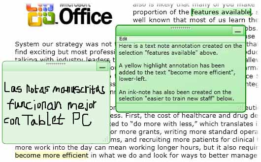
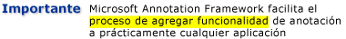
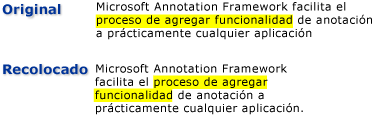

# Información general sobre anotacionesAnnotations Overview
Escribir notas o comentarios en documentos impresos es una actividad tan habitual que prácticamente la subestimamos.Writing notes or comments on paper documents is such a commonplace activity that we almost take it for granted. Las notas o los comentarios son "anotaciones" que se agregan a un documento para marcar información o resaltar elementos de interés para su posterior referencia.These notes or comments are "annotations" that we add to a document to flag information or to highlight items of interest for later reference. Aunque escribir notas en documentos impresos es fácil y habitual, la capacidad de agregar comentarios personales a documentos electrónicos, si la hay, suele ser muy limitada.Although writing notes on printed documents is easy and commonplace, the ability to add personal comments to electronic documents is typically very limited, if available at all.  
  
 En este tema se revisan varios tipos comunes de anotaciones, específicamente notas adhesivas y resaltados, e ilustra cómo Microsoft Annotations Framework facilita estos tipos de anotaciones en aplicaciones a través de Windows Presentation Foundation (WPFWPF ) controles de visualización de documentos.This topic reviews several common types of annotations, specifically sticky notes and highlights, and illustrates how the Microsoft Annotations Framework facilitates these types of annotations in applications through the Windows Presentation Foundation (WPF) document viewing controls.  WpfWPF controles de visualización <xref:System.Windows.Controls.FlowDocumentReader> <xref:System.Windows.Controls.FlowDocumentScrollViewer>de documentos que admiten anotaciones incluyen y , así como controles derivados de <xref:System.Windows.Controls.Primitives.DocumentViewerBase> tales como <xref:System.Windows.Controls.DocumentViewer> y <xref:System.Windows.Controls.FlowDocumentPageViewer>.WPF document viewing controls that support annotations include <xref:System.Windows.Controls.FlowDocumentReader> and <xref:System.Windows.Controls.FlowDocumentScrollViewer>, as well as controls derived from <xref:System.Windows.Controls.Primitives.DocumentViewerBase> such as <xref:System.Windows.Controls.DocumentViewer> and <xref:System.Windows.Controls.FlowDocumentPageViewer>.  

## Notas rápidasSticky Notes  
 Una nota rápida típica contiene la información escrita en un pequeño trozo de papel de color que se "pega" en un documento.A typical sticky note contains information written on a small piece of colored paper that is then "stuck" to a document. Las notas adhesivas digitales proporcionan una funcionalidad similar para los documentos electrónicos, pero con la flexibilidad añadida para incluir muchos otros tipos de contenido, como texto mecanografiado, notas manuscritas (por ejemplo, trazos de "tinta" de Tablet PC) o enlaces web.Digital sticky notes provide similar functionality for electronic documents, but with the added flexibility to include many other types of content such as typed text, handwritten notes (for example, Tablet PC "ink" strokes), or Web links.  
  
 La siguiente ilustración muestra algunos ejemplos de anotaciones de resaltado, notas rápidas de texto y notas rápidas de lápiz.The following illustration shows some examples of highlight, text sticky note, and ink sticky note annotations.  
  
   
  
 En el ejemplo siguiente se muestra el método que puede usar para habilitar la compatibilidad con las anotaciones de la aplicación.The following example shows the method that you can use to enable annotation support in your application.  
  
 [!code-csharp[DocViewerAnnotationsXml#DocViewXmlStartAnnotations](~/samples/snippets/csharp/VS_Snippets_Wpf/DocViewerAnnotationsXml/CSharp/Window1.xaml.cs#docviewxmlstartannotations)]
 [!code-vb[DocViewerAnnotationsXml#DocViewXmlStartAnnotations](~/samples/snippets/visualbasic/VS_Snippets_Wpf/DocViewerAnnotationsXml/visualbasic/window1.xaml.vb#docviewxmlstartannotations)]  
  

## Aspectos destacadosHighlights  
 Las personas usan métodos creativos para atraer la atención a los elementos de interés cuando marcan un documento impreso, como subrayar, resaltar, rodear palabras de una frase con un círculo o dibujar marcas o notaciones en el margen.People use creative methods to draw attention to items of interest when they mark up a paper document, such as underlining, highlighting, circling words in a sentence, or drawing marks or notations in the margin.  Resaltar anotaciones en Microsoft Annotations Framework proporcionan una característica similar para marcar la información que se muestra en WPFWPF controles de visualización de documentos.Highlight annotations in Microsoft Annotations Framework provide a similar feature for marking up information displayed in WPF document viewing controls.  
  
 En la ilustración siguiente se muestra un ejemplo de una anotación de resaltado.The following illustration shows an example of a highlight annotation.  
  
   
  
 Normalmente, los usuarios crean anotaciones seleccionando primero algún texto o <xref:System.Windows.Controls.ContextMenu> un elemento de interés y, a continuación, haciendo clic con el botón derecho para mostrar una de las opciones de anotación.Users typically create annotations by first selecting some text or an item of interest, and then right-clicking to display a <xref:System.Windows.Controls.ContextMenu> of annotation options.  En el ejemplo [!INCLUDE[TLA#tla_xaml](../../../../includes/tlasharptla-xaml-md.md)] siguiente se muestra <xref:System.Windows.Controls.ContextMenu> el que puede usar para declarar un comando con enrutado al que los usuarios pueden tener acceso para crear y administrar anotaciones.The following example shows the [!INCLUDE[TLA#tla_xaml](../../../../includes/tlasharptla-xaml-md.md)] you can use to declare a <xref:System.Windows.Controls.ContextMenu> with routed commands that users can access to create and manage annotations.  
  
 [!code-xaml[DocViewerAnnotationsXps#CreateDeleteAnnotations](~/samples/snippets/csharp/VS_Snippets_Wpf/DocViewerAnnotationsXps/CSharp/Window1.xaml#createdeleteannotations)]  
  

## Delimitación de datosData Anchoring  
 El marco de trabajo de anotaciones enlaza anotaciones a los datos que el usuario selecciona, no solo a una posición en la vista de visualización.The Annotations Framework binds annotations to the data that the user selects, not just to a position on the display view. Por lo tanto, si la vista del documento cambia, por ejemplo cuando el usuario se desplaza por la ventana de presentación o cambia su tamaño, la anotación permanece con la selección de datos a la que está enlazada.Therefore, if the document view changes, such as when the user scrolls or resizes the display window, the annotation stays with the data selection to which it is bound. Por ejemplo, el siguiente gráfico ilustra una anotación que el usuario realizó en una selección de texto.For example, the following graphic illustrates an annotation that the user has made on a text selection. Cuando el documento observa cambios (desplazamiento, cambio de tamaño, escalado u otros movimientos), la anotación de resaltado se mueve con la selección de datos original.When the document view changes (scrolls, resizes, scales, or otherwise moves), the highlight annotation moves with the original data selection.  
  
   
  

## Coincidencia de anotaciones con objetos anotadosMatching Annotations with Annotated Objects  
 Puede hacer coincidir las anotaciones con los objetos anotados correspondientes.You can match annotations with the corresponding annotated objects. Por ejemplo, considere una aplicación de lector de documentos simple que tiene un panel de comentarios.For example, consider a simple document reader application that has a comments pane. El panel de comentarios podría ser un cuadro de lista que muestra el texto de una lista de anotaciones ancladas a un documento.The comments pane might be a list box that displays the text from a list of annotations that are anchored to a document. Si el usuario selecciona un elemento en el cuadro de lista, la aplicación muestra el párrafo del documento al que está anclado el objeto de anotación correspondiente.If the user selects an item in the list box, then the application brings into view the paragraph in the document that the corresponding annotation object is anchored to.  
  
 En el ejemplo siguiente se muestra cómo implementar el controlador de eventos de un cuadro de lista como este que sirve de panel de comentarios.The following example demonstrates how to implement the event handler of such a list box that serves as the comments pane.  
  
 [!code-csharp[FlowDocumentAnnotatedViewer#Handler](~/samples/snippets/csharp/VS_Snippets_Wpf/FlowDocumentAnnotatedViewer/CSharp/Window1.xaml.cs#handler)]
 [!code-vb[FlowDocumentAnnotatedViewer#Handler](~/samples/snippets/visualbasic/VS_Snippets_Wpf/FlowDocumentAnnotatedViewer/visualbasic/window1.xaml.vb#handler)]  
  
 Otro escenario de ejemplo implica aplicaciones que permiten el intercambio de anotaciones y notas adhesivas entre lectores de documentos a través de correo electrónico.Another example scenario involves applications that enable the exchange of annotations and sticky notes between document readers through email. Esta característica permite que estas aplicaciones naveguen en el lector hasta la página que contiene la anotación que se está intercambiando.This feature enables these applications to navigate the reader to the page that contains the annotation that is being exchanged.  
  
## Consulte tambiénSee also

- <xref:System.Windows.Controls.Primitives.DocumentViewerBase>
- <xref:System.Windows.Controls.DocumentViewer>
- <xref:System.Windows.Controls.FlowDocumentPageViewer>
- <xref:System.Windows.Controls.FlowDocumentScrollViewer>
- <xref:System.Windows.Controls.FlowDocumentReader>
- <xref:System.Windows.Annotations.IAnchorInfo>
- [Esquema en anotacionesAnnotations Schema](annotations-schema.md)
- [Información general sobre ContextMenuContextMenu Overview](../controls/contextmenu-overview.md)
- [Información general sobre comandosCommanding Overview](commanding-overview.md)
- [Información general sobre documentos dinámicosFlow Document Overview](flow-document-overview.md)
- [Cómo: Agregar un comando a un elemento de menú](https://docs.microsoft.com/previous-versions/dotnet/netframework-3.5/ms741839(v=vs.90))[How to: Add a Command to a MenuItem](https://docs.microsoft.com/previous-versions/dotnet/netframework-3.5/ms741839(v=vs.90))
