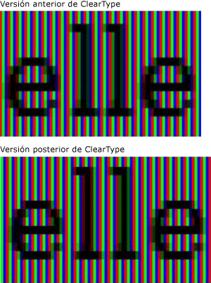
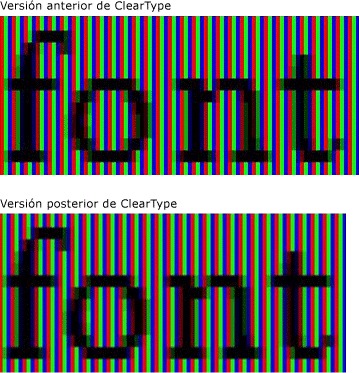
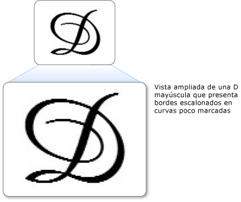
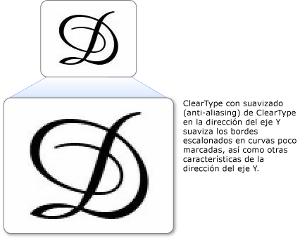

# Información general sobre ClearType
En este tema se proporciona información general [!INCLUDE[TLA#tla_winclient](../../../../includes/tlasharptla-winclient-md.md)]sobre la tecnología ClearType de Microsoft que se encuentra en el archivo .  

## Información general sobre la tecnología  
 ClearType es una tecnología de software desarrollada por Microsoft que mejora la legibilidad del texto en pantallas LCD existentes (pantallas de cristal líquido), como pantallas de portátiles, pantallas de Pocket PC y monitores de pantalla plana.  ClearType funciona accediendo a los elementos de franjas de color verticales individuales en cada píxel de una pantalla LCD. Antes de ClearType, el nivel de detalle más pequeño que un equipo podía mostrar era un solo píxel, pero con ClearType ejecutándose en un monitor LCD, ahora podemos mostrar características de texto tan pequeñas como una fracción de un píxel de ancho. Esta resolución adicional aumenta la nitidez de los detalles diminutos en la presentación del texto, lo que facilita la lectura durante largos períodos de tiempo.  
  
 El ClearType [!INCLUDE[TLA#tla_winclient](../../../../includes/tlasharptla-winclient-md.md)] disponible en es la última generación de ClearType que tiene varias mejoras sobre la versión que se encuentra en Microsoft Windows Graphics Device Interface (GDI).  
  

## Posicionamiento de subpíxeles  
 Una mejora significativa con respecto a la versión anterior de ClearType es el uso de posicionamiento de subpíxeles. A diferencia de la implementación ClearType que [!INCLUDE[TLA#tla_winclient](../../../../includes/tlasharptla-winclient-md.md)] se encuentra en GDI, ClearType que se encuentra en permite que los glifos se inicien dentro del píxel y no solo en el límite inicial del píxel. Debido a esta resolución adicional al posicionar los glifos, el espaciado y las proporciones de los glifos son más precisos y coherentes.  
  
 En los dos ejemplos siguientes se muestra cómo pueden comenzar los glifos en cualquier límite de subpíxel cuando se usa el posicionamiento de subpíxeles. El ejemplo de la izquierda se representa con la versión anterior del representador ClearType, que no empleaba el posicionamiento de subpíxeles. El ejemplo de la derecha se representa con la nueva versión del representador ClearType, mediante el posicionamiento de subpíxeles. Observe que todas las **e** y **l** de la imagen de la derecha se representan de manera ligeramente diferente porque cada una de ellas se inicia en un subpíxel diferente. Al ver el texto con su tamaño normal en la pantalla, esta diferencia no es apreciable debido al alto contraste de la imagen de glifo. Esto sólo es posible debido a un sofisticado filtrado de color que se incorpora en ClearType.  
  
   
Texto mostrado con versiones anteriores y posteriores de ClearType  
  
 Los dos ejemplos siguientes comparan la salida del representador ClearType anterior con la nueva versión del representador ClearType. El posicionamiento de subpíxeles, que se muestra a la derecha, mejora enormemente el espaciado del tipo en la pantalla, especialmente con tamaños pequeños, donde la diferencia entre un subpíxel y un píxel completo representa una proporción considerable del ancho del glifo. Observe que el espaciado entre las letras es más uniforme en la segunda imagen. El beneficio acumulativo del posicionamiento de subpíxeles en la apariencia general de una pantalla de texto se incrementa considerablemente y representa una evolución significativa en la tecnología ClearType.  
  
   
Texto con versiones anteriores y posteriores de ClearType  
  

## Suavizado de contorno de la dirección del eje Y  
 Otra mejora de [!INCLUDE[TLA#tla_winclient](../../../../includes/tlasharptla-winclient-md.md)] ClearType en es el suavizado de dirección y. El ClearType en GDI sin antialiasing de dirección Y proporciona una mejor resolución en el eje X, pero no en el eje Y. En las partes superiores e inferiores de las curvas superficiales, los bordes escalonados restan valor a legibilidad.  
  
 En el ejemplo siguiente se muestra el efecto de no tener ningún suavizado de contorno de la dirección del eje Y. En este caso, los bordes escalonados de las partes superior e inferior de la carta son evidentes.  
  
   
Texto con bordes escalonados en curvas suaves  
  
 ClearType [!INCLUDE[TLA#tla_winclient](../../../../includes/tlasharptla-winclient-md.md)] en proporciona antialiasing en el nivel de dirección Y para suavizar los bordes irregulares. Esto es especialmente importante para mejorar la legibilidad de los idiomas del este asiático, cuyos ideogramas tienen una cantidad casi igual de curvas suaves horizontales y verticales.  
  
 En el ejemplo siguiente se muestra el efecto de suavizado de contorno de la dirección del eje Y. En este caso, las partes superior e inferior de la letra muestran una curva suave.  
  
   
Texto con función de suavizado de contorno de ClearType en la dirección del eje Y  
  

## Aceleración de hardware  
 ClearType [!INCLUDE[TLA#tla_winclient](../../../../includes/tlasharptla-winclient-md.md)] in puede aprovechar la aceleración de hardware para un mejor rendimiento y para reducir la carga de la CPU y los requisitos de memoria del sistema. Mediante el uso de los sombreadores de píxeles y la memoria de vídeo de una tarjeta gráfica, ClearType proporciona una representación más rápida del texto, especialmente cuando se utiliza la animación.  
  
 ClearType [!INCLUDE[TLA#tla_winclient](../../../../includes/tlasharptla-winclient-md.md)] in no modifica la configuración de ClearType en todo el sistema. Deshabilitar ClearType en [!INCLUDE[TLA#tla_winclient](../../../../includes/tlasharptla-winclient-md.md)] Windows establece el antialiasing en modo de escala de grises. Además, ClearType in [!INCLUDE[TLA#tla_winclient](../../../../includes/tlasharptla-winclient-md.md)] no modifica la configuración de [ClearType Tuner PowerToy](https://www.microsoft.com/typography/ClearTypePowerToy.mspx).  
  
 Una de las decisiones de diseño de arquitectura de [!INCLUDE[TLA#tla_winclient](../../../../includes/tlasharptla-winclient-md.md)] consiste en mejorar la compatibilidad del diseño independiente de la resolución con monitores de mayor resolución de PPP, cuyo uso se está generalizando. Como consecuencia, [!INCLUDE[TLA#tla_winclient](../../../../includes/tlasharptla-winclient-md.md)] no admite la representación de texto con alias ni los mapas de bits de algunas fuentes del este asiático, porque ambos dependen de la resolución.  
  

## Información adicional  
 [ClearType Information](https://www.microsoft.com/typography/ClearTypeInfo.mspx) (Información de ClearType)  
  
 [ClearType Tuner PowerToy](https://www.microsoft.com/typography/ClearTypePowerToy.mspx)  
  
## Consulte también

- [Configuración del Registro de ClearType](cleartype-registry-settings.md)
