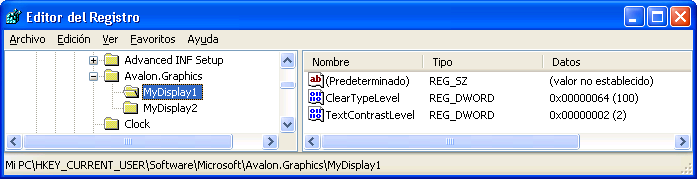

# Configuración del Registro de ClearType
Este tema proporciona información general sobre la [!INCLUDE[TLA2#tla_winclient](../../../../includes/tla2sharptla-winclient-md.md)] [!INCLUDE[TLA#tla_ct](../../../../includes/tlasharptla-ct-md.md)] configuración del registro que se utiliza por [!INCLUDE[TLA2#tla_winclient](../../../../includes/tla2sharptla-winclient-md.md)] las aplicaciones.  
  
  
   
## Información general sobre la tecnología  
 [!INCLUDE[TLA2#tla_winclient](../../../../includes/tla2sharptla-winclient-md.md)]las aplicaciones que representen el texto para un uso de dispositivo de presentación [!INCLUDE[TLA2#tla_ct](../../../../includes/tla2sharptla-ct-md.md)] características para proporcionar una experiencia de lectura mejorada. [!INCLUDE[TLA2#tla_ct](../../../../includes/tla2sharptla-ct-md.md)] es una tecnología de software desarrollada por [!INCLUDE[TLA#tla_ms](../../../../includes/tlasharptla-ms-md.md)] que mejora la legibilidad del texto en pantallas de cristal líquido (LCD) existentes, como las de portátiles, Pocket PC y monitores de pantalla plana. [!INCLUDE[TLA2#tla_ct](../../../../includes/tla2sharptla-ct-md.md)] funciona mediante el acceso a los elementos de franjas de color vertical individuales en cada píxel de una pantalla LCD. Para obtener más información sobre [!INCLUDE[TLA2#tla_ct](../../../../includes/tla2sharptla-ct-md.md)], consulte [información general sobre ClearType](../../../../docs/framework/wpf/advanced/cleartype-overview.md).  
  
 Texto que se presenta con [!INCLUDE[TLA2#tla_ct](../../../../includes/tla2sharptla-ct-md.md)] puede resultar muy diferente cuando se ve en varios dispositivos de presentación. Por ejemplo, un pequeño número de monitores de implementa los elementos de bandas de color en orden de rojo, verde, azul en lugar de los más comunes rojo, verde, azul ( [!INCLUDE[TLA#tla_rgb](../../../../includes/tlasharptla-rgb-md.md)]) orden.  
  
 Texto que se presenta con [!INCLUDE[TLA2#tla_ct](../../../../includes/tla2sharptla-ct-md.md)] también pueden aparecer significativamente diferente cuando se ve por personas con distintos niveles de sensibilidad al color. Algunas personas pueden detectar pequeñas variaciones de color mejor que otras.  
  
 En cada uno de estos casos, [!INCLUDE[TLA2#tla_ct](../../../../includes/tla2sharptla-ct-md.md)] características deban modificarse con el fin de proporcionar la mejor experiencia de lectura de cada cliente individual.  
  
   
## Configuración de registro  
 [!INCLUDE[TLA2#tla_winclient](../../../../includes/tla2sharptla-winclient-md.md)]especifica cuatro valores del registro para controlar [!INCLUDE[TLA2#tla_ct](../../../../includes/tla2sharptla-ct-md.md)] características:  
  
|Parámetro|Descripción|  
|-------------|-----------------|  
|Nivel de [!INCLUDE[TLA2#tla_ct](../../../../includes/tla2sharptla-ct-md.md)]|Describe el nivel de [!INCLUDE[TLA2#tla_ct](../../../../includes/tla2sharptla-ct-md.md)] claridad de color.|  
|Nivel de gamma|Describe el nivel del componente de color de píxel de una pantalla.|  
|Estructura de píxeles|Describe la distribución de píxeles de una pantalla.|  
|Nivel de contraste del texto|Describe el nivel de contraste del texto que se muestra.|  
  
 Estas opciones pueden tener acceso a una utilidad de configuración externos que sabe cómo hacer referencia a los productos identificados [!INCLUDE[TLA2#tla_winclient](../../../../includes/tla2sharptla-winclient-md.md)] [!INCLUDE[TLA2#tla_ct](../../../../includes/tla2sharptla-ct-md.md)] configuración del registro. Estos valores de configuración también pueden crearse o modificarse mediante el acceso a los valores directamente a través del Editor del Registro de [!INCLUDE[TLA#tla_mswin](../../../../includes/tlasharptla-mswin-md.md)].  
  
 Si el [!INCLUDE[TLA2#tla_winclient](../../../../includes/tla2sharptla-winclient-md.md)] [!INCLUDE[TLA2#tla_ct](../../../../includes/tla2sharptla-ct-md.md)] configuración del registro no se establece (que es el estado predeterminado), el [!INCLUDE[TLA2#tla_winclient](../../../../includes/tla2sharptla-winclient-md.md)] consultas de la aplicación la [!INCLUDE[TLA#tla_mswin](../../../../includes/tlasharptla-mswin-md.md)] información de parámetros de sistema de configuración de suavizado de fuentes.  
  
> [!NOTE]
>  Para obtener información sobre cómo enumerar los nombres de dispositivo de presentación, consulte la `SystemParametersInfo` [!INCLUDE[TLA2#tla_win32](../../../../includes/tla2sharptla-win32-md.md)] (función).  
  
   
## Nivel de ClearType  
 El [!INCLUDE[TLA2#tla_ct](../../../../includes/tla2sharptla-ct-md.md)] nivel le permite ajustar la representación de texto en función de la sensibilidad de color y la percepción de una persona. Para algunas personas, la representación de texto que usa [!INCLUDE[TLA2#tla_ct](../../../../includes/tla2sharptla-ct-md.md)] en su nivel más alto no genera la mejor experiencia de lectura.  
  
 El [!INCLUDE[TLA2#tla_ct](../../../../includes/tla2sharptla-ct-md.md)] nivel es un valor entero comprendido entre 0 y 100. El nivel predeterminado es 100, lo que significa que [!INCLUDE[TLA2#tla_ct](../../../../includes/tla2sharptla-ct-md.md)] utiliza la capacidad máxima de los elementos de bandas de color del dispositivo de pantalla. Sin embargo, un [!INCLUDE[TLA2#tla_ct](../../../../includes/tla2sharptla-ct-md.md)] nivel 0 representa texto como escala de grises. Estableciendo la [!INCLUDE[TLA2#tla_ct](../../../../includes/tla2sharptla-ct-md.md)] nivel en alguna parte entre 0 y 100, puede crear un nivel intermedio que es adecuado para la sensibilidad al color de un individuo.  
  
### Configuración del Registro  
 La ubicación de la configuración del registro para el [!INCLUDE[TLA2#tla_ct](../../../../includes/tla2sharptla-ct-md.md)] nivel es una configuración de usuario individual que corresponde a un nombre de dispositivo de pantalla concreto:  
  
 `HKEY_CURRENT_USER\SOFTWARE\Microsoft\Avalon.Graphics\<displayName>`  
  
 Para cada nombre de dispositivo de presentación para un usuario, un `ClearTypeLevel` se define el valor DWORD. Captura de pantalla siguiente muestra la configuración del Editor del registro para el [!INCLUDE[TLA2#tla_ct](../../../../includes/tla2sharptla-ct-md.md)] nivel.  
  
   
  
> [!NOTE]
>  [!INCLUDE[TLA2#tla_winclient](../../../../includes/tla2sharptla-winclient-md.md)]las aplicaciones representan el texto en uno de estos dos modos: con y sin [!INCLUDE[TLA2#tla_ct](../../../../includes/tla2sharptla-ct-md.md)]. Cuando se representa el texto sin [!INCLUDE[TLA2#tla_ct](../../../../includes/tla2sharptla-ct-md.md)], se conoce como representación de escala de grises.  
  
   
## Nivel de gamma  
 El nivel de gamma hace referencia a la relación no lineal entre un valor de píxel y la luminancia. El valor de nivel de gamma debe corresponder a las características físicas de la pantalla; de lo contrario, pueden producirse distorsiones en la salida representada. Por ejemplo, la prueba pueda parecer demasiado ancha o demasiado estrecha, o bien pueden aparecer franjas de color en los bordes de las bandas verticales de los glifos.  
  
 El nivel de gamma es un valor entero comprendido entre 1000 y 2200. El nivel predeterminado es 1900.  
  
### Configuración del Registro  
 La ubicación de la configuración del Registro para el nivel de gamma es una configuración de equipo local que corresponde a un nombre de pantalla específico:  
  
 `HKEY_LOCAL_MACHINE\SOFTWARE\Microsoft\Avalon.Graphics\<displayName>`  
  
 Para cada nombre de dispositivo de presentación para un usuario, un `GammaLevel` se define el valor DWORD. La captura de pantalla siguiente muestra la configuración del Editor del Registro para el nivel de gamma.  
  
   
  
   
## Estructura de píxeles  
 La estructura de píxeles describe el tipo de píxeles que componen una pantalla. La estructura de píxeles se define como uno de estos tres tipos:  
  
|Tipo|Valor|Descripción|  
|----------|-----------|-----------------|  
|Plano|0|La pantalla no tiene ninguna estructura de píxeles. Esto significa que los orígenes de la luz de cada color se expanden por igual en el área de píxeles, lo que se conoce como representación en escala de grises. Así es como funciona una pantalla estándar. [!INCLUDE[TLA2#tla_ct](../../../../includes/tla2sharptla-ct-md.md)] nunca se aplica al texto representado.|  
|RGB|1|La pantalla tiene píxeles que se componen de tres franjas en el orden siguiente: rojo, verde y azul. [!INCLUDE[TLA2#tla_ct](../../../../includes/tla2sharptla-ct-md.md)] se aplica al texto representado.|  
|BGR|2|La pantalla tiene píxeles que se componen de tres franjas en el orden siguiente: azul, verde y rojo. [!INCLUDE[TLA2#tla_ct](../../../../includes/tla2sharptla-ct-md.md)] se aplica al texto representado. Observe cómo se invierte el orden del tipo RGB.|  
  
 La estructura de píxeles corresponde a un valor entero comprendido entre 0 y 2. El nivel predeterminado es 0, que representa una estructura de píxeles plana.  
  
> [!NOTE]
>  Para obtener información sobre cómo enumerar los nombres de dispositivo de presentación, consulte la `EnumDisplayDevices` [!INCLUDE[TLA2#tla_win32](../../../../includes/tla2sharptla-win32-md.md)] (función).  
  
### Configuración del Registro  
 La ubicación de la configuración del Registro para la estructura de píxeles es una configuración de equipo local que corresponde a un nombre de pantalla específico:  
  
 `HKEY_LOCAL_MACHINE\SOFTWARE\Microsoft\Avalon.Graphics\<displayName>`  
  
 Para cada nombre de dispositivo de presentación para un usuario, un `PixelStructure` se define el valor DWORD. La captura de pantalla siguiente muestra la configuración del Editor del Registro para la estructura de píxeles.  
  
   
  
   
## Nivel de contraste del texto  
 El nivel de contraste del texto permite ajustar la representación de texto en función de los anchos de las franjas de los glifos. El nivel de contraste del texto es un valor entero comprendido entre 0 y 6: cuanto mayor sea el valor entero, más ancha será la franja. El nivel predeterminado es 1.  
  
### Configuración del Registro  
 La ubicación de la configuración del Registro para el nivel de contraste del texto es una configuración de usuario individual que corresponde a un nombre de pantalla específico:  
  
 `HKEY_CURRENT_USER\Software\Microsoft\Avalon.Graphics\<displayName>`  
  
 Para cada nombre de dispositivo de presentación para un usuario, un `TextContrastLevel` se define el valor DWORD. La captura de pantalla siguiente muestra la configuración del Editor del Registro para el nivel de contraste del texto.  
  
   
  
## Vea también  
 [Información general sobre ClearType](../../../../docs/framework/wpf/advanced/cleartype-overview.md)  
 [Suavizado de contorno de ClearType](https://msdn.microsoft.com/library/dd183433(v=vs.85).aspx)
