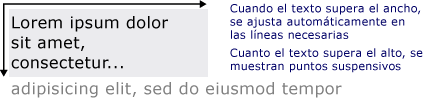

# Dibujar texto con formato
Este tema proporciona información general de las características de la <xref:System.Windows.Media.FormattedText> objeto. Este objeto proporciona control de nivel bajo para dibujar texto en aplicaciones [!INCLUDE[TLA#tla_winclient](../../../../includes/tlasharptla-winclient-md.md)].  
  
  
## Información general sobre la tecnología  
 La <xref:System.Windows.Media.FormattedText> objeto permite dibujar texto de varias líneas, en el que cada carácter en el texto puede aplicarse individualmente. En el ejemplo siguiente se muestra texto al que se le aplicaron varios formatos.  
  
   
Texto mostrado mediante un método FormattedText  
  
> [!NOTE]
>  Para aquellos desarrolladores que migran desde la API [!INCLUDE[TLA#tla_win32](../../../../includes/tlasharptla-win32-md.md)], la tabla en la sección [migración de Win32](#win32_migration) enumera las marcas DrawText de [!INCLUDE[TLA#tla_win32](../../../../includes/tlasharptla-win32-md.md)] y el equivalente aproximado en [!INCLUDE[TLA#tla_winclient](../../../../includes/tlasharptla-winclient-md.md)].  
  
### Razones para utilizar el texto con formato  
 [!INCLUDE[TLA2#tla_winclient](../../../../includes/tla2sharptla-winclient-md.md)] incluye varios controles para dibujar texto en la pantalla. Cada control se destina a un escenario diferente y tiene su propia lista de características y limitaciones. En general, el <xref:System.Windows.Controls.TextBlock> elemento se debe usar cuando se requiere, como una frase breve en compatibilidad con texto limitado un [!INCLUDE[TLA#tla_ui](../../../../includes/tlasharptla-ui-md.md)]. <xref:System.Windows.Controls.Label> se puede usar cuando se requiere la compatibilidad de texto mínima. Para obtener más información, consulte [Documentos en WPF](../../../../docs/framework/wpf/advanced/documents-in-wpf.md).  
  
 El <xref:System.Windows.Media.FormattedText> objeto proporciona características que de formato de texto mayor [!INCLUDE[TLA#tla_winclient](../../../../includes/tlasharptla-winclient-md.md)] controles de texto y puede ser útil en casos donde va a usar texto como elemento decorativo. Para obtener más información, consulte la sección siguiente [Convertir texto con formato en una geometría](#converting_formatted_text).  
  
 Además, el <xref:System.Windows.Media.FormattedText> objeto es útil para crear orientados a texto <xref:System.Windows.Media.DrawingVisual>-objetos derivados. <xref:System.Windows.Media.DrawingVisual> es una clase de dibujo ligera que se utiliza para representar formas, imágenes o texto. Para obtener más información, consulte [Hit Test Using DrawingVisuals Sample](https://go.microsoft.com/fwlink/?LinkID=159994).  
  
## Utilizar el objeto FormattedText  
 Para crear texto con formato, llame a la <xref:System.Windows.Media.FormattedText.%23ctor%2A> constructor para crear un <xref:System.Windows.Media.FormattedText> objeto. Una vez que haya creado la cadena inicial de texto con formato, podrá aplicar una gama de estilos de formato.  
  
 Use el <xref:System.Windows.Media.FormattedText.MaxTextWidth%2A> propiedad para restringir el texto a un ancho específico. El texto se ajustará automáticamente para evitar superar el ancho especificado. Use el <xref:System.Windows.Media.FormattedText.MaxTextHeight%2A> propiedad para restringir el texto a un alto específico. El texto mostrará puntos suspensivos ("...") para el texto que supere el alto especificado.  
  
   
Texto visualizado donde aparecen el ajuste automático de línea y los puntos suspensivos  
  
 Puede aplicar varios estilos de formato a uno o más caracteres. Por ejemplo, podría llamar tanto a la <xref:System.Windows.Media.FormattedText.SetFontSize%2A> y <xref:System.Windows.Media.FormattedText.SetForegroundBrush%2A> métodos para cambiar el formato de los cinco primeros caracteres del texto.  
  
 En el ejemplo de código siguiente se crea un <xref:System.Windows.Media.FormattedText> de objetos y, a continuación, se aplica a varios estilos de formato al texto.  
  
 [!code-csharp[FormattedTextSnippets#FormattedTextSnippets1](../../../../samples/snippets/csharp/VS_Snippets_Wpf/FormattedTextSnippets/CSharp/Window1.xaml.cs#formattedtextsnippets1)]
 [!code-vb[FormattedTextSnippets#FormattedTextSnippets1](../../../../samples/snippets/visualbasic/VS_Snippets_Wpf/FormattedTextSnippets/visualbasic/window1.xaml.vb#formattedtextsnippets1)]  
  
### Unidad de medida del tamaño de fuente  
 Igual que con otros objetos de texto en [!INCLUDE[TLA#tla_winclient](../../../../includes/tlasharptla-winclient-md.md)] aplicaciones, la <xref:System.Windows.Media.FormattedText> objeto utiliza píxeles independientes del dispositivo como la unidad de medida. Sin embargo, la mayoría de las aplicaciones de [!INCLUDE[TLA#tla_win32](../../../../includes/tlasharptla-win32-md.md)] utilizan puntos como unidad de medida. Si desea utilizar el texto visualizado en unidades de puntos en las aplicaciones de [!INCLUDE[TLA#tla_winclient](../../../../includes/tlasharptla-winclient-md.md)], deberá convertir [!INCLUDE[TLA#tla_dipixel#plural](../../../../includes/tlasharptla-dipixelsharpplural-md.md)] a puntos. En el ejemplo de código siguiente se muestra cómo realizar esta conversión.  
  
 [!code-csharp[FormattedTextSnippets#FormattedTextSnippets2](../../../../samples/snippets/csharp/VS_Snippets_Wpf/FormattedTextSnippets/CSharp/Window1.xaml.cs#formattedtextsnippets2)]
 [!code-vb[FormattedTextSnippets#FormattedTextSnippets2](../../../../samples/snippets/visualbasic/VS_Snippets_Wpf/FormattedTextSnippets/visualbasic/window1.xaml.vb#formattedtextsnippets2)]  
  
   
### Convertir texto con formato a una geometría  
 Puede convertir texto con formato en <xref:System.Windows.Media.Geometry> objetos, lo que permite crear otros tipos de texto visualmente interesante. Por ejemplo, podría crear un <xref:System.Windows.Media.Geometry> objeto basado en el esquema de una cadena de texto.  
  
   
Esquema de texto que usa un pincel de degradado lineal  
  
 En los ejemplos siguientes se muestran varias maneras de crear efectos visuales interesantes modificando el trazo, el relleno y el resaltado del texto convertido.  
  
   
Ejemplo de configuración a diferentes colores de trazo y relleno  
  
   
Ejemplo de pincel de imagen aplicado al trazo  
  
   
Ejemplo de pincel de imagen aplicado al trazo y el resaltado  
  
 Cuando el texto se convierte en un <xref:System.Windows.Media.Geometry> de objeto, ya no es una colección de caracteres, no se puede modificar los caracteres de la cadena de texto. Sin embargo, puede afectar a la apariencia del texto convertido modificando sus propiedades de trazo y relleno. El trazo se refiere al contorno del texto convertido; el relleno es el área dentro del contorno del texto convertido. Para obtener más información, consulte [Crear texto con contorno](../../../../docs/framework/wpf/advanced/how-to-create-outlined-text.md).  
  
 También puede convertir texto con formato a un <xref:System.Windows.Media.PathGeometry> de objetos y usar el objeto para resaltar el texto. Por ejemplo, podría aplicar una animación para el <xref:System.Windows.Media.PathGeometry> para que la animación siga el contorno del texto con formato de objeto.  
  
 El ejemplo siguiente muestra texto con formato que se ha convertido en un <xref:System.Windows.Media.PathGeometry> objeto. Una elipse animada sigue la ruta de los trazos del texto representado.  
  
   
Esfera que sigue la geometría de trayecto de texto  
  
 Para obtener más información, vea [Cómo: Crear una animación PathGeometry para texto](https://docs.microsoft.com/previous-versions/dotnet/netframework-4.0/ms743610(v=vs.100)).  
  
 Puede crear otros usos interesantes para el texto con formato una vez que se ha convertido en un <xref:System.Windows.Media.PathGeometry> objeto. Por ejemplo, puede recortar vídeo para que se muestre dentro de él.  
  
   
Vídeo mostrándose en la geometría de trayecto de texto  
  
   
## Migración de Win32  
 Las características de <xref:System.Windows.Media.FormattedText> para dibujar texto son similares a las características de la [!INCLUDE[TLA#tla_win32](../../../../includes/tlasharptla-win32-md.md)] función DrawText. Para aquellos desarrolladores que migran desde la API de [!INCLUDE[TLA#tla_win32](../../../../includes/tlasharptla-win32-md.md)], en la tabla siguiente se enumeran las marcas DrawText de [!INCLUDE[TLA#tla_win32](../../../../includes/tlasharptla-win32-md.md)] y el equivalente aproximado en [!INCLUDE[TLA#tla_winclient](../../../../includes/tlasharptla-winclient-md.md)].  
  
|Marca DrawText|Equivalente de WPF|Notas|  
|-------------------|--------------------|-----------|  
|DT_BOTTOM|<xref:System.Windows.Media.FormattedText.Height%2A>|Use la <xref:System.Windows.Media.FormattedText.Height%2A> propiedad para calcular una adecuada [!INCLUDE[TLA#tla_win32](../../../../includes/tlasharptla-win32-md.md)] posición DrawText 'y'.|  
|DT_CALCRECT|<xref:System.Windows.Media.FormattedText.Height%2A>, <xref:System.Windows.Media.FormattedText.Width%2A>|Use la <xref:System.Windows.Media.FormattedText.Height%2A> y <xref:System.Windows.Media.FormattedText.Width%2A> propiedades para calcular el rectángulo de salida.|  
|DT_CENTER|<xref:System.Windows.Media.FormattedText.TextAlignment%2A>|Use la <xref:System.Windows.Media.FormattedText.TextAlignment%2A> propiedad con el valor establecido en <xref:System.Windows.TextAlignment.Center>.|  
|DT_EDITCONTROL|Ninguna|No es necesario. El ancho del espacio y la representación de la última línea son los mismos que en el control de edición de marcos.|  
|DT_END_ELLIPSIS|<xref:System.Windows.Media.FormattedText.Trimming%2A>|Use la <xref:System.Windows.Media.FormattedText.Trimming%2A> propiedad con el valor <xref:System.Windows.TextTrimming.CharacterEllipsis>.   Use <xref:System.Windows.TextTrimming.WordEllipsis> obtener [!INCLUDE[TLA#tla_win32](../../../../includes/tlasharptla-win32-md.md)] DT_END_ELLIPSIS con DT_WORD_ELIPSIS puntos suspensivos finales, en este caso, puntos suspensivos solo se produce en las palabras que no caben en una sola línea.|  
|DT_EXPAND_TABS|Ninguna|No es necesario. Las tabulaciones se expanden automáticamente a cada 4 ems, que es, aproximadamente, el ancho de 8 caracteres independientes del lenguaje.|  
|DT_EXTERNALLEADING|Ninguna|No es necesario. El espacio externo siempre se incluye en el interlineado. Use el <xref:System.Windows.Media.FormattedText.LineHeight%2A> propiedad para crear el interlineado definido por el usuario.|  
|DT_HIDEPREFIX|Ninguna|No se admite. Quitar '&' de la cadena antes de construir el <xref:System.Windows.Media.FormattedText> objeto.|  
|DT_LEFT|<xref:System.Windows.Media.FormattedText.TextAlignment%2A>|Esta es la alineación del texto predeterminada. Use la <xref:System.Windows.Media.FormattedText.TextAlignment%2A> propiedad con el valor establecido en <xref:System.Windows.TextAlignment.Left>. (Solo WPF)|  
|DT_MODIFYSTRING|Ninguna|No se admite.|  
|DT_NOCLIP|<xref:System.Windows.Media.Visual.VisualClip%2A>|El recorte no se realiza automáticamente. Si desea recortar texto, utilice el <xref:System.Windows.Media.Visual.VisualClip%2A> propiedad.|  
|DT_NOFULLWIDTHCHARBREAK|Ninguna|No se admite.|  
|DT_NOPREFIX|Ninguna|No es necesario. El carácter '&' en las cadenas siempre se trata como un carácter normal.|  
|DT_PATHELLIPSIS|Ninguna|Use la <xref:System.Windows.Media.FormattedText.Trimming%2A> propiedad con el valor <xref:System.Windows.TextTrimming.WordEllipsis>.|  
|DT_PREFIX|Ninguna|No se admite. Si desea utilizar caracteres de subrayado para el texto, como una tecla de aceleración o vínculo, use el <xref:System.Windows.Media.FormattedText.SetTextDecorations%2A> método.|  
|DT_PREFIXONLY|Ninguna|No se admite.|  
|DT_RIGHT|<xref:System.Windows.Media.FormattedText.TextAlignment%2A>|Use la <xref:System.Windows.Media.FormattedText.TextAlignment%2A> propiedad con el valor establecido en <xref:System.Windows.TextAlignment.Right>. (Solo WPF)|  
|DT_RTLREADING|<xref:System.Windows.Media.FormattedText.FlowDirection%2A>|Establezca la propiedad <xref:System.Windows.Media.FormattedText.FlowDirection%2A> en <xref:System.Windows.FlowDirection.RightToLeft>.|  
|DT_SINGLELINE|Ninguna|No es necesario. <xref:System.Windows.Media.FormattedText> los objetos se comportan como un control de línea única, a menos que ya sea el <xref:System.Windows.Media.FormattedText.MaxTextWidth%2A> se establece la propiedad o el texto contiene un retorno de carro/avance (CR/LF) de línea.|  
|DT_TABSTOP|Ninguna|No se admite para las posiciones de tabulación definidas por el usuario.|  
|DT_TOP|<xref:System.Windows.Media.FormattedText.Height%2A>|No es necesario. La justificación superior es el valor predeterminado. Se pueden definir otros valores de posicionamiento vertical utilizando la <xref:System.Windows.Media.FormattedText.Height%2A> propiedad para calcular una adecuada [!INCLUDE[TLA#tla_win32](../../../../includes/tlasharptla-win32-md.md)] posición DrawText 'y'.|  
|DT_VCENTER|<xref:System.Windows.Media.FormattedText.Height%2A>|Use la <xref:System.Windows.Media.FormattedText.Height%2A> propiedad para calcular una adecuada [!INCLUDE[TLA#tla_win32](../../../../includes/tlasharptla-win32-md.md)] posición DrawText 'y'.|  
|DT_WORDBREAK|Ninguna|No es necesario. Separación de palabras se realiza automáticamente con <xref:System.Windows.Media.FormattedText> objetos. No se puede deshabilitar.|  
|DT_WORD_ELLIPSIS|<xref:System.Windows.Media.FormattedText.Trimming%2A>|Use la <xref:System.Windows.Media.FormattedText.Trimming%2A> propiedad con el valor <xref:System.Windows.TextTrimming.WordEllipsis>.|  
  
## Vea también
- <xref:System.Windows.Media.FormattedText>
- [Documentos en WPF](../../../../docs/framework/wpf/advanced/documents-in-wpf.md)
- [Tipografía en WPF](../../../../docs/framework/wpf/advanced/typography-in-wpf.md)
- [Crear texto con contorno](../../../../docs/framework/wpf/advanced/how-to-create-outlined-text.md)
- [Cómo: Crear una animación PathGeometry para texto](https://docs.microsoft.com/previous-versions/dotnet/netframework-4.0/ms743610(v=vs.100))
