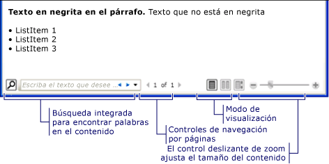
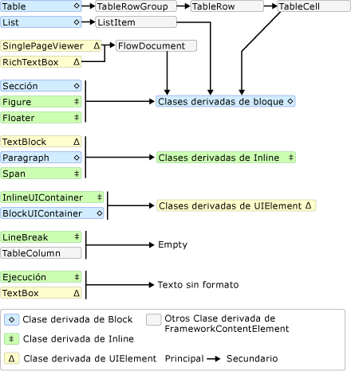
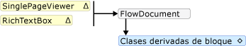
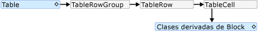
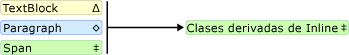
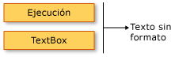

# <a name="flow-document-overview"></a><span data-ttu-id="8bd7d-103">Información general sobre documentos dinámicos</span><span class="sxs-lookup"><span data-stu-id="8bd7d-103">Flow Document Overview</span></span>

<span data-ttu-id="8bd7d-104">Los documentos dinámicos están diseñados para optimizar su visualización y legibilidad.</span><span class="sxs-lookup"><span data-stu-id="8bd7d-104">Flow documents are designed to optimize viewing and readability.</span></span> <span data-ttu-id="8bd7d-105">En lugar de establecer un diseño predefinido, los documentos dinámicos ajustan y redistribuyen dinámicamente su contenido basándose en variables en tiempo de ejecución, como el tamaño de la ventana, la resolución del dispositivo y las preferencias opcionales del usuario.</span><span class="sxs-lookup"><span data-stu-id="8bd7d-105">Rather than being set to one predefined layout, flow documents dynamically adjust and reflow their content based on run-time variables such as window size, device resolution, and optional user preferences.</span></span> <span data-ttu-id="8bd7d-106">Además, los documentos dinámicos ofrecen características de documento avanzadas, como paginación y columnas.</span><span class="sxs-lookup"><span data-stu-id="8bd7d-106">In addition, flow documents offer advanced document features, such as pagination and columns.</span></span> <span data-ttu-id="8bd7d-107">En este tema se proporciona información general sobre los documentos dinámicos y cómo crearlos.</span><span class="sxs-lookup"><span data-stu-id="8bd7d-107">This topic provides an overview of flow documents and how to create them.</span></span>

<a name="what_is_a_flow_document"></a>

## <a name="what-is-a-flow-document"></a><span data-ttu-id="8bd7d-108">Qué es un documento dinámico</span><span class="sxs-lookup"><span data-stu-id="8bd7d-108">What is a Flow Document</span></span>

<span data-ttu-id="8bd7d-109">Un documento dinámico está diseñado para "redistribuir el contenido" según el tamaño de la ventana, la resolución del dispositivo y otras variables del entorno.</span><span class="sxs-lookup"><span data-stu-id="8bd7d-109">A flow document is designed to "reflow content" depending on window size, device resolution, and other environment variables.</span></span> <span data-ttu-id="8bd7d-110">Además, los documentos dinámicos tienen varias características integradas, como la búsqueda, los modos de visualización que optimizan la legibilidad, y la capacidad de cambiar el tamaño y el aspecto de las fuentes.</span><span class="sxs-lookup"><span data-stu-id="8bd7d-110">In addition, flow documents have a number of built in features including search, viewing modes that optimize readability, and the ability to change the size and appearance of fonts.</span></span> <span data-ttu-id="8bd7d-111">Los documentos dinámicos se utilizan mejor cuando la facilidad de lectura es el escenario principal de consumo del documento.</span><span class="sxs-lookup"><span data-stu-id="8bd7d-111">Flow Documents are best utilized when ease of reading is the primary document consumption scenario.</span></span> <span data-ttu-id="8bd7d-112">En cambio, los documentos fijos están diseñados para tener una presentación estática.</span><span class="sxs-lookup"><span data-stu-id="8bd7d-112">In contrast, Fixed Documents are designed to have a static presentation.</span></span> <span data-ttu-id="8bd7d-113">Los documentos fijos son útiles cuando la fidelidad del contenido de origen es esencial.</span><span class="sxs-lookup"><span data-stu-id="8bd7d-113">Fixed Documents are useful when fidelity of the source content is essential.</span></span> <span data-ttu-id="8bd7d-114">Consulte [documentos en WPF](documents-in-wpf.md) para obtener más información sobre los distintos tipos de documentos.</span><span class="sxs-lookup"><span data-stu-id="8bd7d-114">See [Documents in WPF](documents-in-wpf.md) for more information on different types of documents.</span></span>

<span data-ttu-id="8bd7d-115">En la ilustración siguiente se muestra un ejemplo de documento dinámico visualizado en varias ventanas de tamaños diferentes.</span><span class="sxs-lookup"><span data-stu-id="8bd7d-115">The following illustration shows a sample flow document viewed in several windows of different sizes.</span></span> <span data-ttu-id="8bd7d-116">A medida que cambia el área de visualización, el contenido se redistribuye para aprovechar mejor el espacio disponible.</span><span class="sxs-lookup"><span data-stu-id="8bd7d-116">As the display area changes, the content reflows to make the best use of the available space.</span></span>

<span data-ttu-id="8bd7d-117"></span><span class="sxs-lookup"><span data-stu-id="8bd7d-117"></span></span>

<span data-ttu-id="8bd7d-118">Tal como se muestra en la imagen anterior, el contenido dinámico puede incluir muchos componentes, como párrafos, listas, imágenes, etc.</span><span class="sxs-lookup"><span data-stu-id="8bd7d-118">As seen in the image above, flow content can include many components including paragraphs, lists, images, and more.</span></span> <span data-ttu-id="8bd7d-119">Estos componentes corresponden a elementos de marcado y objetos en el código de procedimiento.</span><span class="sxs-lookup"><span data-stu-id="8bd7d-119">These components correspond to elements in markup and objects in procedural code.</span></span> <span data-ttu-id="8bd7d-120">Veremos estas clases en detalle más adelante en la sección [clases relacionadas con el flujo](#flow_related_classes) de esta información general.</span><span class="sxs-lookup"><span data-stu-id="8bd7d-120">We will go over these classes in detail later in the [Flow Related Classes](#flow_related_classes) section of this overview.</span></span> <span data-ttu-id="8bd7d-121">Por ahora, este es un ejemplo de código simple que crea un documento dinámico que consta de un párrafo con algún texto en negrita y una lista.</span><span class="sxs-lookup"><span data-stu-id="8bd7d-121">For now, here is a simple code example that creates a flow document consisting of a paragraph with some bold text and a list.</span></span>

[!code-xaml[FlowOvwSnippets_snip#SimpleFlowExampleWholePage](~/samples/snippets/csharp/VS_Snippets_Wpf/FlowOvwSnippets_snip/CS/SimpleFlowExample.xaml#simpleflowexamplewholepage)]

[!code-csharp[FlowOvwSnippets_procedural_snip#SimpleFlowCodeOnlyExampleWholePage](~/samples/snippets/csharp/VS_Snippets_Wpf/FlowOvwSnippets_procedural_snip/CSharp/SimpleFlowExample.cs#simpleflowcodeonlyexamplewholepage)]
[!code-vb[FlowOvwSnippets_procedural_snip#SimpleFlowCodeOnlyExampleWholePage](~/samples/snippets/visualbasic/VS_Snippets_Wpf/FlowOvwSnippets_procedural_snip/VisualBasic/SimpleFlowExample.vb#simpleflowcodeonlyexamplewholepage)]

<span data-ttu-id="8bd7d-122">En la ilustración siguiente se muestra el aspecto de este fragmento de código.</span><span class="sxs-lookup"><span data-stu-id="8bd7d-122">The illustration below shows what this code snippet looks like.</span></span>

<span data-ttu-id="8bd7d-123"></span><span class="sxs-lookup"><span data-stu-id="8bd7d-123"></span></span>

<span data-ttu-id="8bd7d-124">En este ejemplo, el <xref:System.Windows.Controls.FlowDocumentReader> control se usa para hospedar el contenido dinámico.</span><span class="sxs-lookup"><span data-stu-id="8bd7d-124">In this example, the <xref:System.Windows.Controls.FlowDocumentReader> control is used to host the flow content.</span></span> <span data-ttu-id="8bd7d-125">Vea [tipos de documentos dinámicos](#flow_document_types) para obtener más información sobre los controles de hospedaje de contenido dinámico.</span><span class="sxs-lookup"><span data-stu-id="8bd7d-125">See [Flow Document Types](#flow_document_types) for more information on flow content hosting controls.</span></span> <span data-ttu-id="8bd7d-126"><xref:System.Windows.Documents.Paragraph><xref:System.Windows.Documents.List> <xref:System.Windows.Documents.ListItem> los elementos,, y <xref:System.Windows.Documents.Bold> se utilizan para controlar el formato del contenido, en función de su orden en el marcado.</span><span class="sxs-lookup"><span data-stu-id="8bd7d-126"><xref:System.Windows.Documents.Paragraph>, <xref:System.Windows.Documents.List>, <xref:System.Windows.Documents.ListItem>, and <xref:System.Windows.Documents.Bold> elements are used to control content formatting, based on their order in markup.</span></span> <span data-ttu-id="8bd7d-127">Por ejemplo, el <xref:System.Windows.Documents.Bold> elemento abarca solo parte del texto del párrafo; como resultado, solo esa parte del texto está en negrita.</span><span class="sxs-lookup"><span data-stu-id="8bd7d-127">For example, the <xref:System.Windows.Documents.Bold> element spans across only part of the text in the paragraph; as a result, only that part of the text is bold.</span></span> <span data-ttu-id="8bd7d-128">Si ha utilizado HTML, esto le resultará familiar.</span><span class="sxs-lookup"><span data-stu-id="8bd7d-128">If you have used HTML, this will be familiar to you.</span></span>

<span data-ttu-id="8bd7d-129">Como se resalta en la ilustración anterior, hay varias características integradas en los documentos dinámicos:</span><span class="sxs-lookup"><span data-stu-id="8bd7d-129">As highlighted in the illustration above, there are several features built into Flow Documents:</span></span>

- <span data-ttu-id="8bd7d-130">Buscar: permite al usuario realizar una búsqueda de texto completo en todo un documento.</span><span class="sxs-lookup"><span data-stu-id="8bd7d-130">Search: Allows the user to perform a full text search of an entire document.</span></span>

- <span data-ttu-id="8bd7d-131">Modo de visualización: el usuario puede seleccionar su modo de visualización preferido, incluido el modo de visualización de una sola página (una página a la vez), el modo de visualización de dos página a la vez (formato de lectura de libro) y un modo de desplazamiento continuo (sin límite).</span><span class="sxs-lookup"><span data-stu-id="8bd7d-131">Viewing Mode: The user can select their preferred viewing mode including a single-page (page-at-a-time) viewing mode, a two-page-at-a-time (book reading format) viewing mode, and a continuous scrolling (bottomless) viewing mode.</span></span>  <span data-ttu-id="8bd7d-132">Para obtener más información acerca de estos modos de visualización, vea <xref:System.Windows.Controls.FlowDocumentReaderViewingMode> .</span><span class="sxs-lookup"><span data-stu-id="8bd7d-132">For more information about these viewing modes, see <xref:System.Windows.Controls.FlowDocumentReaderViewingMode>.</span></span>

- <span data-ttu-id="8bd7d-133">Controles de navegación de página: si el modo de visualización del documento utiliza páginas, los controles de navegación de páginas incluyen un botón para ir a la página siguiente (flecha abajo) o la página anterior (flecha arriba), así como indicadores para el número de página actual y el número total de páginas.</span><span class="sxs-lookup"><span data-stu-id="8bd7d-133">Page Navigation Controls: If the viewing mode of the document uses pages, the page navigation controls include a button to jump to the next page (the down arrow) or previous page (the up arrow), as well as indicators for the current page number and total number of pages.</span></span> <span data-ttu-id="8bd7d-134">Las páginas también pueden voltearse mediante las teclas de flecha del teclado.</span><span class="sxs-lookup"><span data-stu-id="8bd7d-134">Flipping through pages can also be accomplished using the keyboard arrow keys.</span></span>

- <span data-ttu-id="8bd7d-135">Zoom: los controles de zoom permiten al usuario aumentar o disminuir el nivel de zoom haciendo clic en los botones de más o menos, respectivamente.</span><span class="sxs-lookup"><span data-stu-id="8bd7d-135">Zoom: The zoom controls enable the user to increase or decrease the zoom level by clicking the plus or minus buttons, respectively.</span></span> <span data-ttu-id="8bd7d-136">Los controles de zoom incluyen también un control deslizante para ajustar el nivel de zoom.</span><span class="sxs-lookup"><span data-stu-id="8bd7d-136">The zoom controls also include a slider for adjusting the zoom level.</span></span> <span data-ttu-id="8bd7d-137">Para más información, consulte <xref:System.Windows.Controls.FlowDocumentReader.Zoom%2A>.</span><span class="sxs-lookup"><span data-stu-id="8bd7d-137">For more information, see <xref:System.Windows.Controls.FlowDocumentReader.Zoom%2A>.</span></span>

<span data-ttu-id="8bd7d-138">Estas características pueden modificarse según el control utilizado para hospedar el contenido dinámico.</span><span class="sxs-lookup"><span data-stu-id="8bd7d-138">These features can be modified based upon the control used to host the flow content.</span></span> <span data-ttu-id="8bd7d-139">En la siguiente sección se describen los distintos controles.</span><span class="sxs-lookup"><span data-stu-id="8bd7d-139">The next section describes the different controls.</span></span>

<a name="flow_document_types"></a>

## <a name="flow-document-types"></a><span data-ttu-id="8bd7d-140">Tipos de documentos dinámicos</span><span class="sxs-lookup"><span data-stu-id="8bd7d-140">Flow Document Types</span></span>

<span data-ttu-id="8bd7d-141">La visualización del contenido de los documentos dinámicos y cómo aparece depende de qué objeto se utilice para hospedar el contenido dinámico.</span><span class="sxs-lookup"><span data-stu-id="8bd7d-141">Display of flow document content and how it appears is dependent upon what object is used to host the flow content.</span></span> <span data-ttu-id="8bd7d-142">Hay cuatro controles que admiten la visualización del contenido dinámico: <xref:System.Windows.Controls.FlowDocumentReader> ,, <xref:System.Windows.Controls.FlowDocumentPageViewer> <xref:System.Windows.Controls.RichTextBox> y <xref:System.Windows.Controls.FlowDocumentScrollViewer> .</span><span class="sxs-lookup"><span data-stu-id="8bd7d-142">There are four controls that support viewing of flow content: <xref:System.Windows.Controls.FlowDocumentReader>, <xref:System.Windows.Controls.FlowDocumentPageViewer>, <xref:System.Windows.Controls.RichTextBox>, and <xref:System.Windows.Controls.FlowDocumentScrollViewer>.</span></span> <span data-ttu-id="8bd7d-143">Estos controles se describen brevemente a continuación.</span><span class="sxs-lookup"><span data-stu-id="8bd7d-143">These controls are briefly described below.</span></span>

> [!NOTE]
> <span data-ttu-id="8bd7d-144"><xref:System.Windows.Documents.FlowDocument>se requiere para hospedar directamente el contenido dinámico, por lo que todos estos controles de visualización utilizan <xref:System.Windows.Documents.FlowDocument> para habilitar el hospedaje del contenido dinámico.</span><span class="sxs-lookup"><span data-stu-id="8bd7d-144"><xref:System.Windows.Documents.FlowDocument> is required to directly host flow content, so all of these viewing controls consume a <xref:System.Windows.Documents.FlowDocument> to enable flow content hosting.</span></span>

### <a name="flowdocumentreader"></a><span data-ttu-id="8bd7d-145">FlowDocumentReader</span><span class="sxs-lookup"><span data-stu-id="8bd7d-145">FlowDocumentReader</span></span>

<span data-ttu-id="8bd7d-146"><xref:System.Windows.Controls.FlowDocumentReader>incluye características que permiten al usuario elegir dinámicamente entre distintos modos de visualización, como el modo de visualización de una sola página (de una página a la vez), un modo de visualización de dos páginas a la vez (formato de lectura de libro) y un modo de visualización de desplazamiento continuo (sin límite).</span><span class="sxs-lookup"><span data-stu-id="8bd7d-146"><xref:System.Windows.Controls.FlowDocumentReader> includes features that enable the user to dynamically choose between various viewing modes, including a single-page (page-at-a-time) viewing mode, a two-page-at-a-time (book reading format) viewing mode, and a continuous scrolling (bottomless) viewing mode.</span></span> <span data-ttu-id="8bd7d-147">Para obtener más información acerca de estos modos de visualización, vea <xref:System.Windows.Controls.FlowDocumentReaderViewingMode> .</span><span class="sxs-lookup"><span data-stu-id="8bd7d-147">For more information about these viewing modes, see <xref:System.Windows.Controls.FlowDocumentReaderViewingMode>.</span></span> <span data-ttu-id="8bd7d-148">Si no necesita la capacidad de cambiar dinámicamente entre distintos modos de visualización, <xref:System.Windows.Controls.FlowDocumentPageViewer> y <xref:System.Windows.Controls.FlowDocumentScrollViewer> proporciona visores de contenido dinámico más ligeros que se corrigen en un modo de visualización determinado.</span><span class="sxs-lookup"><span data-stu-id="8bd7d-148">If you do not need the ability to dynamically switch between different viewing modes, <xref:System.Windows.Controls.FlowDocumentPageViewer> and <xref:System.Windows.Controls.FlowDocumentScrollViewer> provide lighter-weight flow content viewers that are fixed in a particular viewing mode.</span></span>

### <a name="flowdocumentpageviewer-and-flowdocumentscrollviewer"></a><span data-ttu-id="8bd7d-149">FlowDocumentPageViewer y FlowDocumentScrollViewer</span><span class="sxs-lookup"><span data-stu-id="8bd7d-149">FlowDocumentPageViewer and FlowDocumentScrollViewer</span></span>

<span data-ttu-id="8bd7d-150"><xref:System.Windows.Controls.FlowDocumentPageViewer>muestra el contenido en el modo de visualización de una página a la vez, mientras que <xref:System.Windows.Controls.FlowDocumentScrollViewer> muestra el contenido en modo de desplazamiento continuo.</span><span class="sxs-lookup"><span data-stu-id="8bd7d-150"><xref:System.Windows.Controls.FlowDocumentPageViewer> shows content in page-at-a-time viewing mode, while <xref:System.Windows.Controls.FlowDocumentScrollViewer> shows content in continuous scrolling mode.</span></span> <span data-ttu-id="8bd7d-151"><xref:System.Windows.Controls.FlowDocumentPageViewer>Y <xref:System.Windows.Controls.FlowDocumentScrollViewer> se corrigen en un modo de visualización determinado.</span><span class="sxs-lookup"><span data-stu-id="8bd7d-151">Both <xref:System.Windows.Controls.FlowDocumentPageViewer> and <xref:System.Windows.Controls.FlowDocumentScrollViewer> are fixed to a particular viewing mode.</span></span> <span data-ttu-id="8bd7d-152">Comparar con <xref:System.Windows.Controls.FlowDocumentReader> , que incluye características que permiten al usuario elegir dinámicamente entre distintos modos de visualización (tal y como lo proporciona la <xref:System.Windows.Controls.FlowDocumentReaderViewingMode> enumeración), a costa de que el uso de más recursos sea mayor que <xref:System.Windows.Controls.FlowDocumentPageViewer> o <xref:System.Windows.Controls.FlowDocumentScrollViewer> .</span><span class="sxs-lookup"><span data-stu-id="8bd7d-152">Compare to <xref:System.Windows.Controls.FlowDocumentReader>, which includes features that enable the user to dynamically choose between various viewing modes (as provided by the <xref:System.Windows.Controls.FlowDocumentReaderViewingMode> enumeration), at the cost of being more resource intensive than <xref:System.Windows.Controls.FlowDocumentPageViewer> or <xref:System.Windows.Controls.FlowDocumentScrollViewer>.</span></span>

<span data-ttu-id="8bd7d-153">De manera predeterminada, siempre se muestra una barra de desplazamiento vertical y una barra de desplazamiento horizontal se vuelve visible cuando es necesario.</span><span class="sxs-lookup"><span data-stu-id="8bd7d-153">By default, a vertical scrollbar is always shown, and a horizontal scrollbar becomes visible if needed.</span></span> <span data-ttu-id="8bd7d-154">La interfaz de usuario predeterminada de no <xref:System.Windows.Controls.FlowDocumentScrollViewer> incluye una barra de herramientas; sin embargo, la <xref:System.Windows.Controls.FlowDocumentScrollViewer.IsToolBarVisible%2A> propiedad se puede usar para habilitar una barra de herramientas integrada.</span><span class="sxs-lookup"><span data-stu-id="8bd7d-154">The default UI for <xref:System.Windows.Controls.FlowDocumentScrollViewer> does not include a toolbar; however, the <xref:System.Windows.Controls.FlowDocumentScrollViewer.IsToolBarVisible%2A> property can be used to enable a built-in toolbar.</span></span>

### <a name="richtextbox"></a><span data-ttu-id="8bd7d-155">RichTextBox</span><span class="sxs-lookup"><span data-stu-id="8bd7d-155">RichTextBox</span></span>

<span data-ttu-id="8bd7d-156">Se usa <xref:System.Windows.Controls.RichTextBox> cuando se desea permitir al usuario editar el contenido dinámico.</span><span class="sxs-lookup"><span data-stu-id="8bd7d-156">You use a <xref:System.Windows.Controls.RichTextBox> when you want to allow the user to edit flow content.</span></span> <span data-ttu-id="8bd7d-157">Por ejemplo, si desea crear un editor que permita a un usuario manipular elementos como tablas, formato en cursiva y negrita, etc., se usaría <xref:System.Windows.Controls.RichTextBox> .</span><span class="sxs-lookup"><span data-stu-id="8bd7d-157">For example, if you wanted to create an editor that allowed a user to manipulate things like tables, italic and bold formatting, etc, you would use a <xref:System.Windows.Controls.RichTextBox>.</span></span> <span data-ttu-id="8bd7d-158">Vea [información general de RichTextBox](../controls/richtextbox-overview.md) para obtener más información.</span><span class="sxs-lookup"><span data-stu-id="8bd7d-158">See [RichTextBox Overview](../controls/richtextbox-overview.md) for more information.</span></span>

> [!NOTE]
> <span data-ttu-id="8bd7d-159">El contenido dinámico dentro de no se <xref:System.Windows.Controls.RichTextBox> comporta exactamente igual que el contenido dinámico contenido en otros controles.</span><span class="sxs-lookup"><span data-stu-id="8bd7d-159">Flow content inside a <xref:System.Windows.Controls.RichTextBox> does not behave exactly like flow content contained in other controls.</span></span> <span data-ttu-id="8bd7d-160">Por ejemplo, no hay ninguna columna en <xref:System.Windows.Controls.RichTextBox> y, por lo tanto, no hay ningún comportamiento de cambio de tamaño automático.</span><span class="sxs-lookup"><span data-stu-id="8bd7d-160">For example, there are no columns in a <xref:System.Windows.Controls.RichTextBox> and hence no automatic resizing behavior.</span></span> <span data-ttu-id="8bd7d-161">Además, las características integradas normalmente del contenido dinámico, como la búsqueda, el modo de visualización, la navegación de páginas y el zoom, no están disponibles en <xref:System.Windows.Controls.RichTextBox> .</span><span class="sxs-lookup"><span data-stu-id="8bd7d-161">Also, the typically built in features of flow content like search, viewing mode, page navigation, and zoom are not available within a <xref:System.Windows.Controls.RichTextBox>.</span></span>

<a name="creating_flow_content"></a>

## <a name="creating-flow-content"></a><span data-ttu-id="8bd7d-162">Crear contenido dinámico</span><span class="sxs-lookup"><span data-stu-id="8bd7d-162">Creating Flow Content</span></span>

<span data-ttu-id="8bd7d-163">El contenido dinámico puede ser complejo y consta de varios elementos, como texto, imágenes, tablas e incluso <xref:System.Windows.UIElement> clases derivadas como controles.</span><span class="sxs-lookup"><span data-stu-id="8bd7d-163">Flow content can be complex, consisting of various elements including text, images, tables, and even <xref:System.Windows.UIElement> derived classes like controls.</span></span> <span data-ttu-id="8bd7d-164">Para entender cómo crear contenido dinámico complejo, los puntos siguientes son fundamentales:</span><span class="sxs-lookup"><span data-stu-id="8bd7d-164">To understand how to create complex flow content, the following points are critical:</span></span>

- <span data-ttu-id="8bd7d-165">**Clases relacionadas con el flujo**: cada clase que se utiliza en el contenido dinámico tiene un propósito específico.</span><span class="sxs-lookup"><span data-stu-id="8bd7d-165">**Flow-related Classes**: Each class used in flow content has a specific purpose.</span></span> <span data-ttu-id="8bd7d-166">Además, la relación jerárquica entre las clases dinámicas le ayuda a comprender cómo se utilizan.</span><span class="sxs-lookup"><span data-stu-id="8bd7d-166">In addition, the hierarchical relation between flow classes helps you understand how they are used.</span></span> <span data-ttu-id="8bd7d-167">Por ejemplo, las clases derivadas de la <xref:System.Windows.Documents.Block> clase se usan para contener otros objetos mientras que las clases derivadas de <xref:System.Windows.Documents.Inline> contienen objetos que se muestran.</span><span class="sxs-lookup"><span data-stu-id="8bd7d-167">For example, classes derived from the <xref:System.Windows.Documents.Block> class are used to contain other objects while classes derived from <xref:System.Windows.Documents.Inline> contain objects that are displayed.</span></span>

- <span data-ttu-id="8bd7d-168">**Esquema de contenido**: un documento dinámico puede requerir un número importante de elementos anidados.</span><span class="sxs-lookup"><span data-stu-id="8bd7d-168">**Content Schema**: A flow document can require a substantial number of nested elements.</span></span> <span data-ttu-id="8bd7d-169">El esquema de contenido especifica las relaciones posibles entre elementos primarios y secundarios.</span><span class="sxs-lookup"><span data-stu-id="8bd7d-169">The content schema specifies possible parent/child relationships between elements.</span></span>

<span data-ttu-id="8bd7d-170">En las secciones siguientes se repasará cada una de estas áreas con más detalle.</span><span class="sxs-lookup"><span data-stu-id="8bd7d-170">The following sections will go over each of these areas in more detail.</span></span>

<a name="flow_related_classes"></a>

## <a name="flow-related-classes"></a><span data-ttu-id="8bd7d-171">Clases relacionadas con el flujo</span><span class="sxs-lookup"><span data-stu-id="8bd7d-171">Flow Related Classes</span></span>

<span data-ttu-id="8bd7d-172">En el diagrama siguiente se muestran los objetos más utilizados con el contenido dinámico:</span><span class="sxs-lookup"><span data-stu-id="8bd7d-172">The diagram below shows the objects most typically used with flow content:</span></span>

<span data-ttu-id="8bd7d-173"></span><span class="sxs-lookup"><span data-stu-id="8bd7d-173"></span></span>

<span data-ttu-id="8bd7d-174">A los efectos del contenido dinámico, hay dos categorías importantes:</span><span class="sxs-lookup"><span data-stu-id="8bd7d-174">For the purposes of flow content, there are two important categories:</span></span>

1. <span data-ttu-id="8bd7d-175">**Clases derivadas de Block**: también denominadas "elementos de contenido de Block" o simplemente "elementos Block".</span><span class="sxs-lookup"><span data-stu-id="8bd7d-175">**Block-derived classes**: Also called "Block content elements" or just "Block Elements".</span></span> <span data-ttu-id="8bd7d-176">Los elementos que heredan de <xref:System.Windows.Documents.Block> se pueden usar para agrupar elementos bajo un elemento primario común o para aplicar atributos comunes a un grupo.</span><span class="sxs-lookup"><span data-stu-id="8bd7d-176">Elements that inherit from <xref:System.Windows.Documents.Block> can be used to group elements under a common parent or to apply common attributes to a group.</span></span>

2. <span data-ttu-id="8bd7d-177">**Clases derivadas de Inline**: también denominadas "elementos de contenido de Inline" o simplemente "elementos de Inline".</span><span class="sxs-lookup"><span data-stu-id="8bd7d-177">**Inline-derived classes**: Also called "Inline content elements" or just "Inline Elements".</span></span> <span data-ttu-id="8bd7d-178">Los elementos que heredan de <xref:System.Windows.Documents.Inline> están incluidos dentro de un elemento de bloque u otro elemento insertado.</span><span class="sxs-lookup"><span data-stu-id="8bd7d-178">Elements that inherit from <xref:System.Windows.Documents.Inline> are either contained within a Block Element or another Inline Element.</span></span> <span data-ttu-id="8bd7d-179">Los elementos Inline se utilizan a menudo como contenedor directo del contenido que se representa en la pantalla.</span><span class="sxs-lookup"><span data-stu-id="8bd7d-179">Inline Elements are often used as the direct container of content that is rendered to the screen.</span></span> <span data-ttu-id="8bd7d-180">Por ejemplo, un <xref:System.Windows.Documents.Paragraph> elemento (bloque) puede contener un <xref:System.Windows.Documents.Run> (elemento insertado) pero <xref:System.Windows.Documents.Run> realmente contiene el texto que se representa en la pantalla.</span><span class="sxs-lookup"><span data-stu-id="8bd7d-180">For example, a <xref:System.Windows.Documents.Paragraph> (Block Element) can contain a <xref:System.Windows.Documents.Run> (Inline Element) but the <xref:System.Windows.Documents.Run> actually contains the text that is rendered on the screen.</span></span>

<span data-ttu-id="8bd7d-181">Cada clase de estas dos categorías se describe brevemente a continuación.</span><span class="sxs-lookup"><span data-stu-id="8bd7d-181">Each class in these two categories is briefly described below.</span></span>

### <a name="block-derived-classes"></a><span data-ttu-id="8bd7d-182">Clases derivadas de Block</span><span class="sxs-lookup"><span data-stu-id="8bd7d-182">Block-derived Classes</span></span>

<span data-ttu-id="8bd7d-183">**Paragraph**</span><span class="sxs-lookup"><span data-stu-id="8bd7d-183">**Paragraph**</span></span>

<span data-ttu-id="8bd7d-184"><xref:System.Windows.Documents.Paragraph>se utiliza normalmente para agrupar el contenido en un párrafo.</span><span class="sxs-lookup"><span data-stu-id="8bd7d-184"><xref:System.Windows.Documents.Paragraph> is typically used to group content into a paragraph.</span></span> <span data-ttu-id="8bd7d-185">El uso más sencillo y común de Paragraph es crear un párrafo de texto.</span><span class="sxs-lookup"><span data-stu-id="8bd7d-185">The simplest and most common use of Paragraph is to create a paragraph of text.</span></span>

[!code-xaml[FlowOvwSnippets_snip#ParagraphExampleWholePage](~/samples/snippets/csharp/VS_Snippets_Wpf/FlowOvwSnippets_snip/CS/ParagraphExample.xaml#paragraphexamplewholepage)]

[!code-csharp[FlowOvwSnippets_procedural_snip#ParagraphCodeOnlyExampleWholePage](~/samples/snippets/csharp/VS_Snippets_Wpf/FlowOvwSnippets_procedural_snip/CSharp/ParagraphExample.cs#paragraphcodeonlyexamplewholepage)]
[!code-vb[FlowOvwSnippets_procedural_snip#ParagraphCodeOnlyExampleWholePage](~/samples/snippets/visualbasic/VS_Snippets_Wpf/FlowOvwSnippets_procedural_snip/VisualBasic/ParagraphExample.vb#paragraphcodeonlyexamplewholepage)]

<span data-ttu-id="8bd7d-186">Sin embargo, también puede contener otros elementos derivados de inline, como verá a continuación.</span><span class="sxs-lookup"><span data-stu-id="8bd7d-186">However, you can also contain other inline-derived elements as you will see below.</span></span>

<span data-ttu-id="8bd7d-187">**Sección**</span><span class="sxs-lookup"><span data-stu-id="8bd7d-187">**Section**</span></span>

<span data-ttu-id="8bd7d-188"><xref:System.Windows.Documents.Section>solo se usa para contener otros <xref:System.Windows.Documents.Block> elementos derivados de.</span><span class="sxs-lookup"><span data-stu-id="8bd7d-188"><xref:System.Windows.Documents.Section> is used only to contain other <xref:System.Windows.Documents.Block>-derived elements.</span></span> <span data-ttu-id="8bd7d-189">No aplica ningún formato predeterminado a los elementos que contiene.</span><span class="sxs-lookup"><span data-stu-id="8bd7d-189">It does not apply any default formatting to the elements it contains.</span></span> <span data-ttu-id="8bd7d-190">Sin embargo, los valores de propiedad establecidos en <xref:System.Windows.Documents.Section> se aplican a sus elementos secundarios.</span><span class="sxs-lookup"><span data-stu-id="8bd7d-190">However, any property values set on a <xref:System.Windows.Documents.Section> applies to its child elements.</span></span> <span data-ttu-id="8bd7d-191">Una sección permite iterar mediante programación en su colección secundaria.</span><span class="sxs-lookup"><span data-stu-id="8bd7d-191">A section also enables you to programmatically iterate through its child collection.</span></span> <span data-ttu-id="8bd7d-192"><xref:System.Windows.Documents.Section>se utiliza de forma similar a la \<DIV> etiqueta en HTML.</span><span class="sxs-lookup"><span data-stu-id="8bd7d-192"><xref:System.Windows.Documents.Section> is used in a similar manner to the \<DIV> tag in HTML.</span></span>

<span data-ttu-id="8bd7d-193">En el ejemplo siguiente, se definen tres párrafos en uno <xref:System.Windows.Documents.Section> .</span><span class="sxs-lookup"><span data-stu-id="8bd7d-193">In the example below, three paragraphs are defined under one <xref:System.Windows.Documents.Section>.</span></span> <span data-ttu-id="8bd7d-194">La sección tiene un <xref:System.Windows.Documents.TextElement.Background%2A> valor de propiedad de rojo, por lo que el color de fondo de los párrafos también es rojo.</span><span class="sxs-lookup"><span data-stu-id="8bd7d-194">The section has a <xref:System.Windows.Documents.TextElement.Background%2A> property value of Red, therefore the background color of the paragraphs is also red.</span></span>

[!code-xaml[FlowOvwSnippets_snip#SectionExampleWholePage](~/samples/snippets/csharp/VS_Snippets_Wpf/FlowOvwSnippets_snip/CS/SectionExample.xaml#sectionexamplewholepage)]

[!code-csharp[FlowOvwSnippets_procedural_snip#SectionCodeOnlyExampleWholePage](~/samples/snippets/csharp/VS_Snippets_Wpf/FlowOvwSnippets_procedural_snip/CSharp/SectionExample.cs#sectioncodeonlyexamplewholepage)]
[!code-vb[FlowOvwSnippets_procedural_snip#SectionCodeOnlyExampleWholePage](~/samples/snippets/visualbasic/VS_Snippets_Wpf/FlowOvwSnippets_procedural_snip/VisualBasic/SectionExample.vb#sectioncodeonlyexamplewholepage)]

<span data-ttu-id="8bd7d-195">**BlockUIContainer**</span><span class="sxs-lookup"><span data-stu-id="8bd7d-195">**BlockUIContainer**</span></span>

<span data-ttu-id="8bd7d-196"><xref:System.Windows.Documents.BlockUIContainer>habilita <xref:System.Windows.UIElement> los elementos (es decir, un <xref:System.Windows.Controls.Button> ) que se van a insertar en el contenido dinámico derivado del bloque.</span><span class="sxs-lookup"><span data-stu-id="8bd7d-196"><xref:System.Windows.Documents.BlockUIContainer> enables <xref:System.Windows.UIElement> elements (i.e. a <xref:System.Windows.Controls.Button>) to be embedded  in block-derived flow content.</span></span> <span data-ttu-id="8bd7d-197"><xref:System.Windows.Documents.InlineUIContainer>(consulte a continuación) se usa para insertar <xref:System.Windows.UIElement> elementos en el contenido dinámico derivado de la línea.</span><span class="sxs-lookup"><span data-stu-id="8bd7d-197"><xref:System.Windows.Documents.InlineUIContainer> (see below) is used to embed <xref:System.Windows.UIElement> elements in inline-derived flow content.</span></span> <span data-ttu-id="8bd7d-198"><xref:System.Windows.Documents.BlockUIContainer>y <xref:System.Windows.Documents.InlineUIContainer> son importantes porque no hay ninguna otra manera de usar un <xref:System.Windows.UIElement> elemento en el contenido dinámico a menos que esté dentro de uno de estos dos elementos.</span><span class="sxs-lookup"><span data-stu-id="8bd7d-198"><xref:System.Windows.Documents.BlockUIContainer> and <xref:System.Windows.Documents.InlineUIContainer> are important because there is no other way to use a <xref:System.Windows.UIElement> in flow content unless it is contained within one of these two elements.</span></span>

<span data-ttu-id="8bd7d-199">En el ejemplo siguiente se muestra cómo usar el <xref:System.Windows.Documents.BlockUIContainer> elemento para hospedar <xref:System.Windows.UIElement> objetos dentro del contenido dinámico.</span><span class="sxs-lookup"><span data-stu-id="8bd7d-199">The following example shows how to use the <xref:System.Windows.Documents.BlockUIContainer> element to host <xref:System.Windows.UIElement> objects within flow content.</span></span>

[!code-xaml[SpanSnippets#_BlockUIXAML](~/samples/snippets/csharp/VS_Snippets_Wpf/SpanSnippets/CSharp/Window1.xaml#_blockuixaml)]

<span data-ttu-id="8bd7d-200">En la ilustración siguiente se muestra cómo se representa este ejemplo:</span><span class="sxs-lookup"><span data-stu-id="8bd7d-200">The following figure shows how this example renders:</span></span>


<span data-ttu-id="8bd7d-202">**Lista**</span><span class="sxs-lookup"><span data-stu-id="8bd7d-202">**List**</span></span>

<span data-ttu-id="8bd7d-203"><xref:System.Windows.Documents.List>se utiliza para crear una lista con viñetas o numérica.</span><span class="sxs-lookup"><span data-stu-id="8bd7d-203"><xref:System.Windows.Documents.List> is used to create a bulleted or numeric list.</span></span> <span data-ttu-id="8bd7d-204">Establezca la <xref:System.Windows.Documents.List.MarkerStyle%2A> propiedad en un <xref:System.Windows.TextMarkerStyle> valor de enumeración para determinar el estilo de la lista.</span><span class="sxs-lookup"><span data-stu-id="8bd7d-204">Set the <xref:System.Windows.Documents.List.MarkerStyle%2A> property to a <xref:System.Windows.TextMarkerStyle> enumeration value to determine the style of the list.</span></span> <span data-ttu-id="8bd7d-205">En el ejemplo siguiente se muestra cómo crear una lista sencilla.</span><span class="sxs-lookup"><span data-stu-id="8bd7d-205">The example below shows how to create a simple list.</span></span>

[!code-xaml[FlowOvwSnippets_snip#ListExampleWholePage](~/samples/snippets/csharp/VS_Snippets_Wpf/FlowOvwSnippets_snip/CS/ListExample.xaml#listexamplewholepage)]

[!code-csharp[FlowOvwSnippets_procedural_snip#ListCodeOnlyExampleWholePage](~/samples/snippets/csharp/VS_Snippets_Wpf/FlowOvwSnippets_procedural_snip/CSharp/ListExample.cs#listcodeonlyexamplewholepage)]
[!code-vb[FlowOvwSnippets_procedural_snip#ListCodeOnlyExampleWholePage](~/samples/snippets/visualbasic/VS_Snippets_Wpf/FlowOvwSnippets_procedural_snip/VisualBasic/ListExample.vb#listcodeonlyexamplewholepage)]

> [!NOTE]
> <span data-ttu-id="8bd7d-206"><xref:System.Windows.Documents.List>es el único elemento de flujo que utiliza <xref:System.Windows.Documents.ListItemCollection> para administrar los elementos secundarios.</span><span class="sxs-lookup"><span data-stu-id="8bd7d-206"><xref:System.Windows.Documents.List> is the only flow element that uses the <xref:System.Windows.Documents.ListItemCollection> to manage child elements.</span></span>

<span data-ttu-id="8bd7d-207">**Table**</span><span class="sxs-lookup"><span data-stu-id="8bd7d-207">**Table**</span></span>

<span data-ttu-id="8bd7d-208"><xref:System.Windows.Documents.Table>se utiliza para crear una tabla.</span><span class="sxs-lookup"><span data-stu-id="8bd7d-208"><xref:System.Windows.Documents.Table> is used to create a table.</span></span> <span data-ttu-id="8bd7d-209"><xref:System.Windows.Documents.Table>es similar al <xref:System.Windows.Controls.Grid> elemento, pero tiene más funciones y, por lo tanto, requiere mayor sobrecarga de recursos.</span><span class="sxs-lookup"><span data-stu-id="8bd7d-209"><xref:System.Windows.Documents.Table> is similar to the <xref:System.Windows.Controls.Grid> element but it has more capabilities and, therefore, requires greater resource overhead.</span></span> <span data-ttu-id="8bd7d-210">Dado que <xref:System.Windows.Controls.Grid> es <xref:System.Windows.UIElement> , no se puede usar en el contenido dinámico a menos que esté incluido en <xref:System.Windows.Documents.BlockUIContainer> o <xref:System.Windows.Documents.InlineUIContainer> .</span><span class="sxs-lookup"><span data-stu-id="8bd7d-210">Because <xref:System.Windows.Controls.Grid> is a <xref:System.Windows.UIElement>, it cannot be used in flow content unless it is contained in a <xref:System.Windows.Documents.BlockUIContainer> or <xref:System.Windows.Documents.InlineUIContainer>.</span></span> <span data-ttu-id="8bd7d-211">Para obtener más información sobre <xref:System.Windows.Documents.Table> , vea [información general sobre tablas](table-overview.md).</span><span class="sxs-lookup"><span data-stu-id="8bd7d-211">For more information on <xref:System.Windows.Documents.Table>, see [Table Overview](table-overview.md).</span></span>

### <a name="inline-derived-classes"></a><span data-ttu-id="8bd7d-212">Clases derivadas de Inline</span><span class="sxs-lookup"><span data-stu-id="8bd7d-212">Inline-derived Classes</span></span>

<span data-ttu-id="8bd7d-213">**Ejecutar**</span><span class="sxs-lookup"><span data-stu-id="8bd7d-213">**Run**</span></span>

<span data-ttu-id="8bd7d-214"><xref:System.Windows.Documents.Run>se utiliza para contener texto sin formato.</span><span class="sxs-lookup"><span data-stu-id="8bd7d-214"><xref:System.Windows.Documents.Run> is used to contain unformatted text.</span></span> <span data-ttu-id="8bd7d-215">Es posible que espere que <xref:System.Windows.Documents.Run> se usen objetos en el contenido dinámico.</span><span class="sxs-lookup"><span data-stu-id="8bd7d-215">You might expect <xref:System.Windows.Documents.Run> objects to be used extensively in flow content.</span></span> <span data-ttu-id="8bd7d-216">Sin embargo, en el marcado, <xref:System.Windows.Documents.Run> no es necesario usar elementos explícitamente.</span><span class="sxs-lookup"><span data-stu-id="8bd7d-216">However, in markup, <xref:System.Windows.Documents.Run> elements are not required to be used explicitly.</span></span> <span data-ttu-id="8bd7d-217"><xref:System.Windows.Documents.Run>se necesita para usarse al crear o manipular documentos dinámicos mediante código.</span><span class="sxs-lookup"><span data-stu-id="8bd7d-217"><xref:System.Windows.Documents.Run> is required to be used when creating or manipulating flow documents by using code.</span></span> <span data-ttu-id="8bd7d-218">Por ejemplo, en el marcado siguiente, el primero <xref:System.Windows.Documents.Paragraph> especifica el <xref:System.Windows.Documents.Run> elemento explícitamente mientras que el segundo no.</span><span class="sxs-lookup"><span data-stu-id="8bd7d-218">For example, in the markup below, the first <xref:System.Windows.Documents.Paragraph> specifies the <xref:System.Windows.Documents.Run> element explicitly while the second does not.</span></span> <span data-ttu-id="8bd7d-219">Ambos párrafos generan el mismo resultado.</span><span class="sxs-lookup"><span data-stu-id="8bd7d-219">Both paragraphs generate identical output.</span></span>

[!code-xaml[FlowOvwSnippets_snip#RunExample1](~/samples/snippets/csharp/VS_Snippets_Wpf/FlowOvwSnippets_snip/CS/RunSnippetsExample.xaml#runexample1)]

> [!NOTE]
> <span data-ttu-id="8bd7d-220">A partir de la .NET Framework 4, la <xref:System.Windows.Documents.Run.Text%2A> propiedad del <xref:System.Windows.Documents.Run> objeto es una propiedad de dependencia.</span><span class="sxs-lookup"><span data-stu-id="8bd7d-220">Starting in the .NET Framework 4, the <xref:System.Windows.Documents.Run.Text%2A> property of the <xref:System.Windows.Documents.Run> object is a dependency property.</span></span> <span data-ttu-id="8bd7d-221">Puede enlazar la <xref:System.Windows.Documents.Run.Text%2A> propiedad a un origen de datos, como <xref:System.Windows.Controls.TextBlock> .</span><span class="sxs-lookup"><span data-stu-id="8bd7d-221">You can bind the <xref:System.Windows.Documents.Run.Text%2A> property to a data source, such as a <xref:System.Windows.Controls.TextBlock>.</span></span> <span data-ttu-id="8bd7d-222">La <xref:System.Windows.Documents.Run.Text%2A> propiedad es totalmente compatible con el enlace unidireccional.</span><span class="sxs-lookup"><span data-stu-id="8bd7d-222">The <xref:System.Windows.Documents.Run.Text%2A> property fully supports one-way binding.</span></span> <span data-ttu-id="8bd7d-223">La <xref:System.Windows.Documents.Run.Text%2A> propiedad también admite el enlace bidireccional, excepto <xref:System.Windows.Controls.RichTextBox> .</span><span class="sxs-lookup"><span data-stu-id="8bd7d-223">The <xref:System.Windows.Documents.Run.Text%2A> property also supports two-way binding, except for <xref:System.Windows.Controls.RichTextBox>.</span></span> <span data-ttu-id="8bd7d-224">Para obtener un ejemplo, consulte <xref:System.Windows.Documents.Run.Text%2A?displayProperty=nameWithType>.</span><span class="sxs-lookup"><span data-stu-id="8bd7d-224">For an example, see <xref:System.Windows.Documents.Run.Text%2A?displayProperty=nameWithType>.</span></span>

<span data-ttu-id="8bd7d-225">**Extienda**</span><span class="sxs-lookup"><span data-stu-id="8bd7d-225">**Span**</span></span>

<span data-ttu-id="8bd7d-226"><xref:System.Windows.Documents.Span>agrupa otros elementos de contenido alineado.</span><span class="sxs-lookup"><span data-stu-id="8bd7d-226"><xref:System.Windows.Documents.Span> groups other inline content elements together.</span></span> <span data-ttu-id="8bd7d-227">No se aplica ninguna representación inherente al contenido dentro de un <xref:System.Windows.Documents.Span> elemento.</span><span class="sxs-lookup"><span data-stu-id="8bd7d-227">No inherent rendering is applied to content within a <xref:System.Windows.Documents.Span> element.</span></span> <span data-ttu-id="8bd7d-228">Sin embargo, los elementos que heredan de <xref:System.Windows.Documents.Span> <xref:System.Windows.Documents.Hyperlink> , <xref:System.Windows.Documents.Bold> <xref:System.Windows.Documents.Italic> y <xref:System.Windows.Documents.Underline> aplican el formato al texto.</span><span class="sxs-lookup"><span data-stu-id="8bd7d-228">However, elements that inherit from <xref:System.Windows.Documents.Span> including <xref:System.Windows.Documents.Hyperlink>, <xref:System.Windows.Documents.Bold>, <xref:System.Windows.Documents.Italic> and <xref:System.Windows.Documents.Underline> do apply formatting to text.</span></span>

<span data-ttu-id="8bd7d-229">A continuación se muestra un ejemplo de <xref:System.Windows.Documents.Span> que se usa para incluir contenido alineado, como texto, un <xref:System.Windows.Documents.Bold> elemento y un <xref:System.Windows.Controls.Button> .</span><span class="sxs-lookup"><span data-stu-id="8bd7d-229">Below is an example of a <xref:System.Windows.Documents.Span> being used to contain inline content including text, a <xref:System.Windows.Documents.Bold> element, and a <xref:System.Windows.Controls.Button>.</span></span>

[!code-xaml[FlowOvwSnippets_snip#SpanExampleWholePage](~/samples/snippets/csharp/VS_Snippets_Wpf/FlowOvwSnippets_snip/CS/SpanExample.xaml#spanexamplewholepage)]

<span data-ttu-id="8bd7d-230">En la captura de pantalla siguiente se muestra cómo se representa este ejemplo.</span><span class="sxs-lookup"><span data-stu-id="8bd7d-230">The following screenshot shows how this example renders.</span></span>

<span data-ttu-id="8bd7d-231"></span><span class="sxs-lookup"><span data-stu-id="8bd7d-231"></span></span>

<span data-ttu-id="8bd7d-232">**InlineUIContainer**</span><span class="sxs-lookup"><span data-stu-id="8bd7d-232">**InlineUIContainer**</span></span>

<span data-ttu-id="8bd7d-233"><xref:System.Windows.Documents.InlineUIContainer>habilita <xref:System.Windows.UIElement> los elementos (es decir, un control como <xref:System.Windows.Controls.Button> ) que se van a incrustar en un <xref:System.Windows.Documents.Inline> elemento de contenido.</span><span class="sxs-lookup"><span data-stu-id="8bd7d-233"><xref:System.Windows.Documents.InlineUIContainer> enables <xref:System.Windows.UIElement> elements (i.e. a control like <xref:System.Windows.Controls.Button>) to be embedded in an <xref:System.Windows.Documents.Inline> content element.</span></span> <span data-ttu-id="8bd7d-234">Este elemento es el equivalente en línea que se <xref:System.Windows.Documents.BlockUIContainer> ha descrito anteriormente.</span><span class="sxs-lookup"><span data-stu-id="8bd7d-234">This element is the inline equivalent to <xref:System.Windows.Documents.BlockUIContainer> described above.</span></span> <span data-ttu-id="8bd7d-235">A continuación se muestra un ejemplo que usa <xref:System.Windows.Documents.InlineUIContainer> para insertar una <xref:System.Windows.Controls.Button> línea en un <xref:System.Windows.Documents.Paragraph> .</span><span class="sxs-lookup"><span data-stu-id="8bd7d-235">Below is an example that uses <xref:System.Windows.Documents.InlineUIContainer> to insert a <xref:System.Windows.Controls.Button> inline in a <xref:System.Windows.Documents.Paragraph>.</span></span>

[!code-xaml[FlowOvwSnippets_snip#InlineUIContainerExampleWholePage](~/samples/snippets/csharp/VS_Snippets_Wpf/FlowOvwSnippets_snip/CS/InlineUIContainerExample.xaml#inlineuicontainerexamplewholepage)]

[!code-csharp[FlowOvwSnippets_procedural_snip#InlineUIContainerCodeOnlyExampleWholePage](~/samples/snippets/csharp/VS_Snippets_Wpf/FlowOvwSnippets_procedural_snip/CSharp/InlineUIContainerExample.cs#inlineuicontainercodeonlyexamplewholepage)]
[!code-vb[FlowOvwSnippets_procedural_snip#InlineUIContainerCodeOnlyExampleWholePage](~/samples/snippets/visualbasic/VS_Snippets_Wpf/FlowOvwSnippets_procedural_snip/VisualBasic/InlineUIContainerExample.vb#inlineuicontainercodeonlyexamplewholepage)]

> [!NOTE]
> <span data-ttu-id="8bd7d-236"><xref:System.Windows.Documents.InlineUIContainer>no necesita usarse explícitamente en el marcado.</span><span class="sxs-lookup"><span data-stu-id="8bd7d-236"><xref:System.Windows.Documents.InlineUIContainer> does not need to be used explicitly in markup.</span></span> <span data-ttu-id="8bd7d-237">Si lo omite, se <xref:System.Windows.Documents.InlineUIContainer> creará de todos modos cuando se compile el código.</span><span class="sxs-lookup"><span data-stu-id="8bd7d-237">If you omit it, an <xref:System.Windows.Documents.InlineUIContainer> will be created anyway when the code is compiled.</span></span>

<span data-ttu-id="8bd7d-238">**Figure y Floater**</span><span class="sxs-lookup"><span data-stu-id="8bd7d-238">**Figure and Floater**</span></span>

<span data-ttu-id="8bd7d-239"><xref:System.Windows.Documents.Figure>y <xref:System.Windows.Documents.Floater> se usan para insertar contenido en documentos dinámicos con propiedades de selección de ubicación que se pueden personalizar independientemente del flujo de contenido principal.</span><span class="sxs-lookup"><span data-stu-id="8bd7d-239"><xref:System.Windows.Documents.Figure> and <xref:System.Windows.Documents.Floater> are used to embed content in Flow Documents with placement properties that can be customized independent of the primary content flow.</span></span> <span data-ttu-id="8bd7d-240"><xref:System.Windows.Documents.Figure><xref:System.Windows.Documents.Floater>los elementos o se usan a menudo para resaltar o acentuar partes del contenido, para hospedar imágenes auxiliares u otro contenido dentro del flujo de contenido principal, o para inyectar contenido de relación imprecisa como anuncios.</span><span class="sxs-lookup"><span data-stu-id="8bd7d-240"><xref:System.Windows.Documents.Figure> or <xref:System.Windows.Documents.Floater> elements are often used to highlight or accentuate portions of content, to host supporting images or other content within the main content flow, or to inject loosely related content such as advertisements.</span></span>

<span data-ttu-id="8bd7d-241">En el ejemplo siguiente se muestra cómo insertar un <xref:System.Windows.Documents.Figure> en un párrafo de texto.</span><span class="sxs-lookup"><span data-stu-id="8bd7d-241">The following example shows how to embed a <xref:System.Windows.Documents.Figure> into a paragraph of text.</span></span>

[!code-xaml[FlowOvwSnippets_snip#FigureExampleWholePage](~/samples/snippets/csharp/VS_Snippets_Wpf/FlowOvwSnippets_snip/CS/FigureExample.xaml#figureexamplewholepage)]

[!code-csharp[FlowOvwSnippets_procedural_snip#FigureCodeOnlyExampleWholePage](~/samples/snippets/csharp/VS_Snippets_Wpf/FlowOvwSnippets_procedural_snip/CSharp/FigureExample.cs#figurecodeonlyexamplewholepage)]
[!code-vb[FlowOvwSnippets_procedural_snip#FigureCodeOnlyExampleWholePage](~/samples/snippets/visualbasic/VS_Snippets_Wpf/FlowOvwSnippets_procedural_snip/VisualBasic/FigureExample.vb#figurecodeonlyexamplewholepage)]

<span data-ttu-id="8bd7d-242">En la ilustración siguiente se muestra cómo se representa este ejemplo.</span><span class="sxs-lookup"><span data-stu-id="8bd7d-242">The following illustration shows how this example renders.</span></span>

<span data-ttu-id="8bd7d-243"></span><span class="sxs-lookup"><span data-stu-id="8bd7d-243"></span></span>

<span data-ttu-id="8bd7d-244"><xref:System.Windows.Documents.Figure>y <xref:System.Windows.Documents.Floater> difieren de varias maneras y se utilizan para distintos escenarios.</span><span class="sxs-lookup"><span data-stu-id="8bd7d-244"><xref:System.Windows.Documents.Figure> and <xref:System.Windows.Documents.Floater> differ in several ways and are used for different scenarios.</span></span>

<span data-ttu-id="8bd7d-245">**Figura**</span><span class="sxs-lookup"><span data-stu-id="8bd7d-245">**Figure:**</span></span>

- <span data-ttu-id="8bd7d-246">Se pueden determinar su posición: puede establecer sus delimitadores horizontal y vertical para acoplarlo con respecto a la página, el contenido, la columna o el párrafo.</span><span class="sxs-lookup"><span data-stu-id="8bd7d-246">Can be positioned: You can set its horizontal and vertical anchors to dock it relative to the page, content, column or paragraph.</span></span> <span data-ttu-id="8bd7d-247">También puede utilizar sus <xref:System.Windows.Documents.Figure.HorizontalOffset%2A> propiedades y <xref:System.Windows.Documents.Figure.VerticalOffset%2A> para especificar desplazamientos arbitrarios.</span><span class="sxs-lookup"><span data-stu-id="8bd7d-247">You can also use its <xref:System.Windows.Documents.Figure.HorizontalOffset%2A> and <xref:System.Windows.Documents.Figure.VerticalOffset%2A> properties to specify arbitrary offsets.</span></span>

- <span data-ttu-id="8bd7d-248">Es ajustable a más de una columna: puede establecer el <xref:System.Windows.Documents.Figure> alto y el ancho en múltiplos del alto o el ancho de la página, el contenido o la columna.</span><span class="sxs-lookup"><span data-stu-id="8bd7d-248">Is sizable to more than one column: You can set <xref:System.Windows.Documents.Figure> height and width to multiples of page, content or column height or width.</span></span> <span data-ttu-id="8bd7d-249">Tenga en cuenta que, en el caso de la página y el contenido, no se permiten múltiplos mayores que 1.</span><span class="sxs-lookup"><span data-stu-id="8bd7d-249">Note that in the case of page and content, multiples greater than 1 are not allowed.</span></span> <span data-ttu-id="8bd7d-250">Por ejemplo, puede establecer el ancho de un <xref:System.Windows.Documents.Figure> para que sea "página 0,5" o "0,25 de contenido" o "2 columnas".</span><span class="sxs-lookup"><span data-stu-id="8bd7d-250">For example, you can set the width of a <xref:System.Windows.Documents.Figure> to be "0.5 page" or "0.25 content" or "2 Column".</span></span> <span data-ttu-id="8bd7d-251">También puede establecer el alto y ancho en valores absolutos de píxeles.</span><span class="sxs-lookup"><span data-stu-id="8bd7d-251">You can also set height and width to absolute pixel values.</span></span>

- <span data-ttu-id="8bd7d-252">No pagina: Si el contenido dentro de no <xref:System.Windows.Documents.Figure> cabe dentro de <xref:System.Windows.Documents.Figure> , se representará el contenido que quepa y se perderá el contenido restante.</span><span class="sxs-lookup"><span data-stu-id="8bd7d-252">Does not paginate: If the content inside a <xref:System.Windows.Documents.Figure> does not fit inside the <xref:System.Windows.Documents.Figure>, it will render whatever content does fit and the remaining content is lost</span></span>

<span data-ttu-id="8bd7d-253">**Floater:**</span><span class="sxs-lookup"><span data-stu-id="8bd7d-253">**Floater:**</span></span>

- <span data-ttu-id="8bd7d-254">No se puede establecer su posición y se representará en cualquier espacio que pueda estar a su disposición.</span><span class="sxs-lookup"><span data-stu-id="8bd7d-254">Cannot be positioned and will render wherever space can be made available for it.</span></span> <span data-ttu-id="8bd7d-255">No se puede establecer el desplazamiento o el delimitador a <xref:System.Windows.Documents.Floater> .</span><span class="sxs-lookup"><span data-stu-id="8bd7d-255">You cannot set the offset or anchor a <xref:System.Windows.Documents.Floater>.</span></span>

- <span data-ttu-id="8bd7d-256">No se puede ajustar a más de una columna: de forma predeterminada, tiene <xref:System.Windows.Documents.Floater> un tamaño de una columna.</span><span class="sxs-lookup"><span data-stu-id="8bd7d-256">Cannot be sized to more than one column: By default, <xref:System.Windows.Documents.Floater> sizes at one column.</span></span> <span data-ttu-id="8bd7d-257">Tiene una <xref:System.Windows.Documents.Floater.Width%2A> propiedad que se puede establecer en un valor de píxel absoluto, pero si este valor es mayor que un ancho de columna, se omite y el punto flotante tiene un tamaño en una columna.</span><span class="sxs-lookup"><span data-stu-id="8bd7d-257">It has a <xref:System.Windows.Documents.Floater.Width%2A> property that can be set to an absolute pixel value, but if this value is greater than one column width it is ignored and the floater is sized at one column.</span></span> <span data-ttu-id="8bd7d-258">Puede ajustarlo a menos de una columna estableciendo el ancho de píxel correcto, pero el tamaño no es relativo a la columna, por lo que "0.5 Column" no es una expresión válida para <xref:System.Windows.Documents.Floater> width.</span><span class="sxs-lookup"><span data-stu-id="8bd7d-258">You can size it to less than one column by setting the correct pixel width, but sizing is not column-relative, so "0.5Column" is not a valid expression for <xref:System.Windows.Documents.Floater> width.</span></span> <span data-ttu-id="8bd7d-259"><xref:System.Windows.Documents.Floater>no tiene ninguna propiedad de alto y no se puede establecer su alto, es decir, el alto depende del contenido.</span><span class="sxs-lookup"><span data-stu-id="8bd7d-259"><xref:System.Windows.Documents.Floater> has no height property and it's height cannot be set, it’s height depends on the content</span></span>

- <span data-ttu-id="8bd7d-260"><xref:System.Windows.Documents.Floater>paginaciones: Si su contenido en el ancho especificado se extiende a más de 1 alto de columna, el Floater se rompe y se pagina en la columna siguiente, en la página siguiente, etc.</span><span class="sxs-lookup"><span data-stu-id="8bd7d-260"><xref:System.Windows.Documents.Floater> paginates: If its content at its specified width extends to more than 1 column height, floater breaks and paginates to the next column, the next page, etc.</span></span>

 <span data-ttu-id="8bd7d-261"><xref:System.Windows.Documents.Figure>es un buen lugar para colocar contenido independiente en el que desea controlar el tamaño y la posición, y está seguro de que el contenido se ajustará al tamaño especificado.</span><span class="sxs-lookup"><span data-stu-id="8bd7d-261"><xref:System.Windows.Documents.Figure> is a good place to put standalone content where you want to control the size and positioning, and are confident that the content will fit in the specified size.</span></span> <span data-ttu-id="8bd7d-262"><xref:System.Windows.Documents.Floater>es un buen lugar para colocar más contenido de flujo libre que fluya de forma similar al contenido de la Página principal, pero que se separa de él.</span><span class="sxs-lookup"><span data-stu-id="8bd7d-262"><xref:System.Windows.Documents.Floater> is a good place to put more free-flowing content that flows similar to the main page content, but is separated from it.</span></span>

<span data-ttu-id="8bd7d-263">**LineBreak**</span><span class="sxs-lookup"><span data-stu-id="8bd7d-263">**LineBreak**</span></span>

<span data-ttu-id="8bd7d-264"><xref:System.Windows.Documents.LineBreak>hace que se produzca un salto de línea en el contenido dinámico.</span><span class="sxs-lookup"><span data-stu-id="8bd7d-264"><xref:System.Windows.Documents.LineBreak> causes a line break to occur in flow content.</span></span> <span data-ttu-id="8bd7d-265">El siguiente ejemplo muestra el uso de <xref:System.Windows.Documents.LineBreak>.</span><span class="sxs-lookup"><span data-stu-id="8bd7d-265">The following example demonstrates the use of <xref:System.Windows.Documents.LineBreak>.</span></span>

[!code-xaml[FlowOvwSnippets_snip#LineBreakExampleWholePage](~/samples/snippets/csharp/VS_Snippets_Wpf/FlowOvwSnippets_snip/CS/LineBreakExample.xaml#linebreakexamplewholepage)]

<span data-ttu-id="8bd7d-266">En la captura de pantalla siguiente se muestra cómo se representa este ejemplo.</span><span class="sxs-lookup"><span data-stu-id="8bd7d-266">The following screenshot shows how this example renders.</span></span>

<span data-ttu-id="8bd7d-267"></span><span class="sxs-lookup"><span data-stu-id="8bd7d-267"></span></span>

### <a name="flow-collection-elements"></a><span data-ttu-id="8bd7d-268">Elementos de colección dinámica</span><span class="sxs-lookup"><span data-stu-id="8bd7d-268">Flow Collection Elements</span></span>

<span data-ttu-id="8bd7d-269">En muchos de los ejemplos anteriores, <xref:System.Windows.Documents.BlockCollection> y <xref:System.Windows.Documents.InlineCollection> se usan para construir contenido dinámico mediante programación.</span><span class="sxs-lookup"><span data-stu-id="8bd7d-269">In many of the examples above, the <xref:System.Windows.Documents.BlockCollection> and <xref:System.Windows.Documents.InlineCollection> are used to construct flow content programmatically.</span></span> <span data-ttu-id="8bd7d-270">Por ejemplo, para agregar elementos a un <xref:System.Windows.Documents.Paragraph> , puede utilizar la sintaxis:</span><span class="sxs-lookup"><span data-stu-id="8bd7d-270">For example, to add elements to a <xref:System.Windows.Documents.Paragraph>, you can use the syntax:</span></span>

```csharp
myParagraph.Inlines.Add(new Run("Some text"));
```

<span data-ttu-id="8bd7d-271">Esto agrega un <xref:System.Windows.Documents.Run> a la <xref:System.Windows.Documents.InlineCollection> de <xref:System.Windows.Documents.Paragraph> .</span><span class="sxs-lookup"><span data-stu-id="8bd7d-271">This adds a <xref:System.Windows.Documents.Run> to the <xref:System.Windows.Documents.InlineCollection> of the <xref:System.Windows.Documents.Paragraph>.</span></span>  <span data-ttu-id="8bd7d-272">Es el mismo que el implícito <xref:System.Windows.Documents.Run> encontrado dentro de un <xref:System.Windows.Documents.Paragraph> en el marcado:</span><span class="sxs-lookup"><span data-stu-id="8bd7d-272">This is the same as the implicit <xref:System.Windows.Documents.Run> found inside a <xref:System.Windows.Documents.Paragraph> in markup:</span></span>

```xml
<Paragraph>
Some Text
</Paragraph>
```

<span data-ttu-id="8bd7d-273">Como ejemplo del uso de <xref:System.Windows.Documents.BlockCollection> , en el ejemplo siguiente se crea una nueva <xref:System.Windows.Documents.Section> y, a continuación, se usa el método **Add** para agregar una nueva <xref:System.Windows.Documents.Paragraph> al <xref:System.Windows.Documents.Section> contenido.</span><span class="sxs-lookup"><span data-stu-id="8bd7d-273">As an example of using the <xref:System.Windows.Documents.BlockCollection>, the following example creates a new <xref:System.Windows.Documents.Section> and then uses the **Add** method to add a new <xref:System.Windows.Documents.Paragraph> to the <xref:System.Windows.Documents.Section> contents.</span></span>

[!code-csharp[FlowDocumentSnippets#_SectionBlocksAdd](~/samples/snippets/csharp/VS_Snippets_Wpf/FlowDocumentSnippets/CSharp/Window1.xaml.cs#_sectionblocksadd)]
[!code-vb[FlowDocumentSnippets#_SectionBlocksAdd](~/samples/snippets/visualbasic/VS_Snippets_Wpf/FlowDocumentSnippets/visualbasic/window1.xaml.vb#_sectionblocksadd)]

<span data-ttu-id="8bd7d-274">Además de agregar elementos a una colección dinámica, también puede quitar elementos.</span><span class="sxs-lookup"><span data-stu-id="8bd7d-274">In addition to adding items to a flow collection, you can remove items as well.</span></span>  <span data-ttu-id="8bd7d-275">En el ejemplo siguiente se elimina el último <xref:System.Windows.Documents.Inline> elemento de <xref:System.Windows.Documents.Span> .</span><span class="sxs-lookup"><span data-stu-id="8bd7d-275">The following example deletes the last <xref:System.Windows.Documents.Inline> element in the <xref:System.Windows.Documents.Span>.</span></span>

[!code-csharp[SpanSnippets#_SpanInlinesRemoveLast](~/samples/snippets/csharp/VS_Snippets_Wpf/SpanSnippets/CSharp/Window1.xaml.cs#_spaninlinesremovelast)]
[!code-vb[SpanSnippets#_SpanInlinesRemoveLast](~/samples/snippets/visualbasic/VS_Snippets_Wpf/SpanSnippets/visualbasic/window1.xaml.vb#_spaninlinesremovelast)]

<span data-ttu-id="8bd7d-276">En el siguiente ejemplo se borra todo el contenido ( <xref:System.Windows.Documents.Inline> elementos) de <xref:System.Windows.Documents.Span> .</span><span class="sxs-lookup"><span data-stu-id="8bd7d-276">The following example clears all of the contents (<xref:System.Windows.Documents.Inline> elements) from the <xref:System.Windows.Documents.Span>.</span></span>

[!code-csharp[SpanSnippets#_SpanInlinesClear](~/samples/snippets/csharp/VS_Snippets_Wpf/SpanSnippets/CSharp/Window1.xaml.cs#_spaninlinesclear)]
[!code-vb[SpanSnippets#_SpanInlinesClear](~/samples/snippets/visualbasic/VS_Snippets_Wpf/SpanSnippets/visualbasic/window1.xaml.vb#_spaninlinesclear)]

<span data-ttu-id="8bd7d-277">Cuando trabaje con contenido dinámico mediante programación, probablemente utilizará mucho estas colecciones.</span><span class="sxs-lookup"><span data-stu-id="8bd7d-277">When working with flow content programmatically, you will likely make extensive use of these collections.</span></span>

<span data-ttu-id="8bd7d-278">El hecho de que un elemento de flujo use <xref:System.Windows.Documents.InlineCollection> (inserta) o <xref:System.Windows.Documents.BlockCollection> (bloques) para contener sus elementos secundarios depende del tipo de elementos secundarios ( <xref:System.Windows.Documents.Block> o <xref:System.Windows.Documents.Inline> ) que pueda contener el elemento primario.</span><span class="sxs-lookup"><span data-stu-id="8bd7d-278">Whether a flow element uses an <xref:System.Windows.Documents.InlineCollection> (Inlines) or <xref:System.Windows.Documents.BlockCollection> (Blocks) to contain its child elements depends on what type of child elements (<xref:System.Windows.Documents.Block> or <xref:System.Windows.Documents.Inline>) can be contained by the parent.</span></span> <span data-ttu-id="8bd7d-279">Las reglas de contención para los elementos de contenido dinámico se resumen en el esquema de contenido en la sección siguiente.</span><span class="sxs-lookup"><span data-stu-id="8bd7d-279">Containment rules for flow content elements are summarized in the content schema in the next section.</span></span>

> [!NOTE]
> <span data-ttu-id="8bd7d-280">Hay un tercer tipo de colección que se usa con el contenido dinámico, <xref:System.Windows.Documents.ListItemCollection> pero esta colección solo se usa con un <xref:System.Windows.Documents.List> .</span><span class="sxs-lookup"><span data-stu-id="8bd7d-280">There is a third type of collection used with flow content, the <xref:System.Windows.Documents.ListItemCollection>, but this collection is only used with a <xref:System.Windows.Documents.List>.</span></span> <span data-ttu-id="8bd7d-281">Además, hay varias colecciones que se utilizan con <xref:System.Windows.Documents.Table> .</span><span class="sxs-lookup"><span data-stu-id="8bd7d-281">In addition, there are several collections used with <xref:System.Windows.Documents.Table>.</span></span> <span data-ttu-id="8bd7d-282">Vea [información general sobre tablas](table-overview.md) para obtener más información.</span><span class="sxs-lookup"><span data-stu-id="8bd7d-282">See [Table Overview](table-overview.md) for more information.</span></span>

<a name="content_schema"></a>

## <a name="content-schema"></a><span data-ttu-id="8bd7d-283">Esquema de contenido</span><span class="sxs-lookup"><span data-stu-id="8bd7d-283">Content Schema</span></span>

<span data-ttu-id="8bd7d-284">Dado el número de los distintos elementos de contenido dinámico, puede resultar abrumador mantener un seguimiento de qué tipo de elementos secundarios puede contener un elemento.</span><span class="sxs-lookup"><span data-stu-id="8bd7d-284">Given the number of different flow content elements, it can be overwhelming to keep track of what type of child elements an element can contain.</span></span> <span data-ttu-id="8bd7d-285">En el diagrama siguiente se resumen las reglas de contención para los elementos dinámicos.</span><span class="sxs-lookup"><span data-stu-id="8bd7d-285">The diagram below summarizes the containment rules for flow elements.</span></span> <span data-ttu-id="8bd7d-286">Las flechas representan las relaciones posibles entre elementos primarios y secundarios.</span><span class="sxs-lookup"><span data-stu-id="8bd7d-286">The arrows represent the possible parent/child relationships.</span></span>

<span data-ttu-id="8bd7d-287"></span><span class="sxs-lookup"><span data-stu-id="8bd7d-287"></span></span>

<span data-ttu-id="8bd7d-288">Como se puede observar en el diagrama anterior, los elementos secundarios permitidos para un elemento no están determinados necesariamente por si se trata de un <xref:System.Windows.Documents.Block> elemento o de un <xref:System.Windows.Documents.Inline> elemento.</span><span class="sxs-lookup"><span data-stu-id="8bd7d-288">As can be seen from the diagram above, the children allowed for an element are not necessarily determined by whether it is a <xref:System.Windows.Documents.Block> element or an <xref:System.Windows.Documents.Inline> element.</span></span> <span data-ttu-id="8bd7d-289">Por ejemplo, un <xref:System.Windows.Documents.Span> elemento (un <xref:System.Windows.Documents.Inline> elemento) solo puede tener <xref:System.Windows.Documents.Inline> elementos secundarios mientras <xref:System.Windows.Documents.Figure> que un elemento (también un <xref:System.Windows.Documents.Inline> elemento) solo puede tener <xref:System.Windows.Documents.Block> elementos secundarios.</span><span class="sxs-lookup"><span data-stu-id="8bd7d-289">For example, a <xref:System.Windows.Documents.Span> (an <xref:System.Windows.Documents.Inline> element) can only have <xref:System.Windows.Documents.Inline> child elements while a <xref:System.Windows.Documents.Figure> (also an <xref:System.Windows.Documents.Inline> element) can only have <xref:System.Windows.Documents.Block> child elements.</span></span> <span data-ttu-id="8bd7d-290">Por tanto, un diagrama es útil para determinar rápidamente qué elemento puede incluirse en otro.</span><span class="sxs-lookup"><span data-stu-id="8bd7d-290">Therefore, a diagram is useful for quickly determining what element can be contained in another.</span></span> <span data-ttu-id="8bd7d-291">Por ejemplo, vamos a usar el diagrama para determinar cómo construir el contenido dinámico de un <xref:System.Windows.Controls.RichTextBox> .</span><span class="sxs-lookup"><span data-stu-id="8bd7d-291">As an example, let's use the diagram to determine how to construct the flow content of a <xref:System.Windows.Controls.RichTextBox>.</span></span>

<span data-ttu-id="8bd7d-292">**1.** <xref:System.Windows.Controls.RichTextBox> debe contener un <xref:System.Windows.Documents.FlowDocument> que a su vez debe contener un <xref:System.Windows.Documents.Block> objeto derivado de.</span><span class="sxs-lookup"><span data-stu-id="8bd7d-292">**1.** A <xref:System.Windows.Controls.RichTextBox> must contain a <xref:System.Windows.Documents.FlowDocument> which in turn must contain a <xref:System.Windows.Documents.Block>-derived object.</span></span> <span data-ttu-id="8bd7d-293">A continuación, se muestra el segmento correspondiente del diagrama anterior.</span><span class="sxs-lookup"><span data-stu-id="8bd7d-293">Below is the corresponding segment from the diagram above.</span></span>

<span data-ttu-id="8bd7d-294"></span><span class="sxs-lookup"><span data-stu-id="8bd7d-294"></span></span>

<span data-ttu-id="8bd7d-295">Llegados a este punto, esta es la apariencia que podría tener el marcado.</span><span class="sxs-lookup"><span data-stu-id="8bd7d-295">Thus far, this is what the markup might look like.</span></span>

[!code-xaml[FlowOvwSnippets_snip#SchemaWalkThrough1](~/samples/snippets/csharp/VS_Snippets_Wpf/FlowOvwSnippets_snip/CS/MiscSnippets.xaml#schemawalkthrough1)]

<span data-ttu-id="8bd7d-296">**2.** de acuerdo con el diagrama, hay varios <xref:System.Windows.Documents.Block> elementos entre los que elegir <xref:System.Windows.Documents.Paragraph> , como,, <xref:System.Windows.Documents.Section> <xref:System.Windows.Documents.Table> , <xref:System.Windows.Documents.List> y <xref:System.Windows.Documents.BlockUIContainer> (vea clases derivadas de bloques anteriores).</span><span class="sxs-lookup"><span data-stu-id="8bd7d-296">**2.** According to the diagram, there are several <xref:System.Windows.Documents.Block> elements to choose from including <xref:System.Windows.Documents.Paragraph>, <xref:System.Windows.Documents.Section>, <xref:System.Windows.Documents.Table>, <xref:System.Windows.Documents.List>, and <xref:System.Windows.Documents.BlockUIContainer> (see Block-derived classes above).</span></span> <span data-ttu-id="8bd7d-297">Supongamos que queremos un <xref:System.Windows.Documents.Table> .</span><span class="sxs-lookup"><span data-stu-id="8bd7d-297">Let's say we want a <xref:System.Windows.Documents.Table>.</span></span> <span data-ttu-id="8bd7d-298">Según el diagrama anterior, contiene un <xref:System.Windows.Documents.Table> elemento que <xref:System.Windows.Documents.TableRowGroup> contiene <xref:System.Windows.Documents.TableRow> elementos, que contienen <xref:System.Windows.Documents.TableCell> elementos que contienen un <xref:System.Windows.Documents.Block> objeto derivado de.</span><span class="sxs-lookup"><span data-stu-id="8bd7d-298">According to the diagram above, a <xref:System.Windows.Documents.Table> contains a <xref:System.Windows.Documents.TableRowGroup> containing <xref:System.Windows.Documents.TableRow> elements, which contain <xref:System.Windows.Documents.TableCell> elements which contain a <xref:System.Windows.Documents.Block>-derived object.</span></span> <span data-ttu-id="8bd7d-299">A continuación se muestra el segmento correspondiente de <xref:System.Windows.Documents.Table> tomado del diagrama anterior.</span><span class="sxs-lookup"><span data-stu-id="8bd7d-299">Below is the corresponding segment for <xref:System.Windows.Documents.Table> taken from the diagram above.</span></span>

<span data-ttu-id="8bd7d-300"></span><span class="sxs-lookup"><span data-stu-id="8bd7d-300"></span></span>

<span data-ttu-id="8bd7d-301">A continuación, se muestra el marcado correspondiente.</span><span class="sxs-lookup"><span data-stu-id="8bd7d-301">Below is the corresponding markup.</span></span>

[!code-xaml[FlowOvwSnippets_snip#SchemaWalkThrough2](~/samples/snippets/csharp/VS_Snippets_Wpf/FlowOvwSnippets_snip/CS/MiscSnippets.xaml#schemawalkthrough2)]

<span data-ttu-id="8bd7d-302">**3.** de nuevo, se requieren uno o varios <xref:System.Windows.Documents.Block> elementos debajo de <xref:System.Windows.Documents.TableCell> .</span><span class="sxs-lookup"><span data-stu-id="8bd7d-302">**3.** Again, one or more <xref:System.Windows.Documents.Block> elements are required underneath a <xref:System.Windows.Documents.TableCell>.</span></span> <span data-ttu-id="8bd7d-303">Para facilitar el proceso, vamos a colocar texto dentro de la celda.</span><span class="sxs-lookup"><span data-stu-id="8bd7d-303">To make it simple, let's place some text inside the cell.</span></span> <span data-ttu-id="8bd7d-304">Para ello, se usa <xref:System.Windows.Documents.Paragraph> con un <xref:System.Windows.Documents.Run> elemento.</span><span class="sxs-lookup"><span data-stu-id="8bd7d-304">We can do this using a <xref:System.Windows.Documents.Paragraph> with a <xref:System.Windows.Documents.Run> element.</span></span> <span data-ttu-id="8bd7d-305">A continuación se muestran los segmentos correspondientes del diagrama que muestra que un <xref:System.Windows.Documents.Paragraph> puede tomar un <xref:System.Windows.Documents.Inline> elemento y que un <xref:System.Windows.Documents.Run> (un <xref:System.Windows.Documents.Inline> elemento) solo puede tomar texto sin formato.</span><span class="sxs-lookup"><span data-stu-id="8bd7d-305">Below is the corresponding segments from the diagram showing that a <xref:System.Windows.Documents.Paragraph> can take an <xref:System.Windows.Documents.Inline> element and that a <xref:System.Windows.Documents.Run> (an <xref:System.Windows.Documents.Inline> element) can only take plain text.</span></span>

<span data-ttu-id="8bd7d-306"></span><span class="sxs-lookup"><span data-stu-id="8bd7d-306"></span></span>

<span data-ttu-id="8bd7d-307"></span><span class="sxs-lookup"><span data-stu-id="8bd7d-307"></span></span>

<span data-ttu-id="8bd7d-308">A continuación se muestra el ejemplo completo en el marcado.</span><span class="sxs-lookup"><span data-stu-id="8bd7d-308">Below is the entire example in markup.</span></span>

[!code-xaml[FlowOvwSnippets_snip#SchemaExampleWholePage](~/samples/snippets/csharp/VS_Snippets_Wpf/FlowOvwSnippets_snip/CS/SchemaExample.xaml#schemaexamplewholepage)]

<a name="customizing_text"></a>

## <a name="customizing-text"></a><span data-ttu-id="8bd7d-309">Personalizar texto</span><span class="sxs-lookup"><span data-stu-id="8bd7d-309">Customizing Text</span></span>

<span data-ttu-id="8bd7d-310">En general, el texto es el tipo de contenido más frecuente de un documento dinámico.</span><span class="sxs-lookup"><span data-stu-id="8bd7d-310">Usually text is the most prevalent type of content in a flow document.</span></span> <span data-ttu-id="8bd7d-311">Aunque los objetos descritos anteriormente pueden utilizarse para controlar la mayoría de los aspectos de cómo se representa el texto, hay otros métodos para personalizar el texto, según se describen en esta sección.</span><span class="sxs-lookup"><span data-stu-id="8bd7d-311">Although the objects introduced above can be used to control most aspects of how text is rendered, there are some other methods for customizing text that is covered in this section.</span></span>

### <a name="text-decorations"></a><span data-ttu-id="8bd7d-312">Decoraciones de texto</span><span class="sxs-lookup"><span data-stu-id="8bd7d-312">Text Decorations</span></span>

<span data-ttu-id="8bd7d-313">Las decoraciones de texto le permiten aplicar efectos de subrayado, línea alta, línea base y tachado al texto (consulte las imágenes siguientes).</span><span class="sxs-lookup"><span data-stu-id="8bd7d-313">Text decorations allow you to apply the underline, overline, baseline, and strikethrough effects to text (see pictures below).</span></span> <span data-ttu-id="8bd7d-314">Estas decoraciones se agregan utilizando la <xref:System.Windows.Documents.Inline.TextDecorations%2A> propiedad que se expone mediante una serie de objetos <xref:System.Windows.Documents.Inline> , como, <xref:System.Windows.Documents.Paragraph> , <xref:System.Windows.Controls.TextBlock> y <xref:System.Windows.Controls.TextBox> .</span><span class="sxs-lookup"><span data-stu-id="8bd7d-314">These decorations are added using the <xref:System.Windows.Documents.Inline.TextDecorations%2A> property that is exposed by a number of objects including <xref:System.Windows.Documents.Inline>, <xref:System.Windows.Documents.Paragraph>, <xref:System.Windows.Controls.TextBlock>, and <xref:System.Windows.Controls.TextBox>.</span></span>

<span data-ttu-id="8bd7d-315">En el ejemplo siguiente se muestra cómo se establece la propiedad <xref:System.Windows.Documents.Paragraph.TextDecorations%2A> de <xref:System.Windows.Documents.Paragraph>.</span><span class="sxs-lookup"><span data-stu-id="8bd7d-315">The following example shows how to set the <xref:System.Windows.Documents.Paragraph.TextDecorations%2A> property of a <xref:System.Windows.Documents.Paragraph>.</span></span>

[!code-xaml[InlineSnippets#_Paragraph_TextDecXAML](~/samples/snippets/csharp/VS_Snippets_Wpf/InlineSnippets/CSharp/Window1.xaml#_paragraph_textdecxaml)]

[!code-csharp[InlineSnippets#_Paragraph_TextDec](~/samples/snippets/csharp/VS_Snippets_Wpf/InlineSnippets/CSharp/Window1.xaml.cs#_paragraph_textdec)]
[!code-vb[InlineSnippets#_Paragraph_TextDec](~/samples/snippets/visualbasic/VS_Snippets_Wpf/InlineSnippets/visualbasic/window1.xaml.vb#_paragraph_textdec)]

<span data-ttu-id="8bd7d-316">En la ilustración siguiente se muestra cómo se representa este ejemplo.</span><span class="sxs-lookup"><span data-stu-id="8bd7d-316">The following figure shows how this example renders.</span></span>

<span data-ttu-id="8bd7d-317"></span><span class="sxs-lookup"><span data-stu-id="8bd7d-317"></span></span>

<span data-ttu-id="8bd7d-318">Las ilustraciones siguientes muestran cómo se **representan las decoraciones de**subrayado, **línea de base**y **subrayado** , respectivamente.</span><span class="sxs-lookup"><span data-stu-id="8bd7d-318">The following figures show how the **Overline**, **Baseline**, and **Underline** decorations render, respectively.</span></span>

<span data-ttu-id="8bd7d-319"></span><span class="sxs-lookup"><span data-stu-id="8bd7d-319"></span></span>

<span data-ttu-id="8bd7d-320"></span><span class="sxs-lookup"><span data-stu-id="8bd7d-320"></span></span>

<span data-ttu-id="8bd7d-321"></span><span class="sxs-lookup"><span data-stu-id="8bd7d-321"></span></span>

### <a name="typography"></a><span data-ttu-id="8bd7d-322">Tipografía</span><span class="sxs-lookup"><span data-stu-id="8bd7d-322">Typography</span></span>

<span data-ttu-id="8bd7d-323">La <xref:System.Windows.Documents.TextElement.Typography%2A> propiedad se expone mediante la mayoría del contenido relacionado con el flujo <xref:System.Windows.Documents.TextElement> , incluidos,, <xref:System.Windows.Documents.FlowDocument> <xref:System.Windows.Controls.TextBlock> y <xref:System.Windows.Controls.TextBox> .</span><span class="sxs-lookup"><span data-stu-id="8bd7d-323">The <xref:System.Windows.Documents.TextElement.Typography%2A> property is exposed by most flow-related content including <xref:System.Windows.Documents.TextElement>, <xref:System.Windows.Documents.FlowDocument>, <xref:System.Windows.Controls.TextBlock>, and <xref:System.Windows.Controls.TextBox>.</span></span> <span data-ttu-id="8bd7d-324">Esta propiedad se utiliza para controlar características/variaciones tipográficas del texto (es decir, versalitas o mayúsculas, superíndices y subíndices, etc.).</span><span class="sxs-lookup"><span data-stu-id="8bd7d-324">This property is used to control typographical characteristics/variations of text (i.e. small or large caps, making superscripts and subscripts, etc).</span></span>

<span data-ttu-id="8bd7d-325">En el ejemplo siguiente se muestra cómo establecer el <xref:System.Windows.Documents.TextElement.Typography%2A> atributo, utilizando <xref:System.Windows.Documents.Paragraph> como elemento de ejemplo.</span><span class="sxs-lookup"><span data-stu-id="8bd7d-325">The following example shows how to set the <xref:System.Windows.Documents.TextElement.Typography%2A> attribute, using <xref:System.Windows.Documents.Paragraph> as the example element.</span></span>

[!code-xaml[TextElementSnippets#_TextElement_TypogXAML](~/samples/snippets/csharp/VS_Snippets_Wpf/TextElementSnippets/CSharp/Window1.xaml#_textelement_typogxaml)]

<span data-ttu-id="8bd7d-326">En la ilustración siguiente se muestra cómo se representa este ejemplo.</span><span class="sxs-lookup"><span data-stu-id="8bd7d-326">The following figure shows how this example renders.</span></span>

<span data-ttu-id="8bd7d-327"></span><span class="sxs-lookup"><span data-stu-id="8bd7d-327"></span></span>

<span data-ttu-id="8bd7d-328">En cambio, en la siguiente ilustración se muestra cómo se representa un ejemplo similar con propiedades tipográficas predeterminadas.</span><span class="sxs-lookup"><span data-stu-id="8bd7d-328">In contrast, the following figure shows how a similar example with default typographic properties renders.</span></span>

<span data-ttu-id="8bd7d-329"></span><span class="sxs-lookup"><span data-stu-id="8bd7d-329"></span></span>

<span data-ttu-id="8bd7d-330">En el ejemplo siguiente se muestra cómo establecer la <xref:System.Windows.Controls.TextBox.Typography%2A> propiedad mediante programación.</span><span class="sxs-lookup"><span data-stu-id="8bd7d-330">The following example shows how to set the <xref:System.Windows.Controls.TextBox.Typography%2A> property programmatically.</span></span>

[!code-csharp[TextElementSnippets#_TextElement_Typog](~/samples/snippets/csharp/VS_Snippets_Wpf/TextElementSnippets/CSharp/Window1.xaml.cs#_textelement_typog)]
[!code-vb[TextElementSnippets#_TextElement_Typog](~/samples/snippets/visualbasic/VS_Snippets_Wpf/TextElementSnippets/visualbasic/window1.xaml.vb#_textelement_typog)]

<span data-ttu-id="8bd7d-331">Consulte [tipografía en WPF](typography-in-wpf.md) para obtener más información sobre la tipografía.</span><span class="sxs-lookup"><span data-stu-id="8bd7d-331">See [Typography in WPF](typography-in-wpf.md) for more information on typography.</span></span>

## <a name="see-also"></a><span data-ttu-id="8bd7d-332">Consulte también</span><span class="sxs-lookup"><span data-stu-id="8bd7d-332">See also</span></span>

- [<span data-ttu-id="8bd7d-333">Texto</span><span class="sxs-lookup"><span data-stu-id="8bd7d-333">Text</span></span>](optimizing-performance-text.md)
- [<span data-ttu-id="8bd7d-334">Tipografía en WPF</span><span class="sxs-lookup"><span data-stu-id="8bd7d-334">Typography in WPF</span></span>](typography-in-wpf.md)
- [<span data-ttu-id="8bd7d-335">Temas "Cómo..."</span><span class="sxs-lookup"><span data-stu-id="8bd7d-335">How-to Topics</span></span>](flow-content-elements-how-to-topics.md)
- [<span data-ttu-id="8bd7d-336">Información general sobre el modelo de contenido de TextElement</span><span class="sxs-lookup"><span data-stu-id="8bd7d-336">TextElement Content Model Overview</span></span>](textelement-content-model-overview.md)
- [<span data-ttu-id="8bd7d-337">Información general sobre el control RichTextBox</span><span class="sxs-lookup"><span data-stu-id="8bd7d-337">RichTextBox Overview</span></span>](../controls/richtextbox-overview.md)
- [<span data-ttu-id="8bd7d-338">Documentos en WPF</span><span class="sxs-lookup"><span data-stu-id="8bd7d-338">Documents in WPF</span></span>](documents-in-wpf.md)
- [<span data-ttu-id="8bd7d-339">Información general sobre tablas</span><span class="sxs-lookup"><span data-stu-id="8bd7d-339">Table Overview</span></span>](table-overview.md)
- [<span data-ttu-id="8bd7d-340">Información general sobre anotaciones</span><span class="sxs-lookup"><span data-stu-id="8bd7d-340">Annotations Overview</span></span>](annotations-overview.md)
