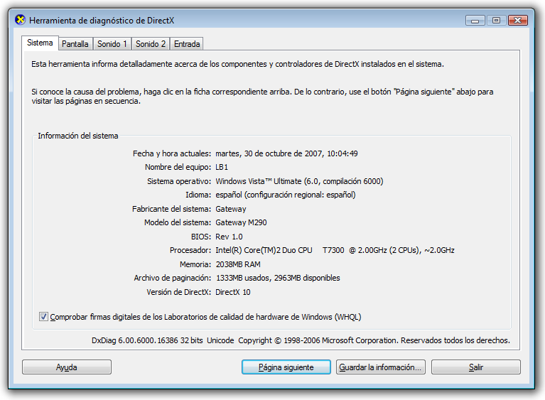

# Niveles de representación de gráficos
Un nivel de representación define un nivel de funcionalidad y rendimiento de hardware gráfico para un dispositivo que ejecuta un aplicación [!INCLUDE[TLA2#tla_winclient](../../../../includes/tla2sharptla-winclient-md.md)].  

## Hardware gráfico  
 Las características del hardware gráfico que más afectan a los niveles de representación son:  
  
- **RAM de vídeo** La cantidad de memoria de vídeo en el hardware gráfico determina el tamaño y el número de búferes que puede utilizarse para la composición de gráficos.  
  
- **Sombreador de píxeles** Un sombreador de píxeles es una función de procesamiento de gráficos que calcula los efectos píxel por píxel. Según la resolución de los gráficos mostrados, puede haber varios millones de píxeles que deban procesarse en cada fotograma mostrado.  
  
- **Sombreador de vértices** Un sombreador de vértices es una función de procesamiento de gráficos que realiza operaciones matemáticas en los datos de vértice del objeto.  
  
- **Compatibilidad con texturas múltiples** La compatibilidad con texturas múltiples hace referencia a la capacidad de aplicar dos o más texturas distintas durante una operación de combinación en un objeto gráfico 3D. El grado de compatibilidad con texturas múltiples queda determinado por el número de unidades de múltiples texturas en el hardware gráfico.  
  

## Definiciones de niveles de representación  
 Las características del hardware gráfico determinan la capacidad de representación de una aplicación [!INCLUDE[TLA2#tla_winclient](../../../../includes/tla2sharptla-winclient-md.md)]. El sistema [!INCLUDE[TLA2#tla_winclient](../../../../includes/tla2sharptla-winclient-md.md)] define tres niveles de representación:  
  
- **Nivel de representación 0** Sin aceleración de hardware gráfico. Todas las características de gráficos utilizan la aceleración de software. El nivel de versión de DirectX es menor que la versión 9.0.  
  
- **Nivel de representación 1** Algunas características de gráficos utilizan la aceleración de hardware gráfico. El nivel de versión de DirectX es mayor o igual que la versión 9.0.  
  
- **Nivel de representación 2** La mayoría de las características de gráficos utiliza la aceleración de hardware gráfico. El nivel de versión de DirectX es mayor o igual que la versión 9.0.  
  
 La <xref:System.Windows.Media.RenderCapability.Tier%2A?displayProperty=nameWithType> propiedad permite recuperar el nivel de representación en tiempo de ejecución de la aplicación. El nivel de representación se utiliza para determinar si el dispositivo admite ciertas características de aceleración de gráficos mediante hardware. La aplicación puede emprender diferentes rutas de código en tiempo de ejecución según el nivel de representación que admita el dispositivo.  
  
### Nivel de representación 0  
 Un valor de nivel de representación de 0 significa que no hay ninguna aceleración de gráficos mediante hardware disponible para la aplicación en el dispositivo. En este nivel del sistema, debe suponer que todos los gráficos se representarán mediante software sin aceleración de hardware. La funcionalidad de este nivel corresponde a una versión de DirectX inferior a 9.0.  
  
### Nivel de representación 1 y nivel de representación 2  
  
> [!NOTE]
> A partir de .NET Framework 4, el nivel de representación 1 se ha redefinido para incluir solo hardware de gráficos que admita DirectX 9.0 o superior. El hardware de gráficos compatible con DirectX 7 u 8 ahora se define como nivel de representación 0.  
  
 Un valor de nivel de representación de 1 o 2 significa que la mayoría de las características gráficas de [!INCLUDE[TLA2#tla_winclient](../../../../includes/tla2sharptla-winclient-md.md)] utilizará la aceleración de hardware si los recursos necesarios del sistema están disponibles y no se han agotado. Esto corresponde a una versión de DirectX que es mayor o igual que 9.0.  
  
 En la tabla siguiente se muestran las diferencias en los requisitos de hardware de gráficos para el nivel de representación 1 y el nivel de representación 2:  
  
|Característica|Nivel 1|Nivel 2|  
|-------------|------------|------------|  
|Versión DirectX|Debe ser mayor o igual que 9.0.|Debe ser mayor o igual que 9.0.|  
|RAM de vídeo|Debe ser mayor o igual que 60MB.|Debe ser mayor o igual que 120MB.|  
|Sombreador de píxeles|El nivel de versión debe ser mayor o igual que 2.0.|El nivel de versión debe ser mayor o igual que 2.0.|  
|Sombreador de vértices|No hay necesidad.|El nivel de versión debe ser mayor o igual que 2.0.|  
|Unidades multitextura|No hay necesidad.|El número de unidades debe ser mayor o igual que 4.|  
  
 Las siguientes características y funcionalidades se aceleran mediante hardware para el nivel de representación 1 y el nivel de representación 2:  
  
|Característica|Notas|  
|-------------|-----------|  
|Representación 2D|Se admite la mayoría de la representación 2D.|  
|Rasterización 3D|Se admite la mayoría de la rasterización 3D.|  
|Filtrado anisotrópico 3D|[!INCLUDE[TLA2#tla_winclient](../../../../includes/tla2sharptla-winclient-md.md)] intenta utilizar el filtrado anisotrópico al representar contenido 3D. El filtrado anisotrópico se refiere a la mejora de la calidad de imagen de las texturas en superficies que están lejos y significativamente en ángulo con respecto a la cámara.|  
|Asignación MIP para 3D|[!INCLUDE[TLA2#tla_winclient](../../../../includes/tla2sharptla-winclient-md.md)] intenta utilizar la asignación MIP al representar contenido 3D. La asignación MIP mejora la calidad de la representación de <xref:System.Windows.Controls.Viewport3D>texturas cuando una textura ocupa un campo de visión más pequeño en un archivo .|  
|Degradados radiales|Mientras sea compatible, <xref:System.Windows.Media.RadialGradientBrush> evite el uso de objetos grandes.|  
|Cálculos de iluminación 3D|[!INCLUDE[TLA2#tla_winclient](../../../../includes/tla2sharptla-winclient-md.md)] realiza la iluminación por vértices, lo que significa que debe calcularse una intensidad de luz en cada vértice para cada material aplicado a una malla.|  
|Representación de texto|La representación de fuentes por debajo del nivel de píxel utiliza sombreadores de píxeles disponibles en el hardware gráfico.|  
  
 Las siguientes características y funcionalidades se aceleran mediante hardware para el nivel de representación 2 únicamente:  
  
|Característica|Notas|  
|-------------|-----------|  
|Suavizado de contorno 3D|El suavizado 3D solo se admite en sistemas operativos compatibles con Windows Display Driver Model (WDDM), como Windows Vista y Windows 7.|  
  
 Las siguientes características y funcionalidades **no** se aceleran mediante hardware :  
  
|Característica|Notas|  
|-------------|-----------|  
|Contenido impreso|Todo el contenido impreso se representa utilizando la canalización de software [!INCLUDE[TLA2#tla_winclient](../../../../includes/tla2sharptla-winclient-md.md)].|  
|Contenido rasterizado que utiliza<xref:System.Windows.Media.Imaging.RenderTargetBitmap>|Cualquier contenido representado mediante <xref:System.Windows.Media.Imaging.RenderTargetBitmap.Render%2A> el <xref:System.Windows.Media.Imaging.RenderTargetBitmap>método de .|  
|Contenido en mosaico que utiliza<xref:System.Windows.Media.TileBrush>|Cualquier contenido en <xref:System.Windows.Media.TileBrush.TileMode%2A> mosaico en <xref:System.Windows.Media.TileBrush> el <xref:System.Windows.Media.TileMode.Tile>que la propiedad de la se establece en .|  
|Superficies que superan el tamaño máximo de textura del hardware gráfico|Para la mayoría del hardware gráfico, las superficies grandes tienen un tamaño de 2048 × 2048 o 4096 × 4096 píxeles.|  
|Cualquier operación cuyos requisitos de RAM de vídeo superen la memoria del hardware gráfico|Puede supervisar el uso de RAM de vídeo de las aplicaciones mediante la herramienta Perforator que se incluye en [WPF Performance Suite](https://docs.microsoft.com/previous-versions/dotnet/netframework-4.0/aa969767(v=vs.100)) en el SDK de Windows.|  
|Ventanas superpuestas|Las ventanas superpuestas permiten que las aplicaciones [!INCLUDE[TLA2#tla_winclient](../../../../includes/tla2sharptla-winclient-md.md)] representen contenido en la pantalla en una ventana no rectangular. En los sistemas operativos que admiten Windows Display Driver Model (WDDM), como Windows Vista y Windows 7, las ventanas en capas se aceleran por hardware. En otros sistemas, como Windows XP, las ventanas en capas se representan mediante software sin aceleración de hardware.   Puede habilitar las ventanas [!INCLUDE[TLA2#tla_winclient](../../../../includes/tla2sharptla-winclient-md.md)] en <xref:System.Windows.Window> capas estableciendo las siguientes propiedades:   -   <xref:System.Windows.Window.WindowStyle%2A> = <xref:System.Windows.WindowStyle.None> -   <xref:System.Windows.Window.AllowsTransparency%2A> = `true` -   <xref:System.Windows.Controls.Control.Background%2A> = <xref:System.Windows.Media.Brushes.Transparent%2A>|  
  

## Otros recursos  
 Los siguientes recursos pueden ayudarle a analizar las características de rendimiento de su aplicación [!INCLUDE[TLA2#tla_winclient](../../../../includes/tla2sharptla-winclient-md.md)].  
  
### Configuración del Registro en la representación de gráficos  
 [!INCLUDE[TLA2#tla_winclient](../../../../includes/tla2sharptla-winclient-md.md)] proporciona cuatro valores de configuración del Registro para controlar la representación de [!INCLUDE[TLA2#tla_winclient](../../../../includes/tla2sharptla-winclient-md.md)]:  
  
|Configuración|Descripción|  
|-------------|-----------------|  
|**Opción de deshabilitación de aceleración de hardware**|Especifica si se debe habilitar la aceleración de hardware.|  
|**Valor máximo de muestreo múltiple**|Especifica el grado de muestreo múltiple para el antialiasing de contenido 3D.|  
|**Configuración obligatoria de fecha del controlador de vídeo**|Especifica si el sistema deshabilita la aceleración de hardware para los controladores publicados antes de noviembre de 2004.|  
|**Opción de uso del rasterizador de referencia**|Especifica si [!INCLUDE[TLA2#tla_winclient](../../../../includes/tla2sharptla-winclient-md.md)] debe utilizar el rasterizador de referencia.|  
  
 Es posible acceder a estos parámetros mediante una utilidad de configuración externa que pueda hacer referencia a la configuración del Registro de [!INCLUDE[TLA2#tla_winclient](../../../../includes/tla2sharptla-winclient-md.md)]. Esta configuración también se puede crear o modificar accediendo a los valores directamente mediante el Editor del Registro de Windows. Para obtener más información, consulte [Configuración del Registro en la representación de gráficos](../graphics-multimedia/graphics-rendering-registry-settings.md).  
  
### Herramientas de generación de perfiles de rendimiento para WPF  
 [!INCLUDE[TLA2#tla_winclient](../../../../includes/tla2sharptla-winclient-md.md)] ofrece un conjunto de herramientas de generación de perfiles de rendimiento que le permiten analizar el comportamiento en tiempo de ejecución de la aplicación y determinar los tipos de optimizaciones de rendimiento que puede aplicar. En la tabla siguiente se enumeran las herramientas de generación de perfiles de rendimiento que se incluyen en la herramienta de Windows SDK, WPF Performance Suite:  
  
|Herramienta|Descripción|  
|----------|-----------------|  
|Perforator|Se utiliza para analizar el comportamiento de representación.|  
|Visual Profiler|Se utiliza para la generación de perfiles de uso de los servicios de [!INCLUDE[TLA2#tla_winclient](../../../../includes/tla2sharptla-winclient-md.md)], tales como el diseño y el control de eventos, mediante elementos del árbol visual.|  
  
 WPF Performance Suite proporciona una vista gráfica enriquecida de los datos de rendimiento. Para obtener más información acerca de las herramientas de rendimiento de WPF, consulte [WPF Performance Suite](https://docs.microsoft.com/previous-versions/dotnet/netframework-4.0/aa969767(v=vs.100)).  
  
### Herramienta de diagnóstico de DirectX  
 La herramienta de diagnóstico de DirectX, Dxdiag.exe, está diseñada para ayudarle a solucionar problemas relacionados con DirectX. La carpeta de instalación predeterminada para la herramienta de diagnóstico de DirectX es:  
  
 `~\Windows\System32`  
  
 Al ejecutar la herramienta de diagnóstico de DirectX, la ventana principal contiene un conjunto de pestañas que le permiten mostrar y diagnosticar información relacionada con DirectX. Por ejemplo, la pestaña **Sistema** proporciona información del sistema sobre el equipo y especifica la versión de DirectX que está instalada en el equipo.  
  
   
Ventana principal de la Herramienta de diagnóstico de DirectX  
  
## Consulte también

- <xref:System.Windows.Media.RenderCapability>
- <xref:System.Windows.Media.RenderOptions>
- [Optimizar WPF: Rendimiento de aplicaciones](optimizing-wpf-application-performance.md)
- [WPF Performance Suite](https://docs.microsoft.com/previous-versions/dotnet/netframework-4.0/aa969767(v=vs.100))
- [Configuración del Registro en la representación de gráficos](../graphics-multimedia/graphics-rendering-registry-settings.md)
- [Sugerencias y trucos para animaciones](../graphics-multimedia/animation-tips-and-tricks.md)
