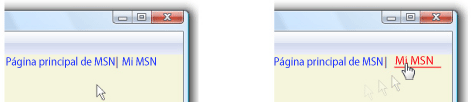

# Cómo: Especificar el subrayado de un hipervínculoHow to: Specify Whether a Hyperlink is Underlined
La <xref:System.Windows.Documents.Hyperlink> objeto es un elemento de contenido dinámico insertado que permite hospedar hipervínculos dentro del contenido dinámico.The <xref:System.Windows.Documents.Hyperlink> object is an inline-level flow content element that allows you to host hyperlinks within the flow content. De forma predeterminada, <xref:System.Windows.Documents.Hyperlink> utiliza un <xref:System.Windows.TextDecoration> objeto para mostrar un subrayado.By default, <xref:System.Windows.Documents.Hyperlink> uses a <xref:System.Windows.TextDecoration> object to display an underline. <xref:System.Windows.TextDecoration>los objetos pueden ser mejorar el rendimiento al crear instancias, especialmente si tiene muchos <xref:System.Windows.Documents.Hyperlink> objetos.<xref:System.Windows.TextDecoration> objects can be performance intensive to instantiate, particularly if you have many <xref:System.Windows.Documents.Hyperlink> objects. Si realiza uso extenso de <xref:System.Windows.Documents.Hyperlink> elementos, puede que desee tener en cuenta que muestra un subrayado únicamente al desencadenar un evento, como el <xref:System.Windows.ContentElement.MouseEnter> eventos.If you make extensive use of <xref:System.Windows.Documents.Hyperlink> elements, you may want to consider showing an underline only when triggering an event, such as the <xref:System.Windows.ContentElement.MouseEnter> event.  
  
 En el ejemplo siguiente, el subrayado para el vínculo "My MSN" es dinámico, solo aparece cuando la <xref:System.Windows.ContentElement.MouseEnter> evento se desencadena.In the following example, the underline for the "My MSN" link is dynamic—it only appears when the <xref:System.Windows.ContentElement.MouseEnter> event is triggered.  
  
   
Hipervínculos definidos con TextDecorationsHyperlinks defined with TextDecorations  
  
## EjemploExample  
 El ejemplo de marcado siguiente se muestra un <xref:System.Windows.Documents.Hyperlink> definido con y sin un subrayado:The following markup sample shows a <xref:System.Windows.Documents.Hyperlink> defined with and without an underline:  
  
 [!code-xaml[Performance#PerformanceSnippet11](../../../../samples/snippets/csharp/VS_Snippets_Wpf/Performance/CSharp/Hyperlink.xaml#performancesnippet11)]  
  
 El ejemplo de código siguiente muestra cómo crear un subrayado para el <xref:System.Windows.Documents.Hyperlink> en el <xref:System.Windows.ContentElement.MouseEnter> eventos y quitar en el <xref:System.Windows.ContentElement.MouseLeave> eventos.The following code sample shows how to create an underline for the <xref:System.Windows.Documents.Hyperlink> on the <xref:System.Windows.ContentElement.MouseEnter> event, and remove it on the <xref:System.Windows.ContentElement.MouseLeave> event.  
  
 [!code-csharp[Performance#PerformanceSnippet15](../../../../samples/snippets/csharp/VS_Snippets_Wpf/Performance/CSharp/Hyperlink.xaml.cs#performancesnippet15)]
 [!code-vb[Performance#PerformanceSnippet15](../../../../samples/snippets/visualbasic/VS_Snippets_Wpf/Performance/visualbasic/hyperlink.xaml.vb#performancesnippet15)]  
  
## Vea tambiénSee Also  
 <xref:System.Windows.TextDecoration>  
 <xref:System.Windows.Documents.Hyperlink>  
 [Optimizar WPF: Rendimiento de aplicacionesOptimizing WPF Application Performance](../../../../docs/framework/wpf/advanced/optimizing-wpf-application-performance.md)  
 [Crear una decoración de textoCreate a Text Decoration](../../../../docs/framework/wpf/advanced/how-to-create-a-text-decoration.md)
