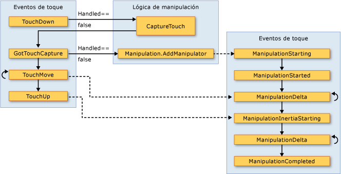

# Información general sobre acciones del usuario
El [!INCLUDE[TLA#tla_winclient](../../../../includes/tlasharptla-winclient-md.md)] subsistema proporciona una API eficaz para obtener datos de una variedad de dispositivos, como el mouse, el teclado, la funcionalidad táctil y el lápiz óptico. En este tema se describen los servicios que proporciona [!INCLUDE[TLA2#tla_winclient](../../../../includes/tla2sharptla-winclient-md.md)] y se explica la arquitectura de los sistemas de entrada.

## API de entrada
 La exposición de la API de entrada principal se encuentra en las clases <xref:System.Windows.UIElement>de <xref:System.Windows.ContentElement>elementos base: <xref:System.Windows.FrameworkContentElement>,, <xref:System.Windows.FrameworkElement>y.  Para obtener más información sobre los elementos base, consulte [Información general sobre los elementos base](base-elements-overview.md).  Estas clases proporcionan funcionalidad para los eventos de entrada relacionados con las pulsaciones de teclas, los botones del mouse, la rueda del mouse, el movimiento del mouse, la administración del foco, la captura del mouse, etc. Mediante la colocación de la API de entrada en los elementos base, en lugar de tratar todos los eventos de entrada como un servicio, la arquitectura de entrada permite que los eventos de entrada estén originados por un objeto determinado en la interfaz de usuario y para admitir un esquema de enrutamiento de eventos en el que más de un elemento tiene un opp ortunity para controlar un evento de entrada. Muchos eventos de entrada tienen un par de eventos asociados.  Por ejemplo, el evento de tecla abajo se asocia a <xref:System.Windows.Input.Keyboard.KeyDown> los <xref:System.Windows.Input.Keyboard.PreviewKeyDown> eventos y.  La diferencia entre estos eventos radica en cómo se redirigen al elemento de destino.  Los eventos de vista previa tunelizan el árbol de elementos desde el elemento raíz al de destino.  Los eventos de propagación se propagan del elemento de destino al elemento raíz.  El enrutamiento de eventos en [!INCLUDE[TLA2#tla_winclient](../../../../includes/tla2sharptla-winclient-md.md)] se describe con más detalle más adelante, dentro de esta información general, y en [Información general sobre eventos enrutados](routed-events-overview.md).

### Clases Keyboard y Mouse
 Además de la API de entrada en las clases de elementos base, <xref:System.Windows.Input.Keyboard> la clase <xref:System.Windows.Input.Mouse> y las clases proporcionan una API adicional para trabajar con la entrada del mouse y del teclado.

 Ejemplos de API de entrada en <xref:System.Windows.Input.Keyboard> la clase son <xref:System.Windows.Input.Keyboard.Modifiers%2A> la propiedad, que devuelve <xref:System.Windows.Input.ModifierKeys> el que está presionado <xref:System.Windows.Input.Keyboard.IsKeyDown%2A> , y el método, que determina si se presiona una tecla especificada.

 En el ejemplo siguiente se <xref:System.Windows.Input.Keyboard.GetKeyStates%2A> usa el método para determinar <xref:System.Windows.Input.Key> si un está en estado inactivo.

 [!code-csharp[keyargssnippetsample#KeyEventArgsKeyBoardGetKeyStates](~/samples/snippets/csharp/VS_Snippets_Wpf/KeyArgsSnippetSample/CSharp/Window1.xaml.cs#keyeventargskeyboardgetkeystates)]
 [!code-vb[keyargssnippetsample#KeyEventArgsKeyBoardGetKeyStates](~/samples/snippets/visualbasic/VS_Snippets_Wpf/KeyArgsSnippetSample/visualbasic/window1.xaml.vb#keyeventargskeyboardgetkeystates)]

 Los ejemplos de la API de <xref:System.Windows.Input.Mouse> entrada en <xref:System.Windows.Input.Mouse.MiddleButton%2A>la clase son, que obtiene el estado del botón central del mouse <xref:System.Windows.Input.Mouse.DirectlyOver%2A>, y, que obtiene el elemento sobre el que se encuentra el puntero del mouse.

 En el ejemplo siguiente se determina <xref:System.Windows.Input.Mouse.LeftButton%2A> si el del mouse está en <xref:System.Windows.Input.MouseButtonState.Pressed> el estado.

 [!code-csharp[mouserelatedsnippets#MouseRelatedSnippetsGetLeftButtonMouse](~/samples/snippets/csharp/VS_Snippets_Wpf/MouseRelatedSnippets/CSharp/Window1.xaml.cs#mouserelatedsnippetsgetleftbuttonmouse)]
 [!code-vb[mouserelatedsnippets#MouseRelatedSnippetsGetLeftButtonMouse](~/samples/snippets/visualbasic/VS_Snippets_Wpf/MouseRelatedSnippets/visualbasic/window1.xaml.vb#mouserelatedsnippetsgetleftbuttonmouse)]

 Las <xref:System.Windows.Input.Mouse> clases <xref:System.Windows.Input.Keyboard> y se describen con más detalle a lo largo de esta introducción.

### Entrada del lápiz
 [!INCLUDE[TLA2#tla_winclient](../../../../includes/tla2sharptla-winclient-md.md)]tiene compatibilidad <xref:System.Windows.Input.Stylus>integrada con.  Es una entrada de lápiz utilizada por el [!INCLUDE[TLA#tla_tpc](../../../../includes/tlasharptla-tpc-md.md)]. <xref:System.Windows.Input.Stylus>  [!INCLUDE[TLA2#tla_winclient](../../../../includes/tla2sharptla-winclient-md.md)]las aplicaciones pueden tratar el lápiz como un mouse mediante la API del mouse, [!INCLUDE[TLA2#tla_winclient](../../../../includes/tla2sharptla-winclient-md.md)] pero también expone una abstracción del dispositivo de lápiz óptico que usa un modelo similar al teclado y el mouse.  Todas las API relacionadas con el lápiz óptico contienen la palabra "Stylus".

 Dado que el lápiz puede actuar como un mouse, las aplicaciones que solo admiten la entrada de mouse pueden tener cierto nivel de compatibilidad con el lápiz automáticamente. Cuando se usa el lápiz de esta forma, la aplicación tiene la oportunidad de controlar el evento de lápiz adecuado y, a continuación, el evento de mouse correspondiente. Además, los servicios de nivel superior, como las entradas manuscritas, también están disponibles a través de la abstracción del dispositivo de lápiz.  Para obtener más información sobre la escritura con lápiz como entrada, consulte [Introducción a las entradas manuscritas](getting-started-with-ink.md).

## Enrutamiento de eventos
 Un <xref:System.Windows.FrameworkElement> puede contener otros elementos como elementos secundarios en su modelo de contenido, formando un árbol de elementos.  En [!INCLUDE[TLA2#tla_winclient](../../../../includes/tla2sharptla-winclient-md.md)], el elemento primario puede participar en la entrada dirigida a sus elementos secundarios o a otros descendientes al controlar los eventos. Esto es especialmente útil para crear controles a partir de los controles más pequeños, un proceso conocido como "composición de controles" o "composición". Para obtener más información acerca de los árboles de elementos y cómo se relacionan con las rutas de eventos, consulte [Árboles en WPF](trees-in-wpf.md).

 El enrutamiento de eventos es el proceso de reenviar eventos a varios elementos para que un objeto o elemento determinado de la ruta pueda elegir ofrecer una respuesta significativa (a través del control) a un evento que podría tener su origen en otro elemento.  Los eventos enrutados usan uno de los tres mecanismos de enrutamiento: directo, propagación y tunelización.  En el enrutamiento directo, el elemento de origen es el único elemento notificado y el evento no se redirige a ningún otro elemento. Sin embargo, el evento enrutado directo todavía ofrece algunas funcionalidades adicionales que solo están presentes para los eventos enrutados en lugar de los eventos CLR estándar. La propagación prepara el árbol de elementos: en primer lugar, notifica al elemento que dio origen al evento; a continuación, al elemento primario, etc.  La tunelización comienza en la raíz del árbol de elementos y desciende para acabar con el elemento de origen original.  Para obtener más información sobre los eventos enrutados, consulte [Información general sobre eventos enrutados](routed-events-overview.md).

 Los eventos de entrada de [!INCLUDE[TLA2#tla_winclient](../../../../includes/tla2sharptla-winclient-md.md)] suelen encontrarse en parejas formadas por un evento de tunelización y otro de propagación.  Los eventos de tunelización se distinguen de los eventos de propagación con el prefijo "Preview".  Por ejemplo, <xref:System.Windows.Input.Mouse.PreviewMouseMove> es la versión de tunelización de un evento de movimiento <xref:System.Windows.Input.Mouse.MouseMove> del mouse y es la versión de propagación de este evento. Este emparejamiento de eventos es una convención que se implementa en el nivel de elemento y no es una funcionalidad propia del sistema de eventos de [!INCLUDE[TLA2#tla_winclient](../../../../includes/tla2sharptla-winclient-md.md)]. Para obtener más información, consulte la sección Eventos de entrada de WPF en [Información general sobre eventos enrutados](routed-events-overview.md).

## Control de eventos de entrada
 Para recibir una entrada en un elemento, se debe asociar un controlador de eventos con el evento concreto.  En [!INCLUDE[TLA2#tla_xaml](../../../../includes/tla2sharptla-xaml-md.md)] es sencillo: se debe hacer referencia al nombre del evento como atributo del elemento que se escuchará para este evento.  A continuación, se establece el valor del atributo con el nombre del controlador de eventos que se define, en función de un delegado.  El controlador de eventos debe escribirse en código como C# y puede incluirse en un archivo de código subyacente.

 Los eventos de teclado tienen lugar cuando el sistema operativo notifica acciones de teclas que se producen mientras el foco del teclado está en un elemento. Los eventos de mouse y lápiz se dividen en dos categorías: eventos que informan de cambios en la posición del puntero en relación con el elemento y eventos que informan de cambios en el estado de los botones del dispositivo.

### Ejemplo de evento de entrada de teclado
 En el ejemplo siguiente se escucha una pulsación de tecla de flecha izquierda.  Se <xref:System.Windows.Controls.StackPanel> crea un que tiene un <xref:System.Windows.Controls.Button>.  Un controlador de eventos para escuchar la tecla de flecha izquierda se adjunta a la <xref:System.Windows.Controls.Button> instancia.

 La primera sección del ejemplo crea <xref:System.Windows.Controls.StackPanel> <xref:System.Windows.Controls.Button> y y asocia <xref:System.Windows.UIElement.KeyDown>el controlador de eventos para.

 [!code-xaml[InputOvw#Input_OvwKeyboardExampleXAML](~/samples/snippets/csharp/VS_Snippets_Wpf/InputOvw/CSharp/Page1.xaml#input_ovwkeyboardexamplexaml)]

 [!code-csharp[InputOvw#Input_OvwKeyboardExampleUICodeBehind](~/samples/snippets/csharp/VS_Snippets_Wpf/InputOvw/CSharp/Page1.xaml.cs#input_ovwkeyboardexampleuicodebehind)]
 [!code-vb[InputOvw#Input_OvwKeyboardExampleUICodeBehind](~/samples/snippets/visualbasic/VS_Snippets_Wpf/InputOvw/VisualBasic/Page1.xaml.vb#input_ovwkeyboardexampleuicodebehind)]

 La segunda sección está escrita en código y define el controlador de eventos.  Cuando se presiona la tecla de dirección izquierda y <xref:System.Windows.Controls.Button> el control tiene el foco de teclado, el <xref:System.Windows.Controls.Control.Background%2A> controlador se ejecuta <xref:System.Windows.Controls.Button> y se cambia el color de.  Si se presiona la tecla, pero no es la tecla <xref:System.Windows.Controls.Control.Background%2A> <xref:System.Windows.Controls.Button> de dirección izquierda, el color de se vuelve a cambiar a su color inicial.

 [!code-csharp[InputOvw#Input_OvwKeyboardExampleHandlerCodeBehind](~/samples/snippets/csharp/VS_Snippets_Wpf/InputOvw/CSharp/Page1.xaml.cs#input_ovwkeyboardexamplehandlercodebehind)]
 [!code-vb[InputOvw#Input_OvwKeyboardExampleHandlerCodeBehind](~/samples/snippets/visualbasic/VS_Snippets_Wpf/InputOvw/VisualBasic/Page1.xaml.vb#input_ovwkeyboardexamplehandlercodebehind)]

### Ejemplo de evento de entrada de mouse
 En el ejemplo siguiente, el <xref:System.Windows.Controls.Control.Background%2A> color <xref:System.Windows.Controls.Button> de se cambia cuando <xref:System.Windows.Controls.Button>el puntero del Mouse entra en.  El <xref:System.Windows.Controls.Control.Background%2A> color se restaura cuando el mouse sale de <xref:System.Windows.Controls.Button>.

 La primera <xref:System.Windows.Controls.StackPanel> sección del ejemplo crea y el <xref:System.Windows.Controls.Button> control y asocia los controladores de eventos para <xref:System.Windows.Controls.Button>los <xref:System.Windows.UIElement.MouseEnter> eventos y <xref:System.Windows.UIElement.MouseLeave> al.

 [!code-xaml[InputOvw#Input_OvwMouseExampleXAML](~/samples/snippets/csharp/VS_Snippets_Wpf/InputOvw/CSharp/Page1.xaml#input_ovwmouseexamplexaml)]

 [!code-csharp[InputOvw#Input_OvwMouseExampleUICodeBehind](~/samples/snippets/csharp/VS_Snippets_Wpf/InputOvw/CSharp/Page1.xaml.cs#input_ovwmouseexampleuicodebehind)]
 [!code-vb[InputOvw#Input_OvwMouseExampleUICodeBehind](~/samples/snippets/visualbasic/VS_Snippets_Wpf/InputOvw/VisualBasic/Page1.xaml.vb#input_ovwmouseexampleuicodebehind)]

 La segunda sección del ejemplo está escrita en código y define los controladores de eventos.  <xref:System.Windows.Controls.Button>Cuando el Mouse entra en, el <xref:System.Windows.Controls.Control.Background%2A> color de <xref:System.Windows.Controls.Button> se cambia a <xref:System.Windows.Media.Brushes.SlateGray%2A>.  Cuando el mouse sale de <xref:System.Windows.Controls.Button>, el <xref:System.Windows.Controls.Control.Background%2A> color de <xref:System.Windows.Controls.Button> se vuelve a cambiar a <xref:System.Windows.Media.Brushes.AliceBlue%2A>.

 [!code-csharp[InputOvw#Input_OvwMouseExampleEneterHandler](~/samples/snippets/csharp/VS_Snippets_Wpf/InputOvw/CSharp/Page1.xaml.cs#input_ovwmouseexampleeneterhandler)]
 [!code-vb[InputOvw#Input_OvwMouseExampleEneterHandler](~/samples/snippets/visualbasic/VS_Snippets_Wpf/InputOvw/VisualBasic/Page1.xaml.vb#input_ovwmouseexampleeneterhandler)]

 [!code-csharp[InputOvw#Input_OvwMouseExampleLeaveHandler](~/samples/snippets/csharp/VS_Snippets_Wpf/InputOvw/CSharp/Page1.xaml.cs#input_ovwmouseexampleleavehandler)]
 [!code-vb[InputOvw#Input_OvwMouseExampleLeaveHandler](~/samples/snippets/visualbasic/VS_Snippets_Wpf/InputOvw/VisualBasic/Page1.xaml.vb#input_ovwmouseexampleleavehandler)]

## Entrada de texto
 El <xref:System.Windows.ContentElement.TextInput> evento le permite escuchar la entrada de texto de forma independiente del dispositivo. El teclado es el medio principal de entrada de texto, pero la voz, la escritura a mano y otros dispositivos de entrada también pueden generar entradas de texto.

 Para la entrada de [!INCLUDE[TLA2#tla_winclient](../../../../includes/tla2sharptla-winclient-md.md)] teclado, primero envía <xref:System.Windows.ContentElement.KeyDown> los eventos correspondientes /. <xref:System.Windows.ContentElement.KeyUp> Si no se controlan esos eventos y la clave es textual (en lugar de una tecla de control como flechas direccionales o teclas de función <xref:System.Windows.ContentElement.TextInput> ), se genera un evento.  No siempre hay una asignación uno <xref:System.Windows.ContentElement.KeyDown> a uno simple entre / <xref:System.Windows.ContentElement.KeyUp> los eventos y <xref:System.Windows.ContentElement.TextInput> , ya que varias pulsaciones de tecla pueden generar un solo carácter de entrada de texto y las pulsaciones de teclas únicas pueden generar varios caracteres String.  Esto es especialmente cierto en el caso de idiomas como chino, Japonés y coreano que usan editores de métodos de entrada (IME) para generar los miles de caracteres posibles en sus alfabetos correspondientes.

 Cuando [!INCLUDE[TLA2#tla_winclient](../../../../includes/tla2sharptla-winclient-md.md)] envía un <xref:System.Windows.ContentElement.KeyUp> / evento,<xref:System.Windows.Input.KeyEventArgs.Key%2A> se establece en <xref:System.Windows.ContentElement.TextInput> si las pulsaciones de teclas pueden convertirse en parte de un evento (por ejemplo, si se presiona Alt + S). <xref:System.Windows.Input.Key.System?displayProperty=nameWithType> <xref:System.Windows.ContentElement.KeyDown> Esto permite que el código <xref:System.Windows.ContentElement.KeyDown> de un controlador de eventos <xref:System.Windows.Input.Key.System?displayProperty=nameWithType> busque y, si se encuentra, deje el procesamiento para el controlador del <xref:System.Windows.ContentElement.TextInput> evento generado posteriormente. En estos casos, las distintas propiedades del <xref:System.Windows.Input.TextCompositionEventArgs> argumento se pueden usar para determinar las pulsaciones de teclas originales. De forma similar, [!INCLUDE[TLA2#tla_ime](../../../../includes/tla2sharptla-ime-md.md)] si un está <xref:System.Windows.Input.Key> activo, tiene el <xref:System.Windows.Input.Key.ImeProcessed?displayProperty=nameWithType>valor de <xref:System.Windows.Input.KeyEventArgs.ImeProcessedKey%2A> y proporciona la pulsación de tecla o pulsaciones de teclas originales.

 En el ejemplo siguiente se define un controlador <xref:System.Windows.Controls.Primitives.ButtonBase.Click> para el evento y un controlador <xref:System.Windows.UIElement.KeyDown> para el evento.

 El primer segmento de código o marcado crea la interfaz de usuario.

 [!code-xaml[InputOvw#Input_OvwTextInputXAML](~/samples/snippets/csharp/VS_Snippets_Wpf/InputOvw/CSharp/Page1.xaml#input_ovwtextinputxaml)]

 [!code-csharp[InputOvw#Input_OvwTextInputUICodeBehind](~/samples/snippets/csharp/VS_Snippets_Wpf/InputOvw/CSharp/Page1.xaml.cs#input_ovwtextinputuicodebehind)]
 [!code-vb[InputOvw#Input_OvwTextInputUICodeBehind](~/samples/snippets/visualbasic/VS_Snippets_Wpf/InputOvw/VisualBasic/Page1.xaml.vb#input_ovwtextinputuicodebehind)]

 El segundo segmento de código contiene los controladores de eventos.

 [!code-csharp[InputOvw#Input_OvwTextInputHandlersCodeBehind](~/samples/snippets/csharp/VS_Snippets_Wpf/InputOvw/CSharp/Page1.xaml.cs#input_ovwtextinputhandlerscodebehind)]
 [!code-vb[InputOvw#Input_OvwTextInputHandlersCodeBehind](~/samples/snippets/visualbasic/VS_Snippets_Wpf/InputOvw/VisualBasic/Page1.xaml.vb#input_ovwtextinputhandlerscodebehind)]

 Dado que los eventos de entrada propagan la ruta del <xref:System.Windows.Controls.StackPanel> evento, recibe la entrada independientemente del elemento que tenga el foco de teclado. Primero <xref:System.Windows.Controls.TextBox> se notifica al control y <xref:System.Windows.Controls.TextBox> se llama `OnTextInputKeyDown` al controlador solo si no se controló la entrada. Si se <xref:System.Windows.UIElement.PreviewKeyDown> utiliza el evento en lugar <xref:System.Windows.UIElement.KeyDown> del evento, primero se `OnTextInputKeyDown` llama al controlador.

 En este ejemplo, la lógica de control se escribe dos veces: una vez para CTRL+O y otra para el evento de clic del botón. Esto se puede simplificar mediante el uso de comandos, en lugar de controlar los eventos de entrada directamente.  Los comandos se describen en esta información general y en [Información general sobre comandos](commanding-overview.md).

## Funciones táctiles y manipulación
 El nuevo hardware y la API en el sistema operativo Windows 7 proporcionan a las aplicaciones la capacidad de recibir entradas de varios toques simultáneamente. [!INCLUDE[TLA2#tla_winclient](../../../../includes/tla2sharptla-winclient-md.md)] permite que las aplicaciones detecten las funciones táctiles y respondan a ellas del mismo modo que con otras entradas, como el mouse o el teclado, y que generen eventos cuando se detecta un toque.

 [!INCLUDE[TLA2#tla_winclient](../../../../includes/tla2sharptla-winclient-md.md)] expone dos tipos de eventos cuando se usa una función táctil: eventos de función táctil y eventos de manipulación. Los eventos de función táctil proporcionan datos sin procesar sobre cada dedo en una pantalla táctil y su movimiento. Los eventos de manipulación interpretan la entrada como determinadas acciones. Ambos tipos de eventos se describen en esta sección.

### Requisitos previos
 Para desarrollar una aplicación que responda a las funciones táctiles, necesitará los componentes siguientes.

- Visual Studio 2010.

- Windows 7.

- Un dispositivo, como una pantalla táctil, compatible con Windows Touch.

### Terminología
 Para referirse a la función táctil, se usan los términos siguientes.

- **La función táctil** es un tipo de entrada de usuario que reconoce Windows 7. Normalmente, se inicia colocando los dedos en una pantalla táctil. Tenga en cuenta que algunos dispositivos, como el panel táctil habitual en portátiles, no admiten la función táctil cuando se limitan a convertir la posición y el movimiento del dedo a entradas de mouse.

- **La función multitáctil** es una función táctil que tiene lugar desde más de un punto de forma simultánea. Windows 7 y [!INCLUDE[TLA2#tla_winclient](../../../../includes/tla2sharptla-winclient-md.md)] admiten la función multitáctil. Cada vez que se menciona la función táctil en la documentación de [!INCLUDE[TLA2#tla_winclient](../../../../includes/tla2sharptla-winclient-md.md)], los conceptos se aplican a la función multitáctil.

- Una **manipulación** se produce cuando la función táctil se interpreta como una acción física que se aplica a un objeto. En [!INCLUDE[TLA2#tla_winclient](../../../../includes/tla2sharptla-winclient-md.md)], los eventos de manipulación interpretan las entradas como una manipulación de traducción, expansión o rotación.

- `touch device` representa un dispositivo que genera entradas táctiles, como un solo dedo en una pantalla táctil.

### Controles que responden a la función táctil
 Los siguientes controles se pueden desplazar al arrastrar un dedo por el control si tiene contenido que se desplaza fuera de la vista.

- <xref:System.Windows.Controls.ComboBox>

- <xref:System.Windows.Controls.ContextMenu>

- <xref:System.Windows.Controls.DataGrid>

- <xref:System.Windows.Controls.ListBox>

- <xref:System.Windows.Controls.ListView>

- <xref:System.Windows.Controls.MenuItem>

- <xref:System.Windows.Controls.TextBox>

- <xref:System.Windows.Controls.ToolBar>

- <xref:System.Windows.Controls.TreeView>

 <xref:System.Windows.Controls.ScrollViewer> Define la<xref:System.Windows.Controls.ScrollViewer.PanningMode%2A?displayProperty=nameWithType> propiedad adjunta que le permite especificar si el movimiento panorámico táctil está habilitado horizontalmente, verticalmente, ambos o ninguno. La <xref:System.Windows.Controls.ScrollViewer.PanningDeceleration%2A?displayProperty=nameWithType> propiedad especifica la rapidez con la que se ralentiza el desplazamiento cuando el usuario levanta el dedo de la pantalla táctil. La <xref:System.Windows.Controls.ScrollViewer.PanningRatio%2A?displayProperty=nameWithType> propiedad adjunta especifica la relación entre el desplazamiento para traducir el desplazamiento de manipulación.

### Eventos de funciones táctiles
 Las clases base, <xref:System.Windows.UIElement> <xref:System.Windows.UIElement3D>, y <xref:System.Windows.ContentElement>, definen eventos a los que se puede suscribir para que la aplicación responda a la entrada táctil. Los eventos de funciones táctiles resultan útiles cuando la aplicación interpreta la función táctil como algo distinto a la manipulación de un objeto. Por ejemplo, una aplicación que permite a un usuario dibujar con uno o más dedos podría suscribirse a los eventos de función táctil.

 Las tres clases definen los siguientes eventos, que se comportan de forma similar, independientemente de la clase de definición.

- <xref:System.Windows.UIElement.TouchDown>

- <xref:System.Windows.UIElement.TouchMove>

- <xref:System.Windows.UIElement.TouchUp>

- <xref:System.Windows.UIElement.TouchEnter>

- <xref:System.Windows.UIElement.TouchLeave>

- <xref:System.Windows.UIElement.PreviewTouchDown>

- <xref:System.Windows.UIElement.PreviewTouchMove>

- <xref:System.Windows.UIElement.PreviewTouchUp>

- <xref:System.Windows.UIElement.GotTouchCapture>

- <xref:System.Windows.UIElement.LostTouchCapture>

 Del mismo modo que los eventos de teclado y mouse, los eventos de función táctil son eventos enrutados. Los eventos que empiezan por `Preview` son eventos de tunelización, mientras que los que empiezan por `Touch` son eventos de propagación. Para obtener más información sobre los eventos enrutados, consulte [Información general sobre eventos enrutados](routed-events-overview.md). Al controlar estos eventos, puede obtener la posición de la entrada, relativa a cualquier elemento, llamando al <xref:System.Windows.Input.TouchEventArgs.GetTouchPoint%2A> método o. <xref:System.Windows.Input.TouchEventArgs.GetIntermediateTouchPoints%2A>

 Para entender la interacción entre los eventos de función táctil, considere un escenario en que un usuario coloca un dedo en un elemento, lo mueve en el elemento y, a continuación, lo levanta. En la ilustración siguiente se muestra la ejecución de los eventos de propagación (los eventos de tunelización se omiten por motivos de simplicidad).

  Touch (eventos)

 En la lista siguiente se describe la secuencia de los eventos de la ilustración anterior.

1. El <xref:System.Windows.UIElement.TouchEnter> evento se produce una vez cuando el usuario coloca un dedo en el elemento.

2. El <xref:System.Windows.UIElement.TouchDown> evento se produce una vez.

3. El <xref:System.Windows.UIElement.TouchMove> evento se produce varias veces cuando el usuario mueve el dedo dentro del elemento.

4. El <xref:System.Windows.UIElement.TouchUp> evento se produce una vez cuando el usuario levanta el dedo del elemento.

5. El <xref:System.Windows.UIElement.TouchLeave> evento se produce una vez.

 Cuando se usan más de dos dedos, se producen eventos para cada dedo.

### Eventos de manipulación
 En los casos en los que una aplicación permite a un usuario manipular un objeto <xref:System.Windows.UIElement> , la clase define los eventos de manipulación. A diferencia de los eventos de función táctil que, simplemente, notifican la posición de la función táctil, los eventos de manipulación indican cómo se puede interpretar la entrada. Hay tres tipos de manipulación: traducción, expansión y rotación. En la lista siguiente se describe cómo invocar los tres tipos de manipulaciones.

- Coloque un dedo en un objeto y mueva el dedo por la pantalla táctil para invocar una manipulación de traducción. Normalmente, esto mueve el objeto.

- Coloque dos dedos en un objeto y acérquelos o aléjelos para invocar una manipulación de expansión. Normalmente, esto cambia el tamaño del objeto.

- Coloque dos dedos en un objeto y gírelos entre sí para invocar una manipulación de rotación. Normalmente, esto gira el objeto.

 Se puede producir más de un tipo de manipulación al mismo tiempo.

 Cuando hace que los objetos respondan a manipulaciones, puede hacer que parezca que el objeto tenga inercia. Esto puede hacer que los objetos simulen el mundo físico. Por ejemplo, si empuja un libro encima de una mesa con suficiente fuerza, el libro seguirá moviéndose cuando lo suelte. [!INCLUDE[TLA2#tla_winclient](../../../../includes/tla2sharptla-winclient-md.md)] le permite simular este comportamiento, ya que puede generar eventos de manipulación cuando los dedos del usuario liberan el objeto.

 Para obtener información sobre cómo crear una aplicación que permita al usuario moverse, cambiar el tamaño y girar un objeto, vea [Tutorial: Crear la primera aplicación](walkthrough-creating-your-first-touch-application.md)táctil.

 <xref:System.Windows.UIElement> Define los siguientes eventos de manipulación.

- <xref:System.Windows.UIElement.ManipulationStarting>

- <xref:System.Windows.UIElement.ManipulationStarted>

- <xref:System.Windows.UIElement.ManipulationDelta>

- <xref:System.Windows.UIElement.ManipulationInertiaStarting>

- <xref:System.Windows.UIElement.ManipulationCompleted>

- <xref:System.Windows.UIElement.ManipulationBoundaryFeedback>

 De forma predeterminada, <xref:System.Windows.UIElement> no recibe estos eventos de manipulación. Para recibir eventos de manipulación en <xref:System.Windows.UIElement>un, <xref:System.Windows.UIElement.IsManipulationEnabled%2A?displayProperty=nameWithType> establezca `true`en.

#### Ruta de acceso de ejecución de eventos de manipulación
 Considere un escenario en que un usuario "lanza" un objeto. El usuario coloca un dedo en el objeto, mueve el dedo por la pantalla táctil una distancia corta y, a continuación, lo levanta mientras se mueve. El resultado es que el objeto se moverá bajo el dedo del usuario y lo seguirá haciendo cuando el usuario lo levante.

 En la ilustración siguiente se muestra la ruta de acceso de ejecución de los eventos de manipulación e información importante sobre cada evento.

  Eventos de manipulación

 En la lista siguiente se describe la secuencia de los eventos de la ilustración anterior.

1. El <xref:System.Windows.UIElement.ManipulationStarting> evento tiene lugar cuando el usuario coloca un dedo sobre el objeto. Entre otras cosas, este evento le permite establecer la <xref:System.Windows.Input.ManipulationStartingEventArgs.ManipulationContainer%2A> propiedad. En los eventos posteriores, la posición de la manipulación será relativa a <xref:System.Windows.Input.ManipulationStartingEventArgs.ManipulationContainer%2A>. En otros eventos distintos <xref:System.Windows.UIElement.ManipulationStarting>de, esta propiedad es de solo lectura, por <xref:System.Windows.UIElement.ManipulationStarting> lo que el evento es la única vez que se puede establecer esta propiedad.

2. El <xref:System.Windows.UIElement.ManipulationStarted> evento tiene lugar a continuación. Este evento indica el origen de la manipulación.

3. El <xref:System.Windows.UIElement.ManipulationDelta> evento se produce varias veces a medida que se mueven los dedos de un usuario en una pantalla táctil. La <xref:System.Windows.Input.ManipulationDeltaEventArgs.DeltaManipulation%2A> propiedad de la <xref:System.Windows.Input.ManipulationDeltaEventArgs> clase informa de si la manipulación se interpreta como movimiento, expansión o traducción. En este punto se realiza la mayoría del trabajo de manipulación de un objeto.

4. El <xref:System.Windows.UIElement.ManipulationInertiaStarting> evento tiene lugar cuando los dedos del usuario pierden el contacto con el objeto. Este evento permite especificar la desaceleración de las manipulaciones durante la inercia. Esto sirve para que el objeto pueda emular espacios físicos o atributos diferentes, si así lo elige. Por ejemplo, suponga que la aplicación tiene dos objetos que representan elementos del mundo físico y que uno es más pesado que el otro. Puede hacer que el objeto más pesado disminuya su velocidad más rápidamente que el objeto ligero.

5. El <xref:System.Windows.UIElement.ManipulationDelta> evento se produce varias veces a medida que se produce la inercia. Tenga en cuenta que este evento se produce cuando los dedos del usuario se mueven por la pantalla táctil y [!INCLUDE[TLA2#tla_winclient](../../../../includes/tla2sharptla-winclient-md.md)] simula la inercia. En otras palabras, <xref:System.Windows.UIElement.ManipulationDelta> se produce antes y después <xref:System.Windows.UIElement.ManipulationInertiaStarting> del evento. La <xref:System.Windows.Input.ManipulationDeltaEventArgs.IsInertial%2A?displayProperty=nameWithType> propiedad indica si el <xref:System.Windows.UIElement.ManipulationDelta> evento se produce durante la inercia, de modo que puede comprobar esa propiedad y realizar diferentes acciones, en función de su valor.

6. El <xref:System.Windows.UIElement.ManipulationCompleted> evento tiene lugar cuando finaliza la manipulación y cualquier inercia. Es decir, después de que <xref:System.Windows.UIElement.ManipulationDelta> se produzcan todos <xref:System.Windows.UIElement.ManipulationCompleted> los eventos, se produce el evento para indicar que se ha completado la manipulación.

 También define el <xref:System.Windows.UIElement.ManipulationBoundaryFeedback>evento. <xref:System.Windows.UIElement> Este evento se produce cuando <xref:System.Windows.Input.ManipulationDeltaEventArgs.ReportBoundaryFeedback%2A> se llama al método en <xref:System.Windows.UIElement.ManipulationDelta> el evento. El <xref:System.Windows.UIElement.ManipulationBoundaryFeedback> evento permite a las aplicaciones o componentes proporcionar comentarios visuales cuando un objeto alcanza un límite. Por ejemplo, la <xref:System.Windows.Window> clase controla el <xref:System.Windows.UIElement.ManipulationBoundaryFeedback> evento para hacer que la ventana se mueva ligeramente cuando se encuentre su borde.

 Puede cancelar la manipulación llamando al <xref:System.Windows.Input.ManipulationStartingEventArgs.Cancel%2A> método en los argumentos del evento en cualquier evento de manipulación excepto <xref:System.Windows.UIElement.ManipulationBoundaryFeedback> en el evento. Cuando se llama <xref:System.Windows.Input.ManipulationStartingEventArgs.Cancel%2A>a, los eventos de manipulación ya no se generan y se producen eventos del mouse para el toque. En la tabla siguiente se describe la relación entre el momento en que se cancela la manipulación y los eventos del mouse que se producen.

|Evento con el que se llama al método Cancel|Eventos del mouse que se generan para entradas que ya se han producido|
|----------------------------------------|-----------------------------------------------------------------|
|<xref:System.Windows.UIElement.ManipulationStarting> y <xref:System.Windows.UIElement.ManipulationStarted>|Eventos de presión del mouse.|
|<xref:System.Windows.UIElement.ManipulationDelta>|Eventos de presión y movimiento del mouse.|
|<xref:System.Windows.UIElement.ManipulationInertiaStarting> y <xref:System.Windows.UIElement.ManipulationCompleted>|Eventos de presión, movimiento y liberación del mouse.|

 Tenga en cuenta que si <xref:System.Windows.Input.ManipulationStartingEventArgs.Cancel%2A> llama a cuando la manipulación está en inercia, el `false` método devuelve y la entrada no genera eventos del mouse.

### Relación entre eventos de función táctil y manipulación
 Siempre <xref:System.Windows.UIElement> puede recibir eventos de toque. Cuando la <xref:System.Windows.UIElement.IsManipulationEnabled%2A> propiedad se establece en `true`, <xref:System.Windows.UIElement> puede recibir eventos de toque y manipulación.  Si no <xref:System.Windows.UIElement.TouchDown> se controla el evento (es decir, la <xref:System.Windows.RoutedEventArgs.Handled%2A> propiedad es `false`), la lógica de manipulación captura el toque en el elemento y genera los eventos de manipulación. Si la <xref:System.Windows.RoutedEventArgs.Handled%2A> propiedad se `true` establece en en el <xref:System.Windows.UIElement.TouchDown> evento, la lógica de manipulación no genera eventos de manipulación. En la siguiente ilustración se muestra la relación entre los eventos de función táctil y los de manipulación.

  Eventos de toque y manipulación

 En la lista siguiente se describe la relación entre los eventos de función táctil y de manipulación que se muestra en la ilustración anterior.

- Cuando el primer dispositivo táctil genera un <xref:System.Windows.UIElement.TouchDown> evento en un <xref:System.Windows.UIElement>, la lógica de manipulación llama <xref:System.Windows.UIElement.CaptureTouch%2A> al método, que genera <xref:System.Windows.UIElement.GotTouchCapture> el evento.

- Cuando se produce, la lógica de manipulación llama <xref:System.Windows.Input.Manipulation.AddManipulator%2A?displayProperty=nameWithType> al método, que genera <xref:System.Windows.UIElement.ManipulationStarting> el evento. <xref:System.Windows.UIElement.GotTouchCapture>

- Cuando se <xref:System.Windows.UIElement.TouchMove> producen los eventos, la lógica de manipulación <xref:System.Windows.UIElement.ManipulationDelta> genera los eventos que se <xref:System.Windows.UIElement.ManipulationInertiaStarting> producen antes del evento.

- Cuando el último dispositivo táctil en el elemento provoca el <xref:System.Windows.UIElement.TouchUp> evento, la lógica de manipulación genera <xref:System.Windows.UIElement.ManipulationInertiaStarting> el evento.

## Foco
 Hay dos conceptos principales relacionados con el foco en [!INCLUDE[TLA2#tla_winclient](../../../../includes/tla2sharptla-winclient-md.md)]: el foco de teclado y el foco lógico.

### Foco de teclado
 El foco de teclado hace referencia al elemento que recibe la entrada del teclado.  Puede haber un único elemento en todo el escritorio que tenga el foco de teclado.  En [!INCLUDE[TLA2#tla_winclient](../../../../includes/tla2sharptla-winclient-md.md)], el elemento que tiene el foco <xref:System.Windows.IInputElement.IsKeyboardFocused%2A> de teclado tendrá establecido `true`en.  El método <xref:System.Windows.Input.Keyboard> <xref:System.Windows.Input.Keyboard.FocusedElement%2A> estático devuelve el elemento que tiene actualmente el foco de teclado.

 El foco de teclado se puede obtener haciendo tabulador a un elemento o haciendo clic con el mouse en determinados elementos, <xref:System.Windows.Controls.TextBox>como.  El foco de teclado también se puede obtener mediante programación con <xref:System.Windows.Input.Keyboard.Focus%2A> el método en <xref:System.Windows.Input.Keyboard> la clase.  <xref:System.Windows.Input.Keyboard.Focus%2A>intenta proporcionar el foco de teclado del elemento especificado.  El elemento devuelto <xref:System.Windows.Input.Keyboard.Focus%2A> por es el elemento que tiene actualmente el foco de teclado.

 Para que un elemento obtenga el foco de teclado, <xref:System.Windows.UIElement.Focusable%2A> la propiedad y <xref:System.Windows.UIElement.IsVisible%2A> las propiedades deben establecerse en **true**.  Algunas <xref:System.Windows.Controls.Panel>clases, como, tienen <xref:System.Windows.UIElement.Focusable%2A> establecido en `false` de forma predeterminada; por lo tanto, puede que tenga que establecer esta `true` propiedad en si desea que ese elemento pueda obtener el foco.

 En el ejemplo siguiente <xref:System.Windows.Input.Keyboard.Focus%2A> se usa para establecer el foco <xref:System.Windows.Controls.Button>de teclado en un.  El lugar recomendado para establecer el foco inicial en una aplicación se encuentra <xref:System.Windows.FrameworkElement.Loaded> en el controlador de eventos.

 [!code-csharp[focussample#FocusSampleSetFocus](~/samples/snippets/csharp/VS_Snippets_Wpf/FocusSample/CSharp/Window1.xaml.cs#focussamplesetfocus)]
 [!code-vb[focussample#FocusSampleSetFocus](~/samples/snippets/visualbasic/VS_Snippets_Wpf/FocusSample/visualbasic/window1.xaml.vb#focussamplesetfocus)]

 Para obtener más información acerca del foco de teclado, consulte [Foco de teclado](focus-overview.md).

### Foco lógico
 El <xref:System.Windows.Input.FocusManager.FocusedElement%2A?displayProperty=nameWithType> foco lógico hace referencia a en un ámbito de foco.  Puede haber varios elementos que tengan el foco lógico en una aplicación, pero solo puede haber uno con el foco lógico en un ámbito de foco concreto.

 Un ámbito de foco es un elemento contenedor que realiza un seguimiento <xref:System.Windows.Input.FocusManager.FocusedElement%2A> de dentro de su ámbito.  Cuando el foco sale de un ámbito de foco, el elemento enfocado pierde el foco de teclado, pero conserva el foco lógico.  Cuando el foco vuelve al ámbito de foco, el elemento enfocado recibe el foco de teclado.  Esto permite cambiar el foco de teclado entre varios ámbitos de foco, pero garantiza que el elemento enfocado dentro del ámbito siga siendo el elemento enfocado cuando vuelva el foco.

 Un elemento se puede convertir en un ámbito de foco [!INCLUDE[TLA#tla_xaml](../../../../includes/tlasharptla-xaml-md.md)] en estableciendo la <xref:System.Windows.Input.FocusManager> propiedad <xref:System.Windows.Input.FocusManager.IsFocusScope%2A> adjunta en `true`, o en código estableciendo la propiedad adjunta mediante el <xref:System.Windows.Input.FocusManager.SetIsFocusScope%2A> método.

 En el ejemplo siguiente se <xref:System.Windows.Controls.StackPanel> convierte un en un ámbito de foco <xref:System.Windows.Input.FocusManager.IsFocusScope%2A> estableciendo la propiedad adjunta.

 [!code-xaml[MarkupSnippets#MarkupIsFocusScopeXAML](~/samples/snippets/csharp/VS_Snippets_Wpf/MarkupSnippets/CSharp/Window1.xaml#markupisfocusscopexaml)]

 [!code-csharp[FocusSnippets#FocusSetIsFocusScope](~/samples/snippets/csharp/VS_Snippets_Wpf/FocusSnippets/CSharp/Window1.xaml.cs#focussetisfocusscope)]
 [!code-vb[FocusSnippets#FocusSetIsFocusScope](~/samples/snippets/visualbasic/VS_Snippets_Wpf/FocusSnippets/visualbasic/window1.xaml.vb#focussetisfocusscope)]

 Las clases [!INCLUDE[TLA2#tla_winclient](../../../../includes/tla2sharptla-winclient-md.md)] en que son ámbitos de foco de forma <xref:System.Windows.Window>predeterminada <xref:System.Windows.Controls.Menu>son <xref:System.Windows.Controls.ToolBar>,, <xref:System.Windows.Controls.ContextMenu>y.

 Un elemento que tiene el foco de teclado también tendrá el foco lógico del ámbito de foco al que pertenece; por lo tanto, establecer el foco en un <xref:System.Windows.Input.Keyboard.Focus%2A> elemento con el <xref:System.Windows.Input.Keyboard> método en la clase o las clases de elementos base intentará proporcionar el foco de teclado y el foco lógico del elemento.

 Para determinar el elemento con foco en un ámbito de foco <xref:System.Windows.Input.FocusManager.GetFocusedElement%2A>, use. Para cambiar el elemento con foco de un ámbito de foco <xref:System.Windows.Input.FocusManager.SetFocusedElement%2A>, use.

 Para obtener más información acerca del foco lógico, consulte [Foco lógico](focus-overview.md).

## Posición del mouse
 La [!INCLUDE[TLA2#tla_winclient](../../../../includes/tla2sharptla-winclient-md.md)] API de entrada proporciona información útil con respecto a los espacios de coordenadas.  Por ejemplo, la coordenada `(0,0)` es la coordenada superior izquierda, pero ¿de qué elemento del árbol? ¿El elemento de destino de la entrada? ¿El elemento adjunto al controlador de eventos? ¿O alguna otra cosa? Para evitar confusiones, [!INCLUDE[TLA2#tla_winclient](../../../../includes/tla2sharptla-winclient-md.md)] la API de entrada requiere que especifique el marco de referencia al trabajar con las coordenadas obtenidas a través del mouse. El <xref:System.Windows.Input.Mouse.GetPosition%2A> método devuelve la coordenada del puntero del mouse en relación con el elemento especificado.

## Captura del mouse
 Los dispositivos de mouse tienen una característica modal concreta que se denomina captura del mouse. La captura del mouse se usa para mantener un estado de entrada transitorio cuando se inicia una operación de arrastrar y colocar, para que otras operaciones relacionadas con la posición en pantalla nominal del puntero del mouse no se produzcan necesariamente. Al arrastrar, el usuario no puede hacer clic sin anular la acción de arrastrar y colocar, lo que hace que la mayoría de las indicaciones que se producen al pasar el mouse sean inadecuadas mientras se conserva la captura del mouse desde el origen de la acción de arrastrar. El sistema de entrada expone las API que pueden determinar el estado de la captura del mouse, así como las API que pueden forzar la captura del mouse a un elemento concreto o borrar el estado de la captura del mouse. Para obtener más información sobre las operaciones de arrastrar y colocar, consulte [Información general sobre la función de arrastrar y colocar](drag-and-drop-overview.md).

## Comandos:
 Los comandos habilitan el control de entrada en un nivel más semántico que la entrada de dispositivos.  Los comandos son directivas sencillas, como `Cut`, `Copy`, `Paste` o `Open`.  Los comandos son útiles para centralizar la lógica de comando.  Se puede tener acceso al mismo comando desde <xref:System.Windows.Controls.Menu>, <xref:System.Windows.Controls.ToolBar>en o mediante un método abreviado de teclado. Los comandos también proporcionan un mecanismo para deshabilitar controles cuando el comando deja de estar disponible.

 <xref:System.Windows.Input.RoutedCommand>es la [!INCLUDE[TLA2#tla_winclient](../../../../includes/tla2sharptla-winclient-md.md)] implementación de <xref:System.Windows.Input.ICommand>.  Cuando se <xref:System.Windows.Input.RoutedCommand> ejecuta un, se <xref:System.Windows.Input.CommandManager.PreviewExecuted> genera un <xref:System.Windows.Input.CommandManager.Executed> evento y en el destino del comando, que tuneliza y traspasa el árbol de elementos como otra entrada.  Si no se define ningún destino de comando, el elemento con el foco de teclado será el destino del comando.  La lógica que realiza el comando se adjunta a un <xref:System.Windows.Input.CommandBinding>.  Cuando un <xref:System.Windows.Input.CommandManager.Executed> evento alcanza un <xref:System.Windows.Input.CommandBinding> para <xref:System.Windows.Input.ExecutedRoutedEventHandler> ese <xref:System.Windows.Input.CommandBinding> comando concreto, se llama a en.  Este controlador realiza la acción del comando.

 Para obtener más información sobre los comandos, consulte [Información general sobre los comandos](commanding-overview.md).

 [!INCLUDE[TLA2#tla_winclient](../../../../includes/tla2sharptla-winclient-md.md)]proporciona una biblioteca de comandos comunes que consta de <xref:System.Windows.Input.ApplicationCommands>, <xref:System.Windows.Input.MediaCommands>, <xref:System.Windows.Input.ComponentCommands>, <xref:System.Windows.Input.NavigationCommands>y <xref:System.Windows.Documents.EditingCommands>, o puede definir los suyos propios.

 En el ejemplo siguiente se muestra cómo configurar un <xref:System.Windows.Controls.MenuItem> de modo que, cuando se hace clic en él, <xref:System.Windows.Input.ApplicationCommands.Paste%2A> se invoque <xref:System.Windows.Controls.TextBox>el comando en, <xref:System.Windows.Controls.TextBox> suponiendo que tiene el foco de teclado.

 [!code-xaml[CommandingOverviewSnippets#CommandingOverviewSimpleCommand](~/samples/snippets/csharp/VS_Snippets_Wpf/CommandingOverviewSnippets/CSharp/Window1.xaml#commandingoverviewsimplecommand)]

 [!code-csharp[CommandingOverviewSnippets#CommandingOverviewCommandTargetCodeBehind](~/samples/snippets/csharp/VS_Snippets_Wpf/CommandingOverviewSnippets/CSharp/Window1.xaml.cs#commandingoverviewcommandtargetcodebehind)]
 [!code-vb[CommandingOverviewSnippets#CommandingOverviewCommandTargetCodeBehind](~/samples/snippets/visualbasic/VS_Snippets_Wpf/CommandingOverviewSnippets/visualbasic/window1.xaml.vb#commandingoverviewcommandtargetcodebehind)]

 Para obtener más información sobre los comandos en [!INCLUDE[TLA2#tla_winclient](../../../../includes/tla2sharptla-winclient-md.md)], consulte [Información general sobre comandos](commanding-overview.md).

## Sistema de entrada y elementos base
 Los eventos de entrada, como los eventos adjuntos <xref:System.Windows.Input.Keyboard>definidos por <xref:System.Windows.Input.Stylus> las <xref:System.Windows.Input.Mouse>clases, y, los genera el sistema de entrada y se insertan en una posición determinada en el modelo de objetos basándose en la prueba de posicionamiento del árbol visual en tiempo de ejecución.

 Cada uno de los eventos <xref:System.Windows.Input.Mouse>que <xref:System.Windows.Input.Keyboard>, y <xref:System.Windows.Input.Stylus> define como un evento adjunto también se vuelve a exponer mediante las clases <xref:System.Windows.UIElement> de elementos base <xref:System.Windows.ContentElement> y como un nuevo evento enrutado. Los eventos enrutados de elementos base se generan desde clases que controlan el evento adjunto original y reutilizan los datos del evento.

 Cuando el evento de entrada se asocia con un elemento de origen determinado a través de la implementación del evento de entrada de elemento base, se puede redirigir a través del resto de una ruta de evento que se basa en una combinación de objetos del árbol lógico y visual, y se puede controlar desde el código de la aplicación.  Por lo general, es más conveniente controlar estos eventos de entrada relacionados con el dispositivo mediante los eventos enrutados en <xref:System.Windows.UIElement> y <xref:System.Windows.ContentElement>, porque puede usar la sintaxis de controlador de [!INCLUDE[TLA2#tla_xaml](../../../../includes/tla2sharptla-xaml-md.md)] eventos más intuitiva en y en el código. También puede elegir controlar el evento adjunto que inició el proceso, pero tendría que enfrentarse a varios problemas: el evento adjunto puede estar marcado como controlado por el control de la clase de elemento base, y debe utilizar métodos de descriptor de acceso, en lugar de la sintaxis de eventos true a fin de adjuntar controladores para eventos adjuntos.

## Pasos adicionales
 Ahora dispone de varias técnicas para controlar la entrada en [!INCLUDE[TLA2#tla_winclient](../../../../includes/tla2sharptla-winclient-md.md)].  También debe tener una mejor comprensión de los distintos tipos de eventos de entrada y los mecanismos de eventos enrutados que usa [!INCLUDE[TLA2#tla_winclient](../../../../includes/tla2sharptla-winclient-md.md)].

 Existen recursos adicionales que explican los elementos del marco de trabajo [!INCLUDE[TLA2#tla_winclient](../../../../includes/tla2sharptla-winclient-md.md)] y el enrutamiento de eventos con más detalle. Consulte los temas siguientes para obtener más información: [Información general sobre comandos](commanding-overview.md), [Información general sobre el foco](focus-overview.md), [Información general sobre elementos base](base-elements-overview.md), [Árboles en WPF](trees-in-wpf.md) e [Información general sobre eventos enrutados](routed-events-overview.md).

## Vea también

- [Información general sobre el foco](focus-overview.md)
- [Información general sobre comandos](commanding-overview.md)
- [Información general sobre eventos enrutados](routed-events-overview.md)
- [Información general sobre elementos base](base-elements-overview.md)
- [Propiedades](properties-wpf.md)
