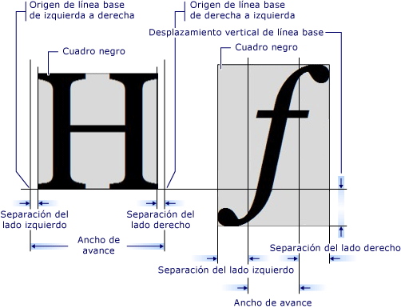

# Introducción al objeto GlyphRun y al elemento GlyphsIntroduction to the GlyphRun Object and Glyphs Element
En este tema se describen el objeto <xref:System.Windows.Media.GlyphRun> y el elemento <xref:System.Windows.Documents.Glyphs>.This topic describes the <xref:System.Windows.Media.GlyphRun> object and the <xref:System.Windows.Documents.Glyphs> element.  

   
## Introducción a GlyphRunIntroduction to GlyphRun  
 [!INCLUDE[TLA#tla_winclient](../../../../includes/tlasharptla-winclient-md.md)] proporciona compatibilidad con texto avanzado, incluido el marcado de nivel de glifos con acceso directo a <xref:System.Windows.Documents.Glyphs> para los clientes que quieren interceptar y conservar el texto después de darle formato.provides advanced text support including glyph-level markup with direct access to <xref:System.Windows.Documents.Glyphs> for customers who want to intercept and persist text after formatting. Estas características ofrecen una compatibilidad fundamental para los distintos requisitos de representación de texto en cada uno de los siguientes escenarios.These features provide critical support for the different text rendering requirements in each of the following scenarios.  
  
1. Presentación en pantalla de documentos de formato fijo.Screen display of fixed-format documents.  
  
2. Escenarios de impresión.Print scenarios.  
  
    - [!INCLUDE[TLA#tla_xaml](../../../../includes/tlasharptla-xaml-md.md)] como un lenguaje de impresora del dispositivo.as a device printer language.  
  
    - Escritor de documentos XPS de Microsoft.Microsoft XPS Document Writer.  
  
    - Controladores de impresora anteriores, que se envían desde aplicaciones Win32 al formato fijo.Previous printer drivers, output from Win32 applications to the fixed format.  
  
    - Formato de cola de impresión.Print spool format.  
  
3. Representación de documentos de formato fijo, incluidos clientes de versiones anteriores de Windows y otros dispositivos informáticos.Fixed-format document representation, including clients for previous versions of Windows and other computing devices.  
  
> [!NOTE]
> <xref:System.Windows.Documents.Glyphs> y <xref:System.Windows.Media.GlyphRun> están diseñados para escenarios de impresión y presentación de documentos de formato fijo.<xref:System.Windows.Documents.Glyphs> and <xref:System.Windows.Media.GlyphRun> are designed for fixed-format document presentation and print scenarios. [!INCLUDE[TLA#tla_winclient](../../../../includes/tlasharptla-winclient-md.md)] proporciona varios elementos para el diseño general y escenarios de [!INCLUDE[TLA#tla_ui](../../../../includes/tlasharptla-ui-md.md)] como <xref:System.Windows.Controls.Label> y <xref:System.Windows.Controls.TextBlock>.provides several elements for general layout and [!INCLUDE[TLA#tla_ui](../../../../includes/tlasharptla-ui-md.md)] scenarios such as <xref:System.Windows.Controls.Label> and <xref:System.Windows.Controls.TextBlock>. Para obtener más información sobre los escenarios de diseño y [!INCLUDE[TLA2#tla_ui](../../../../includes/tla2sharptla-ui-md.md)], consulte [Tipografía en WPF](typography-in-wpf.md).For more information on layout and [!INCLUDE[TLA2#tla_ui](../../../../includes/tla2sharptla-ui-md.md)] scenarios, see the [Typography in WPF](typography-in-wpf.md).  
  
   
## Objeto GlyphRunThe GlyphRun Object  
 El objeto <xref:System.Windows.Media.GlyphRun> representa una secuencia de glifos de un solo aspecto de una sola fuente con un solo tamaño y con un único estilo de representación.The <xref:System.Windows.Media.GlyphRun> object represents a sequence of glyphs from a single face of a single font at a single size, and with a single rendering style.  
  
 <xref:System.Windows.Media.GlyphRun> incluye los detalles de fuente como <xref:System.Windows.Documents.Glyphs.Indices%2A> de glifos y posiciones de glifo individuales.<xref:System.Windows.Media.GlyphRun> includes both font details such as glyph <xref:System.Windows.Documents.Glyphs.Indices%2A> and individual glyph positions. También incluye los puntos de código Unicode originales desde los que se generó la ejecución, la información de asignación de desplazamiento de búfer de carácter a glifo y las marcas por carácter y por glifo.It also includes the original Unicode code points the run was generated from, character-to-glyph buffer offset mapping information, and per-character and per-glyph flags.  
  
 <xref:System.Windows.Media.GlyphRun> tiene una <xref:System.Windows.FrameworkElement>de alto nivel correspondiente <xref:System.Windows.Documents.Glyphs>.<xref:System.Windows.Media.GlyphRun> has a corresponding high-level <xref:System.Windows.FrameworkElement>, <xref:System.Windows.Documents.Glyphs>. <xref:System.Windows.Documents.Glyphs> puede usarse en el árbol de elementos y en [!INCLUDE[TLA2#tla_xaml](../../../../includes/tla2sharptla-xaml-md.md)] marcado para representar <xref:System.Windows.Media.GlyphRun> salida.<xref:System.Windows.Documents.Glyphs> can be used in the element tree and in [!INCLUDE[TLA2#tla_xaml](../../../../includes/tla2sharptla-xaml-md.md)] markup to represent <xref:System.Windows.Media.GlyphRun> output.  
  
   
## Elemento GlyphsThe Glyphs Element  
 El elemento <xref:System.Windows.Documents.Glyphs> representa la salida de un <xref:System.Windows.Media.GlyphRun> en [!INCLUDE[TLA2#tla_xaml](../../../../includes/tla2sharptla-xaml-md.md)].The <xref:System.Windows.Documents.Glyphs> element represents the output of a <xref:System.Windows.Media.GlyphRun> in [!INCLUDE[TLA2#tla_xaml](../../../../includes/tla2sharptla-xaml-md.md)]. La sintaxis de marcado siguiente se utiliza para describir el elemento <xref:System.Windows.Documents.Glyphs>.The following markup syntax is used to describe the <xref:System.Windows.Documents.Glyphs> element.  
  
 [!code-xaml[GlyphsOvwSample1#1](~/samples/snippets/csharp/VS_Snippets_Wpf/GlyphsOvwSample1/CS/default.xaml#1)]  
  
 Las definiciones de propiedad siguientes corresponden a los primeros cuatro atributos del marcado del ejemplo.The following property definitions correspond to the first four attributes in the sample markup.  
  
|La propiedadProperty|DescripciónDescription|  
|--------------|-----------------|  
|<xref:System.Windows.Documents.Glyphs.FontUri%2A>|Especifica un identificador de recurso: nombre de archivo, identificador uniforme de recursos (URI) de web o referencia de recurso en el contenedor Application. exe o.Specifies a resource identifier: file name, Web uniform resource identifier (URI), or resource reference in the application .exe or container.|  
|<xref:System.Windows.Documents.Glyphs.FontRenderingEmSize%2A>|Especifica el tamaño de fuente en unidades de superficie de dibujo (el valor predeterminado es de 0,96 pulgadas) .Specifies the font size in drawing surface units (default is .96 inches).|  
|<xref:System.Windows.Documents.Glyphs.StyleSimulations%2A>|Especifica marcas para los estilos de negrita y cursiva.Specifies flags for bold and Italic styles.|  
|<xref:System.Windows.Documents.Glyphs.BidiLevel%2A>|Especifica el nivel del diseño bidireccional.Specifies the bidirectional layout level. Los valores pares y cero implican un diseño de izquierda a derecha, mientras que los valores impares implican un diseño de derecha a izquierda.Even-numbered and zero values imply left-to-right layout; odd-numbered values imply right-to-left layout.|  
  
   
### Propiedad IndicesIndices property  
 La propiedad <xref:System.Windows.Documents.Glyphs.Indices%2A> es una cadena de especificaciones de glifo.The <xref:System.Windows.Documents.Glyphs.Indices%2A> property is a string of glyph specifications. Si una secuencia de glifos forma un clúster único, la especificación del primer glifo del clúster está precedida por una especificación de la cantidad de glifos y puntos de código que se combinan para formar el clúster.Where a sequence of glyphs forms a single cluster, the specification of the first glyph in the cluster is preceded by a specification of how many glyphs and how many code points combine to form the cluster. La propiedad <xref:System.Windows.Documents.Glyphs.Indices%2A> recopila en una cadena las siguientes propiedades.The <xref:System.Windows.Documents.Glyphs.Indices%2A> property collects in one string the following properties.  
  
- Índices de glifoGlyph indices  
  
- Anchos de avance de glifoGlyph advance widths  
  
- Combinación de vectores de datos adjuntos de glifoCombining glyph attachment vectors  
  
- Asignación de clústeres desde puntos de código a glifosCluster mapping from code points to glyphs  
  
- Marcas de glifoGlyph flags  
  
 Cada especificación de glifo tiene la forma siguiente.Each glyph specification has the following form.  
  
 `[GlyphIndex][,[Advance][,[uOffset][,[vOffset][,[Flags]]]]]`  
  
   
## Métricas de glifoGlyph Metrics  
 Cada glifo define métricas que especifican cómo se alinea con otros <xref:System.Windows.Documents.Glyphs>.Each glyph defines metrics that specify how it aligns with other <xref:System.Windows.Documents.Glyphs>. En el gráfico siguiente se definen las distintas calidades tipográficas de dos caracteres de glifo diferentes.The following graphic defines the various typographic qualities of two different glyph characters.  
  
   
  
   
## Marcado de glifosGlyphs Markup  
 En el ejemplo de código siguiente se muestra cómo utilizar varias propiedades del elemento <xref:System.Windows.Documents.Glyphs> en [!INCLUDE[TLA2#tla_xaml](../../../../includes/tla2sharptla-xaml-md.md)].The following code example shows how to use various properties of the <xref:System.Windows.Documents.Glyphs> element in [!INCLUDE[TLA2#tla_xaml](../../../../includes/tla2sharptla-xaml-md.md)].  
  
 [!code-xaml[GlyphsOvwSamp2#1](~/samples/snippets/csharp/VS_Snippets_Wpf/GlyphsOvwSamp2/CS/default.xaml#1)]  
  
## Vea tambiénSee also

- [Tipografía en WPFTypography in WPF](typography-in-wpf.md)
- [Documentos en WPFDocuments in WPF](documents-in-wpf.md)
- [TextText](optimizing-performance-text.md)
