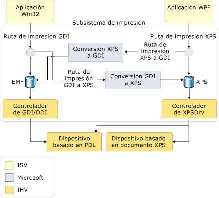

# Información general sobre impresión
Con Microsoft .NET Framework, los desarrolladores de aplicaciones con Windows Presentation Foundation (WPF) tienen un rico conjunto nuevo de administración del sistema de impresión y [!INCLUDE[TLA#tla_api#plural](../../../../includes/tlasharptla-apisharpplural-md.md)]. Con [!INCLUDE[TLA#tla_winvista](../../../../includes/tlasharptla-winvista-md.md)], algunas de estas mejoras del sistema de impresión también están disponibles para los desarrolladores que crean aplicaciones de [!INCLUDE[TLA#tla_winforms](../../../../includes/tlasharptla-winforms-md.md)], así como para los que usan código no administrado. La base de esta nueva funcionalidad es el nuevo formato de archivo [!INCLUDE[TLA#tla_xps](../../../../includes/tlasharptla-xps-md.md)] y la ruta de impresión [!INCLUDE[TLA2#tla_xps](../../../../includes/tla2sharptla-xps-md.md)].  
  
 Este tema contiene las siguientes secciones:  
  
   
## Sobre XPS  
 [!INCLUDE[TLA2#tla_metro](../../../../includes/tla2sharptla-metro-md.md)] es un formato de documento electrónico, un formato de archivo de cola de impresión y un lenguaje de descripción de página. Se trata de un formato de documento abierto que usa [!INCLUDE[TLA#tla_xml](../../../../includes/tlasharptla-xml-md.md)], [!INCLUDE[TLA#tla_opc](../../../../includes/tlasharptla-opc-md.md)] y otros estándares del sector para crear documentos multiplataforma. [!INCLUDE[TLA2#tla_metro](../../../../includes/tla2sharptla-metro-md.md)] simplifica el proceso de creación, uso compartido, impresión, visualización y archivo de documentos digitales. Para obtener más información sobre [!INCLUDE[TLA2#tla_metro](../../../../includes/tla2sharptla-metro-md.md)], consulte el [sitio web de XPS](https://www.microsoft.com/xps).  
  
 Se explican varias técnicas de impresión de contenido basado en [!INCLUDE[TLA2#tla_metro](../../../../includes/tla2sharptla-metro-md.md)] con [!INCLUDE[TLA2#tla_wpf](../../../../includes/tla2sharptla-wpf-md.md)] en [Imprimir archivos XPS mediante programación](../../../../docs/framework/wpf/advanced/how-to-programmatically-print-xps-files.md). Estos ejemplos le resultarán útil para comprender el contenido de este tema. (Los desarrolladores de código no administrado deben ver la documentación para el [función MXDC_ESCAPE](https://msdn.microsoft.com/library/windows/desktop/dd162739.aspx). Los desarrolladores de Windows Forms deben usar el [!INCLUDE[TLA2#tla_api](../../../../includes/tla2sharptla-api-md.md)] en el <xref:System.Drawing.Printing> espacio de nombres que no es compatible con las completas [!INCLUDE[TLA2#tla_xps](../../../../includes/tla2sharptla-xps-md.md)] ruta de impresión, pero sí admite una ruta de impresión híbrida de GDI a XPS. Consulte el siguiente apartado **Arquitectura de la ruta de impresión**).  
  
   
## Ruta de impresión XPS  
 El [!INCLUDE[TLA#tla_metro](../../../../includes/tlasharptla-metro-md.md)] es una nueva ruta de impresión [!INCLUDE[TLA#tla_mswin](../../../../includes/tlasharptla-mswin-md.md)] característica que vuelve a definir cómo se controla la impresión en aplicaciones de Windows. Dado que [!INCLUDE[TLA2#tla_xps](../../../../includes/tla2sharptla-xps-md.md)] puede reemplazar un lenguaje de presentación de documento (por ejemplo, RTF), un formato de administrador de trabajos en cola de impresión (como WMF) y un lenguaje de descripción de página (por ejemplo, Postscript o PCL), la nueva ruta de impresión mantiene el formato [!INCLUDE[TLA2#tla_metro](../../../../includes/tla2sharptla-metro-md.md)] desde la publicación en la aplicación hasta el procesamiento final en el dispositivo o controlador de impresora.  
  
 La ruta de impresión [!INCLUDE[TLA2#tla_metro](../../../../includes/tla2sharptla-metro-md.md)] se basa en el modelo de controlador de impresora [!INCLUDE[TLA2#tla_metro](../../../../includes/tla2sharptla-metro-md.md)] (XPSDrv), que proporciona varias ventajas a los desarrolladores, como impresión [!INCLUDE[TLA#tla_wys](../../../../includes/tlasharptla-wys-md.md)], soporte de color mejorado y rendimiento de impresión considerablemente superior. (Para obtener más información sobre XPSDrv, consulte el [kit de desarrollo de controladores de Windows](https://msdn.microsoft.com/library/windows/hardware/ff557573.aspx)).  
  
 La operación de la cola de impresión para [!INCLUDE[TLA2#tla_metro](../../../../includes/tla2sharptla-metro-md.md)] documentos es esencialmente el mismo que en versiones anteriores de Windows. Sin embargo, se ha mejorado para admitir la ruta de impresión [!INCLUDE[TLA2#tla_metro](../../../../includes/tla2sharptla-metro-md.md)], que se suma a la ruta de impresión [!INCLUDE[TLA2#tla_gdi](../../../../includes/tla2sharptla-gdi-md.md)] actual. La nueva ruta de impresión usa de forma nativa un archivo de cola de impresión [!INCLUDE[TLA2#tla_metro](../../../../includes/tla2sharptla-metro-md.md)]. Aunque los controladores de impresora de modo de usuario escritos para versiones anteriores de [!INCLUDE[TLA#tla_mswin](../../../../includes/tlasharptla-mswin-md.md)] continuarán funcionando, es necesario un controlador de impresora [!INCLUDE[TLA2#tla_metro](../../../../includes/tla2sharptla-metro-md.md)] (XPSDrv) a fin de poder usar la ruta de impresión [!INCLUDE[TLA2#tla_metro](../../../../includes/tla2sharptla-metro-md.md)].  
  
 Las ventajas de la ruta de impresión [!INCLUDE[TLA2#tla_metro](../../../../includes/tla2sharptla-metro-md.md)] son significativas e incluyen:  
  
-   Soporte de impresión [!INCLUDE[TLA2#tla_wys](../../../../includes/tla2sharptla-wys-md.md)].  
  
-   Soporte nativo de perfiles de color avanzados, que incluyen 32 bits por canal (bpc), CMYK, colores con nombre, tintas n y soporte nativo de transparencia y degradados.  
  
-   Mayor rendimiento de impresión para .NET Framework y [!INCLUDE[TLA#tla_win32](../../../../includes/tlasharptla-win32-md.md)] aplicaciones basadas en.  
  
-   Formato [!INCLUDE[TLA2#tla_metro](../../../../includes/tla2sharptla-metro-md.md)] estándar del sector.  
  
 Para los escenarios básicos de impresión se dispone de una sencilla e intuitiva [!INCLUDE[TLA2#tla_api](../../../../includes/tla2sharptla-api-md.md)] con un único punto de entrada para interfaz de usuario, configuración y envío de trabajos. Para los escenarios avanzados se agrega soporte adicional para la personalización de la [!INCLUDE[TLA#tla_ui](../../../../includes/tlasharptla-ui-md.md)] (o sin [!INCLUDE[TLA2#tla_ui](../../../../includes/tla2sharptla-ui-md.md)]), impresión sincrónica o asincrónica y capacidades de impresión por lotes. Ambas opciones ofrecen soporte de impresión en modo de confianza plena o parcial.  
  
 [!INCLUDE[TLA2#tla_metro](../../../../includes/tla2sharptla-metro-md.md)] se diseñó teniendo en cuenta la extensibilidad. Con el marco de extensibilidad se pueden agregar características y capacidades a [!INCLUDE[TLA2#tla_metro](../../../../includes/tla2sharptla-metro-md.md)] de manera modular. Las características de extensibilidad incluyen:  
  
-   Esquema de impresión. El esquema público se actualiza periódicamente y permite la extensión rápida de las capacidades del dispositivo. (Consulte más abajo **PrintTicket y PrintCapabilities**).  
  
-   Canalización de filtros extensible. La canalización de filtros del controlador de impresora [!INCLUDE[TLA2#tla_metro](../../../../includes/tla2sharptla-metro-md.md)] (XPSDrv) se diseñó para habilitar la impresión directa y escalable de documentos [!INCLUDE[TLA2#tla_metro](../../../../includes/tla2sharptla-metro-md.md)]. (Busque "XPSDrv" en el [Windows Driver Kit](https://msdn.microsoft.com/library/windows/hardware/ff557573.aspx).)  
  
### Arquitectura de la ruta de impresión  
 Aunque tanto [!INCLUDE[TLA2#tla_win32](../../../../includes/tla2sharptla-win32-md.md)] y las aplicaciones de .NET Framework admiten [!INCLUDE[TLA2#tla_metro](../../../../includes/tla2sharptla-metro-md.md)], [!INCLUDE[TLA2#tla_win32](../../../../includes/tla2sharptla-win32-md.md)] y usan las aplicaciones de Windows Forms un [!INCLUDE[TLA2#tla_gdi](../../../../includes/tla2sharptla-gdi-md.md)] a [!INCLUDE[TLA2#tla_metro](../../../../includes/tla2sharptla-metro-md.md)] conversión con el fin de crear [!INCLUDE[TLA2#tla_metro](../../../../includes/tla2sharptla-metro-md.md)] con el formato de contenido para el [!INCLUDE[TLA2#tla_metro](../../../../includes/tla2sharptla-metro-md.md)]controlador de impresora (XPSDrv). Estas aplicaciones no necesitan usar la ruta de impresión [!INCLUDE[TLA2#tla_metro](../../../../includes/tla2sharptla-metro-md.md)] y pueden seguir utilizando la impresión basada en [!INCLUDE[TLA#tla_emf](../../../../includes/tlasharptla-emf-md.md)]. Sin embargo, la mayoría de características y mejoras de [!INCLUDE[TLA2#tla_metro](../../../../includes/tla2sharptla-metro-md.md)] solo están disponibles para las aplicaciones destinadas a la ruta de impresión [!INCLUDE[TLA2#tla_metro](../../../../includes/tla2sharptla-metro-md.md)].  
  
 Para habilitar el uso de las impresoras basadas en XPSDrv por [!INCLUDE[TLA2#tla_win32](../../../../includes/tla2sharptla-win32-md.md)] y aplicaciones de Windows Forms, el [!INCLUDE[TLA2#tla_metro](../../../../includes/tla2sharptla-metro-md.md)] controlador de impresora (XPSDrv) admite la conversión de [!INCLUDE[TLA2#tla_gdi](../../../../includes/tla2sharptla-gdi-md.md)] a [!INCLUDE[TLA2#tla_metro](../../../../includes/tla2sharptla-metro-md.md)] formato. El modelo XPSDrv también proporciona un convertidor de formato [!INCLUDE[TLA2#tla_metro](../../../../includes/tla2sharptla-metro-md.md)] a [!INCLUDE[TLA2#tla_gdi](../../../../includes/tla2sharptla-gdi-md.md)] para que las aplicaciones de [!INCLUDE[TLA2#tla_win32](../../../../includes/tla2sharptla-win32-md.md)] puedan imprimir documentos [!INCLUDE[TLA2#tla_xps](../../../../includes/tla2sharptla-xps-md.md)]. Para [!INCLUDE[TLA2#tla_wpf](../../../../includes/tla2sharptla-wpf-md.md)] aplicaciones, la conversión de [!INCLUDE[TLA2#tla_metro](../../../../includes/tla2sharptla-metro-md.md)] a [!INCLUDE[TLA2#tla_gdi](../../../../includes/tla2sharptla-gdi-md.md)] formato se realiza de forma automática el <xref:System.Windows.Xps.XpsDocumentWriter.Write%2A> y <xref:System.Windows.Xps.XpsDocumentWriter.WriteAsync%2A> métodos de la <xref:System.Windows.Xps.XpsDocumentWriter> clase cada vez que la cola de impresión de destino de la operación de escritura no tiene un controlador de XPSDrv. (Aplicaciones de Windows Forms no se pueden imprimir [!INCLUDE[TLA2#tla_xps](../../../../includes/tla2sharptla-xps-md.md)] documentos.)  
  
 En la siguiente ilustración se muestra el subsistema de impresión y se definen las partes proporcionadas por [!INCLUDE[TLA#tla_ms](../../../../includes/tlasharptla-ms-md.md)] y las partes definidas por proveedores de software y hardware.  
  
   
  
### Impresión XPS básica  
 [!INCLUDE[TLA2#tla_wpf](../../../../includes/tla2sharptla-wpf-md.md)] define una [!INCLUDE[TLA#tla_api](../../../../includes/tlasharptla-api-md.md)] básica y una avanzada. Para aquellas aplicaciones que no requieren una amplia personalización de impresión o acceso a todo el conjunto de características de [!INCLUDE[TLA2#tla_metro](../../../../includes/tla2sharptla-metro-md.md)], hay disponible soporte básico de impresión. El soporte básico de impresión se expone a través de un control de diálogo de impresión que requiere una configuración mínima y presenta una [!INCLUDE[TLA2#tla_ui](../../../../includes/tla2sharptla-ui-md.md)] reconocible. Muchas de las características de [!INCLUDE[TLA2#tla_metro](../../../../includes/tla2sharptla-metro-md.md)] están disponibles a través de este modelo simplificado de impresión.  
  
#### PrintDialog  
 El control <xref:System.Windows.Controls.PrintDialog?displayProperty=nameWithType> proporciona un único punto de entrada para [!INCLUDE[TLA2#tla_ui](../../../../includes/tla2sharptla-ui-md.md)], configuración y envío de trabajos [!INCLUDE[TLA2#tla_metro](../../../../includes/tla2sharptla-metro-md.md)]. Para obtener información sobre la creación de instancias y el uso del control, consulte [Invocar un cuadro de diálogo de impresión](../../../../docs/framework/wpf/advanced/how-to-invoke-a-print-dialog.md).  
  
### Impresión XPS avanzada  
 Para tener acceso a un conjunto completo de características de [!INCLUDE[TLA2#tla_metro](../../../../includes/tla2sharptla-metro-md.md)], debe usarse la [!INCLUDE[TLA2#tla_api](../../../../includes/tla2sharptla-api-md.md)] de impresión avanzada. A continuación se describen con más detalle varias [!INCLUDE[TLA2#tla_api](../../../../includes/tla2sharptla-api-md.md)] pertinentes. Para obtener una lista completa de [!INCLUDE[TLA2#tla_metro](../../../../includes/tla2sharptla-metro-md.md)] ruta de impresión [!INCLUDE[TLA2#tla_api#plural](../../../../includes/tla2sharptla-apisharpplural-md.md)], consulte el <xref:System.Windows.Xps> y <xref:System.Printing> referencias de espacio de nombres.  
  
#### PrintTicket y PrintCapabilities  
 El <xref:System.Printing.PrintTicket> y <xref:System.Printing.PrintCapabilities> clases constituyen el fundamento de la avanzada [!INCLUDE[TLA2#tla_metro](../../../../includes/tla2sharptla-metro-md.md)] características. Ambos tipos de objetos son estructuras con formato [!INCLUDE[TLA#tla_xml](../../../../includes/tlasharptla-xml-md.md)] de características orientadas a la impresión, como intercalación, impresión a dos caras, grapado, etc. Estas estructuras se definen mediante el esquema de impresión. Un <xref:System.Printing.PrintTicket> indica a una impresora cómo procesar un trabajo de impresión. La clase <xref:System.Printing.PrintCapabilities> define las capacidades de una impresora. Mediante una consulta de las capacidades de una impresora, se puede crear un <xref:System.Printing.PrintTicket> que aproveche al máximo las características compatibles de una impresora. De forma similar, se pueden evitar las características no compatibles.  
  
 En el ejemplo siguiente se muestra cómo consultar las <xref:System.Printing.PrintCapabilities> de una impresora y crear un <xref:System.Printing.PrintTicket> mediante código.  
  
 [!code-cpp[xpscreate#PrinterCapabilities](../../../../samples/snippets/cpp/VS_Snippets_Wpf/XpsCreate/CPP/XpsCreate.cpp#printercapabilities)]
 [!code-csharp[xpscreate#PrinterCapabilities](../../../../samples/snippets/csharp/VS_Snippets_Wpf/XpsCreate/CSharp/XpsCreate.cs#printercapabilities)]
 [!code-vb[xpscreate#PrinterCapabilities](../../../../samples/snippets/visualbasic/VS_Snippets_Wpf/XpsCreate/visualbasic/xpscreate.vb#printercapabilities)]  
  
#### PrintServer y PrintQueue  
 La clase <xref:System.Printing.PrintServer> representa un servidor de impresión de red y la clase <xref:System.Printing.PrintQueue> representa una impresora y la cola de trabajos de salida asociados a él. Juntas, estas [!INCLUDE[TLA2#tla_api#plural](../../../../includes/tla2sharptla-apisharpplural-md.md)] permiten la administración avanzada de los trabajos de impresión de un servidor. Un <xref:System.Printing.PrintServer>, o una de sus clases derivadas, se usa para administrar un <xref:System.Printing.PrintQueue>. El método <xref:System.Printing.PrintQueue.AddJob%2A> se usa para insertar un nuevo trabajo de impresión en la cola.  
  
 En el ejemplo siguiente se muestra cómo crear un <xref:System.Printing.LocalPrintServer> y tener acceso a su <xref:System.Printing.PrintQueue> predeterminado mediante código.  
  
 [!code-csharp[xpsprint#PrintQueueSnip](../../../../samples/snippets/csharp/VS_Snippets_Wpf/XpsPrint/CSharp/XpsPrintHelper.cs#printqueuesnip)]
 [!code-vb[xpsprint#PrintQueueSnip](../../../../samples/snippets/visualbasic/VS_Snippets_Wpf/XpsPrint/visualbasic/xpsprinthelper.vb#printqueuesnip)]  
  
#### XpsDocumentWriter  
 Un <xref:System.Windows.Xps.XpsDocumentWriter>, con sus métodos <xref:System.Windows.Xps.XpsDocumentWriter.Write%2A> y <xref:System.Windows.Xps.XpsDocumentWriter.WriteAsync%2A>, se usa para escribir documentos [!INCLUDE[TLA2#tla_metro](../../../../includes/tla2sharptla-metro-md.md)] en un <xref:System.Printing.PrintQueue>. Por ejemplo, el método <xref:System.Windows.Xps.XpsDocumentWriter.Write%28System.Windows.Documents.FixedPage%2CSystem.Printing.PrintTicket%29> se usa para generar un documento [!INCLUDE[TLA2#tla_metro](../../../../includes/tla2sharptla-metro-md.md)] y <xref:System.Printing.PrintTicket> sincrónicamente. El método <xref:System.Windows.Xps.XpsDocumentWriter.WriteAsync%28System.Windows.Documents.FixedDocument%2CSystem.Printing.PrintTicket%29> se usa para generar un documento [!INCLUDE[TLA2#tla_metro](../../../../includes/tla2sharptla-metro-md.md)] y <xref:System.Printing.PrintTicket> asincrónicamente.  
  
 En el siguiente ejemplo se muestra cómo crear un <xref:System.Windows.Xps.XpsDocumentWriter> mediante código.  
  
 [!code-csharp[XpsPrint#PrintQueueSnip](../../../../samples/snippets/csharp/VS_Snippets_Wpf/XpsPrint/CSharp/XpsPrintHelper.cs#printqueuesnip)]
 [!code-vb[XpsPrint#PrintQueueSnip](../../../../samples/snippets/visualbasic/VS_Snippets_Wpf/XpsPrint/visualbasic/xpsprinthelper.vb#printqueuesnip)]  
  
 Los métodos <xref:System.Printing.PrintQueue.AddJob%2A> también proporcionan formas de imprimir. Consulte [Imprimir archivos XPS mediante programación](../../../../docs/framework/wpf/advanced/how-to-programmatically-print-xps-files.md). para obtener información detallada.  
  
   
## Ruta de impresión GDI  
 Mientras [!INCLUDE[TLA2#tla_wpf](../../../../includes/tla2sharptla-wpf-md.md)] aplicaciones admiten de forma nativa la [!INCLUDE[TLA2#tla_metro](../../../../includes/tla2sharptla-metro-md.md)] ruta de impresión, [!INCLUDE[TLA2#tla_win32](../../../../includes/tla2sharptla-win32-md.md)] y aplicaciones de Windows Forms también pueden sacar partido de algunas [!INCLUDE[TLA2#tla_metro](../../../../includes/tla2sharptla-metro-md.md)] características. El controlador de impresora [!INCLUDE[TLA2#tla_metro](../../../../includes/tla2sharptla-metro-md.md)] (XPSDrv) puede convertir una salida basada en [!INCLUDE[TLA2#tla_gdi](../../../../includes/tla2sharptla-gdi-md.md)] a formato [!INCLUDE[TLA2#tla_metro](../../../../includes/tla2sharptla-metro-md.md)]. Para escenarios avanzados, se admite la conversión personalizada de contenido mediante el [convertidor de documentos XPS de Microsoft (MXDC)](https://msdn.microsoft.com/library/windows/desktop/ff686803.aspx). De forma similar, [!INCLUDE[TLA2#tla_wpf](../../../../includes/tla2sharptla-wpf-md.md)] aplicaciones también pueden generar el [!INCLUDE[TLA2#tla_gdi](../../../../includes/tla2sharptla-gdi-md.md)] ruta de impresión mediante una llamada a uno de los <xref:System.Windows.Xps.XpsDocumentWriter.Write%2A> o <xref:System.Windows.Xps.XpsDocumentWriter.WriteAsync%2A> métodos de la <xref:System.Windows.Xps.XpsDocumentWriter> clase y designar una impresora no XpsDrv como destino de la cola de impresión.  

Para las aplicaciones que no requieren funcionalidad o soporte [!INCLUDE[TLA2#tla_metro](../../../../includes/tla2sharptla-metro-md.md)], la ruta de impresión [!INCLUDE[TLA2#tla_gdi](../../../../includes/tla2sharptla-gdi-md.md)] actual se mantiene sin cambios.  
  
-   Para obtener material de referencia adicional sobre la [!INCLUDE[TLA2#tla_gdi](../../../../includes/tla2sharptla-gdi-md.md)] imprimir la ruta de acceso y los diversos [!INCLUDE[TLA2#tla_metro](../../../../includes/tla2sharptla-metro-md.md)] opciones de conversión, vea [convertidor de documentos XPS de Microsoft (MXDC)](https://msdn.microsoft.com/library/windows/desktop/ff686803.aspx) y "XPSDrv" en el [Windows Driver Kit](https://msdn.microsoft.com/library/windows/hardware/ff557573.aspx).  
  
   
## Modelo de controlador XPSDrv  
 La ruta de impresión [!INCLUDE[TLA2#tla_metro](../../../../includes/tla2sharptla-metro-md.md)] mejora la eficacia del administrador de trabajos en cola ya que usa [!INCLUDE[TLA2#tla_metro](../../../../includes/tla2sharptla-metro-md.md)] como el formato nativo de la cola de impresión cuando se imprime en un controlador o una impresora habilitados para [!INCLUDE[TLA2#tla_metro](../../../../includes/tla2sharptla-metro-md.md)]. El proceso simplificado de administración de trabajos en cola elimina la necesidad de generar un archivo de cola intermedio, como un archivo de datos [!INCLUDE[TLA2#tla_emf](../../../../includes/tla2sharptla-emf-md.md)], antes de poner en cola el documento. Gracias a tamaños de archivo de cola más pequeños, la ruta de impresión [!INCLUDE[TLA2#tla_metro](../../../../includes/tla2sharptla-metro-md.md)] puede reducir el tráfico de red y mejorar el rendimiento de impresión.  
  
 [!INCLUDE[TLA2#tla_emf](../../../../includes/tla2sharptla-emf-md.md)] es un formato cerrado que representa la salida de la aplicación como una serie de llamadas a [!INCLUDE[TLA2#tla_gdi](../../../../includes/tla2sharptla-gdi-md.md)] para la presentación de servicios. A diferencia de [!INCLUDE[TLA2#tla_emf](../../../../includes/tla2sharptla-emf-md.md)], el formato de la cola [!INCLUDE[TLA2#tla_metro](../../../../includes/tla2sharptla-metro-md.md)] representa el documento real sin necesidad de más interpretación al generar una salida a un controlador de impresora basado en [!INCLUDE[TLA2#tla_metro](../../../../includes/tla2sharptla-metro-md.md)] (XPSDrv). Los controladores pueden trabajar directamente con los datos en el formato. Esta capacidad elimina las conversiones de espacio de color y datos que son necesarias cuando se usan archivos [!INCLUDE[TLA2#tla_emf](../../../../includes/tla2sharptla-emf-md.md)] y controladores de impresión basados en [!INCLUDE[TLA2#tla_gdi](../../../../includes/tla2sharptla-gdi-md.md)].  
  
 El tamaño de los archivos de cola de impresión suele reducirse cuando se usan documentos [!INCLUDE[TLA2#tla_metro](../../../../includes/tla2sharptla-metro-md.md)] cuyo destino es un controlador de impresora [!INCLUDE[TLA2#tla_metro](../../../../includes/tla2sharptla-metro-md.md)] (XPSDrv) en comparación a sus equivalentes [!INCLUDE[TLA2#tla_emf](../../../../includes/tla2sharptla-emf-md.md)]; sin embargo, hay excepciones:  
  
-   Un gráfico vectorial muy complejo, con varias capas o escrito de forma ineficaz puede ser mayor que una versión de mapa de bits del mismo gráfico.  
  
-   Para la presentación en pantalla, los archivos XPS insertan fuentes del dispositivo y del equipo, mientras que los archivos de cola de impresión GDI no insertan fuentes de dispositivo. Sin embargo, ambos tipos de fuentes se incluyen en un subconjunto (ver abajo) y los controladores de impresora pueden quitar las fuentes de dispositivo antes de transmitir el archivo a la impresora.  
  
 La reducción del tamaño de cola de impresión se consigue a través de varios mecanismos:  
  
-   **Creación de un subconjunto de fuentes**. Solo los caracteres usados en el documento real se almacenan en el archivo [!INCLUDE[TLA2#tla_metro](../../../../includes/tla2sharptla-metro-md.md)].  
  
-   **Compatibilidad con gráficos avanzados**. El soporte nativo para transparencia y primitivas de degradado evita la rasterización del contenido en el documento [!INCLUDE[TLA2#tla_xps](../../../../includes/tla2sharptla-xps-md.md)].  
  
-   **Identificación de recursos comunes**. Los recursos que se usan varias veces (como una imagen que representa un logotipo corporativo) se tratan como recursos compartidos y se cargan solamente una vez.  
  
-   **Compresión ZIP**. Todos los documentos [!INCLUDE[TLA2#tla_metro](../../../../includes/tla2sharptla-metro-md.md)] usan la compresión ZIP.  
  
## Vea también  
 <xref:System.Windows.Controls.PrintDialog>  
 <xref:System.Windows.Xps.XpsDocumentWriter>  
 <xref:System.Windows.Xps.Packaging.XpsDocument>  
 <xref:System.Printing.PrintTicket>  
 <xref:System.Printing.PrintCapabilities>  
 <xref:System.Printing.PrintServer>  
 <xref:System.Printing.PrintQueue>  
 [Temas "Cómo..."](../../../../docs/framework/wpf/advanced/printing-how-to-topics.md)  
 [Documentos en WPF](../../../../docs/framework/wpf/advanced/documents-in-wpf.md)  
 [XPS](https://www.microsoft.com/xps)  
 [Almacenamiento y serialización de documentos](../../../../docs/framework/wpf/advanced/document-serialization-and-storage.md)  
 [(MXDC) de convertidor de documentos XPS de Microsoft](https://msdn.microsoft.com/library/windows/desktop/ff686803.aspx)
