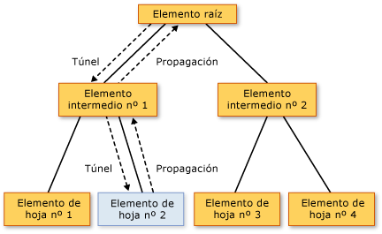

# Información general sobre eventos enrutados
En este tema se describe el concepto de eventos enrutados en [!INCLUDE[TLA#tla_winclient](../../../../includes/tlasharptla-winclient-md.md)]. En el tema se define la terminología de los eventos enrutados, se describe cómo se enrutan a través de un árbol de elementos, se resume cómo controlar los eventos enrutados y se explica cómo crear sus propios eventos enrutados personalizados.
  
   
## Requisitos previos  
 En este tema se supone que tiene conocimientos básicos del [!INCLUDE[TLA#tla_clr](../../../../includes/tlasharptla-clr-md.md)] y de la programación orientada a objetos, así como de la noción de cómo se pueden conceptualizar como un árbol las relaciones entre los elementos de [!INCLUDE[TLA2#tla_winclient](../../../../includes/tla2sharptla-winclient-md.md)]. Para seguir los ejemplos de este tema, también debe comprender [!INCLUDE[TLA#tla_xaml](../../../../includes/tlasharptla-xaml-md.md)] y saber cómo escribir páginas o aplicaciones de [!INCLUDE[TLA2#tla_winclient](../../../../includes/tla2sharptla-winclient-md.md)] muy básicas. Para obtener más información, vea [Tutorial: Mi primera aplicación de escritorio de WPF](../getting-started/walkthrough-my-first-wpf-desktop-application.md) y [información general sobre XAML (WPF)](xaml-overview-wpf.md).  
  
   
## ¿Qué es un evento enrutado?  
 Los eventos enrutados se pueden considerar desde dos perspectivas: funcional y de implementación. Aquí se presentan ambas definiciones, dado que algunas personas encuentran que una es más útil que la otra.  
  
 Definición funcional: Un evento enrutado es un tipo de evento que puede invocar controladores en varios agentes de escucha en un árbol de elementos, en lugar de simplemente en el objeto que provocó el evento.  
  
 Definición de implementación: Un evento enrutado es un [!INCLUDE[TLA2#tla_clr](../../../../includes/tla2sharptla-clr-md.md)] evento que está respaldado por una instancia de la <xref:System.Windows.RoutedEvent> clase y se procesa mediante el [!INCLUDE[TLA#tla_winclient](../../../../includes/tlasharptla-winclient-md.md)] sistema de eventos.  
  
 Una aplicación típica de [!INCLUDE[TLA2#tla_winclient](../../../../includes/tla2sharptla-winclient-md.md)] contiene muchos elementos. Tanto si se crean en código como si se declaran en [!INCLUDE[TLA2#tla_xaml](../../../../includes/tla2sharptla-xaml-md.md)], estos elementos se relacionan entre sí a través de un árbol de elementos. En función de la definición del evento, la ruta de eventos puede viajar en cualquiera de las dos direcciones, pero generalmente viaja desde el elemento de origen y, después, "se propaga" en sentido ascendente por el árbol de elementos hasta que llega a la raíz (normalmente una página o una ventana). Es posible que este concepto de propagación le resulte familiar si ha trabajado previamente con el modelo de objetos DHTML.  
  
 Considere el siguiente árbol de elementos simple:  
  
 [!code-xaml[EventOvwSupport#GroupButton](~/samples/snippets/csharp/VS_Snippets_Wpf/EventOvwSupport/CSharp/default.xaml#groupbutton)]  
  
 Este árbol de elementos genera algo parecido a lo siguiente:  
  
   
  
 En este árbol de elementos simplificado, el origen de un <xref:System.Windows.Controls.Primitives.ButtonBase.Click> evento es uno de los <xref:System.Windows.Controls.Button> elementos y lo que <xref:System.Windows.Controls.Button> se hizo clic es el primer elemento que tiene la oportunidad de controlar el evento. Pero si no hay ningún controlador asociado a la <xref:System.Windows.Controls.Button> actúa sobre el evento, a continuación, este se propagará hacia arriba a la <xref:System.Windows.Controls.Button> entidad primaria en el árbol de elementos, que es el <xref:System.Windows.Controls.StackPanel>. Potencialmente, el evento se propaga a <xref:System.Windows.Controls.Border>y, después, continúa en la raíz de la página del árbol de elementos (no mostrado).  
  
 En otras palabras, la ruta del evento para este <xref:System.Windows.Controls.Primitives.ButtonBase.Click> evento es:  
  
 Botón-->StackPanel-->Borde-->...  
  
### Escenarios de nivel superior para los eventos enrutados  
 A continuación se muestra un breve resumen de los escenarios que han motivado el concepto de evento enrutado y por qué un evento [!INCLUDE[TLA2#tla_clr](../../../../includes/tla2sharptla-clr-md.md)] típico no resultaba adecuado para estos escenarios:  
  
 **Encapsulación y composición de control:** Varios controles en [!INCLUDE[TLA2#tla_winclient](../../../../includes/tla2sharptla-winclient-md.md)] tiene un modelo de contenido enriquecido. Por ejemplo, puede colocar una imagen dentro de un <xref:System.Windows.Controls.Button>, que amplía de manera eficaz el árbol visual del botón. Sin embargo, la imagen agregada no debe interrumpir el comportamiento de la prueba de posicionamiento que hace que un botón responder a un <xref:System.Windows.Controls.Primitives.ButtonBase.Click> de su contenido, incluso si el usuario hace clic en píxeles que técnicamente forman parte de la imagen.  
  
 **Puntos de conexión de controladores únicos:** En [!INCLUDE[TLA#tla_winforms](../../../../includes/tlasharptla-winforms-md.md)], tendría que conectar el mismo controlador varias veces para procesar los eventos que podrían desencadenarse desde varios elementos. Los eventos enrutados le permiten asociar ese controlador una sola vez, tal como se ha mostrado en el ejemplo anterior, y usar la lógica del controlador para determinar el origen del evento si fuera necesario. Por ejemplo, este podría ser el controlador para el [!INCLUDE[TLA2#tla_xaml](../../../../includes/tla2sharptla-xaml-md.md)] mostrado anteriormente:  
  
 [!code-csharp[EventOvwSupport#GroupButtonCodeBehind](~/samples/snippets/csharp/VS_Snippets_Wpf/EventOvwSupport/CSharp/default.xaml.cs#groupbuttoncodebehind)]
 [!code-vb[EventOvwSupport#GroupButtonCodeBehind](~/samples/snippets/visualbasic/VS_Snippets_Wpf/EventOvwSupport/visualbasic/default.xaml.vb#groupbuttoncodebehind)]  
  
 **Control de clases:** Enrutar eventos permitir un controlador estático definido por la clase. Este controlador de clase tiene la oportunidad de controlar un evento antes de que pueda hacerlo cualquiera de los controladores de instancia asociados.  
  
 **Hacer referencia a un evento sin reflexión:** Determinadas técnicas de código y marcado requieren una manera de identificar un evento concreto. Un evento enrutado crea un <xref:System.Windows.RoutedEvent> campo como un identificador, que proporciona una técnica de identificación de evento sólidas que no requiere la reflexión estática o en tiempo de ejecución.  
  
### Cómo se implementan los eventos enrutados  
 Un evento enrutado es un [!INCLUDE[TLA2#tla_clr](../../../../includes/tla2sharptla-clr-md.md)] evento que está respaldado por una instancia de la <xref:System.Windows.RoutedEvent> clase y ha registrado con el [!INCLUDE[TLA2#tla_winclient](../../../../includes/tla2sharptla-winclient-md.md)] sistema de eventos. El <xref:System.Windows.RoutedEvent> instancia obtenida del registro normalmente se retiene como un `public` `static` `readonly` miembro del campo de la clase que registra y, por tanto, "posee" el evento enrutado. La conexión con el evento de [!INCLUDE[TLA2#tla_clr](../../../../includes/tla2sharptla-clr-md.md)] del mismo nombre (que a veces se denomina el evento "contenedor") se logra reemplazando las implementaciones `add` y `remove` para el evento de [!INCLUDE[TLA2#tla_clr](../../../../includes/tla2sharptla-clr-md.md)]. Normalmente, `add` y `remove` se dejan como un valor predeterminado implícito que usa la sintaxis de eventos específica del lenguaje adecuada para agregar y quitar controladores de ese evento. El mecanismo de conexión y de respaldo de eventos enrutados es conceptualmente similar a cómo una propiedad de dependencia es un [!INCLUDE[TLA2#tla_clr](../../../../includes/tla2sharptla-clr-md.md)] propiedad respaldada por la <xref:System.Windows.DependencyProperty> clase y ha registrado con el [!INCLUDE[TLA2#tla_winclient](../../../../includes/tla2sharptla-winclient-md.md)] sistema de propiedades.  
  
 En el ejemplo siguiente se muestra la declaración de un personalizado `Tap` eventos enrutados, incluidos el registro y la exposición de la <xref:System.Windows.RoutedEvent> campo de identificador y el `add` y `remove` implementaciones para el `Tap` [!INCLUDE[TLA2#tla_clr](../../../../includes/tla2sharptla-clr-md.md)] eventos.  
  
 [!code-csharp[RoutedEventCustom#AddRemoveHandler](~/samples/snippets/csharp/VS_Snippets_Wpf/RoutedEventCustom/CSharp/SDKSampleLibrary/class1.cs#addremovehandler)]
 [!code-vb[RoutedEventCustom#AddRemoveHandler](~/samples/snippets/visualbasic/VS_Snippets_Wpf/RoutedEventCustom/VB/SDKSampleLibrary/Class1.vb#addremovehandler)]  
  
### Controladores de eventos enrutados y XAML  
 Para agregar un controlador para un evento mediante [!INCLUDE[TLA2#tla_xaml](../../../../includes/tla2sharptla-xaml-md.md)], declare el nombre del evento como un atributo en el elemento que actúa como agente de escucha de eventos. El valor del atributo es el nombre de su método de controlador implementado, que debe existir en la clase parcial del archivo de código subyacente.  
  
 [!code-xaml[EventOvwSupport#SimplestSyntax](~/samples/snippets/csharp/VS_Snippets_Wpf/EventOvwSupport/CSharp/default.xaml#simplestsyntax)]  
  
 La sintaxis de [!INCLUDE[TLA2#tla_xaml](../../../../includes/tla2sharptla-xaml-md.md)] para agregar controladores de eventos de [!INCLUDE[TLA2#tla_clr](../../../../includes/tla2sharptla-clr-md.md)] estándar es la misma que la que se usa para agregar controladores de eventos enrutados, porque realmente se están agregando controladores al contenedor de eventos de [!INCLUDE[TLA2#tla_clr](../../../../includes/tla2sharptla-clr-md.md)], que se basa en una implementación de eventos enrutados. Para más información sobre cómo agregar controladores de eventos en [!INCLUDE[TLA2#tla_xaml](../../../../includes/tla2sharptla-xaml-md.md)], vea [Información general sobre XAML (WPF)](xaml-overview-wpf.md).  
  
   
## Estrategias de enrutamiento  
 Los eventos enrutados usan una de estas tres estrategias de enrutamiento:  
  
-   **Propagación:** Se invocan los controladores de eventos en el origen del evento. Después, el evento enrutado va pasando por los elementos primarios sucesivos hasta alcanzar la raíz del árbol de elementos. La mayoría de los eventos enrutados usan la estrategia del enrutamiento de propagación. Los eventos con enrutamiento de propagación generalmente se usan para informar sobre cambios de entrada o de estado procedentes de controles distintos u otros elementos de la interfaz de usuario.  
  
-   **Directo:** Solo el propio elemento de origen tiene la oportunidad de invocar controladores como respuesta. Esto es análogo al "enrutamiento" que usa [!INCLUDE[TLA#tla_winforms](../../../../includes/tlasharptla-winforms-md.md)] para los eventos. Sin embargo, a diferencia de un estándar [!INCLUDE[TLA2#tla_clr](../../../../includes/tla2sharptla-clr-md.md)] eventos, dirigir los eventos enrutados admiten control de clases (control de clases se explica en una sección posterior) y puede usarse por <xref:System.Windows.EventSetter> y <xref:System.Windows.EventTrigger>.  
  
-   **Túnel:** Inicialmente, se invocan los controladores de eventos en la raíz del árbol de elementos. Después, el evento enrutado viaja a través de los elementos secundarios sucesivos a lo largo de la ruta, hacia el elemento de nodo que es el origen del evento enrutado (el elemento que ha desencadenado el evento enrutado). Los eventos con enrutamiento de tunelización se suelen usar o controlar como parte de la composición de un control, de forma que los eventos de las partes compuestas se puedan suprimir o reemplazar deliberadamente por eventos que son específicos del control completo. Los eventos de entrada proporcionados en [!INCLUDE[TLA2#tla_winclient](../../../../includes/tla2sharptla-winclient-md.md)] se suelen implementar como un par de tunelización-propagación. Los eventos de tunelización también se conocen a veces como eventos de vista previa, debido a una convención de nomenclatura que se usa para los pares.  
  
   
## ¿Por qué usar eventos enrutados?  
 Como desarrollador de aplicaciones, no siempre necesita saber ni preocuparse de si el evento que está controlando se implementa como un evento enrutado. Los eventos enrutados tienen un comportamiento especial, pero ese comportamiento es prácticamente invisible si está controlando un evento en el elemento donde se desencadena.  
  
 Los eventos enrutados demuestran su eficacia cuando se usa cualquiera de los escenarios sugeridos: definir los controladores comunes en una raíz común, componer un control personalizado o definir una clase de controles personalizada.  
  
 Los agentes de escucha y los orígenes de los eventos enrutados no necesitan compartir un evento común en su jerarquía. Cualquier <xref:System.Windows.UIElement> o <xref:System.Windows.ContentElement> puede ser un agente de escucha de eventos para cualquier evento enrutado. Por tanto, se puede usar todo el conjunto de eventos enrutados disponibles en la [!INCLUDE[TLA2#tla_api](../../../../includes/tla2sharptla-api-md.md)] activa como una "interfaz" conceptual en la que elementos dispares de la aplicación pueden intercambiar información sobre los eventos. Este concepto de "interfaz" para los eventos enrutados es especialmente aplicable a los eventos de entrada.  
  
 Los eventos enrutados también se pueden usar para comunicar datos a través del árbol de elementos, porque los datos de evento para cada evento se perpetúan en cada elemento de la ruta. Un elemento podría cambiar algo en los datos del evento, y ese cambio estaría disponible para el elemento siguiente de la ruta.  
  
 Aparte del aspecto del enrutamiento, hay otros dos motivos por los que cualquier evento de [!INCLUDE[TLA2#tla_winclient](../../../../includes/tla2sharptla-winclient-md.md)] se podría implementar como un evento enrutado en lugar de un evento [!INCLUDE[TLA2#tla_clr](../../../../includes/tla2sharptla-clr-md.md)] estándar. Si está implementando sus propios eventos, también podría considerar estos principios:  
  
-   Ciertos [!INCLUDE[TLA2#tla_winclient](../../../../includes/tla2sharptla-winclient-md.md)] otras características, como aplicar estilos y plantillas <xref:System.Windows.EventSetter> y <xref:System.Windows.EventTrigger> requieren el evento que se hace referencia sea un evento enrutado. Este es el escenario del identificador de eventos mencionado anteriormente.  
  
-   Los eventos enrutados admiten un mecanismo de control de clases en el que la clase puede especificar métodos estáticos que tienen la oportunidad de controlar eventos enrutados antes de que cualquier controlador de instancias registrado tenga acceso a ellos. Esto es muy útil en el diseño de controles, porque una clase puede exigir comportamientos de clase orientados a eventos que no se puedan suprimir accidentalmente controlando un evento en una instancia.  
  
 Cada una de las consideraciones anteriores se explica en una sección independiente de este tema.  
  
   
## Agregar e implementar un controlador de eventos para un evento enrutado  
 Para agregar un controlador de eventos en [!INCLUDE[TLA2#tla_xaml](../../../../includes/tla2sharptla-xaml-md.md)], simplemente agregue el nombre del evento a un elemento como un atributo y establezca el valor del atributo como el nombre del controlador de eventos que implementa un delegado adecuado, como en el ejemplo siguiente.  
  
 [!code-xaml[EventOvwSupport#SimplestSyntax](~/samples/snippets/csharp/VS_Snippets_Wpf/EventOvwSupport/CSharp/default.xaml#simplestsyntax)]  
  
 `b1SetColor` es el nombre del controlador implementado que contiene el código que controla la <xref:System.Windows.Controls.Primitives.ButtonBase.Click> eventos. `b1SetColor` debe tener la misma firma que el <xref:System.Windows.RoutedEventHandler> delegado, que es el delegado de controlador de eventos para el <xref:System.Windows.Controls.Primitives.ButtonBase.Click> eventos. El primer parámetro de todos los delegados de controlador de eventos enrutados especifica el elemento al que se agrega el controlador de eventos y el segundo parámetro especifica los datos para el evento.  
  
[!code-csharp[EventOvwSupport#SimpleHandlerA](~/samples/snippets/csharp/VS_Snippets_Wpf/EventOvwSupport/CSharp/default.xaml.cs#simplehandlera)]
[!code-vb[EventOvwSupport#SimpleHandlerA](~/samples/snippets/visualbasic/VS_Snippets_Wpf/EventOvwSupport/visualbasic/default.xaml.vb#simplehandlera)]  
  
 <xref:System.Windows.RoutedEventHandler> es el delegado de controlador de eventos enrutados básico. Para los eventos enrutados especializados para ciertos controles o escenarios, los delegados que deben usarse para los controladores de eventos enrutados también podrían volverse más especializados, de forma que puedan transmitir datos de evento especializados. Por ejemplo, en un escenario de entrada común, podría controlar un <xref:System.Windows.UIElement.DragEnter> evento enrutado. Su controlador debería implementar el <xref:System.Windows.DragEventHandler> delegar. Utilizando el delegado más concreto, puede procesar el <xref:System.Windows.DragEventArgs> en el controlador y leer el <xref:System.Windows.DragEventArgs.Data%2A> propiedad, que contiene la carga del Portapapeles de la operación de arrastre.  
  
 Para obtener un ejemplo completo de cómo agregar un controlador de eventos a un elemento mediante [!INCLUDE[TLA2#tla_xaml](../../../../includes/tla2sharptla-xaml-md.md)], vea [Cómo: Controlar un evento enrutado](how-to-handle-a-routed-event.md).  
  
 Resulta sencillo agregar un controlador para un evento enrutado en una aplicación que se crea en el código. Controladores de eventos enrutados siempre se pueden agregar a través de un método auxiliar <xref:System.Windows.UIElement.AddHandler%2A> (que es el mismo método que llama el respaldo existente para `add`.) Pero los eventos enrutados existentes de [!INCLUDE[TLA2#tla_winclient](../../../../includes/tla2sharptla-winclient-md.md)] generalmente tienen implementaciones de respaldo de lógica `add` y `remove` que permiten agregar los controladores para eventos enrutados mediante una sintaxis de eventos específica del lenguaje, que es una sintaxis más intuitiva que el método del asistente. A continuación se muestra un ejemplo de uso del método del asistente:  
  
 [!code-csharp[EventOvwSupport#AddHandlerCode](~/samples/snippets/csharp/VS_Snippets_Wpf/EventOvwSupport/CSharp/default.xaml.cs#addhandlercode)]
 [!code-vb[EventOvwSupport#AddHandlerCode](~/samples/snippets/visualbasic/VS_Snippets_Wpf/EventOvwSupport/visualbasic/default.xaml.vb#addhandlercode)]  
  
 El ejemplo siguiente se muestra el C# sintaxis del operador (Visual Basic tiene sintaxis de operador ligeramente diferente debido a controla la desreferenciación):  
  
 [!code-csharp[EventOvwSupport#AddHandlerPlusEquals](~/samples/snippets/csharp/VS_Snippets_Wpf/EventOvwSupport/CSharp/default.xaml.cs#addhandlerplusequals)]
 [!code-vb[EventOvwSupport#AddHandlerPlusEquals](~/samples/snippets/visualbasic/VS_Snippets_Wpf/EventOvwSupport/visualbasic/default.xaml.vb#addhandlerplusequals)]  
  
 Para obtener un ejemplo de cómo agregar un controlador de eventos en el código, vea [Agregar un controlador de eventos mediante código](how-to-add-an-event-handler-using-code.md).  
  
 Si utiliza Visual Basic, también puede usar el `Handles` palabra clave para agregar controladores como parte de las declaraciones del controlador. Para más información, vea [Control de eventos en Visual Basic y WPF](visual-basic-and-wpf-event-handling.md).  
  
   
### El concepto de controlado  
 Todos los eventos enrutados comparten una evento datos clase base común, <xref:System.Windows.RoutedEventArgs>. <xref:System.Windows.RoutedEventArgs> define el <xref:System.Windows.RoutedEventArgs.Handled%2A> propiedad, que toma un valor booleano. El propósito de la <xref:System.Windows.RoutedEventArgs.Handled%2A> es permitir que cualquier controlador de eventos a lo largo de la ruta Marque el evento enrutado como propiedad *controla*, estableciendo el valor de <xref:System.Windows.RoutedEventArgs.Handled%2A> a `true`. Una vez procesados por el controlador de un elemento a lo largo de la ruta, se informa de nuevo sobre los datos de evento compartidos a cada agente de escucha a lo largo de la ruta.  
  
 El valor de <xref:System.Windows.RoutedEventArgs.Handled%2A> afecta a cómo se notifica un evento enrutado o se procesan mientras viajan más a lo largo de la ruta. Si <xref:System.Windows.RoutedEventArgs.Handled%2A> es `true` en el evento datos para un evento enrutado y, a continuación, los controladores que realizan escuchas para ese evento enrutado en otros elementos están generalmente ya no se invoca para esa instancia concreta del evento. Esto se cumple tanto para los controladores adjuntos en [!INCLUDE[TLA2#tla_xaml](../../../../includes/tla2sharptla-xaml-md.md)] como para los controladores agregados mediante sintaxis de adjuntar controladores de eventos específicas del lenguaje como `+=` o `Handles`. Para escenarios más comunes de controlador, al marcar un evento como controlado estableciendo <xref:System.Windows.RoutedEventArgs.Handled%2A> a `true` se "detendrá" el enrutamiento para una ruta de tunelización o una ruta de propagación y también para cualquier evento que se controla en un punto de la ruta mediante un controlador de clase.  
  
 Sin embargo, hay un mecanismo "handledEventsToo" mediante el cual los agentes de escucha pueden seguir ejecutando controladores en respuesta a eventos enrutados donde <xref:System.Windows.RoutedEventArgs.Handled%2A> es `true` en los datos del evento. Es decir, la ruta de eventos no se detiene realmente al marcar los datos de evento como controlados. Solo puede usar el mecanismo handledEventsToo en código o en un <xref:System.Windows.EventSetter>:  
  
-   En el código, en lugar de usar una sintaxis de eventos específica del lenguaje que funciona para general [!INCLUDE[TLA2#tla_clr](../../../../includes/tla2sharptla-clr-md.md)] eventos, llamar a la [!INCLUDE[TLA2#tla_winclient](../../../../includes/tla2sharptla-winclient-md.md)] método <xref:System.Windows.UIElement.AddHandler%28System.Windows.RoutedEvent%2CSystem.Delegate%2CSystem.Boolean%29> para agregar el controlador. Especifique el valor de `handledEventsToo` como `true`.  
  
-   En un <xref:System.Windows.EventSetter>, establezca el <xref:System.Windows.EventSetter.HandledEventsToo%2A> atributo sea `true`.  
  
 Además del comportamiento que <xref:System.Windows.RoutedEventArgs.Handled%2A> genera el estado de los eventos enrutados, el concepto de <xref:System.Windows.RoutedEventArgs.Handled%2A> tiene implicaciones en cómo debe diseñar la aplicación y escribir el código de controlador de eventos. Puede conceptuar <xref:System.Windows.RoutedEventArgs.Handled%2A> como un protocolo simple que expone los eventos enrutados. Exactamente cómo usar este protocolo es hasta, pero el diseño conceptual de cómo el valor de <xref:System.Windows.RoutedEventArgs.Handled%2A> está pensado para utilizarse es como sigue:  
  
-   Si un evento enrutado está marcado como controlado, no es necesario que los demás elementos a lo largo de esa ruta lo controlen de nuevo.  
  
-   Si un evento enrutado no está marcado como controlado, otros agentes de escucha situados anteriormente a lo largo de la ruta han decidido no registrar un controlador o los controladores registrados han decidido no para manipular los datos de eventos y establecer <xref:System.Windows.RoutedEventArgs.Handled%2A> a `true`. (O bien, es posible que el agente de escucha actual sea el primer punto de la ruta). Ahora los controladores del agente de escucha actual tienen tres posibles líneas de acción:  
  
    -   No realizar ninguna acción; el evento sigue estando sin controlar y se enruta al agente de escucha siguiente.  
  
    -   Ejecutar código en respuesta al evento, pero tomar la determinación de que la acción realizada no ha sido lo suficientemente sustancial como para marcar el evento como controlado. El evento se enruta al agente de escucha siguiente.  
  
    -   Ejecutar código en respuesta al evento. Marcar el evento como controlado en los datos de evento pasados al controlador, porque la acción realizada se ha considerado lo suficientemente sustancial como para marcarlo como controlado. El evento se enruta al agente de escucha siguiente, pero con <xref:System.Windows.RoutedEventArgs.Handled%2A> = `true` en sus datos de evento, por lo que solo `handledEventsToo` los agentes de escucha tienen la oportunidad de invocar más controladores.  
  
 El comportamiento de enrutamiento se ha mencionado anteriormente refuerza este diseño conceptual: es más difícil (aunque todavía posible mediante código o estilos) asociar controladores para eventos enrutados que se invocan incluso si un controlador a lo largo de la ruta anterior ya estableció <xref:System.Windows.RoutedEventArgs.Handled%2A>a `true`.  
  
 Para obtener más información acerca de <xref:System.Windows.RoutedEventArgs.Handled%2A>, control de clases de eventos enrutados y recomendaciones sobre cuándo es adecuado para marcar un evento enrutado como <xref:System.Windows.RoutedEventArgs.Handled%2A>, consulte [Marcar eventos enrutados como controlados y control de clases](marking-routed-events-as-handled-and-class-handling.md).  
  
 En las aplicaciones, es bastante habitual controlar un evento enrutado de propagación solamente en el objeto que lo ha desencadenado, y no preocuparse en absoluto por las características de enrutado del evento. Pero es una buena práctica marcar el evento enrutado como controlado en los datos de evento para evitar efectos secundarios imprevistos en caso de que un elemento situado más arriba en el árbol de elementos también tenga un controlador asociado para ese mismo evento enrutado.  
  
   
## Controladores de clase  
 Si va a definir una clase que deriva de alguna manera de <xref:System.Windows.DependencyObject>, también puede definir y adjuntar un controlador de clase para un evento enrutado que forme parte de la clase de evento declarado o heredado. Los controladores de clase se invocan antes que cualquier controlador de agente de escucha de instancia que esté asociado a una instancia de esa clase, cada vez que un evento enrutado alcanza una instancia de elemento en su ruta.  
  
 Algunos controles de [!INCLUDE[TLA2#tla_winclient](../../../../includes/tla2sharptla-winclient-md.md)] tienen el control de clase inherente para ciertos eventos enrutados. Esto podría dar la impresión de que el evento enrutado nunca se genera, pero en realidad está sujeto al control de clase y sus controladores de instancia todavía pueden controlar el evento enrutado si emplea ciertas técnicas. Además, muchas clases y controles base exponen métodos virtuales que se pueden usar para invalidar el comportamiento del control de clase. Para más información sobre cómo evitar el control de clase no deseado y cómo definir su propio control de clase en una clase personalizada, vea [Marcar eventos enrutados como controlados y control de clases](marking-routed-events-as-handled-and-class-handling.md).  
  
   
## Evento adjuntos en WPF  
 El lenguaje [!INCLUDE[TLA2#tla_xaml](../../../../includes/tla2sharptla-xaml-md.md)] también define un tipo especial de evento denominado *evento adjunto*. Un evento adjunto permite agregar un controlador para un evento determinado a un elemento arbitrario. No es necesario que el elemento que controla el evento defina o herede el evento adjunto, y ni el objeto que genera potencialmente el evento ni la instancia que controla el destino deben definir o ser "propietarios" de ese evento como miembro de clase.  
  
 El sistema de entrada de [!INCLUDE[TLA2#tla_winclient](../../../../includes/tla2sharptla-winclient-md.md)] emplea mucho los eventos adjuntos. Pero casi todos estos eventos adjuntos se reenvían a través de elementos base. Los eventos de entrada aparecen como eventos enrutados no adjuntos equivalentes que son miembros de la clase de elemento base. Por ejemplo, subyacente evento adjunto <xref:System.Windows.Input.Mouse.MouseDown?displayProperty=nameWithType> más fácilmente se pueden controlar en cualquier <xref:System.Windows.UIElement> utilizando <xref:System.Windows.UIElement.MouseDown> en que <xref:System.Windows.UIElement> en lugar de tratar con la sintaxis del evento adjunto, ya sea en [!INCLUDE[TLA2#tla_xaml](../../../../includes/tla2sharptla-xaml-md.md)] o código.  
  
 Para más información sobre los eventos adjuntos en [!INCLUDE[TLA2#tla_winclient](../../../../includes/tla2sharptla-winclient-md.md)], vea [Información general sobre eventos adjuntos](attached-events-overview.md).  
  
   
## Nombres de evento completos en XAML  
 Otro uso de una sintaxis similar a la sintaxis de eventos adjuntos *nombreDeTipo*.*nombreDeEvento* pero que no es en sentido estricto un uso de eventos adjuntos se produce al adjuntar controladores para eventos enrutados que son desencadenados por elementos secundarios. Los controladores se adjuntan a un elemento primario común, para aprovecharse del enrutamiento de eventos, aunque el evento enrutado pertinente no sea miembro del elemento primario común. Considere este ejemplo de nuevo:  
  
 [!code-xaml[EventOvwSupport#GroupButton](~/samples/snippets/csharp/VS_Snippets_Wpf/EventOvwSupport/CSharp/default.xaml#groupbutton)]  
  
 En este caso, el agente de escucha del elemento primario donde se agrega el controlador es un <xref:System.Windows.Controls.StackPanel>. Sin embargo, está agregando un controlador para un evento enrutado que se ha declarado y desencadenará la <xref:System.Windows.Controls.Button> clase (<xref:System.Windows.Controls.Primitives.ButtonBase> en realidad, pero disponible para <xref:System.Windows.Controls.Button> mediante herencia). <xref:System.Windows.Controls.Button> "posee" el evento, pero los controladores de eventos enrutados del sistema permite cualquier evento enrutado que se va a asociarse a cualquier <xref:System.Windows.UIElement> o <xref:System.Windows.ContentElement> agente de escucha de instancia que en caso contrario, se puede asociar agentes de escucha para un [!INCLUDE[TLA#tla_clr](../../../../includes/tlasharptla-clr-md.md)] eventos. El espacio de nombres xmlns predeterminado para estos nombres de atributo de evento calificados suele ser el espacio de nombres xmlns de [!INCLUDE[TLA2#tla_winclient](../../../../includes/tla2sharptla-winclient-md.md)] predeterminado, pero también se pueden especificar espacios de nombres con prefijos para los eventos enrutados personalizados. Para más información sobre xmlns, vea [Espacios de nombres y asignación de espacios de nombres XAML para WPF](xaml-namespaces-and-namespace-mapping-for-wpf-xaml.md).  
  
   
## Eventos de entrada de WPF  
 En la plataforma [!INCLUDE[TLA2#tla_winclient](../../../../includes/tla2sharptla-winclient-md.md)], con frecuencia se emplean los eventos enrutados como eventos de entrada. En [!INCLUDE[TLA2#tla_winclient](../../../../includes/tla2sharptla-winclient-md.md)], a los nombres de los eventos enrutados con tunelización se les antepone la palabra "Preview" por convención. Los eventos de entrada suelen presentarse en parejas, donde uno es el evento de propagación y el otro es el evento de tunelización. Por ejemplo, el <xref:System.Windows.ContentElement.KeyDown> eventos y el <xref:System.Windows.ContentElement.PreviewKeyDown> eventos tienen la misma firma, el primero es el evento de entrada de propagación y el último es la tunelización de evento de entrada. En ocasiones, los eventos de entrada solo tienen una versión de propagación o quizás solo una versión enrutada directa. En la documentación, los temas sobre eventos enrutados contienen referencias cruzadas a los temas relativos a los eventos enrutados similares con estrategias de enrutamiento alternativas, si existen dichos eventos enrutados, y las secciones de las páginas de referencia administradas clarifican la estrategia de enrutamiento de cada evento enrutado.  
  
 [!INCLUDE[TLA2#tla_winclient](../../../../includes/tla2sharptla-winclient-md.md)] eventos de entrada que se presentan en parejas se implementan para que una acción del usuario solo de entrada, como presionar un botón del mouse, producirá dos eventos enrutados del par en secuencia. En primer lugar, se desencadena el evento de tunelización, que viaja por su ruta. Después se desencadena el evento de propagación y este viaja por su ruta. Los dos eventos comparten literalmente la misma instancia de datos de evento, porque la <xref:System.Windows.UIElement.RaiseEvent%2A> llamada al método en la clase de implementación que genera el evento de propagación realiza escuchas para los datos del evento desde el evento de tunelización y los reutiliza en el nuevo evento generado. Los agentes de escucha con controladores para el evento de tunelización tienen la primera oportunidad de marcar el evento enrutado como controlado (en primer lugar los controladores de clase y después los controladores de instancia). Si un elemento a lo largo de la ruta de tunelización ha marcado el evento enrutado como controlado, los datos del evento ya controlado se envían para el evento de propagación y no se invocarán los controladores adjuntos típicos para los eventos de entrada de propagación equivalentes. Externamente dará la impresión de que el evento de propagación controlado ni siquiera se ha desencadenado. Este comportamiento de control es útil para la composición de controles, donde podría ser conveniente que fuera el control final y no sus partes compuestas el que informara de todos los eventos de entrada basados en pruebas de posicionamiento o de los eventos de entrada basados en el foco. El elemento del control final está más próximo a la raíz en la composición y, por tanto, tiene la oportunidad de controlar desde la clase el evento de tunelización en primer lugar y posiblemente "reemplazar" dicho evento enrutado por un evento más específico del control, como parte del código que respalda la clase del control.  
  
 Para ilustrar cómo funciona el procesamiento de eventos de entrada, observe el ejemplo de evento de entrada siguiente. En la ilustración del árbol siguiente, `leaf element #2` es el origen de un evento `PreviewMouseDown` y, después, de un evento `MouseDown`.  
  
   
Propagación y tunelización de eventos de entrada  
  
 El orden de procesamiento de los eventos es el siguiente:  
  
1.  `PreviewMouseDown` (túnel) en el elemento raíz.  
  
2.  `PreviewMouseDown` (túnel) en el elemento intermedio #1.  
  
3.  `PreviewMouseDown` (túnel) en el elemento de origen #2.  
  
4.  `MouseDown` (propagación) en el elemento de origen #2.  
  
5.  `MouseDown` (propagación) en el elemento intermedio #1.  
  
6.  `MouseDown` (propagación) en el elemento raíz.  
  
 Un delegado de controlador de eventos enrutados proporciona referencias a dos objetos: el objeto que ha desencadenado el evento y el objeto en el que se ha invocado el controlador. El objeto en el que se ha invocado el controlador es el objeto sobre el que informa el parámetro `sender`. El objeto donde primero se generó el evento se notifica mediante el <xref:System.Windows.RoutedEventArgs.Source%2A> propiedad en los datos del evento. Un evento enrutado todavía se provoca y controlado por el mismo objeto, en cuyo caso `sender` y <xref:System.Windows.RoutedEventArgs.Source%2A> son idénticos (Esto es el caso con los pasos 3 y 4 lista del ejemplo de procesamiento de eventos).  
  
 Debido a la tunelización y propagación, los elementos principales reciben eventos de entrada donde el <xref:System.Windows.RoutedEventArgs.Source%2A> es uno de sus secundarios de elementos. Cuando es importante saber cuál es el elemento de origen, puede identificar el elemento de origen mediante el acceso a la <xref:System.Windows.RoutedEventArgs.Source%2A> propiedad.  
  
 Normalmente, cuando se marca el evento de entrada <xref:System.Windows.RoutedEventArgs.Handled%2A>, además no se invocan los controladores. Lo habitual es marcar los eventos de entrada como controlados en cuanto se invoca un controlador que se ocupa del control lógico específico de la aplicación relacionado con el significado del evento de entrada.  
  
 La excepción a esta instrucción general sobre <xref:System.Windows.RoutedEventArgs.Handled%2A> estado es de entrada de controladores de eventos que se registran para omitir deliberadamente <xref:System.Windows.RoutedEventArgs.Handled%2A> estado de los datos de evento todavía se invocarían a lo largo de cualquiera de las rutas. Para más información, vea [Eventos de vista previa](preview-events.md) o [Marcar eventos enrutados como controlados y control de clases](marking-routed-events-as-handled-and-class-handling.md).  
  
 El modelo de datos de evento compartido entre los eventos de tunelización y de propagación, y el desencadenamiento secuencial primero de los eventos de tunelización y después de los de propagación, no es un concepto que se cumpla de forma general para todos los eventos enrutados. Ese comportamiento se implementa específicamente según el modo en que los dispositivos de entrada de [!INCLUDE[TLA2#tla_winclient](../../../../includes/tla2sharptla-winclient-md.md)] deciden generar y conectar los pares de eventos de entrada. Implementar sus propios eventos de entrada es un escenario avanzado, pero también podría decidir seguir ese modelo para sus propios eventos de entrada.  
  
 Algunas clases eligen controlar ciertos eventos de entrada mediante clases, normalmente con la intención de volver a definir lo que significa un determinado evento de entrada controlado por el usuario dentro de ese control y de desencadenar un nuevo evento. Para más información, vea [Marcar eventos enrutados como controlados y control de clases](marking-routed-events-as-handled-and-class-handling.md).  
  
 Para más información sobre la entrada y cómo interactúa con los eventos en escenarios de aplicación típicos, vea [Información general sobre acciones del usuario](input-overview.md).  
  
   
## EventSetters y EventTriggers  
 En los estilos, puede incluir predeclarada [!INCLUDE[TLA2#tla_xaml](../../../../includes/tla2sharptla-xaml-md.md)] evento sintaxis en el marcado del control mediante el uso de un <xref:System.Windows.EventSetter>. Cuando se aplica el estilo, el controlador al que se hace referencia se agrega a la instancia que recibe el estilo. Puede declarar un <xref:System.Windows.EventSetter> solo para un evento enrutado. A continuación se muestra un ejemplo. Tenga en cuenta que el método `b1SetColor` al que se hace referencia aquí está en un archivo de código subyacente.  
  
 [!code-xaml[EventOvwSupport#XAML2](~/samples/snippets/csharp/VS_Snippets_Wpf/EventOvwSupport/CSharp/page2.xaml#xaml2)]  
  
 La ventaja que se obtiene aquí es que es probable que contienen una gran cantidad de otra información que puede aplicar a cualquier botón de la aplicación, el estilo y tener la <xref:System.Windows.EventSetter> formar parte de ese estilo promueve la reutilización de código incluso en el nivel de marcado. Además, un <xref:System.Windows.EventSetter> abstrae los nombres de método para los controladores un paso más allá el marcado de página y de aplicación general.  
  
 Otra sintaxis especializada que combina las características de animación y los eventos enrutadas de [!INCLUDE[TLA2#tla_winclient](../../../../includes/tla2sharptla-winclient-md.md)] es un <xref:System.Windows.EventTrigger>. Igual que con <xref:System.Windows.EventSetter>, solo los eventos enrutados se pueden usar para un <xref:System.Windows.EventTrigger>. Normalmente, un <xref:System.Windows.EventTrigger> se declara como parte de un estilo, pero un <xref:System.Windows.EventTrigger> también se pueden declarar en elementos de nivel de página como parte de la <xref:System.Windows.FrameworkElement.Triggers%2A> colección, o en un <xref:System.Windows.Controls.ControlTemplate>. Un <xref:System.Windows.EventTrigger> le permite especificar un <xref:System.Windows.Media.Animation.Storyboard> que se ejecuta siempre que un evento enrutado alcanza un elemento en su ruta que declara un <xref:System.Windows.EventTrigger> para ese evento. La ventaja de un <xref:System.Windows.EventTrigger> sobre simplemente controla el evento y hacer que inicie un guión gráfico existente es que un <xref:System.Windows.EventTrigger> proporciona un mejor control sobre el guión gráfico y su comportamiento en tiempo de ejecución. Para más información, vea [Cómo: Utilizar desencadenadores de eventos para controlar un guión gráfico después de su inicio](../graphics-multimedia/how-to-use-event-triggers-to-control-a-storyboard-after-it-starts.md).  
  
   
## Más información sobre los eventos enrutados  
 En este tema se explican principalmente los eventos enrutados desde la perspectiva de describir los conceptos básicos y proporcionar orientación sobre cómo y cuándo responder a los eventos enrutados que ya existen en los distintos elementos y controles base. Pero puede crear sus propios eventos enrutados en su clase personalizada junto con toda la compatibilidad necesaria, como clases y delegados de datos de evento especializados. El propietario del evento enrutado puede ser cualquier clase, pero deben ser producidola y controlando los eventos enrutados <xref:System.Windows.UIElement> o <xref:System.Windows.ContentElement> las clases derivadas para que sean útiles. Para más información sobre los eventos personalizados, vea [Crear un evento enrutado personalizado](how-to-create-a-custom-routed-event.md).  
  
## Vea también

- <xref:System.Windows.EventManager>
- <xref:System.Windows.RoutedEvent>
- <xref:System.Windows.RoutedEventArgs>
- [Marcar eventos enrutados como controlados y control de clases](marking-routed-events-as-handled-and-class-handling.md)
- [Información general sobre acciones del usuario](input-overview.md)
- [Información general sobre comandos](commanding-overview.md)
- [Propiedades de dependencia personalizadas](custom-dependency-properties.md)
- [Árboles en WPF](trees-in-wpf.md)
- [Modelos de evento débil](weak-event-patterns.md)
