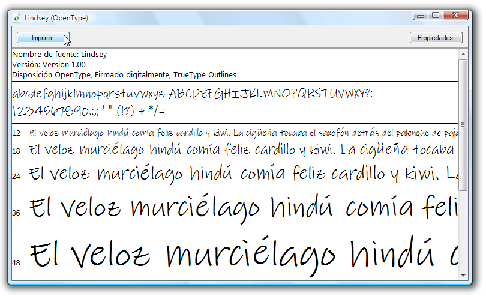

# Paquete de fuentes OpenType de ejemplo
En este tema se proporciona información general sobre las fuentes OpenType de ejemplo que se distribuyen con el Windows SDK. Las fuentes de ejemplo admiten características OpenType extendidas que pueden usar [!INCLUDE[TLA#tla_winclient](../../../../includes/tlasharptla-winclient-md.md)] aplicaciones.  

   
## Fuentes del paquete de fuentes OpenType  
 El Windows SDK proporciona un conjunto de fuentes OpenType de ejemplo que puede usar para crear aplicaciones de [!INCLUDE[TLA#tla_winclient](../../../../includes/tlasharptla-winclient-md.md)]. Las fuentes de ejemplo se proporcionan bajo licencia de Ascender Corporation. Estas fuentes solo implementan un subconjunto de las características totales definidas por el formato OpenType. En la tabla siguiente se enumeran los nombres de las fuentes OpenType de ejemplo.  
  
|**Nombre**|**Archivo**|  
|--------------|--------------|  
|Kootenay|Kooten.ttf|  
|Lindsey|Linds.ttf|  
|Miramonte|Miramo.ttf|  
|Miramonte Bold|Miramob.ttf|  
|Pericles|Peric.ttf|  
|Pericles Light|Pericl.ttf|  
|Pescadero|Pesca.ttf|  
|Pescadero Bold|Pescab.ttf|  
  
 En la ilustración siguiente se muestra el aspecto de las fuentes OpenType de ejemplo.  
  
   
  
 Las fuentes de ejemplo se proporcionan bajo licencia de Ascender Corporation. Ascender es un proveedor de productos de fuentes avanzados. Para asignar licencias extendidas o versiones personalizadas de las fuentes de ejemplo, vea el [sitio web de Ascender Corporation](https://www.monotype.com/).  
  
> [!NOTE]
> Como programador, es su responsabilidad asegurarse de disponer de los derechos de licencia necesarios para cualquier fuente que inserte en una aplicación o redistribuya de cualquier otro modo.  
  
   
## Instalación de las fuentes  
 Tiene la opción de instalar las fuentes OpenType de ejemplo en el directorio de fuentes de Windows predeterminado, **\Windows\Fonts**. Use el panel de control Fuentes para instalar las fuentes. Una vez que estas fuentes están en el equipo, son accesibles para todas las aplicaciones que hacen referencia a las fuentes predeterminadas de Windows. Puede mostrar un conjunto de caracteres representativo en varios tamaños de fuente haciendo doble clic en el archivo de fuente. En la captura de pantalla siguiente se muestra el archivo de la fuente Lindsey, Linds.ttf.  
  
   
Mostrar la fuente Lindsey  
  
   
## Uso de las fuentes  
 Hay dos maneras de usar fuentes en una aplicación. Se pueden agregar fuentes a la aplicación como elementos de contenido del proyecto que no están insertados como recursos dentro de un ensamblado. Como alternativa, se pueden agregar las fuentes a la aplicación como elementos de recursos del proyecto insertados dentro de los archivos de ensamblado de la aplicación. Para más información, vea [Empaquetar fuentes con aplicaciones](packaging-fonts-with-applications.md).  
  
## Consulte también

- <xref:System.Windows.Documents.Typography>
- [Características de las fuentes OpenType](opentype-font-features.md)
- [Empaquetar fuentes con aplicaciones](packaging-fonts-with-applications.md)
