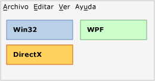
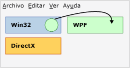
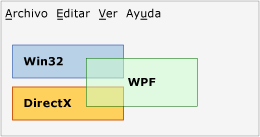
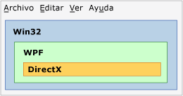
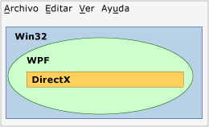

# Informaci&#243;n general sobre &#225;reas de la tecnolog&#237;a
Si se usan varias tecnologías de representación en una aplicación, como WPF, Win32 o DirectX, deben compartir las áreas de representación en una ventana común de nivel superior.  En este tema se describen los problemas que podrían afectar a la presentación y la entrada de una aplicación de interoperación WPF.  
  
## Regiones  
 Dentro de una ventana de nivel superior, puede interpretarse que cada HWND que incluye una de las tecnologías de una aplicación de interoperación tiene su propia región \(conocida también como "espacio aéreo"\).  Cada píxel de la ventana pertenece exactamente a un HWND, que constituye la región de ese HWND.  \(En realidad, hay más de una región de [!INCLUDE[TLA2#tla_winclient](../../../../includes/tla2sharptla-winclient-md.md)] si hay más de un HWND de [!INCLUDE[TLA2#tla_winclient](../../../../includes/tla2sharptla-winclient-md.md)], pero para los propósitos de este tutorial, puede suponer que solo hay una\).  La región implica que todas las capas u otras ventanas que intentan representarse sobre ese píxel durante la duración de la aplicación deben formar parte de la misma tecnología de nivel de representación.  Si se intenta representar píxeles de [!INCLUDE[TLA2#tla_winclient](../../../../includes/tla2sharptla-winclient-md.md)] sobre [!INCLUDE[TLA2#tla_win32](../../../../includes/tla2sharptla-win32-md.md)] da lugar a los resultados no deseados y se impide en la medida de lo posible mediante las [!INCLUDE[TLA2#tla_api#plural](../../../../includes/tla2sharptla-apisharpplural-md.md)] de interacción.  
  
### Ejemplos de región  
 En la siguiente ilustración se muestra una aplicación que mezcla [!INCLUDE[TLA2#tla_win32](../../../../includes/tla2sharptla-win32-md.md)], [!INCLUDE[TLA2#tla_dx](../../../../includes/tla2sharptla-dx-md.md)] y [!INCLUDE[TLA2#tla_winclient](../../../../includes/tla2sharptla-winclient-md.md)].  Cada tecnología utiliza su propio conjunto de píxeles independientes no superpuestos y no hay ningún problema con la región.  
  
   
  
 Supongamos que esta aplicación utiliza la posición del puntero del mouse para crear una animación que se intenta representar sobre cualquiera de estas tres regiones.  Independientemente de cuál fuese la tecnología responsable de la animación propiamente dicha, esa tecnología invadiría la región de las otras dos.  La ilustración siguiente muestra un intento de representar un círculo de WPF sobre una región de Win32.  
  
   
  
 Otra invasión consiste en intentar usar la transparencia\/mezcla alfa entre distintas tecnologías.  En la ilustración siguiente, el cuadro de [!INCLUDE[TLA2#tla_winclient](../../../../includes/tla2sharptla-winclient-md.md)] invade las regiones de [!INCLUDE[TLA2#tla_win32](../../../../includes/tla2sharptla-win32-md.md)] y [!INCLUDE[TLA2#tla_dx](../../../../includes/tla2sharptla-dx-md.md)].  Puesto que los píxeles de ese cuadro de [!INCLUDE[TLA2#tla_winclient](../../../../includes/tla2sharptla-winclient-md.md)] son semitransparentes, deberían ser propiedad conjuntamente de [!INCLUDE[TLA2#tla_dx](../../../../includes/tla2sharptla-dx-md.md)] y de [!INCLUDE[TLA2#tla_winclient](../../../../includes/tla2sharptla-winclient-md.md)], lo que no es posible.  Por lo tanto, es otra invasión y no se puede integrar.  
  
   
  
 En los tres ejemplos anteriores se utilizaban regiones rectangulares, pero es posible usar formas diferentes.  Por ejemplo, una región puede tener un hueco.  La siguiente ilustración muestra una región de [!INCLUDE[TLA2#tla_win32](../../../../includes/tla2sharptla-win32-md.md)] con un hueco rectangular del tamaño de las regiones de [!INCLUDE[TLA2#tla_winclient](../../../../includes/tla2sharptla-winclient-md.md)] y [!INCLUDE[TLA2#tla_dx](../../../../includes/tla2sharptla-dx-md.md)] combinadas.  
  
   
  
 Las regiones pueden adoptar cualquier forma no rectangular, o cualquier forma que pueda describirse mediante un HRGN de [!INCLUDE[TLA2#tla_win32](../../../../includes/tla2sharptla-win32-md.md)] \(región\).  
  
   
  
## Transparencia y ventanas de nivel superior  
 El administrador de ventanas de Windows procesa realmente sólo los HWND de [!INCLUDE[TLA2#tla_win32](../../../../includes/tla2sharptla-win32-md.md)].  Por consiguiente, cada <xref:System.Windows.Window> de [!INCLUDE[TLA2#tla_winclient](../../../../includes/tla2sharptla-winclient-md.md)] es un HWND.  El HWND <xref:System.Windows.Window> debe cumplir las reglas generales para todos los HWND.  Dentro de ese HWND, el código de [!INCLUDE[TLA2#tla_winclient](../../../../includes/tla2sharptla-winclient-md.md)] puede hacer cualquier cosa que admitan las [!INCLUDE[TLA2#tla_api#plural](../../../../includes/tla2sharptla-apisharpplural-md.md)] de [!INCLUDE[TLA2#tla_winclient](../../../../includes/tla2sharptla-winclient-md.md)] en general.  Pero para las interacciones con otros HWND en el escritorio, [!INCLUDE[TLA2#tla_winclient](../../../../includes/tla2sharptla-winclient-md.md)] debe cumplir las reglas de procesamiento y representación de [!INCLUDE[TLA2#tla_win32](../../../../includes/tla2sharptla-win32-md.md)].  [!INCLUDE[TLA2#tla_winclient](../../../../includes/tla2sharptla-winclient-md.md)] admite ventanas no rectangulares mediante [!INCLUDE[TLA2#tla_api#plural](../../../../includes/tla2sharptla-apisharpplural-md.md)] de [!INCLUDE[TLA2#tla_win32](../../../../includes/tla2sharptla-win32-md.md)]; HRGN para las ventanas no rectangulares y ventanas superpuestas para un alfa por píxel.  
  
 No se admiten los valores de alfa ni las claves de color constantes.  Las capacidades de las ventanas superpuestas de [!INCLUDE[TLA2#tla_win32](../../../../includes/tla2sharptla-win32-md.md)] varían según la plataforma.  
  
 Las ventanas superpuestas pueden hacer que la ventana completa sea translúcida \(semitransparente\) especificando un valor de alfa que se aplique a todos los píxeles de la ventana.  \(de hecho, [!INCLUDE[TLA2#tla_win32](../../../../includes/tla2sharptla-win32-md.md)] admite el valor alfa por píxel, pero se trata de algo muy complicado de utilizar en programas prácticos, porque en este modo debería dibujar manualmente cada HWND secundario, incluidos los cuadros de diálogo y los cuadros desplegables\).  
  
 [!INCLUDE[TLA2#tla_winclient](../../../../includes/tla2sharptla-winclient-md.md)] admite los HRGN; sin embargo, no hay [!INCLUDE[TLA2#tla_api#plural](../../../../includes/tla2sharptla-apisharpplural-md.md)] administradas para esta funcionalidad.  Puede utilizar la invocación de plataforma y <xref:System.Windows.Interop.HwndSource> para llamar a las [!INCLUDE[TLA2#tla_api#plural](../../../../includes/tla2sharptla-apisharpplural-md.md)] pertinentes de [!INCLUDE[TLA2#tla_win32](../../../../includes/tla2sharptla-win32-md.md)].  Para obtener más información, vea [Llamar a funciones nativas desde código administrado](../Topic/Calling%20Native%20Functions%20from%20Managed%20Code.md).  
  
 Las ventanas superpuestas [!INCLUDE[TLA2#tla_winclient](../../../../includes/tla2sharptla-winclient-md.md)] tienen una funcionalidad distinta según el sistema operativo.  Esto se debe a que [!INCLUDE[TLA2#tla_winclient](../../../../includes/tla2sharptla-winclient-md.md)] utiliza [!INCLUDE[TLA2#tla_dx](../../../../includes/tla2sharptla-dx-md.md)] para la representación y las ventanas superpuestas se diseñaron principalmente para la representación de [!INCLUDE[TLA2#tla_gdi](../../../../includes/tla2sharptla-gdi-md.md)], no la de [!INCLUDE[TLA2#tla_dx](../../../../includes/tla2sharptla-dx-md.md)].  
  
-   [!INCLUDE[TLA2#tla_winclient](../../../../includes/tla2sharptla-winclient-md.md)] admite ventanas superpuestas con aceleración de hardware en [!INCLUDE[TLA#tla_longhorn](../../../../includes/tlasharptla-longhorn-md.md)] y versiones posteriores.  Las ventanas superpuestas con aceleración de hardware de [!INCLUDE[TLA2#tla_winxp](../../../../includes/tla2sharptla-winxp-md.md)] requiere compatibilidad con [!INCLUDE[TLA#tla_dx](../../../../includes/tlasharptla-dx-md.md)], por lo que las funciones dependerán de la versión de [!INCLUDE[TLA#tla_dx](../../../../includes/tlasharptla-dx-md.md)] que haya en ese equipo.  
  
-   [!INCLUDE[TLA2#tla_winclient](../../../../includes/tla2sharptla-winclient-md.md)] no admite las claves de color de transparencia, porque [!INCLUDE[TLA2#tla_winclient](../../../../includes/tla2sharptla-winclient-md.md)] no puede garantizar que se represente exactamente el color que se ha solicitado, en particular cuando se aplica la aceleración de hardware a la representación.  
  
-   Si su aplicación se ejecuta en [!INCLUDE[TLA2#tla_winxp](../../../../includes/tla2sharptla-winxp-md.md)], las ventanas superpuestas situadas sobre superficies de [!INCLUDE[TLA2#tla_dx](../../../../includes/tla2sharptla-dx-md.md)] parpadean cuando se representa la aplicación de [!INCLUDE[TLA2#tla_dx](../../../../includes/tla2sharptla-dx-md.md)].  \(La secuencia de representación real consiste en que [!INCLUDE[TLA#tla_gdi](../../../../includes/tlasharptla-gdi-md.md)] oculta la ventana superpuesta, [!INCLUDE[TLA2#tla_dx](../../../../includes/tla2sharptla-dx-md.md)] dibuja y, a continuación, [!INCLUDE[TLA#tla_gdi](../../../../includes/tlasharptla-gdi-md.md)] vuelve a colocar la ventana superpuesta\).  Las ventanas superpuestas que no son de [!INCLUDE[TLA2#tla_winclient](../../../../includes/tla2sharptla-winclient-md.md)] también tienen esta limitación.  
  
## Vea también  
 [Interoperabilidad de WPF y Win32](../../../../docs/framework/wpf/advanced/wpf-and-win32-interoperation.md)   
 [Tutorial: Hospedar un reloj de WPF en Win32](../../../../docs/framework/wpf/advanced/walkthrough-hosting-a-wpf-clock-in-win32.md)   
 [Hospedar contenido de Win32 en WPF](../../../../docs/framework/wpf/advanced/hosting-win32-content-in-wpf.md)