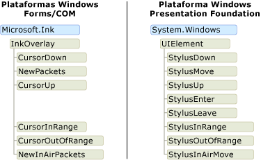
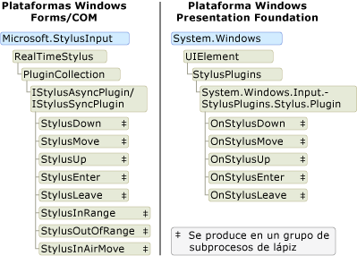

# Modelo de objetos de entrada manuscrita: COM y formularios Windows Forms frente a WPF

Esencialmente, hay tres plataformas que admiten la entrada de lápiz digital: la plataforma de Windows Forms de Tablet PC, la plataforma COM de Tablet PC y la plataforma de Windows Presentation Foundation (WPF).  Las plataformas Windows Forms y COM comparten un modelo de objetos similar, pero el modelo de objetos para la plataforma WPF es sustancialmente diferente.  En este tema se describen las diferencias en un alto nivel para que los desarrolladores que han trabajado con un modelo de objetos puedan comprender mejor el resto.  
  
## Habilitar la entrada de lápiz en una aplicación  
 Las tres plataformas incluyen objetos y controles que permiten a una aplicación recibir entradas de un lápiz de Tablet PC.  Las plataformas Windows Forms y COM se incluyen con las clases Microsoft. [Ink. InkPicture](https://docs.microsoft.com/previous-versions/dotnet/netframework-3.5/ms583740(v=vs.90)), [Microsoft. Ink. InkEdit](https://docs.microsoft.com/previous-versions/dotnet/netframework-3.5/ms552265(v=vs.90)), [Microsoft. Ink. InkOverlay](https://docs.microsoft.com/previous-versions/dotnet/netframework-3.5/ms552322(v=vs.90)) y [Microsoft. Ink. InkCollector](https://docs.microsoft.com/previous-versions/dotnet/netframework-3.5/ms583683(v=vs.90)) .  [Microsoft. Ink. InkPicture](https://docs.microsoft.com/previous-versions/dotnet/netframework-3.5/ms583740(v=vs.90)) y [Microsoft. Ink. InkEdit](https://docs.microsoft.com/previous-versions/dotnet/netframework-3.5/ms552265(v=vs.90)) son controles que se pueden agregar a una aplicación para recopilar entradas manuscritas.  [Microsoft. Ink. InkOverlay](https://docs.microsoft.com/previous-versions/dotnet/netframework-3.5/ms552322(v=vs.90)) y [Microsoft. Ink. InkCollector](https://docs.microsoft.com/previous-versions/dotnet/netframework-3.5/ms583683(v=vs.90)) se pueden adjuntar a una ventana existente para habilitar la entrada de lápiz de Windows y controles personalizados.  
  
 La plataforma WPF incluye el control <xref:System.Windows.Controls.InkCanvas>.  Puede Agregar un <xref:System.Windows.Controls.InkCanvas> a la aplicación y comenzar a recopilar la tinta inmediatamente. Con el <xref:System.Windows.Controls.InkCanvas>, el usuario puede copiar, seleccionar y cambiar el tamaño de la tinta.  Puede agregar otros controles al <xref:System.Windows.Controls.InkCanvas>y el usuario puede escribir también en ellos.  Puede crear un control personalizado con tinta habilitada agregando una <xref:System.Windows.Controls.InkPresenter> a él y recopilando sus puntos de lápiz.  
  
 En la tabla siguiente se muestra dónde obtener más información sobre la habilitación de la entrada de lápiz en una aplicación:  
  
|Para hacer esto...|En la plataforma WPF...|En las plataformas Windows Forms/COM...|  
|-----------------|--------------------------|------------------------------------------|  
|Agregar un control con tinta habilitada a una aplicación|Vea [Introducción con tinta](getting-started-with-ink.md).|Vea el [ejemplo de formulario de notificaciones automáticas](/windows/desktop/tablet/auto-claims-form-sample)|  
|Habilitar la entrada manuscrita en un control personalizado|Vea [crear un control de entrada manuscrita](creating-an-ink-input-control.md).|Vea [ejemplo de Portapapeles de lápiz](/windows/desktop/tablet/ink-clipboard-sample).|  
  
## Datos de tinta  
 En las plataformas Windows Forms y COM, [Microsoft. Ink. InkCollector](https://docs.microsoft.com/previous-versions/dotnet/netframework-3.5/ms583683(v=vs.90)), [Microsoft. Ink. InkOverlay](https://docs.microsoft.com/previous-versions/dotnet/netframework-3.5/ms552322(v=vs.90)), [Microsoft. Ink. InkEdit](https://docs.microsoft.com/previous-versions/dotnet/netframework-3.5/ms552265(v=vs.90))y [Microsoft. Ink. InkPicture](https://docs.microsoft.com/previous-versions/dotnet/netframework-3.5/ms583740(v=vs.90)) exponen un objeto [Microsoft. Ink. Ink](https://docs.microsoft.com/previous-versions/dotnet/netframework-3.5/ms583670(v=vs.90)) . El objeto [Microsoft. Ink. Ink](https://docs.microsoft.com/previous-versions/dotnet/netframework-3.5/ms583670(v=vs.90)) contiene los datos de uno o varios objetos [Microsoft. Ink. Stroke](https://docs.microsoft.com/previous-versions/dotnet/netframework-3.5/ms552692(v=vs.90)) y expone métodos y propiedades comunes para administrar y manipular esos trazos.  El objeto [Microsoft. Ink. Ink](https://docs.microsoft.com/previous-versions/dotnet/netframework-3.5/ms583670(v=vs.90)) administra la duración de los trazos que contiene; el objeto [Microsoft. Ink. Ink](https://docs.microsoft.com/previous-versions/dotnet/netframework-3.5/ms583670(v=vs.90)) crea y elimina los trazos que posee.  Cada [Microsoft. Ink. Stroke](https://docs.microsoft.com/previous-versions/dotnet/netframework-3.5/ms552692(v=vs.90)) tiene un identificador que es único dentro de su objeto primario [Microsoft. Ink. Ink](https://docs.microsoft.com/previous-versions/dotnet/netframework-3.5/ms583670(v=vs.90)) .  
  
 En la plataforma WPF, la clase <xref:System.Windows.Ink.Stroke?displayProperty=nameWithType> posee y administra su propia duración. Un grupo de objetos <xref:System.Windows.Ink.Stroke> se puede recopilar en un <xref:System.Windows.Ink.StrokeCollection>, que proporciona métodos para operaciones comunes de administración de datos de entrada de lápiz, como la prueba de posicionamiento, el borrado, la transformación y la serialización de la tinta. Un <xref:System.Windows.Ink.Stroke> puede pertenecer a cero, uno o varios objetos <xref:System.Windows.Ink.StrokeCollection> en cualquier momento.  En lugar de tener un objeto [Microsoft. Ink. Ink](https://docs.microsoft.com/previous-versions/dotnet/netframework-3.5/ms583670(v=vs.90)) , los <xref:System.Windows.Controls.InkCanvas> y <xref:System.Windows.Controls.InkPresenter> contienen un <xref:System.Windows.Ink.StrokeCollection?displayProperty=nameWithType>.  
  
 En el siguiente par de ilustraciones se comparan los modelos de objetos de datos de entrada manuscrita.  En las plataformas Windows Forms y COM, el objeto [Microsoft. Ink. Ink](https://docs.microsoft.com/previous-versions/dotnet/netframework-3.5/ms583670(v=vs.90)) restringe la duración de los objetos [Microsoft. Ink. Stroke](https://docs.microsoft.com/previous-versions/dotnet/netframework-3.5/ms552692(v=vs.90)) , y los paquetes de lápiz pertenecen a los trazos individuales.  Dos o más trazos pueden hacer referencia al mismo objeto [Microsoft. Ink. DrawingAttributes](https://docs.microsoft.com/previous-versions/dotnet/netframework-3.5/ms583636(v=vs.90)) , tal y como se muestra en la siguiente ilustración.  
  
   
  
 En el [!INCLUDE[TLA2#tla_winclient](../../../../includes/tla2sharptla-winclient-md.md)], cada <xref:System.Windows.Ink.Stroke?displayProperty=nameWithType> es un objeto Common Language Runtime que existe siempre que algo tenga una referencia a él.  Cada <xref:System.Windows.Ink.Stroke> hace referencia a un objeto <xref:System.Windows.Input.StylusPointCollection> y <xref:System.Windows.Ink.DrawingAttributes?displayProperty=nameWithType>, que también son objetos Common Language Runtime.  
  
   
  
 En la tabla siguiente se compara cómo realizar algunas tareas comunes en la plataforma WPF y en las plataformas Windows Forms y COM.  
  
|Tarea|Windows Presentation Foundation|Windows Forms y COM|  
|----------|-------------------------------------|---------------------------|  
|Guardar la entrada manuscrita|<xref:System.Windows.Ink.StrokeCollection.Save%2A>|[Microsoft. Ink. Ink. Save](https://docs.microsoft.com/previous-versions/dotnet/netframework-3.5/ms571335(v=vs.90))|  
|Cargar entrada de lápiz|Cree un <xref:System.Windows.Ink.StrokeCollection> con el constructor <xref:System.Windows.Ink.StrokeCollection.%23ctor%2A>.|[Microsoft. Ink. Ink. Load](https://docs.microsoft.com/previous-versions/dotnet/netframework-3.5/ms569609(v=vs.90))|  
|Prueba de posicionamiento|<xref:System.Windows.Ink.StrokeCollection.HitTest%2A>|[Microsoft. Ink. Ink. HitTest](https://docs.microsoft.com/previous-versions/dotnet/netframework-3.5/ms571330(v=vs.90))|  
|Copiar entrada manuscrita|<xref:System.Windows.Controls.InkCanvas.CopySelection%2A>|[Microsoft. Ink. Ink. ClipboardCopy](https://docs.microsoft.com/previous-versions/dotnet/netframework-3.5/ms571316(v=vs.90))|  
|Pegar entrada manuscrita|<xref:System.Windows.Controls.InkCanvas.Paste%2A>|[Microsoft. Ink. Ink. ClipboardPaste](https://docs.microsoft.com/previous-versions/dotnet/netframework-3.5/ms571318(v=vs.90))|  
|Obtener acceso a propiedades personalizadas en una colección de trazos|<xref:System.Windows.Ink.StrokeCollection.AddPropertyData%2A> (las propiedades se almacenan internamente y se obtiene acceso a ellas a través de <xref:System.Windows.Ink.StrokeCollection.AddPropertyData%2A>, <xref:System.Windows.Ink.StrokeCollection.RemovePropertyData%2A>y <xref:System.Windows.Ink.StrokeCollection.ContainsPropertyData%2A>)|Usar [Microsoft. Ink. Ink. ExtendedProperties](https://docs.microsoft.com/previous-versions/dotnet/netframework-3.5/ms582214(v=vs.90))|  
  
### Compartir la tinta entre plataformas  
 Aunque las plataformas tienen diferentes modelos de objetos para los datos de tinta, es muy fácil compartir los datos entre las plataformas. En los siguientes ejemplos se guarda la tinta de una aplicación Windows Forms y se carga la entrada manuscrita en una aplicación Windows Presentation Foundation.  
  
 [!code-csharp[WinFormWPFInk#UsingWinforms](~/samples/snippets/csharp/VS_Snippets_Wpf/WinformWPFInk/CSharp/Program.cs#usingwinforms)]
 [!code-vb[WinFormWPFInk#UsingWinforms](~/samples/snippets/visualbasic/VS_Snippets_Wpf/WinformWPFInk/VisualBasic/Module1.vb#usingwinforms)]  
[!code-csharp[WinFormWPFInk#SaveWinforms](~/samples/snippets/csharp/VS_Snippets_Wpf/WinformWPFInk/CSharp/Program.cs#savewinforms)]
[!code-vb[WinFormWPFInk#SaveWinforms](~/samples/snippets/visualbasic/VS_Snippets_Wpf/WinformWPFInk/VisualBasic/Module1.vb#savewinforms)]  
  
 [!code-csharp[WinFormWPFInk#UsingWPF](~/samples/snippets/csharp/VS_Snippets_Wpf/WinformWPFInk/CSharp/Program.cs#usingwpf)]
 [!code-vb[WinFormWPFInk#UsingWPF](~/samples/snippets/visualbasic/VS_Snippets_Wpf/WinformWPFInk/VisualBasic/Module1.vb#usingwpf)]  
[!code-csharp[WinFormWPFInk#LoadWPF](~/samples/snippets/csharp/VS_Snippets_Wpf/WinformWPFInk/CSharp/Program.cs#loadwpf)]
[!code-vb[WinFormWPFInk#LoadWPF](~/samples/snippets/visualbasic/VS_Snippets_Wpf/WinformWPFInk/VisualBasic/Module1.vb#loadwpf)]  
  
 En los siguientes ejemplos se guarda la tinta de una aplicación Windows Presentation Foundation y se carga la entrada manuscrita en una aplicación Windows Forms.  
  
 [!code-csharp[WinFormWPFInk#UsingWPF](~/samples/snippets/csharp/VS_Snippets_Wpf/WinformWPFInk/CSharp/Program.cs#usingwpf)]
 [!code-vb[WinFormWPFInk#UsingWPF](~/samples/snippets/visualbasic/VS_Snippets_Wpf/WinformWPFInk/VisualBasic/Module1.vb#usingwpf)]  
[!code-csharp[WinFormWPFInk#SaveWPF](~/samples/snippets/csharp/VS_Snippets_Wpf/WinformWPFInk/CSharp/Program.cs#savewpf)]
[!code-vb[WinFormWPFInk#SaveWPF](~/samples/snippets/visualbasic/VS_Snippets_Wpf/WinformWPFInk/VisualBasic/Module1.vb#savewpf)]  
  
 [!code-csharp[WinFormWPFInk#UsingWinforms](~/samples/snippets/csharp/VS_Snippets_Wpf/WinformWPFInk/CSharp/Program.cs#usingwinforms)]
 [!code-vb[WinFormWPFInk#UsingWinforms](~/samples/snippets/visualbasic/VS_Snippets_Wpf/WinformWPFInk/VisualBasic/Module1.vb#usingwinforms)]  
[!code-csharp[WinFormWPFInk#LoadWinforms](~/samples/snippets/csharp/VS_Snippets_Wpf/WinformWPFInk/CSharp/Program.cs#loadwinforms)]
[!code-vb[WinFormWPFInk#LoadWinforms](~/samples/snippets/visualbasic/VS_Snippets_Wpf/WinformWPFInk/VisualBasic/Module1.vb#loadwinforms)]
## Eventos del lápiz de Tablet PC  

 [Microsoft. Ink. InkOverlay](https://docs.microsoft.com/previous-versions/dotnet/netframework-3.5/ms552322(v=vs.90)), [Microsoft. Ink. InkCollector](https://docs.microsoft.com/previous-versions/dotnet/netframework-3.5/ms583683(v=vs.90))y [Microsoft. Ink. InkPicture](https://docs.microsoft.com/previous-versions/dotnet/netframework-3.5/ms583740(v=vs.90)) en las plataformas Windows Forms y com reciben eventos cuando el usuario introduce datos de plumilla. [Microsoft. Ink. InkOverlay](https://docs.microsoft.com/previous-versions/dotnet/netframework-3.5/ms552322(v=vs.90)) o [Microsoft. Ink. InkCollector](https://docs.microsoft.com/previous-versions/dotnet/netframework-3.5/ms583683(v=vs.90)) se adjunta a una ventana o un control, y puede suscribirse a los eventos generados por los datos de entrada de la tableta. El subproceso en el que se producen estos eventos depende de si los eventos se producen con un lápiz, un mouse o mediante programación. Para obtener más información sobre los subprocesos en relación con estos eventos, vea [consideraciones generales sobre subprocesos](/windows/desktop/tablet/general-threading-considerations) y subprocesos [en los que se puede activar un evento](/windows/desktop/tablet/threads-on-which-an-event-can-fire).  
  
 En la plataforma de Windows Presentation Foundation, la clase <xref:System.Windows.UIElement> tiene eventos para la entrada manuscrita. Esto significa que todos los controles exponen el conjunto completo de eventos del lápiz óptico.  Los eventos del lápiz óptico tienen pares de eventos de tunelización y propagación, y siempre se producen en el subproceso de la aplicación.  Para obtener más información, vea [información general sobre eventos enrutados](routed-events-overview.md).  
  
 En el diagrama siguiente se muestran los modelos de objetos de las clases que generan eventos del lápiz óptico. En el modelo de objetos de Windows Presentation Foundation solo se muestran los eventos de propagación, no los equivalentes de los eventos de tunelización.  
  
   
  
## Datos de lápiz  
 Las tres plataformas proporcionan formas de interceptar y manipular los datos que entran en un lápiz de Tablet PC.  En las plataformas Windows Forms y COM, esto se consigue creando un [Microsoft. StylusInput. RealTimeStylus](https://docs.microsoft.com/previous-versions/dotnet/netframework-3.5/ms585724(v=vs.90)), adjuntando una ventana o control a él y creando una clase que implementa la interfaz [Microsoft. StylusInput. IStylusSyncPlugin](https://docs.microsoft.com/previous-versions/dotnet/netframework-3.5/ms575201(v=vs.90)) o [Microsoft. StylusInput. IStylusAsyncPlugin](https://docs.microsoft.com/previous-versions/dotnet/netframework-3.5/ms575194(v=vs.90)) . A continuación, se agrega el complemento personalizado a la colección de complementos de [Microsoft. StylusInput. RealTimeStylus](https://docs.microsoft.com/previous-versions/dotnet/netframework-3.5/ms585724(v=vs.90)). Para obtener más información sobre este modelo de objetos, vea [arquitectura de las API de StylusInput](/windows/desktop/tablet/architecture-of-the-stylusinput-apis).  
  
 En la plataforma WPF, la clase <xref:System.Windows.UIElement> expone una colección de complementos, similar en el diseño de [Microsoft. StylusInput. RealTimeStylus](https://docs.microsoft.com/previous-versions/dotnet/netframework-3.5/ms585724(v=vs.90)).  Para interceptar datos de lápiz, cree una clase que herede de <xref:System.Windows.Input.StylusPlugIns.StylusPlugIn> y agregue el objeto a la colección <xref:System.Windows.UIElement.StylusPlugIns%2A> de la <xref:System.Windows.UIElement>. Para obtener más información sobre esta interacción, vea [interceptar la entrada desde el lápiz](intercepting-input-from-the-stylus.md).  
  
 En todas las plataformas, un grupo de subprocesos recibe los datos de tinta a través de eventos del lápiz óptico y los envía al subproceso de la aplicación.  Para obtener más información sobre los subprocesos en las plataformas COM y Windows, consulte [consideraciones de subprocesos para las API de StylusInput](/windows/desktop/tablet/threading-considerations-for-the-stylusinput-apis).  Para obtener más información sobre los subprocesos del software de presentación de Windows, vea [el modelo de subprocesos de entrada manuscrita](the-ink-threading-model.md).  
  
 En la ilustración siguiente se comparan los modelos de objetos de las clases que reciben datos de lápiz en el grupo de subprocesos Pen.  
  
 
