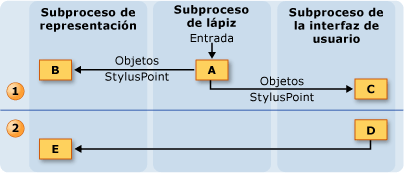
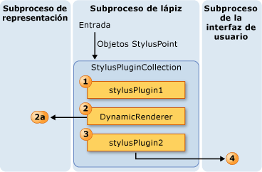
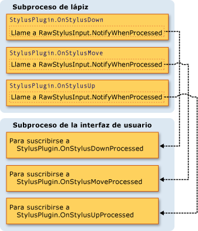
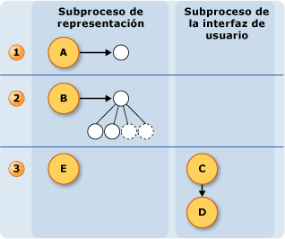

# Modelo de subprocesamiento de entrada manuscritaThe Ink Threading Model
Una de las ventajas de la tinta en un Tablet PC es que asemeja mucho a escribir con un lápiz normal y el papel.One of the benefits of ink on a Tablet PC is that it feels a lot like writing with a regular pen and paper.  Para lograr esto, el lápiz de tablet PC recopila datos de entrada a una velocidad mucho más alta que un mouse y representa la entrada de lápiz mientras el usuario escribe.To accomplish this, the tablet pen collects input data at a much higher rate than a mouse does and renders the ink as the user writes.  Subproceso de interfaz (UI) de usuario de la aplicación no es suficiente para recopilar los datos del lápiz y tinta de representación, porque puede quedarse bloqueado.The application's user interface (UI) thread is not sufficient for collecting pen data and rendering ink, because it can become blocked.  Para solucionarlo, un [!INCLUDE[TLA2#tla_winclient](../../../../includes/tla2sharptla-winclient-md.md)] aplicación usa dos subprocesos adicionales cuando un usuario escribe la entrada de lápiz.To solve this, a [!INCLUDE[TLA2#tla_winclient](../../../../includes/tla2sharptla-winclient-md.md)] application uses two additional threads when a user writes ink.  
  
 En la lista siguiente se describe los subprocesos que toman parte en la recopilación y representación de entrada de lápiz digital:The following list describes the threads that take part in collecting and rendering digital ink:  
  
-   Subproceso del lápiz - el subproceso que toma como entrado de lápiz.Pen thread - the thread that takes input from the stylus.  (En realidad, se trata de un grupo de subprocesos, pero este tema hace referencia a él como un subproceso del lápiz.)(In reality, this is a thread pool, but this topic refers to it as a pen thread.)  
  
-   Subproceso de interfaz de usuario de la aplicación: el subproceso que controla la interfaz de usuario de la aplicación.Application user interface thread - the thread that controls the user interface of the application.  
  
-   Subproceso de representación dinámica - el subproceso que representa la entrada de lápiz mientras el usuario dibuja un trazo.Dynamic rendering thread - the thread that renders the ink while the user draws a stroke. El subproceso de representación dinámica es diferente del subproceso que representa otros elementos de interfaz de usuario para la aplicación, como se mencionó en la ventana Presentation Foundation [modelo de subprocesamiento](../../../../docs/framework/wpf/advanced/threading-model.md).The dynamic rendering thread is different than the thread that renders other UI elements for the application, as mentioned in Window Presentation Foundation [Threading Model](../../../../docs/framework/wpf/advanced/threading-model.md).  
  
 El modelo de escritura a mano es el mismo independientemente de la aplicación utilice la <xref:System.Windows.Controls.InkCanvas> o un control personalizado similar a la de [crear un Control de entrada manuscrita](../../../../docs/framework/wpf/advanced/creating-an-ink-input-control.md).The inking model is the same whether the application uses the <xref:System.Windows.Controls.InkCanvas> or a custom control similar to the one in [Creating an Ink Input Control](../../../../docs/framework/wpf/advanced/creating-an-ink-input-control.md).  Aunque en este tema se describe el subprocesamiento en términos de la <xref:System.Windows.Controls.InkCanvas>, los mismos conceptos que se aplican cuando se crea un control personalizado.Although this topic discusses threading in terms of the <xref:System.Windows.Controls.InkCanvas>, the same concepts apply when you create a custom control.  
  
## Información general de subprocesosThreading Overview  
 El siguiente diagrama ilustra el modelo de subprocesos cuando un usuario dibuja un trazo:The following diagram illustrates the threading model when a user draws a stroke:  
  
 ![Modelo de subprocesos mientras se dibuja un trazo. ] (../../../../docs/framework/wpf/advanced/media/inkthreading-drawingink.png "InkThreading_DrawingInk")  
  
1.  Acciones que se producen mientras el usuario dibuja el trazoActions occurring while the user draws the stroke  
  
    1.  Cuando el usuario dibuja un trazo, los puntos del lápiz se enciende el subproceso del lápiz.When the user draws a stroke, the stylus points come in on the pen thread.  Lápiz complementos, incluido el <xref:System.Windows.Input.StylusPlugIns.DynamicRenderer>, acepte los puntos del lápiz en el subproceso del lápiz y tienen la oportunidad de modificarlos antes de la <xref:System.Windows.Controls.InkCanvas> reciben.Stylus plug-ins, including the <xref:System.Windows.Input.StylusPlugIns.DynamicRenderer>, accept the stylus points on the pen thread and have the chance to modify them before the <xref:System.Windows.Controls.InkCanvas> receives them.  
  
    2.  El <xref:System.Windows.Input.StylusPlugIns.DynamicRenderer> representa los puntos del lápiz en el subproceso de representación dinámica.The <xref:System.Windows.Input.StylusPlugIns.DynamicRenderer> renders the stylus points on the dynamic rendering thread. Esto sucede al mismo tiempo que el paso anterior.This happens at the same time as the previous step.  
  
    3.  El <xref:System.Windows.Controls.InkCanvas> recibe los puntos del lápiz en el subproceso de interfaz de usuario.The <xref:System.Windows.Controls.InkCanvas> receives the stylus points on the UI thread.  
  
2.  Acciones que se producen después de que el usuario finaliza el trazoActions occurring after the user ends the stroke  
  
    1.  Cuando el usuario termina de dibujar el trazo del <xref:System.Windows.Controls.InkCanvas> crea un <xref:System.Windows.Ink.Stroke> objeto y lo agrega a la <xref:System.Windows.Controls.InkPresenter>, que representa de forma estática.When the user finishes drawing the stroke, the <xref:System.Windows.Controls.InkCanvas> creates a <xref:System.Windows.Ink.Stroke> object and adds it to the <xref:System.Windows.Controls.InkPresenter>, which statically renders it.  
  
    2.  Las alertas de subproceso de interfaz de usuario la <xref:System.Windows.Input.StylusPlugIns.DynamicRenderer> que el trazo se representa estáticamente, por lo que el <xref:System.Windows.Input.StylusPlugIns.DynamicRenderer> quita su representación visual del trazo.The UI thread alerts the <xref:System.Windows.Input.StylusPlugIns.DynamicRenderer> that the stroke is statically rendered, so the <xref:System.Windows.Input.StylusPlugIns.DynamicRenderer> removes its visual representation of the stroke.  
  
## Colección de tinta y complementos de lápizInk collection and Stylus Plug-ins  
 Cada <xref:System.Windows.UIElement> tiene un <xref:System.Windows.Input.StylusPlugIns.StylusPlugInCollection>.Each <xref:System.Windows.UIElement> has a <xref:System.Windows.Input.StylusPlugIns.StylusPlugInCollection>.  El <xref:System.Windows.Input.StylusPlugIns.StylusPlugIn> objetos en el <xref:System.Windows.Input.StylusPlugIns.StylusPlugInCollection> reciben y pueden modificar los puntos del lápiz en el subproceso del lápiz.The <xref:System.Windows.Input.StylusPlugIns.StylusPlugIn> objects in the <xref:System.Windows.Input.StylusPlugIns.StylusPlugInCollection> receive and can modify the stylus points on the pen thread. El <xref:System.Windows.Input.StylusPlugIns.StylusPlugIn> objetos reciben los puntos del lápiz según el orden de la <xref:System.Windows.Input.StylusPlugIns.StylusPlugInCollection>.The <xref:System.Windows.Input.StylusPlugIns.StylusPlugIn> objects receive the stylus points according to their order in the <xref:System.Windows.Input.StylusPlugIns.StylusPlugInCollection>.  
  
 El diagrama siguiente ilustra la situación hipotética donde la <xref:System.Windows.UIElement.StylusPlugIns%2A> colección de un <xref:System.Windows.UIElement> contiene `stylusPlugin1`, un <xref:System.Windows.Input.StylusPlugIns.DynamicRenderer>, y `stylusPlugin2`, en ese orden.The following diagram illustrates the hypothetical situation where the <xref:System.Windows.UIElement.StylusPlugIns%2A> collection of a <xref:System.Windows.UIElement> contains `stylusPlugin1`, a <xref:System.Windows.Input.StylusPlugIns.DynamicRenderer>, and `stylusPlugin2`, in that order.  
  
 ![Orden de complementos de lápiz afecta a la salida. ] (../../../../docs/framework/wpf/advanced/media/inkthreading-pluginorder.png "InkThreading_PluginOrder")  
  
 En el diagrama anterior, produzca el siguiente comportamiento:In the previous diagram, the following behavior takes place:  
  
1.  `StylusPlugin1` modifica los valores de x e y.`StylusPlugin1` modifies the values for x and y.  
  
2.  <xref:System.Windows.Input.StylusPlugIns.DynamicRenderer> recibe los puntos del lápiz modificados y los representa en el subproceso de representación dinámica.<xref:System.Windows.Input.StylusPlugIns.DynamicRenderer> receives the modified stylus points and renders them on the dynamic rendering thread.  
  
3.  `StylusPlugin2` recibe los puntos del lápiz modificados y más modifica los valores de x e y.`StylusPlugin2` receives the modified stylus points and further modifies the values for x and y.  
  
4.  La aplicación recopila los puntos del lápiz y, cuando el usuario finaliza el trazo, lo representa estáticamente.The application collects the stylus points, and, when the user finishes the stroke, statically renders the stroke.  
  
 Suponga que `stylusPlugin1` restringe los puntos del lápiz a un rectángulo y `stylusPlugin2` traduce los puntos del lápiz a la derecha.Suppose that `stylusPlugin1` restricts the stylus points to a rectangle and `stylusPlugin2` translates the stylus points to the right.  En el escenario anterior, el <xref:System.Windows.Input.StylusPlugIns.DynamicRenderer> recibe los puntos del lápiz restringidos, pero no los puntos del lápiz traducidos.In the previous scenario, the <xref:System.Windows.Input.StylusPlugIns.DynamicRenderer> receives the restricted stylus points, but not the translated stylus points.  Cuando el usuario dibuja el trazo, el trazo se representa dentro de los límites del rectángulo, pero no aparece el trazo que se deben traducir hasta que el usuario levanta el lápiz.When the user draws the stroke, the stroke is rendered within the bounds of the rectangle, but the stroke doesn't appear to be translated until the user lifts the pen.  
  
### Realizar operaciones con un lápiz de complemento en el subproceso de interfaz de usuarioPerforming operations with a Stylus Plug-in on the UI thread  
 Porque no se puede realizar la prueba de posicionamiento precisa en el subproceso del lápiz, algunos elementos en ocasiones pueden recibir la entrada del lápiz dirigida a otros elementos.Because accurate hit-testing cannot be performed on the pen thread, some elements might occasionally receive stylus input intended for other elements. Si necesita asegurarse de que la entrada se enrutó correctamente antes de realizar una operación, suscribirse a y realizar la operación en el <xref:System.Windows.Input.StylusPlugIns.StylusPlugIn.OnStylusDownProcessed%2A>, <xref:System.Windows.Input.StylusPlugIns.StylusPlugIn.OnStylusMoveProcessed%2A>, o <xref:System.Windows.Input.StylusPlugIns.StylusPlugIn.OnStylusUpProcessed%2A> método.If you need to make sure the input was routed correctly before performing an operation, subscribe to and perform the operation in the <xref:System.Windows.Input.StylusPlugIns.StylusPlugIn.OnStylusDownProcessed%2A>, <xref:System.Windows.Input.StylusPlugIns.StylusPlugIn.OnStylusMoveProcessed%2A>, or <xref:System.Windows.Input.StylusPlugIns.StylusPlugIn.OnStylusUpProcessed%2A> method. Estos métodos se invocan mediante el subproceso de la aplicación una vez realizada la prueba de posicionamiento precisa.These methods are invoked by the application thread after accurate hit-testing has been performed. Para suscribirse a estos métodos, llame a la <xref:System.Windows.Input.StylusPlugIns.RawStylusInput.NotifyWhenProcessed%2A> método en el método que tiene lugar en el subproceso del lápiz.To subscribe to these methods, call the <xref:System.Windows.Input.StylusPlugIns.RawStylusInput.NotifyWhenProcessed%2A> method in the method that occurs on the pen thread.  
  
 En el diagrama siguiente ilustra la relación entre el subproceso del lápiz y el subproceso de interfaz de usuario con respecto a los eventos de lápiz de un <xref:System.Windows.Input.StylusPlugIns.StylusPlugIn>.The following diagram illustrates the relationship between the pen thread and UI thread with respect to the stylus events of a <xref:System.Windows.Input.StylusPlugIns.StylusPlugIn>.  
  
   
  
## Representar entrada manuscritaRendering Ink  
 Como el usuario dibuja un trazo, <xref:System.Windows.Input.StylusPlugIns.DynamicRenderer> representa la tinta en un subproceso independiente de forma que la entrada de lápiz parece "fluir" del lápiz incluso cuando el subproceso de interfaz de usuario está ocupado.As the user draws a stroke, <xref:System.Windows.Input.StylusPlugIns.DynamicRenderer> renders the ink on a separate thread so the ink appears to "flow" from the pen even when the UI thread is busy.  El <xref:System.Windows.Input.StylusPlugIns.DynamicRenderer> genera un árbol visual en el subproceso de representación dinámica como recopila los puntos del lápiz.The <xref:System.Windows.Input.StylusPlugIns.DynamicRenderer> builds a visual tree on the dynamic rendering thread as it collects stylus points.  Cuando el usuario finaliza el trazo, el <xref:System.Windows.Input.StylusPlugIns.DynamicRenderer> le pide que se le notifique cuando la aplicación realiza el siguiente paso de representación.When the user finishes the stroke, the <xref:System.Windows.Input.StylusPlugIns.DynamicRenderer> asks to be notified when the application does the next rendering pass.  Cuando la aplicación termina el siguiente paso de representación, el <xref:System.Windows.Input.StylusPlugIns.DynamicRenderer> limpia su árbol visual.After the application completes the next rendering pass, the <xref:System.Windows.Input.StylusPlugIns.DynamicRenderer> cleans up its visual tree.  El siguiente diagrama ilustra este proceso.The following diagram illustrates this process.  
  
   
  
1.  El usuario inicia el trazo.The user begins the stroke.  
  
    1.  El <xref:System.Windows.Input.StylusPlugIns.DynamicRenderer> crea el árbol visual.The <xref:System.Windows.Input.StylusPlugIns.DynamicRenderer> creates the visual tree.  
  
2.  El usuario está dibujando el trazo.The user is drawing the stroke.  
  
    1.  El <xref:System.Windows.Input.StylusPlugIns.DynamicRenderer> compila el árbol visual.The <xref:System.Windows.Input.StylusPlugIns.DynamicRenderer> builds the visual tree.  
  
3.  El usuario finaliza el trazo.The user ends the stroke.  
  
    1.  El <xref:System.Windows.Controls.InkPresenter> agrega el trazo a su árbol visual.The <xref:System.Windows.Controls.InkPresenter> adds the stroke to its visual tree.  
  
    2.  La capa de integración multimedia (MIL) representa los trazos estáticamente.The Media Integration Layer (MIL) statically renders the strokes.  
  
    3.  El <xref:System.Windows.Input.StylusPlugIns.DynamicRenderer> limpia los objetos visuales.The <xref:System.Windows.Input.StylusPlugIns.DynamicRenderer> cleans up the visuals.
