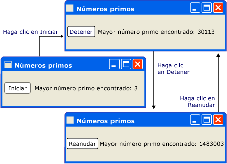
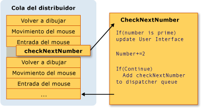
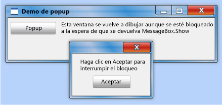
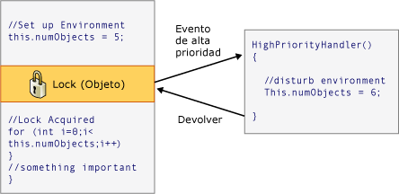

# Modelo de subprocesos
[!INCLUDE[TLA#tla_winclient](../../../../includes/tlasharptla-winclient-md.md)]está diseñado para ahorrar a los programadores las dificultades de los subprocesos. Como resultado, la mayoría de [!INCLUDE[TLA2#tla_winclient](../../../../includes/tla2sharptla-winclient-md.md)] los programadores no tienen que escribir una interfaz que usa más de un subproceso. Dado que los programas multiproceso son complejas y difíciles de depurar, se deben evitar cuando existan soluciones de un único subproceso.  
  
 Importar qué tan bien no diseñado, sin embargo, no [!INCLUDE[TLA2#tla_ui](../../../../includes/tla2sharptla-ui-md.md)] framework nunca será capaz de proporcionar una solución de un solo subproceso para cada tipo de problema.              [!INCLUDE[TLA2#tla_winclient](../../../../includes/tla2sharptla-winclient-md.md)]iguala, pero todavía hay situaciones donde varios subprocesos mejoran [!INCLUDE[TLA#tla_ui](../../../../includes/tlasharptla-ui-md.md)] rendimiento de la aplicación o la capacidad de respuesta. Después de explicar algunos temas básicos, este documento explora algunas de estas situaciones y, a continuación, concluye con una explicación de algunos detalles de nivel inferior.  
  
   
  
> [!NOTE]
>  En este tema se describe el subprocesamiento utilizando la <xref:System.Windows.Threading.Dispatcher.BeginInvoke%2A> método para las llamadas asincrónicas. También puede realizar llamadas asincrónicas mediante una llamada a la <xref:System.Windows.Threading.Dispatcher.InvokeAsync%2A> método, que toman un <xref:System.Action> o <xref:System.Func%601> como un parámetro.  El <xref:System.Windows.Threading.Dispatcher.InvokeAsync%2A> método devuelve un <xref:System.Windows.Threading.DispatcherOperation> o <xref:System.Windows.Threading.DispatcherOperation%601>, que tiene un <xref:System.Windows.Threading.DispatcherOperation.Task%2A> propiedad. Puede usar el `await` palabra clave with bien el <xref:System.Windows.Threading.DispatcherOperation> o asociado <xref:System.Threading.Tasks.Task>. Si necesita esperar sincrónicamente el <xref:System.Threading.Tasks.Task> devuelto por un <xref:System.Windows.Threading.DispatcherOperation> o <xref:System.Windows.Threading.DispatcherOperation%601>, llame a la <xref:System.Windows.Threading.TaskExtensions.DispatcherOperationWait%2A> método de extensión.  Llamar a <xref:System.Threading.Tasks.Task.Wait%2A?displayProperty=fullName> dará como resultado un interbloqueo. Para obtener más información sobre el uso de un <xref:System.Threading.Tasks.Task> para realizar operaciones asincrónicas, vea el paralelismo de tareas.  El <xref:System.Windows.Threading.Dispatcher.Invoke%2A> método también tiene sobrecargas que toman una <xref:System.Action> o <xref:System.Func%601> como un parámetro.  Puede usar el <xref:System.Windows.Threading.Dispatcher.Invoke%2A> método realizar sincrónico llama pasando un delegado <xref:System.Action> o <xref:System.Func%601>.  
  
   
## Información general y el distribuidor  
 Normalmente, [!INCLUDE[TLA2#tla_winclient](../../../../includes/tla2sharptla-winclient-md.md)] aplicaciones se inician con dos subprocesos: uno para controlar la representación y otro para administrar la [!INCLUDE[TLA2#tla_ui](../../../../includes/tla2sharptla-ui-md.md)]. El subproceso de representación se ejecuta eficazmente oculto en segundo plano mientras el [!INCLUDE[TLA2#tla_ui](../../../../includes/tla2sharptla-ui-md.md)] subproceso recibe la entrada, administra los eventos, pinta la pantalla y se ejecuta el código de la aplicación. La mayoría de aplicaciones utiliza una sola [!INCLUDE[TLA2#tla_ui](../../../../includes/tla2sharptla-ui-md.md)] de subproceso, aunque en algunos casos es mejor utilizar varios. Trataremos esto con un ejemplo más adelante.  
  
 El [!INCLUDE[TLA2#tla_ui](../../../../includes/tla2sharptla-ui-md.md)] colas de subproceso de trabajo elementos dentro de un objeto denominado un <xref:System.Windows.Threading.Dispatcher>. El <xref:System.Windows.Threading.Dispatcher> selecciona los elementos de trabajo en función de la prioridad y ejecuta cada uno hasta su finalización.  Cada [!INCLUDE[TLA2#tla_ui](../../../../includes/tla2sharptla-ui-md.md)] subproceso debe tener al menos una <xref:System.Windows.Threading.Dispatcher>y cada <xref:System.Windows.Threading.Dispatcher> pueden ejecutar los elementos de trabajo en exactamente un subproceso.  
  
 El truco para crear aplicaciones con capacidad de respuesta y fácil de usar es maximizar la <xref:System.Windows.Threading.Dispatcher> rendimiento manteniendo los elementos de trabajo pequeño. Los elementos de esta forma nunca quedan obsoletos en la <xref:System.Windows.Threading.Dispatcher> cola de espera de procesamiento. Cualquier retraso perceptible entre la entrada y la respuesta puede frustrar a un usuario.  
  
 ¿Cómo están [!INCLUDE[TLA2#tla_winclient](../../../../includes/tla2sharptla-winclient-md.md)] aplicaciones supone que administran grandes operaciones? ¿Qué ocurre si el código implica un cálculo grande o necesita consultar una base de datos de algún servidor remoto? Normalmente, la respuesta es administrar la operación grande en un subproceso independiente, dejando el [!INCLUDE[TLA2#tla_ui](../../../../includes/tla2sharptla-ui-md.md)] gratuitamente tienden a elementos en el subproceso de la <xref:System.Windows.Threading.Dispatcher> cola. Una vez completada la operación grande, puede informar de su resultado a la [!INCLUDE[TLA2#tla_ui](../../../../includes/tla2sharptla-ui-md.md)] subproceso para su presentación.  
  
 Históricamente, [!INCLUDE[TLA#tla_mswin](../../../../includes/tlasharptla-mswin-md.md)] permite [!INCLUDE[TLA2#tla_ui](../../../../includes/tla2sharptla-ui-md.md)] elementos para tener acceso a sólo el subproceso que los creó. Esto significa que un subproceso en segundo plano a cargo de alguna tarea de larga ejecución no puede actualizar un cuadro de texto cuando haya finalizado.                  [!INCLUDE[TLA#tla_mswin](../../../../includes/tlasharptla-mswin-md.md)]hace esto para garantizar la integridad de [!INCLUDE[TLA2#tla_ui](../../../../includes/tla2sharptla-ui-md.md)] componentes. Un cuadro de lista puede parecer extraño si actualiza su contenido por un subproceso en segundo plano durante la presentación.  
  
 [!INCLUDE[TLA2#tla_winclient](../../../../includes/tla2sharptla-winclient-md.md)]tiene un mecanismo de exclusión mutua integrados que se aplica esta coordinación. La mayoría de las clases de [!INCLUDE[TLA2#tla_winclient](../../../../includes/tla2sharptla-winclient-md.md)] derivan de <xref:System.Windows.Threading.DispatcherObject>. En la construcción, un <xref:System.Windows.Threading.DispatcherObject> almacena una referencia a la <xref:System.Windows.Threading.Dispatcher> vinculada al subproceso actualmente en ejecución. En efecto, el <xref:System.Windows.Threading.DispatcherObject> asocia con el subproceso que lo crea. Durante la ejecución del programa, un <xref:System.Windows.Threading.DispatcherObject> puede llamar a su público <xref:System.Windows.Threading.DispatcherObject.VerifyAccess%2A> método.                  <xref:System.Windows.Threading.DispatcherObject.VerifyAccess%2A> examina la <xref:System.Windows.Threading.Dispatcher> asociado al subproceso actual y lo compara con el <xref:System.Windows.Threading.Dispatcher> almacenada durante la construcción de referencia. Si no coinciden, <xref:System.Windows.Threading.DispatcherObject.VerifyAccess%2A> produce una excepción.                  <xref:System.Windows.Threading.DispatcherObject.VerifyAccess%2A> está pensado para ser llamado al principio de cada método perteneciente a una <xref:System.Windows.Threading.DispatcherObject>.  
  
 ¿Si sólo un subproceso puede modificar el [!INCLUDE[TLA2#tla_ui](../../../../includes/tla2sharptla-ui-md.md)], cómo interactúan los subprocesos en segundo plano con el usuario? Puede solicitar a un subproceso en segundo plano el [!INCLUDE[TLA2#tla_ui](../../../../includes/tla2sharptla-ui-md.md)] subproceso para realizar una operación en su nombre. Para ello, registrando un elemento de trabajo con el <xref:System.Windows.Threading.Dispatcher> de la [!INCLUDE[TLA2#tla_ui](../../../../includes/tla2sharptla-ui-md.md)] subproceso. El <xref:System.Windows.Threading.Dispatcher> clase proporciona dos métodos para registrar los elementos de trabajo: <xref:System.Windows.Threading.Dispatcher.Invoke%2A> y <xref:System.Windows.Threading.Dispatcher.BeginInvoke%2A>. Ambos métodos programan a un delegado para la ejecución.                  <xref:System.Windows.Threading.Dispatcher.Invoke%2A> es una llamada sincrónica, es decir, no devuelve hasta que el [!INCLUDE[TLA2#tla_ui](../../../../includes/tla2sharptla-ui-md.md)] subproceso termina realmente de ejecutar el delegado.                  <xref:System.Windows.Threading.Dispatcher.BeginInvoke%2A> es asincrónica y vuelve inmediatamente.  
  
 El <xref:System.Windows.Threading.Dispatcher> ordena los elementos de la cola por prioridad. Hay diez niveles que se pueden especificar cuando se agrega un elemento a la <xref:System.Windows.Threading.Dispatcher> cola. Estas prioridades se mantienen en el <xref:System.Windows.Threading.DispatcherPriority> (enumeración). Información detallada acerca de <xref:System.Windows.Threading.DispatcherPriority> niveles pueden encontrarse en el [!INCLUDE[TLA2#tla_winfxsdk](../../../../includes/tla2sharptla-winfxsdk-md.md)] documentación.  
  
   
## Subprocesos en acción: los ejemplos  
  
   
### Una aplicación de un único subproceso con un cálculo de ejecución prolongada  
 La mayoría [!INCLUDE[TLA#tla_gui#plural](../../../../includes/tlasharptla-guisharpplural-md.md)] dedicar una gran parte de su tiempo de inactividad mientras espera eventos que se generan en respuesta a interacciones del usuario. Con la programación sea cuidadosa este tiempo de inactividad puede usarse de forma constructiva, sin afectar a la capacidad de respuesta de la [!INCLUDE[TLA2#tla_ui](../../../../includes/tla2sharptla-ui-md.md)]. El [!INCLUDE[TLA2#tla_winclient](../../../../includes/tla2sharptla-winclient-md.md)] modelo de subprocesos no permite la entrada interrumpa una operación que ocurra en el [!INCLUDE[TLA2#tla_ui](../../../../includes/tla2sharptla-ui-md.md)] subproceso. Esto significa que debe ser seguro volver a la <xref:System.Windows.Threading.Dispatcher> periódicamente al proceso de espera de eventos de entrada antes de que queden obsoletos.  
  
 Considere el ejemplo siguiente:  
  
   
  
 Esta sencilla aplicación cuenta en orden ascendente desde tres, buscando números primos. Cuando el usuario hace clic en el **iniciar** botón, la búsqueda comienza. Cuando el programa encuentra un número primo, actualiza la interfaz de usuario con su detección. En cualquier momento, el usuario puede detener la búsqueda.  
  
 Aunque es bastante simple, la búsqueda de números primos podría continuar para siempre, que presenta algunas dificultades.  Si se controla la búsqueda completa dentro del controlador de eventos click del botón, nunca se daría el [!INCLUDE[TLA2#tla_ui](../../../../includes/tla2sharptla-ui-md.md)] una oportunidad para controlar otros eventos de subprocesos. La [!INCLUDE[TLA2#tla_ui](../../../../includes/tla2sharptla-ui-md.md)] no podrá responder a la entrada o proceso de mensajes. Usaría nunca volverá a dibujar y nunca responder a clics de botón.  
  
 Podríamos realizar la búsqueda de números primos en un subproceso independiente, pero entonces se necesitaría tratar con problemas de sincronización. Con un enfoque de un único subproceso, podemos actualizar directamente la etiqueta que muestra el mayor número encontrado.  
  
 Si dividimos la tarea de cálculo en fragmentos manejables, podemos volver periódicamente a la <xref:System.Windows.Threading.Dispatcher> y procesar eventos. Podemos dar [!INCLUDE[TLA2#tla_winclient](../../../../includes/tla2sharptla-winclient-md.md)] una oportunidad para volver a dibujar y procesar la entrada.  
  
 La mejor manera de dividir el tiempo de procesamiento entre el cálculo y el control de eventos es administrar el cálculo de la <xref:System.Windows.Threading.Dispatcher>. Mediante el uso de la <xref:System.Windows.Threading.Dispatcher.BeginInvoke%2A> método, podemos programar las comprobaciones de números primos en la misma cola que [!INCLUDE[TLA2#tla_ui](../../../../includes/tla2sharptla-ui-md.md)] se extraen de los eventos. En nuestro ejemplo, programamos solamente una comprobación de número primo cada vez. Una vez completada la comprobación de número primo, programamos la próxima comprobación inmediatamente. Esta comprobación se realiza solamente después pendientes [!INCLUDE[TLA2#tla_ui](../../../../includes/tla2sharptla-ui-md.md)] controlan los eventos.  
  
   
  
 [!INCLUDE[TLA#tla_word](../../../../includes/tlasharptla-word-md.md)]se realiza la revisión ortográfica mediante este mecanismo. Se realiza la revisión ortográfica en segundo plano mediante el tiempo de inactividad de la [!INCLUDE[TLA2#tla_ui](../../../../includes/tla2sharptla-ui-md.md)] subproceso. Echemos un vistazo al código.  
  
 En el ejemplo siguiente se muestra el XAML que crea la interfaz de usuario.  
  
 [!code-xml[ThreadingPrimeNumbers#ThreadingPrimeNumberXAML](../../../../samples/snippets/csharp/VS_Snippets_Wpf/ThreadingPrimeNumbers/CSharp/Window1.xaml#threadingprimenumberxaml)]  
  
 En el ejemplo siguiente se muestra el código subyacente.  
  
 [!code-csharp[ThreadingPrimeNumbers#ThreadingPrimeNumberCodeBehind](../../../../samples/snippets/csharp/VS_Snippets_Wpf/ThreadingPrimeNumbers/CSharp/Window1.xaml.cs#threadingprimenumbercodebehind)]
 [!code-vb[ThreadingPrimeNumbers#ThreadingPrimeNumberCodeBehind](../../../../samples/snippets/visualbasic/VS_Snippets_Wpf/ThreadingPrimeNumbers/visualbasic/mainwindow.xaml.vb#threadingprimenumbercodebehind)]  
  
 En el ejemplo siguiente se muestra el controlador de eventos para el <xref:System.Windows.Controls.Button>.  
  
 [!code-csharp[ThreadingPrimeNumbers#ThreadingPrimeNumberStartOrStop](../../../../samples/snippets/csharp/VS_Snippets_Wpf/ThreadingPrimeNumbers/CSharp/Window1.xaml.cs#threadingprimenumberstartorstop)]
 [!code-vb[ThreadingPrimeNumbers#ThreadingPrimeNumberStartOrStop](../../../../samples/snippets/visualbasic/VS_Snippets_Wpf/ThreadingPrimeNumbers/visualbasic/mainwindow.xaml.vb#threadingprimenumberstartorstop)]  
  
 Además de actualizar el texto en el <xref:System.Windows.Controls.Button>, este controlador es responsable de programar la primera comprobación de número primo agregando un delegado para el <xref:System.Windows.Threading.Dispatcher> cola. En ocasiones, después de este controlador de eventos ha completado su trabajo, el <xref:System.Windows.Threading.Dispatcher> seleccionará este delegado para la ejecución.  
  
 Como mencionamos anteriormente, <xref:System.Windows.Threading.Dispatcher.BeginInvoke%2A> es el <xref:System.Windows.Threading.Dispatcher> miembro que se usa para programar un delegado para la ejecución. En este caso, elegimos la <xref:System.Windows.Threading.DispatcherPriority> prioridad. El <xref:System.Windows.Threading.Dispatcher> ejecutará este delegado cuando no haya ningún evento importante por procesar.                          [!INCLUDE[TLA2#tla_ui](../../../../includes/tla2sharptla-ui-md.md)]la respuesta es más importante que la comprobación de números. También pasamos a un nuevo delegado que representa la rutina de comprobación de números.  
  
 [!code-csharp[ThreadingPrimeNumbers#ThreadingPrimeNumberCheckNextNumber](../../../../samples/snippets/csharp/VS_Snippets_Wpf/ThreadingPrimeNumbers/CSharp/Window1.xaml.cs#threadingprimenumberchecknextnumber)]
 [!code-vb[ThreadingPrimeNumbers#ThreadingPrimeNumberCheckNextNumber](../../../../samples/snippets/visualbasic/VS_Snippets_Wpf/ThreadingPrimeNumbers/visualbasic/mainwindow.xaml.vb#threadingprimenumberchecknextnumber)]  
  
 Este método comprueba si el siguiente número impar es primo. Si es primo, el método actualiza directamente el `bigPrime` <xref:System.Windows.Controls.TextBlock> para reflejar su detección. Podemos hacerlo porque el cálculo se está produciendo en el mismo subproceso que se usó para crear el componente. Si hubiéramos decidido utilizar un subproceso independiente para el cálculo, tendríamos que utilice un mecanismo de sincronización más complicado y ejecutar la actualización en el [!INCLUDE[TLA2#tla_ui](../../../../includes/tla2sharptla-ui-md.md)] subproceso. Mostraremos esta situación a continuación.  
  
 Para el código fuente completo de este ejemplo, consulte el [Single-Threaded Application with Long-Running Calculation Sample](http://go.microsoft.com/fwlink/?LinkID=160038)  
  
   
### Control de una operación de bloqueo con un subproceso en segundo plano  
 Administrar operaciones de bloqueo en una aplicación gráfica puede ser difícil. No queremos llamar a métodos de bloqueo de controladores de eventos, porque la aplicación se mostrará inmovilizar. Podemos utilizar un subproceso independiente para administrar estas operaciones, pero cuando terminemos, tendremos que sincronizar con el [!INCLUDE[TLA2#tla_ui](../../../../includes/tla2sharptla-ui-md.md)] subprocesos porque no podemos modificar directamente el [!INCLUDE[TLA2#tla_gui](../../../../includes/tla2sharptla-gui-md.md)] de nuestro subproceso de trabajo. Podemos usar <xref:System.Windows.Threading.Dispatcher.Invoke%2A> o <xref:System.Windows.Threading.Dispatcher.BeginInvoke%2A> para insertar delegados en el <xref:System.Windows.Threading.Dispatcher> de la [!INCLUDE[TLA2#tla_ui](../../../../includes/tla2sharptla-ui-md.md)] subproceso. Finalmente, estos delegados se ejecutarán con permiso para modificar [!INCLUDE[TLA2#tla_ui](../../../../includes/tla2sharptla-ui-md.md)] elementos.  
  
 En este ejemplo, imitamos una llamada a procedimiento remoto que recupera un boletín meteorológico. Utilizamos un subproceso de trabajo independiente para ejecutar esta llamada y programamos un método de actualización en el <xref:System.Windows.Threading.Dispatcher> de la [!INCLUDE[TLA2#tla_ui](../../../../includes/tla2sharptla-ui-md.md)] de subprocesos cuando hayamos terminado.  
  
   
  
 [!code-csharp[ThreadingWeatherForecast#ThreadingWeatherCodeBehind](../../../../samples/snippets/csharp/VS_Snippets_Wpf/ThreadingWeatherForecast/CSharp/Window1.xaml.cs#threadingweathercodebehind)]
 [!code-vb[ThreadingWeatherForecast#ThreadingWeatherCodeBehind](../../../../samples/snippets/visualbasic/VS_Snippets_Wpf/ThreadingWeatherForecast/visualbasic/window1.xaml.vb#threadingweathercodebehind)]  
  
 Éstos son algunos de los detalles para tener en cuenta.  
  
-   Crear el controlador del botón  
  
     [!code-csharp[ThreadingWeatherForecast#ThreadingWeatherButtonHandler](../../../../samples/snippets/csharp/VS_Snippets_Wpf/ThreadingWeatherForecast/CSharp/Window1.xaml.cs#threadingweatherbuttonhandler)]
     [!code-vb[ThreadingWeatherForecast#ThreadingWeatherButtonHandler](../../../../samples/snippets/visualbasic/VS_Snippets_Wpf/ThreadingWeatherForecast/visualbasic/window1.xaml.vb#threadingweatherbuttonhandler)]  
  
 Cuando se hace clic en el botón, se muestre el dibujo del reloj y se inicia su animación. Se deshabilitará el botón. Invocamos el `FetchWeatherFromServer` método en un nuevo subproceso y, a continuación, return, que permite el <xref:System.Windows.Threading.Dispatcher> para procesar los eventos mientras esperamos para recopilar el boletín meteorológico.  
  
-   Capturar la información meteorológica  
  
     [!code-csharp[ThreadingWeatherForecast#ThreadingWeatherFetchWeather](../../../../samples/snippets/csharp/VS_Snippets_Wpf/ThreadingWeatherForecast/CSharp/Window1.xaml.cs#threadingweatherfetchweather)]
     [!code-vb[ThreadingWeatherForecast#ThreadingWeatherFetchWeather](../../../../samples/snippets/visualbasic/VS_Snippets_Wpf/ThreadingWeatherForecast/visualbasic/window1.xaml.vb#threadingweatherfetchweather)]  
  
 Para simplificar las cosas, no tenemos realmente ningún código de red en este ejemplo. En su lugar, es posible simular el retraso de acceso de red al colocar nuestro nuevo subproceso espere durante cuatro segundos. En este momento, el original [!INCLUDE[TLA2#tla_ui](../../../../includes/tla2sharptla-ui-md.md)] subproceso aún está ejecutando y responder a eventos. Para mostrar esto, que hemos dejado una animación en ejecución y el minimizar y maximizar también botones seguirán funcionando.  
  
 Cuando finalice el retraso y hemos seleccionado aleatoriamente nuestro boletín meteorológico, es el momento de informar a los [!INCLUDE[TLA2#tla_ui](../../../../includes/tla2sharptla-ui-md.md)] subproceso. Para ello, la programación de una llamada a `UpdateUserInterface` en el [!INCLUDE[TLA2#tla_ui](../../../../includes/tla2sharptla-ui-md.md)] ese subproceso de subprocesos <xref:System.Windows.Threading.Dispatcher>. Se pasa una cadena que describe la información meteorológica a esta llamada al método programado.  
  
-   Actualizar el[!INCLUDE[TLA2#tla_ui](../../../../includes/tla2sharptla-ui-md.md)]  
  
     [!code-csharp[ThreadingWeatherForecast#ThreadingWeatherUpdateUI](../../../../samples/snippets/csharp/VS_Snippets_Wpf/ThreadingWeatherForecast/CSharp/Window1.xaml.cs#threadingweatherupdateui)]
     [!code-vb[ThreadingWeatherForecast#ThreadingWeatherUpdateUI](../../../../samples/snippets/visualbasic/VS_Snippets_Wpf/ThreadingWeatherForecast/visualbasic/window1.xaml.vb#threadingweatherupdateui)]  
  
 Cuando el <xref:System.Windows.Threading.Dispatcher> en el [!INCLUDE[TLA2#tla_ui](../../../../includes/tla2sharptla-ui-md.md)] subproceso con el tiempo, se ejecuta la llamada programada a `UpdateUserInterface`. Este método detiene la animación del reloj y elige una imagen que describa la información meteorológica. Muestra esta imagen y restaura el botón "fetch forecast".  
  
   
### Varias ventanas, varios subprocesos  
 Algunos [!INCLUDE[TLA2#tla_winclient](../../../../includes/tla2sharptla-winclient-md.md)] aplicaciones requieren varias ventanas de nivel superior. Es perfectamente aceptable para un subproceso / <xref:System.Windows.Threading.Dispatcher> combinación para administrar varias ventanas, pero a veces varios subprocesos hacer un mejor trabajo. Esto es especialmente cierto que si hay alguna posibilidad que una de las ventanas monopolice el subproceso.  
  
 [!INCLUDE[TLA#tla_mswin](../../../../includes/tlasharptla-mswin-md.md)]Explorer funciona de esta manera. Cada nueva ventana del explorador pertenece al proceso original, pero se crea bajo el control de un subproceso independiente.  
  
 Mediante el uso de un [!INCLUDE[TLA2#tla_winclient](../../../../includes/tla2sharptla-winclient-md.md)] <xref:System.Windows.Controls.Frame> control, podemos mostrar páginas Web. Podemos crear fácilmente una simple [!INCLUDE[TLA2#tla_ie](../../../../includes/tla2sharptla-ie-md.md)] sustituir. Comenzamos con una característica importante: la capacidad de abrir una nueva ventana del explorador. Cuando el usuario hace clic en "nueva ventana" botón, iniciamos una copia de nuestra ventana en un subproceso independiente. De este modo, las operaciones de ejecución prolongada o de bloqueo en una de las ventanas no bloquearán todas las demás ventanas.  
  
 En realidad, el modelo de explorador Web tiene su propio complicado modelo de subprocesos. Lo hemos elegido porque debe resultar conocido para la mayoría de los lectores.  
  
 En el ejemplo siguiente se muestra el código.  
  
 [!code-xml[ThreadingMultipleBrowsers#ThreadingMultiBrowserXAML](../../../../samples/snippets/csharp/VS_Snippets_Wpf/ThreadingMultipleBrowsers/CSharp/Window1.xaml#threadingmultibrowserxaml)]  
  
 [!code-csharp[ThreadingMultipleBrowsers#ThreadingMultiBrowserCodeBehind](../../../../samples/snippets/csharp/VS_Snippets_Wpf/ThreadingMultipleBrowsers/CSharp/Window1.xaml.cs#threadingmultibrowsercodebehind)]
 [!code-vb[ThreadingMultipleBrowsers#ThreadingMultiBrowserCodeBehind](../../../../samples/snippets/visualbasic/VS_Snippets_Wpf/ThreadingMultipleBrowsers/VisualBasic/Window1.xaml.vb#threadingmultibrowsercodebehind)]  
  
 Los siguientes segmentos de subprocesamiento de este código son los más interesantes para nosotros en este contexto:  
  
 [!code-csharp[ThreadingMultipleBrowsers#ThreadingMultiBrowserNewWindow](../../../../samples/snippets/csharp/VS_Snippets_Wpf/ThreadingMultipleBrowsers/CSharp/Window1.xaml.cs#threadingmultibrowsernewwindow)]
 [!code-vb[ThreadingMultipleBrowsers#ThreadingMultiBrowserNewWindow](../../../../samples/snippets/visualbasic/VS_Snippets_Wpf/ThreadingMultipleBrowsers/VisualBasic/Window1.xaml.vb#threadingmultibrowsernewwindow)]  
  
 Este método se llama cuando la "ventana nueva" se hace clic en el botón. Se crea un nuevo subproceso y se inicia de forma asincrónica.  
  
 [!code-csharp[ThreadingMultipleBrowsers#ThreadingMultiBrowserThreadStart](../../../../samples/snippets/csharp/VS_Snippets_Wpf/ThreadingMultipleBrowsers/CSharp/Window1.xaml.cs#threadingmultibrowserthreadstart)]
 [!code-vb[ThreadingMultipleBrowsers#ThreadingMultiBrowserThreadStart](../../../../samples/snippets/visualbasic/VS_Snippets_Wpf/ThreadingMultipleBrowsers/VisualBasic/Window1.xaml.vb#threadingmultibrowserthreadstart)]  
  
 Este método es el punto de partida para el nuevo subproceso. Creamos una nueva ventana bajo el control de este subproceso.                          [!INCLUDE[TLA2#tla_winclient](../../../../includes/tla2sharptla-winclient-md.md)]crea automáticamente un nuevo <xref:System.Windows.Threading.Dispatcher> para administrar el nuevo subproceso. Todo lo que tenemos que hacer para que la ventana sea funcional es iniciar el <xref:System.Windows.Threading.Dispatcher>.  
  
   
## Detalles técnicos y puntos problemáticos  
  
### Escribir componentes usando subprocesos  
 El [!INCLUDE[TLA#tla_netframewk](../../../../includes/tlasharptla-netframewk-md.md)] Guía del desarrollador describe un modelo de cómo un componente puede exponer comportamiento asincrónico a sus clientes (vea [Event-based Asynchronous Pattern Overview](../../../../docs/standard/asynchronous-programming-patterns/event-based-asynchronous-pattern-overview.md)). Por ejemplo, suponga que deseamos empaquetar el `FetchWeatherFromServer` método en un componente reutilizable, no gráfico. Sigue el estándar [!INCLUDE[TLA#tla_netframewk](../../../../includes/tlasharptla-netframewk-md.md)] patrón, esto sería algo parecido a lo siguiente.  
  
 [!code-csharp[CommandingOverviewSnippets#ThreadingArticleWeatherComponent1](../../../../samples/snippets/csharp/VS_Snippets_Wpf/CommandingOverviewSnippets/CSharp/Window1.xaml.cs#threadingarticleweathercomponent1)]
 [!code-vb[CommandingOverviewSnippets#ThreadingArticleWeatherComponent1](../../../../samples/snippets/visualbasic/VS_Snippets_Wpf/CommandingOverviewSnippets/visualbasic/window1.xaml.vb#threadingarticleweathercomponent1)]  
  
 `GetWeatherAsync`usaría una de las técnicas descritas anteriormente, como la creación de un subproceso en segundo plano, para hacer el trabajo de forma asincrónica, no bloquea el subproceso de llamada.  
  
 Una de las partes más importantes de este patrón es llamar a la *MethodName* `Completed` método en el mismo subproceso que llamó a la *MethodName* `Async` método comenzar con. Podría hacer esto mediante [!INCLUDE[TLA2#tla_winclient](../../../../includes/tla2sharptla-winclient-md.md)] bastante sencilla, almacenando <xref:System.Windows.Threading.Dispatcher.CurrentDispatcher%2A>, pero, a continuación, el componente no gráficos solo puede usarse en [!INCLUDE[TLA2#tla_winclient](../../../../includes/tla2sharptla-winclient-md.md)] aplicaciones, no en [!INCLUDE[TLA#tla_winforms](../../../../includes/tlasharptla-winforms-md.md)] o [!INCLUDE[TLA#tla_aspnet](../../../../includes/tlasharptla-aspnet-md.md)] programas.  
  
 El <xref:System.Windows.Threading.DispatcherSynchronizationContext> clase satisface esta necesidad, considérelo como una versión simplificada de <xref:System.Windows.Threading.Dispatcher> que funciona con otras [!INCLUDE[TLA2#tla_ui](../../../../includes/tla2sharptla-ui-md.md)] marcos.  
  
 [!code-csharp[CommandingOverviewSnippets#ThreadingArticleWeatherComponent2](../../../../samples/snippets/csharp/VS_Snippets_Wpf/CommandingOverviewSnippets/CSharp/Window1.xaml.cs#threadingarticleweathercomponent2)]
 [!code-vb[CommandingOverviewSnippets#ThreadingArticleWeatherComponent2](../../../../samples/snippets/visualbasic/VS_Snippets_Wpf/CommandingOverviewSnippets/visualbasic/window1.xaml.vb#threadingarticleweathercomponent2)]  
  
### Bombeo anidado  
 A veces no es factible bloquear completamente el [!INCLUDE[TLA2#tla_ui](../../../../includes/tla2sharptla-ui-md.md)] subproceso. Consideremos la <xref:System.Windows.MessageBox.Show%2A> método de la <xref:System.Windows.MessageBox> clase.                          <xref:System.Windows.MessageBox.Show%2A> no vuelve hasta que el usuario hace clic en el botón Aceptar. Sin embargo, crea una ventana que debe tener un bucle de mensajes para ser interactiva. Mientras esperamos para que el usuario haga clic en Aceptar, la ventana de la aplicación original no responde a la entrada del usuario. Sin embargo,, continuar procesar mensajes de pintura. La ventana original se redibuja cuando se cubre y se revela.  
  
   
  
 Algún subproceso debe estar a cargo de la ventana del cuadro de mensaje.                          [!INCLUDE[TLA2#tla_winclient](../../../../includes/tla2sharptla-winclient-md.md)]podría crear un nuevo subproceso para la ventana de cuadro de mensaje, pero este subproceso no podrá representar los elementos deshabilitados en la ventana original (recuerde la explicación anterior sobre la exclusión mutua). En su lugar, [!INCLUDE[TLA2#tla_winclient](../../../../includes/tla2sharptla-winclient-md.md)] utiliza un sistema de procesamiento de mensajes anidados. El <xref:System.Windows.Threading.Dispatcher> clase incluye un método especial denominado <xref:System.Windows.Threading.Dispatcher.PushFrame%2A>, que almacena el punto de ejecución actual de la aplicación, a continuación, comienza un nuevo bucle de mensajes. Cuando finalice el bucle de mensajes anidados, la ejecución se reanuda después del original <xref:System.Windows.Threading.Dispatcher.PushFrame%2A> llamar.  
  
 En este caso, <xref:System.Windows.Threading.Dispatcher.PushFrame%2A> mantiene el contexto de programa en la llamada a <xref:System.Windows.MessageBox>.                         <xref:System.Windows.MessageBox.Show%2A>, y se inicia un nuevo bucle de mensajes para volver a dibujar la ventana de fondo y controlar la entrada a la ventana de cuadro de mensaje. Cuando el usuario hace clic en Aceptar y borra la ventana emergente, el programa sale del bucle anidado y el control se reanuda después de la llamada a <xref:System.Windows.MessageBox.Show%2A>.  
  
### Eventos enrutados obsoletos  
 El sistema de eventos enrutados en [!INCLUDE[TLA2#tla_winclient](../../../../includes/tla2sharptla-winclient-md.md)] notifica a los árboles completos cuando se generan eventos.  
  
 [!code-xml[InputOvw#ThreadingArticleStaticRoutedEvent](../../../../samples/snippets/csharp/VS_Snippets_Wpf/InputOvw/CSharp/Page1.xaml#threadingarticlestaticroutedevent)]  
  
 Cuando se presiona el botón primario del mouse sobre la elipse, `handler2` se ejecuta. Después de `handler2` finaliza, el evento se pasa a la <xref:System.Windows.Controls.Canvas> objeto, que utiliza `handler1` para procesarlo. Esto sólo sucede si `handler2` hace explícitamente no marca el objeto de evento, según se controlan.  
  
 Es posible que `handler2` tardará mucho tiempo en procesar este evento.                          `handler2`Puede usar <xref:System.Windows.Threading.Dispatcher.PushFrame%2A> para iniciar un bucle de mensajes anidado que no volviera durante horas. Si `handler2` no no marca el evento como controlado cuando este bucle de mensajes se complete, el evento se pasa el árbol, aunque es muy antiguo.  
  
### Reentrada y bloqueo  
 El mecanismo de bloqueo de la [!INCLUDE[TLA#tla_clr](../../../../includes/tlasharptla-clr-md.md)] no se comporta exactamente como se podría imaginar; podría esperar que un subproceso dejara operación completamente cuando se solicita un bloqueo. En realidad, el subproceso continúa recibir y procesar mensajes de alta prioridad. Esto ayuda a evitar interbloqueos y interfaces con capacidad de respuesta mínimo, pero introduce la posibilidad de errores sutiles.  La mayoría del tiempo no necesite saber nada sobre esto pero, en raras circunstancias (ya que implica [!INCLUDE[TLA2#tla_win32](../../../../includes/tla2sharptla-win32-md.md)] mensajes de ventana o componentes COM STA) puede ser conveniente conocer.  
  
 Mayoría de las interfaces no se compilan con la seguridad para subprocesos en mente porque los programadores trabajan bajo el supuesto de que un [!INCLUDE[TLA2#tla_ui](../../../../includes/tla2sharptla-ui-md.md)] nunca tiene acceso a más de un subproceso. En este caso, que único subproceso puede realizar cambios en el entorno en momentos inesperados, produciendo esos mal efectos que el <xref:System.Windows.Threading.DispatcherObject> el mecanismo de exclusión mutua debe para resolver. Considere el siguiente pseudocódigo:  
  
   
  
 La mayoría del tiempo que es lo correcto, pero hay veces en [!INCLUDE[TLA2#tla_winclient](../../../../includes/tla2sharptla-winclient-md.md)] donde tal reentrada inesperada realmente puede causar problemas. Así, en determinados momentos claves, [!INCLUDE[TLA2#tla_winclient](../../../../includes/tla2sharptla-winclient-md.md)] llamadas <xref:System.Windows.Threading.Dispatcher.DisableProcessing%2A>, que cambia la instrucción de bloqueo de subproceso para usar el [!INCLUDE[TLA2#tla_winclient](../../../../includes/tla2sharptla-winclient-md.md)] bloqueo libre de reentrada, en lugar del habitual [!INCLUDE[TLA2#tla_clr](../../../../includes/tla2sharptla-clr-md.md)] bloqueo.  
  
 ¿Por qué hizo el [!INCLUDE[TLA2#tla_clr](../../../../includes/tla2sharptla-clr-md.md)] equipo elegir este comportamiento? Tenía que ver con objetos COM STA y el subproceso de finalización. Cuando un objeto recolectado, su `Finalize` método se ejecuta en el subproceso finalizador dedicado, no el [!INCLUDE[TLA2#tla_ui](../../../../includes/tla2sharptla-ui-md.md)] subproceso. Y en ella reside el problema, porque un STA COM del objeto que se creó en el [!INCLUDE[TLA2#tla_ui](../../../../includes/tla2sharptla-ui-md.md)] subproceso sólo puede efectuarse en la [!INCLUDE[TLA2#tla_ui](../../../../includes/tla2sharptla-ui-md.md)] subproceso. El [!INCLUDE[TLA2#tla_clr](../../../../includes/tla2sharptla-clr-md.md)] realiza el equivalente de un <xref:System.Windows.Threading.Dispatcher.BeginInvoke%2A> (en este caso, uso de Win32 `SendMessage`). Pero si el [!INCLUDE[TLA2#tla_ui](../../../../includes/tla2sharptla-ui-md.md)] subproceso está ocupado, el subproceso del finalizador se ha detenido y no se puede eliminar el objeto COM STA, que crea una pérdida grave de memoria. Por lo que la [!INCLUDE[TLA2#tla_clr](../../../../includes/tla2sharptla-clr-md.md)] equipo realizó la llamada difícil realizar bloqueos funcionan de la manera que hacen.  
  
 La tarea de [!INCLUDE[TLA2#tla_winclient](../../../../includes/tla2sharptla-winclient-md.md)] es evitar la reentrada inesperada sin reintroducir la pérdida de memoria, lo que no bloqueamos reentrada en todas partes.  
  
## Vea también  
 [Aplicación de un único subproceso con ejemplo de cálculo de ejecución prolongada](http://go.microsoft.com/fwlink/?LinkID=160038)