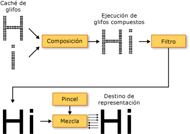

# Tipografía en WPF
En este tema se presentan las características tipográficas principales de [!INCLUDE[TLA2#tla_winclient](../../../../includes/tla2sharptla-winclient-md.md)]. Estas características incluyen la mejora de la calidad y el rendimiento de la representación de texto, la compatibilidad con tipografía [!INCLUDE[TLA#tla_opentype](../../../../includes/tlasharptla-opentype-md.md)], el texto internacional mejorado, la compatibilidad mejorada con fuentes y nuevas interfaces de programación de aplicaciones (API) de texto.  
  

  
   
## Mejora de la calidad y el rendimiento del texto  
 El texto de [!INCLUDE[TLA2#tla_winclient](../../../../includes/tla2sharptla-winclient-md.md)] se representa mediante [!INCLUDE[TLA#tla_ct](../../../../includes/tlasharptla-ct-md.md)], que mejora la claridad y la legibilidad del texto. [!INCLUDE[TLA2#tla_ct](../../../../includes/tla2sharptla-ct-md.md)] es una tecnología de software desarrollada por [!INCLUDE[TLA#tla_ms](../../../../includes/tlasharptla-ms-md.md)] que mejora la legibilidad del texto en pantallas de cristal líquido (LCD) existentes, como las de portátiles, Pocket PC y monitores de pantalla plana. [!INCLUDE[TLA2#tla_ct](../../../../includes/tla2sharptla-ct-md.md)] usa la representación de subpíxeles, lo que permite mostrar el texto de una manera más fiel a su forma real, ya que alinea los caracteres en una parte fraccionaria de un píxel. Esta resolución adicional aumenta la nitidez de los detalles diminutos en la presentación del texto, lo que facilita la lectura durante largos períodos de tiempo. Otra mejora de [!INCLUDE[TLA2#tla_ct](../../../../includes/tla2sharptla-ct-md.md)] en [!INCLUDE[TLA2#tla_winclient](../../../../includes/tla2sharptla-winclient-md.md)] es el suavizado de contorno en la dirección del eje Y, que suaviza la parte superior e inferior de las curvas de los caracteres de texto. Para obtener más detalles sobre las características de [!INCLUDE[TLA2#tla_ct](../../../../includes/tla2sharptla-ct-md.md)], vea [Información general sobre ClearType](../../../../docs/framework/wpf/advanced/cleartype-overview.md).  
  
   
Texto con función de suavizado de contorno de ClearType en la dirección del eje Y  
  
 La canalización de representación de texto completo se puede acelerar mediante hardware en [!INCLUDE[TLA2#tla_winclient](../../../../includes/tla2sharptla-winclient-md.md)], siempre y cuando la máquina cumpla los requisitos mínimos de hardware. Si una representación no se puede realizar mediante hardware, se recurre a la representación mediante software. La aceleración de hardware afecta a todas las fases de la canalización de representación de texto: almacenamiento de glifos individuales, composición de glifos en secuencias de glifos, aplicación de efectos y aplicación del algoritmo de combinación [!INCLUDE[TLA2#tla_ct](../../../../includes/tla2sharptla-ct-md.md)] a la salida final mostrada. Para obtener más información sobre la aceleración de hardware, vea [Niveles de representación de gráficos](../../../../docs/framework/wpf/advanced/graphics-rendering-tiers.md).  
  
   
Diagrama de la canalización de representación de texto  
  
 Además, el texto animado, ya sea mediante caracteres o glifos, aprovecha al máximo la capacidad de hardware gráfico habilitada por [!INCLUDE[TLA2#tla_winclient](../../../../includes/tla2sharptla-winclient-md.md)]. Como resultado, la animación de texto se suaviza.  
  
   
## Tipografía enriquecida  
 El formato de fuente [!INCLUDE[TLA2#tla_opentype](../../../../includes/tla2sharptla-opentype-md.md)] es una extensión del formato de fuente [!INCLUDE[TLA#tla_truetype](../../../../includes/tlasharptla-truetype-md.md)]. [!INCLUDE[TLA#tla_ms](../../../../includes/tlasharptla-ms-md.md)] y Adobe desarrollaron conjuntamente el formato de fuente [!INCLUDE[TLA2#tla_opentype](../../../../includes/tla2sharptla-opentype-md.md)], que proporciona una gran variedad de características tipográficas avanzadas. El <xref:System.Windows.Documents.Typography> objeto expone muchas de las características avanzadas de [!INCLUDE[TLA2#tla_opentype](../../../../includes/tla2sharptla-opentype-md.md)] fuentes, como las alternativas estilísticas y glifos floreados. [!INCLUDE[TLA2#tla_lhsdk](../../../../includes/tla2sharptla-lhsdk-md.md)] proporciona un conjunto de fuentes [!INCLUDE[TLA2#tla_opentype](../../../../includes/tla2sharptla-opentype-md.md)] de ejemplo que están diseñadas con características enriquecidas, como las fuentes Pericles y Pescadero. Para obtener más información, vea [Paquete de fuentes OpenType de ejemplo](../../../../docs/framework/wpf/advanced/sample-opentype-font-pack.md).  
  
 La fuente [!INCLUDE[TLA2#tla_opentype](../../../../includes/tla2sharptla-opentype-md.md)] Pericles contiene glifos adicionales que proporcionan alternativas estilísticas al conjunto estándar de glifos. En el texto siguiente se muestran glifos alternativos de estilo.  
  
   
Texto que usa glifos alternativos de estilo OpenType  
  
 Los caracteres floreados son glifos decorativos que usan adornos elaborados que suelen asociarse a la caligrafía. El texto siguiente muestra los glifos estándar y floreados para la fuente Pescadero.  
  
   
Texto que usa glifos OpenType estándar y floreados  
  
 Para obtener más detalles sobre las características de [!INCLUDE[TLA2#tla_opentype](../../../../includes/tla2sharptla-opentype-md.md)], vea [Características de las fuentes OpenType](../../../../docs/framework/wpf/advanced/opentype-font-features.md).  
  
   
## Compatibilidad mejorada con texto internacional  
 [!INCLUDE[TLA2#tla_winclient](../../../../includes/tla2sharptla-winclient-md.md)] proporciona compatibilidad mejorada con texto internacional mediante las características siguientes:  
  
-   Interlineado automático en todos los sistemas de escritura mediante la medición adaptable.  
  
-   Amplia compatibilidad con texto internacional. Para obtener más información, vea [Globalización de WPF](../../../../docs/framework/wpf/advanced/globalization-for-wpf.md).  
  
-   Saltos de línea, guiones y justificación basados en el idioma.  
  
   
## Compatibilidad mejorada con fuentes  
 [!INCLUDE[TLA2#tla_winclient](../../../../includes/tla2sharptla-winclient-md.md)] proporciona compatibilidad con fuentes mejorada mediante las características siguientes:  
  
-   Se usa Unicode para todo el texto. El comportamiento y la selección de la fuente ya no requieren un conjunto de caracteres o página de códigos.  
  
-   El comportamiento de la fuente es independiente de la configuración global, como la configuración regional del sistema.  
  
-   Independiente <xref:System.Windows.FontWeight>, <xref:System.Windows.FontStretch>, y <xref:System.Windows.FontStyle> tipos para definir una <xref:System.Windows.Media.FontFamily>. Esto proporciona mayor flexibilidad que en la programación de [!INCLUDE[TLA#tla_win32](../../../../includes/tlasharptla-win32-md.md)], en la que se usan combinaciones booleanas de negrita y cursiva para definir una familia de fuentes.  
  
-   La dirección de escritura (horizontal o vertical) se controla con independencia del nombre de la fuente.  
  
-   La vinculación de fuentes y la reserva de fuentes se incluye en un archivo [!INCLUDE[TLA#tla_xml](../../../../includes/tlasharptla-xml-md.md)] portátil mediante la tecnología de fuentes compuestas. Las fuentes compuestas permiten la construcción de fuentes multilingües completas. Las fuentes compuestas también proporcionan un mecanismo que impide la presentación de los glifos que faltan. Para obtener más información, vea los comentarios de la <xref:System.Windows.Media.FontFamily> clase.  
  
-   Las fuentes internacionales se generan a partir de fuentes compuestas mediante un grupo de fuentes de un solo idioma. De este modo se ahorran recursos a la hora de desarrollar fuentes para varios idiomas.  
  
-   Las fuentes compuestas se insertan en un documento, lo que permite la portabilidad de los documentos. Para obtener más información, vea los comentarios de la <xref:System.Windows.Media.FontFamily> clase.  
  
   
## Nuevas interfaces de programación de aplicaciones (API) de texto  
 [!INCLUDE[TLA2#tla_winclient](../../../../includes/tla2sharptla-winclient-md.md)] proporciona varias [!INCLUDE[TLA2#tla_api#plural](../../../../includes/tla2sharptla-apisharpplural-md.md)] de texto para que las usen los desarrolladores al incluir texto en sus aplicaciones. Estas [!INCLUDE[TLA2#tla_api#plural](../../../../includes/tla2sharptla-apisharpplural-md.md)] se agrupan en tres categorías:  
  
-   **Diseño e interfaz de usuario**. Controles de texto comunes para la [!INCLUDE[TLA#tla_gui](../../../../includes/tlasharptla-gui-md.md)].  
  
-   **Dibujo de texto ligero**. Permite dibujar texto directamente en objetos.  
  
-   **Formato de texto avanzado**. Permite implementar un motor de texto personalizado.  
  
### Diseño e interfaz de usuario  
 En el nivel más alto de funcionalidad, el texto [!INCLUDE[TLA2#tla_api#plural](../../../../includes/tla2sharptla-apisharpplural-md.md)] proporcionar comunes [!INCLUDE[TLA#tla_ui](../../../../includes/tlasharptla-ui-md.md)] controles como <xref:System.Windows.Controls.Label>, <xref:System.Windows.Controls.TextBlock>, y <xref:System.Windows.Controls.TextBox>. Estos controles proporcionan elementos de [!INCLUDE[TLA2#tla_ui](../../../../includes/tla2sharptla-ui-md.md)] básicos dentro de una aplicación y ofrecen una manera fácil de presentar el texto e interactuar con él. Controles como <xref:System.Windows.Controls.RichTextBox> y <xref:System.Windows.Controls.PasswordBox> habilitar más avanzado o especializado de control de texto. Y las clases como <xref:System.Windows.Documents.TextRange>, <xref:System.Windows.Documents.TextSelection>, y <xref:System.Windows.Documents.TextPointer> habilitar para manipular texto útil. Estos [!INCLUDE[TLA2#tla_ui](../../../../includes/tla2sharptla-ui-md.md)] controles proporcionan propiedades como <xref:System.Windows.Controls.Control.FontFamily%2A>, <xref:System.Windows.Controls.Control.FontSize%2A>, y <xref:System.Windows.Controls.Control.FontStyle%2A>, que le permiten controlar la fuente que se usa para representar el texto.  
  
#### Uso de efectos de imagen, transformaciones y efectos de texto  
 [!INCLUDE[TLA2#tla_winclient](../../../../includes/tla2sharptla-winclient-md.md)] permite crear usar el texto de forma visualmente interesante mediante características como efectos de imagen, transformaciones y efectos de texto. En el ejemplo siguiente se muestra un efecto típico de sombra paralela aplicado al texto.  
  
   
Texto con sombra paralela  
  
 En el ejemplo siguiente se muestra un efecto de sombra paralela y ruido aplicado al texto.  
  
   
Texto con sombra paralela y ruido  
  
 En el ejemplo siguiente se muestra un efecto de iluminado exterior aplicado al texto.  
  
   
Texto con efecto de iluminado exterior  
  
 En el ejemplo siguiente se muestra un efecto de desenfoque aplicado al texto.  
  
   
Texto con efecto de desenfoque  
  
 En el ejemplo siguiente se muestra la segunda línea de texto escalada al 150 % a lo largo del eje X y la tercera línea de texto escalada al 150 % a lo largo del eje Y.  
  
   
Texto escalado mediante ScaleTransform  
  
 En el ejemplo siguiente se muestra el texto sesgado a lo largo del eje X.  
  
   
Texto sesgado mediante SkewTransform  
  
 A <xref:System.Windows.Media.TextEffect> es un objeto auxiliar que permite tratar el texto como uno o más grupos de caracteres en una cadena de texto. En el ejemplo siguiente se muestra un carácter individual girado. Cada carácter se gira de manera independiente a intervalos de 1 segundo.  
  
   
Ejemplo de una animación de efecto de giro de texto  
  
#### Uso de documentos dinámicos  
 Además de los archivos [!INCLUDE[TLA2#tla_ui](../../../../includes/tla2sharptla-ui-md.md)] controles, [!INCLUDE[TLA2#tla_winclient](../../../../includes/tla2sharptla-winclient-md.md)] ofrece un control de diseño para la presentación de texto: el <xref:System.Windows.Documents.FlowDocument> elemento. El <xref:System.Windows.Documents.FlowDocument> elemento, junto con el <xref:System.Windows.Controls.DocumentViewer> elemento, proporciona un control para grandes cantidades de texto con diferentes requisitos de diseño. Controles de diseño proporcionan acceso a la tipografía avanzada a través de la <xref:System.Windows.Documents.Typography> objetos y propiedades relacionados con las fuentes de otros [!INCLUDE[TLA2#tla_ui](../../../../includes/tla2sharptla-ui-md.md)] controles.  
  
 En el ejemplo siguiente se muestra el contenido de texto hospedado en un <xref:System.Windows.Controls.FlowDocumentReader>, que proporciona búsqueda, navegación, paginación y ajuste de escala de soporte técnico de contenido.  
  
   
Texto hospedado en un FlowDocumentReader  
  
 Para obtener más información, vea [Documentos en WPF](../../../../docs/framework/wpf/advanced/documents-in-wpf.md).  
  
### Dibujo de texto ligero  
 Puede dibujar texto directamente a [!INCLUDE[TLA2#tla_winclient](../../../../includes/tla2sharptla-winclient-md.md)] objetos mediante el uso de la <xref:System.Windows.Media.DrawingContext.DrawText%2A> método de la <xref:System.Windows.Media.DrawingContext> objeto. Para usar este método, se crea un <xref:System.Windows.Media.FormattedText> objeto. Este objeto permite dibujar texto de varias líneas, en el que se puede dar formato individual a cada carácter del texto. La funcionalidad de la <xref:System.Windows.Media.FormattedText> objeto contenga gran parte de la funcionalidad de los marcadores de DrawText de la API Win32. Además, la <xref:System.Windows.Media.FormattedText> objeto contiene la funcionalidad como la posibilidad de puntos suspensivos, en el que se muestra un botón de puntos suspensivos al texto supera los límites establecidos. En el ejemplo siguiente se muestra texto al que se han aplicado varios formatos diferentes, incluido un degradado lineal en la segunda y tercera palabra.  
  
   
Texto mostrado mediante un objeto FormattedText  
  
 Puede convertir el texto con formato en <xref:System.Windows.Media.Geometry> objetos, lo que le permite crear otros tipos de texto visualmente interesante. Por ejemplo, podría crear un <xref:System.Windows.Media.Geometry> objeto basado en el esquema de una cadena de texto.  
  
   
Esquema de texto que usa un pincel de degradado lineal  
  
 En los ejemplos siguientes se muestran varias maneras de crear efectos visuales interesantes modificando el trazo, el relleno y el resaltado del texto convertido.  
  
   
Ejemplo de configuración de relleno y trazo en diferentes colores  
  
   
Ejemplo de pincel de imagen aplicado al trazo  
  
   
Ejemplo de pincel de imagen aplicado al trazo y el resaltado  
  
 Para obtener más información sobre la <xref:System.Windows.Media.FormattedText> de objetos, consulte [texto con formato de dibujo](../../../../docs/framework/wpf/advanced/drawing-formatted-text.md).  
  
### Formato de texto avanzado  
 El nivel de opciones avanzadas del texto [!INCLUDE[TLA2#tla_api#plural](../../../../includes/tla2sharptla-apisharpplural-md.md)], [!INCLUDE[TLA2#tla_winclient](../../../../includes/tla2sharptla-winclient-md.md)] ofrece la posibilidad de crear el diseño de texto personalizado mediante la <xref:System.Windows.Media.TextFormatting.TextFormatter> objeto y otros tipos en el <xref:System.Windows.Media.TextFormatting> espacio de nombres. El <xref:System.Windows.Media.TextFormatting.TextFormatter> y las clases asociadas permiten implementar el diseño de texto personalizado que admite su propia definición de formatos de caracteres, estilos de párrafo, reglas de salto de línea, y el diseño de otra características para texto internacional. Se darán muy pocos casos en los que le interese reemplazar la implementación predeterminada de la compatibilidad con el diseño de texto de [!INCLUDE[TLA2#tla_winclient](../../../../includes/tla2sharptla-winclient-md.md)], pero si está creando un aplicación o un control de edición de texto, es posible que necesite una implementación diferente de la implementación de [!INCLUDE[TLA2#tla_winclient](../../../../includes/tla2sharptla-winclient-md.md)] predeterminada.  
  
 A diferencia de un texto tradicional [!INCLUDE[TLA#tla_api](../../../../includes/tlasharptla-api-md.md)], el <xref:System.Windows.Media.TextFormatting.TextFormatter> interactúa con un cliente de diseño de texto a través de un conjunto de métodos de devolución de llamada. Requiere que el cliente proporcione estos métodos en una implementación de la <xref:System.Windows.Media.TextFormatting.TextSource> clase. El siguiente diagrama ilustra la interacción de diseño de texto entre la aplicación cliente y <xref:System.Windows.Media.TextFormatting.TextFormatter>.  
  
   
Interacción entre la aplicación y TextFormatter  
  
 Para obtener más información sobre la creación de un diseño de texto personalizado, vea [Formato de texto avanzado](../../../../docs/framework/wpf/advanced/advanced-text-formatting.md).  
  
## Vea también  
 <xref:System.Windows.Media.FormattedText>  
 <xref:System.Windows.Media.TextFormatting.TextFormatter>  
 [Información general sobre ClearType](../../../../docs/framework/wpf/advanced/cleartype-overview.md)  
 [Características de las fuentes OpenType](../../../../docs/framework/wpf/advanced/opentype-font-features.md)  
 [Dibujar texto con formato](../../../../docs/framework/wpf/advanced/drawing-formatted-text.md)  
 [Formato de texto avanzado](../../../../docs/framework/wpf/advanced/advanced-text-formatting.md)  
 [Texto](../../../../docs/framework/wpf/advanced/optimizing-performance-text.md)  
 [Tipografía de Microsoft](http://www.microsoft.com/typography/default.mspx)
