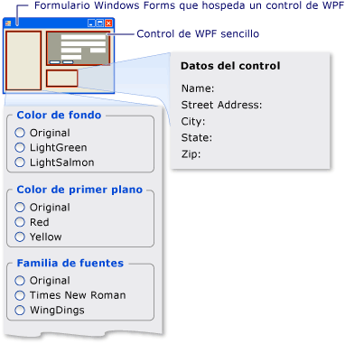

# <a name="walkthrough-hosting-a-wpf-composite-control-in-windows-forms"></a>Tutorial: Hospedar un control compuesto de WPF en formularios Windows Forms
[!INCLUDE[TLA#tla_winclient](../../../../includes/tlasharptla-winclient-md.md)] proporciona un entorno rico para crear aplicaciones. Sin embargo, si tiene una inversión sustancial en [!INCLUDE[TLA#tla_winforms](../../../../includes/tlasharptla-winforms-md.md)] código, puede ser más eficaz ampliar sus [!INCLUDE[TLA#tla_winforms](../../../../includes/tlasharptla-winforms-md.md)] aplicación con [!INCLUDE[TLA2#tla_winclient](../../../../includes/tla2sharptla-winclient-md.md)] en lugar de volver a escribir desde el principio. Un escenario común es cuando se desea incrustar uno o más controles que se implementan con [!INCLUDE[TLA2#tla_winclient](../../../../includes/tla2sharptla-winclient-md.md)] dentro de su [!INCLUDE[TLA2#tla_winforms](../../../../includes/tla2sharptla-winforms-md.md)] aplicación. Para obtener más información acerca de cómo personalizar los controles de WPF, vea [Control personalización](../../../../docs/framework/wpf/controls/control-customization.md).  
  
 Este tutorial le guía a través de una aplicación que hospeda un [!INCLUDE[TLA2#tla_winclient](../../../../includes/tla2sharptla-winclient-md.md)] control compuesto para realizar la entrada de datos en un [!INCLUDE[TLA2#tla_winforms](../../../../includes/tla2sharptla-winforms-md.md)] aplicación. El control compuesto se empaqueta en un archivo DLL. Este procedimiento general se puede extender a aplicaciones y controles más complejos. En este tutorial está diseñado para ser casi idénticos en apariencia y funcionalidad a [Tutorial: hospedar un Control compuesto de Windows Forms en WPF](../../../../docs/framework/wpf/advanced/walkthrough-hosting-a-windows-forms-composite-control-in-wpf.md). La principal diferencia es que se invierte el escenario de hospedaje.  
  
 Este tutorial está dividido en dos secciones. La primera sección describe brevemente la implementación de la [!INCLUDE[TLA2#tla_winclient](../../../../includes/tla2sharptla-winclient-md.md)] control compuesto. La segunda sección analiza en detalle cómo hospedar el control compuesto en una [!INCLUDE[TLA2#tla_winforms](../../../../includes/tla2sharptla-winforms-md.md)] recibir eventos desde el control de aplicación y tener acceso a algunas de las propiedades del control.  
  
 Las tareas ilustradas en este tutorial incluyen:  
  
-   Implementar el control compuesto de WPF.  
  
-   Implementar la aplicación host de Windows Forms.  
  
 Para obtener una lista de código completa de las tareas ilustradas en este tutorial, vea [hospedar un Control compuesto de WPF en Windows Forms muestra](http://go.microsoft.com/fwlink/?LinkID=159996).  
  
## <a name="prerequisites"></a>Requisitos previos  
 Necesita los componentes siguientes para completar este tutorial:  
  
-   [!INCLUDE[vs_dev10_long](../../../../includes/vs-dev10-long-md.md)].  
  
## <a name="implementing-the-wpf-composite-control"></a>Implementar el control compuesto de WPF  
 El [!INCLUDE[TLA2#tla_winclient](../../../../includes/tla2sharptla-winclient-md.md)] control compuesto que se utiliza en este ejemplo es un formulario de entrada de datos simple que toma el nombre y la dirección del usuario. Cuando el usuario hace clic en uno de los dos botones para indicar que la tarea ha finalizado, el control genera un evento personalizado para devolver esa información al host. En la ilustración siguiente se muestra la representación del control.  
  
   
Control compuesto de WPF  
  
### <a name="creating-the-project"></a>Crear el proyecto  
 Para iniciar el proyecto:  
  
1.  Iniciar [!INCLUDE[TLA#tla_visualstu](../../../../includes/tlasharptla-visualstu-md.md)]y abra el **nuevo proyecto** cuadro de diálogo.  
  
2.  En Visual C# y la categoría de Windows, seleccione la **biblioteca de controles de usuario de WPF** plantilla.  
  
3.  Asigne al nuevo proyecto el nombre de `MyControls`.  
  
4.  Para la ubicación, especifique una carpeta de nivel superior con el nombre, como `WindowsFormsHostingWpfControl`. Más tarde, colocará la aplicación host en esta carpeta.  
  
5.  Haga clic en **Aceptar** para crear el proyecto. El proyecto predeterminado contiene un solo control denominado `UserControl1`.  
  
6.  En el Explorador de soluciones, cambie el nombre `UserControl1` a `MyControl1`.  
  
 El proyecto debe tener referencias a los siguientes archivos DLL del sistema. Si alguno de estos archivos DLL no está incluido de forma predeterminada, agréguelos al proyecto.  
  
-   PresentationCore  
  
-   PresentationFramework  
  
-   Sistema  
  
-   WindowsBase  
  
### <a name="creating-the-user-interface"></a>Crear la interfaz de usuario  
 El [!INCLUDE[TLA#tla_ui](../../../../includes/tlasharptla-ui-md.md)] para el control compuesto se implementa con [!INCLUDE[TLA#tla_xaml](../../../../includes/tlasharptla-xaml-md.md)]. El control compuesto [!INCLUDE[TLA2#tla_ui](../../../../includes/tla2sharptla-ui-md.md)] consta de cinco <xref:System.Windows.Controls.TextBox> elementos. Cada <xref:System.Windows.Controls.TextBox> tiene asociado un elemento <xref:System.Windows.Controls.TextBlock> elemento que actúa como una etiqueta. Hay dos <xref:System.Windows.Controls.Button> elementos en la parte inferior, **Aceptar** y **cancelar**. Cuando el usuario hace clic en cualquiera de los botones, el control genera un evento personalizado para devolver la información al host.  
  
#### <a name="basic-layout"></a>Diseño básico  
 Los distintos [!INCLUDE[TLA2#tla_ui](../../../../includes/tla2sharptla-ui-md.md)] elementos se encuentran en un <xref:System.Windows.Controls.Grid> elemento. Puede usar <xref:System.Windows.Controls.Grid> para organizar el contenido de la composición controlar prácticamente la misma forma utilizaría un `Table` elemento de HTML. [!INCLUDE[TLA2#tla_winclient](../../../../includes/tla2sharptla-winclient-md.md)]También tiene un <xref:System.Windows.Documents.Table> elemento, pero <xref:System.Windows.Controls.Grid> es más ligero y más adecuado para las tareas de diseño simple.  
  
 En el siguiente código XAML se muestra el diseño básico. Este código XAML define la estructura general del control especificando el número de columnas y filas de la <xref:System.Windows.Controls.Grid> elemento.  
  
 En MyControl1.xaml, reemplace el código XAML existente por el siguiente código XAML.  
  
 [!code-xaml[WindowsFormsHostingWpfControl#101](../../../../samples/snippets/csharp/VS_Snippets_Wpf/WindowsFormsHostingWpfControl/CSharp/MyControls/Page1.xaml#101)]  
[!code-xaml[WindowsFormsHostingWpfControl#102](../../../../samples/snippets/csharp/VS_Snippets_Wpf/WindowsFormsHostingWpfControl/CSharp/MyControls/Page1.xaml#102)]  
  
#### <a name="adding-textblock-and-textbox-elements-to-the-grid"></a>Agregar elementos TextBlock y TextBox a la cuadrícula  
 Se coloca un [!INCLUDE[TLA2#tla_ui](../../../../includes/tla2sharptla-ui-md.md)] elemento en la cuadrícula estableciendo el elemento <xref:System.Windows.Controls.Grid.RowProperty> y <xref:System.Windows.Controls.Grid.ColumnProperty> atributos con el número adecuado de filas y columnas. Recuerde que la numeración de filas y columnas está basada en ceros. Puede hacer que un elemento abarque varias columnas estableciendo su <xref:System.Windows.Controls.Grid.ColumnSpanProperty> atributo. Para obtener más información acerca de <xref:System.Windows.Controls.Grid> elementos, consulte [crear un elemento de cuadrícula](../../../../docs/framework/wpf/controls/how-to-create-a-grid-element.md).  
  
 El código XAML siguiente muestra el control compuesto <xref:System.Windows.Controls.TextBox> y <xref:System.Windows.Controls.TextBlock> elementos con sus <xref:System.Windows.Controls.Grid.RowProperty> y <xref:System.Windows.Controls.Grid.ColumnProperty> atributos, que se establecen para colocar correctamente los elementos en la cuadrícula.  
  
 En MyControl1.xaml, agregue el siguiente código XAML dentro de la <xref:System.Windows.Controls.Grid> elemento.  
  
 [!code-xaml[WindowsFormsHostingWpfControl#103](../../../../samples/snippets/csharp/VS_Snippets_Wpf/WindowsFormsHostingWpfControl/CSharp/MyControls/Page1.xaml#103)]  
  
#### <a name="styling-the-ui-elements"></a>Aplicar estilos a los elementos de interfaz de usuario  
 Muchos de los elementos del formulario de entrada de datos tienen un aspecto similar, lo que significa que tienen valores idénticos para varias de sus propiedades. En lugar de establecer los atributos de cada elemento por separado, se usa el XAML anterior <xref:System.Windows.Style> elementos para definir valores de propiedad estándar para las clases de elementos. Este enfoque reduce la complejidad del control y le permite cambiar la apariencia de varios elementos mediante un solo atributo de estilo.  
  
 El <xref:System.Windows.Style> elementos se incluyen en el <xref:System.Windows.Controls.Grid> del elemento <xref:System.Windows.FrameworkElement.Resources%2A> propiedad, por lo que pueden ser usados por todos los elementos en el control. Si se denomina un estilo, se aplica a un elemento mediante la adición de un <xref:System.Windows.Style> elemento establecido en el nombre del estilo. Los estilos que no tienen nombre se convierten en el estilo predeterminado del elemento. Para obtener más información acerca de [!INCLUDE[TLA2#tla_winclient](../../../../includes/tla2sharptla-winclient-md.md)] estilos, consulte [estilos y plantillas](../../../../docs/framework/wpf/controls/styling-and-templating.md).  
  
 El XAML siguiente se muestra el <xref:System.Windows.Style> elementos para el control compuesto. Para ver cómo se aplican los estilos a los elementos, vea el código XAML anterior. Por ejemplo, la última <xref:System.Windows.Controls.TextBlock> elemento tiene el `inlineText` estilo y el último <xref:System.Windows.Controls.TextBox> elemento utiliza el estilo predeterminado.  
  
 En MyControl1.xaml, agregue el código XAML siguiente justo después del <xref:System.Windows.Controls.Grid> elemento de inicio.  
  
 [!code-xaml[WindowsFormsHostingWpfControl#104](../../../../samples/snippets/csharp/VS_Snippets_Wpf/WindowsFormsHostingWpfControl/CSharp/MyControls/Page1.xaml#104)]  
  
#### <a name="adding-the-ok-and-cancel-buttons"></a>Agregar los botones Aceptar y Cancelar  
 Los elementos en el control compuesto finales son el **Aceptar** y **cancelar** <xref:System.Windows.Controls.Button> elementos, que se ocupan de las dos primeras columnas de la última fila de la <xref:System.Windows.Controls.Grid>. Estos elementos utilizan un controlador de evento comunes, `ButtonClicked`y el valor predeterminado <xref:System.Windows.Controls.Button> estilo definido en el XAML anterior.  
  
 En MyControl1.xaml, agregue el código XAML siguiente después de la última <xref:System.Windows.Controls.TextBox> elemento. El [!INCLUDE[TLA2#tla_xaml](../../../../includes/tla2sharptla-xaml-md.md)] parte del control compuesto ahora está completa.  
  
 [!code-xaml[WindowsFormsHostingWpfControl#105](../../../../samples/snippets/csharp/VS_Snippets_Wpf/WindowsFormsHostingWpfControl/CSharp/MyControls/Page1.xaml#105)]  
  
### <a name="implementing-the-code-behind-file"></a>Implementar el archivo de código subyacente  
 El archivo de código subyacente, MyControl1.xaml.cs, implementa tres tareas esenciales:
  
1.  Controla el evento que se produce cuando el usuario hace clic en uno de los botones.  
  
2.  Recupera los datos de la <xref:System.Windows.Controls.TextBox> elementos y los empaqueta en un objeto de argumento de evento personalizado.  
  
3.  Genera personalizado `OnButtonClick` evento, que notifica al host que el usuario haya finalizado y pasa los datos de nuevo al host.  
  
 El control también expone una serie de propiedades de color y fuente con las que puede cambiar la apariencia. A diferencia de la <xref:System.Windows.Forms.Integration.WindowsFormsHost> (clase), que se usa al host una [!INCLUDE[TLA2#tla_winforms](../../../../includes/tla2sharptla-winforms-md.md)] (control), el <xref:System.Windows.Forms.Integration.ElementHost> clase expone el control <xref:System.Windows.Controls.Panel.Background%2A> solo para la propiedad. Para mantener la similitud entre este ejemplo de código y el ejemplo tratado en [Tutorial: hospedar un Control compuesto de Windows Forms en WPF](../../../../docs/framework/wpf/advanced/walkthrough-hosting-a-windows-forms-composite-control-in-wpf.md), el control expone las propiedades restantes directamente.  
  
#### <a name="the-basic-structure-of-the-code-behind-file"></a>Estructura básica del archivo de código subyacente  
 El archivo de código subyacente está formada por un único espacio de nombres, `MyControls`, que contendrá dos clases, `MyControl1` y `MyControlEventArgs`.  
  
```  
namespace MyControls  
{  
  public partial class MyControl1 : Grid  
  {  
    //...  
  }  
  public class MyControlEventArgs : EventArgs  
  {  
    //...  
  }  
}  
```  
  
 La primera clase, `MyControl1`, es una clase parcial que contiene el código que implementa la funcionalidad de la [!INCLUDE[TLA2#tla_ui](../../../../includes/tla2sharptla-ui-md.md)] definido en MyControl1.xaml. Cuando se analiza MyControl1.xaml, el [!INCLUDE[TLA2#tla_xaml](../../../../includes/tla2sharptla-xaml-md.md)] se convierte en la misma clase parcial, y las dos clases parciales se combinan para formar el control compilado. Por este motivo, el nombre de clase del archivo de código subyacente debe coincidir con el nombre de clase asignado a MyControl1.xaml y debe heredar del elemento raíz del control. La segunda clase, `MyControlEventArgs`, es una clase de argumentos de evento que se usa para enviar los datos de nuevo al host.  
  
 Abra MyControl1.xaml.cs. Cambie la declaración de clase existente, por lo que tiene el siguiente nombre y hereda de <xref:System.Windows.Controls.Grid>.  
  
 [!code-csharp[WindowsFormsHostingWpfControl#21](../../../../samples/snippets/csharp/VS_Snippets_Wpf/WindowsFormsHostingWpfControl/CSharp/MyControls/Page1.xaml.cs#21)]  
  
#### <a name="initializing-the-control"></a>Inicializar el control  
 En el código siguiente se implementan varias tareas básicas:  
  
-   Declara un evento privado, `OnButtonClick`y su delegado asociado, `MyControlEventHandler`.  
  
-   Crea distintas variables globales privadas que almacenan los datos del usuario. Estos datos se exponen a través de las propiedades correspondientes.  
  
-   Implementa un controlador, `Init`, para el control <xref:System.Windows.FrameworkElement.Loaded> eventos. Este controlador inicializa las variables globales al asignarles los valores definidos en MyControl1.xaml. Para ello, usa el <xref:System.Windows.FrameworkElement.Name%2A> asignado a típico <xref:System.Windows.Controls.TextBlock> elemento, `nameLabel`para tener acceso a los valores de propiedades de ese elemento.  
  
 Elimine el constructor existente y agregue el código siguiente a su `MyControl1` clase.  
  
 [!code-csharp[WindowsFormsHostingWpfControl#11](../../../../samples/snippets/csharp/VS_Snippets_Wpf/WindowsFormsHostingWpfControl/CSharp/MyControls/Page1.xaml.cs#11)]  
  
#### <a name="handling-the-buttons-click-events"></a>Administrar los eventos de clic de los botones  
 El usuario indica que la tarea de entrada de datos ha finalizado haciendo clic en el **Aceptar** botón o **cancelar** botón. Ambos botones utilizan el mismo <xref:System.Windows.Controls.Primitives.ButtonBase.Click> controlador de eventos, `ButtonClicked`. Ambos botones tienen un nombre, `btnOK` o `btnCancel`, que permite que el controlador determinar qué botón se hizo clic examinando el valor de la `sender` argumento. El controlador hace lo siguiente:  
  
-   Crea un `MyControlEventArgs` objeto que contiene los datos de la <xref:System.Windows.Controls.TextBox> elementos.  
  
-   Si el usuario hace clic en el **cancelar** botón conjuntos el `MyControlEventArgs` del objeto `IsOK` propiedad `false`.  
  
-   Genera el `OnButtonClick` evento para indicar al host que el usuario ha terminado y fases de realizar copias de los datos recopilados.  
  
 Agregue el código siguiente a su `MyControl1` clase, después la `Init` método.  
  
 [!code-csharp[WindowsFormsHostingWpfControl#12](../../../../samples/snippets/csharp/VS_Snippets_Wpf/WindowsFormsHostingWpfControl/CSharp/MyControls/Page1.xaml.cs#12)]  
  
#### <a name="creating-properties"></a>Crear propiedades  
 El resto de la clase simplemente expone propiedades que corresponden a las variables globales que se han descrito anteriormente. Cuando se cambia una propiedad, el descriptor de acceso set modifica el aspecto del control cambiando las propiedades de elemento correspondientes y actualizando las variables globales subyacentes.  
  
 Agregue el código siguiente a su `MyControl1` clase.  
  
 [!code-csharp[WindowsFormsHostingWpfControl#13](../../../../samples/snippets/csharp/VS_Snippets_Wpf/WindowsFormsHostingWpfControl/CSharp/MyControls/Page1.xaml.cs#13)]  
  
#### <a name="sending-the-data-back-to-the-host"></a>Devolver los datos al host  
 El último componente en el archivo es el `MyControlEventArgs` (clase), que se usa para enviar los datos recopilados en el host.  
  
 Agregue el código siguiente a su `MyControls` espacio de nombres. La implementación es sencilla, por lo que no se tratará más adelante.  
  
 [!code-csharp[WindowsFormsHostingWpfControl#14](../../../../samples/snippets/csharp/VS_Snippets_Wpf/WindowsFormsHostingWpfControl/CSharp/MyControls/Page1.xaml.cs#14)]  
  
 Compile la solución. La compilación generará un archivo DLL denominado MyControls.dll.  
  
<a name="winforms_host_section"></a>   
## <a name="implementing-the-windows-forms-host-application"></a>Implementar la aplicación host de Windows Forms  
 El [!INCLUDE[TLA2#tla_winforms](../../../../includes/tla2sharptla-winforms-md.md)] hospedar la aplicación usa un <xref:System.Windows.Forms.Integration.ElementHost> objeto al host la [!INCLUDE[TLA2#tla_winclient](../../../../includes/tla2sharptla-winclient-md.md)] control compuesto. Los identificadores de aplicación el `OnButtonClick` eventos para recibir los datos desde el control compuesto. La aplicación también tiene un conjunto de botones de opción que se pueden usar para modificar la apariencia del control. En la siguiente ilustración se muestra la aplicación.  
  
   
Control compuesto de WPF hospedado en una aplicación de Windows Forms  
  
### <a name="creating-the-project"></a>Crear el proyecto  
 Para iniciar el proyecto:  
  
1.  Iniciar [!INCLUDE[TLA2#tla_visualstu](../../../../includes/tla2sharptla-visualstu-md.md)]y abra el **nuevo proyecto** cuadro de diálogo.  
  
2.  En Visual C# y la categoría de Windows, seleccione la **aplicación de Windows Forms** plantilla.  
  
3.  Asigne al nuevo proyecto el nombre de `WFHost`.  
  
4.  Para la ubicación, especifique la misma carpeta de nivel superior que contiene el proyecto MyControls.  
  
5.  Haga clic en **Aceptar** para crear el proyecto.  
  
 También debe agregar referencias a la DLL que contiene `MyControl1` y otros ensamblados.  
  
1.  Haga clic en el nombre del proyecto en el Explorador de soluciones y seleccione **Agregar referencia**.  
  
2.  Haga clic en el **examinar** pestaña y vaya a la carpeta que contiene MyControls.dll. En este tutorial, esta carpeta es MyControls\bin\Debug.  
  
3.  Seleccione MyControls.dll y, a continuación, haga clic en **Aceptar**.  
  
4.  Agregue referencias a los ensamblados siguientes.  
  
    -   PresentationCore  
  
    -   PresentationFramework  
  
    -   System.Xaml  
  
    -   WindowsBase  
  
    -   WindowsFormsIntegration  
  
### <a name="implementing-the-user-interface-for-the-application"></a>Implementar la interfaz de usuario de la aplicación  
 La interfaz de usuario de la aplicación de Windows Forms contiene varios controles para interactuar con el control compuesto de WPF.  
  
1.  Abra Form1 en el Diseñador de Windows Forms.  
  
2.  Amplíe el formulario para que quepan los controles.  
  
3.  En la esquina superior derecha del formulario, agregue un <xref:System.Windows.Forms.Panel?displayProperty=nameWithType> control para contener el [!INCLUDE[TLA2#tla_winclient](../../../../includes/tla2sharptla-winclient-md.md)] control compuesto.  
  
4.  Agregue las siguientes <xref:System.Windows.Forms.GroupBox?displayProperty=nameWithType> controles al formulario.  
  
    |nombre|Texto|  
    |----------|----------|  
    |groupBox1|Color de fondo|  
    |groupBox2|Color de primer plano|  
    |groupBox3|Tamaño de fuente|  
    |groupBox4|Familia de fuentes|  
    |groupBox5|Estilo de fuente|  
    |groupBox6|Espesor de fuente|  
    |groupBox7|Datos del control|  
  
5.  Agregue el siguiente <xref:System.Windows.Forms.RadioButton?displayProperty=nameWithType> controles a la <xref:System.Windows.Forms.GroupBox?displayProperty=nameWithType> controles.  
  
    |GroupBox|nombre|Texto|  
    |--------------|----------|----------|  
    |groupBox1|radioBackgroundOriginal|Original|  
    |groupBox1|radioBackgroundLightGreen|LightGreen|  
    |groupBox1|radioBackgroundLightSalmon|LightSalmon|  
    |groupBox2|radioForegroundOriginal|Original|  
    |groupBox2|radioForegroundRed|Rojo|  
    |groupBox2|radioForegroundYellow|Amarillo|  
    |groupBox3|radioSizeOriginal|Original|  
    |groupBox3|radioSizeTen|10|  
    |groupBox3|radioSizeTwelve|12|  
    |groupBox4|radioFamilyOriginal|Original|  
    |groupBox4|radioFamilyTimes|Times New Roman|  
    |groupBox4|radioFamilyWingDings|WingDings|  
    |groupBox5|radioStyleOriginal|Normal|  
    |groupBox5|radioStyleItalic|Cursiva|  
    |groupBox6|radioWeightOriginal|Original|  
    |groupBox6|radioWeightBold|Negrita|  
  
6.  Agregue el siguiente <xref:System.Windows.Forms.Label?displayProperty=nameWithType> controla hasta el último <xref:System.Windows.Forms.GroupBox?displayProperty=nameWithType>. Estos controles muestran los datos devueltos por el [!INCLUDE[TLA2#tla_winclient](../../../../includes/tla2sharptla-winclient-md.md)] control compuesto.  
  
    |GroupBox|nombre|Texto|  
    |--------------|----------|----------|  
    |groupBox7|lblName|Nombre:|  
    |groupBox7|lblAddress|Dirección postal:|  
    |groupBox7|lblCity|Ciudad:|  
    |groupBox7|lblState|Estado:|  
    |groupBox7|lblZip|Código postal:|  
  
### <a name="initializing-the-form"></a>Inicializar el formulario  
 Generalmente, implementará el código de hospedaje en el formulario <xref:System.Windows.Forms.Form.Load> controlador de eventos. El código siguiente muestra el <xref:System.Windows.Forms.Form.Load> controlador de eventos, un controlador para el [!INCLUDE[TLA2#tla_winclient](../../../../includes/tla2sharptla-winclient-md.md)] control compuesto <xref:System.Windows.FrameworkElement.Loaded> eventos y declaraciones para varias variables globales que se utilizan más adelante.  
  
 En el Diseñador de Windows Forms, haga doble clic en el formulario para crear un <xref:System.Windows.Forms.Form.Load> controlador de eventos. En la parte superior del archivo Form1.cs, agregue las siguientes `using` instrucciones.  
  
 [!code-csharp[WindowsFormsHostingWpfControl#10](../../../../samples/snippets/csharp/VS_Snippets_Wpf/WindowsFormsHostingWpfControl/CSharp/WFHost/Form1.cs#10)]  
  
 Reemplace el contenido de la existente `Form1` clase con el código siguiente.  
  
 [!code-csharp[WindowsFormsHostingWpfControl#2](../../../../samples/snippets/csharp/VS_Snippets_Wpf/WindowsFormsHostingWpfControl/CSharp/WFHost/Form1.cs#2)]  
  
 El `Form1_Load` método en el código anterior muestra el procedimiento general para hospedar un [!INCLUDE[TLA2#tla_winclient](../../../../includes/tla2sharptla-winclient-md.md)] control:  
  
1.  Crear un nuevo <xref:System.Windows.Forms.Integration.ElementHost> objeto.  
  
2.  Establecer el control <xref:System.Windows.Forms.Control.Dock%2A> propiedad <xref:System.Windows.Forms.DockStyle.Fill?displayProperty=nameWithType>.  
  
3.  Agregar el <xref:System.Windows.Forms.Integration.ElementHost> el control a la <xref:System.Windows.Forms.Panel> del control <xref:System.Windows.Forms.Control.Controls%2A> colección.  
  
4.  Cree una instancia de la [!INCLUDE[TLA2#tla_winclient](../../../../includes/tla2sharptla-winclient-md.md)] control.  
  
5.  Hospedar el control compuesto en el formulario asignando el control a la <xref:System.Windows.Forms.Integration.ElementHost> del control <xref:System.Windows.Forms.Integration.ElementHost.Child%2A> propiedad.  
  
 Las dos líneas restantes en el `Form1_Load` método asocian controladores a dos eventos de control:  
  
-   `OnButtonClick`es un evento personalizado que se activa el control compuesto cuando el usuario hace clic en el **Aceptar** o **cancelar** botón. El evento se controla para obtener la respuesta del usuario y recopilar los datos que este haya especificado.  
  
-   <xref:System.Windows.FrameworkElement.Loaded>es un evento estándar que se genera mediante una [!INCLUDE[TLA2#tla_winclient](../../../../includes/tla2sharptla-winclient-md.md)] controlar cuando se ha cargado completamente. El evento se usa aquí porque el ejemplo necesita inicializar distintas variables globales usando las propiedades del control. En el momento de la forma <xref:System.Windows.Forms.Form.Load> eventos, el control no está totalmente cargado y esos valores todavía están establecidos en `null`. Tenga que esperar hasta que el control <xref:System.Windows.FrameworkElement.Loaded> evento tiene lugar antes de que puede tener acceso a esas propiedades.  
  
 El <xref:System.Windows.FrameworkElement.Loaded> controlador de eventos se muestra en el código anterior. El `OnButtonClick` controlador se describe en la sección siguiente.  
  
### <a name="handling-onbuttonclick"></a>Administrar OnButtonClick  
 El `OnButtonClick` evento tiene lugar cuando el usuario hace clic en el **Aceptar** o **cancelar** botón.  
  
 El controlador de eventos comprueba el argumento de evento `IsOK` campo para determinar qué botón se hizo clic. El `lbl` *datos* variables corresponden a la <xref:System.Windows.Forms.Label> controles mencionados anteriormente. Si el usuario hace clic en el **Aceptar** botón, los datos procedentes del control <xref:System.Windows.Controls.TextBox> controles se asigna a la correspondiente <xref:System.Windows.Forms.Label> control. Si el usuario hace clic en **cancelar**, el <xref:System.Windows.Forms.Label.Text%2A> valores se establecen en las cadenas de manera predeterminada.  
  
 Agregue el siguiente botón haga clic en el código del controlador de eventos para el `Form1` clase.  
  
 [!code-csharp[WindowsFormsHostingWpfControl#3](../../../../samples/snippets/csharp/VS_Snippets_Wpf/WindowsFormsHostingWpfControl/CSharp/WFHost/Form1.cs#3)]  
  
 Compile y ejecute la aplicación. Agregar texto en el control compuesto de WPF y, a continuación, haga clic en **Aceptar**. El texto aparece en las etiquetas. En este momento, no se ha agregado código para controlar los botones de radio.  
  
### <a name="modifying-the-appearance-of-the-control"></a>Modificar la apariencia del control  
 El <xref:System.Windows.Forms.RadioButton> controles del formulario permitirá al usuario cambiar la [!INCLUDE[TLA2#tla_winclient](../../../../includes/tla2sharptla-winclient-md.md)] colores de fondo y primer plano del control compuesto, así como varias propiedades de fuente. El color de fondo se expone mediante el <xref:System.Windows.Forms.Integration.ElementHost> objeto. Las propiedades restantes se exponen como propiedades personalizadas del control.  
  
 Haga doble clic en cada uno de ellos <xref:System.Windows.Forms.RadioButton> control en el formulario para crear <xref:System.Windows.Forms.RadioButton.CheckedChanged> controladores de eventos. Reemplace el <xref:System.Windows.Forms.RadioButton.CheckedChanged> controladores de eventos con el código siguiente.  
  
 [!code-csharp[WindowsFormsHostingWpfControl#4](../../../../samples/snippets/csharp/VS_Snippets_Wpf/WindowsFormsHostingWpfControl/CSharp/WFHost/Form1.cs#4)]  
  
 Compile y ejecute la aplicación. Haga clic en los diferentes botones de radio para ver el efecto en el control compuesto de WPF.  
  
## <a name="see-also"></a>Vea también  
 <xref:System.Windows.Forms.Integration.ElementHost>  
 <xref:System.Windows.Forms.Integration.WindowsFormsHost>  
 [WPF Designer](http://msdn.microsoft.com/library/c6c65214-8411-4e16-b254-163ed4099c26)  
 [Tutorial: Hospedar un control compuesto de formularios Windows Forms en WPF](../../../../docs/framework/wpf/advanced/walkthrough-hosting-a-windows-forms-composite-control-in-wpf.md)  
 [Tutorial: Hospedar un control compuesto 3D de WPF en Windows Forms](../../../../docs/framework/wpf/advanced/walkthrough-hosting-a-3-d-wpf-composite-control-in-windows-forms.md)
