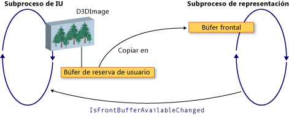

# Interoperabilidad entre WPF y Direct3D9
Puede incluir contenido de Direct3D9 en una aplicación Windows Presentation Foundation (WPF). En este tema se describe cómo crear contenido de Direct3D9 para que interopere eficazmente con WPF.  
  
> [!NOTE]
> Al usar el contenido de Direct3D9 en WPF, también debe pensar en el rendimiento. Para obtener más información sobre cómo optimizar el rendimiento, vea [consideraciones de rendimiento para la interoperabilidad de Direct3D9 y WPF](performance-considerations-for-direct3d9-and-wpf-interoperability.md).  
  
## Mostrar búferes  
 La clase <xref:System.Windows.Interop.D3DImage> administra dos búferes de presentación, que se denominan *búfer de reserva* y el *búfer frontal*. El búfer de reserva es la superficie de Direct3D9. Los cambios en el búfer de reserva se copian hacia delante en el búfer frontal cuando se llama al método <xref:System.Windows.Interop.D3DImage.Unlock%2A>.  
  
 En la ilustración siguiente se muestra la relación entre el búfer de reserva y el búfer frontal.  
  
   
  
## Creación de dispositivos de Direct3D9  
 Para representar el contenido de Direct3D9, debe crear un dispositivo de Direct3D9. Hay dos objetos de Direct3D9 que puede usar para crear un dispositivo, `IDirect3D9` y `IDirect3D9Ex`. Utilice estos objetos para crear `IDirect3DDevice9` y `IDirect3DDevice9Ex` dispositivos, respectivamente.  
  
 Cree un dispositivo mediante una llamada a uno de los métodos siguientes.  
  
- `IDirect3D9 * Direct3DCreate9(UINT SDKVersion);`  
  
- `HRESULT Direct3DCreate9Ex(UINT SDKVersion, IDirect3D9Ex **ppD3D);`  
  
 En el sistema operativo Windows Vista o posterior, use el método `Direct3DCreate9Ex` con una pantalla que esté configurada para usar el modelo de controladores de pantalla de Windows (WDDM). Use el método `Direct3DCreate9` en cualquier otra plataforma.  
  
### Disponibilidad del método Direct3DCreate9Ex  
 D3d9. dll tiene el método `Direct3DCreate9Ex` solo en Windows Vista o un sistema operativo posterior. Si vincula directamente la función en Windows XP, la aplicación no se carga. Para determinar si se admite el método `Direct3DCreate9Ex`, cargue el archivo DLL y busque la dirección del procedimiento. En el código siguiente se muestra cómo probar el método `Direct3DCreate9Ex`. Para obtener un ejemplo de código completo, vea [Tutorial: crear contenido de Direct3D9 para hospedarlo en WPF](walkthrough-creating-direct3d9-content-for-hosting-in-wpf.md).  
  
 [!code-cpp[System.Windows.Interop.D3DImage#RendererManager_EnsureD3DObjects](~/samples/snippets/cpp/VS_Snippets_Wpf/System.Windows.Interop.D3DImage/cpp/renderermanager.cpp#renderermanager_ensured3dobjects)]  
  
### Creación de HWND  
 La creación de un dispositivo requiere un HWND. En general, se crea un HWND ficticio para que lo use Direct3D9. En el ejemplo de código siguiente se muestra cómo crear un HWND ficticio.  
  
 [!code-cpp[System.Windows.Interop.D3DImage#RendererManager_EnsureHWND](~/samples/snippets/cpp/VS_Snippets_Wpf/System.Windows.Interop.D3DImage/cpp/renderermanager.cpp#renderermanager_ensurehwnd)]  
  
### Presentar parámetros  
 La creación de un dispositivo también requiere una `D3DPRESENT_PARAMETERS` struct, pero solo algunos parámetros son importantes. Estos parámetros se eligen para minimizar la superficie de memoria.  
  
 Establezca los campos `BackBufferHeight` y `BackBufferWidth` en 1. Si se establece en 0, se establecen en las dimensiones del HWND.  
  
 Establezca siempre las marcas `D3DCREATE_MULTITHREADED` y `D3DCREATE_FPU_PRESERVE` para evitar que se dañe la memoria usada por Direct3D9 y para impedir que Direct3D9 cambie la configuración de FPU.  
  
 En el código siguiente se muestra cómo inicializar el `D3DPRESENT_PARAMETERS` struct.  
  
 [!code-cpp[System.Windows.Interop.D3DImage#Renderer_Init](~/samples/snippets/cpp/VS_Snippets_Wpf/System.Windows.Interop.D3DImage/cpp/renderer.cpp#renderer_init)]  
  
## Crear el destino de representación del búfer de reserva  
 Para mostrar el contenido de Direct3D9 en una <xref:System.Windows.Interop.D3DImage>, cree una superficie de Direct3D9 y asígnela llamando al método <xref:System.Windows.Interop.D3DImage.SetBackBuffer%2A>.  
  
### Comprobando la compatibilidad del adaptador  
 Antes de crear una superficie, compruebe que todos los adaptadores admiten las propiedades de la superficie que necesite. Incluso si solo se representa en un adaptador, la ventana de WPF se puede mostrar en cualquier adaptador del sistema. Siempre debe escribir código de Direct3D9 que controle las configuraciones de varios adaptadores y debe comprobar la compatibilidad de todos los adaptadores, ya que WPF puede trasladar la superficie entre los adaptadores disponibles.  
  
 En el ejemplo de código siguiente se muestra cómo comprobar todos los adaptadores del sistema para la compatibilidad con Direct3D9.  
  
 [!code-cpp[System.Windows.Interop.D3DImage#RendererManager_TestSurfaceSettings](~/samples/snippets/cpp/VS_Snippets_Wpf/System.Windows.Interop.D3DImage/cpp/renderermanager.cpp#renderermanager_testsurfacesettings)]  
  
### Crear la superficie  
 Antes de crear una superficie, compruebe que las funcionalidades del dispositivo admiten un buen rendimiento en el sistema operativo de destino. Para obtener más información, vea [consideraciones de rendimiento para la interoperabilidad de Direct3D9 y WPF](performance-considerations-for-direct3d9-and-wpf-interoperability.md).  
  
 Una vez comprobadas las funcionalidades del dispositivo, puede crear la superficie. En el ejemplo de código siguiente se muestra cómo crear el destino de representación.  
  
 [!code-cpp[System.Windows.Interop.D3DImage#Renderer_CreateSurface](~/samples/snippets/cpp/VS_Snippets_Wpf/System.Windows.Interop.D3DImage/cpp/renderer.cpp#renderer_createsurface)]  
  
### WDDM  
 En Windows Vista y sistemas operativos posteriores, que están configurados para usar el WDDM, puede crear una textura de destino de representación y pasar la superficie de nivel 0 al método <xref:System.Windows.Interop.D3DImage.SetBackBuffer%2A>. No se recomienda este enfoque en Windows XP, ya que no se puede crear una textura de destino de representación bloqueada y se reducirá el rendimiento.  
  
## Controlar el estado del dispositivo  
 La clase <xref:System.Windows.Interop.D3DImage> administra dos búferes de presentación, que se denominan *búfer de reserva* y el *búfer frontal*. El búfer de reserva es la superficie de Direct3D.  Los cambios en el búfer de reserva se copian hacia delante en el búfer frontal cuando se llama al método <xref:System.Windows.Interop.D3DImage.Unlock%2A>, donde se muestra en el hardware. En ocasiones, el búfer frontal deja de estar disponible. Esta falta de disponibilidad puede estar causada por un bloqueo de pantalla, aplicaciones de Direct3D exclusivas de pantalla completa, cambio de usuario u otras actividades del sistema. Cuando esto ocurre, se notifica a la aplicación de WPF mediante el control del evento de <xref:System.Windows.Interop.D3DImage.IsFrontBufferAvailableChanged>.  El modo en que la aplicación responde al búfer Front que no está disponible depende de si WPF está habilitado para revertirse a la representación de software. El método <xref:System.Windows.Interop.D3DImage.SetBackBuffer%2A> tiene una sobrecarga que toma un parámetro que especifica si WPF recurre a la representación de software.  
  
 Cuando se llama a la sobrecarga <xref:System.Windows.Interop.D3DImage.SetBackBuffer%28System.Windows.Interop.D3DResourceType%2CSystem.IntPtr%29> o se llama a la sobrecarga de <xref:System.Windows.Interop.D3DImage.SetBackBuffer%28System.Windows.Interop.D3DResourceType%2CSystem.IntPtr%2CSystem.Boolean%29> con el parámetro `enableSoftwareFallback` establecido en `false`, el sistema de representación libera su referencia al búfer de reserva cuando el búfer frontal deja de estar disponible y no se muestra nada. Cuando el búfer frontal vuelve a estar disponible, el sistema de representación genera el evento <xref:System.Windows.Interop.D3DImage.IsFrontBufferAvailableChanged> para notificar a la aplicación WPF.  Puede crear un controlador de eventos para que el evento <xref:System.Windows.Interop.D3DImage.IsFrontBufferAvailableChanged> reinicie la representación con una superficie de Direct3D válida. Para reiniciar la representación, debe llamar a <xref:System.Windows.Interop.D3DImage.SetBackBuffer%2A>.  
  
 Cuando se llama a la sobrecarga <xref:System.Windows.Interop.D3DImage.SetBackBuffer%28System.Windows.Interop.D3DResourceType%2CSystem.IntPtr%2CSystem.Boolean%29> con el parámetro `enableSoftwareFallback` establecido en `true`, el sistema de representación conserva su referencia al búfer de reserva cuando el búfer frontal deja de estar disponible, por lo que no es necesario llamar a <xref:System.Windows.Interop.D3DImage.SetBackBuffer%2A> cuando el búfer frontal vuelve a estar disponible.  
  
 Cuando se habilita la representación de software, puede haber situaciones en las que el dispositivo del usuario deje de estar disponible, pero el sistema de representación conservará una referencia a la superficie de Direct3D. Para comprobar si un dispositivo de Direct3D9 no está disponible, llame al método `TestCooperativeLevel`. Para comprobar que los dispositivos Direct3D9Ex llamen al método `CheckDeviceState`, porque el método `TestCooperativeLevel` está en desuso y siempre devuelve SUCCESS. Si el dispositivo de usuario ha dejado de estar disponible, llame a <xref:System.Windows.Interop.D3DImage.SetBackBuffer%2A> para liberar la referencia de WPF al búfer de reserva.  Si necesita restablecer el dispositivo, llame a <xref:System.Windows.Interop.D3DImage.SetBackBuffer%2A> con el parámetro `backBuffer` establecido en `null`y, a continuación, vuelva a llamar a <xref:System.Windows.Interop.D3DImage.SetBackBuffer%2A> con `backBuffer` establecido en una superficie de Direct3D válida.  
  
 Llame al método `Reset` para recuperarse de un dispositivo no válido solo si implementa la compatibilidad con varios adaptadores. De lo contrario, libere todas las interfaces de Direct3D9 y vuelva a crearlas completamente. Si el diseño del adaptador ha cambiado, los objetos de Direct3D9 creados antes del cambio no se actualizan.  
  
## Controlar el cambio de tamaño  
 Si se muestra un <xref:System.Windows.Interop.D3DImage> en una resolución distinta de su tamaño nativo, se escala según el <xref:System.Windows.Media.RenderOptions.BitmapScalingMode%2A>actual, salvo que <xref:System.Windows.Media.Effects.SamplingMode.Bilinear> se sustituye por <xref:System.Windows.Media.BitmapScalingMode.Fant>.  
  
 Si necesita una mayor fidelidad, debe crear una nueva superficie cuando el contenedor del <xref:System.Windows.Interop.D3DImage> cambie de tamaño.  
  
 Hay tres enfoques posibles para controlar el cambio de tamaño.  
  
- Participar en el sistema de diseño y crear una nueva superficie cuando cambia el tamaño. No cree demasiadas superficies, ya que puede agotar o fragmentar la memoria de vídeo.  
  
- Espere hasta que no se haya producido un evento de redimensionamiento durante un período de tiempo fijo para crear la nueva superficie.  
  
- Cree una <xref:System.Windows.Threading.DispatcherTimer> que compruebe las dimensiones del contenedor varias veces por segundo.  
  
## Optimización de varios monitores  
 Se puede producir un rendimiento considerablemente menor si el sistema de representación mueve una <xref:System.Windows.Interop.D3DImage> a otro monitor.  
  
 En el WDDM, siempre que los monitores estén en la misma tarjeta de vídeo y use `Direct3DCreate9Ex`, no hay ninguna reducción del rendimiento. Si los monitores se encuentran en tarjetas de vídeo independientes, se reduce el rendimiento. En Windows XP, el rendimiento siempre se reduce.  
  
 Cuando el <xref:System.Windows.Interop.D3DImage> se mueve a otro monitor, puede crear una nueva superficie en el adaptador correspondiente para restaurar un buen rendimiento.  
  
 Para evitar la reducción del rendimiento, escriba el código específicamente para el caso de varios monitores. La lista siguiente muestra una manera de escribir código de varios monitores.  
  
1. Busque un punto del <xref:System.Windows.Interop.D3DImage> en el espacio de pantalla con el método `Visual.ProjectToScreen`.  
  
2. Use el método `MonitorFromPoint` GDI para buscar el monitor que muestra el punto.  
  
3. Utilice el método `IDirect3D9::GetAdapterMonitor` para buscar el adaptador de Direct3D9 en el que se encuentra el monitor.  
  
4. Si el adaptador no es el mismo que el adaptador con el búfer de reserva, cree un nuevo búfer de reserva en el nuevo monitor y asígnelo al <xref:System.Windows.Interop.D3DImage> búfer de reserva.  
  
> [!NOTE]
> Si el <xref:System.Windows.Interop.D3DImage> a los monitores, el rendimiento será lento, excepto en el caso de WDDM y `IDirect3D9Ex` en el mismo adaptador. No hay ninguna manera de mejorar el rendimiento en esta situación.  
  
 En el ejemplo de código siguiente se muestra cómo buscar el monitor actual.  
  
 [!code-cpp[System.Windows.Interop.D3DImage#RendererManager_SetAdapter](~/samples/snippets/cpp/VS_Snippets_Wpf/System.Windows.Interop.D3DImage/cpp/renderermanager.cpp#renderermanager_setadapter)]  
  
 Actualice el monitor cuando cambie el tamaño o la posición del contenedor <xref:System.Windows.Interop.D3DImage>, o actualice el monitor mediante un `DispatcherTimer` que se actualice varias veces por segundo.  
  
## Representación de software de WPF  
 WPF se representa sincrónicamente en el subproceso de la interfaz de usuario en el software en las siguientes situaciones.  
  
- Impresión  
  
- <xref:System.Windows.Media.Effects.BitmapEffect>  
  
- <xref:System.Windows.Media.Imaging.RenderTargetBitmap>  
  
 Cuando se produce una de estas situaciones, el sistema de representación llama al método <xref:System.Windows.Interop.D3DImage.CopyBackBuffer%2A> para copiar el búfer de hardware en el software. La implementación predeterminada llama al método `GetRenderTargetData` con la superficie. Dado que esta llamada se produce fuera del patrón Lock/Unlock, puede producirse un error. En este caso, el método `CopyBackBuffer` devuelve `null` y no se muestra ninguna imagen.  
  
 Puede invalidar el método <xref:System.Windows.Interop.D3DImage.CopyBackBuffer%2A>, llamar a la implementación base y, si devuelve `null`, puede devolver un marcador de posición <xref:System.Windows.Media.Imaging.BitmapSource>.  
  
 También puede implementar su propia representación de software en lugar de llamar a la implementación base.  
  
> [!NOTE]
> Si WPF se representa completamente en el software, <xref:System.Windows.Interop.D3DImage> no se muestra porque WPF no tiene un búfer frontal.  
  
## Consulte también

- <xref:System.Windows.Interop.D3DImage>
- [Consideraciones de rendimiento para la interoperabilidad entre Direct3D9 y WPF](performance-considerations-for-direct3d9-and-wpf-interoperability.md)
- [Tutorial: Crear contenido Direct3D9 para hospedarlo en WPF](walkthrough-creating-direct3d9-content-for-hosting-in-wpf.md)
- [Tutorial: Hospedar contenido Direct3D9 en WPF](walkthrough-hosting-direct3d9-content-in-wpf.md)
