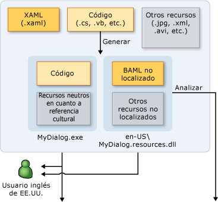
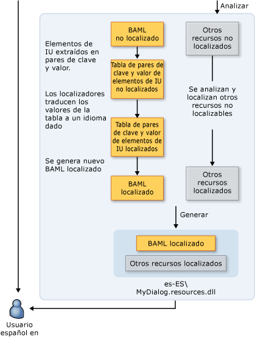

# Información general sobre la globalización y la localización de WPF
Cuando se limita la disponibilidad de un producto a un solo idioma, se limita la base de clientes potenciales a una fracción de los 6,5 mil millones de habitantes del mundo. Si quiere que las aplicaciones alcancen una audiencia global, la localización rentable del producto es una de las formas mejores y más económicas de llegar a más clientes.  
  
 Esta información general presenta la globalización y localización en [!INCLUDE[TLA#tla_winclient](../../../../includes/tlasharptla-winclient-md.md)]. La globalización es el diseño y desarrollo de aplicaciones que funcionan en diversas ubicaciones. Por ejemplo, la globalización permite el uso de interfaces de usuario localizadas y datos regionales para usuarios de diferentes referencias culturales. [!INCLUDE[TLA2#tla_winclient](../../../../includes/tla2sharptla-winclient-md.md)] proporciona características de diseño globalizadas, incluidos el diseño automático, los ensamblados satélite y localizados de los atributos y comentarios.
  
 La localización es la traducción de los recursos de una aplicación en versiones localizadas para las referencias culturales específicas que admite la aplicación. Cuando localice en [!INCLUDE[TLA2#tla_winclient](../../../../includes/tla2sharptla-winclient-md.md)], use las API en el <xref:System.Windows.Markup.Localizer> espacio de nombres. Estos power API la [LocBaml Tool Sample](https://go.microsoft.com/fwlink/?LinkID=160016) herramienta de línea de comandos. Para obtener información acerca de cómo crear y usar LocBaml, vea [localizar una aplicación](../../../../docs/framework/wpf/advanced/how-to-localize-an-application.md).    
  
## Procedimientos recomendados para la globalización y localización en WPF  
 Puede aprovechar al máximo la funcionalidad de globalización y localización que se integra en [!INCLUDE[TLA2#tla_winclient](../../../../includes/tla2sharptla-winclient-md.md)] siguiendo el diseño de interfaz de usuario y las sugerencias relacionadas con la localización que esta sección se proporciona.  
  
### Procedimientos recomendados para el diseño de interfaces de usuario de WPF  
 Cuando se diseña un [!INCLUDE[TLA2#tla_winclient](../../../../includes/tla2sharptla-winclient-md.md)]– basado [!INCLUDE[TLA2#tla_ui](../../../../includes/tla2sharptla-ui-md.md)], considere la posibilidad de implementar estos procedimientos recomendados:  
  
-   Escribir su [!INCLUDE[TLA2#tla_ui](../../../../includes/tla2sharptla-ui-md.md)] en [!INCLUDE[TLA2#tla_xaml](../../../../includes/tla2sharptla-xaml-md.md)]; Evite crear [!INCLUDE[TLA2#tla_ui](../../../../includes/tla2sharptla-ui-md.md)] en el código. Al crear su [!INCLUDE[TLA2#tla_ui](../../../../includes/tla2sharptla-ui-md.md)] utilizando [!INCLUDE[TLA2#tla_xaml](../../../../includes/tla2sharptla-xaml-md.md)], exponerlo a través de la API de localización integradas.  
  
-   Evite usar posiciones absolutas y tamaños fijos para disponer de contenido; en su lugar, use el ajuste de tamaño relativo o automático.
  
    -   Use <xref:System.Windows.Window.SizeToContent%2A>; y mantener altos y anchos establecidos `Auto`.  
  
    -   Evite el uso de <xref:System.Windows.Controls.Canvas> para diseñar [!INCLUDE[TLA2#tla_ui](../../../../includes/tla2sharptla-ui-md.md)]s.  
  
    -   Use <xref:System.Windows.Controls.Grid> y su característica de tamaño compartido.  
  
-   Proporcione espacio adicional en los márgenes, porque el texto localizado suele requerir más espacio. El espacio adicional permite que sobresalga algún carácter.  
  
-   Habilitar <xref:System.Windows.Controls.TextBlock.TextWrapping%2A> en <xref:System.Windows.Controls.TextBlock> para evitar el recorte.
  
-   Establecer el **XML: lang** atributo. Este atributo describe la referencia cultural de un elemento concreto y sus elementos secundarios. El valor de esta propiedad cambia el comportamiento de varias características en [!INCLUDE[TLA2#tla_winclient](../../../../includes/tla2sharptla-winclient-md.md)]. Por ejemplo, cambia el comportamiento de los guiones, la revisión ortográfica, la sustitución de números, la forma de la escritura compleja y la reserva de fuentes. Consulte [globalización de WPF](../../../../docs/framework/wpf/advanced/globalization-for-wpf.md) para obtener más información sobre la configuración de la [XML: lang Handling in XAML](../../../../docs/framework/xaml-services/xml-lang-handling-in-xaml.md).  
  
-   Crear una fuente compuesta personalizada para controlar mejor las fuentes que se utilizan para distintos idiomas. De forma predeterminada, [!INCLUDE[TLA2#tla_winclient](../../../../includes/tla2sharptla-winclient-md.md)] utiliza la fuente de GlobalUserInterface.composite del directorio Windows\Fonts.  
  
-   Al crear aplicaciones de navegación que puedan localizarse en una referencia cultural que presente el texto en un formato de derecha a izquierda, establezca explícitamente la <xref:System.Windows.FlowDirection> de cada página para asegurarse de que no hereda la página <xref:System.Windows.FlowDirection> desde el <xref:System.Windows.Navigation.NavigationWindow>.  
  
-   Cuando cree aplicaciones de navegación independiente que se hospedan fuera de un explorador, establezca el <xref:System.Windows.Application.StartupUri%2A> para la aplicación inicial en un <xref:System.Windows.Navigation.NavigationWindow> en lugar de a una página (por ejemplo, `<Application StartupUri="NavigationWindow.xaml">`). Este diseño le permite cambiar el <xref:System.Windows.FlowDirection> de la ventana y la barra de navegación. Para obtener más información y un ejemplo, vea [Globalization Homepage Sample](https://go.microsoft.com/fwlink/?LinkID=159990).  
  
### Procedimientos recomendados para la localización de WPF  
 Cuando localice [!INCLUDE[TLA2#tla_winclient](../../../../includes/tla2sharptla-winclient-md.md)]: aplicaciones basadas en, considere la posibilidad de implementar estos procedimientos recomendados:  
  
-   Utilice comentarios de localización para proporcionar contexto adicional para los localizadores.  
  
-   Usar atributos de localización para controlar la localización en lugar de omitir selectivamente <xref:System.Windows.Markup.Localizer.BamlLocalizableResourceKey.Uid%2A> las propiedades de elementos. Consulte [atributos y comentarios](../../../../docs/framework/wpf/advanced/localization-attributes-and-comments.md) para obtener más información.  
  
-   Use **msbuild/t: updateuid** y **/t: checkuid** para agregar y comprobar <xref:System.Windows.Markup.Localizer.BamlLocalizableResourceKey.Uid%2A> propiedades en su [!INCLUDE[TLA2#tla_xaml](../../../../includes/tla2sharptla-xaml-md.md)]. Use <xref:System.Windows.Markup.Localizer.BamlLocalizableResourceKey.Uid%2A> propiedades para realizar el seguimiento de cambios entre el desarrollo y la localización. <xref:System.Windows.Markup.Localizer.BamlLocalizableResourceKey.Uid%2A> propiedades de ayudan a localizar los nuevos cambios de desarrollo. Si agrega manualmente <xref:System.Windows.Markup.Localizer.BamlLocalizableResourceKey.Uid%2A> propiedades para un [!INCLUDE[TLA2#tla_ui](../../../../includes/tla2sharptla-ui-md.md)], la tarea será habitualmente tediosa y menos precisa.  
  
    -   No modifique ni cambie <xref:System.Windows.Markup.Localizer.BamlLocalizableResourceKey.Uid%2A> propiedades después de iniciar la localización.  
  
    -   No use duplicado <xref:System.Windows.Markup.Localizer.BamlLocalizableResourceKey.Uid%2A> propiedades (Recuerde esta sugerencia al usar el comando Copiar y pegar).  
  
    -   Establecer el `UltimateResourceFallback` ubicación en AssemblyInfo.* para especificar el idioma adecuado para la reserva (por ejemplo, `[assembly: NeutralResourcesLanguage("en-US",   UltimateResourceFallbackLocation.Satellite)]`).  
  
         Si decide incluir su idioma de origen en el ensamblado principal omitiendo la `<UICulture>` etiquetar en el archivo de proyecto, establezca el `UltimateResourceFallback` ubicación que el ensamblado principal en lugar del satélite (por ejemplo, `[assembly: NeutralResourcesLanguage("en-US", UltimateResourceFallbackLocation.MainAssembly)]`).  
  
   
## Localizar una aplicación WPF  
 Cuando localice un [!INCLUDE[TLA2#tla_winclient](../../../../includes/tla2sharptla-winclient-md.md)] aplicación, tiene varias opciones. Por ejemplo, puede enlazar los recursos localizables en la aplicación para un [!INCLUDE[TLA2#tla_xml](../../../../includes/tla2sharptla-xml-md.md)] de archivos, almacenar el texto localizable en tablas resx o hacer que el localizador use [!INCLUDE[TLA#tla_xaml](../../../../includes/tlasharptla-xaml-md.md)] archivos. Esta sección describe un flujo de trabajo de localización que usa el formato BAML de XAML, que proporciona varias ventajas:  
  
-   Puede localizar después de compilar.  
  
-   Puede actualizar a una versión más reciente del formato BAML de XAML con localizaciones de una versión anterior del formato BAML de XAML, de modo que pueda localizar al mismo tiempo que desarrolla.  
  
-   Puede validar los elementos de origen original y la semántica en tiempo de compilación porque el formulario BAML de XAML es la forma compilada de [!INCLUDE[TLA2#tla_xaml](../../../../includes/tla2sharptla-xaml-md.md)].  
  
### Proceso de compilación de la localización  
 Al desarrollar una [!INCLUDE[TLA2#tla_winclient](../../../../includes/tla2sharptla-winclient-md.md)] aplicación, el proceso de compilación para la localización es como sigue:  
  
-   El desarrollador crea y globaliza la [!INCLUDE[TLA2#tla_winclient](../../../../includes/tla2sharptla-winclient-md.md)] aplicación. En el proyecto de archivos el desarrollador establece `<UICulture>en-US</UICulture>` para que cuando se compila la aplicación, se genera un ensamblado principal independiente del idioma. Este ensamblado tiene un archivo satélite .resources.dll que contiene todos los recursos localizables. Si lo desea, puede mantener el idioma de origen en el ensamblado principal porque nuestro localización [!INCLUDE[TLA2#tla_api#plural](../../../../includes/tla2sharptla-apisharpplural-md.md)] admiten la extracción desde el ensamblado principal.  
  
-   Cuando se compila el archivo en la compilación, el [!INCLUDE[TLA2#tla_xaml](../../../../includes/tla2sharptla-xaml-md.md)] se convierte en el formulario BAML de XAML. Culturalmente neutro `MyDialog.exe` y culturalmente dependiente (en inglés) `MyDialog.resources.dll` archivos se liberan al cliente angloparlante.  
  
### Flujo de trabajo de localización  
 El proceso de localización comienza después el sin localizar `MyDialog.resources.dll` se compila el archivo. El [!INCLUDE[TLA2#tla_ui](../../../../includes/tla2sharptla-ui-md.md)] elementos y propiedades de la original [!INCLUDE[TLA2#tla_xaml](../../../../includes/tla2sharptla-xaml-md.md)] el formulario BAML de XAML en pares clave-valor se extraen mediante el uso de la [!INCLUDE[TLA2#tla_api#plural](../../../../includes/tla2sharptla-apisharpplural-md.md)] en <xref:System.Windows.Markup.Localizer>. Los localizadores usan los pares clave-valor para localizar la aplicación. Puede generar un nuevo archivo .resource.dll a partir de los nuevos valores, una vez completada la localización.  
  
 Las claves de los pares de clave y valor son `x:Uid` valores que se colocan por el desarrollador en el original [!INCLUDE[TLA2#tla_xaml](../../../../includes/tla2sharptla-xaml-md.md)]. Estos `x:Uid` valores permiten la [!INCLUDE[TLA2#tla_api](../../../../includes/tla2sharptla-api-md.md)] para realizar un seguimiento y combinar los cambios que se producen entre el desarrollador y el localizador durante la localización. Por ejemplo, si el desarrollador cambia el [!INCLUDE[TLA2#tla_ui](../../../../includes/tla2sharptla-ui-md.md)] después de que el localizador empiece a localizar, puede combinar el cambio de desarrollo con el trabajo de localización ya completado para que el trabajo de traducción mínima se pierde.  
  
 En el gráfico siguiente se muestra un flujo de trabajo de localización típico basado en el formato BAML de XAML. Este diagrama se presupone que el desarrollador escribe la aplicación en inglés. El desarrollador crea y globaliza la aplicación WPF. En el proyecto de archivos el desarrollador establece `<UICulture>en-US</UICulture>` para que en la compilación, se genera un ensamblado principal independiente del idioma con una licencia satélite. resources.dll que contiene todos los recursos localizables. De manera alternativa, puede mantenerse el idioma de origen en el ensamblado principal porque las API de localización de WPF admiten la extracción desde el ensamblado principal. Después del proceso de compilación, el XAML se genera en BAML. El archivo MyDialog.exe.resources.dll culturalmente neutral se distribuye al cliente angloparlante.  
  
   
  
   
  
   
## Ejemplos de localización de WPF  
 Esta sección contiene ejemplos de aplicaciones localizadas para ayudarle a entender cómo compilar y localizar [!INCLUDE[TLA2#tla_winclient](../../../../includes/tla2sharptla-winclient-md.md)] aplicaciones.  
  
#### Ejemplo de cuadro de diálogo Ejecutar  
 Los gráficos siguientes muestran el resultado de la **ejecutar** ejemplo de cuadro de diálogo.  
  
 **Inglés:**  
  
   
  
 **Alemán:**  
  
   
  
 **Diseñar un cuadro de diálogo Ejecutar global**  
  
 Este ejemplo genera un **ejecutar** cuadro de diálogo mediante el uso de [!INCLUDE[TLA2#tla_winclient](../../../../includes/tla2sharptla-winclient-md.md)] y [!INCLUDE[TLA2#tla_xaml](../../../../includes/tla2sharptla-xaml-md.md)]. Este cuadro de diálogo es equivalente a la **ejecutar** cuadro de diálogo que está disponible en el [!INCLUDE[TLA#tla_win](../../../../includes/tlasharptla-win-md.md)] menú Inicio.  
  
 Algunos puntos importantes para la creación de cuadros de diálogo globales son los siguientes:  
  
 **Diseño automático**  
  
 *En Window1.xaml:*  
  
 `<Window SizeToContent="WidthAndHeight">`  
  
 La propiedad Window anterior cambia automáticamente el tamaño de la ventana en función del tamaño del contenido. Esta propiedad evita que la ventana recorte el contenido que aumenta de tamaño después de la localización; también quita el espacio innecesario cuando el contenido disminuye de tamaño después de la localización.  
  
 `<Grid x:Uid="Grid_1">`  
  
 <xref:System.Windows.Markup.Localizer.BamlLocalizableResourceKey.Uid%2A> se necesitan propiedades en orden para [!INCLUDE[TLA2#tla_winclient](../../../../includes/tla2sharptla-winclient-md.md)] localización [!INCLUDE[TLA2#tla_api#plural](../../../../includes/tla2sharptla-apisharpplural-md.md)] funcione correctamente.  
  
 Se usan por [!INCLUDE[TLA2#tla_winclient](../../../../includes/tla2sharptla-winclient-md.md)] localización [!INCLUDE[TLA2#tla_api#plural](../../../../includes/tla2sharptla-apisharpplural-md.md)] para realizar el seguimiento de cambios entre el desarrollo y la localización de la [!INCLUDE[TLA#tla_ui](../../../../includes/tlasharptla-ui-md.md)]. <xref:System.Windows.Markup.Localizer.BamlLocalizableResourceKey.Uid%2A> propiedades le permiten combinar una versión más reciente de la [!INCLUDE[TLA2#tla_ui](../../../../includes/tla2sharptla-ui-md.md)] con una localización anterior de la [!INCLUDE[TLA2#tla_ui](../../../../includes/tla2sharptla-ui-md.md)]. Agrega un <xref:System.Windows.Markup.Localizer.BamlLocalizableResourceKey.Uid%2A> propiedad ejecutando **msbuild/t: updateuid RunDialog.csproj** en un shell de comandos. Este es el método recomendado de agregar <xref:System.Windows.Markup.Localizer.BamlLocalizableResourceKey.Uid%2A> propiedades porque agregarlas manualmente suele exigir mucho tiempo y menos precisa. Puede comprobar que <xref:System.Windows.Markup.Localizer.BamlLocalizableResourceKey.Uid%2A> propiedades se establecen correctamente ejecutando **msbuild/t: checkuid RunDialog.csproj**.  
  
 El [!INCLUDE[TLA2#tla_ui](../../../../includes/tla2sharptla-ui-md.md)] se estructura usando el <xref:System.Windows.Controls.Grid> control, que es un control útil para aprovechar el diseño automático en [!INCLUDE[TLA2#tla_winclient](../../../../includes/tla2sharptla-winclient-md.md)]. Observe que el cuadro de diálogo se divide en tres filas y cinco columnas. No, una de las definiciones de columna y fila tiene un tamaño fijo; por lo tanto, el [!INCLUDE[TLA2#tla_ui](../../../../includes/tla2sharptla-ui-md.md)] los elementos que se colocan en cada celda pueden adaptarse a aumentos y reducciones de tamaño durante la localización.  
  
 [!code-xaml[GlobalizationRunDialog#GridColumnDef](../../../../samples/snippets/csharp/VS_Snippets_Wpf/GlobalizationRunDialog/CS/Window1.xaml#gridcolumndef)]  
  
 Las dos primeras columnas donde el **abierto:** etiqueta y <xref:System.Windows.Controls.ComboBox> se colocan use 10 por ciento de los [!INCLUDE[TLA2#tla_ui](../../../../includes/tla2sharptla-ui-md.md)] ancho total.  
  
 [!code-xaml[GlobalizationRunDialog#GridColumnDef2](../../../../samples/snippets/csharp/VS_Snippets_Wpf/GlobalizationRunDialog/CS/Window1.xaml#gridcolumndef2)]  
  
 Tenga en cuenta que el ejemplo utiliza la característica de ajuste de tamaño compartido <xref:System.Windows.Controls.Grid>. Las últimas tres columnas aprovechan esta colocándose en el mismo <xref:System.Windows.Controls.DefinitionBase.SharedSizeGroup%2A>. Como cabe esperar del nombre de la propiedad, esto permite que las columnas compartan el mismo tamaño. Por lo que cuando "Examinar..." se traduce a la cadena "Durchsuchen...", todos los botones crecen en ancho en lugar de tener un pequeño botón "Aceptar" y un botón "Durchsuchen..." desproporcionadamente grande.  
  
 **Xml:lang**  
  
 `Xml:lang="en-US"`  
  
 Tenga en cuenta la [XML: lang Handling in XAML](../../../../docs/framework/xaml-services/xml-lang-handling-in-xaml.md) coloca en el elemento raíz de la [!INCLUDE[TLA2#tla_ui](../../../../includes/tla2sharptla-ui-md.md)]. Esta propiedad describe la referencia cultural de un elemento determinado y de sus elementos secundarios. Este valor se usa varias características de [!INCLUDE[TLA2#tla_winclient](../../../../includes/tla2sharptla-winclient-md.md)] y debe cambiarse en consecuencia durante la localización. Este valor cambia qué diccionario de idioma se usa para separar las palabras con guiones y para la revisión ortográfica. También afecta a la presentación de dígitos y a cómo selecciona el sistema de reserva de fuentes qué fuente usar. Finalmente, la propiedad afecta a la manera en que se muestran los números y la manera en que se aplica formato a los textos escritos de escritura compleja. El valor predeterminado es "en-US".  
  
 **Crear un ensamblado de recursos satélite**  
  
 *En .csproj:*  
  
 `<UICulture>en-US</UICulture>`  
  
 Observe la adición de un `UICulture` valor. Cuando se establece en válido <xref:System.Globalization.CultureInfo> valor como en-US, compilar el proyecto genera un ensamblado satélite con todos los recursos localizables en ella.  
  
 `<Resource Include="RunIcon.JPG">`  
  
 `<Localizable>False</Localizable>`  
  
 `</Resource>`  
  
 El `RunIcon.JPG` no deben localizarse, porque debe aparecer el mismo para todas las referencias culturales. `Localizable` se establece en `false` para que permanezca en el ensamblado principal independiente del idioma en lugar de un ensamblado satélite. El valor predeterminado de todos los recursos no compilables es `Localizable` establecido en `true`.  
  
 **Localizar el cuadro de diálogo Ejecutar**  
  
 **Analizar**  
  
 Después de compilar la aplicación, el primer paso para localizarla es analizar los recursos localizables del ensamblado satélite. Para los fines de este tema, utilice la herramienta LocBaml de ejemplo que puede encontrarse en [LocBaml Tool Sample](https://go.microsoft.com/fwlink/?LinkID=160016). Tenga en cuenta que LocBaml es solamente una herramienta de ejemplo, cuyo propósito es ayudarle a iniciarse en la compilación de una herramienta de localización adecuada para el proceso de localización. Con LocBaml, ejecute lo siguiente para analizar: **LocBaml /parse RunDialog.resources.dll/out:** para generar un archivo "RunDialog.resources.dll.CSV".  
  
 **Localizar**  
  
 Use su editor favorito de archivos .CSV compatible con Unicode para modificar este archivo. Filtre todas las entradas que tengan la categoría de localización "None". Debería ver las entradas siguientes:  
  
|Clave de recurso|Categoría de localización|Valor|  
|-|-|-| 
|Button_1:System.Windows.Controls.Button.$Content|Botón|Aceptar|  
|Button_2:System.Windows.Controls.Button.$Content|Botón|Cancelar|  
|Button_3:System.Windows.Controls.Button.$Content|Botón|Examinar...|  
|ComboBox_1:System.Windows.Controls.ComboBox.$Content|ComboBox||  
|TextBlock_1:System.Windows.Controls.TextBlock.$Content|Texto|Escriba el nombre del programa, carpeta, documento o recurso de Internet que desea abrir con Windows.|  
|TextBlock_2:System.Windows.Controls.TextBlock.$Content|Texto|Abrir:|  
|Window_1:System.Windows.Window.Title|Título|Run|  
  
 Localizar la aplicación a alemán requerirá las traducciones siguientes:  
  
|Clave de recurso|Categoría de localización|Valor|  
|-|-|-| 
|Button_1:System.Windows.Controls.Button.$Content|Botón|Aceptar|  
|Button_2:System.Windows.Controls.Button.$Content|Botón|Abbrechen|  
|Button_3:System.Windows.Controls.Button.$Content|Botón|Durchsuchen…|  
|ComboBox_1:System.Windows.Controls.ComboBox.$Content|ComboBox||  
|TextBlock_1:System.Windows.Controls.TextBlock.$Content|Texto|Geben Sie den Namen eines Programms, Ordners, Dokuments oder einer Internetresource an.|  
|TextBlock_2:System.Windows.Controls.TextBlock.$Content|Texto|Öffnen:|  
|Window_1:System.Windows.Window.Title|Título|Run|  
  
 **Generar**  
  
 El último paso de localización implica la creación del nuevo ensamblado satélite localizado. Esto se puede hacer con el siguiente comando de LocBaml:  
  
 **LocBaml.exe / generar /trans:RunDialog.resources.dll.CSV RunDialog.resources.dll/out:. /cUL:de-DE**  
  
 En la versión alemana [!INCLUDE[TLA#tla_mswin](../../../../includes/tlasharptla-mswin-md.md)], si se coloca este archivo resources.dll en una carpeta de-DE junto al ensamblado principal, este recurso se cargará automáticamente en lugar de la carpeta en-US. Si no tiene una versión alemana de [!INCLUDE[TLA#tla_mswin](../../../../includes/tlasharptla-mswin-md.md)] para probarlo, establecer la referencia cultural a cualquier referencia cultural de [!INCLUDE[TLA#tla_mswin](../../../../includes/tlasharptla-mswin-md.md)] usa (es decir, en-US) y reemplace el archivo resources.dll original.  
  
 **Carga de recursos satélite**  
  
|MyDialog.exe|en-US\MyDialog.resources.dll|de-DE\MyDialog.resources.dll|  
|------------------|------------------------------------|------------------------------------|  
|Código|BAML en inglés original|BAML localizado|  
|Recursos culturalmente neutrales|Otros recursos en inglés|Otros recursos localizados al alemán|  
  
 .NET framework elige automáticamente el ensamblado de recursos satélite para cargar en función de la aplicación `Thread.CurrentThread.CurrentUICulture`. El valor predeterminado es la referencia cultural de la [!INCLUDE[TLA#tla_mswin](../../../../includes/tlasharptla-mswin-md.md)] OS. Por tanto, si usa el alemán [!INCLUDE[TLA#tla_mswin](../../../../includes/tlasharptla-mswin-md.md)], cargue el de-DE\MyDialog.resources.dll, si utiliza inglés [!INCLUDE[TLA#tla_mswin](../../../../includes/tlasharptla-mswin-md.md)], carga el en-US\MyDialog.resources.dll. Puede establecer el recurso de reserva último para la aplicación especificando NeutralResourcesLanguage en AssemblyInfo.* del proyecto. Por ejemplo, si especifica:  
  
 `[assembly: NeutralResourcesLanguage("en-US", UltimateResourceFallbackLocation.Satellite)]`  
  
 se usará en-US\MyDialog.resources.dll con la versión alemana de Windows si no están disponibles de-DE\MyDialog.resources.dll ni de\MyDialog.resources.dll.  
  
### Página principal de Microsoft Arabia Saudí  
 En los gráficos siguientes se muestra una página principal en inglés y en árabe. Para obtener el ejemplo completo que genera estos gráficos, consulte [Globalization Homepage Sample](https://go.microsoft.com/fwlink/?LinkID=159990).  
  
 **Inglés:**  
  
   
  
 **Árabe:**  
  
   
  
### Diseñar una página principal de Microsoft global  
 En este ejemplo de sitio web de Microsoft Arabia Saudí se muestran las características de globalización que se proporcionan para los idiomas de derecha a izquierda. Idiomas como el hebreo y árabe tienen un orden de lectura de derecha a izquierda, por lo que el diseño de [!INCLUDE[TLA2#tla_ui](../../../../includes/tla2sharptla-ui-md.md)] a menudo se debe disponer muy diferente del que sería en idiomas de izquierda a derecha como el inglés. Localizar de un idioma de izquierda a derecha a uno de derecha a izquierda, o viceversa, puede ser todo un reto. [!INCLUDE[TLA2#tla_winclient](../../../../includes/tla2sharptla-winclient-md.md)] se ha diseñado de modo que tales localizaciones resulten mucho más fáciles.  
  
 **FlowDirection**  
  
 *Homepage.xaml:*  
  
 [!code-xaml[GlobalizationHomepage#Homepage](../../../../samples/snippets/csharp/VS_Snippets_Wpf/GlobalizationHomepage/CS/Homepage.xaml#homepage)]  
  
 Tenga en cuenta la <xref:System.Windows.FrameworkElement.FlowDirection%2A> propiedad <xref:System.Windows.Controls.Page>. Si cambia esta propiedad para <xref:System.Windows.FlowDirection.RightToLeft> cambiará el <xref:System.Windows.FrameworkElement.FlowDirection%2A> de la <xref:System.Windows.Controls.Page> y sus elementos secundarios para que el diseño de este [!INCLUDE[TLA2#tla_ui](../../../../includes/tla2sharptla-ui-md.md)] se voltea para convertirse en derecha a izquierda, como esperaría un usuario árabe. Se puede invalidar el comportamiento de herencia mediante la especificación explícita <xref:System.Windows.FrameworkElement.FlowDirection%2A> en cualquier elemento. El <xref:System.Windows.FrameworkElement.FlowDirection%2A> está disponible en cualquier propiedad <xref:System.Windows.FrameworkElement> o elemento relacionado con documentos y tiene un valor implícito de <xref:System.Windows.FlowDirection.LeftToRight>.  
  
 Observe que incluso los pinceles de degradado de fondo se invierten en cuando correctamente la raíz <xref:System.Windows.FrameworkElement.FlowDirection%2A> cambia:  
  
 **FlowDirection="LeftToRight"**  
  
   
  
 **FlowDirection="RightToLeft"**  
  
   
  
 **Evitar usar dimensiones fijas para paneles y controles**  
  
 Eche un vistazo a Homepage.xaml, observe que aparte de ancho fijo y alto especificados para toda la [!INCLUDE[TLA2#tla_ui](../../../../includes/tla2sharptla-ui-md.md)] en la parte superior <xref:System.Windows.Controls.DockPanel>, no hay ninguna otra dimensión fija. Evite usar dimensiones fijas para impedir que se recorte el texto localizado que sea más largo que el texto de origen. Los paneles y controles de [!INCLUDE[TLA2#tla_winclient](../../../../includes/tla2sharptla-winclient-md.md)] ajustarán automáticamente su tamaño en función de su contenido. La mayoría de los controles tienen también dimensiones máximas y mínimas que puede establecer para mejorar el control (por ejemplo, MinWidth= "20"). Con <xref:System.Windows.Controls.Grid>, puede establecer también anchos y altos relativos usando ' *' (por ejemplo, Width = "0,25\*") o usar su característica de uso compartido del tamaño de celda.  
  
 **Comentarios de localización**  
  
 En muchos casos, el contenido puede ser ambiguo y difícil de traducir. El desarrollador o el diseñador tiene la capacidad de proporcionar contexto y comentarios adicionales a los localizadores mediante comentarios de localización. El ejemplo de Localization.Comments que aparece a continuación clarifica el uso del carácter "&#124;".  
  
 [!code-xaml[GlobalizationHomepage#LocalizationComment](../../../../samples/snippets/csharp/VS_Snippets_Wpf/GlobalizationHomepage/CS/Homepage.xaml#localizationcomment)]  
  
 Este comentario se asocia con el contenido de TextBlock_1 y en el caso de la herramienta LocBaml, (vea [localizar una aplicación](../../../../docs/framework/wpf/advanced/how-to-localize-an-application.md)), se puede ver en la columna 6 de la fila de TextBlock_1 en el archivo .csv resultante:  
  
|Clave de recurso|Categoría|Legible|Modificable|Comentario|Valor|  
|-|-|-|-|-|-|  
|TextBlock_1:System.Windows.Controls.TextBlock.$Content|Texto|TRUE|true|Este carácter se usa como una regla decorativa.|&#124;|  
  
 Se pueden colocar comentarios en el contenido o en las propiedades de cualquier elemento usando la sintaxis siguiente:  
  
 [!code-xaml[GlobalizationHomepage#LocalizationCommentsProp](../../../../samples/snippets/csharp/VS_Snippets_Wpf/GlobalizationHomepage/CS/Homepage.xaml#localizationcommentsprop)]  
  
 **Atributos de localización**  
  
 A menudo, el desarrollador o el administrador de la localización necesita controlar lo que pueden leer y modificar los localizadores. Por ejemplo, quizá no quiera que el localizador traduzca el nombre de su compañía o la redacción legal. [!INCLUDE[TLA2#tla_winclient](../../../../includes/tla2sharptla-winclient-md.md)] proporciona atributos que permiten establecer la legibilidad, modificabilidad y categoría del contenido o las propiedades de un elemento que la herramienta de localización puede usar para bloquear, ocultar u ordenar elementos. Para obtener más información, consulta <xref:System.Windows.Localization.Attributes%2A>. Para este ejemplo, la herramienta LocBaml genera solamente los valores de estos atributos. Todos los controles de [!INCLUDE[TLA2#tla_winclient](../../../../includes/tla2sharptla-winclient-md.md)] tienen valores predeterminados para estos atributos, pero es posible invalidarlos. Por ejemplo, el siguiente ejemplo reemplaza los atributos de localización predeterminados para `TextBlock_1` y establece el contenido sea legible no modificable, pero los localizadores.  
  
 [!code-xaml[LocalizationComAtt#LocalizationAttributes](../../../../samples/snippets/csharp/VS_Snippets_Wpf/LocalizationComAtt/CSharp/Attributes.xaml#localizationattributes)]  
  
 Además de la legibilidad y atributos modificabilidad, [!INCLUDE[TLA2#tla_winclient](../../../../includes/tla2sharptla-winclient-md.md)] proporciona una enumeración de categorías comunes de la interfaz de usuario (<xref:System.Windows.LocalizationCategory>) que se puede utilizar para proporcionar más contexto a los localizadores. El [!INCLUDE[TLA2#tla_winclient](../../../../includes/tla2sharptla-winclient-md.md)] categorías predeterminadas para los controles de plataforma se pueden invalidar en [!INCLUDE[TLA2#tla_xaml](../../../../includes/tla2sharptla-xaml-md.md)] así:  
  
 [!code-xaml[LocalizationComAtt#LocalizationAttributesOverridden](../../../../samples/snippets/csharp/VS_Snippets_Wpf/LocalizationComAtt/CSharp/Attributes.xaml#localizationattributesoverridden)]  
  
 La localización de forma predeterminada, los atributos que [!INCLUDE[TLA2#tla_winclient](../../../../includes/tla2sharptla-winclient-md.md)] proporciona también se puede invalidar mediante código, por lo que puede establecer correctamente los valores predeterminados para los controles personalizados. Por ejemplo:  
  
 `[Localizability(Readability = Readability.Readable, Modifiability=Modifiability.Unmodifiable, LocalizationCategory.None)]`  
  
 `public class CorporateLogo: TextBlock`  
  
 `{`  
  
 `…`  
  
 `..`  
  
 `.`  
  
 `}`  
  
 Los atributos establecidos por instancia [!INCLUDE[TLA2#tla_xaml](../../../../includes/tla2sharptla-xaml-md.md)] tendrá prioridad sobre los valores establecidos en el código de controles personalizados. Para obtener más información sobre los atributos y comentarios, vea [atributos y comentarios](../../../../docs/framework/wpf/advanced/localization-attributes-and-comments.md).  
  
 **Reserva de fuente y fuentes compuestas**  
  
 Si se especifica una fuente que no es compatible con un rango de punto de código determinado, [!INCLUDE[TLA2#tla_winclient](../../../../includes/tla2sharptla-winclient-md.md)] conmutarán automáticamente a una que lo haga usando Global User Interface.compositefont que se encuentra en el directorio Windows\Fonts. Las fuentes compuestas funcionan como cualquier otra fuente y se pueden usar explícitamente estableciendo la propiedad FontFamily de un elemento (por ejemplo, FontFamily= "Global User Interface"). Puede especificar sus propias preferencias de reserva de fuentes creando fuentes compuestas propias y especificando qué fuente quiere usar para los intervalos de punto de codificación e idiomas concretos.  
  
 Para obtener más información sobre las fuentes compuestas vea <xref:System.Windows.Media.FontFamily>.  
  
 **Localizar la página principal de Microsoft**  
  
 Puede seguir los mismos pasos que en el ejemplo del cuadro de diálogo Ejecutar para localizar esta aplicación. El archivo .csv adaptado para árabe está disponible para el usuario en el [Globalization Homepage Sample](https://go.microsoft.com/fwlink/?LinkID=159990).
