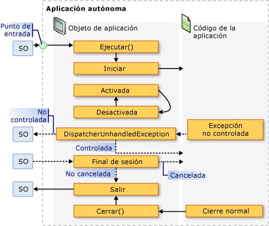
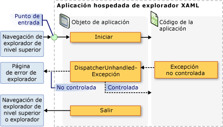

# <a name="application-management-overview"></a><span data-ttu-id="1c12f-102">Información general sobre la administración de aplicaciones</span><span class="sxs-lookup"><span data-stu-id="1c12f-102">Application Management Overview</span></span>

<span data-ttu-id="1c12f-103">Todas las aplicaciones suelen compartir un conjunto común de funciones que se aplica a la implementación y la administración de la aplicación.</span><span class="sxs-lookup"><span data-stu-id="1c12f-103">All applications tend to share a common set of functionality that applies to application implementation and management.</span></span> <span data-ttu-id="1c12f-104">En este tema se proporciona información general sobre la funcionalidad de la clase <xref:System.Windows.Application> para la creación y administración de aplicaciones.</span><span class="sxs-lookup"><span data-stu-id="1c12f-104">This topic provides an overview of the functionality in the <xref:System.Windows.Application> class for creating and managing applications.</span></span>

## <a name="the-application-class"></a><span data-ttu-id="1c12f-105">La clase Application</span><span class="sxs-lookup"><span data-stu-id="1c12f-105">The Application Class</span></span>

<span data-ttu-id="1c12f-106">En WPF, la funcionalidad común de ámbito de aplicación se encapsula en la clase <xref:System.Windows.Application>.</span><span class="sxs-lookup"><span data-stu-id="1c12f-106">In WPF, common application-scoped functionality is encapsulated in the <xref:System.Windows.Application> class.</span></span> <span data-ttu-id="1c12f-107">La clase <xref:System.Windows.Application> incluye la siguiente funcionalidad:</span><span class="sxs-lookup"><span data-stu-id="1c12f-107">The <xref:System.Windows.Application> class includes the following functionality:</span></span>

- <span data-ttu-id="1c12f-108">Realizar el seguimiento e interactuar con la duración de la aplicación.</span><span class="sxs-lookup"><span data-stu-id="1c12f-108">Tracking and interacting with application lifetime.</span></span>

- <span data-ttu-id="1c12f-109">Recuperar y procesar los parámetros de la línea de comandos.</span><span class="sxs-lookup"><span data-stu-id="1c12f-109">Retrieving and processing command-line parameters.</span></span>

- <span data-ttu-id="1c12f-110">Detectar y responder a las excepciones no controladas.</span><span class="sxs-lookup"><span data-stu-id="1c12f-110">Detecting and responding to unhandled exceptions.</span></span>

- <span data-ttu-id="1c12f-111">Compartir propiedades y recursos en el ámbito de aplicación.</span><span class="sxs-lookup"><span data-stu-id="1c12f-111">Sharing application-scope properties and resources.</span></span>

- <span data-ttu-id="1c12f-112">Administrar ventanas en las aplicaciones independientes.</span><span class="sxs-lookup"><span data-stu-id="1c12f-112">Managing windows in standalone applications.</span></span>

- <span data-ttu-id="1c12f-113">Seguimiento y administración de la navegación.</span><span class="sxs-lookup"><span data-stu-id="1c12f-113">Tracking and managing navigation.</span></span>

<a name="The_Application_Class"></a>

## <a name="how-to-perform-common-tasks-using-the-application-class"></a><span data-ttu-id="1c12f-114">Cómo realizar las tareas comunes con la clase Application</span><span class="sxs-lookup"><span data-stu-id="1c12f-114">How to Perform Common Tasks Using the Application Class</span></span>

<span data-ttu-id="1c12f-115">Si no le interesan todos los detalles de la clase <xref:System.Windows.Application>, en la tabla siguiente se enumeran algunas de las tareas comunes de <xref:System.Windows.Application> y cómo realizarlas.</span><span class="sxs-lookup"><span data-stu-id="1c12f-115">If you are not interested in all of the details of the <xref:System.Windows.Application> class, the following table lists some of the common tasks for <xref:System.Windows.Application> and how to accomplish them.</span></span> <span data-ttu-id="1c12f-116">Viendo las API y los temas relacionados, puede buscar más información y código de ejemplo.</span><span class="sxs-lookup"><span data-stu-id="1c12f-116">By viewing the related API and topics, you can find more information and sample code.</span></span>

|<span data-ttu-id="1c12f-117">Tarea</span><span class="sxs-lookup"><span data-stu-id="1c12f-117">Task</span></span>|<span data-ttu-id="1c12f-118">Enfoque</span><span class="sxs-lookup"><span data-stu-id="1c12f-118">Approach</span></span>|
|----------|--------------|
|<span data-ttu-id="1c12f-119">Obtener un objeto que representa la aplicación actual</span><span class="sxs-lookup"><span data-stu-id="1c12f-119">Get an object that represents the current application</span></span>|<span data-ttu-id="1c12f-120">Utilice la propiedad <xref:System.Windows.Application.Current%2A?displayProperty=nameWithType>.</span><span class="sxs-lookup"><span data-stu-id="1c12f-120">Use the <xref:System.Windows.Application.Current%2A?displayProperty=nameWithType> property.</span></span>|
|<span data-ttu-id="1c12f-121">Agregar una pantalla de inicio a una aplicación</span><span class="sxs-lookup"><span data-stu-id="1c12f-121">Add a startup screen to an application</span></span>|<span data-ttu-id="1c12f-122">Vea [Agregar una pantalla de presentación a una aplicación WPF](how-to-add-a-splash-screen-to-a-wpf-application.md).</span><span class="sxs-lookup"><span data-stu-id="1c12f-122">See [Add a Splash Screen to a WPF Application](how-to-add-a-splash-screen-to-a-wpf-application.md).</span></span>|
|<span data-ttu-id="1c12f-123">Iniciar una aplicación</span><span class="sxs-lookup"><span data-stu-id="1c12f-123">Start an application</span></span>|<span data-ttu-id="1c12f-124">Utilice el método <xref:System.Windows.Application.Run%2A?displayProperty=nameWithType>.</span><span class="sxs-lookup"><span data-stu-id="1c12f-124">Use the <xref:System.Windows.Application.Run%2A?displayProperty=nameWithType> method.</span></span>|
|<span data-ttu-id="1c12f-125">Detener una aplicación</span><span class="sxs-lookup"><span data-stu-id="1c12f-125">Stop an application</span></span>|<span data-ttu-id="1c12f-126">Use el método <xref:System.Windows.Application.Shutdown%2A> del objeto <xref:System.Windows.Application.Current%2A?displayProperty=nameWithType>.</span><span class="sxs-lookup"><span data-stu-id="1c12f-126">Use the <xref:System.Windows.Application.Shutdown%2A> method of the <xref:System.Windows.Application.Current%2A?displayProperty=nameWithType> object.</span></span>|
|<span data-ttu-id="1c12f-127">Obtener los argumentos de la línea de comandos</span><span class="sxs-lookup"><span data-stu-id="1c12f-127">Get arguments from the command line</span></span>|<span data-ttu-id="1c12f-128">Controle el evento de <xref:System.Windows.Application.Startup?displayProperty=nameWithType> y use la propiedad <xref:System.Windows.StartupEventArgs.Args%2A?displayProperty=nameWithType>.</span><span class="sxs-lookup"><span data-stu-id="1c12f-128">Handle the <xref:System.Windows.Application.Startup?displayProperty=nameWithType> event and use the <xref:System.Windows.StartupEventArgs.Args%2A?displayProperty=nameWithType> property.</span></span> <span data-ttu-id="1c12f-129">Para obtener un ejemplo, vea el evento <xref:System.Windows.Application.Startup?displayProperty=nameWithType>.</span><span class="sxs-lookup"><span data-stu-id="1c12f-129">For an example, see the <xref:System.Windows.Application.Startup?displayProperty=nameWithType> event.</span></span>|
|<span data-ttu-id="1c12f-130">Obtener y establecer el código de salida de la aplicación</span><span class="sxs-lookup"><span data-stu-id="1c12f-130">Get and set the application exit code</span></span>|<span data-ttu-id="1c12f-131">Establezca la propiedad <xref:System.Windows.ExitEventArgs.ApplicationExitCode%2A?displayProperty=nameWithType> en el controlador de eventos <xref:System.Windows.Application.Exit?displayProperty=nameWithType> o llame al método <xref:System.Windows.Application.Shutdown%2A> y pase un entero.</span><span class="sxs-lookup"><span data-stu-id="1c12f-131">Set the <xref:System.Windows.ExitEventArgs.ApplicationExitCode%2A?displayProperty=nameWithType> property in the <xref:System.Windows.Application.Exit?displayProperty=nameWithType> event handler or call the <xref:System.Windows.Application.Shutdown%2A> method and pass in an integer.</span></span>|
|<span data-ttu-id="1c12f-132">Detectar y responder a las excepciones no controladas</span><span class="sxs-lookup"><span data-stu-id="1c12f-132">Detect and respond to unhandled exceptions</span></span>|<span data-ttu-id="1c12f-133">Controle el evento <xref:System.Windows.Application.DispatcherUnhandledException>.</span><span class="sxs-lookup"><span data-stu-id="1c12f-133">Handle the <xref:System.Windows.Application.DispatcherUnhandledException> event.</span></span>|
|<span data-ttu-id="1c12f-134">Obtener y establecer recursos en el ámbito de aplicación</span><span class="sxs-lookup"><span data-stu-id="1c12f-134">Get and set application-scoped resources</span></span>|<span data-ttu-id="1c12f-135">Utilice la propiedad <xref:System.Windows.Application.Resources%2A?displayProperty=nameWithType>.</span><span class="sxs-lookup"><span data-stu-id="1c12f-135">Use the <xref:System.Windows.Application.Resources%2A?displayProperty=nameWithType> property.</span></span>|
|<span data-ttu-id="1c12f-136">Usar un diccionario de recursos en el ámbito de aplicación</span><span class="sxs-lookup"><span data-stu-id="1c12f-136">Use an application-scope resource dictionary</span></span>|<span data-ttu-id="1c12f-137">Vea [usar un diccionario de recursos del ámbito de aplicación](how-to-use-an-application-scope-resource-dictionary.md).</span><span class="sxs-lookup"><span data-stu-id="1c12f-137">See [Use an Application-Scope Resource Dictionary](how-to-use-an-application-scope-resource-dictionary.md).</span></span>|
|<span data-ttu-id="1c12f-138">Obtener y establecer propiedades en el ámbito de aplicación</span><span class="sxs-lookup"><span data-stu-id="1c12f-138">Get and set application-scoped properties</span></span>|<span data-ttu-id="1c12f-139">Utilice la propiedad <xref:System.Windows.Application.Properties%2A?displayProperty=nameWithType>.</span><span class="sxs-lookup"><span data-stu-id="1c12f-139">Use the <xref:System.Windows.Application.Properties%2A?displayProperty=nameWithType> property.</span></span>|
|<span data-ttu-id="1c12f-140">Obtener y guardar el estado de una aplicación</span><span class="sxs-lookup"><span data-stu-id="1c12f-140">Get and save an application's state</span></span>|<span data-ttu-id="1c12f-141">Vea [conservar y restaurar propiedades de ámbito de aplicación a través de sesiones de aplicación](persist-and-restore-application-scope-properties.md).</span><span class="sxs-lookup"><span data-stu-id="1c12f-141">See [Persist and Restore Application-Scope Properties Across Application Sessions](persist-and-restore-application-scope-properties.md).</span></span>|
|<span data-ttu-id="1c12f-142">Administrar archivos de datos que no son de código, incluidos los archivos de recursos, los archivos de contenido y los archivos de sitio de origen.</span><span class="sxs-lookup"><span data-stu-id="1c12f-142">Manage non-code data files, including resource files, content files, and site-of-origin files.</span></span>|<span data-ttu-id="1c12f-143">Vea [archivos de recursos, contenido y datos de aplicaciones de WPF](wpf-application-resource-content-and-data-files.md).</span><span class="sxs-lookup"><span data-stu-id="1c12f-143">See [WPF Application Resource, Content, and Data Files](wpf-application-resource-content-and-data-files.md).</span></span>|
|<span data-ttu-id="1c12f-144">Administrar ventanas en las aplicaciones independientes</span><span class="sxs-lookup"><span data-stu-id="1c12f-144">Manage windows in standalone applications</span></span>|<span data-ttu-id="1c12f-145">Vea [WPF Windows Overview](wpf-windows-overview.md) (Introducción a Windows Presentation Foundation).</span><span class="sxs-lookup"><span data-stu-id="1c12f-145">See [WPF Windows Overview](wpf-windows-overview.md).</span></span>|
|<span data-ttu-id="1c12f-146">Realizar un seguimiento y administrar la navegación</span><span class="sxs-lookup"><span data-stu-id="1c12f-146">Track and manage navigation</span></span>|<span data-ttu-id="1c12f-147">Vea [información general sobre navegación](navigation-overview.md).</span><span class="sxs-lookup"><span data-stu-id="1c12f-147">See [Navigation Overview](navigation-overview.md).</span></span>|

<a name="The_Application_Definition"></a>

## <a name="the-application-definition"></a><span data-ttu-id="1c12f-148">La definición de aplicación</span><span class="sxs-lookup"><span data-stu-id="1c12f-148">The Application Definition</span></span>

<span data-ttu-id="1c12f-149">Para poder emplear la funcionalidad de la clase <xref:System.Windows.Application>, debe implementar una definición de aplicación.</span><span class="sxs-lookup"><span data-stu-id="1c12f-149">To utilize the functionality of the <xref:System.Windows.Application> class, you must implement an application definition.</span></span> <span data-ttu-id="1c12f-150">Una definición de aplicación de WPF es una clase que se deriva de <xref:System.Windows.Application> y se configura con una configuración especial de MSBuild.</span><span class="sxs-lookup"><span data-stu-id="1c12f-150">A WPF application definition is a class that derives from <xref:System.Windows.Application> and is configured with a special MSBuild setting.</span></span>

### <a name="implementing-an-application-definition"></a><span data-ttu-id="1c12f-151">Implementar una definición de aplicación</span><span class="sxs-lookup"><span data-stu-id="1c12f-151">Implementing an Application Definition</span></span>

<span data-ttu-id="1c12f-152">Una definición de aplicación de WPF típica se implementa mediante el marcado y el código subyacente.</span><span class="sxs-lookup"><span data-stu-id="1c12f-152">A typical WPF application definition is implemented using both markup and code-behind.</span></span> <span data-ttu-id="1c12f-153">Esto le permite usar marcado para establecer mediante declaración propiedades, recursos y eventos de registro de la aplicación, mientras que el control de eventos y la implementación del comportamiento específico de la aplicación se realizan en el código subyacente.</span><span class="sxs-lookup"><span data-stu-id="1c12f-153">This allows you to use markup to declaratively set application properties, resources, and register events, while handling events and implementing application-specific behavior in code-behind.</span></span>

<span data-ttu-id="1c12f-154">En el ejemplo siguiente se muestra cómo implementar una definición de aplicación usando tanto marcado como código subyacente:</span><span class="sxs-lookup"><span data-stu-id="1c12f-154">The following example shows how to implement an application definition using both markup and code-behind:</span></span>

[!code-xaml[ApplicationSnippets#ApplicationXAML](~/samples/snippets/csharp/VS_Snippets_Wpf/ApplicationSnippets/CSharp/App.xaml#applicationxaml)]

[!code-csharp[ApplicationSnippets#ApplicationCODEBEHIND](~/samples/snippets/csharp/VS_Snippets_Wpf/ApplicationSnippets/CSharp/App.xaml.cs#applicationcodebehind)]
[!code-vb[ApplicationSnippets#ApplicationCODEBEHIND](~/samples/snippets/visualbasic/VS_Snippets_Wpf/ApplicationSnippets/visualbasic/application.xaml.vb#applicationcodebehind)]

<span data-ttu-id="1c12f-155">Para que un archivo de marcado y un archivo de código subyacente funcionen conjuntamente, debe ocurrir lo siguiente:</span><span class="sxs-lookup"><span data-stu-id="1c12f-155">To allow a markup file and code-behind file to work together, the following needs to happen:</span></span>

- <span data-ttu-id="1c12f-156">En el marcado, el elemento `Application` debe incluir el atributo `x:Class`.</span><span class="sxs-lookup"><span data-stu-id="1c12f-156">In markup, the `Application` element must include the `x:Class` attribute.</span></span> <span data-ttu-id="1c12f-157">Cuando se compila la aplicación, la existencia de `x:Class` en el archivo de marcado hace que MSBuild cree una `partial` clase que deriva de <xref:System.Windows.Application> y tiene el nombre especificado por el atributo `x:Class`.</span><span class="sxs-lookup"><span data-stu-id="1c12f-157">When the application is built, the existence of `x:Class` in the markup file causes MSBuild to create a `partial` class that derives from <xref:System.Windows.Application> and has the name that is specified by the `x:Class` attribute.</span></span> <span data-ttu-id="1c12f-158">Esto requiere la adición de una declaración de espacio de nombres XML para el esquema XAML (`xmlns:x="http://schemas.microsoft.com/winfx/2006/xaml"`).</span><span class="sxs-lookup"><span data-stu-id="1c12f-158">This requires the addition of an XML namespace declaration for the XAML schema (`xmlns:x="http://schemas.microsoft.com/winfx/2006/xaml"`).</span></span>

- <span data-ttu-id="1c12f-159">En el código subyacente, la clase debe ser una `partial` clase con el mismo nombre especificado por el atributo `x:Class` en el marcado y debe derivar de <xref:System.Windows.Application>.</span><span class="sxs-lookup"><span data-stu-id="1c12f-159">In code-behind, the class must be a `partial` class with the same name that is specified by the `x:Class` attribute in markup and must derive from <xref:System.Windows.Application>.</span></span> <span data-ttu-id="1c12f-160">Esto permite asociar el archivo de código subyacente a la clase `partial` que se genera para el archivo de marcado cuando se compila la aplicación (consulte [compilar una aplicación WPF](building-a-wpf-application-wpf.md)).</span><span class="sxs-lookup"><span data-stu-id="1c12f-160">This allows the code-behind file to be associated with the `partial` class that is generated for the markup file when the application is built (see [Building a WPF Application](building-a-wpf-application-wpf.md)).</span></span>

> [!NOTE]
> <span data-ttu-id="1c12f-161">Al crear un nuevo proyecto de aplicación WPF o un proyecto de aplicación de explorador de WPF con Visual Studio, se incluye una definición de aplicación de forma predeterminada y se define mediante el marcado y el código subyacente.</span><span class="sxs-lookup"><span data-stu-id="1c12f-161">When you create a new WPF Application project or WPF Browser Application project using Visual Studio, an application definition is included by default and is defined using both markup and code-behind.</span></span>

<span data-ttu-id="1c12f-162">Este código es el mínimo necesario para implementar una definición de aplicación.</span><span class="sxs-lookup"><span data-stu-id="1c12f-162">This code is the minimum that is required to implement an application definition.</span></span> <span data-ttu-id="1c12f-163">Sin embargo, es necesario realizar una configuración adicional de MSBuild en la definición de la aplicación antes de compilar y ejecutar la aplicación.</span><span class="sxs-lookup"><span data-stu-id="1c12f-163">However, an additional MSBuild configuration needs to be made to the application definition before building and running the application.</span></span>

### <a name="configuring-the-application-definition-for-msbuild"></a><span data-ttu-id="1c12f-164">Configurar la definición de aplicación para MSBuild</span><span class="sxs-lookup"><span data-stu-id="1c12f-164">Configuring the Application Definition for MSBuild</span></span>

<span data-ttu-id="1c12f-165">Las aplicaciones independientes y las aplicaciones de explorador XAML (XBAP) requieren la implementación de un cierto nivel de infraestructura antes de poder ejecutarse.</span><span class="sxs-lookup"><span data-stu-id="1c12f-165">Standalone applications and XAML browser applications (XBAPs) require the implementation of a certain level of infrastructure before they can run.</span></span> <span data-ttu-id="1c12f-166">La parte más importante de esta infraestructura es el punto de entrada.</span><span class="sxs-lookup"><span data-stu-id="1c12f-166">The most important part of this infrastructure is the entry point.</span></span> <span data-ttu-id="1c12f-167">Cuando un usuario inicia una aplicación, el sistema operativo llama al punto de entrada, que es una función conocida para iniciar las aplicaciones.</span><span class="sxs-lookup"><span data-stu-id="1c12f-167">When an application is launched by a user, the operating system calls the entry point, which is a well-known function for starting applications.</span></span>

<span data-ttu-id="1c12f-168">Tradicionalmente, los desarrolladores necesitaban escribir todo o parte de este código, según la tecnología.</span><span class="sxs-lookup"><span data-stu-id="1c12f-168">Traditionally, developers have needed to write some or all of this code for themselves, depending on the technology.</span></span> <span data-ttu-id="1c12f-169">Sin embargo, WPF genera este código cuando el archivo de marcado de la definición de la aplicación se configura como un elemento de `ApplicationDefinition` de MSBuild, como se muestra en el siguiente archivo de proyecto de MSBuild:</span><span class="sxs-lookup"><span data-stu-id="1c12f-169">However, WPF generates this code for you when the markup file of your application definition is configured as an MSBuild `ApplicationDefinition` item, as shown in the following MSBuild project file:</span></span>

```xml
<Project
  DefaultTargets="Build"
                        xmlns="http://schemas.microsoft.com/developer/msbuild/2003">
  ...
  <ApplicationDefinition Include="App.xaml" />
  <Compile Include="App.xaml.cs" />
  ...
</Project>
```

<span data-ttu-id="1c12f-170">Dado que el archivo de código subyacente contiene código, se marca como un elemento de `Compile` de MSBuild, como es normal.</span><span class="sxs-lookup"><span data-stu-id="1c12f-170">Because the code-behind file contains code, it is marked as an MSBuild `Compile` item, as is normal.</span></span>

<span data-ttu-id="1c12f-171">La aplicación de estas configuraciones de MSBuild al marcado y a los archivos de código subyacente de una definición de aplicación hace que MSBuild genere código como el siguiente:</span><span class="sxs-lookup"><span data-stu-id="1c12f-171">The application of these MSBuild configurations to the markup and code-behind files of an application definition causes MSBuild to generate code like the following:</span></span>

[!code-csharp[auto-generated-code](~/samples/snippets/csharp/VS_Snippets_Wpf/AppDefAugSnippets/CSharp/App.cs)]
[!code-vb[auto-generated-code](~/samples/snippets/visualbasic/VS_Snippets_Wpf/AppDefAugSnippets/VisualBasic/App.vb)]

<span data-ttu-id="1c12f-172">El código resultante aumenta la definición de la aplicación con código de infraestructura adicional, que incluye el método de punto de entrada `Main`.</span><span class="sxs-lookup"><span data-stu-id="1c12f-172">The resulting code augments your application definition with additional infrastructure code, which includes the entry-point method `Main`.</span></span> <span data-ttu-id="1c12f-173">El atributo <xref:System.STAThreadAttribute> se aplica al método `Main` para indicar que el subproceso principal de la interfaz de usuario de la aplicación WPF es un subproceso STA, que es necesario para las aplicaciones de WPF.</span><span class="sxs-lookup"><span data-stu-id="1c12f-173">The <xref:System.STAThreadAttribute> attribute is applied to the `Main` method to indicate that the main UI thread for the WPF application is an STA thread, which is required for WPF applications.</span></span> <span data-ttu-id="1c12f-174">Cuando se llama a, `Main` crea una nueva instancia de `App` antes de llamar al método `InitializeComponent` para registrar los eventos y establecer las propiedades que se implementan en el marcado.</span><span class="sxs-lookup"><span data-stu-id="1c12f-174">When called, `Main` creates a new instance of `App` before calling the `InitializeComponent` method to register the events and set the properties that are implemented in markup.</span></span> <span data-ttu-id="1c12f-175">Dado que `InitializeComponent` se genera automáticamente, no es necesario llamar explícitamente a `InitializeComponent` desde una definición de aplicación como lo hace para implementaciones de <xref:System.Windows.Controls.Page> y <xref:System.Windows.Window>.</span><span class="sxs-lookup"><span data-stu-id="1c12f-175">Because `InitializeComponent` is generated for you, you don't need to explicitly call `InitializeComponent` from an application definition like you do for <xref:System.Windows.Controls.Page> and <xref:System.Windows.Window> implementations.</span></span> <span data-ttu-id="1c12f-176">Por último, se llama al método <xref:System.Windows.Application.Run%2A> para iniciar la aplicación.</span><span class="sxs-lookup"><span data-stu-id="1c12f-176">Finally, the <xref:System.Windows.Application.Run%2A> method is called to start the application.</span></span>

<a name="Getting_the_Current_Application"></a>

## <a name="getting-the-current-application"></a><span data-ttu-id="1c12f-177">Obtener la aplicación actual</span><span class="sxs-lookup"><span data-stu-id="1c12f-177">Getting the Current Application</span></span>

<span data-ttu-id="1c12f-178">Dado que la funcionalidad de la clase <xref:System.Windows.Application> se comparte en una aplicación, solo puede haber una instancia de la clase <xref:System.Windows.Application> por <xref:System.AppDomain>.</span><span class="sxs-lookup"><span data-stu-id="1c12f-178">Because the functionality of the <xref:System.Windows.Application> class are shared across an application, there can be only one instance of the <xref:System.Windows.Application> class per <xref:System.AppDomain>.</span></span> <span data-ttu-id="1c12f-179">Para aplicar esto, la clase <xref:System.Windows.Application> se implementa como una clase singleton (vea [implementar Singleton en C# ](https://docs.microsoft.com/previous-versions/msp-n-p/ff650316(v=pandp.10))), que crea una única instancia de sí misma y proporciona acceso compartido a ella con la propiedad <xref:System.Windows.Application.Current%2A> `static`.</span><span class="sxs-lookup"><span data-stu-id="1c12f-179">To enforce this, the <xref:System.Windows.Application> class is implemented as a singleton class (see [Implementing Singleton in C#](https://docs.microsoft.com/previous-versions/msp-n-p/ff650316(v=pandp.10))), which creates a single instance of itself and provides shared access to it with the `static`<xref:System.Windows.Application.Current%2A> property.</span></span>

<span data-ttu-id="1c12f-180">En el código siguiente se muestra cómo adquirir una referencia al objeto <xref:System.Windows.Application> para la <xref:System.AppDomain>actual.</span><span class="sxs-lookup"><span data-stu-id="1c12f-180">The following code shows how to acquire a reference to the <xref:System.Windows.Application> object for the current <xref:System.AppDomain>.</span></span>

[!code-csharp[ApplicationManagementOverviewSnippets#GetCurrentAppCODE](~/samples/snippets/csharp/VS_Snippets_Wpf/ApplicationManagementOverviewSnippets/CSharp/MainWindow.xaml.cs#getcurrentappcode)]
[!code-vb[ApplicationManagementOverviewSnippets#GetCurrentAppCODE](~/samples/snippets/visualbasic/VS_Snippets_Wpf/ApplicationManagementOverviewSnippets/VisualBasic/MainWindow.xaml.vb#getcurrentappcode)]

<span data-ttu-id="1c12f-181"><xref:System.Windows.Application.Current%2A> devuelve una referencia a una instancia de la clase <xref:System.Windows.Application>.</span><span class="sxs-lookup"><span data-stu-id="1c12f-181"><xref:System.Windows.Application.Current%2A> returns a reference to an instance of the <xref:System.Windows.Application> class.</span></span> <span data-ttu-id="1c12f-182">Si desea una referencia a la clase derivada <xref:System.Windows.Application> debe convertir el valor de la propiedad <xref:System.Windows.Application.Current%2A>, como se muestra en el ejemplo siguiente.</span><span class="sxs-lookup"><span data-stu-id="1c12f-182">If you want a reference to your <xref:System.Windows.Application> derived class you must cast the value of the <xref:System.Windows.Application.Current%2A> property, as shown in the following example.</span></span>

[!code-csharp[ApplicationManagementOverviewSnippets#GetSTCurrentAppCODE](~/samples/snippets/csharp/VS_Snippets_Wpf/ApplicationManagementOverviewSnippets/CSharp/MainWindow.xaml.cs#getstcurrentappcode)]
[!code-vb[ApplicationManagementOverviewSnippets#GetSTCurrentAppCODE](~/samples/snippets/visualbasic/VS_Snippets_Wpf/ApplicationManagementOverviewSnippets/VisualBasic/MainWindow.xaml.vb#getstcurrentappcode)]

<span data-ttu-id="1c12f-183">Puede inspeccionar el valor de <xref:System.Windows.Application.Current%2A> en cualquier momento de la duración de un objeto <xref:System.Windows.Application>.</span><span class="sxs-lookup"><span data-stu-id="1c12f-183">You can inspect the value of <xref:System.Windows.Application.Current%2A> at any point in the lifetime of an <xref:System.Windows.Application> object.</span></span> <span data-ttu-id="1c12f-184">En cambio, se recomienda tener cuidado.</span><span class="sxs-lookup"><span data-stu-id="1c12f-184">However, you should be careful.</span></span> <span data-ttu-id="1c12f-185">Después de crear una instancia de la clase <xref:System.Windows.Application>, hay un período durante el cual el estado del objeto <xref:System.Windows.Application> es incoherente.</span><span class="sxs-lookup"><span data-stu-id="1c12f-185">After the <xref:System.Windows.Application> class is instantiated, there is a period during which the state of the <xref:System.Windows.Application> object is inconsistent.</span></span> <span data-ttu-id="1c12f-186">Durante este período, <xref:System.Windows.Application> está realizando las diversas tareas de inicialización que requiere el código para ejecutarse, incluido el establecimiento de la infraestructura de la aplicación, el establecimiento de las propiedades y el registro de eventos.</span><span class="sxs-lookup"><span data-stu-id="1c12f-186">During this period, <xref:System.Windows.Application> is performing the various initialization tasks that are required by your code to run, including establishing application infrastructure, setting properties, and registering events.</span></span> <span data-ttu-id="1c12f-187">Si intenta usar el objeto de <xref:System.Windows.Application> durante este período, el código puede tener resultados inesperados, especialmente si depende de las distintas propiedades de <xref:System.Windows.Application> que se establecen.</span><span class="sxs-lookup"><span data-stu-id="1c12f-187">If you try to use the <xref:System.Windows.Application> object during this period, your code may have unexpected results, particularly if it depends on the various <xref:System.Windows.Application> properties being set.</span></span>

<span data-ttu-id="1c12f-188">Cuando <xref:System.Windows.Application> completa su trabajo de inicialización, su duración comienza realmente.</span><span class="sxs-lookup"><span data-stu-id="1c12f-188">When <xref:System.Windows.Application> completes its initialization work, its lifetime truly begins.</span></span>

<a name="Application_Lifetime"></a>

## <a name="application-lifetime"></a><span data-ttu-id="1c12f-189">Duración de la aplicación</span><span class="sxs-lookup"><span data-stu-id="1c12f-189">Application Lifetime</span></span>

<span data-ttu-id="1c12f-190">La duración de una aplicación WPF está marcada por varios eventos que se producen en <xref:System.Windows.Application> para que sepa cuándo se ha iniciado la aplicación, se ha activado y desactivado y se ha cerrado.</span><span class="sxs-lookup"><span data-stu-id="1c12f-190">The lifetime of a WPF application is marked by several events that are raised by <xref:System.Windows.Application> to let you know when your application has started, has been activated and deactivated, and has been shut down.</span></span>

<a name="Splash_Screen"></a>

### <a name="splash-screen"></a><span data-ttu-id="1c12f-191">Pantalla de presentación</span><span class="sxs-lookup"><span data-stu-id="1c12f-191">Splash Screen</span></span>

<span data-ttu-id="1c12f-192">A partir del .NET Framework 3,5 SP1, puede especificar una imagen para usarla en una ventana de inicio o en una *pantalla de presentación*.</span><span class="sxs-lookup"><span data-stu-id="1c12f-192">Starting in the .NET Framework 3.5 SP1, you can specify an image to be used in a startup window, or *splash screen*.</span></span> <span data-ttu-id="1c12f-193">La clase <xref:System.Windows.SplashScreen> facilita la visualización de una ventana de inicio mientras se carga la aplicación.</span><span class="sxs-lookup"><span data-stu-id="1c12f-193">The <xref:System.Windows.SplashScreen> class makes it easy to display a startup window while your application is loading.</span></span> <span data-ttu-id="1c12f-194">La ventana de <xref:System.Windows.SplashScreen> se crea y se muestra antes de que se llame a <xref:System.Windows.Application.Run%2A>.</span><span class="sxs-lookup"><span data-stu-id="1c12f-194">The <xref:System.Windows.SplashScreen> window is created and shown before <xref:System.Windows.Application.Run%2A> is called.</span></span> <span data-ttu-id="1c12f-195">Para obtener más información, consulte [hora de inicio](../advanced/application-startup-time.md) de la aplicación y [Agregar una pantalla de presentación a una aplicación WPF](how-to-add-a-splash-screen-to-a-wpf-application.md).</span><span class="sxs-lookup"><span data-stu-id="1c12f-195">For more information, see [Application Startup Time](../advanced/application-startup-time.md) and [Add a Splash Screen to a WPF Application](how-to-add-a-splash-screen-to-a-wpf-application.md).</span></span>

<a name="Starting_an_Application"></a>

### <a name="starting-an-application"></a><span data-ttu-id="1c12f-196">Iniciar una aplicación</span><span class="sxs-lookup"><span data-stu-id="1c12f-196">Starting an Application</span></span>

<span data-ttu-id="1c12f-197">Una vez que se llama a <xref:System.Windows.Application.Run%2A> y se inicializa la aplicación, la aplicación está lista para ejecutarse.</span><span class="sxs-lookup"><span data-stu-id="1c12f-197">After <xref:System.Windows.Application.Run%2A> is called and the application is initialized, the application is ready to run.</span></span> <span data-ttu-id="1c12f-198">Este momento se indica cuando se genera el evento <xref:System.Windows.Application.Startup>:</span><span class="sxs-lookup"><span data-stu-id="1c12f-198">This moment is signified when the <xref:System.Windows.Application.Startup> event is raised:</span></span>

[!code-csharp[Startup-event](~/samples/snippets/csharp/VS_Snippets_Wpf/ApplicationStartupSnippets/CSharp/App.xaml.cs?range=3-11,31-33)]
[!code-vb[Startup-event](~/samples/snippets/visualbasic/VS_Snippets_Wpf/ApplicationStartupSnippets/visualbasic/application.xaml.vb?range=5-11,30-32)]

<span data-ttu-id="1c12f-199">En este punto de la duración de una aplicación, lo más habitual es mostrar una interfaz de usuario.</span><span class="sxs-lookup"><span data-stu-id="1c12f-199">At this point in an application's lifetime, the most common thing to do is to show a UI.</span></span>

<a name="Showing_a_User_Interface"></a>

### <a name="showing-a-user-interface"></a><span data-ttu-id="1c12f-200">Mostrar una interfaz de usuario</span><span class="sxs-lookup"><span data-stu-id="1c12f-200">Showing a User Interface</span></span>

<span data-ttu-id="1c12f-201">La mayoría de las aplicaciones Windows independientes abren un <xref:System.Windows.Window> cuando empiezan a ejecutarse.</span><span class="sxs-lookup"><span data-stu-id="1c12f-201">Most standalone Windows applications open a <xref:System.Windows.Window> when they begin running.</span></span> <span data-ttu-id="1c12f-202">El controlador de eventos <xref:System.Windows.Application.Startup> es una ubicación desde la que puede hacer esto, tal y como se muestra en el código siguiente.</span><span class="sxs-lookup"><span data-stu-id="1c12f-202">The <xref:System.Windows.Application.Startup> event handler is one location from which you can do this, as demonstrated by the following code.</span></span>

[!code-xaml[AppShowWindowHardSnippets#StartupEventMARKUP](~/samples/snippets/csharp/VS_Snippets_Wpf/AppShowWindowHardSnippets/CSharp/App.xaml#startupeventmarkup)]

[!code-csharp[AppShowWindowHardSnippets#StartupEventCODEBEHIND](~/samples/snippets/csharp/VS_Snippets_Wpf/AppShowWindowHardSnippets/CSharp/App.xaml.cs#startupeventcodebehind)]
[!code-vb[AppShowWindowHardSnippets#StartupEventCODEBEHIND](~/samples/snippets/visualbasic/VS_Snippets_Wpf/AppShowWindowHardSnippets/VisualBasic/Application.xaml.vb#startupeventcodebehind)]

> [!NOTE]
> <span data-ttu-id="1c12f-203">La primera <xref:System.Windows.Window> de la que se van a crear instancias en una aplicación independiente se convierte en la ventana principal de la aplicación de forma predeterminada.</span><span class="sxs-lookup"><span data-stu-id="1c12f-203">The first <xref:System.Windows.Window> to be instantiated in a standalone application becomes the main application window by default.</span></span> <span data-ttu-id="1c12f-204">La propiedad <xref:System.Windows.Application.MainWindow%2A?displayProperty=nameWithType> hace referencia a este objeto <xref:System.Windows.Window>.</span><span class="sxs-lookup"><span data-stu-id="1c12f-204">This <xref:System.Windows.Window> object is referenced by the <xref:System.Windows.Application.MainWindow%2A?displayProperty=nameWithType> property.</span></span> <span data-ttu-id="1c12f-205">El valor de la propiedad <xref:System.Windows.Application.MainWindow%2A> se puede cambiar mediante programación si una ventana diferente de la primera instancia de <xref:System.Windows.Window> debe ser la ventana principal.</span><span class="sxs-lookup"><span data-stu-id="1c12f-205">The value of the <xref:System.Windows.Application.MainWindow%2A> property can be changed programmatically if a different window than the first instantiated <xref:System.Windows.Window> should be the main window.</span></span>

<span data-ttu-id="1c12f-206">Cuando se inicia una aplicación XBAP por primera vez, lo más probable es que vaya a una <xref:System.Windows.Controls.Page>.</span><span class="sxs-lookup"><span data-stu-id="1c12f-206">When an XBAP first starts, it will most likely navigate to a <xref:System.Windows.Controls.Page>.</span></span> <span data-ttu-id="1c12f-207">Esto se muestra en el siguiente código.</span><span class="sxs-lookup"><span data-stu-id="1c12f-207">This is shown in the following code.</span></span>

[!code-xaml[XBAPAppStartupSnippets#StartupXBAPMARKUP](~/samples/snippets/csharp/VS_Snippets_Wpf/XBAPAppStartupSnippets/CSharp/App.xaml#startupxbapmarkup)]

[!code-csharp[XBAPAppStartupSnippets#StartupXBAPCODEBEHIND](~/samples/snippets/csharp/VS_Snippets_Wpf/XBAPAppStartupSnippets/CSharp/App.xaml.cs#startupxbapcodebehind)]
[!code-vb[XBAPAppStartupSnippets#StartupXBAPCODEBEHIND](~/samples/snippets/visualbasic/VS_Snippets_Wpf/XBAPAppStartupSnippets/VisualBasic/Application.xaml.vb#startupxbapcodebehind)]

<span data-ttu-id="1c12f-208">Si controla <xref:System.Windows.Application.Startup> para abrir solo un <xref:System.Windows.Window> o navegar a un <xref:System.Windows.Controls.Page>, puede establecer el atributo `StartupUri` en el marcado en su lugar.</span><span class="sxs-lookup"><span data-stu-id="1c12f-208">If you handle <xref:System.Windows.Application.Startup> to only open a <xref:System.Windows.Window> or navigate to a <xref:System.Windows.Controls.Page>, you can set the `StartupUri` attribute in markup instead.</span></span>

<span data-ttu-id="1c12f-209">En el ejemplo siguiente se muestra cómo usar la <xref:System.Windows.Application.StartupUri%2A> desde una aplicación independiente para abrir un <xref:System.Windows.Window>.</span><span class="sxs-lookup"><span data-stu-id="1c12f-209">The following example shows how to use the <xref:System.Windows.Application.StartupUri%2A> from a standalone application to open a <xref:System.Windows.Window>.</span></span>

[!code-xaml[ApplicationManagementOverviewSnippets#OverviewStartupUriMARKUP](~/samples/snippets/csharp/VS_Snippets_Wpf/ApplicationManagementOverviewSnippets/CSharp/App.xaml#overviewstartupurimarkup)]

<span data-ttu-id="1c12f-210">En el ejemplo siguiente se muestra cómo usar <xref:System.Windows.Application.StartupUri%2A> desde una aplicación XBAP para navegar a una <xref:System.Windows.Controls.Page>.</span><span class="sxs-lookup"><span data-stu-id="1c12f-210">The following example shows how to use <xref:System.Windows.Application.StartupUri%2A> from an XBAP to navigate to a <xref:System.Windows.Controls.Page>.</span></span>

[!code-xaml[PageSnippets#XBAPStartupUriMARKUP](~/samples/snippets/csharp/VS_Snippets_Wpf/PageSnippets/CSharp/App.xaml#xbapstartupurimarkup)]

<span data-ttu-id="1c12f-211">Este marcado tiene el mismo efecto que el código anterior para abrir una ventana.</span><span class="sxs-lookup"><span data-stu-id="1c12f-211">This markup has the same effect as the previous code for opening a window.</span></span>

> [!NOTE]
> <span data-ttu-id="1c12f-212">Para obtener más información sobre la navegación, consulte [información general sobre navegación](navigation-overview.md).</span><span class="sxs-lookup"><span data-stu-id="1c12f-212">For more information on navigation, see [Navigation Overview](navigation-overview.md).</span></span>

<span data-ttu-id="1c12f-213">Necesita controlar el evento <xref:System.Windows.Application.Startup> para abrir un <xref:System.Windows.Window> si necesita crear una instancia de él mediante un constructor sin parámetros, o bien debe establecer sus propiedades o suscribirse a sus eventos antes de mostrarlos, o bien debe procesar los argumentos de línea de comandos que se proporcionaron cuando se inició la aplicación.</span><span class="sxs-lookup"><span data-stu-id="1c12f-213">You need to handle the <xref:System.Windows.Application.Startup> event to open a <xref:System.Windows.Window> if you need to instantiate it using a non-parameterless constructor, or you need to set its properties or subscribe to its events before showing it, or you need to process any command-line arguments that were supplied when the application was launched.</span></span>

<a name="Processing_Command_Line_Arguments"></a>

### <a name="processing-command-line-arguments"></a><span data-ttu-id="1c12f-214">Procesar argumentos de la línea de comandos</span><span class="sxs-lookup"><span data-stu-id="1c12f-214">Processing Command-Line Arguments</span></span>

<span data-ttu-id="1c12f-215">En Windows, las aplicaciones independientes se pueden iniciar desde un símbolo del sistema o desde el escritorio.</span><span class="sxs-lookup"><span data-stu-id="1c12f-215">In Windows, standalone applications can be launched from either a command prompt or the desktop.</span></span> <span data-ttu-id="1c12f-216">En ambos casos, es posible pasar argumentos de la línea de comandos a la aplicación.</span><span class="sxs-lookup"><span data-stu-id="1c12f-216">In both cases, command-line arguments can be passed to the application.</span></span> <span data-ttu-id="1c12f-217">En el ejemplo siguiente se muestra una aplicación que se inicia con un solo argumento de la línea de comandos, "/StartMinimized":</span><span class="sxs-lookup"><span data-stu-id="1c12f-217">The following example shows an application that is launched with a single command-line argument, "/StartMinimized":</span></span>

`wpfapplication.exe /StartMinimized`

<span data-ttu-id="1c12f-218">Durante la inicialización de la aplicación, WPF recupera los argumentos de la línea de comandos del sistema operativo y los pasa al controlador de eventos <xref:System.Windows.Application.Startup> a través de la propiedad <xref:System.Windows.StartupEventArgs.Args%2A> del parámetro <xref:System.Windows.StartupEventArgs>.</span><span class="sxs-lookup"><span data-stu-id="1c12f-218">During application initialization, WPF retrieves the command-line arguments from the operating system and passes them to the <xref:System.Windows.Application.Startup> event handler via the <xref:System.Windows.StartupEventArgs.Args%2A> property of the <xref:System.Windows.StartupEventArgs> parameter.</span></span> <span data-ttu-id="1c12f-219">Puede recuperar y almacenar los argumentos de la línea de comandos usando código como el siguiente.</span><span class="sxs-lookup"><span data-stu-id="1c12f-219">You can retrieve and store the command-line arguments using code like the following.</span></span>

[!code-xaml[ApplicationStartupSnippets#HandleStartupXAML](~/samples/snippets/csharp/VS_Snippets_Wpf/ApplicationStartupSnippets/CSharp/App.xaml#handlestartupxaml)]

[!code-csharp[ApplicationStartupSnippets#HandleStartupCODEBEHIND](~/samples/snippets/csharp/VS_Snippets_Wpf/ApplicationStartupSnippets/CSharp/App.xaml.cs#handlestartupcodebehind)]
[!code-vb[ApplicationStartupSnippets#HandleStartupCODEBEHIND](~/samples/snippets/visualbasic/VS_Snippets_Wpf/ApplicationStartupSnippets/visualbasic/application.xaml.vb#handlestartupcodebehind)]

<span data-ttu-id="1c12f-220">El código controla <xref:System.Windows.Application.Startup> para comprobar si se proporcionó el argumento de línea de comandos **/StartMinimized** ; Si es así, abre la ventana principal con un <xref:System.Windows.WindowState> de <xref:System.Windows.WindowState.Minimized>.</span><span class="sxs-lookup"><span data-stu-id="1c12f-220">The code handles <xref:System.Windows.Application.Startup> to check whether the **/StartMinimized** command-line argument was provided; if so, it opens the main window with a <xref:System.Windows.WindowState> of <xref:System.Windows.WindowState.Minimized>.</span></span> <span data-ttu-id="1c12f-221">Tenga en cuenta que, dado que la propiedad <xref:System.Windows.Window.WindowState%2A> debe establecerse mediante programación, el <xref:System.Windows.Window> principal se debe abrir explícitamente en el código.</span><span class="sxs-lookup"><span data-stu-id="1c12f-221">Note that because the <xref:System.Windows.Window.WindowState%2A> property must be set programmatically, the main <xref:System.Windows.Window> must be opened explicitly in code.</span></span>

<span data-ttu-id="1c12f-222">Las XBAP no pueden recuperar y procesar argumentos de la línea de comandos porque se inician mediante la implementación de ClickOnce (vea [implementación de una aplicación de WPF](deploying-a-wpf-application-wpf.md)).</span><span class="sxs-lookup"><span data-stu-id="1c12f-222">XBAPs cannot retrieve and process command-line arguments because they are launched using ClickOnce deployment (see [Deploying a WPF Application](deploying-a-wpf-application-wpf.md)).</span></span> <span data-ttu-id="1c12f-223">En cambio, pueden recuperar y procesar los parámetros de las cadenas de consulta de las direcciones URL que se usan para iniciarlas.</span><span class="sxs-lookup"><span data-stu-id="1c12f-223">However, they can retrieve and process query string parameters from the URLs that are used to launch them.</span></span>

<a name="Application_Activation_and_Deactivation"></a>

### <a name="application-activation-and-deactivation"></a><span data-ttu-id="1c12f-224">Activación y desactivación de aplicaciones</span><span class="sxs-lookup"><span data-stu-id="1c12f-224">Application Activation and Deactivation</span></span>

<span data-ttu-id="1c12f-225">Windows permite a los usuarios cambiar entre aplicaciones.</span><span class="sxs-lookup"><span data-stu-id="1c12f-225">Windows allows users to switch between applications.</span></span> <span data-ttu-id="1c12f-226">El método más común es usar la combinación de teclas ALT+TAB.</span><span class="sxs-lookup"><span data-stu-id="1c12f-226">The most common way is to use the ALT+TAB key combination.</span></span> <span data-ttu-id="1c12f-227">Una aplicación solo se puede cambiar a si tiene un <xref:System.Windows.Window> visible que un usuario puede seleccionar.</span><span class="sxs-lookup"><span data-stu-id="1c12f-227">An application can only be switched to if it has a visible <xref:System.Windows.Window> that a user can select.</span></span> <span data-ttu-id="1c12f-228">La <xref:System.Windows.Window> seleccionada actualmente es la *ventana activa* (también conocida como *ventana de primer plano*) y es el <xref:System.Windows.Window> que recibe los datos proporcionados por el usuario.</span><span class="sxs-lookup"><span data-stu-id="1c12f-228">The currently selected <xref:System.Windows.Window> is the *active window* (also known as the *foreground window*) and is the <xref:System.Windows.Window> that receives user input.</span></span> <span data-ttu-id="1c12f-229">La aplicación con la ventana activa es la *aplicación activa* (o *aplicación de primer plano*).</span><span class="sxs-lookup"><span data-stu-id="1c12f-229">The application with the active window is the *active application* (or *foreground application*).</span></span> <span data-ttu-id="1c12f-230">Una aplicación se convierte en la aplicación activa en las siguientes circunstancias:</span><span class="sxs-lookup"><span data-stu-id="1c12f-230">An application becomes the active application in the following circumstances:</span></span>

- <span data-ttu-id="1c12f-231">Se inicia y muestra un <xref:System.Windows.Window>.</span><span class="sxs-lookup"><span data-stu-id="1c12f-231">It is launched and shows a <xref:System.Windows.Window>.</span></span>

- <span data-ttu-id="1c12f-232">Un usuario cambia de otra aplicación seleccionando un <xref:System.Windows.Window> en la aplicación.</span><span class="sxs-lookup"><span data-stu-id="1c12f-232">A user switches from another application by selecting a <xref:System.Windows.Window> in the application.</span></span>

<span data-ttu-id="1c12f-233">Puede detectar cuándo se activa una aplicación controlando el evento <xref:System.Windows.Application.Activated?displayProperty=nameWithType>.</span><span class="sxs-lookup"><span data-stu-id="1c12f-233">You can detect when an application becomes active by handling the <xref:System.Windows.Application.Activated?displayProperty=nameWithType> event.</span></span>

<span data-ttu-id="1c12f-234">De manera similar, una aplicación puede volverse inactiva en las circunstancias siguientes:</span><span class="sxs-lookup"><span data-stu-id="1c12f-234">Likewise, an application can become inactive in the following circumstances:</span></span>

- <span data-ttu-id="1c12f-235">Un usuario cambia a otra aplicación desde la actual.</span><span class="sxs-lookup"><span data-stu-id="1c12f-235">A user switches to another application from the current one.</span></span>

- <span data-ttu-id="1c12f-236">Cuando se cierra la aplicación.</span><span class="sxs-lookup"><span data-stu-id="1c12f-236">When the application shuts down.</span></span>

<span data-ttu-id="1c12f-237">Puede detectar cuándo una aplicación pasa a estar inactiva mediante el control del evento de <xref:System.Windows.Application.Deactivated?displayProperty=nameWithType>.</span><span class="sxs-lookup"><span data-stu-id="1c12f-237">You can detect when an application becomes inactive by handling the <xref:System.Windows.Application.Deactivated?displayProperty=nameWithType> event.</span></span>

<span data-ttu-id="1c12f-238">En el código siguiente se muestra cómo controlar los eventos <xref:System.Windows.Application.Activated> y <xref:System.Windows.Application.Deactivated> para determinar si una aplicación está activa.</span><span class="sxs-lookup"><span data-stu-id="1c12f-238">The following code shows how to handle the <xref:System.Windows.Application.Activated> and <xref:System.Windows.Application.Deactivated> events to determine whether an application is active.</span></span>

[!code-xaml[ApplicationActivationSnippets#DetectActivationStateXAML](~/samples/snippets/csharp/VS_Snippets_Wpf/ApplicationActivationSnippets/CSharp/App.xaml#detectactivationstatexaml)]

[!code-csharp[ApplicationActivationSnippets#DetectActivationStateCODEBEHIND](~/samples/snippets/csharp/VS_Snippets_Wpf/ApplicationActivationSnippets/CSharp/App.xaml.cs#detectactivationstatecodebehind)]
[!code-vb[ApplicationActivationSnippets#DetectActivationStateCODEBEHIND](~/samples/snippets/visualbasic/VS_Snippets_Wpf/ApplicationActivationSnippets/visualbasic/application.xaml.vb#detectactivationstatecodebehind)]

<span data-ttu-id="1c12f-239">También se puede activar y desactivar un <xref:System.Windows.Window>.</span><span class="sxs-lookup"><span data-stu-id="1c12f-239">A <xref:System.Windows.Window> can also be activated and deactivated.</span></span> <span data-ttu-id="1c12f-240">Para obtener más información, vea <xref:System.Windows.Window.Activated?displayProperty=nameWithType> y <xref:System.Windows.Window.Deactivated?displayProperty=nameWithType>.</span><span class="sxs-lookup"><span data-stu-id="1c12f-240">See <xref:System.Windows.Window.Activated?displayProperty=nameWithType> and <xref:System.Windows.Window.Deactivated?displayProperty=nameWithType> for more information.</span></span>

> [!NOTE]
> <span data-ttu-id="1c12f-241">No se genera ni <xref:System.Windows.Application.Activated?displayProperty=nameWithType> ni <xref:System.Windows.Application.Deactivated?displayProperty=nameWithType> para XBAP.</span><span class="sxs-lookup"><span data-stu-id="1c12f-241">Neither <xref:System.Windows.Application.Activated?displayProperty=nameWithType> nor <xref:System.Windows.Application.Deactivated?displayProperty=nameWithType> is raised for XBAPs.</span></span>

<a name="Application_Shutdown"></a>

### <a name="application-shutdown"></a><span data-ttu-id="1c12f-242">Cierre de la aplicación</span><span class="sxs-lookup"><span data-stu-id="1c12f-242">Application Shutdown</span></span>

<span data-ttu-id="1c12f-243">La duración de una aplicación finaliza cuando se cierra, lo cual puede ocurrir por las razones siguientes:</span><span class="sxs-lookup"><span data-stu-id="1c12f-243">The life of an application ends when it is shut down, which can occur for the following reasons:</span></span>

- <span data-ttu-id="1c12f-244">Un usuario cierra cada <xref:System.Windows.Window>.</span><span class="sxs-lookup"><span data-stu-id="1c12f-244">A user closes every <xref:System.Windows.Window>.</span></span>

- <span data-ttu-id="1c12f-245">Un usuario cierra la <xref:System.Windows.Window>principal.</span><span class="sxs-lookup"><span data-stu-id="1c12f-245">A user closes the main <xref:System.Windows.Window>.</span></span>

- <span data-ttu-id="1c12f-246">Un usuario finaliza la sesión de Windows cerrando la sesión o apagando.</span><span class="sxs-lookup"><span data-stu-id="1c12f-246">A user ends the Windows session by logging off or shutting down.</span></span>

- <span data-ttu-id="1c12f-247">Se ha cumplido una condición específica de la aplicación.</span><span class="sxs-lookup"><span data-stu-id="1c12f-247">An application-specific condition has been met.</span></span>

<span data-ttu-id="1c12f-248">Para ayudarle a administrar el cierre de la aplicación, <xref:System.Windows.Application> proporciona el método <xref:System.Windows.Application.Shutdown%2A>, la propiedad <xref:System.Windows.Application.ShutdownMode%2A> y los eventos <xref:System.Windows.Application.SessionEnding> y <xref:System.Windows.Application.Exit>.</span><span class="sxs-lookup"><span data-stu-id="1c12f-248">To help you manage application shutdown, <xref:System.Windows.Application> provides the <xref:System.Windows.Application.Shutdown%2A> method, the <xref:System.Windows.Application.ShutdownMode%2A> property, and the <xref:System.Windows.Application.SessionEnding> and <xref:System.Windows.Application.Exit> events.</span></span>

> [!NOTE]
> <span data-ttu-id="1c12f-249"><xref:System.Windows.Application.Shutdown%2A> solo se puede llamar desde aplicaciones que tengan <xref:System.Security.Permissions.UIPermission>.</span><span class="sxs-lookup"><span data-stu-id="1c12f-249"><xref:System.Windows.Application.Shutdown%2A> can only be called from applications that have <xref:System.Security.Permissions.UIPermission>.</span></span> <span data-ttu-id="1c12f-250">Las aplicaciones de WPF independientes siempre tienen este permiso.</span><span class="sxs-lookup"><span data-stu-id="1c12f-250">Standalone WPF applications always have this permission.</span></span> <span data-ttu-id="1c12f-251">Sin embargo, las XBAP que se ejecutan en el espacio aislado de seguridad de confianza parcial de la zona de Internet no lo hacen.</span><span class="sxs-lookup"><span data-stu-id="1c12f-251">However, XBAPs running in the Internet zone partial-trust security sandbox do not.</span></span>

#### <a name="shutdown-mode"></a><span data-ttu-id="1c12f-252">Modo de apagado</span><span class="sxs-lookup"><span data-stu-id="1c12f-252">Shutdown Mode</span></span>

<span data-ttu-id="1c12f-253">La mayoría de las aplicaciones se apagan cuando se cierran todas las ventanas o cuando se cierra la ventana principal.</span><span class="sxs-lookup"><span data-stu-id="1c12f-253">Most applications shut down either when all the windows are closed or when the main window is closed.</span></span> <span data-ttu-id="1c12f-254">En ocasiones, en cambio, puede haber otras condiciones específicas de la aplicación que determinen cuándo se cierra la aplicación.</span><span class="sxs-lookup"><span data-stu-id="1c12f-254">Sometimes, however, other application-specific conditions may determine when an application shuts down.</span></span> <span data-ttu-id="1c12f-255">Puede especificar las condiciones en las que se cerrará la aplicación estableciendo <xref:System.Windows.Application.ShutdownMode%2A> con uno de los siguientes valores de enumeración <xref:System.Windows.ShutdownMode>:</span><span class="sxs-lookup"><span data-stu-id="1c12f-255">You can specify the conditions under which your application will shut down by setting <xref:System.Windows.Application.ShutdownMode%2A> with one of the following <xref:System.Windows.ShutdownMode> enumeration values:</span></span>

- <xref:System.Windows.ShutdownMode.OnLastWindowClose>

- <xref:System.Windows.ShutdownMode.OnMainWindowClose>

- <xref:System.Windows.ShutdownMode.OnExplicitShutdown>

<span data-ttu-id="1c12f-256">El valor predeterminado de <xref:System.Windows.Application.ShutdownMode%2A> es <xref:System.Windows.ShutdownMode.OnLastWindowClose>, lo que significa que una aplicación se cierra automáticamente cuando el usuario cierra la última ventana de la aplicación.</span><span class="sxs-lookup"><span data-stu-id="1c12f-256">The default value of <xref:System.Windows.Application.ShutdownMode%2A> is <xref:System.Windows.ShutdownMode.OnLastWindowClose>, which means that an application automatically shuts down when the last window in the application is closed by the user.</span></span> <span data-ttu-id="1c12f-257">Sin embargo, si la aplicación debe cerrarse cuando se cierra la ventana principal, WPF lo hace automáticamente si establece <xref:System.Windows.Application.ShutdownMode%2A> en <xref:System.Windows.ShutdownMode.OnMainWindowClose>.</span><span class="sxs-lookup"><span data-stu-id="1c12f-257">However, if your application should be shut down when the main window is closed, WPF automatically does that if you set <xref:System.Windows.Application.ShutdownMode%2A> to <xref:System.Windows.ShutdownMode.OnMainWindowClose>.</span></span> <span data-ttu-id="1c12f-258">Esto se muestra en el ejemplo siguiente.</span><span class="sxs-lookup"><span data-stu-id="1c12f-258">This is shown in the following example.</span></span>

[!code-xaml[ApplicationShutdownModeSnippets#OnMainWindowCloseMARKUP](~/samples/snippets/csharp/VS_Snippets_Wpf/ApplicationShutdownModeSnippets/CS/Page1.xaml#onmainwindowclosemarkup)]

<span data-ttu-id="1c12f-259">Si tiene condiciones de cierre específicas de la aplicación, establezca <xref:System.Windows.Application.ShutdownMode%2A> en <xref:System.Windows.ShutdownMode.OnExplicitShutdown>.</span><span class="sxs-lookup"><span data-stu-id="1c12f-259">When you have application-specific shutdown conditions, you set <xref:System.Windows.Application.ShutdownMode%2A> to <xref:System.Windows.ShutdownMode.OnExplicitShutdown>.</span></span> <span data-ttu-id="1c12f-260">En este caso, es su responsabilidad cerrar una aplicación llamando explícitamente al método <xref:System.Windows.Application.Shutdown%2A>; de lo contrario, la aplicación seguirá ejecutándose aunque todas las ventanas estén cerradas.</span><span class="sxs-lookup"><span data-stu-id="1c12f-260">In this case, it is your responsibility to shut an application down by explicitly calling the <xref:System.Windows.Application.Shutdown%2A> method; otherwise, your application will continue running even if all the windows are closed.</span></span> <span data-ttu-id="1c12f-261">Tenga en cuenta que se llama implícitamente a <xref:System.Windows.Application.Shutdown%2A> cuando el <xref:System.Windows.Application.ShutdownMode%2A> es <xref:System.Windows.ShutdownMode.OnLastWindowClose> o <xref:System.Windows.ShutdownMode.OnMainWindowClose>.</span><span class="sxs-lookup"><span data-stu-id="1c12f-261">Note that <xref:System.Windows.Application.Shutdown%2A> is called implicitly when the <xref:System.Windows.Application.ShutdownMode%2A> is either <xref:System.Windows.ShutdownMode.OnLastWindowClose> or <xref:System.Windows.ShutdownMode.OnMainWindowClose>.</span></span>

> [!NOTE]
> <span data-ttu-id="1c12f-262"><xref:System.Windows.Application.ShutdownMode%2A> puede establecerse desde una aplicación XBAP, pero se omite; una aplicación XBAP siempre se cierra cuando se navega fuera de en un explorador o cuando se cierra el explorador que hospeda la aplicación XBAP.</span><span class="sxs-lookup"><span data-stu-id="1c12f-262"><xref:System.Windows.Application.ShutdownMode%2A> can be set from an XBAP, but it is ignored; an XBAP is always shut down when it is navigated away from in a browser or when the browser that hosts the XBAP is closed.</span></span> <span data-ttu-id="1c12f-263">Para obtener más información, consulte [Información general sobre navegación](navigation-overview.md).</span><span class="sxs-lookup"><span data-stu-id="1c12f-263">For more information, see [Navigation Overview](navigation-overview.md).</span></span>

#### <a name="session-ending"></a><span data-ttu-id="1c12f-264">Fin de la sesión</span><span class="sxs-lookup"><span data-stu-id="1c12f-264">Session Ending</span></span>

<span data-ttu-id="1c12f-265">Las condiciones de cierre que se describen en la propiedad <xref:System.Windows.Application.ShutdownMode%2A> son específicas de una aplicación.</span><span class="sxs-lookup"><span data-stu-id="1c12f-265">The shutdown conditions that are described by the <xref:System.Windows.Application.ShutdownMode%2A> property are specific to an application.</span></span> <span data-ttu-id="1c12f-266">En algunos casos, en cambio, es posible que una aplicación se cierre como resultado de una condición externa.</span><span class="sxs-lookup"><span data-stu-id="1c12f-266">In some cases, though, an application may shut down as a result of an external condition.</span></span> <span data-ttu-id="1c12f-267">La condición externa más común se produce cuando un usuario finaliza la sesión de Windows mediante las siguientes acciones:</span><span class="sxs-lookup"><span data-stu-id="1c12f-267">The most common external condition occurs when a user ends the Windows session by the following actions:</span></span>

- <span data-ttu-id="1c12f-268">Cerrando sesión</span><span class="sxs-lookup"><span data-stu-id="1c12f-268">Logging off</span></span>

- <span data-ttu-id="1c12f-269">Apagar</span><span class="sxs-lookup"><span data-stu-id="1c12f-269">Shutting down</span></span>

- <span data-ttu-id="1c12f-270">Reiniciar</span><span class="sxs-lookup"><span data-stu-id="1c12f-270">Restarting</span></span>

- <span data-ttu-id="1c12f-271">Hibernar</span><span class="sxs-lookup"><span data-stu-id="1c12f-271">Hibernating</span></span>

<span data-ttu-id="1c12f-272">Para detectar cuándo finaliza una sesión de Windows, puede controlar el evento <xref:System.Windows.Application.SessionEnding>, como se muestra en el ejemplo siguiente.</span><span class="sxs-lookup"><span data-stu-id="1c12f-272">To detect when a Windows session ends, you can handle the <xref:System.Windows.Application.SessionEnding> event, as illustrated in the following example.</span></span>

[!code-xaml[ApplicationSessionEndingSnippets#HandlingSessionEndingXAML](~/samples/snippets/csharp/VS_Snippets_Wpf/ApplicationSessionEndingSnippets/CSharp/App.xaml#handlingsessionendingxaml)]

[!code-csharp[ApplicationSessionEndingSnippets#HandlingSessionEndingCODEBEHIND](~/samples/snippets/csharp/VS_Snippets_Wpf/ApplicationSessionEndingSnippets/CSharp/App.xaml.cs#handlingsessionendingcodebehind)]
[!code-vb[ApplicationSessionEndingSnippets#HandlingSessionEndingCODEBEHIND](~/samples/snippets/visualbasic/VS_Snippets_Wpf/ApplicationSessionEndingSnippets/visualbasic/application.xaml.vb#handlingsessionendingcodebehind)]

<span data-ttu-id="1c12f-273">En este ejemplo, el código inspecciona la propiedad <xref:System.Windows.SessionEndingCancelEventArgs.ReasonSessionEnding%2A> para determinar cómo finaliza la sesión de Windows.</span><span class="sxs-lookup"><span data-stu-id="1c12f-273">In this example, the code inspects the <xref:System.Windows.SessionEndingCancelEventArgs.ReasonSessionEnding%2A> property to determine how the Windows session is ending.</span></span> <span data-ttu-id="1c12f-274">Usa este valor para mostrar un mensaje de confirmación al usuario.</span><span class="sxs-lookup"><span data-stu-id="1c12f-274">It uses this value to display a confirmation message to the user.</span></span> <span data-ttu-id="1c12f-275">Si el usuario no desea que finalice la sesión, el código establece <xref:System.ComponentModel.CancelEventArgs.Cancel%2A> en `true` para evitar que finalice la sesión de Windows.</span><span class="sxs-lookup"><span data-stu-id="1c12f-275">If the user does not want the session to end, the code sets <xref:System.ComponentModel.CancelEventArgs.Cancel%2A> to `true` to prevent the Windows session from ending.</span></span>

> [!NOTE]
> <span data-ttu-id="1c12f-276">no se produce <xref:System.Windows.Application.SessionEnding> para XBAP.</span><span class="sxs-lookup"><span data-stu-id="1c12f-276"><xref:System.Windows.Application.SessionEnding> is not raised for XBAPs.</span></span>

#### <a name="exit"></a><span data-ttu-id="1c12f-277">Salir</span><span class="sxs-lookup"><span data-stu-id="1c12f-277">Exit</span></span>

<span data-ttu-id="1c12f-278">Cuando una aplicación se apaga, es posible que necesite realizar algunos últimos procesos, como conservar el estado de la aplicación.</span><span class="sxs-lookup"><span data-stu-id="1c12f-278">When an application shuts down, it may need to perform some final processing, such as persisting application state.</span></span> <span data-ttu-id="1c12f-279">En estas situaciones, puede controlar el evento <xref:System.Windows.Application.Exit>, como hace el controlador de eventos `App_Exit` en el ejemplo siguiente.</span><span class="sxs-lookup"><span data-stu-id="1c12f-279">For these situations, you can handle the <xref:System.Windows.Application.Exit> event, as the `App_Exit` event handler does in the following example.</span></span> <span data-ttu-id="1c12f-280">Se define como un controlador de eventos en el archivo *app. Xaml* .</span><span class="sxs-lookup"><span data-stu-id="1c12f-280">It is defined as an event handler in the *App.xaml* file.</span></span> <span data-ttu-id="1c12f-281">Su implementación se resalta en los archivos *app.Xaml.CS* y *Application. Xaml. VB* .</span><span class="sxs-lookup"><span data-stu-id="1c12f-281">Its implementation is highlighted in the *App.xaml.cs* and *Application.xaml.vb* files.</span></span>

[!code-xaml[Defining-the-Exit-event-handler](~/samples/snippets/csharp/VS_Snippets_Wpf/HOWTOApplicationModelSnippets/CSharp/App.xaml?highlight=1-7)]

[!code-csharp[Handling-the-Exit-event](~/samples/snippets/csharp/VS_Snippets_Wpf/HOWTOApplicationModelSnippets/CSharp/App.xaml.cs?highlight=42-55)]
[!code-vb[Handling-the-Exit-event](~/samples/snippets/visualbasic/VS_Snippets_Wpf/HOWTOApplicationModelSnippets/visualbasic/application.xaml.vb?highlight=34-45)]

<span data-ttu-id="1c12f-282">Para ver el ejemplo completo, vea [conservar y restaurar propiedades de ámbito de aplicación a través de sesiones de aplicación](persist-and-restore-application-scope-properties.md).</span><span class="sxs-lookup"><span data-stu-id="1c12f-282">For the complete example, see [Persist and Restore Application-Scope Properties Across Application Sessions](persist-and-restore-application-scope-properties.md).</span></span>

<span data-ttu-id="1c12f-283">las aplicaciones independientes y XBAP pueden controlar <xref:System.Windows.Application.Exit>.</span><span class="sxs-lookup"><span data-stu-id="1c12f-283"><xref:System.Windows.Application.Exit> can be handled by both standalone applications and XBAPs.</span></span> <span data-ttu-id="1c12f-284">En el caso de las XBAP, se genera <xref:System.Windows.Application.Exit> cuando en las siguientes circunstancias:</span><span class="sxs-lookup"><span data-stu-id="1c12f-284">For XBAPs, <xref:System.Windows.Application.Exit> is raised when in the following circumstances:</span></span>

- <span data-ttu-id="1c12f-285">Una aplicación XBAP se desplaza fuera de.</span><span class="sxs-lookup"><span data-stu-id="1c12f-285">An XBAP is navigated away from.</span></span>

- <span data-ttu-id="1c12f-286">En Internet Explorer, cuando se cierra la pestaña que hospeda la aplicación XBAP.</span><span class="sxs-lookup"><span data-stu-id="1c12f-286">In Internet Explorer, when the tab that is hosting the XBAP is closed.</span></span>

- <span data-ttu-id="1c12f-287">Cuando se cierra el explorador.</span><span class="sxs-lookup"><span data-stu-id="1c12f-287">When the browser is closed.</span></span>

#### <a name="exit-code"></a><span data-ttu-id="1c12f-288">Código de salida</span><span class="sxs-lookup"><span data-stu-id="1c12f-288">Exit Code</span></span>

<span data-ttu-id="1c12f-289">La mayoría de las aplicaciones las inicia el sistema operativo en respuesta a una solicitud del usuario.</span><span class="sxs-lookup"><span data-stu-id="1c12f-289">Applications are mostly launched by the operating system in response to a user request.</span></span> <span data-ttu-id="1c12f-290">En cambio, una aplicación puede ser iniciada por otra aplicación para realizar alguna tarea concreta.</span><span class="sxs-lookup"><span data-stu-id="1c12f-290">However, an application can be launched by another application to perform some specific task.</span></span> <span data-ttu-id="1c12f-291">Cuando la aplicación iniciada se cierra, es posible que la aplicación que la ha iniciado quiera conocer la condición en la que se cerró la aplicación iniciada.</span><span class="sxs-lookup"><span data-stu-id="1c12f-291">When the launched application shuts down, the launching application may want to know the condition under which the launched application shut down.</span></span> <span data-ttu-id="1c12f-292">En estas situaciones, Windows permite a las aplicaciones devolver un código de salida de la aplicación al cerrarse.</span><span class="sxs-lookup"><span data-stu-id="1c12f-292">In these situations, Windows allows applications to return an application exit code on shutdown.</span></span> <span data-ttu-id="1c12f-293">De forma predeterminada, las aplicaciones de WPF devuelven un valor de código de salida de 0.</span><span class="sxs-lookup"><span data-stu-id="1c12f-293">By default, WPF applications return an exit code value of 0.</span></span>

> [!NOTE]
> <span data-ttu-id="1c12f-294">Al depurar desde Visual Studio, el código de salida de la aplicación se muestra en la ventana de **salida** cuando se cierra la aplicación, en un mensaje similar al siguiente:</span><span class="sxs-lookup"><span data-stu-id="1c12f-294">When you debug from Visual Studio, the application exit code is displayed in the **Output** window when the application shuts down, in a message that looks like the following:</span></span>
>
> `The program '[5340] AWPFApp.vshost.exe: Managed' has exited with code 0 (0x0).`
>
> <span data-ttu-id="1c12f-295">Para abrir la ventana **resultados** , haga clic en **salida** en el menú **Ver** .</span><span class="sxs-lookup"><span data-stu-id="1c12f-295">You open the **Output** window by clicking **Output** on the **View** menu.</span></span>

<span data-ttu-id="1c12f-296">Para cambiar el código de salida, puede llamar a la sobrecarga <xref:System.Windows.Application.Shutdown%28System.Int32%29>, que acepta un argumento de tipo entero como código de salida:</span><span class="sxs-lookup"><span data-stu-id="1c12f-296">To change the exit code, you can call the <xref:System.Windows.Application.Shutdown%28System.Int32%29> overload, which accepts an integer argument to be the exit code:</span></span>

[!code-csharp[ApplicationExitSnippets#AppExitCODE](~/samples/snippets/csharp/VS_Snippets_Wpf/ApplicationExitSnippets/CSharp/MainWindow.xaml.cs#appexitcode)]
[!code-vb[ApplicationExitSnippets#AppExitCODE](~/samples/snippets/visualbasic/VS_Snippets_Wpf/ApplicationExitSnippets/visualbasic/mainwindow.xaml.vb#appexitcode)]

<span data-ttu-id="1c12f-297">Puede detectar el valor del código de salida y cambiarlo, controlando el evento <xref:System.Windows.Application.Exit>.</span><span class="sxs-lookup"><span data-stu-id="1c12f-297">You can detect the value of the exit code, and change it, by handling the <xref:System.Windows.Application.Exit> event.</span></span> <span data-ttu-id="1c12f-298">Se pasa al controlador de eventos <xref:System.Windows.Application.Exit> un <xref:System.Windows.ExitEventArgs> que proporciona acceso al código de salida con la propiedad <xref:System.Windows.ExitEventArgs.ApplicationExitCode%2A>.</span><span class="sxs-lookup"><span data-stu-id="1c12f-298">The <xref:System.Windows.Application.Exit> event handler is passed an <xref:System.Windows.ExitEventArgs> which provides access to the exit code with the <xref:System.Windows.ExitEventArgs.ApplicationExitCode%2A> property.</span></span> <span data-ttu-id="1c12f-299">Para más información, consulte <xref:System.Windows.Application.Exit>.</span><span class="sxs-lookup"><span data-stu-id="1c12f-299">For more information, see <xref:System.Windows.Application.Exit>.</span></span>

> [!NOTE]
> <span data-ttu-id="1c12f-300">Puede establecer el código de salida tanto en aplicaciones independientes como en XBAP.</span><span class="sxs-lookup"><span data-stu-id="1c12f-300">You can set the exit code in both standalone applications and XBAPs.</span></span> <span data-ttu-id="1c12f-301">Sin embargo, el valor de código de salida se omite para las XBAP.</span><span class="sxs-lookup"><span data-stu-id="1c12f-301">However, the exit code value is ignored for XBAPs.</span></span>

<a name="Unhandled_Exceptions"></a>

### <a name="unhandled-exceptions"></a><span data-ttu-id="1c12f-302">Excepciones no controladas</span><span class="sxs-lookup"><span data-stu-id="1c12f-302">Unhandled Exceptions</span></span>

<span data-ttu-id="1c12f-303">A veces, puede que una aplicación se cierre en condiciones irregulares, como cuando se produce una excepción imprevista.</span><span class="sxs-lookup"><span data-stu-id="1c12f-303">Sometimes an application may shut down under abnormal conditions, such as when an unanticipated exception is thrown.</span></span> <span data-ttu-id="1c12f-304">En este caso, es posible que la aplicación no tenga el código necesario para detectar y procesar la excepción.</span><span class="sxs-lookup"><span data-stu-id="1c12f-304">In this case, the application may not have the code to detect and process the exception.</span></span> <span data-ttu-id="1c12f-305">Este tipo de excepción es una excepción no controlada; se muestra una notificación similar a la que aparece en la figura siguiente antes de que se cierre la aplicación.</span><span class="sxs-lookup"><span data-stu-id="1c12f-305">This type of exception is an unhandled exception; a notification similar to that shown in the following figure is displayed before the application is closed.</span></span>


<span data-ttu-id="1c12f-307">Desde la perspectiva del usuario, es mejor que una aplicación evite este comportamiento predeterminado realizando todas o alguna de las siguientes acciones:</span><span class="sxs-lookup"><span data-stu-id="1c12f-307">From the user experience perspective, it is better for an application to avoid this default behavior by doing some or all of the following:</span></span>

- <span data-ttu-id="1c12f-308">Mostrar información fácil de usar.</span><span class="sxs-lookup"><span data-stu-id="1c12f-308">Displaying user-friendly information.</span></span>

- <span data-ttu-id="1c12f-309">Intentar mantener la aplicación en funcionamiento.</span><span class="sxs-lookup"><span data-stu-id="1c12f-309">Attempting to keep an application running.</span></span>

- <span data-ttu-id="1c12f-310">Registra la información detallada de las excepciones para el desarrollador en el registro de eventos de Windows.</span><span class="sxs-lookup"><span data-stu-id="1c12f-310">Recording detailed, developer-friendly exception information in the Windows event log.</span></span>

<span data-ttu-id="1c12f-311">La implementación de esta compatibilidad depende de la capacidad de detectar las excepciones no controladas, que es para la que se genera el evento <xref:System.Windows.Application.DispatcherUnhandledException>.</span><span class="sxs-lookup"><span data-stu-id="1c12f-311">Implementing this support depends on being able to detect unhandled exceptions, which is what the <xref:System.Windows.Application.DispatcherUnhandledException> event is raised for.</span></span>

[!code-xaml[detecting-unhandled-exceptions](~/samples/snippets/csharp/VS_Snippets_Wpf/ApplicationDispatcherUnhandledExceptionSnippets/CSharp/App.xaml#handledispatcherunhandledexceptionxaml)]

[!code-csharp[code-to-detect-unhandled-exceptions](~/samples/snippets/csharp/VS_Snippets_Wpf/ApplicationDispatcherUnhandledExceptionSnippets/CSharp/App.xaml.cs)]
[!code-vb[code-to-detect-unhandled-exceptions](~/samples/snippets/visualbasic/VS_Snippets_Wpf/ApplicationDispatcherUnhandledExceptionSnippets/visualbasic/application.xaml.vb)]

<span data-ttu-id="1c12f-312">Se pasa al controlador de eventos <xref:System.Windows.Application.DispatcherUnhandledException> un parámetro <xref:System.Windows.Threading.DispatcherUnhandledExceptionEventArgs> que contiene información contextual relativa a la excepción no controlada, incluida la propia excepción (<xref:System.Windows.Threading.DispatcherUnhandledExceptionEventArgs.Exception%2A?displayProperty=nameWithType>).</span><span class="sxs-lookup"><span data-stu-id="1c12f-312">The <xref:System.Windows.Application.DispatcherUnhandledException> event handler is passed a <xref:System.Windows.Threading.DispatcherUnhandledExceptionEventArgs> parameter that contains contextual information regarding the unhandled exception, including the exception itself (<xref:System.Windows.Threading.DispatcherUnhandledExceptionEventArgs.Exception%2A?displayProperty=nameWithType>).</span></span> <span data-ttu-id="1c12f-313">Puede usar esta información para determinar cómo debe controlar la excepción.</span><span class="sxs-lookup"><span data-stu-id="1c12f-313">You can use this information to determine how to handle the exception.</span></span>

<span data-ttu-id="1c12f-314">Al controlar <xref:System.Windows.Application.DispatcherUnhandledException>, debe establecer la propiedad <xref:System.Windows.Threading.DispatcherUnhandledExceptionEventArgs.Handled%2A?displayProperty=nameWithType> en `true`; de lo contrario, WPF sigue considerando la excepción como no controlada y revierte al comportamiento predeterminado descrito anteriormente.</span><span class="sxs-lookup"><span data-stu-id="1c12f-314">When you handle <xref:System.Windows.Application.DispatcherUnhandledException>, you should set the <xref:System.Windows.Threading.DispatcherUnhandledExceptionEventArgs.Handled%2A?displayProperty=nameWithType> property to `true`; otherwise, WPF still considers the exception to be unhandled and reverts to the default behavior described earlier.</span></span> <span data-ttu-id="1c12f-315">Si se produce una excepción no controlada y no se controla el evento <xref:System.Windows.Application.DispatcherUnhandledException> o si el evento está controlado y <xref:System.Windows.Threading.DispatcherUnhandledExceptionEventArgs.Handled%2A> está establecido en `false`, la aplicación se cierra inmediatamente.</span><span class="sxs-lookup"><span data-stu-id="1c12f-315">If an unhandled exception is raised and either the <xref:System.Windows.Application.DispatcherUnhandledException> event is not handled, or the event is handled and <xref:System.Windows.Threading.DispatcherUnhandledExceptionEventArgs.Handled%2A> is set to `false`, the application shuts down immediately.</span></span> <span data-ttu-id="1c12f-316">Además, no se generan otros eventos de <xref:System.Windows.Application>.</span><span class="sxs-lookup"><span data-stu-id="1c12f-316">Furthermore, no other <xref:System.Windows.Application> events are raised.</span></span> <span data-ttu-id="1c12f-317">Por lo tanto, debe controlar <xref:System.Windows.Application.DispatcherUnhandledException> si la aplicación tiene código que debe ejecutarse antes de que se cierre la aplicación.</span><span class="sxs-lookup"><span data-stu-id="1c12f-317">Consequently, you need to handle <xref:System.Windows.Application.DispatcherUnhandledException> if your application has code that must run before the application shuts down.</span></span>

<span data-ttu-id="1c12f-318">Aunque es posible que una aplicación se cierre como resultado de una excepción no controlada, las aplicaciones suelen cerrarse en respuesta a una solicitud del usuario, tal como se explica en la sección siguiente.</span><span class="sxs-lookup"><span data-stu-id="1c12f-318">Although an application may shut down as a result of an unhandled exception, an application usually shuts down in response to a user request, as discussed in the next section.</span></span>

<a name="Application_Lifetime_Events"></a>

### <a name="application-lifetime-events"></a><span data-ttu-id="1c12f-319">Eventos de duración de la aplicación</span><span class="sxs-lookup"><span data-stu-id="1c12f-319">Application Lifetime Events</span></span>

<span data-ttu-id="1c12f-320">Las aplicaciones independientes y XBAP no tienen exactamente la misma duración.</span><span class="sxs-lookup"><span data-stu-id="1c12f-320">Standalone applications and XBAPs don't have exactly the same lifetimes.</span></span> <span data-ttu-id="1c12f-321">En la ilustración siguiente se muestran los eventos clave en la duración de una aplicación independiente y la secuencia en la que se generan.</span><span class="sxs-lookup"><span data-stu-id="1c12f-321">The following figure illustrates the key events in the lifetime of a standalone application and shows the sequence in which they are raised.</span></span>

<span data-ttu-id="1c12f-322"></span><span class="sxs-lookup"><span data-stu-id="1c12f-322"></span></span>

<span data-ttu-id="1c12f-323">Del mismo modo, en la siguiente ilustración se muestran los eventos clave de la duración de una aplicación XBAP y se muestra la secuencia en la que se generan.</span><span class="sxs-lookup"><span data-stu-id="1c12f-323">Likewise, the following figure illustrates the key events in the lifetime of an XBAP, and shows the sequence in which they are raised.</span></span>

<span data-ttu-id="1c12f-324"></span><span class="sxs-lookup"><span data-stu-id="1c12f-324"></span></span>

## <a name="see-also"></a><span data-ttu-id="1c12f-325">Consulte también</span><span class="sxs-lookup"><span data-stu-id="1c12f-325">See also</span></span>

- <xref:System.Windows.Application>
- [<span data-ttu-id="1c12f-326">Información general sobre ventanas de WPF</span><span class="sxs-lookup"><span data-stu-id="1c12f-326">WPF Windows Overview</span></span>](wpf-windows-overview.md)
- [<span data-ttu-id="1c12f-327">Información general sobre navegación</span><span class="sxs-lookup"><span data-stu-id="1c12f-327">Navigation Overview</span></span>](navigation-overview.md)
- [<span data-ttu-id="1c12f-328">Archivos de recursos, contenido y datos de aplicaciones de WPF</span><span class="sxs-lookup"><span data-stu-id="1c12f-328">WPF Application Resource, Content, and Data Files</span></span>](wpf-application-resource-content-and-data-files.md)
- [<span data-ttu-id="1c12f-329">Identificadores URI de paquete en WPF</span><span class="sxs-lookup"><span data-stu-id="1c12f-329">Pack URIs in WPF</span></span>](pack-uris-in-wpf.md)
- <span data-ttu-id="1c12f-330">[Modelo de aplicación: temas de procedimientos](https://docs.microsoft.com/previous-versions/dotnet/netframework-4.0/ms749013(v=vs.100))</span><span class="sxs-lookup"><span data-stu-id="1c12f-330">[Application Model: How-to Topics](https://docs.microsoft.com/previous-versions/dotnet/netframework-4.0/ms749013(v=vs.100))</span></span>
- [<span data-ttu-id="1c12f-331">Desarrollo de aplicaciones</span><span class="sxs-lookup"><span data-stu-id="1c12f-331">Application Development</span></span>](index.md)
