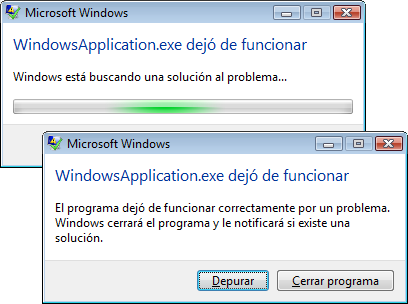

# <a name="application-management-overview"></a><span data-ttu-id="0832b-102">Información general sobre la administración de aplicaciones</span><span class="sxs-lookup"><span data-stu-id="0832b-102">Application Management Overview</span></span>
<span data-ttu-id="0832b-103">Todas las aplicaciones suelen compartir un conjunto común de funciones que se aplica a la implementación y la administración de la aplicación.</span><span class="sxs-lookup"><span data-stu-id="0832b-103">All applications tend to share a common set of functionality that applies to application implementation and management.</span></span> <span data-ttu-id="0832b-104">Este tema proporciona información general de la funcionalidad de la <xref:System.Windows.Application> clase para crear y administrar aplicaciones.</span><span class="sxs-lookup"><span data-stu-id="0832b-104">This topic provides an overview of the functionality in the <xref:System.Windows.Application> class for creating and managing applications.</span></span>  
   
  
## <a name="the-application-class"></a><span data-ttu-id="0832b-105">La clase Application</span><span class="sxs-lookup"><span data-stu-id="0832b-105">The Application Class</span></span>  
 <span data-ttu-id="0832b-106">En [!INCLUDE[TLA2#tla_wpf](../../../../includes/tla2sharptla-wpf-md.md)], se encapsula la funcionalidad común de ámbito de la aplicación en la <xref:System.Windows.Application> clase.</span><span class="sxs-lookup"><span data-stu-id="0832b-106">In [!INCLUDE[TLA2#tla_wpf](../../../../includes/tla2sharptla-wpf-md.md)], common application-scoped functionality is encapsulated in the <xref:System.Windows.Application> class.</span></span> <span data-ttu-id="0832b-107">La <xref:System.Windows.Application> clase incluye la funcionalidad siguiente:</span><span class="sxs-lookup"><span data-stu-id="0832b-107">The <xref:System.Windows.Application> class includes the following functionality:</span></span>  
  
-   <span data-ttu-id="0832b-108">Realizar el seguimiento e interactuar con la duración de la aplicación.</span><span class="sxs-lookup"><span data-stu-id="0832b-108">Tracking and interacting with application lifetime.</span></span>  
  
-   <span data-ttu-id="0832b-109">Recuperar y procesar los parámetros de la línea de comandos.</span><span class="sxs-lookup"><span data-stu-id="0832b-109">Retrieving and processing command-line parameters.</span></span>  
  
-   <span data-ttu-id="0832b-110">Detectar y responder a las excepciones no controladas.</span><span class="sxs-lookup"><span data-stu-id="0832b-110">Detecting and responding to unhandled exceptions.</span></span>  
  
-   <span data-ttu-id="0832b-111">Compartir propiedades y recursos en el ámbito de aplicación.</span><span class="sxs-lookup"><span data-stu-id="0832b-111">Sharing application-scope properties and resources.</span></span>  
  
-   <span data-ttu-id="0832b-112">Administrar ventanas en las aplicaciones independientes.</span><span class="sxs-lookup"><span data-stu-id="0832b-112">Managing windows in standalone applications.</span></span>  
  
-   <span data-ttu-id="0832b-113">Seguimiento y administración de la navegación.</span><span class="sxs-lookup"><span data-stu-id="0832b-113">Tracking and managing navigation.</span></span>  
  
<a name="The_Application_Class"></a>   
## <a name="how-to-perform-common-tasks-using-the-application-class"></a><span data-ttu-id="0832b-114">Cómo realizar las tareas comunes con la clase Application</span><span class="sxs-lookup"><span data-stu-id="0832b-114">How to Perform Common Tasks Using the Application Class</span></span>  
 <span data-ttu-id="0832b-115">Si no está interesado en todos los detalles de la <xref:System.Windows.Application> (clase), en la tabla siguiente se enumera algunas de las tareas comunes para <xref:System.Windows.Application> y cómo realizarlas.</span><span class="sxs-lookup"><span data-stu-id="0832b-115">If you are not interested in all of the details of the <xref:System.Windows.Application> class, the following table lists some of the common tasks for <xref:System.Windows.Application> and how to accomplish them.</span></span> <span data-ttu-id="0832b-116">Viendo las API y los temas relacionados, puede buscar más información y código de ejemplo.</span><span class="sxs-lookup"><span data-stu-id="0832b-116">By viewing the related API and topics, you can find more information and sample code.</span></span>  
  
|<span data-ttu-id="0832b-117">Tarea</span><span class="sxs-lookup"><span data-stu-id="0832b-117">Task</span></span>|<span data-ttu-id="0832b-118">Método</span><span class="sxs-lookup"><span data-stu-id="0832b-118">Approach</span></span>|  
|----------|--------------|  
|<span data-ttu-id="0832b-119">Obtener un objeto que representa la aplicación actual</span><span class="sxs-lookup"><span data-stu-id="0832b-119">Get an object that represents the current application</span></span>|<span data-ttu-id="0832b-120">Utilice la propiedad <xref:System.Windows.Application.Current%2A?displayProperty=nameWithType>.</span><span class="sxs-lookup"><span data-stu-id="0832b-120">Use the <xref:System.Windows.Application.Current%2A?displayProperty=nameWithType> property.</span></span>|  
|<span data-ttu-id="0832b-121">Agregar una pantalla de inicio a una aplicación</span><span class="sxs-lookup"><span data-stu-id="0832b-121">Add a startup screen to an application</span></span>|<span data-ttu-id="0832b-122">Vea [agregar una pantalla de presentación a una aplicación de WPF](../../../../docs/framework/wpf/app-development/how-to-add-a-splash-screen-to-a-wpf-application.md).</span><span class="sxs-lookup"><span data-stu-id="0832b-122">See [Add a Splash Screen to a WPF Application](../../../../docs/framework/wpf/app-development/how-to-add-a-splash-screen-to-a-wpf-application.md).</span></span>|  
|<span data-ttu-id="0832b-123">Iniciar una aplicación</span><span class="sxs-lookup"><span data-stu-id="0832b-123">Start an application</span></span>|<span data-ttu-id="0832b-124">Utilice el método <xref:System.Windows.Application.Run%2A?displayProperty=nameWithType>.</span><span class="sxs-lookup"><span data-stu-id="0832b-124">Use the <xref:System.Windows.Application.Run%2A?displayProperty=nameWithType> method.</span></span>|  
|<span data-ttu-id="0832b-125">Detener una aplicación</span><span class="sxs-lookup"><span data-stu-id="0832b-125">Stop an application</span></span>|<span data-ttu-id="0832b-126">Use la <xref:System.Windows.Application.Shutdown%2A> método de la <xref:System.Windows.Application.Current%2A?displayProperty=nameWithType> objeto.</span><span class="sxs-lookup"><span data-stu-id="0832b-126">Use the <xref:System.Windows.Application.Shutdown%2A> method of the <xref:System.Windows.Application.Current%2A?displayProperty=nameWithType> object.</span></span>|  
|<span data-ttu-id="0832b-127">Obtener los argumentos de la línea de comandos</span><span class="sxs-lookup"><span data-stu-id="0832b-127">Get arguments from the command line</span></span>|<span data-ttu-id="0832b-128">Controlar la <xref:System.Windows.Application.Startup?displayProperty=nameWithType> evento y utilice la <xref:System.Windows.StartupEventArgs.Args%2A?displayProperty=nameWithType> propiedad.</span><span class="sxs-lookup"><span data-stu-id="0832b-128">Handle the <xref:System.Windows.Application.Startup?displayProperty=nameWithType> event and use the <xref:System.Windows.StartupEventArgs.Args%2A?displayProperty=nameWithType> property.</span></span> <span data-ttu-id="0832b-129">Para obtener un ejemplo, vea el <xref:System.Windows.Application.Startup?displayProperty=nameWithType> eventos.</span><span class="sxs-lookup"><span data-stu-id="0832b-129">For an example, see the <xref:System.Windows.Application.Startup?displayProperty=nameWithType> event.</span></span>|  
|<span data-ttu-id="0832b-130">Obtener y establecer el código de salida de la aplicación</span><span class="sxs-lookup"><span data-stu-id="0832b-130">Get and set the application exit code</span></span>|<span data-ttu-id="0832b-131">Establecer el <xref:System.Windows.ExitEventArgs.ApplicationExitCode%2A?displayProperty=nameWithType> propiedad en el <xref:System.Windows.Application.Exit?displayProperty=nameWithType> controlador de eventos o llamada la <xref:System.Windows.Application.Shutdown%2A> método y pasar un entero.</span><span class="sxs-lookup"><span data-stu-id="0832b-131">Set the <xref:System.Windows.ExitEventArgs.ApplicationExitCode%2A?displayProperty=nameWithType> property in the <xref:System.Windows.Application.Exit?displayProperty=nameWithType> event handler or call the <xref:System.Windows.Application.Shutdown%2A> method and pass in an integer.</span></span>|  
|<span data-ttu-id="0832b-132">Detectar y responder a las excepciones no controladas</span><span class="sxs-lookup"><span data-stu-id="0832b-132">Detect and respond to unhandled exceptions</span></span>|<span data-ttu-id="0832b-133">Controlar la <xref:System.Windows.Application.DispatcherUnhandledException> eventos.</span><span class="sxs-lookup"><span data-stu-id="0832b-133">Handle the <xref:System.Windows.Application.DispatcherUnhandledException> event.</span></span>|  
|<span data-ttu-id="0832b-134">Obtener y establecer recursos en el ámbito de aplicación</span><span class="sxs-lookup"><span data-stu-id="0832b-134">Get and set application-scoped resources</span></span>|<span data-ttu-id="0832b-135">Utilice la propiedad <xref:System.Windows.Application.Resources%2A?displayProperty=nameWithType>.</span><span class="sxs-lookup"><span data-stu-id="0832b-135">Use the <xref:System.Windows.Application.Resources%2A?displayProperty=nameWithType> property.</span></span>|  
|<span data-ttu-id="0832b-136">Usar un diccionario de recursos en el ámbito de aplicación</span><span class="sxs-lookup"><span data-stu-id="0832b-136">Use an application-scope resource dictionary</span></span>|<span data-ttu-id="0832b-137">Vea [utilizar un diccionario de recursos en el ámbito de la aplicación](../../../../docs/framework/wpf/app-development/how-to-use-an-application-scope-resource-dictionary.md).</span><span class="sxs-lookup"><span data-stu-id="0832b-137">See [Use an Application-Scope Resource Dictionary](../../../../docs/framework/wpf/app-development/how-to-use-an-application-scope-resource-dictionary.md).</span></span>|  
|<span data-ttu-id="0832b-138">Obtener y establecer propiedades en el ámbito de aplicación</span><span class="sxs-lookup"><span data-stu-id="0832b-138">Get and set application-scoped properties</span></span>|<span data-ttu-id="0832b-139">Utilice la propiedad <xref:System.Windows.Application.Properties%2A?displayProperty=nameWithType>.</span><span class="sxs-lookup"><span data-stu-id="0832b-139">Use the <xref:System.Windows.Application.Properties%2A?displayProperty=nameWithType> property.</span></span>|  
|<span data-ttu-id="0832b-140">Obtener y guardar el estado de una aplicación</span><span class="sxs-lookup"><span data-stu-id="0832b-140">Get and save an application's state</span></span>|<span data-ttu-id="0832b-141">Vea [conservar y restaurar propiedades de ámbito de la aplicación a través de sesiones de la aplicación](../../../../docs/framework/wpf/app-development/persist-and-restore-application-scope-properties.md).</span><span class="sxs-lookup"><span data-stu-id="0832b-141">See [Persist and Restore Application-Scope Properties Across Application Sessions](../../../../docs/framework/wpf/app-development/persist-and-restore-application-scope-properties.md).</span></span>|  
|<span data-ttu-id="0832b-142">Administrar archivos de datos que no son de código, incluidos los archivos de recursos, los archivos de contenido y los archivos de sitio de origen.</span><span class="sxs-lookup"><span data-stu-id="0832b-142">Manage non-code data files, including resource files, content files, and site-of-origin files.</span></span>|<span data-ttu-id="0832b-143">Vea [recursos de la aplicación de WPF, contenido y archivos de datos](../../../../docs/framework/wpf/app-development/wpf-application-resource-content-and-data-files.md).</span><span class="sxs-lookup"><span data-stu-id="0832b-143">See [WPF Application Resource, Content, and Data Files](../../../../docs/framework/wpf/app-development/wpf-application-resource-content-and-data-files.md).</span></span>|  
|<span data-ttu-id="0832b-144">Administrar ventanas en las aplicaciones independientes</span><span class="sxs-lookup"><span data-stu-id="0832b-144">Manage windows in standalone applications</span></span>|<span data-ttu-id="0832b-145">Vea [WPF Windows Overview](../../../../docs/framework/wpf/app-development/wpf-windows-overview.md) (Introducción a Windows Presentation Foundation).</span><span class="sxs-lookup"><span data-stu-id="0832b-145">See [WPF Windows Overview](../../../../docs/framework/wpf/app-development/wpf-windows-overview.md).</span></span>|  
|<span data-ttu-id="0832b-146">Realizar un seguimiento y administrar la navegación</span><span class="sxs-lookup"><span data-stu-id="0832b-146">Track and manage navigation</span></span>|<span data-ttu-id="0832b-147">Vea [información general de navegación](../../../../docs/framework/wpf/app-development/navigation-overview.md).</span><span class="sxs-lookup"><span data-stu-id="0832b-147">See [Navigation Overview](../../../../docs/framework/wpf/app-development/navigation-overview.md).</span></span>|  
  
<a name="The_Application_Definition"></a>   
## <a name="the-application-definition"></a><span data-ttu-id="0832b-148">La definición de aplicación</span><span class="sxs-lookup"><span data-stu-id="0832b-148">The Application Definition</span></span>  
 <span data-ttu-id="0832b-149">Para utilizar la funcionalidad de la <xref:System.Windows.Application> (clase), debe implementar una definición de aplicación.</span><span class="sxs-lookup"><span data-stu-id="0832b-149">To utilize the functionality of the <xref:System.Windows.Application> class, you must implement an application definition.</span></span> <span data-ttu-id="0832b-150">A [!INCLUDE[TLA2#tla_wpf](../../../../includes/tla2sharptla-wpf-md.md)] definición de la aplicación es una clase que deriva de <xref:System.Windows.Application> y está configurado con una clase especial [!INCLUDE[TLA#tla_msbuild](../../../../includes/tlasharptla-msbuild-md.md)] configuración.</span><span class="sxs-lookup"><span data-stu-id="0832b-150">A [!INCLUDE[TLA2#tla_wpf](../../../../includes/tla2sharptla-wpf-md.md)] application definition is a class that derives from <xref:System.Windows.Application> and is configured with a special [!INCLUDE[TLA#tla_msbuild](../../../../includes/tlasharptla-msbuild-md.md)] setting.</span></span>  
  
### <a name="implementing-an-application-definition"></a><span data-ttu-id="0832b-151">Implementar una definición de aplicación</span><span class="sxs-lookup"><span data-stu-id="0832b-151">Implementing an Application Definition</span></span>  
 <span data-ttu-id="0832b-152">Una típica [!INCLUDE[TLA2#tla_wpf](../../../../includes/tla2sharptla-wpf-md.md)] definición de la aplicación se implementa mediante marcado y código subyacente.</span><span class="sxs-lookup"><span data-stu-id="0832b-152">A typical [!INCLUDE[TLA2#tla_wpf](../../../../includes/tla2sharptla-wpf-md.md)] application definition is implemented using both markup and code-behind.</span></span> <span data-ttu-id="0832b-153">Esto le permite usar marcado para establecer mediante declaración propiedades, recursos y eventos de registro de la aplicación, mientras que el control de eventos y la implementación del comportamiento específico de la aplicación se realizan en el código subyacente.</span><span class="sxs-lookup"><span data-stu-id="0832b-153">This allows you to use markup to declaratively set application properties, resources, and register events, while handling events and implementing application-specific behavior in code-behind.</span></span>  
  
 <span data-ttu-id="0832b-154">En el ejemplo siguiente se muestra cómo implementar una definición de aplicación usando tanto marcado como código subyacente:</span><span class="sxs-lookup"><span data-stu-id="0832b-154">The following example shows how to implement an application definition using both markup and code-behind:</span></span>  
  
 [!code-xaml[ApplicationSnippets#ApplicationXAML](../../../../samples/snippets/csharp/VS_Snippets_Wpf/ApplicationSnippets/CSharp/App.xaml#applicationxaml)]  
  
 [!code-csharp[ApplicationSnippets#ApplicationCODEBEHIND](../../../../samples/snippets/csharp/VS_Snippets_Wpf/ApplicationSnippets/CSharp/App.xaml.cs#applicationcodebehind)]
 [!code-vb[ApplicationSnippets#ApplicationCODEBEHIND](../../../../samples/snippets/visualbasic/VS_Snippets_Wpf/ApplicationSnippets/visualbasic/application.xaml.vb#applicationcodebehind)]  
  
 <span data-ttu-id="0832b-155">Para que un archivo de marcado y un archivo de código subyacente funcionen conjuntamente, debe ocurrir lo siguiente:</span><span class="sxs-lookup"><span data-stu-id="0832b-155">To allow a markup file and code-behind file to work together, the following needs to happen:</span></span>  
  
-   <span data-ttu-id="0832b-156">En el marcado, el `Application` elemento debe incluir el `x:Class` atributo.</span><span class="sxs-lookup"><span data-stu-id="0832b-156">In markup, the `Application` element must include the `x:Class` attribute.</span></span> <span data-ttu-id="0832b-157">Cuando se compila la aplicación, la existencia de `x:Class` en el marcado hace archivo [!INCLUDE[TLA2#tla_msbuild](../../../../includes/tla2sharptla-msbuild-md.md)] para crear un `partial` clase que deriva de <xref:System.Windows.Application> y tiene el nombre especificado por el `x:Class` atributo.</span><span class="sxs-lookup"><span data-stu-id="0832b-157">When the application is built, the existence of `x:Class` in the markup file causes [!INCLUDE[TLA2#tla_msbuild](../../../../includes/tla2sharptla-msbuild-md.md)] to create a `partial` class that derives from <xref:System.Windows.Application> and has the name that is specified by the `x:Class` attribute.</span></span> <span data-ttu-id="0832b-158">Esto requiere la adición de un [!INCLUDE[TLA2#tla_xml](../../../../includes/tla2sharptla-xml-md.md)] declaración de espacio de nombres para el [!INCLUDE[TLA2#tla_xaml](../../../../includes/tla2sharptla-xaml-md.md)] esquema ( `xmlns:x="http://schemas.microsoft.com/winfx/2006/xaml"` ).</span><span class="sxs-lookup"><span data-stu-id="0832b-158">This requires the addition of an [!INCLUDE[TLA2#tla_xml](../../../../includes/tla2sharptla-xml-md.md)] namespace declaration for the [!INCLUDE[TLA2#tla_xaml](../../../../includes/tla2sharptla-xaml-md.md)] schema ( `xmlns:x="http://schemas.microsoft.com/winfx/2006/xaml"` ).</span></span>  
  
-   <span data-ttu-id="0832b-159">En el código subyacente, la clase debe ser un `partial` clase con el mismo nombre que se especifica mediante la `x:Class` de atributo en el marcado y debe derivarse de <xref:System.Windows.Application>.</span><span class="sxs-lookup"><span data-stu-id="0832b-159">In code-behind, the class must be a `partial` class with the same name that is specified by the `x:Class` attribute in markup and must derive from <xref:System.Windows.Application>.</span></span> <span data-ttu-id="0832b-160">Esto permite que el archivo de código subyacente asociar a la `partial` clase que se genera para el archivo de marcado cuando se compila la aplicación (consulte [compilar una aplicación de WPF](../../../../docs/framework/wpf/app-development/building-a-wpf-application-wpf.md)).</span><span class="sxs-lookup"><span data-stu-id="0832b-160">This allows the code-behind file to be associated with the `partial` class that is generated for the markup file when the application is built (see [Building a WPF Application](../../../../docs/framework/wpf/app-development/building-a-wpf-application-wpf.md)).</span></span>  
  
> [!NOTE]
>  <span data-ttu-id="0832b-161">Cuando se crea un nuevo proyecto de aplicación WPF o proyecto de aplicación de explorador WPF mediante [!INCLUDE[TLA#tla_visualstu](../../../../includes/tlasharptla-visualstu-md.md)], una definición de aplicación se incluye de forma predeterminada y se define mediante marcado y código subyacente.</span><span class="sxs-lookup"><span data-stu-id="0832b-161">When you create a new WPF Application project or WPF Browser Application project using [!INCLUDE[TLA#tla_visualstu](../../../../includes/tlasharptla-visualstu-md.md)], an application definition is included by default and is defined using both markup and code-behind.</span></span>  
  
 <span data-ttu-id="0832b-162">Este código es el mínimo necesario para implementar una definición de aplicación.</span><span class="sxs-lookup"><span data-stu-id="0832b-162">This code is the minimum that is required to implement an application definition.</span></span> <span data-ttu-id="0832b-163">Sin embargo, otros [!INCLUDE[TLA2#tla_msbuild](../../../../includes/tla2sharptla-msbuild-md.md)] configuración debe realizarse en la definición de la aplicación antes de compilar y ejecutar la aplicación.</span><span class="sxs-lookup"><span data-stu-id="0832b-163">However, an additional [!INCLUDE[TLA2#tla_msbuild](../../../../includes/tla2sharptla-msbuild-md.md)] configuration needs to be made to the application definition before building and running the application.</span></span>  
  
### <a name="configuring-the-application-definition-for-msbuild"></a><span data-ttu-id="0832b-164">Configurar la definición de aplicación para MSBuild</span><span class="sxs-lookup"><span data-stu-id="0832b-164">Configuring the Application Definition for MSBuild</span></span>  
 <span data-ttu-id="0832b-165">Las aplicaciones independientes y [!INCLUDE[TLA#tla_xbap#plural](../../../../includes/tlasharptla-xbapsharpplural-md.md)] requieren la implementación de un cierto nivel de infraestructura para poder ejecutar.</span><span class="sxs-lookup"><span data-stu-id="0832b-165">Standalone applications and [!INCLUDE[TLA#tla_xbap#plural](../../../../includes/tlasharptla-xbapsharpplural-md.md)] require the implementation of a certain level of infrastructure before they can run.</span></span> <span data-ttu-id="0832b-166">La parte más importante de esta infraestructura es el punto de entrada.</span><span class="sxs-lookup"><span data-stu-id="0832b-166">The most important part of this infrastructure is the entry point.</span></span> <span data-ttu-id="0832b-167">Cuando un usuario inicia una aplicación, el sistema operativo llama al punto de entrada, que es una función conocida para iniciar las aplicaciones.</span><span class="sxs-lookup"><span data-stu-id="0832b-167">When an application is launched by a user, the operating system calls the entry point, which is a well-known function for starting applications.</span></span>  
  
 <span data-ttu-id="0832b-168">Tradicionalmente, los desarrolladores necesitaban escribir todo o parte de este código, según la tecnología.</span><span class="sxs-lookup"><span data-stu-id="0832b-168">Traditionally, developers have needed to write some or all of this code for themselves, depending on the technology.</span></span> <span data-ttu-id="0832b-169">Sin embargo, [!INCLUDE[TLA2#tla_wpf](../../../../includes/tla2sharptla-wpf-md.md)] este código se genera automáticamente cuando el archivo de marcado de la definición de la aplicación se configura como un [!INCLUDE[TLA2#tla_msbuild](../../../../includes/tla2sharptla-msbuild-md.md)] `ApplicationDefinition` de elemento, tal y como se muestra en la siguiente [!INCLUDE[TLA2#tla_msbuild](../../../../includes/tla2sharptla-msbuild-md.md)] archivo de proyecto:</span><span class="sxs-lookup"><span data-stu-id="0832b-169">However, [!INCLUDE[TLA2#tla_wpf](../../../../includes/tla2sharptla-wpf-md.md)] generates this code for you when the markup file of your application definition is configured as an [!INCLUDE[TLA2#tla_msbuild](../../../../includes/tla2sharptla-msbuild-md.md)]`ApplicationDefinition` item, as shown in the following [!INCLUDE[TLA2#tla_msbuild](../../../../includes/tla2sharptla-msbuild-md.md)] project file:</span></span>  
  
```xml  
<Project   
  DefaultTargets="Build"  
                        xmlns="http://schemas.microsoft.com/developer/msbuild/2003">  
  ...  
  <ApplicationDefinition Include="App.xaml" />  
  <Compile Include="App.xaml.cs" />  
  ...  
</Project>  
```  
  
 <span data-ttu-id="0832b-170">Dado que el archivo de código subyacente contiene el código, se marca como un [!INCLUDE[TLA2#tla_msbuild](../../../../includes/tla2sharptla-msbuild-md.md)] `Compile` de elemento, como es normal.</span><span class="sxs-lookup"><span data-stu-id="0832b-170">Because the code-behind file contains code, it is marked as an [!INCLUDE[TLA2#tla_msbuild](../../../../includes/tla2sharptla-msbuild-md.md)]`Compile` item, as is normal.</span></span>  
  
 <span data-ttu-id="0832b-171">La aplicación de estos [!INCLUDE[TLA2#tla_msbuild](../../../../includes/tla2sharptla-msbuild-md.md)] hace que las configuraciones a los archivos de marcado y código subyacente de una definición de aplicación [!INCLUDE[TLA2#tla_msbuild](../../../../includes/tla2sharptla-msbuild-md.md)] para generar código similar al siguiente:</span><span class="sxs-lookup"><span data-stu-id="0832b-171">The application of these [!INCLUDE[TLA2#tla_msbuild](../../../../includes/tla2sharptla-msbuild-md.md)] configurations to the markup and code-behind files of an application definition causes [!INCLUDE[TLA2#tla_msbuild](../../../../includes/tla2sharptla-msbuild-md.md)] to generate code like the following:</span></span>  
  
 [!code-csharp[AppDefAugSnippets#AppDefAugCODE1](../../../../samples/snippets/csharp/VS_Snippets_Wpf/AppDefAugSnippets/CSharp/App.cs#appdefaugcode1)]
 [!code-vb[AppDefAugSnippets#AppDefAugCODE1](../../../../samples/snippets/visualbasic/VS_Snippets_Wpf/AppDefAugSnippets/VisualBasic/App.vb#appdefaugcode1)]  
[!code-csharp[AppDefAugSnippets#AppDefAugCODE2](../../../../samples/snippets/csharp/VS_Snippets_Wpf/AppDefAugSnippets/CSharp/App.cs#appdefaugcode2)]
[!code-vb[AppDefAugSnippets#AppDefAugCODE2](../../../../samples/snippets/visualbasic/VS_Snippets_Wpf/AppDefAugSnippets/VisualBasic/App.vb#appdefaugcode2)]  
  
 <span data-ttu-id="0832b-172">El código resultante amplía la definición de la aplicación con código de infraestructura adicional, que incluye el método de punto de entrada `Main`.</span><span class="sxs-lookup"><span data-stu-id="0832b-172">The resulting code augments your application definition with additional infrastructure code, which includes the entry-point method `Main`.</span></span> <span data-ttu-id="0832b-173">El <xref:System.STAThreadAttribute> atributo se aplica a la `Main` método para indicar que el método main [!INCLUDE[TLA2#tla_ui](../../../../includes/tla2sharptla-ui-md.md)] del subproceso para el [!INCLUDE[TLA2#tla_wpf](../../../../includes/tla2sharptla-wpf-md.md)] aplicación es un subproceso de STA, que es necesario para [!INCLUDE[TLA2#tla_wpf](../../../../includes/tla2sharptla-wpf-md.md)] aplicaciones.</span><span class="sxs-lookup"><span data-stu-id="0832b-173">The <xref:System.STAThreadAttribute> attribute is applied to the `Main` method to indicate that the main [!INCLUDE[TLA2#tla_ui](../../../../includes/tla2sharptla-ui-md.md)] thread for the [!INCLUDE[TLA2#tla_wpf](../../../../includes/tla2sharptla-wpf-md.md)] application is an STA thread, which is required for [!INCLUDE[TLA2#tla_wpf](../../../../includes/tla2sharptla-wpf-md.md)] applications.</span></span> <span data-ttu-id="0832b-174">Cuando se llama, `Main` crea una nueva instancia de `App` antes de llamar a la `InitializeComponent` método para registrar los eventos y establecer las propiedades que se implementan en el marcado.</span><span class="sxs-lookup"><span data-stu-id="0832b-174">When called, `Main` creates a new instance of `App` before calling the `InitializeComponent` method to register the events and set the properties that are implemented in markup.</span></span> <span data-ttu-id="0832b-175">Dado que `InitializeComponent` se genera automáticamente, no es necesario llamar explícitamente a `InitializeComponent` de una definición de aplicación como haría para <xref:System.Windows.Controls.Page> y <xref:System.Windows.Window> las implementaciones.</span><span class="sxs-lookup"><span data-stu-id="0832b-175">Because `InitializeComponent` is generated for you, you don't need to explicitly call `InitializeComponent` from an application definition like you do for <xref:System.Windows.Controls.Page> and <xref:System.Windows.Window> implementations.</span></span> <span data-ttu-id="0832b-176">Por último, el <xref:System.Windows.Application.Run%2A> método se llama para iniciar la aplicación.</span><span class="sxs-lookup"><span data-stu-id="0832b-176">Finally, the <xref:System.Windows.Application.Run%2A> method is called to start the application.</span></span>  
  
<a name="Getting_the_Current_Application"></a>   
## <a name="getting-the-current-application"></a><span data-ttu-id="0832b-177">Obtener la aplicación actual</span><span class="sxs-lookup"><span data-stu-id="0832b-177">Getting the Current Application</span></span>  
 <span data-ttu-id="0832b-178">Dado que la funcionalidad de la <xref:System.Windows.Application> clase se comparten en toda la aplicación, puede haber solo una instancia de la <xref:System.Windows.Application> clase por <xref:System.AppDomain>.</span><span class="sxs-lookup"><span data-stu-id="0832b-178">Because the functionality of the <xref:System.Windows.Application> class are shared across an application, there can be only one instance of the <xref:System.Windows.Application> class per <xref:System.AppDomain>.</span></span> <span data-ttu-id="0832b-179">Para exigir esto, la <xref:System.Windows.Application> clase se implementa como una clase singleton (vea [Implementing Singleton en C#](http://go.microsoft.com/fwlink/?LinkId=100567)), que crea una única instancia de sí misma y proporciona acceso comparten a ella con el `static` <xref:System.Windows.Application.Current%2A> propiedad.</span><span class="sxs-lookup"><span data-stu-id="0832b-179">To enforce this, the <xref:System.Windows.Application> class is implemented as a singleton class (see [Implementing Singleton in C#](http://go.microsoft.com/fwlink/?LinkId=100567)), which creates a single instance of itself and provides shared access to it with the `static`<xref:System.Windows.Application.Current%2A> property.</span></span>  
  
 <span data-ttu-id="0832b-180">El código siguiente muestra cómo adquirir una referencia a la <xref:System.Windows.Application> objeto actuales <xref:System.AppDomain>.</span><span class="sxs-lookup"><span data-stu-id="0832b-180">The following code shows how to acquire a reference to the <xref:System.Windows.Application> object for the current <xref:System.AppDomain>.</span></span>  
  
 [!code-csharp[ApplicationManagementOverviewSnippets#GetCurrentAppCODE](../../../../samples/snippets/csharp/VS_Snippets_Wpf/ApplicationManagementOverviewSnippets/CSharp/MainWindow.xaml.cs#getcurrentappcode)]
 [!code-vb[ApplicationManagementOverviewSnippets#GetCurrentAppCODE](../../../../samples/snippets/visualbasic/VS_Snippets_Wpf/ApplicationManagementOverviewSnippets/VisualBasic/MainWindow.xaml.vb#getcurrentappcode)]  
  
 <span data-ttu-id="0832b-181"><xref:System.Windows.Application.Current%2A>Devuelve una referencia a una instancia de la <xref:System.Windows.Application> clase.</span><span class="sxs-lookup"><span data-stu-id="0832b-181"><xref:System.Windows.Application.Current%2A> returns a reference to an instance of the <xref:System.Windows.Application> class.</span></span> <span data-ttu-id="0832b-182">Si desea obtener una referencia a la <xref:System.Windows.Application> derivadas de la clase debe convertir el valor de la <xref:System.Windows.Application.Current%2A> propiedad, como se muestra en el ejemplo siguiente.</span><span class="sxs-lookup"><span data-stu-id="0832b-182">If you want a reference to your <xref:System.Windows.Application> derived class you must cast the value of the <xref:System.Windows.Application.Current%2A> property, as shown in the following example.</span></span>  
  
 [!code-csharp[ApplicationManagementOverviewSnippets#GetSTCurrentAppCODE](../../../../samples/snippets/csharp/VS_Snippets_Wpf/ApplicationManagementOverviewSnippets/CSharp/MainWindow.xaml.cs#getstcurrentappcode)]
 [!code-vb[ApplicationManagementOverviewSnippets#GetSTCurrentAppCODE](../../../../samples/snippets/visualbasic/VS_Snippets_Wpf/ApplicationManagementOverviewSnippets/VisualBasic/MainWindow.xaml.vb#getstcurrentappcode)]  
  
 <span data-ttu-id="0832b-183">Puede inspeccionar el valor de <xref:System.Windows.Application.Current%2A> en cualquier punto de la duración de un <xref:System.Windows.Application> objeto.</span><span class="sxs-lookup"><span data-stu-id="0832b-183">You can inspect the value of <xref:System.Windows.Application.Current%2A> at any point in the lifetime of an <xref:System.Windows.Application> object.</span></span> <span data-ttu-id="0832b-184">En cambio, se recomienda tener cuidado.</span><span class="sxs-lookup"><span data-stu-id="0832b-184">However, you should be careful.</span></span> <span data-ttu-id="0832b-185">Después de la <xref:System.Windows.Application> se crea una instancia de clase, no hay un período durante el cual el estado de la <xref:System.Windows.Application> objeto no es coherente.</span><span class="sxs-lookup"><span data-stu-id="0832b-185">After the <xref:System.Windows.Application> class is instantiated, there is a period during which the state of the <xref:System.Windows.Application> object is inconsistent.</span></span> <span data-ttu-id="0832b-186">Durante este período, <xref:System.Windows.Application> está realizando las diversas tareas de inicialización que necesita el código para ejecutar, incluido el establecimiento de la infraestructura de aplicación, establecer las propiedades y registrar los eventos.</span><span class="sxs-lookup"><span data-stu-id="0832b-186">During this period, <xref:System.Windows.Application> is performing the various initialization tasks that are required by your code to run, including establishing application infrastructure, setting properties, and registering events.</span></span> <span data-ttu-id="0832b-187">Si intenta utilizar el <xref:System.Windows.Application> objeto durante este período, el código puede tener resultados inesperados, especialmente si depende de los distintos <xref:System.Windows.Application> propiedades que se va a establecer.</span><span class="sxs-lookup"><span data-stu-id="0832b-187">If you try to use the <xref:System.Windows.Application> object during this period, your code may have unexpected results, particularly if it depends on the various <xref:System.Windows.Application> properties being set.</span></span>  
  
 <span data-ttu-id="0832b-188">Cuando <xref:System.Windows.Application> complete su trabajo de inicialización, se inicia realmente su duración.</span><span class="sxs-lookup"><span data-stu-id="0832b-188">When <xref:System.Windows.Application> completes its initialization work, its lifetime truly begins.</span></span>  
  
<a name="Application_Lifetime"></a>   
## <a name="application-lifetime"></a><span data-ttu-id="0832b-189">Duración de la aplicación</span><span class="sxs-lookup"><span data-stu-id="0832b-189">Application Lifetime</span></span>  
 <span data-ttu-id="0832b-190">La duración de un [!INCLUDE[TLA2#tla_wpf](../../../../includes/tla2sharptla-wpf-md.md)] aplicación está marcada por varios eventos generados por <xref:System.Windows.Application> para que sepa cuándo se ha iniciado la aplicación, se ha activado y desactivado y se ha cerrado.</span><span class="sxs-lookup"><span data-stu-id="0832b-190">The lifetime of a [!INCLUDE[TLA2#tla_wpf](../../../../includes/tla2sharptla-wpf-md.md)] application is marked by several events that are raised by <xref:System.Windows.Application> to let you know when your application has started, has been activated and deactivated, and has been shut down.</span></span>  
  
  
<a name="Splash_Screen"></a>   
### <a name="splash-screen"></a><span data-ttu-id="0832b-191">Pantalla de presentación</span><span class="sxs-lookup"><span data-stu-id="0832b-191">Splash Screen</span></span>  
 <span data-ttu-id="0832b-192">A partir de la [!INCLUDE[net_v35SP1_short](../../../../includes/net-v35sp1-short-md.md)], puede especificar una imagen para su uso en una ventana de inicio, o *pantalla de presentación*.</span><span class="sxs-lookup"><span data-stu-id="0832b-192">Starting in the [!INCLUDE[net_v35SP1_short](../../../../includes/net-v35sp1-short-md.md)], you can specify an image to be used in a startup window, or *splash screen*.</span></span> <span data-ttu-id="0832b-193">La <xref:System.Windows.SplashScreen> clase facilita la tarea mostrar una ventana de inicio mientras se está cargando la aplicación.</span><span class="sxs-lookup"><span data-stu-id="0832b-193">The <xref:System.Windows.SplashScreen> class makes it easy to display a startup window while your application is loading.</span></span> <span data-ttu-id="0832b-194">El <xref:System.Windows.SplashScreen> ventana se crea y se mostró anteriormente <xref:System.Windows.Application.Run%2A> se llama.</span><span class="sxs-lookup"><span data-stu-id="0832b-194">The <xref:System.Windows.SplashScreen> window is created and shown before <xref:System.Windows.Application.Run%2A> is called.</span></span> <span data-ttu-id="0832b-195">Para obtener más información, consulte [tiempo de inicio de la aplicación](../../../../docs/framework/wpf/advanced/application-startup-time.md) y [agregar una pantalla de presentación a una aplicación de WPF](../../../../docs/framework/wpf/app-development/how-to-add-a-splash-screen-to-a-wpf-application.md).</span><span class="sxs-lookup"><span data-stu-id="0832b-195">For more information, see [Application Startup Time](../../../../docs/framework/wpf/advanced/application-startup-time.md) and [Add a Splash Screen to a WPF Application](../../../../docs/framework/wpf/app-development/how-to-add-a-splash-screen-to-a-wpf-application.md).</span></span>  
  
<a name="Starting_an_Application"></a>   
### <a name="starting-an-application"></a><span data-ttu-id="0832b-196">Iniciar una aplicación</span><span class="sxs-lookup"><span data-stu-id="0832b-196">Starting an Application</span></span>  
 <span data-ttu-id="0832b-197">Después de <xref:System.Windows.Application.Run%2A> se llama y se inicializa la aplicación, la aplicación está lista para ejecutarse.</span><span class="sxs-lookup"><span data-stu-id="0832b-197">After <xref:System.Windows.Application.Run%2A> is called and the application is initialized, the application is ready to run.</span></span> <span data-ttu-id="0832b-198">En este momento se especifica cuando la <xref:System.Windows.Application.Startup> se desencadena el evento:</span><span class="sxs-lookup"><span data-stu-id="0832b-198">This moment is signified when the <xref:System.Windows.Application.Startup> event is raised:</span></span>  
  
 [!code-csharp[ApplicationStartupSnippets#StartupCODEBEHIND1](../../../../samples/snippets/csharp/VS_Snippets_Wpf/ApplicationStartupSnippets/CSharp/App.xaml.cs#startupcodebehind1)]
 [!code-vb[ApplicationStartupSnippets#StartupCODEBEHIND1](../../../../samples/snippets/visualbasic/VS_Snippets_Wpf/ApplicationStartupSnippets/visualbasic/application.xaml.vb#startupcodebehind1)]  
[!code-csharp[ApplicationStartupSnippets#StartupCODEBEHIND2](../../../../samples/snippets/csharp/VS_Snippets_Wpf/ApplicationStartupSnippets/CSharp/App.xaml.cs#startupcodebehind2)]
[!code-vb[ApplicationStartupSnippets#StartupCODEBEHIND2](../../../../samples/snippets/visualbasic/VS_Snippets_Wpf/ApplicationStartupSnippets/visualbasic/application.xaml.vb#startupcodebehind2)]  
  
 <span data-ttu-id="0832b-199">En este momento una duración de la aplicación, lo más común consiste en mostrar una [!INCLUDE[TLA2#tla_ui](../../../../includes/tla2sharptla-ui-md.md)].</span><span class="sxs-lookup"><span data-stu-id="0832b-199">At this point in an application's lifetime, the most common thing to do is to show a [!INCLUDE[TLA2#tla_ui](../../../../includes/tla2sharptla-ui-md.md)].</span></span>  
  
<a name="Showing_a_User_Interface"></a>   
### <a name="showing-a-user-interface"></a><span data-ttu-id="0832b-200">Mostrar una interfaz de usuario</span><span class="sxs-lookup"><span data-stu-id="0832b-200">Showing a User Interface</span></span>  
 <span data-ttu-id="0832b-201">Mayoría independiente [!INCLUDE[TLA2#tla_mswin](../../../../includes/tla2sharptla-mswin-md.md)] aplicaciones abren un <xref:System.Windows.Window> cuando empieza a ejecutar.</span><span class="sxs-lookup"><span data-stu-id="0832b-201">Most standalone [!INCLUDE[TLA2#tla_mswin](../../../../includes/tla2sharptla-mswin-md.md)] applications open a <xref:System.Windows.Window> when they begin running.</span></span> <span data-ttu-id="0832b-202">El <xref:System.Windows.Application.Startup> controlador de eventos es una ubicación desde la que puede hacer esto, como se muestra en el código siguiente.</span><span class="sxs-lookup"><span data-stu-id="0832b-202">The <xref:System.Windows.Application.Startup> event handler is one location from which you can do this, as demonstrated by the following code.</span></span>  
  
 [!code-xaml[AppShowWindowHardSnippets#StartupEventMARKUP](../../../../samples/snippets/csharp/VS_Snippets_Wpf/AppShowWindowHardSnippets/CSharp/App.xaml#startupeventmarkup)]  
  
 [!code-csharp[AppShowWindowHardSnippets#StartupEventCODEBEHIND](../../../../samples/snippets/csharp/VS_Snippets_Wpf/AppShowWindowHardSnippets/CSharp/App.xaml.cs#startupeventcodebehind)]
 [!code-vb[AppShowWindowHardSnippets#StartupEventCODEBEHIND](../../../../samples/snippets/visualbasic/VS_Snippets_Wpf/AppShowWindowHardSnippets/VisualBasic/Application.xaml.vb#startupeventcodebehind)]  
  
> [!NOTE]
>  <span data-ttu-id="0832b-203">La primera <xref:System.Windows.Window> para ejecutarse en una independiente aplicación se convierte en la ventana de la aplicación principal de forma predeterminada.</span><span class="sxs-lookup"><span data-stu-id="0832b-203">The first <xref:System.Windows.Window> to be instantiated in a standalone application becomes the main application window by default.</span></span> <span data-ttu-id="0832b-204">Esto <xref:System.Windows.Window> objeto hace referencia el <xref:System.Windows.Application.MainWindow%2A?displayProperty=nameWithType> propiedad.</span><span class="sxs-lookup"><span data-stu-id="0832b-204">This <xref:System.Windows.Window> object is referenced by the <xref:System.Windows.Application.MainWindow%2A?displayProperty=nameWithType> property.</span></span> <span data-ttu-id="0832b-205">El valor de la <xref:System.Windows.Application.MainWindow%2A> propiedad se puede cambiar mediante programación si una ventana diferente que el primero crea una instancia <xref:System.Windows.Window> debe ser la ventana principal.</span><span class="sxs-lookup"><span data-stu-id="0832b-205">The value of the <xref:System.Windows.Application.MainWindow%2A> property can be changed programmatically if a different window than the first instantiated <xref:System.Windows.Window> should be the main window.</span></span>  
  
 <span data-ttu-id="0832b-206">Cuando un [!INCLUDE[TLA2#tla_xbap](../../../../includes/tla2sharptla-xbap-md.md)] inicia primero, lo más probable es que se le remitirá a un <xref:System.Windows.Controls.Page>.</span><span class="sxs-lookup"><span data-stu-id="0832b-206">When an [!INCLUDE[TLA2#tla_xbap](../../../../includes/tla2sharptla-xbap-md.md)] first starts, it will most likely navigate to a <xref:System.Windows.Controls.Page>.</span></span> <span data-ttu-id="0832b-207">Esto se muestra en el código siguiente.</span><span class="sxs-lookup"><span data-stu-id="0832b-207">This is shown in the following code.</span></span>  
  
 [!code-xaml[XBAPAppStartupSnippets#StartupXBAPMARKUP](../../../../samples/snippets/csharp/VS_Snippets_Wpf/XBAPAppStartupSnippets/CSharp/App.xaml#startupxbapmarkup)]  
  
 [!code-csharp[XBAPAppStartupSnippets#StartupXBAPCODEBEHIND](../../../../samples/snippets/csharp/VS_Snippets_Wpf/XBAPAppStartupSnippets/CSharp/App.xaml.cs#startupxbapcodebehind)]
 [!code-vb[XBAPAppStartupSnippets#StartupXBAPCODEBEHIND](../../../../samples/snippets/visualbasic/VS_Snippets_Wpf/XBAPAppStartupSnippets/VisualBasic/Application.xaml.vb#startupxbapcodebehind)]  
  
 <span data-ttu-id="0832b-208">Si controla <xref:System.Windows.Application.Startup> sólo abran un <xref:System.Windows.Window> o navegue hasta un <xref:System.Windows.Controls.Page>, puede establecer el `StartupUri` en su lugar el atributo en el marcado.</span><span class="sxs-lookup"><span data-stu-id="0832b-208">If you handle <xref:System.Windows.Application.Startup> to only open a <xref:System.Windows.Window> or navigate to a <xref:System.Windows.Controls.Page>, you can set the `StartupUri` attribute in markup instead.</span></span>  
  
 <span data-ttu-id="0832b-209">En el ejemplo siguiente se muestra cómo utilizar el <xref:System.Windows.Application.StartupUri%2A> desde una aplicación independiente para abrir un <xref:System.Windows.Window>.</span><span class="sxs-lookup"><span data-stu-id="0832b-209">The following example shows how to use the <xref:System.Windows.Application.StartupUri%2A> from a standalone application to open a <xref:System.Windows.Window>.</span></span>  
  
 [!code-xaml[ApplicationManagementOverviewSnippets#OverviewStartupUriMARKUP](../../../../samples/snippets/csharp/VS_Snippets_Wpf/ApplicationManagementOverviewSnippets/CSharp/App.xaml#overviewstartupurimarkup)]  
  
 <span data-ttu-id="0832b-210">En el ejemplo siguiente se muestra cómo usar <xref:System.Windows.Application.StartupUri%2A> desde una [!INCLUDE[TLA2#tla_xbap](../../../../includes/tla2sharptla-xbap-md.md)] para navegar hasta una <xref:System.Windows.Controls.Page>.</span><span class="sxs-lookup"><span data-stu-id="0832b-210">The following example shows how to use <xref:System.Windows.Application.StartupUri%2A> from an [!INCLUDE[TLA2#tla_xbap](../../../../includes/tla2sharptla-xbap-md.md)] to navigate to a <xref:System.Windows.Controls.Page>.</span></span>  
  
 [!code-xaml[PageSnippets#XBAPStartupUriMARKUP](../../../../samples/snippets/csharp/VS_Snippets_Wpf/PageSnippets/CSharp/App.xaml#xbapstartupurimarkup)]  
  
 <span data-ttu-id="0832b-211">Este marcado tiene el mismo efecto que el código anterior para abrir una ventana.</span><span class="sxs-lookup"><span data-stu-id="0832b-211">This markup has the same effect as the previous code for opening a window.</span></span>  
  
> [!NOTE]
>  <span data-ttu-id="0832b-212">Para obtener más información sobre la navegación, consulte [Navigation Overview](../../../../docs/framework/wpf/app-development/navigation-overview.md).</span><span class="sxs-lookup"><span data-stu-id="0832b-212">For more information on navigation, see [Navigation Overview](../../../../docs/framework/wpf/app-development/navigation-overview.md).</span></span>  
  
 <span data-ttu-id="0832b-213">Hay que administrar la <xref:System.Windows.Application.Startup> eventos para abrir un <xref:System.Windows.Window> si necesita crear instancias de él mediante un constructor no predeterminado, o debe establecer sus propiedades o suscribirse a sus eventos antes de que se muestra o se debe procesar los argumentos de línea de comandos que se proporcionaron cuando se inicia la aplicación.</span><span class="sxs-lookup"><span data-stu-id="0832b-213">You need to handle the <xref:System.Windows.Application.Startup> event to open a <xref:System.Windows.Window> if you need to instantiate it using a non-default constructor, or you need to set its properties or subscribe to its events before showing it, or you need to process any command-line arguments that were supplied when the application was launched.</span></span>  
  
<a name="Processing_Command_Line_Arguments"></a>   
### <a name="processing-command-line-arguments"></a><span data-ttu-id="0832b-214">Procesar argumentos de la línea de comandos</span><span class="sxs-lookup"><span data-stu-id="0832b-214">Processing Command-Line Arguments</span></span>  
 <span data-ttu-id="0832b-215">En [!INCLUDE[TLA2#tla_mswin](../../../../includes/tla2sharptla-mswin-md.md)], las aplicaciones independientes se pueden iniciar desde un símbolo del sistema o el escritorio.</span><span class="sxs-lookup"><span data-stu-id="0832b-215">In [!INCLUDE[TLA2#tla_mswin](../../../../includes/tla2sharptla-mswin-md.md)], standalone applications can be launched from either a command prompt or the desktop.</span></span> <span data-ttu-id="0832b-216">En ambos casos, es posible pasar argumentos de la línea de comandos a la aplicación.</span><span class="sxs-lookup"><span data-stu-id="0832b-216">In both cases, command-line arguments can be passed to the application.</span></span> <span data-ttu-id="0832b-217">En el ejemplo siguiente se muestra una aplicación que se inicia con un solo argumento de la línea de comandos, "/StartMinimized":</span><span class="sxs-lookup"><span data-stu-id="0832b-217">The following example shows an application that is launched with a single command-line argument, "/StartMinimized":</span></span>  
  
 `wpfapplication.exe /StartMinimized`  
  
 <span data-ttu-id="0832b-218">Durante la inicialización de la aplicación, [!INCLUDE[TLA2#tla_wpf](../../../../includes/tla2sharptla-wpf-md.md)] recupera los argumentos de línea de comandos del sistema operativo y los pasa a la <xref:System.Windows.Application.Startup> controlador de eventos a través de la <xref:System.Windows.StartupEventArgs.Args%2A> propiedad de la <xref:System.Windows.StartupEventArgs> parámetro.</span><span class="sxs-lookup"><span data-stu-id="0832b-218">During application initialization, [!INCLUDE[TLA2#tla_wpf](../../../../includes/tla2sharptla-wpf-md.md)] retrieves the command-line arguments from the operating system and passes them to the <xref:System.Windows.Application.Startup> event handler via the <xref:System.Windows.StartupEventArgs.Args%2A> property of the <xref:System.Windows.StartupEventArgs> parameter.</span></span> <span data-ttu-id="0832b-219">Puede recuperar y almacenar los argumentos de la línea de comandos usando código como el siguiente.</span><span class="sxs-lookup"><span data-stu-id="0832b-219">You can retrieve and store the command-line arguments using code like the following.</span></span>  
  
 [!code-xaml[ApplicationStartupSnippets#HandleStartupXAML](../../../../samples/snippets/csharp/VS_Snippets_Wpf/ApplicationStartupSnippets/CSharp/App.xaml#handlestartupxaml)]  
  
 [!code-csharp[ApplicationStartupSnippets#HandleStartupCODEBEHIND](../../../../samples/snippets/csharp/VS_Snippets_Wpf/ApplicationStartupSnippets/CSharp/App.xaml.cs#handlestartupcodebehind)]
 [!code-vb[ApplicationStartupSnippets#HandleStartupCODEBEHIND](../../../../samples/snippets/visualbasic/VS_Snippets_Wpf/ApplicationStartupSnippets/visualbasic/application.xaml.vb#handlestartupcodebehind)]  
  
 <span data-ttu-id="0832b-220">Los identificadores de código <xref:System.Windows.Application.Startup> para comprobar si la **/StartMinimized** se proporciona un argumento de línea de comandos; si es así, se abrirá la ventana principal con un <xref:System.Windows.WindowState> de <xref:System.Windows.WindowState.Minimized>.</span><span class="sxs-lookup"><span data-stu-id="0832b-220">The code handles <xref:System.Windows.Application.Startup> to check whether the **/StartMinimized** command-line argument was provided; if so, it opens the main window with a <xref:System.Windows.WindowState> of <xref:System.Windows.WindowState.Minimized>.</span></span> <span data-ttu-id="0832b-221">Tenga en cuenta que, dado el <xref:System.Windows.Window.WindowState%2A> propiedad se debe establecer mediante programación, el método main <xref:System.Windows.Window> debe abrirse explícitamente en el código.</span><span class="sxs-lookup"><span data-stu-id="0832b-221">Note that because the <xref:System.Windows.Window.WindowState%2A> property must be set programmatically, the main <xref:System.Windows.Window> must be opened explicitly in code.</span></span>  
  
 [!INCLUDE[TLA2#tla_xbap#plural](../../../../includes/tla2sharptla-xbapsharpplural-md.md)]<span data-ttu-id="0832b-222">no se puede recuperar y procesar los argumentos de línea de comandos porque la se inician mediante [!INCLUDE[TLA#tla_clickonce](../../../../includes/tlasharptla-clickonce-md.md)] implementación (vea [implementar una aplicación WPF](../../../../docs/framework/wpf/app-development/deploying-a-wpf-application-wpf.md)).</span><span class="sxs-lookup"><span data-stu-id="0832b-222"> cannot retrieve and process command-line arguments because they are launched using [!INCLUDE[TLA#tla_clickonce](../../../../includes/tlasharptla-clickonce-md.md)] deployment (see [Deploying a WPF Application](../../../../docs/framework/wpf/app-development/deploying-a-wpf-application-wpf.md)).</span></span> <span data-ttu-id="0832b-223">En cambio, pueden recuperar y procesar los parámetros de las cadenas de consulta de las direcciones URL que se usan para iniciarlas.</span><span class="sxs-lookup"><span data-stu-id="0832b-223">However, they can retrieve and process query string parameters from the URLs that are used to launch them.</span></span>  
  
<a name="Application_Activation_and_Deactivation"></a>   
### <a name="application-activation-and-deactivation"></a><span data-ttu-id="0832b-224">Activación y desactivación de aplicaciones</span><span class="sxs-lookup"><span data-stu-id="0832b-224">Application Activation and Deactivation</span></span>  
 [!INCLUDE[TLA2#tla_mswin](../../../../includes/tla2sharptla-mswin-md.md)]<span data-ttu-id="0832b-225"> permite a los usuarios cambiar de una aplicación a otra.</span><span class="sxs-lookup"><span data-stu-id="0832b-225"> allows users to switch between applications.</span></span> <span data-ttu-id="0832b-226">El método más común es usar la combinación de teclas ALT+TAB.</span><span class="sxs-lookup"><span data-stu-id="0832b-226">The most common way is to use the ALT+TAB key combination.</span></span> <span data-ttu-id="0832b-227">Una aplicación sólo se puede cambiar si tiene un visible <xref:System.Windows.Window> que un usuario puede seleccionar.</span><span class="sxs-lookup"><span data-stu-id="0832b-227">An application can only be switched to if it has a visible <xref:System.Windows.Window> that a user can select.</span></span> <span data-ttu-id="0832b-228">Actualmente seleccionado <xref:System.Windows.Window> es el *ventana activa* (también conocido como el *ventana a primer plano*) y es el <xref:System.Windows.Window> que recibe la entrada de usuario.</span><span class="sxs-lookup"><span data-stu-id="0832b-228">The currently selected <xref:System.Windows.Window> is the *active window* (also known as the *foreground window*) and is the <xref:System.Windows.Window> that receives user input.</span></span> <span data-ttu-id="0832b-229">La aplicación con la ventana activa es la *aplicación activa* (o *aplicación en primer plano*).</span><span class="sxs-lookup"><span data-stu-id="0832b-229">The application with the active window is the *active application* (or *foreground application*).</span></span> <span data-ttu-id="0832b-230">Una aplicación se convierte en la aplicación activa en las siguientes circunstancias:</span><span class="sxs-lookup"><span data-stu-id="0832b-230">An application becomes the active application in the following circumstances:</span></span>  
  
-   <span data-ttu-id="0832b-231">Se inicia y muestra un <xref:System.Windows.Window>.</span><span class="sxs-lookup"><span data-stu-id="0832b-231">It is launched and shows a <xref:System.Windows.Window>.</span></span>  
  
-   <span data-ttu-id="0832b-232">Un usuario cambia desde otra aplicación seleccionando un <xref:System.Windows.Window> en la aplicación.</span><span class="sxs-lookup"><span data-stu-id="0832b-232">A user switches from another application by selecting a <xref:System.Windows.Window> in the application.</span></span>  
  
 <span data-ttu-id="0832b-233">Puede detectar si una aplicación se activa controlando el <xref:System.Windows.Application.Activated?displayProperty=nameWithType> eventos.</span><span class="sxs-lookup"><span data-stu-id="0832b-233">You can detect when an application becomes active by handling the <xref:System.Windows.Application.Activated?displayProperty=nameWithType> event.</span></span>  
  
 <span data-ttu-id="0832b-234">De manera similar, una aplicación puede volverse inactiva en las circunstancias siguientes:</span><span class="sxs-lookup"><span data-stu-id="0832b-234">Likewise, an application can become inactive in the following circumstances:</span></span>  
  
-   <span data-ttu-id="0832b-235">Un usuario cambia a otra aplicación desde la actual.</span><span class="sxs-lookup"><span data-stu-id="0832b-235">A user switches to another application from the current one.</span></span>  
  
-   <span data-ttu-id="0832b-236">Cuando se cierra la aplicación.</span><span class="sxs-lookup"><span data-stu-id="0832b-236">When the application shuts down.</span></span>  
  
 <span data-ttu-id="0832b-237">Puede detectar si una aplicación pasa a estar inactiva controlando el <xref:System.Windows.Application.Deactivated?displayProperty=nameWithType> eventos.</span><span class="sxs-lookup"><span data-stu-id="0832b-237">You can detect when an application becomes inactive by handling the <xref:System.Windows.Application.Deactivated?displayProperty=nameWithType> event.</span></span>  
  
 <span data-ttu-id="0832b-238">El código siguiente muestra cómo controlar la <xref:System.Windows.Application.Activated> y <xref:System.Windows.Application.Deactivated> eventos para determinar si una aplicación está activa.</span><span class="sxs-lookup"><span data-stu-id="0832b-238">The following code shows how to handle the <xref:System.Windows.Application.Activated> and <xref:System.Windows.Application.Deactivated> events to determine whether an application is active.</span></span>  
  
 [!code-xaml[ApplicationActivationSnippets#DetectActivationStateXAML](../../../../samples/snippets/csharp/VS_Snippets_Wpf/ApplicationActivationSnippets/CSharp/App.xaml#detectactivationstatexaml)]  
  
 [!code-csharp[ApplicationActivationSnippets#DetectActivationStateCODEBEHIND](../../../../samples/snippets/csharp/VS_Snippets_Wpf/ApplicationActivationSnippets/CSharp/App.xaml.cs#detectactivationstatecodebehind)]
 [!code-vb[ApplicationActivationSnippets#DetectActivationStateCODEBEHIND](../../../../samples/snippets/visualbasic/VS_Snippets_Wpf/ApplicationActivationSnippets/visualbasic/application.xaml.vb#detectactivationstatecodebehind)]  
  
 <span data-ttu-id="0832b-239">Un <xref:System.Windows.Window> también pueden activar y desactivar.</span><span class="sxs-lookup"><span data-stu-id="0832b-239">A <xref:System.Windows.Window> can also be activated and deactivated.</span></span> <span data-ttu-id="0832b-240">Para obtener más información, vea <xref:System.Windows.Window.Activated?displayProperty=nameWithType> y <xref:System.Windows.Window.Deactivated?displayProperty=nameWithType>.</span><span class="sxs-lookup"><span data-stu-id="0832b-240">See <xref:System.Windows.Window.Activated?displayProperty=nameWithType> and <xref:System.Windows.Window.Deactivated?displayProperty=nameWithType> for more information.</span></span>  
  
> [!NOTE]
>  <span data-ttu-id="0832b-241">Ni <xref:System.Windows.Application.Activated?displayProperty=nameWithType> ni <xref:System.Windows.Application.Deactivated?displayProperty=nameWithType> se desencadena para [!INCLUDE[TLA2#tla_xbap#plural](../../../../includes/tla2sharptla-xbapsharpplural-md.md)].</span><span class="sxs-lookup"><span data-stu-id="0832b-241">Neither <xref:System.Windows.Application.Activated?displayProperty=nameWithType> nor <xref:System.Windows.Application.Deactivated?displayProperty=nameWithType> is raised for [!INCLUDE[TLA2#tla_xbap#plural](../../../../includes/tla2sharptla-xbapsharpplural-md.md)].</span></span>  
  
<a name="Application_Shutdown"></a>   
### <a name="application-shutdown"></a><span data-ttu-id="0832b-242">Cierre de la aplicación</span><span class="sxs-lookup"><span data-stu-id="0832b-242">Application Shutdown</span></span>  
 <span data-ttu-id="0832b-243">La duración de una aplicación finaliza cuando se cierra, lo cual puede ocurrir por las razones siguientes:</span><span class="sxs-lookup"><span data-stu-id="0832b-243">The life of an application ends when it is shut down, which can occur for the following reasons:</span></span>  
  
-   <span data-ttu-id="0832b-244">Un usuario cierra cada <xref:System.Windows.Window>.</span><span class="sxs-lookup"><span data-stu-id="0832b-244">A user closes every <xref:System.Windows.Window>.</span></span>  
  
-   <span data-ttu-id="0832b-245">Un usuario cierra el método main <xref:System.Windows.Window>.</span><span class="sxs-lookup"><span data-stu-id="0832b-245">A user closes the main <xref:System.Windows.Window>.</span></span>  
  
-   <span data-ttu-id="0832b-246">Un usuario finaliza la [!INCLUDE[TLA2#tla_mswin](../../../../includes/tla2sharptla-mswin-md.md)] sesión cerrar sesión o apagar.</span><span class="sxs-lookup"><span data-stu-id="0832b-246">A user ends the [!INCLUDE[TLA2#tla_mswin](../../../../includes/tla2sharptla-mswin-md.md)] session by logging off or shutting down.</span></span>  
  
-   <span data-ttu-id="0832b-247">Se ha cumplido una condición específica de la aplicación.</span><span class="sxs-lookup"><span data-stu-id="0832b-247">An application-specific condition has been met.</span></span>  
  
 <span data-ttu-id="0832b-248">Para ayudarle a administrar el cierre de la aplicación, <xref:System.Windows.Application> proporciona el <xref:System.Windows.Application.Shutdown%2A> método, el <xref:System.Windows.Application.ShutdownMode%2A> propiedad y el <xref:System.Windows.Application.SessionEnding> y <xref:System.Windows.Application.Exit> eventos.</span><span class="sxs-lookup"><span data-stu-id="0832b-248">To help you manage application shutdown, <xref:System.Windows.Application> provides the <xref:System.Windows.Application.Shutdown%2A> method, the <xref:System.Windows.Application.ShutdownMode%2A> property, and the <xref:System.Windows.Application.SessionEnding> and <xref:System.Windows.Application.Exit> events.</span></span>  
  
> [!NOTE]
>  <span data-ttu-id="0832b-249"><xref:System.Windows.Application.Shutdown%2A>sólo pueden llamarse desde las aplicaciones que tienen <xref:System.Security.Permissions.UIPermission>.</span><span class="sxs-lookup"><span data-stu-id="0832b-249"><xref:System.Windows.Application.Shutdown%2A> can only be called from applications that have <xref:System.Security.Permissions.UIPermission>.</span></span> <span data-ttu-id="0832b-250">Independiente [!INCLUDE[TLA2#tla_wpf](../../../../includes/tla2sharptla-wpf-md.md)] aplicaciones siempre tienen este permiso.</span><span class="sxs-lookup"><span data-stu-id="0832b-250">Standalone [!INCLUDE[TLA2#tla_wpf](../../../../includes/tla2sharptla-wpf-md.md)] applications always have this permission.</span></span> <span data-ttu-id="0832b-251">Sin embargo, [!INCLUDE[TLA2#tla_xbap#plural](../../../../includes/tla2sharptla-xbapsharpplural-md.md)] ejecuta en el espacio aislado la seguridad de confianza parcial de zona de Internet no tienen que serlo.</span><span class="sxs-lookup"><span data-stu-id="0832b-251">However, [!INCLUDE[TLA2#tla_xbap#plural](../../../../includes/tla2sharptla-xbapsharpplural-md.md)] running in the Internet zone partial-trust security sandbox do not.</span></span>  
  
#### <a name="shutdown-mode"></a><span data-ttu-id="0832b-252">Modo de apagado</span><span class="sxs-lookup"><span data-stu-id="0832b-252">Shutdown Mode</span></span>  
 <span data-ttu-id="0832b-253">La mayoría de las aplicaciones se apagan cuando se cierran todas las ventanas o cuando se cierra la ventana principal.</span><span class="sxs-lookup"><span data-stu-id="0832b-253">Most applications shut down either when all the windows are closed or when the main window is closed.</span></span> <span data-ttu-id="0832b-254">En ocasiones, en cambio, puede haber otras condiciones específicas de la aplicación que determinen cuándo se cierra la aplicación.</span><span class="sxs-lookup"><span data-stu-id="0832b-254">Sometimes, however, other application-specific conditions may determine when an application shuts down.</span></span> <span data-ttu-id="0832b-255">Puede especificar las condiciones en las que la aplicación se cerrará estableciendo <xref:System.Windows.Application.ShutdownMode%2A> con uno de los siguientes <xref:System.Windows.ShutdownMode> valores de enumeración:</span><span class="sxs-lookup"><span data-stu-id="0832b-255">You can specify the conditions under which your application will shut down by setting <xref:System.Windows.Application.ShutdownMode%2A> with one of the following <xref:System.Windows.ShutdownMode> enumeration values:</span></span>  
  
-   <xref:System.Windows.ShutdownMode.OnLastWindowClose>  
  
-   <xref:System.Windows.ShutdownMode.OnMainWindowClose>  
  
-   <xref:System.Windows.ShutdownMode.OnExplicitShutdown>  
  
 <span data-ttu-id="0832b-256">El valor predeterminado de <xref:System.Windows.Application.ShutdownMode%2A> es <xref:System.Windows.ShutdownMode.OnLastWindowClose>, lo que significa que una aplicación se cierra automáticamente cuando el usuario cierra la última ventana de la aplicación.</span><span class="sxs-lookup"><span data-stu-id="0832b-256">The default value of <xref:System.Windows.Application.ShutdownMode%2A> is <xref:System.Windows.ShutdownMode.OnLastWindowClose>, which means that an application automatically shuts down when the last window in the application is closed by the user.</span></span> <span data-ttu-id="0832b-257">Sin embargo, si se debe cerrar la aplicación cuando se cierra la ventana principal, [!INCLUDE[TLA2#tla_wpf](../../../../includes/tla2sharptla-wpf-md.md)] lo hará automáticamente si establece <xref:System.Windows.Application.ShutdownMode%2A> a <xref:System.Windows.ShutdownMode.OnMainWindowClose>.</span><span class="sxs-lookup"><span data-stu-id="0832b-257">However, if your application should be shut down when the main window is closed, [!INCLUDE[TLA2#tla_wpf](../../../../includes/tla2sharptla-wpf-md.md)] automatically does that if you set <xref:System.Windows.Application.ShutdownMode%2A> to <xref:System.Windows.ShutdownMode.OnMainWindowClose>.</span></span> <span data-ttu-id="0832b-258">Esta implementación se muestra en el ejemplo siguiente.</span><span class="sxs-lookup"><span data-stu-id="0832b-258">This is shown in the following example.</span></span>  
  
 [!code-xaml[ApplicationShutdownModeSnippets#OnMainWindowCloseMARKUP](../../../../samples/snippets/csharp/VS_Snippets_Wpf/ApplicationShutdownModeSnippets/CS/Page1.xaml#onmainwindowclosemarkup)]  
  
 <span data-ttu-id="0832b-259">Cuando se necesita condiciones de cierre específicas de la aplicación, establezca <xref:System.Windows.Application.ShutdownMode%2A> a <xref:System.Windows.ShutdownMode.OnExplicitShutdown>.</span><span class="sxs-lookup"><span data-stu-id="0832b-259">When you have application-specific shutdown conditions, you set <xref:System.Windows.Application.ShutdownMode%2A> to <xref:System.Windows.ShutdownMode.OnExplicitShutdown>.</span></span> <span data-ttu-id="0832b-260">En este caso, es su responsabilidad para cerrar una aplicación llamando explícitamente a la <xref:System.Windows.Application.Shutdown%2A> método; en caso contrario, la aplicación seguirá ejecutándose aunque se cierran todas las ventanas.</span><span class="sxs-lookup"><span data-stu-id="0832b-260">In this case, it is your responsibility to shut an application down by explicitly calling the <xref:System.Windows.Application.Shutdown%2A> method; otherwise, your application will continue running even if all the windows are closed.</span></span> <span data-ttu-id="0832b-261">Tenga en cuenta que <xref:System.Windows.Application.Shutdown%2A> se llama implícitamente cuando el <xref:System.Windows.Application.ShutdownMode%2A> sea <xref:System.Windows.ShutdownMode.OnLastWindowClose> o <xref:System.Windows.ShutdownMode.OnMainWindowClose>.</span><span class="sxs-lookup"><span data-stu-id="0832b-261">Note that <xref:System.Windows.Application.Shutdown%2A> is called implicitly when the <xref:System.Windows.Application.ShutdownMode%2A> is either <xref:System.Windows.ShutdownMode.OnLastWindowClose> or <xref:System.Windows.ShutdownMode.OnMainWindowClose>.</span></span>  
  
> [!NOTE]
>  <span data-ttu-id="0832b-262"><xref:System.Windows.Application.ShutdownMode%2A>se puede establecer desde un [!INCLUDE[TLA2#tla_xbap](../../../../includes/tla2sharptla-xbap-md.md)], pero se omite; un [!INCLUDE[TLA2#tla_xbap](../../../../includes/tla2sharptla-xbap-md.md)] siempre se cierra cuando se navega fuera de en un explorador o cuando el explorador que hospeda el [!INCLUDE[TLA2#tla_xbap](../../../../includes/tla2sharptla-xbap-md.md)] se cierra.</span><span class="sxs-lookup"><span data-stu-id="0832b-262"><xref:System.Windows.Application.ShutdownMode%2A> can be set from an [!INCLUDE[TLA2#tla_xbap](../../../../includes/tla2sharptla-xbap-md.md)], but it is ignored; an [!INCLUDE[TLA2#tla_xbap](../../../../includes/tla2sharptla-xbap-md.md)] is always shut down when it is navigated away from in a browser or when the browser that hosts the [!INCLUDE[TLA2#tla_xbap](../../../../includes/tla2sharptla-xbap-md.md)] is closed.</span></span> <span data-ttu-id="0832b-263">Para obtener más información, consulte [Información general sobre navegación](../../../../docs/framework/wpf/app-development/navigation-overview.md).</span><span class="sxs-lookup"><span data-stu-id="0832b-263">For more information, see [Navigation Overview](../../../../docs/framework/wpf/app-development/navigation-overview.md).</span></span>  
  
#### <a name="session-ending"></a><span data-ttu-id="0832b-264">Fin de la sesión</span><span class="sxs-lookup"><span data-stu-id="0832b-264">Session Ending</span></span>  
 <span data-ttu-id="0832b-265">Las condiciones de cierre que describen la <xref:System.Windows.Application.ShutdownMode%2A> propiedad son específicos de una aplicación.</span><span class="sxs-lookup"><span data-stu-id="0832b-265">The shutdown conditions that are described by the <xref:System.Windows.Application.ShutdownMode%2A> property are specific to an application.</span></span> <span data-ttu-id="0832b-266">En algunos casos, en cambio, es posible que una aplicación se cierre como resultado de una condición externa.</span><span class="sxs-lookup"><span data-stu-id="0832b-266">In some cases, though, an application may shut down as a result of an external condition.</span></span> <span data-ttu-id="0832b-267">La condición externa más común se produce cuando un usuario finaliza la [!INCLUDE[TLA2#tla_mswin](../../../../includes/tla2sharptla-mswin-md.md)] sesión mediante las siguientes acciones:</span><span class="sxs-lookup"><span data-stu-id="0832b-267">The most common external condition occurs when a user ends the [!INCLUDE[TLA2#tla_mswin](../../../../includes/tla2sharptla-mswin-md.md)] session by the following actions:</span></span>  
  
-   <span data-ttu-id="0832b-268">Cerrar sesión</span><span class="sxs-lookup"><span data-stu-id="0832b-268">Logging off</span></span>  
  
-   <span data-ttu-id="0832b-269">Apagar</span><span class="sxs-lookup"><span data-stu-id="0832b-269">Shutting down</span></span>  
  
-   <span data-ttu-id="0832b-270">Reiniciar</span><span class="sxs-lookup"><span data-stu-id="0832b-270">Restarting</span></span>  
  
-   <span data-ttu-id="0832b-271">Hibernar</span><span class="sxs-lookup"><span data-stu-id="0832b-271">Hibernating</span></span>  
  
 <span data-ttu-id="0832b-272">Para detectar cuándo un [!INCLUDE[TLA2#tla_mswin](../../../../includes/tla2sharptla-mswin-md.md)] finaliza la sesión, puede controlar la <xref:System.Windows.Application.SessionEnding> eventos, como se muestra en el ejemplo siguiente.</span><span class="sxs-lookup"><span data-stu-id="0832b-272">To detect when a [!INCLUDE[TLA2#tla_mswin](../../../../includes/tla2sharptla-mswin-md.md)] session ends, you can handle the <xref:System.Windows.Application.SessionEnding> event, as illustrated in the following example.</span></span>  
  
 [!code-xaml[ApplicationSessionEndingSnippets#HandlingSessionEndingXAML](../../../../samples/snippets/csharp/VS_Snippets_Wpf/ApplicationSessionEndingSnippets/CSharp/App.xaml#handlingsessionendingxaml)]  
  
 [!code-csharp[ApplicationSessionEndingSnippets#HandlingSessionEndingCODEBEHIND](../../../../samples/snippets/csharp/VS_Snippets_Wpf/ApplicationSessionEndingSnippets/CSharp/App.xaml.cs#handlingsessionendingcodebehind)]
 [!code-vb[ApplicationSessionEndingSnippets#HandlingSessionEndingCODEBEHIND](../../../../samples/snippets/visualbasic/VS_Snippets_Wpf/ApplicationSessionEndingSnippets/visualbasic/application.xaml.vb#handlingsessionendingcodebehind)]  
  
 <span data-ttu-id="0832b-273">En este ejemplo, el código inspecciona el <xref:System.Windows.SessionEndingCancelEventArgs.ReasonSessionEnding%2A> propiedad para determinar el modo [!INCLUDE[TLA2#tla_mswin](../../../../includes/tla2sharptla-mswin-md.md)] está finalizando la sesión.</span><span class="sxs-lookup"><span data-stu-id="0832b-273">In this example, the code inspects the <xref:System.Windows.SessionEndingCancelEventArgs.ReasonSessionEnding%2A> property to determine how the [!INCLUDE[TLA2#tla_mswin](../../../../includes/tla2sharptla-mswin-md.md)] session is ending.</span></span> <span data-ttu-id="0832b-274">Usa este valor para mostrar un mensaje de confirmación al usuario.</span><span class="sxs-lookup"><span data-stu-id="0832b-274">It uses this value to display a confirmation message to the user.</span></span> <span data-ttu-id="0832b-275">Si el usuario no desea que la sesión para finalizar, el código establece <xref:System.ComponentModel.CancelEventArgs.Cancel%2A> a `true` para evitar la [!INCLUDE[TLA2#tla_mswin](../../../../includes/tla2sharptla-mswin-md.md)] sesión desde el final.</span><span class="sxs-lookup"><span data-stu-id="0832b-275">If the user does not want the session to end, the code sets <xref:System.ComponentModel.CancelEventArgs.Cancel%2A> to `true` to prevent the [!INCLUDE[TLA2#tla_mswin](../../../../includes/tla2sharptla-mswin-md.md)] session from ending.</span></span>  
  
> [!NOTE]
>  <span data-ttu-id="0832b-276"><xref:System.Windows.Application.SessionEnding>no se desencadena para [!INCLUDE[TLA2#tla_xbap#plural](../../../../includes/tla2sharptla-xbapsharpplural-md.md)].</span><span class="sxs-lookup"><span data-stu-id="0832b-276"><xref:System.Windows.Application.SessionEnding> is not raised for [!INCLUDE[TLA2#tla_xbap#plural](../../../../includes/tla2sharptla-xbapsharpplural-md.md)].</span></span>  
  
#### <a name="exit"></a><span data-ttu-id="0832b-277">Salir</span><span class="sxs-lookup"><span data-stu-id="0832b-277">Exit</span></span>  
 <span data-ttu-id="0832b-278">Cuando una aplicación se apaga, es posible que necesite realizar algunos últimos procesos, como conservar el estado de la aplicación.</span><span class="sxs-lookup"><span data-stu-id="0832b-278">When an application shuts down, it may need to perform some final processing, such as persisting application state.</span></span> <span data-ttu-id="0832b-279">En estas situaciones, puede controlar la <xref:System.Windows.Application.Exit> eventos.</span><span class="sxs-lookup"><span data-stu-id="0832b-279">For these situations, you can handle the <xref:System.Windows.Application.Exit> event.</span></span>  
  
 [!code-xaml[HOWTOApplicationModelSnippets#PersistRestoreAppScopePropertiesXAML1](../../../../samples/snippets/csharp/VS_Snippets_Wpf/HOWTOApplicationModelSnippets/CSharp/App.xaml#persistrestoreappscopepropertiesxaml1)]  
[!code-xaml[HOWTOApplicationModelSnippets#PersistRestoreAppScopePropertiesXAML2](../../../../samples/snippets/csharp/VS_Snippets_Wpf/HOWTOApplicationModelSnippets/CSharp/App.xaml#persistrestoreappscopepropertiesxaml2)]  
  
 [!code-csharp[HOWTOApplicationModelSnippets#PersistAppScopePropertiesCODEBEHIND1](../../../../samples/snippets/csharp/VS_Snippets_Wpf/HOWTOApplicationModelSnippets/CSharp/App.xaml.cs#persistappscopepropertiescodebehind1)]
 [!code-vb[HOWTOApplicationModelSnippets#PersistAppScopePropertiesCODEBEHIND1](../../../../samples/snippets/visualbasic/VS_Snippets_Wpf/HOWTOApplicationModelSnippets/visualbasic/application.xaml.vb#persistappscopepropertiescodebehind1)]  
[!code-csharp[HOWTOApplicationModelSnippets#PersistAppScopePropertiesCODEBEHIND2](../../../../samples/snippets/csharp/VS_Snippets_Wpf/HOWTOApplicationModelSnippets/CSharp/App.xaml.cs#persistappscopepropertiescodebehind2)]
[!code-vb[HOWTOApplicationModelSnippets#PersistAppScopePropertiesCODEBEHIND2](../../../../samples/snippets/visualbasic/VS_Snippets_Wpf/HOWTOApplicationModelSnippets/visualbasic/application.xaml.vb#persistappscopepropertiescodebehind2)]  
  
 <span data-ttu-id="0832b-280">Para obtener un ejemplo completo, vea [conservar y restaurar propiedades de ámbito de la aplicación a través de sesiones de aplicación](../../../../docs/framework/wpf/app-development/persist-and-restore-application-scope-properties.md).</span><span class="sxs-lookup"><span data-stu-id="0832b-280">For the complete example, see [Persist and Restore Application-Scope Properties Across Application Sessions](../../../../docs/framework/wpf/app-development/persist-and-restore-application-scope-properties.md).</span></span>  
  
 <span data-ttu-id="0832b-281"><xref:System.Windows.Application.Exit>puede administrar ambas aplicaciones independientes y [!INCLUDE[TLA2#tla_xbap#plural](../../../../includes/tla2sharptla-xbapsharpplural-md.md)].</span><span class="sxs-lookup"><span data-stu-id="0832b-281"><xref:System.Windows.Application.Exit> can be handled by both standalone applications and [!INCLUDE[TLA2#tla_xbap#plural](../../../../includes/tla2sharptla-xbapsharpplural-md.md)].</span></span> <span data-ttu-id="0832b-282">Para [!INCLUDE[TLA2#tla_xbap#plural](../../../../includes/tla2sharptla-xbapsharpplural-md.md)], <xref:System.Windows.Application.Exit> se produce cuando se encuentra en las siguientes circunstancias:</span><span class="sxs-lookup"><span data-stu-id="0832b-282">For [!INCLUDE[TLA2#tla_xbap#plural](../../../../includes/tla2sharptla-xbapsharpplural-md.md)], <xref:System.Windows.Application.Exit> is raised when in the following circumstances:</span></span>  
  
-   <span data-ttu-id="0832b-283">Un [!INCLUDE[TLA2#tla_xbap](../../../../includes/tla2sharptla-xbap-md.md)] se navega fuera de.</span><span class="sxs-lookup"><span data-stu-id="0832b-283">An [!INCLUDE[TLA2#tla_xbap](../../../../includes/tla2sharptla-xbap-md.md)] is navigated away from.</span></span>  
  
-   <span data-ttu-id="0832b-284">En [!INCLUDE[TLA2#tla_ie7](../../../../includes/tla2sharptla-ie7-md.md)], cuando la pestaña que está hospedando la [!INCLUDE[TLA2#tla_xbap](../../../../includes/tla2sharptla-xbap-md.md)] está cerrado.</span><span class="sxs-lookup"><span data-stu-id="0832b-284">In [!INCLUDE[TLA2#tla_ie7](../../../../includes/tla2sharptla-ie7-md.md)], when the tab that is hosting the [!INCLUDE[TLA2#tla_xbap](../../../../includes/tla2sharptla-xbap-md.md)] is closed.</span></span>  
  
-   <span data-ttu-id="0832b-285">Cuando se cierra el explorador.</span><span class="sxs-lookup"><span data-stu-id="0832b-285">When the browser is closed.</span></span>  
  
#### <a name="exit-code"></a><span data-ttu-id="0832b-286">Código de salida</span><span class="sxs-lookup"><span data-stu-id="0832b-286">Exit Code</span></span>  
 <span data-ttu-id="0832b-287">La mayoría de las aplicaciones las inicia el sistema operativo en respuesta a una solicitud del usuario.</span><span class="sxs-lookup"><span data-stu-id="0832b-287">Applications are mostly launched by the operating system in response to a user request.</span></span> <span data-ttu-id="0832b-288">En cambio, una aplicación puede ser iniciada por otra aplicación para realizar alguna tarea concreta.</span><span class="sxs-lookup"><span data-stu-id="0832b-288">However, an application can be launched by another application to perform some specific task.</span></span> <span data-ttu-id="0832b-289">Cuando la aplicación iniciada se cierra, es posible que la aplicación que la ha iniciado quiera conocer la condición en la que se cerró la aplicación iniciada.</span><span class="sxs-lookup"><span data-stu-id="0832b-289">When the launched application shuts down, the launching application may want to know the condition under which the launched application shut down.</span></span> <span data-ttu-id="0832b-290">En estos casos, [!INCLUDE[TLA2#tla_mswin](../../../../includes/tla2sharptla-mswin-md.md)] permite a las aplicaciones devolver un código de salida de la aplicación en el apagado.</span><span class="sxs-lookup"><span data-stu-id="0832b-290">In these situations, [!INCLUDE[TLA2#tla_mswin](../../../../includes/tla2sharptla-mswin-md.md)] allows applications to return an application exit code on shutdown.</span></span> <span data-ttu-id="0832b-291">De forma predeterminada, [!INCLUDE[TLA2#tla_wpf](../../../../includes/tla2sharptla-wpf-md.md)] aplicaciones devuelven un valor de código de salida de 0.</span><span class="sxs-lookup"><span data-stu-id="0832b-291">By default, [!INCLUDE[TLA2#tla_wpf](../../../../includes/tla2sharptla-wpf-md.md)] applications return an exit code value of 0.</span></span>  
  
> [!NOTE]
>  <span data-ttu-id="0832b-292">Cuando se depura desde [!INCLUDE[TLA2#tla_visualstu](../../../../includes/tla2sharptla-visualstu-md.md)], el código de salida de la aplicación se muestra en el **salida** ventana cuando se cierra la aplicación, en un mensaje que el siguiente aspecto:</span><span class="sxs-lookup"><span data-stu-id="0832b-292">When you debug from [!INCLUDE[TLA2#tla_visualstu](../../../../includes/tla2sharptla-visualstu-md.md)], the application exit code is displayed in the     **Output** window when the application shuts down, in a message that looks like the following:</span></span>  
>   
>  `The program '[5340] AWPFApp.vshost.exe: Managed' has exited with code 0 (0x0).`  
>   
>  <span data-ttu-id="0832b-293">Se abre la **salida** ventana haciendo clic en **salida** en el **vista** menú.</span><span class="sxs-lookup"><span data-stu-id="0832b-293">You open the     **Output** window by clicking     **Output** on the     **View** menu.</span></span>  
  
 <span data-ttu-id="0832b-294">Para cambiar el código de salida, puede llamar a la <xref:System.Windows.Application.Shutdown%28System.Int32%29> sobrecarga, que acepta un argumento de entero que el código de salida:</span><span class="sxs-lookup"><span data-stu-id="0832b-294">To change the exit code, you can call the <xref:System.Windows.Application.Shutdown%28System.Int32%29> overload, which accepts an integer argument to be the exit code:</span></span>  
  
 [!code-csharp[ApplicationExitSnippets#AppExitCODE](../../../../samples/snippets/csharp/VS_Snippets_Wpf/ApplicationExitSnippets/CSharp/MainWindow.xaml.cs#appexitcode)]
 [!code-vb[ApplicationExitSnippets#AppExitCODE](../../../../samples/snippets/visualbasic/VS_Snippets_Wpf/ApplicationExitSnippets/visualbasic/mainwindow.xaml.vb#appexitcode)]  
  
 <span data-ttu-id="0832b-295">Puede detectar el valor del código de salida y cambiarlo, controlando la <xref:System.Windows.Application.Exit> eventos.</span><span class="sxs-lookup"><span data-stu-id="0832b-295">You can detect the value of the exit code, and change it, by handling the <xref:System.Windows.Application.Exit> event.</span></span> <span data-ttu-id="0832b-296">El <xref:System.Windows.Application.Exit> controlador de eventos se pasa un <xref:System.Windows.ExitEventArgs> que proporciona acceso al código de salida con el <xref:System.Windows.ExitEventArgs.ApplicationExitCode%2A> propiedad.</span><span class="sxs-lookup"><span data-stu-id="0832b-296">The <xref:System.Windows.Application.Exit> event handler is passed an <xref:System.Windows.ExitEventArgs> which provides access to the exit code with the <xref:System.Windows.ExitEventArgs.ApplicationExitCode%2A> property.</span></span> <span data-ttu-id="0832b-297">Para obtener más información, consulta <xref:System.Windows.Application.Exit>.</span><span class="sxs-lookup"><span data-stu-id="0832b-297">For more information, see <xref:System.Windows.Application.Exit>.</span></span>  
  
> [!NOTE]
>  <span data-ttu-id="0832b-298">Puede establecer el código de salida en ambas aplicaciones independientes y [!INCLUDE[TLA2#tla_xbap#plural](../../../../includes/tla2sharptla-xbapsharpplural-md.md)].</span><span class="sxs-lookup"><span data-stu-id="0832b-298">You can set the exit code in both standalone applications and [!INCLUDE[TLA2#tla_xbap#plural](../../../../includes/tla2sharptla-xbapsharpplural-md.md)].</span></span> <span data-ttu-id="0832b-299">Sin embargo, se omite el valor del código de salida para [!INCLUDE[TLA2#tla_xbap#plural](../../../../includes/tla2sharptla-xbapsharpplural-md.md)].</span><span class="sxs-lookup"><span data-stu-id="0832b-299">However, the exit code value is ignored for [!INCLUDE[TLA2#tla_xbap#plural](../../../../includes/tla2sharptla-xbapsharpplural-md.md)].</span></span>  
  
<a name="Unhandled_Exceptions"></a>   
### <a name="unhandled-exceptions"></a><span data-ttu-id="0832b-300">Excepciones no controladas</span><span class="sxs-lookup"><span data-stu-id="0832b-300">Unhandled Exceptions</span></span>  
 <span data-ttu-id="0832b-301">A veces, puede que una aplicación se cierre en condiciones irregulares, como cuando se produce una excepción imprevista.</span><span class="sxs-lookup"><span data-stu-id="0832b-301">Sometimes an application may shut down under abnormal conditions, such as when an unanticipated exception is thrown.</span></span> <span data-ttu-id="0832b-302">En este caso, es posible que la aplicación no tenga el código necesario para detectar y procesar la excepción.</span><span class="sxs-lookup"><span data-stu-id="0832b-302">In this case, the application may not have the code to detect and process the exception.</span></span> <span data-ttu-id="0832b-303">Este tipo de excepción es una excepción no controlada; se muestra una notificación similar a la que aparece en la figura siguiente antes de que se cierre la aplicación.</span><span class="sxs-lookup"><span data-stu-id="0832b-303">This type of exception is an unhandled exception; a notification similar to that shown in the following figure is displayed before the application is closed.</span></span>  
  
 <span data-ttu-id="0832b-304"></span><span class="sxs-lookup"><span data-stu-id="0832b-304"></span></span>  
  
 <span data-ttu-id="0832b-305">Desde la perspectiva del usuario, es mejor que una aplicación evite este comportamiento predeterminado realizando todas o alguna de las siguientes acciones:</span><span class="sxs-lookup"><span data-stu-id="0832b-305">From the user experience perspective, it is better for an application to avoid this default behavior by doing some or all of the following:</span></span>  
  
-   <span data-ttu-id="0832b-306">Mostrar información fácil de usar.</span><span class="sxs-lookup"><span data-stu-id="0832b-306">Displaying user-friendly information.</span></span>  
  
-   <span data-ttu-id="0832b-307">Intentar mantener la aplicación en funcionamiento.</span><span class="sxs-lookup"><span data-stu-id="0832b-307">Attempting to keep an application running.</span></span>  
  
-   <span data-ttu-id="0832b-308">Registrando información de excepción detallada, sencillo para los desarrolladores, en la [!INCLUDE[TLA2#tla_mswin](../../../../includes/tla2sharptla-mswin-md.md)] registro de eventos.</span><span class="sxs-lookup"><span data-stu-id="0832b-308">Recording detailed, developer-friendly, exception information in the [!INCLUDE[TLA2#tla_mswin](../../../../includes/tla2sharptla-mswin-md.md)] event log.</span></span>  
  
 <span data-ttu-id="0832b-309">Implementación de esta compatibilidad depende de poder detectar las excepciones no controladas, que es lo que el <xref:System.Windows.Application.DispatcherUnhandledException> evento se desencadena para.</span><span class="sxs-lookup"><span data-stu-id="0832b-309">Implementing this support depends on being able to detect unhandled exceptions, which is what the <xref:System.Windows.Application.DispatcherUnhandledException> event is raised for.</span></span>  
  
 [!code-xaml[ApplicationDispatcherUnhandledExceptionSnippets#HandleDispatcherUnhandledExceptionXAML](../../../../samples/snippets/csharp/VS_Snippets_Wpf/ApplicationDispatcherUnhandledExceptionSnippets/CSharp/App.xaml#handledispatcherunhandledexceptionxaml)]  
  
 [!code-csharp[ApplicationDispatcherUnhandledExceptionSnippets#HandleDispatcherUnhandledExceptionCODEBEHIND1](../../../../samples/snippets/csharp/VS_Snippets_Wpf/ApplicationDispatcherUnhandledExceptionSnippets/CSharp/App.xaml.cs#handledispatcherunhandledexceptioncodebehind1)]
 [!code-vb[ApplicationDispatcherUnhandledExceptionSnippets#HandleDispatcherUnhandledExceptionCODEBEHIND1](../../../../samples/snippets/visualbasic/VS_Snippets_Wpf/ApplicationDispatcherUnhandledExceptionSnippets/visualbasic/application.xaml.vb#handledispatcherunhandledexceptioncodebehind1)]  
[!code-csharp[ApplicationDispatcherUnhandledExceptionSnippets#HandleDispatcherUnhandledExceptionCODEBEHIND2](../../../../samples/snippets/csharp/VS_Snippets_Wpf/ApplicationDispatcherUnhandledExceptionSnippets/CSharp/App.xaml.cs#handledispatcherunhandledexceptioncodebehind2)]
[!code-vb[ApplicationDispatcherUnhandledExceptionSnippets#HandleDispatcherUnhandledExceptionCODEBEHIND2](../../../../samples/snippets/visualbasic/VS_Snippets_Wpf/ApplicationDispatcherUnhandledExceptionSnippets/visualbasic/application.xaml.vb#handledispatcherunhandledexceptioncodebehind2)]  
  
 <span data-ttu-id="0832b-310">El <xref:System.Windows.Application.DispatcherUnhandledException> controlador de eventos se pasa un <xref:System.Windows.Threading.DispatcherUnhandledExceptionEventArgs> parámetro que contiene información contextual relativa a la excepción no controlada, incluida la propia excepción (<xref:System.Windows.Threading.DispatcherUnhandledExceptionEventArgs.Exception%2A?displayProperty=nameWithType>).</span><span class="sxs-lookup"><span data-stu-id="0832b-310">The <xref:System.Windows.Application.DispatcherUnhandledException> event handler is passed a <xref:System.Windows.Threading.DispatcherUnhandledExceptionEventArgs> parameter that contains contextual information regarding the unhandled exception, including the exception itself (<xref:System.Windows.Threading.DispatcherUnhandledExceptionEventArgs.Exception%2A?displayProperty=nameWithType>).</span></span> <span data-ttu-id="0832b-311">Puede usar esta información para determinar cómo debe controlar la excepción.</span><span class="sxs-lookup"><span data-stu-id="0832b-311">You can use this information to determine how to handle the exception.</span></span>  
  
 <span data-ttu-id="0832b-312">Cuando controlan <xref:System.Windows.Application.DispatcherUnhandledException>, debe establecer el <xref:System.Windows.Threading.DispatcherUnhandledExceptionEventArgs.Handled%2A?displayProperty=nameWithType> propiedad `true`; en caso contrario, [!INCLUDE[TLA2#tla_wpf](../../../../includes/tla2sharptla-wpf-md.md)] aún considera que la excepción se ha controlado y revierte el comportamiento predeterminado se ha descrito anteriormente.</span><span class="sxs-lookup"><span data-stu-id="0832b-312">When you handle <xref:System.Windows.Application.DispatcherUnhandledException>, you should set the <xref:System.Windows.Threading.DispatcherUnhandledExceptionEventArgs.Handled%2A?displayProperty=nameWithType> property to `true`; otherwise, [!INCLUDE[TLA2#tla_wpf](../../../../includes/tla2sharptla-wpf-md.md)] still considers the exception to be unhandled and reverts to the default behavior described earlier.</span></span> <span data-ttu-id="0832b-313">Si se produce una excepción no controlada y la <xref:System.Windows.Application.DispatcherUnhandledException> no se controla el evento, o se controla el evento y <xref:System.Windows.Threading.DispatcherUnhandledExceptionEventArgs.Handled%2A> se establece en `false`, la aplicación se cierra inmediatamente.</span><span class="sxs-lookup"><span data-stu-id="0832b-313">If an unhandled exception is raised and either the <xref:System.Windows.Application.DispatcherUnhandledException> event is not handled, or the event is handled and <xref:System.Windows.Threading.DispatcherUnhandledExceptionEventArgs.Handled%2A> is set to `false`, the application shuts down immediately.</span></span> <span data-ttu-id="0832b-314">Además, ninguna otra <xref:System.Windows.Application> se generan eventos.</span><span class="sxs-lookup"><span data-stu-id="0832b-314">Furthermore, no other <xref:System.Windows.Application> events are raised.</span></span> <span data-ttu-id="0832b-315">Por lo tanto, hay que administrar <xref:System.Windows.Application.DispatcherUnhandledException> si la aplicación tiene código que se debe ejecutar antes de que se cierra la aplicación.</span><span class="sxs-lookup"><span data-stu-id="0832b-315">Consequently, you need to handle <xref:System.Windows.Application.DispatcherUnhandledException> if your application has code that must run before the application shuts down.</span></span>  
  
 <span data-ttu-id="0832b-316">Aunque es posible que una aplicación se cierre como resultado de una excepción no controlada, las aplicaciones suelen cerrarse en respuesta a una solicitud del usuario, tal como se explica en la sección siguiente.</span><span class="sxs-lookup"><span data-stu-id="0832b-316">Although an application may shut down as a result of an unhandled exception, an application usually shuts down in response to a user request, as discussed in the next section.</span></span>  
  
<a name="Application_Lifetime_Events"></a>   
### <a name="application-lifetime-events"></a><span data-ttu-id="0832b-317">Eventos de duración de la aplicación</span><span class="sxs-lookup"><span data-stu-id="0832b-317">Application Lifetime Events</span></span>  
 <span data-ttu-id="0832b-318">Las aplicaciones independientes y [!INCLUDE[TLA2#tla_xbap#plural](../../../../includes/tla2sharptla-xbapsharpplural-md.md)] no tiene exactamente la misma duración.</span><span class="sxs-lookup"><span data-stu-id="0832b-318">Standalone applications and [!INCLUDE[TLA2#tla_xbap#plural](../../../../includes/tla2sharptla-xbapsharpplural-md.md)] don't have exactly the same lifetimes.</span></span> <span data-ttu-id="0832b-319">En la ilustración siguiente se muestran los eventos clave en la duración de una aplicación independiente y la secuencia en la que se generan.</span><span class="sxs-lookup"><span data-stu-id="0832b-319">The following figure illustrates the key events in the lifetime of a standalone application and shows the sequence in which they are raised.</span></span>  
  
 <span data-ttu-id="0832b-320"></span><span class="sxs-lookup"><span data-stu-id="0832b-320"></span></span>  
  
 <span data-ttu-id="0832b-321">Del mismo modo, la ilustración siguiente muestra los eventos clave en la duración de un [!INCLUDE[TLA2#tla_xbap](../../../../includes/tla2sharptla-xbap-md.md)]y se muestra la secuencia en que se producen.</span><span class="sxs-lookup"><span data-stu-id="0832b-321">Likewise, the following figure illustrates the key events in the lifetime of an [!INCLUDE[TLA2#tla_xbap](../../../../includes/tla2sharptla-xbap-md.md)], and shows the sequence in which they are raised.</span></span>  
  
 <span data-ttu-id="0832b-322"></span><span class="sxs-lookup"><span data-stu-id="0832b-322"></span></span>  
  
## <a name="see-also"></a><span data-ttu-id="0832b-323">Vea también</span><span class="sxs-lookup"><span data-stu-id="0832b-323">See Also</span></span>  
 <xref:System.Windows.Application>  
 [<span data-ttu-id="0832b-324">Información general sobre ventanas de WPF</span><span class="sxs-lookup"><span data-stu-id="0832b-324">WPF Windows Overview</span></span>](../../../../docs/framework/wpf/app-development/wpf-windows-overview.md)  
 [<span data-ttu-id="0832b-325">Información general sobre navegación</span><span class="sxs-lookup"><span data-stu-id="0832b-325">Navigation Overview</span></span>](../../../../docs/framework/wpf/app-development/navigation-overview.md)  
 [<span data-ttu-id="0832b-326">Archivos de recursos, contenido y datos de aplicaciones de WPF</span><span class="sxs-lookup"><span data-stu-id="0832b-326">WPF Application Resource, Content, and Data Files</span></span>](../../../../docs/framework/wpf/app-development/wpf-application-resource-content-and-data-files.md)  
 [<span data-ttu-id="0832b-327">Identificadores URI de paquete en WPF</span><span class="sxs-lookup"><span data-stu-id="0832b-327">Pack URIs in WPF</span></span>](../../../../docs/framework/wpf/app-development/pack-uris-in-wpf.md)  
 [<span data-ttu-id="0832b-328">Modelo de aplicación: Temas "Cómo..."</span><span class="sxs-lookup"><span data-stu-id="0832b-328">Application Model: How-to Topics</span></span>](http://msdn.microsoft.com/library/76771b09-3688-4d1c-8818-9b3f4cf39a30)  
 [<span data-ttu-id="0832b-329">Desarrollo de aplicaciones</span><span class="sxs-lookup"><span data-stu-id="0832b-329">Application Development</span></span>](../../../../docs/framework/wpf/app-development/index.md)
