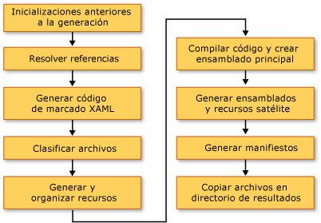

# <a name="compile-a-wpf-application"></a>Compilar una aplicación WPF

Las aplicaciones Windows Presentation Foundation (WPF) se pueden compilar como .NET Framework ejecutables (. exe), bibliotecas (. dll) o una combinación de ambos tipos de ensamblados. En este tema se presenta cómo crear aplicaciones de WPF y se describen los pasos clave del proceso de compilación.

<a name="Building_a_WPF_Application_using_Command_Line"></a>

## <a name="building-a-wpf-application"></a>Compilar una aplicación de WPF

Una aplicación WPF se puede compilar de las maneras siguientes:

- Línea de comandos. La aplicación debe contener solo el código (sin XAML) y un archivo de definición de aplicación. Para obtener más información, vea [Compilar la línea de comandos con csc.exe](../../../csharp/language-reference/compiler-options/command-line-building-with-csc-exe.md) o [Compilar desde la línea de comandos (Visual Basic)](../../../visual-basic/reference/command-line-compiler/building-from-the-command-line.md).

- Microsoft Build Engine (MSBuild). Además del código y los archivos XAML, la aplicación debe contener un archivo de proyecto de MSBuild. Para obtener más información, vea "MSBuild".

- Visual Studio. Visual Studio es un entorno de desarrollo integrado que compila las aplicaciones WPF con MSBuild e incluye un diseñador visual para crear la interfaz de usuario. Para obtener más información, vea [escribir y administrar código mediante Visual Studio](/visualstudio/ide/index-writing-code) y [diseñar XAML en Visual Studio](/visualstudio/xaml-tools/designing-xaml-in-visual-studio).

<a name="The_Windows_Presentation_Foundation_Build_Pipeline"></a>

## <a name="wpf-build-pipeline"></a>Canalización de compilación de WPF

Cuando se compila un proyecto de WPF, se invoca la combinación de destinos específicos del lenguaje y específicos de WPF. El proceso de ejecución de estos destinos se denomina canalización de compilación y los pasos principales se muestran en la siguiente ilustración.



<a name="Pre_Build_Initializations"></a>

### <a name="pre-build-initializations"></a>Inicializaciones previas a la compilación

Antes de compilar, MSBuild determina la ubicación de herramientas y bibliotecas importantes, incluidas las siguientes:

- .NET Framework.

- Directorios de Windows SDK.

- La ubicación de los ensamblados de referencia de WPF.

- La propiedad de las rutas de búsqueda de ensamblados.

La primera ubicación en la que MSBuild busca ensamblados es el directorio de ensamblados de referencia (%ProgramFiles%\Reference Assemblies\Microsoft\Framework\v3.0\\). Durante este paso, el proceso de compilación inicializa también las distintas propiedades y grupos de elementos, y efectúa el trabajo de limpieza necesario.

<a name="Resolving_references"></a>

### <a name="resolving-references"></a>Resolver referencias

El proceso de compilación busca y enlaza los ensamblados necesarios para generar el proyecto de aplicación. Esta lógica se incluye en la tarea `ResolveAssemblyReference`. Todos los ensamblados declarados como `Reference` en el archivo de proyecto se proporcionan a la tarea junto con información sobre las rutas de búsqueda y los metadatos de los ensamblados que ya están instalados en el sistema. La tarea busca ensamblados y usa los metadatos del ensamblado instalado para filtrar los ensamblados de WPF principales que no se deben mostrar en los manifiestos de salida. Esto es necesario para evitar información redundante en los manifiestos de ClickOnce. Por ejemplo, dado que PresentationFramework. dll se puede considerar representativo de una aplicación compilada en y para WPF, y dado que todos los ensamblados de WPF existen en la misma ubicación en todos los equipos que tienen instalado el .NET Framework, no es necesario incluir todos información sobre todos los ensamblados de referencia de .NET Framework en los manifiestos.

<a name="Markup_Compilation___Pass_1"></a>

### <a name="markup-compilationpass-1"></a>Compilación del marcado: Paso 1

En este paso, se analizan y compilan los archivos de [!INCLUDE[TLA2#tla_xaml](../../../../includes/tla2sharptla-xaml-md.md)] para que el runtime no dedique tiempo a analizar XML y validar los valores de propiedad. El archivo de [!INCLUDE[TLA2#tla_xaml](../../../../includes/tla2sharptla-xaml-md.md)] compilado se convierte en un token para que pueda cargarse mucho más rápido que un archivo [!INCLUDE[TLA2#tla_xaml](../../../../includes/tla2sharptla-xaml-md.md)] en tiempo de ejecución.

Durante este paso, se realizan las siguientes operaciones para cada archivo de [!INCLUDE[TLA2#tla_xaml](../../../../includes/tla2sharptla-xaml-md.md)] que es un elemento de compilación `Page`:

1. El compilador de marcado analiza el archivo [!INCLUDE[TLA2#tla_xaml](../../../../includes/tla2sharptla-xaml-md.md)].

2. Se crea una representación compilada para el [!INCLUDE[TLA2#tla_xaml](../../../../includes/tla2sharptla-xaml-md.md)] y se copia a la carpeta obj\Release.

3. Se crea una representación de CodeDOM de una nueva clase parcial y se copia a la carpeta obj\Release.

Además, se genera un archivo de código específico del lenguaje para cada archivo [!INCLUDE[TLA2#tla_xaml](../../../../includes/tla2sharptla-xaml-md.md)]. Por ejemplo, en el caso de una página Page1. XAML de un proyecto de Visual Basic, se genera un página1. g. VB; en el caso de una página Page1. C# XAML de un proyecto, se genera un Page1.g.cs. ".g" en el nombre de archivo indica que el archivo es código generado que tiene una declaración de clase parcial para el elemento de nivel superior del archivo de marcado (como `Page` o `Window`). La clase se declara con el modificador `partial` de C# (`Extends` en Visual Basic) para indicar que existe otra declaración para la clase en otro lugar, normalmente en el archivo de código subyacente Page1.Xaml.cs.

La clase parcial se extiende a partir de la clase base adecuada (como <xref:System.Windows.Controls.Page> de una página) e implementa la interfaz <xref:System.Windows.Markup.IComponentConnector?displayProperty=nameWithType>. La interfaz <xref:System.Windows.Markup.IComponentConnector> tiene métodos para inicializar un componente y conectar los nombres y eventos en los elementos de su contenido. Por consiguiente, el archivo de código generado tiene una implementación de métodos como la siguiente:

```csharp
public void InitializeComponent() {
    if (_contentLoaded) {
        return;
    }
    _contentLoaded = true;
    System.Uri resourceLocater =
        new System.Uri(
            "window1.xaml",
            System.UriKind.RelativeOrAbsolute);
    System.Windows.Application.LoadComponent(this, resourceLocater);
}
```

```vb
Public Sub InitializeComponent() _

    If _contentLoaded Then
        Return
    End If

    _contentLoaded = True
    Dim resourceLocater As System.Uri = _
        New System.Uri("mainwindow.xaml", System.UriKind.Relative)

    System.Windows.Application.LoadComponent(Me, resourceLocater)

End Sub
```

De forma predeterminada, la compilación de marcado se ejecuta en el mismo <xref:System.AppDomain> que el motor de MSBuild. Esto proporciona una mejora del rendimiento importante. Este comportamiento se puede activar o desactivar alternativamente con la propiedad `AlwaysCompileMarkupFilesInSeparateDomain`. Esto tiene la ventaja de descargar todos los ensamblados de referencia mediante la descarga de la <xref:System.AppDomain>independiente.

<a name="Pass_2_of_Markup_Compilation"></a>

### <a name="markup-compilationpass-2"></a>Compilación del marcado: Paso 2

No todas las páginas [!INCLUDE[TLA2#tla_xaml](../../../../includes/tla2sharptla-xaml-md.md)] se compilan en el paso 1 de la compilación de marcado. Los archivos [!INCLUDE[TLA2#tla_xaml](../../../../includes/tla2sharptla-xaml-md.md)] que tienen referencias de tipos definidos localmente (referencias a tipos definidos en el código en otro lugar del mismo proyecto) no se compilan en este momento. Esto se debe a que estos tipos definidos localmente solo existen en el código fuente y aún no están generados. Para determinar esto, el analizador usa heurística que implica la búsqueda de elementos como `x:Name` en el archivo de marcado. Cuando se encuentra este tipo de instancia, la compilación del archivo de marcado se pospone hasta que se hayan generado los archivos de código y, en ese momento, el segundo paso de la compilación de marcado procesa estos archivos.

<a name="File_Classification"></a>

### <a name="file-classification"></a>Clasificación de archivos

El proceso de compilación coloca los archivos de salida en grupos de recursos diferentes en función del ensamblado de aplicación en el que se van a incluir. En una aplicación no traducida típica, todos los archivos de datos marcados como `Resource` se colocan en el ensamblado principal (ejecutable o biblioteca). Cuando `UICulture` se establece en el proyecto, todos los archivos [!INCLUDE[TLA2#tla_xaml](../../../../includes/tla2sharptla-xaml-md.md)] compilados y los recursos explícitamente marcados como específicos del lenguaje se colocan en el ensamblado de recursos satélite. Además, todos los recursos neutrales en cuanto al idioma se colocan en el ensamblado principal. Esta determinación se realiza en este paso del proceso de compilación.

Las acciones de compilación de `ApplicationDefinition`, `Page` y `Resource` del archivo de proyecto se pueden incrementar con los metadatos de `Localizable` (los valores permitidos son `true` y `false`), que indican si el archivo es específico del lenguaje o neutral en cuanto a este.

<a name="Core_Compilation"></a>

### <a name="core-compilation"></a>Compilación básica

El paso básico de compilación implica la compilación de los archivos de código. Esta compilación está controlada por los archivos de destino específicos del lenguaje Microsoft.CSharp.targets y Microsoft.VisualBasic.targets. Si la heurística ha determinado que basta con un solo paso del compilador de marcado, se genera el ensamblado principal. En cambio, si uno o varios archivos [!INCLUDE[TLA2#tla_xaml](../../../../includes/tla2sharptla-xaml-md.md)] del proyecto tienen referencias a tipos definidos localmente, se genera un archivo .dll temporal para que los ensamblados de aplicación finales se puedan crear una vez completado el segundo paso de compilación del marcado.

<a name="Manifest_generation"></a>

### <a name="manifest-generation"></a>Generación de manifiestos

Al final del proceso de compilación, después de que todos los ensamblados de aplicación y los archivos de contenido estén listos, se generan los manifiestos de ClickOnce para la aplicación.

El archivo de manifiesto de implementación describe el modelo de implementación: la versión actual, el comportamiento de actualización y la identidad del editor junto con la firma digital. Se supone que este manifiesto lo crean los administradores que controlan la implementación. La extensión de archivo es. XBAP (para aplicaciones de explorador XAML (XBAP) y. Application para aplicaciones instaladas. La primera se indica a través de la propiedad `HostInBrowser` del proyecto y, como resultado, el manifiesto identifica la aplicación como hospedada en el explorador.

El manifiesto de aplicación (un archivo .exe.manifest) describe los ensamblados de la aplicación y las bibliotecas dependientes, e incluye los permisos necesarios para la aplicación. Se supone que este archivo lo crea el desarrollador de la aplicación. Para iniciar una aplicación ClickOnce, un usuario abre el archivo de manifiesto de implementación de la aplicación.

Estos archivos de manifiesto siempre se crean para XBAP. Para las aplicaciones instaladas, no se crean a menos que la propiedad `GenerateManifests` se especifique en el archivo de proyecto con el valor `true`.

Las XBAP obtienen dos permisos adicionales por encima de los permisos asignados a las aplicaciones típicas de zona de Internet: <xref:System.Security.Permissions.WebBrowserPermission> y <xref:System.Security.Permissions.MediaPermission>. El sistema de compilación de WPF declara esos permisos en el manifiesto de aplicación.

<a name="Incremental_Build_Support"></a>

## <a name="incremental-build-support"></a>Compatibilidad con la compilación incremental

El sistema de compilación de WPF proporciona compatibilidad con las compilaciones incrementales. Es bastante inteligente a la hora de detectar los cambios efectuados en el marcado o el código, y solo detecta los artefactos afectados por el cambio. El mecanismo de compilación incremental usa los archivos siguientes:

- Un archivo $(*nombreDeEnsamblado*)_MarkupCompiler.Cache para mantener el estado actual del compilador.

- Un archivo $(*nombreDeEnsamblado*)_MarkupCompiler.lref para almacenar en caché los archivos [!INCLUDE[TLA2#tla_xaml](../../../../includes/tla2sharptla-xaml-md.md)] con referencias a tipos definidos localmente.

A continuación, se incluye un conjunto de reglas que rigen la compilación incremental:

- El archivo es la unidad más pequeña en la que el sistema de compilación detecta un cambio. Por tanto, para un archivo de código, el sistema de compilación no puede determinar si se ha cambiado un tipo o se ha agregado código. Lo mismo se aplica a los archivos de proyecto.

- El mecanismo de compilación incremental debe saber que una página [!INCLUDE[TLA2#tla_xaml](../../../../includes/tla2sharptla-xaml-md.md)] define una clase o usa otras clases.

- Si las entradas `Reference` cambian, vuelva a compilar todas las páginas.

- Si un archivo de código cambia, vuelva a compilar todas las páginas con referencias de tipos definidos localmente.

- Si un archivo [!INCLUDE[TLA2#tla_xaml](../../../../includes/tla2sharptla-xaml-md.md)] cambia:

  - Si [!INCLUDE[TLA2#tla_xaml](../../../../includes/tla2sharptla-xaml-md.md)] se declara como `Page` en el proyecto: si [!INCLUDE[TLA2#tla_xaml](../../../../includes/tla2sharptla-xaml-md.md)] no tiene referencias de tipos definidos localmente, vuelva a compilar ese [!INCLUDE[TLA2#tla_xaml](../../../../includes/tla2sharptla-xaml-md.md)] además de todas las páginas [!INCLUDE[TLA2#tla_xaml](../../../../includes/tla2sharptla-xaml-md.md)] con referencias locales; si [!INCLUDE[TLA2#tla_xaml](../../../../includes/tla2sharptla-xaml-md.md)] tiene referencias locales, vuelva a compilar todas las páginas [!INCLUDE[TLA2#tla_xaml](../../../../includes/tla2sharptla-xaml-md.md)] con referencias locales.

  - Si [!INCLUDE[TLA2#tla_xaml](../../../../includes/tla2sharptla-xaml-md.md)] se declara como `ApplicationDefinition` en el proyecto: volver a compilar todas [!INCLUDE[TLA2#tla_xaml](../../../../includes/tla2sharptla-xaml-md.md)] páginas (motivo: cada [!INCLUDE[TLA2#tla_xaml](../../../../includes/tla2sharptla-xaml-md.md)] tiene una referencia a un tipo de <xref:System.Windows.Application> que puede haber cambiado).

- Si el archivo de proyecto declara un archivo de código como definición de aplicación en lugar de un archivo [!INCLUDE[TLA2#tla_xaml](../../../../includes/tla2sharptla-xaml-md.md)]:

  - Compruebe si el valor de `ApplicationClassName` en el archivo de proyecto ha cambiado (¿hay un nuevo tipo de aplicación?). En ese caso, vuelva a compilar toda la aplicación.

  - De lo contrario, vuelva a compilar todas las páginas [!INCLUDE[TLA2#tla_xaml](../../../../includes/tla2sharptla-xaml-md.md)] con referencias locales.

- Si un archivo de proyecto cambia: aplique todas las reglas anteriores y determine lo que tiene que volver a compilar. Los cambios en las propiedades siguientes desencadenan una recompilación completa: `AssemblyName`, `IntermediateOutputPath`, `RootNamespace` y `HostInBrowser`.

Las situaciones de recompilación posibles son las siguientes:

- Se vuelve a compilar toda la aplicación.

- Solo se vuelven a compilar los archivos [!INCLUDE[TLA2#tla_xaml](../../../../includes/tla2sharptla-xaml-md.md)] que tienen referencias de tipos definidos localmente.

- No se vuelve a compilar nada (si no ha cambiado nada en el proyecto).

## <a name="see-also"></a>Vea también

- [Implementar una aplicación de WPF](deploying-a-wpf-application-wpf.md)
- [Referencia de MSBuild para WPF](/visualstudio/msbuild/wpf-msbuild-reference)
- [Identificadores URI de paquete en WPF](pack-uris-in-wpf.md)
- [Archivos de recursos, contenido y datos de aplicaciones de WPF](wpf-application-resource-content-and-data-files.md)
