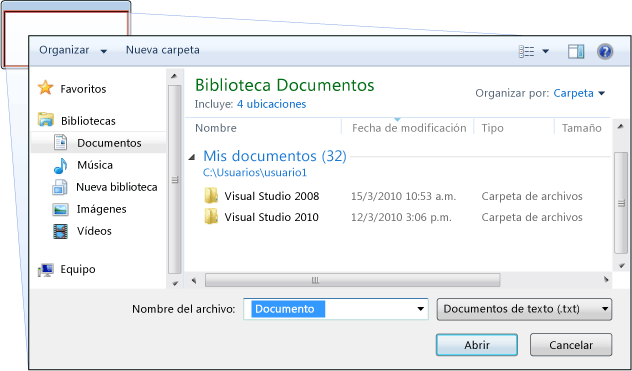
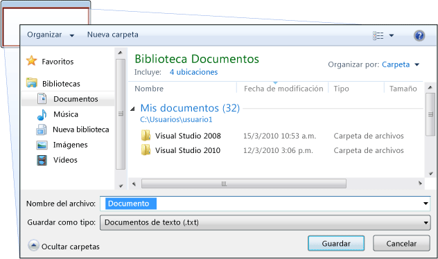
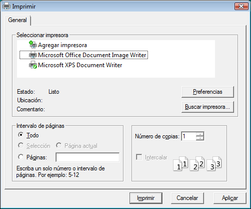
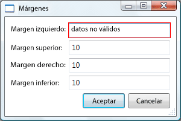
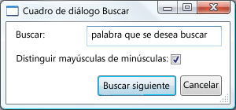

# Información general sobre cuadros de diálogoDialog Boxes Overview
Aplicaciones independientes tienen normalmente una ventana principal que tanto muestra los datos principales en el que la aplicación funciona y expone la funcionalidad necesaria para procesar los datos a través de [!INCLUDE[TLA#tla_ui](../../../../includes/tlasharptla-ui-md.md)] mecanismos como barras de menús, barras de herramientas y barras de estado.Standalone applications typically have a main window that both displays the main data over which the application operates and exposes the functionality to process that data through [!INCLUDE[TLA#tla_ui](../../../../includes/tlasharptla-ui-md.md)] mechanisms like menu bars, tool bars, and status bars. Una aplicación no trivial también puede mostrar ventanas adicionales para realizar lo siguiente:A non-trivial application may also display additional windows to do the following:  
  
-   Mostrar información específica a los usuarios.Display specific information to users.  
  
-   Recopilar información de los usuarios.Gather information from users.  
  
-   Mostrar y recopilar información.Both display and gather information.  
  
 Estos tipos de ventanas se conocen como *cuadros de diálogo*, y hay dos tipos: modales y no modales.These types of windows are known as *dialog boxes*, and there are two types: modal and modeless.  
  
 A *modal* cuadro de diálogo se muestra una función cuando la función necesita datos adicionales de un usuario para continuar.A *modal* dialog box is displayed by a function when the function needs additional data from a user to continue. Como la función depende del cuadro de diálogo modal para recopilar datos, el cuadro de diálogo modal también impide que un usuario active otras ventanas de la aplicación mientras permanece abierto.Because the function depends on the modal dialog box to gather data, the modal dialog box also prevents a user from activating other windows in the application while it remains open. En la mayoría de los casos, un cuadro de diálogo modal permite a los usuarios señalar cuando haya terminado con el cuadro de diálogo modal presionando un **Aceptar** o **cancelar** botón.In most cases, a modal dialog box allows a user to signal when they have finished with the modal dialog box by pressing either an **OK** or **Cancel** button. Al presionar la **Aceptar** botón indica que un usuario ha entrado en datos y desea que la función que se va a continuar con el procesamiento con esos datos.Pressing the **OK** button indicates that a user has entered data and wants the function to continue processing with that data. Al presionar la **cancelar** botón indica que un usuario desea detener la ejecución de la función.Pressing the **Cancel** button indicates that a user wants to stop the function from executing altogether. Los ejemplos más comunes de cuadros de diálogo modales se muestran para abrir, guardar e imprimir datos.The most common examples of modal dialog boxes are shown to open, save, and print data.  
  
 A *no modales* cuadro de diálogo, por otro lado, no impide que un usuario active otras ventanas mientras está abierto.A *modeless* dialog box, on the other hand, does not prevent a user from activating other windows while it is open. Por ejemplo, si un usuario quiere buscar las repeticiones de una palabra determinada en un documento, a menudo una ventana principal abrirá un cuadro de diálogo para solicitar al usuario la palabra que está buscando.For example, if a user wants to find occurrences of a particular word in a document, a main window will often open a dialog box to ask a user what word they are looking for. En cambio, como buscar una palabra no impide que un usuario edite el documento, el cuadro de diálogo no necesita ser modal.Since finding a word doesn't prevent a user from editing the document, however, the dialog box doesn't need to be modal. Un cuadro de diálogo no modal proporciona al menos un **cerrar** botón para cerrar el cuadro de diálogo y puede proporcionar botones adicionales para ejecutar funciones específicas, como un **Buscar siguiente** botón para buscar la siguiente de word que coincide con los criterios de búsqueda de una búsqueda de palabras.A modeless dialog box at least provides a **Close** button to close the dialog box, and may provide additional buttons to execute specific functions, such as a **Find Next** button to find the next word that matches the find criteria of a word search.  
  
 [!INCLUDE[TLA#tla_wpf](../../../../includes/tlasharptla-wpf-md.md)] le permite crear varios tipos de cuadros de diálogo, incluidos cuadros de mensaje, cuadros de diálogo comunes y cuadros de diálogo personalizados. allows you to create several types of dialog boxes, including message boxes, common dialog boxes, and custom dialog boxes. Este tema describe cada uno y el [Dialog Box Sample](http://go.microsoft.com/fwlink/?LinkID=159984) proporciona ejemplos de búsqueda de coincidencias.This topic discusses each, and the [Dialog Box Sample](http://go.microsoft.com/fwlink/?LinkID=159984) provides matching examples.  
  
 
  
   
## Cuadros de mensajeMessage Boxes  
 A *cuadro de mensaje* es un cuadro de diálogo que puede utilizarse para mostrar información textual y para permitir a los usuarios tomar decisiones con botones.A *message box* is a dialog box that can be used to display textual information and to allow users to make decisions with buttons. En la siguiente figura se muestra un cuadro de mensaje que muestra información de texto, realiza una pregunta y proporciona tres botones al usuario para responderla.The following figure shows a message box that displays textual information, asks a question, and provides the user with three buttons to answer the question.  
  
   
  
 Para crear un cuadro de mensaje, utilice la <xref:System.Windows.MessageBox> clase.To create a message box, you use the <xref:System.Windows.MessageBox> class. <xref:System.Windows.MessageBox>le permite configurar el texto de cuadro de mensaje, título, icono y botones, mediante código similar al siguiente.<xref:System.Windows.MessageBox> lets you configure the message box text, title, icon, and buttons, using code like the following.  
  
 [!code-csharp[DialogBoxesOverviewSnippets#MsgBoxConfigureCODEBEHIND](../../../../samples/snippets/csharp/VS_Snippets_Wpf/DialogBoxesOverviewSnippets/CSharp/Window1.xaml.cs#msgboxconfigurecodebehind)]
 [!code-vb[DialogBoxesOverviewSnippets#MsgBoxConfigureCODEBEHIND](../../../../samples/snippets/visualbasic/VS_Snippets_Wpf/DialogBoxesOverviewSnippets/VisualBasic/window1.xaml.vb#msgboxconfigurecodebehind)]  
  
 Para mostrar un cuadro de mensaje, se llama a la `static` <xref:System.Windows.MessageBox.Show%2A> método, como se muestra en el código siguiente.To show a message box, you call the `static`<xref:System.Windows.MessageBox.Show%2A> method, as demonstrated in the following code.  
  
 [!code-csharp[DialogBoxesOverviewSnippets#MsgBoxShowCODEBEHIND](../../../../samples/snippets/csharp/VS_Snippets_Wpf/DialogBoxesOverviewSnippets/CSharp/Window1.xaml.cs#msgboxshowcodebehind)]
 [!code-vb[DialogBoxesOverviewSnippets#MsgBoxShowCODEBEHIND](../../../../samples/snippets/visualbasic/VS_Snippets_Wpf/DialogBoxesOverviewSnippets/VisualBasic/window1.xaml.vb#msgboxshowcodebehind)]  
  
 Cuando el código que muestra un cuadro de mensaje necesita detectar y procesar la decisión del usuario (qué botón se ha presionado), el código puede inspeccionar el resultado del cuadro de mensaje, como se muestra en el código siguiente.When code that shows a message box needs to detect and process the user's decision (which button was pressed), the code can inspect the message box result, as shown in the following code.  
  
 [!code-csharp[DialogBoxesOverviewSnippets#MsgBoxShowAndResultCODEBEHIND1](../../../../samples/snippets/csharp/VS_Snippets_Wpf/DialogBoxesOverviewSnippets/CSharp/Window1.xaml.cs#msgboxshowandresultcodebehind1)]
 [!code-vb[DialogBoxesOverviewSnippets#MsgBoxShowAndResultCODEBEHIND1](../../../../samples/snippets/visualbasic/VS_Snippets_Wpf/DialogBoxesOverviewSnippets/VisualBasic/window1.xaml.vb#msgboxshowandresultcodebehind1)]  
  
 Para obtener más información sobre el uso de cuadros de mensaje, consulte <xref:System.Windows.MessageBox>, [MessageBox Sample](http://go.microsoft.com/fwlink/?LinkID=160023), y [Dialog Box Sample](http://go.microsoft.com/fwlink/?LinkID=159984).For more information on using message boxes, see <xref:System.Windows.MessageBox>, [MessageBox Sample](http://go.microsoft.com/fwlink/?LinkID=160023), and [Dialog Box Sample](http://go.microsoft.com/fwlink/?LinkID=159984).  
  
 Aunque <xref:System.Windows.MessageBox> puede ofrecer una experiencia de usuario del cuadro de diálogo simple, la ventaja de usar <xref:System.Windows.MessageBox> que es el único tipo de ventana que se puede mostrar las aplicaciones que se ejecutan en un recinto de seguridad de confianza parcial (vea [seguridad](../../../../docs/framework/wpf/security-wpf.md)), como [!INCLUDE[TLA#tla_xbap#plural](../../../../includes/tlasharptla-xbapsharpplural-md.md)].Although <xref:System.Windows.MessageBox> may offer a simple dialog box user experience, the advantage of using <xref:System.Windows.MessageBox> is that is the only type of window that can be shown by applications that run within a partial trust security sandbox (see [Security](../../../../docs/framework/wpf/security-wpf.md)), such as [!INCLUDE[TLA#tla_xbap#plural](../../../../includes/tlasharptla-xbapsharpplural-md.md)].  
  
 La mayoría de los cuadros de diálogo muestran y recopilan datos más complejos que el resultado de un cuadro de mensaje, incluidos texto, selección (casillas), selección mutuamente exclusiva (botón de selección) y selección de listas (cuadros de lista, cuadros combinados, cuadros de lista desplegable).Most dialog boxes display and gather more complex data than the result of a message box, including text, selection (check boxes), mutually exclusive selection (radio buttons), and list selection (list boxes, combo boxes, drop-down list boxes). En estos casos, [!INCLUDE[TLA#tla_wpf](../../../../includes/tlasharptla-wpf-md.md)] proporciona varios cuadros de diálogo comunes y le permite crear sus propios cuadros de diálogo, aunque el uso de uno de ellos se limita a aplicaciones que se ejecutan con plena confianza.For these, [!INCLUDE[TLA#tla_wpf](../../../../includes/tlasharptla-wpf-md.md)] provides several common dialog boxes and allows you to create your own dialog boxes, although the use of either is limited to applications running with full trust.  
  
   
## Cuadros de diálogo comunesCommon Dialog Boxes  
 [!INCLUDE[TLA#tla_mswin](../../../../includes/tlasharptla-mswin-md.md)] implementa una variedad de cuadros de diálogo reutilizables que son comunes a todas las aplicaciones, incluidos los cuadros de diálogo para abrir y guardar archivos, e imprimir. implements a variety of reusable dialog boxes that are common to all applications, including dialog boxes for opening files, saving files, and printing. Como estos cuadros de diálogo se implementan mediante el sistema operativo, pueden compartirse entre todas las aplicaciones que se ejecutan en el sistema operativo, que ayuda a la coherencia de la experiencia de usuario; cuando los usuarios están familiarizados con el uso de un cuadro de diálogo proporcionado por el sistema operativo en una aplicación, no necesitan obtener información sobre cómo usar ese cuadro de diálogo en otras aplicaciones.Since these dialog boxes are implemented by the operating system, they can be shared among all the applications that run on the operating system, which helps user experience consistency; when users are familiar with the use of an operating system-provided dialog box in one application, they don't need to learn how to use that dialog box in other applications. Dado que estos cuadros de diálogo están disponibles para todas las aplicaciones y dado que ayudan a proporcionar una experiencia de usuario coherente, se conocen como *cuadros de diálogo comunes*.Because these dialog boxes are available to all applications and because they help provide a consistent user experience, they are known as *common dialog boxes*.  
  
 [!INCLUDE[TLA#tla_wpf](../../../../includes/tlasharptla-wpf-md.md)] encapsula los cuadros de diálogo comunes de Abrir archivo, Guardar archivo e Imprimir y los expone como clases administradas para su uso en aplicaciones independientes. encapsulates the open file, save file, and print common dialog boxes and exposes them as managed classes for you to use in standalone applications. En este tema se proporciona una breve introducción de cada uno.This topic provides a brief overview of each.  
  
   
### Cuadro de diálogo Abrir archivoOpen File Dialog  
 El cuadro de diálogo Abrir archivo, que se muestra en la siguiente figura, se usa por la función de apertura de archivos para recuperar el nombre de un archivo que se va a abrir.The open file dialog box, shown in the following figure, is used by file opening functionality to retrieve the name of a file to open.  
  
   
  
 El cuadro de diálogo Abrir archivo común se implementa como el <xref:Microsoft.Win32.OpenFileDialog> clase y se encuentra en la <xref:Microsoft.Win32> espacio de nombres.The common open file dialog box is implemented as the <xref:Microsoft.Win32.OpenFileDialog> class and is located in the <xref:Microsoft.Win32> namespace. En el siguiente código se muestra cómo crear, configurar y mostrar uno, y cómo procesar el resultado.The following code shows how to create, configure, and show one, and how to process the result.  
  
 [!code-csharp[DialogBoxesOverviewSnippets#OpenFileDialogBoxCODEBEHIND](../../../../samples/snippets/csharp/VS_Snippets_Wpf/DialogBoxesOverviewSnippets/CSharp/Window1.xaml.cs#openfiledialogboxcodebehind)]
 [!code-vb[DialogBoxesOverviewSnippets#OpenFileDialogBoxCODEBEHIND](../../../../samples/snippets/visualbasic/VS_Snippets_Wpf/DialogBoxesOverviewSnippets/VisualBasic/window1.xaml.vb#openfiledialogboxcodebehind)]  
  
 Para obtener más información sobre el cuadro de diálogo Abrir archivo, consulte <xref:Microsoft.Win32.OpenFileDialog?displayProperty=nameWithType>.For more information on the open file dialog box, see <xref:Microsoft.Win32.OpenFileDialog?displayProperty=nameWithType>.  
  
> [!NOTE]
>  <xref:Microsoft.Win32.OpenFileDialog>puede usarse para recuperar de manera segura los nombres de archivo por aplicaciones que se ejecutan con confianza parcial (vea [seguridad](../../../../docs/framework/wpf/security-wpf.md)).<xref:Microsoft.Win32.OpenFileDialog> can be used to safely retrieve file names by applications running with partial trust (see [Security](../../../../docs/framework/wpf/security-wpf.md)).  
  
   
### Cuadro de diálogo Guardar archivoSave File Dialog Box  
 El cuadro de diálogo Guardar archivo, que se muestra en la siguiente figura, se usa por la función de guardado de archivos para recuperar el nombre de un archivo que se va a guardar.The save file dialog box, shown in the following figure, is used by file saving functionality to retrieve the name of a file to save.  
  
   
  
 Common Guardar cuadro de diálogo de archivo se implementa como el <xref:Microsoft.Win32.SaveFileDialog> clase y se encuentra en la <xref:Microsoft.Win32> espacio de nombres.The common save file dialog box is implemented as the <xref:Microsoft.Win32.SaveFileDialog> class, and is located in the <xref:Microsoft.Win32> namespace. En el siguiente código se muestra cómo crear, configurar y mostrar uno, y cómo procesar el resultado.The following code shows how to create, configure, and show one, and how to process the result.  
  
 [!code-csharp[DialogBoxesOverviewSnippets#SaveFileDialogBoxCODEBEHIND](../../../../samples/snippets/csharp/VS_Snippets_Wpf/DialogBoxesOverviewSnippets/CSharp/Window1.xaml.cs#savefiledialogboxcodebehind)]
 [!code-vb[DialogBoxesOverviewSnippets#SaveFileDialogBoxCODEBEHIND](../../../../samples/snippets/visualbasic/VS_Snippets_Wpf/DialogBoxesOverviewSnippets/VisualBasic/window1.xaml.vb#savefiledialogboxcodebehind)]  
  
 Para obtener más información sobre la operación de guardar archivo de cuadro de diálogo, consulte <xref:Microsoft.Win32.SaveFileDialog?displayProperty=nameWithType>.For more information on the save file dialog box, see <xref:Microsoft.Win32.SaveFileDialog?displayProperty=nameWithType>.  
  
   
### Cuadro de diálogo ImprimirPrint Dialog Box  
 El cuadro de diálogo Imprimir, que se muestra en la siguiente figura, se usa por la función de impresión para elegir y configurar la impresora con la que el usuario quiere imprimir los datos.The print dialog box, shown in the following figure, is used by printing functionality to choose and configure the printer that a user would like to print data to.  
  
   
  
 El cuadro de diálogo de impresión común se implementa como el <xref:System.Windows.Controls.PrintDialog> clase y se encuentra en la <xref:System.Windows.Controls> espacio de nombres.The common print dialog box is implemented as the <xref:System.Windows.Controls.PrintDialog> class, and is located in the <xref:System.Windows.Controls> namespace. En el siguiente código se muestra cómo crear, configurar y mostrar uno.The following code shows how to create, configure, and show one.  
  
 [!code-csharp[DialogBoxesOverviewSnippets#PrintDialogBoxCODEBEHIND](../../../../samples/snippets/csharp/VS_Snippets_Wpf/DialogBoxesOverviewSnippets/CSharp/Window1.xaml.cs#printdialogboxcodebehind)]
 [!code-vb[DialogBoxesOverviewSnippets#PrintDialogBoxCODEBEHIND](../../../../samples/snippets/visualbasic/VS_Snippets_Wpf/DialogBoxesOverviewSnippets/VisualBasic/window1.xaml.vb#printdialogboxcodebehind)]  
  
 Para obtener más información sobre el cuadro de diálogo de impresión, consulte <xref:System.Windows.Controls.PrintDialog?displayProperty=nameWithType>.For more information on the print dialog box, see <xref:System.Windows.Controls.PrintDialog?displayProperty=nameWithType>. Para una explicación detallada de la impresión en [!INCLUDE[TLA2#tla_wpf](../../../../includes/tla2sharptla-wpf-md.md)], consulte [resumen de impresión](../../../../docs/framework/wpf/advanced/printing-overview.md).For detailed discussion of printing in [!INCLUDE[TLA2#tla_wpf](../../../../includes/tla2sharptla-wpf-md.md)], see [Printing Overview](../../../../docs/framework/wpf/advanced/printing-overview.md).  
  
   
## Cuadros de diálogo personalizadosCustom Dialog Boxes  
 Aunque los cuadros de diálogo comunes son útiles, y deben usarse cuando sea posible, no admiten los requisitos de los cuadros de diálogo específicos de dominio.While common dialog boxes are useful, and should be used when possible, they do not support the requirements of domain-specific dialog boxes. En estos casos, necesita crear sus propios cuadros de diálogo.In these cases, you need to create your own dialog boxes. Como veremos, un cuadro de diálogo es una ventana con comportamientos especiales.As we'll see, a dialog box is a window with special behaviors. <xref:System.Windows.Window>implementa esos comportamientos y, por lo tanto, utilice <xref:System.Windows.Window> para crear cuadros de diálogo modales y no modales personalizados.<xref:System.Windows.Window> implements those behaviors and, consequently, you use <xref:System.Windows.Window> to create custom modal and modeless dialog boxes.  
  
   
### Crear un cuadro de diálogo modal personalizadoCreating a Modal Custom Dialog Box  
 Este tema muestra cómo usar <xref:System.Windows.Window> para crear una implementación de cuadro de diálogo modal típico, utilizando el `Margins` cuadro de diálogo como ejemplo (vea [Dialog Box Sample](http://go.microsoft.com/fwlink/?LinkID=159984)).This topic shows how to use <xref:System.Windows.Window> to create a typical modal dialog box implementation, using the `Margins` dialog box as an example (see [Dialog Box Sample](http://go.microsoft.com/fwlink/?LinkID=159984)). El `Margins` cuadro de diálogo se muestra en la ilustración siguiente.The `Margins` dialog box is shown in the following figure.  
  
   
  
#### Configurar un cuadro de diálogo modalConfiguring a Modal Dialog Box  
 La interfaz de usuario de un cuadro de diálogo típico incluye lo siguiente:The user interface for a typical dialog box includes the following:  
  
-   Los distintos controles que se necesitan para recopilar los datos deseados.The various controls that are required to gather the desired data.  
  
-   Mostrar un **Aceptar** botón que los usuarios, haga clic en para cerrar el cuadro de diálogo, vuelva a la función y continuar con el procesamiento.Showing an **OK** button that users click to close the dialog box, return to the function, and continue processing.  
  
-   Mostrar un **cancelar** botón que los usuarios hacen clic para cerrar el cuadro de diálogo y detener la función de procesamiento posterior.Showing a **Cancel** button that users click to close the dialog box and stop the function from further processing.  
  
-   Mostrar un **cerrar** botón en la barra de título.Showing a **Close** button in the title bar.  
  
-   Mostrar un icono.Showing an icon.  
  
-   Mostrar **minimizar**, **maximizar**, y **restaurar** botones.Showing **Minimize**, **Maximize**, and **Restore** buttons.  
  
-   Mostrar un **System** menú para minimizar, maximizar, restaurar y cerrar el cuadro de diálogo.Showing a **System** menu to minimize, maximize, restore, and close the dialog box.  
  
-   Apertura encima y en el centro de la ventana que ha abierto el cuadro de diálogo.Opening above and in the center of the window that opened the dialog box.  
  
-   Los cuadros de diálogo deben ser redimensionables donde sea posible, para evitar que el cuadro de diálogo sea demasiado pequeño y para proporcionar al usuario un tamaño predeterminado útil, necesita establecer las dimensiones mínimas y predeterminadas respectivamente.Dialog boxes should be resizable where possible so, to prevent the dialog box from being too small, and to provide the user with a useful default size, you need to set both default and a minimum dimensions respectively.  
  
-   Al presionar la tecla ESC debe configurarse como un método abreviado de teclado que provoca la **cancelar** botón presionado.Pressing the ESC key should be configured as a keyboard shortcut that causes the **Cancel** button to be pressed. Esto se logra estableciendo la <xref:System.Windows.Controls.Button.IsCancel%2A> propiedad de la **cancelar** botón a `true`.This is achieved by setting the <xref:System.Windows.Controls.Button.IsCancel%2A> property of the **Cancel** button to `true`.  
  
-   Al presionar la tecla ENTRAR (o retorno) debe configurarse como un método abreviado de teclado que provoca la **Aceptar** botón presionado.Pressing the ENTER (or RETURN) key should be configured as a keyboard shortcut that causes the **OK** button to be pressed. Esto se logra estableciendo la <xref:System.Windows.Controls.Button.IsDefault%2A> propiedad de la **Aceptar** botón `true`.This is achieved by setting the <xref:System.Windows.Controls.Button.IsDefault%2A> property of the **OK** button `true`.  
  
 El siguiente código muestra esta configuración.The following code demonstrates this configuration.  
  
 [!code-xaml[DialogBoxSample#MarginsDialogBoxMainBitsMARKUP1](../../../../samples/snippets/csharp/VS_Snippets_Wpf/DialogBoxSample/CSharp/MarginsDialogBox.xaml#marginsdialogboxmainbitsmarkup1)]  
[!code-xaml[DialogBoxSample#MarginsDialogBoxMainBitsMARKUP2](../../../../samples/snippets/csharp/VS_Snippets_Wpf/DialogBoxSample/CSharp/MarginsDialogBox.xaml#marginsdialogboxmainbitsmarkup2)]  
  
 [!code-csharp[DialogBoxSample#MarginsDialogBoxMainBitsCODEBEHIND1](../../../../samples/snippets/csharp/VS_Snippets_Wpf/DialogBoxSample/CSharp/MarginsDialogBox.xaml.cs#marginsdialogboxmainbitscodebehind1)]
 [!code-vb[DialogBoxSample#MarginsDialogBoxMainBitsCODEBEHIND1](../../../../samples/snippets/visualbasic/VS_Snippets_Wpf/DialogBoxSample/VisualBasic/MarginsDialogBox.xaml.vb#marginsdialogboxmainbitscodebehind1)]  
[!code-csharp[DialogBoxSample#MarginsDialogBoxMainBitsCODEBEHIND2](../../../../samples/snippets/csharp/VS_Snippets_Wpf/DialogBoxSample/CSharp/MarginsDialogBox.xaml.cs#marginsdialogboxmainbitscodebehind2)]
[!code-vb[DialogBoxSample#MarginsDialogBoxMainBitsCODEBEHIND2](../../../../samples/snippets/visualbasic/VS_Snippets_Wpf/DialogBoxSample/VisualBasic/MarginsDialogBox.xaml.vb#marginsdialogboxmainbitscodebehind2)]  
  
 La experiencia de usuario de un cuadro de diálogo también se extiende a la barra de menús de la ventana que abre el cuadro de diálogo.The user experience for a dialog box also extends into the menu bar of the window that opens the dialog box. Cuando un elemento de menú ejecuta una función que requiere interacción del usuario mediante un cuadro de diálogo antes de que la función pueda continuar, el elemento de menú de la función tendrá puntos suspensivos en su encabezado, como se muestra aquí.When a menu item runs a function that requires user interaction through a dialog box before the function can continue, the menu item for the function will have an ellipsis in its header, as shown here.  
  
 [!code-xaml[DialogBoxSample#MainWindowMarginsDialogBoxMenuItemMARKUP1](../../../../samples/snippets/csharp/VS_Snippets_Wpf/DialogBoxSample/CSharp/MainWindow.xaml#mainwindowmarginsdialogboxmenuitemmarkup1)]  
[!code-xaml[DialogBoxSample#MainWindowMarginsDialogBoxMenuItemMARKUP2](../../../../samples/snippets/csharp/VS_Snippets_Wpf/DialogBoxSample/CSharp/MainWindow.xaml#mainwindowmarginsdialogboxmenuitemmarkup2)]  
  
 Cuando un elemento de menú ejecuta una función que muestra un cuadro de diálogo que no necesita interacción del usuario, como un cuadro de diálogo Acerca de, no se necesitan los puntos suspensivos.When a menu item runs a function that displays a dialog box which does not require user interaction, such as an About dialog box, an ellipsis is not required.  
  
#### Abrir un cuadro de diálogo modalOpening a Modal Dialog Box  
 Un cuadro de diálogo se muestra normalmente como el resultado de un usuario que selecciona un elemento de menú para realizar una función específica de dominio, como establecer los márgenes de un documento en un procesador de textos.A dialog box is typically shown as a result of a user selecting a menu item to perform a domain-specific function, such as setting the margins of a document in a word processor. Mostrar una ventana como un cuadro de diálogo es similar a mostrar una ventana normal, aunque necesita una configuración específica de cuadro de diálogo adicional.Showing a window as a dialog box is similar to showing a normal window, although it requires additional dialog box-specific configuration. El proceso completo de crear instancias, configurar y abrir un cuadro de diálogo se muestra en el código siguiente.The entire process of instantiating, configuring, and opening a dialog box is shown in the following code.  
  
 [!code-csharp[DialogBoxSample#OpenMarginsDialogCODEBEHIND1](../../../../samples/snippets/csharp/VS_Snippets_Wpf/DialogBoxSample/CSharp/MainWindow.xaml.cs#openmarginsdialogcodebehind1)]
 [!code-vb[DialogBoxSample#OpenMarginsDialogCODEBEHIND1](../../../../samples/snippets/visualbasic/VS_Snippets_Wpf/DialogBoxSample/VisualBasic/MainWindow.xaml.vb#openmarginsdialogcodebehind1)]  
[!code-csharp[DialogBoxSample#OpenMarginsDialogCODEBEHIND2](../../../../samples/snippets/csharp/VS_Snippets_Wpf/DialogBoxSample/CSharp/MainWindow.xaml.cs#openmarginsdialogcodebehind2)]
[!code-vb[DialogBoxSample#OpenMarginsDialogCODEBEHIND2](../../../../samples/snippets/visualbasic/VS_Snippets_Wpf/DialogBoxSample/VisualBasic/MainWindow.xaml.vb#openmarginsdialogcodebehind2)]  
[!code-csharp[DialogBoxSample#OpenMarginsDialogCODEBEHIND3](../../../../samples/snippets/csharp/VS_Snippets_Wpf/DialogBoxSample/CSharp/MainWindow.xaml.cs#openmarginsdialogcodebehind3)]
[!code-vb[DialogBoxSample#OpenMarginsDialogCODEBEHIND3](../../../../samples/snippets/visualbasic/VS_Snippets_Wpf/DialogBoxSample/VisualBasic/MainWindow.xaml.vb#openmarginsdialogcodebehind3)]  
[!code-csharp[DialogBoxSample#OpenMarginsDialogCODEBEHIND4](../../../../samples/snippets/csharp/VS_Snippets_Wpf/DialogBoxSample/CSharp/MainWindow.xaml.cs#openmarginsdialogcodebehind4)]
[!code-vb[DialogBoxSample#OpenMarginsDialogCODEBEHIND4](../../../../samples/snippets/visualbasic/VS_Snippets_Wpf/DialogBoxSample/VisualBasic/MainWindow.xaml.vb#openmarginsdialogcodebehind4)]  
  
 Aquí, el código está pasando información predeterminada (los márgenes actuales) al cuadro de diálogo.Here, the code is passing default information (the current margins) to the dialog box. También está estableciendo la <xref:System.Windows.Window.Owner%2A?displayProperty=nameWithType> propiedad con una referencia a la ventana que se muestra el cuadro de diálogo.It is also setting the <xref:System.Windows.Window.Owner%2A?displayProperty=nameWithType> property with a reference to the window that is showing the dialog box. En general, siempre debe establecerse el propietario de un cuadro de diálogo para proporcionar comportamientos relacionados con el estado de ventana que son comunes a todos los cuadros de diálogo (vea [Introducción a WPF Windows](../../../../docs/framework/wpf/app-development/wpf-windows-overview.md) para obtener más información).In general, you should always set the owner for a dialog box to provide window state-related behaviors that are common to all dialog boxes (see [WPF Windows Overview](../../../../docs/framework/wpf/app-development/wpf-windows-overview.md) for more information).  
  
> [!NOTE]
>  Debe proporcionar un propietario para admitir [!INCLUDE[TLA#tla_ui](../../../../includes/tlasharptla-ui-md.md)] automatización para los cuadros de diálogo (vea [información general sobre la automatización de interfaz de usuario](../../../../docs/framework/ui-automation/ui-automation-overview.md)).You must provide an owner to support [!INCLUDE[TLA#tla_ui](../../../../includes/tlasharptla-ui-md.md)] automation for dialog boxes (see [UI Automation Overview](../../../../docs/framework/ui-automation/ui-automation-overview.md)).  
  
 Después de configura el cuadro de diálogo, se mostrará modalmente llamando a la <xref:System.Windows.Window.ShowDialog%2A> método.After the dialog box is configured, it is shown modally by calling the <xref:System.Windows.Window.ShowDialog%2A> method.  
  
#### Validar los datos proporcionados por el usuarioValidating User-Provided Data  
 Cuando un cuadro de diálogo se abre y el usuario proporciona los datos necesarios, un cuadro de diálogo es responsable de garantizar que los datos proporcionados sean válidos por los motivos siguientes:When a dialog box is opened and the user provides the required data, a dialog box is responsible for ensuring that the provided data is valid for the following reasons:  
  
-   Desde una perspectiva de seguridad, se deben validar todas las entradas.From a security perspective, all input should be validated.  
  
-   Desde una perspectiva específica de dominio, la validación de datos impide que los datos incorrectos se procesen por el código, que puede provocar excepciones potencialmente.From a domain-specific perspective, data validation prevents erroneous data from being processed by the code, which could potentially throw exceptions.  
  
-   Desde una perspectiva de experiencia de usuario, un cuadro de diálogo puede ayudar a los usuarios a mostrarles qué datos de los que han especificado no son válidos.From a user-experience perspective, a dialog box can help users by showing them which data they have entered is invalid.  
  
-   Desde una perspectiva de rendimiento, la validación de datos en una aplicación de varios niveles puede reducir el número de recorridos de ida y vuelta entre los niveles de aplicación y cliente, especialmente cuando la aplicación está formada por servicios Web o bases de datos basadas en servidor.From a performance perspective, data validation in a multi-tier application can reduce the number of round trips between the client and the application tiers, particularly when the application is composed of Web services or server-based databases.  
  
 Para validar un control enlazado en [!INCLUDE[TLA2#tla_wpf](../../../../includes/tla2sharptla-wpf-md.md)], debe definir una regla de validación y asociarlo con el enlace.To validate a bound control in [!INCLUDE[TLA2#tla_wpf](../../../../includes/tla2sharptla-wpf-md.md)], you need to define a validation rule and associate it with the binding. Una regla de validación es una clase personalizada que deriva de <xref:System.Windows.Controls.ValidationRule>.A validation rule is a custom class that derives from <xref:System.Windows.Controls.ValidationRule>. En el ejemplo siguiente se muestra una regla de validación, `MarginValidationRule`, que comprueba que un valor enlazado es un <xref:System.Double> y está dentro del intervalo especificado.The following example shows a validation rule, `MarginValidationRule`, which checks that a bound value is a <xref:System.Double> and is within a specified range.  
  
 [!code-csharp[DialogBoxSample#MarginValidationRuleCODE](../../../../samples/snippets/csharp/VS_Snippets_Wpf/DialogBoxSample/CSharp/MarginValidationRule.cs#marginvalidationrulecode)]
 [!code-vb[DialogBoxSample#MarginValidationRuleCODE](../../../../samples/snippets/visualbasic/VS_Snippets_Wpf/DialogBoxSample/VisualBasic/MarginValidationRule.vb#marginvalidationrulecode)]  
  
 En este código, se implementa la lógica de validación de una regla de validación invalidando el <xref:System.Windows.Controls.ValidationRule.Validate%2A> método, que valida los datos y devuelve un apropiado <xref:System.Windows.Controls.ValidationResult>.In this code, the validation logic of a validation rule is implemented by overriding the <xref:System.Windows.Controls.ValidationRule.Validate%2A> method, which validates the data and returns an appropriate <xref:System.Windows.Controls.ValidationResult>.  
  
 Para asociar la regla de validación con el control enlazado, use el siguiente marcado.To associate the validation rule with the bound control, you use the following markup.  
  
 [!code-xaml[DialogBoxSample#MarginsValidationMARKUP1](../../../../samples/snippets/csharp/VS_Snippets_Wpf/DialogBoxSample/CSharp/MarginsDialogBox.xaml#marginsvalidationmarkup1)]  
[!code-xaml[DialogBoxSample#MarginsValidationMARKUP2](../../../../samples/snippets/csharp/VS_Snippets_Wpf/DialogBoxSample/CSharp/MarginsDialogBox.xaml#marginsvalidationmarkup2)]  
[!code-xaml[DialogBoxSample#MarginsValidationMARKUP3](../../../../samples/snippets/csharp/VS_Snippets_Wpf/DialogBoxSample/CSharp/MarginsDialogBox.xaml#marginsvalidationmarkup3)]  
  
 Una vez que está asociada, la regla de validación [!INCLUDE[TLA2#tla_wpf](../../../../includes/tla2sharptla-wpf-md.md)] lo aplicará automáticamente cuando se escriben datos en el control enlazado.Once the validation rule is associated, [!INCLUDE[TLA2#tla_wpf](../../../../includes/tla2sharptla-wpf-md.md)] will automatically apply it when data is entered into the bound control. Cuando un control contiene datos no válidos, [!INCLUDE[TLA2#tla_wpf](../../../../includes/tla2sharptla-wpf-md.md)] mostrará un borde rojo alrededor del control no válido, tal como se muestra en la ilustración siguiente.When a control contains invalid data, [!INCLUDE[TLA2#tla_wpf](../../../../includes/tla2sharptla-wpf-md.md)] will display a red border around the invalid control, as shown in the following figure.  
  
   
  
 [!INCLUDE[TLA2#tla_wpf](../../../../includes/tla2sharptla-wpf-md.md)] no restringe un usuario al control no válido hasta que haya especificado los datos válidos. does not restrict a user to the invalid control until they have entered valid data. Este es un buen comportamiento para un cuadro de diálogo; un usuario debe poder navegar libremente por los controles de un cuadro de diálogo sean los datos válidos o no.This is good behavior for a dialog box; a user should be able to freely navigate the controls in a dialog box whether or not data is valid. Sin embargo, esto significa que un usuario puede escribir datos no válidos y presione la **Aceptar** botón.However, this means a user can enter invalid data and press the **OK** button. Por este motivo, el código también debe validar todos los controles en un cuadro de diálogo cuadro cuando el **Aceptar** se presiona el botón controlando el <xref:System.Windows.Controls.Primitives.ButtonBase.Click> eventos.For this reason, your code also needs to validate all controls in a dialog box when the **OK** button is pressed by handling the <xref:System.Windows.Controls.Primitives.ButtonBase.Click> event.  
  
 [!code-csharp[DialogBoxSample#MarginsDialogBoxValidationCODEBEHIND1](../../../../samples/snippets/csharp/VS_Snippets_Wpf/DialogBoxSample/CSharp/MarginsDialogBox.xaml.cs#marginsdialogboxvalidationcodebehind1)]
 [!code-vb[DialogBoxSample#MarginsDialogBoxValidationCODEBEHIND1](../../../../samples/snippets/visualbasic/VS_Snippets_Wpf/DialogBoxSample/VisualBasic/MarginsDialogBox.xaml.vb#marginsdialogboxvalidationcodebehind1)]  
[!code-csharp[DialogBoxSample#MarginsDialogBoxValidationCODEBEHIND2](../../../../samples/snippets/csharp/VS_Snippets_Wpf/DialogBoxSample/CSharp/MarginsDialogBox.xaml.cs#marginsdialogboxvalidationcodebehind2)]
[!code-vb[DialogBoxSample#MarginsDialogBoxValidationCODEBEHIND2](../../../../samples/snippets/visualbasic/VS_Snippets_Wpf/DialogBoxSample/VisualBasic/MarginsDialogBox.xaml.vb#marginsdialogboxvalidationcodebehind2)]  
[!code-csharp[DialogBoxSample#MarginsDialogBoxValidationCODEBEHIND3](../../../../samples/snippets/csharp/VS_Snippets_Wpf/DialogBoxSample/CSharp/MarginsDialogBox.xaml.cs#marginsdialogboxvalidationcodebehind3)]
[!code-vb[DialogBoxSample#MarginsDialogBoxValidationCODEBEHIND3](../../../../samples/snippets/visualbasic/VS_Snippets_Wpf/DialogBoxSample/VisualBasic/MarginsDialogBox.xaml.vb#marginsdialogboxvalidationcodebehind3)]  
  
 Este código enumera todos los objetos de dependencia en una ventana y, si alguna no son válido (tal como lo devuelve <xref:System.Windows.Controls.Validation.GetHasError%2A>, el control no válido obtiene el foco, el `IsValid` método `false`, y la ventana se considera no válida.This code enumerates all dependency objects on a window and, if any are invalid (as returned by <xref:System.Windows.Controls.Validation.GetHasError%2A>, the invalid control gets the focus, the `IsValid` method returns `false`, and the window is considered invalid.  
  
 Una vez que un cuadro de diálogo es válido, puede cerrarse y devolverse de manera segura.Once a dialog box is valid, it can safely close and return. Como parte del proceso de retorno, necesita devolver un resultado a la función de llamada.As part of the return process, it needs to return a result to the calling function.  
  
#### Establecer el resultado del cuadro de diálogo modalSetting the Modal Dialog Result  
 Abrir un cuadro de diálogo mediante <xref:System.Windows.Window.ShowDialog%2A> es fundamentalmente como llamar a un método: el código que abre el cuadro de diálogo mediante <xref:System.Windows.Window.ShowDialog%2A> espera hasta que <xref:System.Windows.Window.ShowDialog%2A> devuelve.Opening a dialog box using <xref:System.Windows.Window.ShowDialog%2A> is fundamentally like calling a method: the code that opened the dialog box using <xref:System.Windows.Window.ShowDialog%2A> waits until <xref:System.Windows.Window.ShowDialog%2A> returns. Cuando <xref:System.Windows.Window.ShowDialog%2A> devuelve, el código que lo llamó necesita decidir si continuar procesando o detener el procesamiento, dependiendo de si el usuario presionó la **Aceptar** botón o **cancelar** botón.When <xref:System.Windows.Window.ShowDialog%2A> returns, the code that called it needs to decide whether to continue processing or stop processing, based on whether the user pressed the **OK** button or the **Cancel** button. Para facilitar esta decisión, el cuadro de diálogo debe devolver la elección del usuario como un <xref:System.Boolean> valor que se devuelve desde el <xref:System.Windows.Window.ShowDialog%2A> método.To facilitate this decision, the dialog box needs to return the user's choice as a <xref:System.Boolean> value that is returned from the <xref:System.Windows.Window.ShowDialog%2A> method.  
  
 Cuando el **Aceptar** se hace clic en el botón, <xref:System.Windows.Window.ShowDialog%2A> debe devolver `true`.When the **OK** button is clicked, <xref:System.Windows.Window.ShowDialog%2A> should return `true`. Esto se logra estableciendo la <xref:System.Windows.Window.DialogResult%2A> propiedad del cuadro de diálogo cuadro cuando el **Aceptar** se hace clic en el botón.This is achieved by setting the <xref:System.Windows.Window.DialogResult%2A> property of the dialog box when the **OK** button is clicked.  
  
 [!code-csharp[DialogBoxSample#MarginsDialogBoxOKResultSetCODEBEHIND1](../../../../samples/snippets/csharp/VS_Snippets_Wpf/DialogBoxSample/CSharp/MarginsDialogBox.xaml.cs#marginsdialogboxokresultsetcodebehind1)]
 [!code-vb[DialogBoxSample#MarginsDialogBoxOKResultSetCODEBEHIND1](../../../../samples/snippets/visualbasic/VS_Snippets_Wpf/DialogBoxSample/VisualBasic/MarginsDialogBox.xaml.vb#marginsdialogboxokresultsetcodebehind1)]  
[!code-csharp[DialogBoxSample#MarginsDialogBoxOKResultSetCODEBEHIND2](../../../../samples/snippets/csharp/VS_Snippets_Wpf/DialogBoxSample/CSharp/MarginsDialogBox.xaml.cs#marginsdialogboxokresultsetcodebehind2)]
[!code-vb[DialogBoxSample#MarginsDialogBoxOKResultSetCODEBEHIND2](../../../../samples/snippets/visualbasic/VS_Snippets_Wpf/DialogBoxSample/VisualBasic/MarginsDialogBox.xaml.vb#marginsdialogboxokresultsetcodebehind2)]  
[!code-csharp[DialogBoxSample#MarginsDialogBoxOKResultSetCODEBEHIND3](../../../../samples/snippets/csharp/VS_Snippets_Wpf/DialogBoxSample/CSharp/MarginsDialogBox.xaml.cs#marginsdialogboxokresultsetcodebehind3)]
[!code-vb[DialogBoxSample#MarginsDialogBoxOKResultSetCODEBEHIND3](../../../../samples/snippets/visualbasic/VS_Snippets_Wpf/DialogBoxSample/VisualBasic/MarginsDialogBox.xaml.vb#marginsdialogboxokresultsetcodebehind3)]  
[!code-csharp[DialogBoxSample#MarginsDialogBoxOKResultSetCODEBEHIND4](../../../../samples/snippets/csharp/VS_Snippets_Wpf/DialogBoxSample/CSharp/MarginsDialogBox.xaml.cs#marginsdialogboxokresultsetcodebehind4)]
[!code-vb[DialogBoxSample#MarginsDialogBoxOKResultSetCODEBEHIND4](../../../../samples/snippets/visualbasic/VS_Snippets_Wpf/DialogBoxSample/VisualBasic/MarginsDialogBox.xaml.vb#marginsdialogboxokresultsetcodebehind4)]  
  
 Tenga en cuenta esa configuración el <xref:System.Windows.Window.DialogResult%2A> propiedad también hace que la ventana para cerrar automáticamente, lo que elimina la necesidad de llamar explícitamente a <xref:System.Windows.Window.Close%2A>.Note that setting the <xref:System.Windows.Window.DialogResult%2A> property also causes the window to close automatically, which alleviates the need to explicitly call <xref:System.Windows.Window.Close%2A>.  
  
 Cuando el **cancelar** se hace clic en el botón, <xref:System.Windows.Window.ShowDialog%2A> debe devolver `false`, que requiere la configuración de la <xref:System.Windows.Window.DialogResult%2A> propiedad.When the **Cancel** button is clicked, <xref:System.Windows.Window.ShowDialog%2A> should return `false`, which also requires setting the <xref:System.Windows.Window.DialogResult%2A> property.  
  
 [!code-csharp[DialogBoxSample#MarginsDialogBoxCancelResultSetCODEBEHIND1](../../../../samples/snippets/csharp/VS_Snippets_Wpf/DialogBoxSample/CSharp/MarginsDialogBox.xaml.cs#marginsdialogboxcancelresultsetcodebehind1)]
 [!code-vb[DialogBoxSample#MarginsDialogBoxCancelResultSetCODEBEHIND1](../../../../samples/snippets/visualbasic/VS_Snippets_Wpf/DialogBoxSample/VisualBasic/MarginsDialogBox.xaml.vb#marginsdialogboxcancelresultsetcodebehind1)]  
[!code-csharp[DialogBoxSample#MarginsDialogBoxCancelResultSetCODEBEHIND2](../../../../samples/snippets/csharp/VS_Snippets_Wpf/DialogBoxSample/CSharp/MarginsDialogBox.xaml.cs#marginsdialogboxcancelresultsetcodebehind2)]
[!code-vb[DialogBoxSample#MarginsDialogBoxCancelResultSetCODEBEHIND2](../../../../samples/snippets/visualbasic/VS_Snippets_Wpf/DialogBoxSample/VisualBasic/MarginsDialogBox.xaml.vb#marginsdialogboxcancelresultsetcodebehind2)]  
[!code-csharp[DialogBoxSample#MarginsDialogBoxCancelResultSetCODEBEHIND3](../../../../samples/snippets/csharp/VS_Snippets_Wpf/DialogBoxSample/CSharp/MarginsDialogBox.xaml.cs#marginsdialogboxcancelresultsetcodebehind3)]
[!code-vb[DialogBoxSample#MarginsDialogBoxCancelResultSetCODEBEHIND3](../../../../samples/snippets/visualbasic/VS_Snippets_Wpf/DialogBoxSample/VisualBasic/MarginsDialogBox.xaml.vb#marginsdialogboxcancelresultsetcodebehind3)]  
  
 Cuando un botón <xref:System.Windows.Controls.Button.IsCancel%2A> propiedad está establecida en `true` y el usuario presiona cualquiera el **cancelar** botón o la tecla ESC, <xref:System.Windows.Window.DialogResult%2A> se establece automáticamente en `false`.When a button's <xref:System.Windows.Controls.Button.IsCancel%2A> property is set to `true` and the user presses either the **Cancel** button or the ESC key, <xref:System.Windows.Window.DialogResult%2A> is automatically set to `false`. El siguiente marcado tiene el mismo efecto que el código anterior, sin necesidad de controlar la <xref:System.Windows.Controls.Primitives.ButtonBase.Click> eventos.The following markup has the same effect as the preceding code, without the need to handle the <xref:System.Windows.Controls.Primitives.ButtonBase.Click> event.  
  
 [!code-xaml[DialogBoxSample#MarginsDialogDefaultCancelMARKUP](../../../../samples/snippets/csharp/VS_Snippets_Wpf/DialogBoxSample/CSharp/MarginsDialogBox.xaml#marginsdialogdefaultcancelmarkup)]  
  
 Devuelve automáticamente un cuadro de diálogo `false` cuando un usuario presiona la **cerrar** situado en la barra de título o elige el **cerrar** elemento de menú de la **System** menú.A dialog box automatically returns `false` when a user presses the **Close** button in the title bar or chooses the **Close** menu item from the **System** menu.  
  
#### Procesar los datos devueltos de un cuadro de diálogo modalProcessing Data Returned from a Modal Dialog Box  
 Cuando <xref:System.Windows.Window.DialogResult%2A> está establecido en un cuadro de diálogo, la función que lo abrió puede obtener el resultado del cuadro de diálogo inspeccionando el <xref:System.Windows.Window.DialogResult%2A> propiedad cuando <xref:System.Windows.Window.ShowDialog%2A> devuelve.When <xref:System.Windows.Window.DialogResult%2A> is set by a dialog box, the function that opened it can get the dialog box result by inspecting the <xref:System.Windows.Window.DialogResult%2A> property when <xref:System.Windows.Window.ShowDialog%2A> returns.  
  
 [!code-csharp[DialogBoxSample#OpenMarginsDialogProcessReturnCODEBEHIND1](../../../../samples/snippets/csharp/VS_Snippets_Wpf/DialogBoxSample/CSharp/MainWindow.xaml.cs#openmarginsdialogprocessreturncodebehind1)]
 [!code-vb[DialogBoxSample#OpenMarginsDialogProcessReturnCODEBEHIND1](../../../../samples/snippets/visualbasic/VS_Snippets_Wpf/DialogBoxSample/VisualBasic/MainWindow.xaml.vb#openmarginsdialogprocessreturncodebehind1)]  
[!code-csharp[DialogBoxSample#OpenMarginsDialogProcessReturnCODEBEHIND2](../../../../samples/snippets/csharp/VS_Snippets_Wpf/DialogBoxSample/CSharp/MainWindow.xaml.cs#openmarginsdialogprocessreturncodebehind2)]
[!code-vb[DialogBoxSample#OpenMarginsDialogProcessReturnCODEBEHIND2](../../../../samples/snippets/visualbasic/VS_Snippets_Wpf/DialogBoxSample/VisualBasic/MainWindow.xaml.vb#openmarginsdialogprocessreturncodebehind2)]  
[!code-csharp[DialogBoxSample#OpenMarginsDialogProcessReturnCODEBEHIND3](../../../../samples/snippets/csharp/VS_Snippets_Wpf/DialogBoxSample/CSharp/MainWindow.xaml.cs#openmarginsdialogprocessreturncodebehind3)]
[!code-vb[DialogBoxSample#OpenMarginsDialogProcessReturnCODEBEHIND3](../../../../samples/snippets/visualbasic/VS_Snippets_Wpf/DialogBoxSample/VisualBasic/MainWindow.xaml.vb#openmarginsdialogprocessreturncodebehind3)]  
[!code-csharp[DialogBoxSample#OpenMarginsDialogProcessReturnCODEBEHIND4](../../../../samples/snippets/csharp/VS_Snippets_Wpf/DialogBoxSample/CSharp/MainWindow.xaml.cs#openmarginsdialogprocessreturncodebehind4)]
[!code-vb[DialogBoxSample#OpenMarginsDialogProcessReturnCODEBEHIND4](../../../../samples/snippets/visualbasic/VS_Snippets_Wpf/DialogBoxSample/VisualBasic/MainWindow.xaml.vb#openmarginsdialogprocessreturncodebehind4)]  
  
 Si el resultado del diálogo es `true`, la función que utiliza como una indicación para recuperar y procesar los datos proporcionados por el usuario.If the dialog result is `true`, the function uses that as a cue to retrieve and process the data provided by the user.  
  
> [!NOTE]
>  Después de <xref:System.Windows.Window.ShowDialog%2A> ha devuelto, no se puede volver a abrir un cuadro de diálogo.After <xref:System.Windows.Window.ShowDialog%2A> has returned, a dialog box cannot be reopened. En su lugar, necesita crear una instancia nueva.Instead, you need to create a new instance.  
  
 Si el resultado del diálogo es `false`, la función debe finalizar el procesamiento correctamente.If the dialog result is `false`, the function should end processing appropriately.  
  
   
### Crear un cuadro de diálogo no modal personalizadoCreating a Modeless Custom Dialog Box  
 Un cuadro de diálogo no modal, como el cuadro de diálogo Buscar que se muestra en la figura siguiente, tiene el mismo aspecto fundamental que el cuadro de diálogo modal.A modeless dialog box, such as the Find Dialog Box shown in the following figure, has the same fundamental appearance as the modal dialog box.  
  
   
  
 En cambio, el comportamiento es un poco diferente, como se describe en las secciones siguientes.However, the behavior is slightly different, as described in the following sections.  
  
#### Abrir un cuadro de diálogo no modalOpening a Modeless Dialog Box  
 Se abre un cuadro de diálogo no modal mediante una llamada a la <xref:System.Windows.Window.Show%2A> método.A modeless dialog box is opened by calling the <xref:System.Windows.Window.Show%2A> method.  
  
 [!code-xaml[DialogBoxSample#OpenFindDialogMARKUP1](../../../../samples/snippets/csharp/VS_Snippets_Wpf/DialogBoxSample/CSharp/MainWindow.xaml#openfinddialogmarkup1)]  
  
 [!code-csharp[DialogBoxSample#OpenFindDialogCODEBEHIND1](../../../../samples/snippets/csharp/VS_Snippets_Wpf/DialogBoxSample/CSharp/MainWindow.xaml.cs#openfinddialogcodebehind1)]
 [!code-vb[DialogBoxSample#OpenFindDialogCODEBEHIND1](../../../../samples/snippets/visualbasic/VS_Snippets_Wpf/DialogBoxSample/VisualBasic/MainWindow.xaml.vb#openfinddialogcodebehind1)]  
[!code-csharp[DialogBoxSample#OpenFindDialogCODEBEHIND2](../../../../samples/snippets/csharp/VS_Snippets_Wpf/DialogBoxSample/CSharp/MainWindow.xaml.cs#openfinddialogcodebehind2)]
[!code-vb[DialogBoxSample#OpenFindDialogCODEBEHIND2](../../../../samples/snippets/visualbasic/VS_Snippets_Wpf/DialogBoxSample/VisualBasic/MainWindow.xaml.vb#openfinddialogcodebehind2)]  
[!code-csharp[DialogBoxSample#OpenFindDialogCODEBEHIND3](../../../../samples/snippets/csharp/VS_Snippets_Wpf/DialogBoxSample/CSharp/MainWindow.xaml.cs#openfinddialogcodebehind3)]
[!code-vb[DialogBoxSample#OpenFindDialogCODEBEHIND3](../../../../samples/snippets/visualbasic/VS_Snippets_Wpf/DialogBoxSample/VisualBasic/MainWindow.xaml.vb#openfinddialogcodebehind3)]  
  
 A diferencia de <xref:System.Windows.Window.ShowDialog%2A>, <xref:System.Windows.Window.Show%2A> devuelve inmediatamente.Unlike <xref:System.Windows.Window.ShowDialog%2A>, <xref:System.Windows.Window.Show%2A> returns immediately. Por consiguiente, la ventana de llamada no puede indicar cuándo se cierra el cuadro de diálogo no modal y, por lo tanto, no sabe cuándo comprobar el resultado de un cuadro de diálogo u obtener los datos de este para un procesamiento posterior.Consequently, the calling window cannot tell when the modeless dialog box is closed and, therefore, does not know when to check for a dialog box result or get data from the dialog box for further processing. En su lugar, el cuadro de diálogo necesita crear una manera alternativa de devolver los datos a la ventana de llamada para su procesamiento.Instead, the dialog box needs to create an alternative way to return data to the calling window for processing.  
  
#### Procesar los datos devueltos de un cuadro de diálogo no modalProcessing Data Returned from a Modeless Dialog Box  
 En este ejemplo, el `FindDialogBox` puede devolver uno o más resultados de búsqueda a la ventana principal, según el texto que se va a buscar sin ninguna frecuencia concreta.In this example, the `FindDialogBox` may return one or more find results to the main window, depending on the text being searched for without any specific frequency. Al igual que un cuadro de diálogo modal, un cuadro de diálogo no modal puede devolver resultados mediante propiedades.As with a modal dialog box, a modeless dialog box can return results using properties. En cambio, la ventana que tiene el cuadro de diálogo necesita saber cuándo comprobar esas propiedades.However, the window that owns the dialog box needs to know when to check those properties. Una manera de habilitar esto es que el cuadro de diálogo implemente un evento que se genera cuando se detecta texto.One way to enable this is for the dialog box to implement an event that is raised whenever text is found. `FindDialogBox`implementa el `TextFoundEvent` para este propósito, que primero requiere un delegado.`FindDialogBox` implements the `TextFoundEvent` for this purpose, which first requires a delegate.  
  
 [!code-csharp[DialogBoxSample#TextFoundEventHandlerCODE](../../../../samples/snippets/csharp/VS_Snippets_Wpf/DialogBoxSample/CSharp/TextFoundEventHandler.cs#textfoundeventhandlercode)]
 [!code-vb[DialogBoxSample#TextFoundEventHandlerCODE](../../../../samples/snippets/visualbasic/VS_Snippets_Wpf/DialogBoxSample/VisualBasic/TextFoundEventHandler.vb#textfoundeventhandlercode)]  
  
 Mediante el `TextFoundEventHandler` delegar, `FindDialogBox` implementa el `TextFoundEvent`.Using the `TextFoundEventHandler` delegate, `FindDialogBox` implements the `TextFoundEvent`.  
  
 [!code-csharp[DialogBoxSample#TextFoundEventCODEBEHIND1](../../../../samples/snippets/csharp/VS_Snippets_Wpf/DialogBoxSample/CSharp/FindDialogBox.xaml.cs#textfoundeventcodebehind1)]
 [!code-vb[DialogBoxSample#TextFoundEventCODEBEHIND1](../../../../samples/snippets/visualbasic/VS_Snippets_Wpf/DialogBoxSample/VisualBasic/FindDialogBox.xaml.vb#textfoundeventcodebehind1)]  
[!code-csharp[DialogBoxSample#TextFoundEventCODEBEHIND2](../../../../samples/snippets/csharp/VS_Snippets_Wpf/DialogBoxSample/CSharp/FindDialogBox.xaml.cs#textfoundeventcodebehind2)]
[!code-vb[DialogBoxSample#TextFoundEventCODEBEHIND2](../../../../samples/snippets/visualbasic/VS_Snippets_Wpf/DialogBoxSample/VisualBasic/FindDialogBox.xaml.vb#textfoundeventcodebehind2)]  
  
 Por lo tanto, `Find` puede generar el evento cuando se encuentra un resultado de búsqueda.Consequently, `Find` can raise the event when a search result is found.  
  
 [!code-csharp[DialogBoxSample#TextFoundEventRaiseCODEBEHIND1](../../../../samples/snippets/csharp/VS_Snippets_Wpf/DialogBoxSample/CSharp/FindDialogBox.xaml.cs#textfoundeventraisecodebehind1)]
 [!code-vb[DialogBoxSample#TextFoundEventRaiseCODEBEHIND1](../../../../samples/snippets/visualbasic/VS_Snippets_Wpf/DialogBoxSample/VisualBasic/FindDialogBox.xaml.vb#textfoundeventraisecodebehind1)]  
[!code-csharp[DialogBoxSample#TextFoundEventRaiseCODEBEHIND2](../../../../samples/snippets/csharp/VS_Snippets_Wpf/DialogBoxSample/CSharp/FindDialogBox.xaml.cs#textfoundeventraisecodebehind2)]
[!code-vb[DialogBoxSample#TextFoundEventRaiseCODEBEHIND2](../../../../samples/snippets/visualbasic/VS_Snippets_Wpf/DialogBoxSample/VisualBasic/FindDialogBox.xaml.vb#textfoundeventraisecodebehind2)]  
[!code-csharp[DialogBoxSample#TextFoundEventRaiseCODEBEHIND3](../../../../samples/snippets/csharp/VS_Snippets_Wpf/DialogBoxSample/CSharp/FindDialogBox.xaml.cs#textfoundeventraisecodebehind3)]
[!code-vb[DialogBoxSample#TextFoundEventRaiseCODEBEHIND3](../../../../samples/snippets/visualbasic/VS_Snippets_Wpf/DialogBoxSample/VisualBasic/FindDialogBox.xaml.vb#textfoundeventraisecodebehind3)]  
[!code-csharp[DialogBoxSample#TextFoundEventRaiseCODEBEHIND4](../../../../samples/snippets/csharp/VS_Snippets_Wpf/DialogBoxSample/CSharp/FindDialogBox.xaml.cs#textfoundeventraisecodebehind4)]
[!code-vb[DialogBoxSample#TextFoundEventRaiseCODEBEHIND4](../../../../samples/snippets/visualbasic/VS_Snippets_Wpf/DialogBoxSample/VisualBasic/FindDialogBox.xaml.vb#textfoundeventraisecodebehind4)]  
[!code-csharp[DialogBoxSample#TextFoundEventRaiseCODEBEHIND5](../../../../samples/snippets/csharp/VS_Snippets_Wpf/DialogBoxSample/CSharp/FindDialogBox.xaml.cs#textfoundeventraisecodebehind5)]
[!code-vb[DialogBoxSample#TextFoundEventRaiseCODEBEHIND5](../../../../samples/snippets/visualbasic/VS_Snippets_Wpf/DialogBoxSample/VisualBasic/FindDialogBox.xaml.vb#textfoundeventraisecodebehind5)]  
  
 Después, la ventana propietaria necesita registrar y controlar este evento.The owner window then needs to register with and handle this event.  
  
 [!code-csharp[DialogBoxSample#OpenFindDialogResultCODEBEHIND1](../../../../samples/snippets/csharp/VS_Snippets_Wpf/DialogBoxSample/CSharp/MainWindow.xaml.cs#openfinddialogresultcodebehind1)]
 [!code-vb[DialogBoxSample#OpenFindDialogResultCODEBEHIND1](../../../../samples/snippets/visualbasic/VS_Snippets_Wpf/DialogBoxSample/VisualBasic/MainWindow.xaml.vb#openfinddialogresultcodebehind1)]  
[!code-csharp[DialogBoxSample#OpenFindDialogResultCODEBEHIND2](../../../../samples/snippets/csharp/VS_Snippets_Wpf/DialogBoxSample/CSharp/MainWindow.xaml.cs#openfinddialogresultcodebehind2)]
[!code-vb[DialogBoxSample#OpenFindDialogResultCODEBEHIND2](../../../../samples/snippets/visualbasic/VS_Snippets_Wpf/DialogBoxSample/VisualBasic/MainWindow.xaml.vb#openfinddialogresultcodebehind2)]  
  
#### Cerrar un cuadro de diálogo no modalClosing a Modeless Dialog Box  
 Dado que <xref:System.Windows.Window.DialogResult%2A> no es necesario se establece, se puede cerrar un cuadro de diálogo no modal mediante sistema proporcionan mecanismos, incluidos los siguientes:Because <xref:System.Windows.Window.DialogResult%2A> does not need to be set, a modeless dialog can be closed using system provide mechanisms, including the following:  
  
-   Al hacer clic en el **cerrar** botón en la barra de título.Clicking the **Close** button in the title bar.  
  
-   Presionar ALT+F4.Pressing ALT+F4.  
  
-   Elegir **cerrar** desde el **System** menú.Choosing **Close** from the **System** menu.  
  
 Como alternativa, puede llamar su código <xref:System.Windows.Window.Close%2A> cuando el **cerrar** se hace clic en el botón.Alternatively, your code can call <xref:System.Windows.Window.Close%2A> when the **Close** button is clicked.  
  
 [!code-csharp[DialogBoxSample#FindDialogCloseCODEBEHIND1](../../../../samples/snippets/csharp/VS_Snippets_Wpf/DialogBoxSample/CSharp/FindDialogBox.xaml.cs#finddialogclosecodebehind1)]
 [!code-vb[DialogBoxSample#FindDialogCloseCODEBEHIND1](../../../../samples/snippets/visualbasic/VS_Snippets_Wpf/DialogBoxSample/VisualBasic/FindDialogBox.xaml.vb#finddialogclosecodebehind1)]  
[!code-csharp[DialogBoxSample#FindDialogCloseCODEBEHIND2](../../../../samples/snippets/csharp/VS_Snippets_Wpf/DialogBoxSample/CSharp/FindDialogBox.xaml.cs#finddialogclosecodebehind2)]
[!code-vb[DialogBoxSample#FindDialogCloseCODEBEHIND2](../../../../samples/snippets/visualbasic/VS_Snippets_Wpf/DialogBoxSample/VisualBasic/FindDialogBox.xaml.vb#finddialogclosecodebehind2)]  
  
## Vea tambiénSee Also  
 [Información general sobre el control PopupPopup Overview](../../../../docs/framework/wpf/controls/popup-overview.md)  
 [Ejemplo de cuadro de diálogoDialog Box Sample](http://go.microsoft.com/fwlink/?LinkID=159984)  
 [ColorPicker Custom Control Sample](http://go.microsoft.com/fwlink/?LinkID=159977) (Ejemplo de control personalizado de selector de colores)[ColorPicker Custom Control Sample](http://go.microsoft.com/fwlink/?LinkID=159977)
