# Información general sobre navegación
Windows Presentation Foundation (WPF) admite la navegación de estilo de explorador que se puede usar en dos tipos de aplicaciones: aplicaciones independientes y [!INCLUDE[TLA#tla_xbap#plural](../../../../includes/tlasharptla-xbapsharpplural-md.md)]. Contenido de paquete para la navegación, [!INCLUDE[TLA2#tla_wpf](../../../../includes/tla2sharptla-wpf-md.md)] proporciona el <xref:System.Windows.Controls.Page> clase. Puede navegar desde una <xref:System.Windows.Controls.Page> a otro mediante declaración, mediante un <xref:System.Windows.Documents.Hyperlink>, o mediante programación, usando la <xref:System.Windows.Navigation.NavigationService>. [!INCLUDE[TLA2#tla_wpf](../../../../includes/tla2sharptla-wpf-md.md)] usa el diario para recordar las páginas desde las que se navegó o para volver a ellas.  
  
 <xref:System.Windows.Controls.Page>, <xref:System.Windows.Documents.Hyperlink>, <xref:System.Windows.Navigation.NavigationService>, y el diario de forman el núcleo de la compatibilidad de navegación que ofrece [!INCLUDE[TLA2#tla_wpf](../../../../includes/tla2sharptla-wpf-md.md)]. Esta introducción describen estas características en detalle antes de tratar la compatibilidad de navegación avanzada que incluye la navegación a perder [!INCLUDE[TLA#tla_xaml](../../../../includes/tlasharptla-xaml-md.md)] archivos [!INCLUDE[TLA#tla_html](../../../../includes/tlasharptla-html-md.md)] archivos y objetos.  
  
> [!NOTE]
>  En este tema, el término "browser" hace referencia únicamente a los exploradores que pueden hospedar [!INCLUDE[TLA2#tla_wpf](../../../../includes/tla2sharptla-wpf-md.md)] aplicaciones, que actualmente incluye [!INCLUDE[TLA#tla_ie](../../../../includes/tlasharptla-ie-md.md)] y Firefox. Donde específico [!INCLUDE[TLA2#tla_wpf](../../../../includes/tla2sharptla-wpf-md.md)] características sólo se admiten en un explorador determinado, se conoce la versión del explorador.  
   
     
## Navegación a aplicaciones para WPF  
 Este tema proporciona información general de las funciones de navegación de clave en [!INCLUDE[TLA2#tla_wpf](../../../../includes/tla2sharptla-wpf-md.md)]. Estas capacidades están disponibles para las dos aplicaciones independientes y [!INCLUDE[TLA2#tla_xbap#plural](../../../../includes/tla2sharptla-xbapsharpplural-md.md)], aunque este tema presentan a ellos en el contexto de un [!INCLUDE[TLA2#tla_xbap](../../../../includes/tla2sharptla-xbap-md.md)].  
  
> [!NOTE]
>  En este tema no se explica cómo crear e implementar [!INCLUDE[TLA2#tla_xbap#plural](../../../../includes/tla2sharptla-xbapsharpplural-md.md)]. Para obtener más información sobre [!INCLUDE[TLA2#tla_xbap#plural](../../../../includes/tla2sharptla-xbapsharpplural-md.md)], consulte [WPF XAML Browser Applications Overview](../../../../docs/framework/wpf/app-development/wpf-xaml-browser-applications-overview.md).  
  
 En esta sección se describen y se muestran los siguientes aspectos de navegación:  
  
-   [Implementación de una página](#CreatingAXAMLPage)  
  
-   [Configuración de una página de inicio](#Configuring_a_Start_Page)  
  
-   [Configuración del título, el ancho y el alto de la ventana host](#ConfiguringAXAMLPage)  
  
-   [Navegación por hipervínculos](#NavigatingBetweenXAMLPages)  
  
-   [Navegación por fragmentos](#FragmentNavigation)  
  
-   [Servicio de navegación](#NavigationService)  
  
-   [Navegación programática con el servicio de navegación](#Programmatic_Navigation_with_the_Navigation_Service)  
  
-   [Duración de la navegación](#Navigation_Lifetime)  
  
-   [Registro de la navegación con el diario](#NavigationHistory)  
  
-   [Duración de la página y el diario](#PageLifetime)  
  
-   [Conservación del estado del contenido con el historial de navegación](#RetainingContentStateWithNavigationHistory)  
  
-   [Cookies](#Cookies)  
  
-   [Navegación estructurada](#Structured_Navigation)  
  
   
### Implementación de una página  
 En [!INCLUDE[TLA2#tla_wpf](../../../../includes/tla2sharptla-wpf-md.md)], puede navegar a varios tipos de contenido que incluyen objetos de .NET Framework, objetos personalizados, valores de enumeración, controles de usuario, [!INCLUDE[TLA2#tla_xaml](../../../../includes/tla2sharptla-xaml-md.md)] archivos, y [!INCLUDE[TLA#tla_html](../../../../includes/tlasharptla-html-md.md)] archivos. Sin embargo, observará que es más común modo cómodo y contenido del paquete mediante el uso de <xref:System.Windows.Controls.Page>. Además, <xref:System.Windows.Controls.Page> implementa características específicas de la navegación para mejorar su apariencia y simplificar el desarrollo.  
  
 Usar <xref:System.Windows.Controls.Page>, puede implementar mediante declaración una página navegable de [!INCLUDE[TLA2#tla_xaml](../../../../includes/tla2sharptla-xaml-md.md)] contenido mediante el uso de marcado similar al siguiente.  
  
 [!code-xaml[NavigationOverviewSnippets#Page1XAML](../../../../samples/snippets/csharp/VS_Snippets_Wpf/NavigationOverviewSnippets/CSharp/Page1.xaml#page1xaml)]  
  
 A <xref:System.Windows.Controls.Page> que se implementa en [!INCLUDE[TLA2#tla_xaml](../../../../includes/tla2sharptla-xaml-md.md)] ha marcado `Page` como su elemento raíz y requiere la [!INCLUDE[TLA2#tla_wpf](../../../../includes/tla2sharptla-wpf-md.md)] [!INCLUDE[TLA#tla_xml](../../../../includes/tlasharptla-xml-md.md)] declaración de espacio de nombres. El `Page` elemento incluye el contenido que desea navegar y mostrar. Agregar contenido estableciendo la `Page.Content` elemento de propiedad, como se muestra en el siguiente código de marcado.  
  
 [!code-xaml[NavigationOverviewSnippets#Page2XAML](../../../../samples/snippets/csharp/VS_Snippets_Wpf/NavigationOverviewSnippets/CSharp/Page2.xaml#page2xaml)]  
  
 `Page.Content` solo puede contener un elemento secundario; en el ejemplo anterior, el contenido es una sola cadena, "Hello, Page!". En la práctica, normalmente utilizará un control de diseño como el elemento secundario (vea [diseño](../../../../docs/framework/wpf/advanced/layout.md)) para incluir y crear el contenido.  
  
 Los elementos secundarios de un `Page` se considera que el contenido del elemento una <xref:System.Windows.Controls.Page> y, por lo tanto, no es necesario usar el explícita `Page.Content` declaración. La marcación siguiente es el equivalente declarativo del ejemplo anterior.  
  
 [!code-xaml[NavigationOverviewSnippets#Page3XAML](../../../../samples/snippets/csharp/VS_Snippets_Wpf/NavigationOverviewSnippets/CSharp/Page3.xaml#page3xaml)]  
  
 En este caso, `Page.Content` se establece automáticamente con los elementos secundarios de la `Page` elemento. Para obtener más información, consulte [Modelo de contenido de WPF](../../../../docs/framework/wpf/controls/wpf-content-model.md).  
  
 Sólo marcado <xref:System.Windows.Controls.Page> es útil para mostrar el contenido. Sin embargo, un <xref:System.Windows.Controls.Page> también puede mostrar los controles que permiten a los usuarios interactuar con la página, y puede responder a interacción del usuario controlando los eventos y llamar a la lógica de la aplicación. Interactivo <xref:System.Windows.Controls.Page> se implementa mediante una combinación de marcado y código subyacente, como se muestra en el ejemplo siguiente.  
  
 [!code-xaml[XBAPAppDefSnippets#HomePageMARKUP](../../../../samples/snippets/csharp/VS_Snippets_Wpf/XBAPAppDefSnippets/CSharp/HomePage.xaml#homepagemarkup)]  
  
 [!code-csharp[XBAPAppDefSnippets#HomePageCODEBEHIND](../../../../samples/snippets/csharp/VS_Snippets_Wpf/XBAPAppDefSnippets/CSharp/HomePage.xaml.cs#homepagecodebehind)]
 [!code-vb[XBAPAppDefSnippets#HomePageCODEBEHIND](../../../../samples/snippets/visualbasic/VS_Snippets_Wpf/XBAPAppDefSnippets/VisualBasic/HomePage.xaml.vb#homepagecodebehind)]  
  
 Para permitir que un archivo de marcación y un archivo de código subyacente funcionen juntos, se necesita la configuración siguiente:  
  
-   En el marcado, el `Page` elemento debe incluir el `x:Class` atributo. Cuando se compila la aplicación, la existencia de `x:Class` en el marcado hace archivo [!INCLUDE[TLA#tla_msbuild](../../../../includes/tlasharptla-msbuild-md.md)] para crear un `partial` clase que deriva de <xref:System.Windows.Controls.Page> y tiene el nombre especificado por el `x:Class` atributo. Esto requiere la adición de un [!INCLUDE[TLA2#tla_xml](../../../../includes/tla2sharptla-xml-md.md)] declaración de espacio de nombres para el [!INCLUDE[TLA2#tla_xaml](../../../../includes/tla2sharptla-xaml-md.md)] esquema ( `xmlns:x="http://schemas.microsoft.com/winfx/2006/xaml"` ). Generado `partial` la clase implementa `InitializeComponent`, que se llama para registrar los eventos y establecer las propiedades que se implementan en el marcado.  
  
-   En el código subyacente, la clase debe ser un `partial` clase con el mismo nombre que se especifica mediante la `x:Class` atributo en el marcado y se debe derivar de <xref:System.Windows.Controls.Page>. Esto permite que el archivo de código subyacente asociar a la `partial` clase que se genera para el archivo de marcado cuando se compila la aplicación (consulte [compilar una aplicación de WPF](../../../../docs/framework/wpf/app-development/building-a-wpf-application-wpf.md)).  
  
-   En el código subyacente, el <xref:System.Windows.Controls.Page> clase debe implementar un constructor que llama el `InitializeComponent` método. `InitializeComponent` se implementa mediante el marcado generado de archivo `partial` clase para registrar eventos y establecer las propiedades que se definen en el marcado.  
  
> [!NOTE]
>  Cuando se agrega un nuevo <xref:System.Windows.Controls.Page> al proyecto mediante [!INCLUDE[TLA#tla_visualstu](../../../../includes/tlasharptla-visualstu-md.md)], el <xref:System.Windows.Controls.Page> se implementa mediante marcado y código subyacente, e incluye la configuración necesaria para crear la asociación entre los archivos de código subyacente y marcado como se describe aquí.  
  
 Una vez que tenga una <xref:System.Windows.Controls.Page>, puede navegar hasta él. Para especificar el primer <xref:System.Windows.Controls.Page> que una aplicación navega a, debe configurar el inicio <xref:System.Windows.Controls.Page>.  
  
   
### Configuración de una página de inicio  
 [!INCLUDE[TLA2#tla_xbap#plural](../../../../includes/tla2sharptla-xbapsharpplural-md.md)] requieren que se hospede una determinada cantidad de infraestructuras de aplicaciones en un explorador. En [!INCLUDE[TLA2#tla_wpf](../../../../includes/tla2sharptla-wpf-md.md)], <xref:System.Windows.Application> clase forma parte de una definición de aplicación que establece la infraestructura de aplicación necesaria (vea [Application Management Overview](../../../../docs/framework/wpf/app-development/application-management-overview.md)).  
  
 Una definición de aplicación normalmente se implementa mediante marcado y código subyacente, con el archivo de marcado configurado como un [!INCLUDE[TLA2#tla_msbuild](../../../../includes/tla2sharptla-msbuild-md.md)] `ApplicationDefinition` elemento. La siguiente es una definición de aplicación para una [!INCLUDE[TLA2#tla_xbap](../../../../includes/tla2sharptla-xbap-md.md)].  
  
 [!code-xaml[XBAPAppDefSnippets#XBAPApplicationDefinitionMARKUP](../../../../samples/snippets/csharp/VS_Snippets_Wpf/XBAPAppDefSnippets/CSharp/App.xaml#xbapapplicationdefinitionmarkup)]  
  
 [!code-csharp[XBAPAppDefSnippets#XBAPApplicationDefinitionCODEBEHIND](../../../../samples/snippets/csharp/VS_Snippets_Wpf/XBAPAppDefSnippets/CSharp/App.xaml.cs#xbapapplicationdefinitioncodebehind)]
 [!code-vb[XBAPAppDefSnippets#XBAPApplicationDefinitionCODEBEHIND](../../../../samples/snippets/visualbasic/VS_Snippets_Wpf/XBAPAppDefSnippets/VisualBasic/Application.xaml.vb#xbapapplicationdefinitioncodebehind)]  
  
 Un [!INCLUDE[TLA2#tla_xbap](../../../../includes/tla2sharptla-xbap-md.md)] puede utilizar su definición de la aplicación para especificar un inicio <xref:System.Windows.Controls.Page>, que es el <xref:System.Windows.Controls.Page> que se carga automáticamente cuando el [!INCLUDE[TLA2#tla_xbap](../../../../includes/tla2sharptla-xbap-md.md)] se inicia. Para ello, establezca la <xref:System.Windows.Application.StartupUri%2A> propiedad con el [!INCLUDE[TLA#tla_uri](../../../../includes/tlasharptla-uri-md.md)] para lo que se desea <xref:System.Windows.Controls.Page>.  
  
> [!NOTE]
>  En la mayoría de los casos, el <xref:System.Windows.Controls.Page> se compilan en o se implementa con una aplicación. En estos casos, el [!INCLUDE[TLA2#tla_uri](../../../../includes/tla2sharptla-uri-md.md)] que identifica un <xref:System.Windows.Controls.Page> es un módulo de [!INCLUDE[TLA2#tla_uri](../../../../includes/tla2sharptla-uri-md.md)], que es un [!INCLUDE[TLA2#tla_uri](../../../../includes/tla2sharptla-uri-md.md)] que se ajusta a la *pack* esquema. Módulo [!INCLUDE[TLA2#tla_uri#plural](../../../../includes/tla2sharptla-urisharpplural-md.md)] se describen más detalladamente en [Pack URI en WPF](../../../../docs/framework/wpf/app-development/pack-uris-in-wpf.md). También puede navegar al contenido con el esquema HTTP, que se describe a continuación.  
  
 Puede establecer <xref:System.Windows.Application.StartupUri%2A> mediante declaración en el marcado, como se muestra en el ejemplo siguiente.  
  
 [!code-xaml[NavigationOverviewSnippets#XBAPApplicationDefinitionMARKUP](../../../../samples/snippets/csharp/VS_Snippets_Wpf/NavigationOverviewSnippets/CSharp/App.xaml#xbapapplicationdefinitionmarkup)]  
  
 En este ejemplo, el `StartupUri` atributo está establecido con un módulo relativo [!INCLUDE[TLA2#tla_uri](../../../../includes/tla2sharptla-uri-md.md)] que identifica HomePage.xaml. Cuando el [!INCLUDE[TLA2#tla_xbap](../../../../includes/tla2sharptla-xbap-md.md)] está iniciado, HomePage.xaml se automáticamente abrirá y se muestra. Esto último se muestra en la ilustración siguiente, que muestra un [!INCLUDE[TLA2#tla_xbap](../../../../includes/tla2sharptla-xbap-md.md)] que se inició desde un servidor Web.  
  
 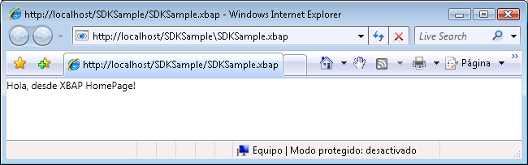  
  
> [!NOTE]
>  Para obtener más información sobre el desarrollo e implementación de [!INCLUDE[TLA2#tla_xbap#plural](../../../../includes/tla2sharptla-xbapsharpplural-md.md)], consulte [WPF XAML Browser Applications Overview](../../../../docs/framework/wpf/app-development/wpf-xaml-browser-applications-overview.md) y [implementar una aplicación WPF](../../../../docs/framework/wpf/app-development/deploying-a-wpf-application-wpf.md).  
  
   
### Configuración del título, el ancho y el alto de la ventana host  
 Algo que quizás haya observado en la figura anterior es que el título del explorador y el panel de ficha es la [!INCLUDE[TLA2#tla_uri](../../../../includes/tla2sharptla-uri-md.md)] para el [!INCLUDE[TLA2#tla_xbap](../../../../includes/tla2sharptla-xbap-md.md)]. Además de largo, el título no es atractivo ni informativo. Por esta razón, <xref:System.Windows.Controls.Page> ofrece una manera de cambiar el título estableciendo la <xref:System.Windows.Controls.Page.WindowTitle%2A> propiedad. Además, puede configurar el ancho y alto de la ventana del explorador estableciendo <xref:System.Windows.Controls.Page.WindowWidth%2A> y <xref:System.Windows.Controls.Page.WindowHeight%2A>, respectivamente.  
  
 <xref:System.Windows.Controls.Page.WindowTitle%2A>, <xref:System.Windows.Controls.Page.WindowWidth%2A>, y <xref:System.Windows.Controls.Page.WindowHeight%2A> puede establecer mediante declaración en el marcado, como se muestra en el ejemplo siguiente.  
  
 [!code-xaml[NavigationOverviewSnippets#HomePageMARKUP](../../../../samples/snippets/csharp/VS_Snippets_Wpf/NavigationOverviewSnippets/CSharp/HomePage.xaml#homepagemarkup)]  
  
 El resultado se muestra en la ilustración siguiente.  
  
   
  
   
### Navegación por hipervínculos  
 Una típica [!INCLUDE[TLA2#tla_xbap](../../../../includes/tla2sharptla-xbap-md.md)] consta de varias páginas. La manera más sencilla de navegar de una página a otra es usar un <xref:System.Windows.Documents.Hyperlink>. Puede agregar mediante declaración un <xref:System.Windows.Documents.Hyperlink> a una <xref:System.Windows.Controls.Page> utilizando el `Hyperlink` elemento, que se muestra en el siguiente marcado.  
  
 [!code-xaml[NavigationOverviewSnippets#HyperlinkXAML1](../../../../samples/snippets/csharp/VS_Snippets_Wpf/NavigationOverviewSnippets/CSharp/PageWithHyperlink.xaml#hyperlinkxaml1)]  
[!code-xaml[NavigationOverviewSnippets#HyperlinkXAML2](../../../../samples/snippets/csharp/VS_Snippets_Wpf/NavigationOverviewSnippets/CSharp/PageWithHyperlink.xaml#hyperlinkxaml2)]  
[!code-xaml[NavigationOverviewSnippets#HyperlinkXAML3](../../../../samples/snippets/csharp/VS_Snippets_Wpf/NavigationOverviewSnippets/CSharp/PageWithHyperlink.xaml#hyperlinkxaml3)]  
  
 Un `Hyperlink` elemento requiere lo siguiente:  
  
-   El módulo [!INCLUDE[TLA2#tla_uri](../../../../includes/tla2sharptla-uri-md.md)] de la <xref:System.Windows.Controls.Page> para ir a, tal y como especifica la `NavigateUri` atributo.  
  
-   Contenido que un usuario puede hacer clic para iniciar el panel de navegación, como texto e imágenes (para el contenido que el `Hyperlink` elemento puede contener, consulte <xref:System.Windows.Documents.Hyperlink>).  
  
 La siguiente ilustración muestra un [!INCLUDE[TLA2#tla_xbap](../../../../includes/tla2sharptla-xbap-md.md)] con un <xref:System.Windows.Controls.Page> que tiene un <xref:System.Windows.Documents.Hyperlink>.  
  
 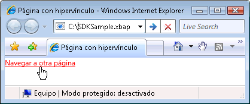  
  
 Como cabría esperar, al hacer clic en el <xref:System.Windows.Documents.Hyperlink> hace que el [!INCLUDE[TLA2#tla_xbap](../../../../includes/tla2sharptla-xbap-md.md)] para navegar hasta la <xref:System.Windows.Controls.Page> que se identifica mediante el `NavigateUri` atributo. Además, el [!INCLUDE[TLA2#tla_xbap](../../../../includes/tla2sharptla-xbap-md.md)] agrega una entrada para el anterior <xref:System.Windows.Controls.Page> a la lista de páginas recientes en [!INCLUDE[TLA2#tla_ie](../../../../includes/tla2sharptla-ie-md.md)]. Esto se muestra en la siguiente ilustración.  
  
 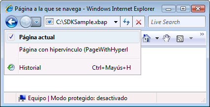  
  
 Además de admitir la navegación desde un <xref:System.Windows.Controls.Page> a otro, <xref:System.Windows.Documents.Hyperlink> también admite la navegación por fragmentos.  
  
   
### Navegación por fragmentos  
 *La navegación por fragmentos* es la navegación a un fragmento de contenido en la vista actual <xref:System.Windows.Controls.Page> u otro <xref:System.Windows.Controls.Page>. En [!INCLUDE[TLA2#tla_wpf](../../../../includes/tla2sharptla-wpf-md.md)], un fragmento de contenido es el contenido que está contenido en un elemento con nombre. Un elemento con nombre es un elemento que tiene su `Name` conjunto de atributos. El marcado siguiente muestra un conjunto con nombre `TextBlock` elemento que contiene un fragmento de contenido.  
  
 [!code-xaml[NavigationOverviewSnippets#PageWithContentFragmentsMARKUP1](../../../../samples/snippets/csharp/VS_Snippets_Wpf/NavigationOverviewSnippets/CSharp/PageWithFragments.xaml#pagewithcontentfragmentsmarkup1)]  
[!code-xaml[NavigationOverviewSnippets#PageWithContentFragmentsMARKUP2](../../../../samples/snippets/csharp/VS_Snippets_Wpf/NavigationOverviewSnippets/CSharp/PageWithFragments.xaml#pagewithcontentfragmentsmarkup2)]  
[!code-xaml[NavigationOverviewSnippets#PageWithContentFragmentsMARKUP3](../../../../samples/snippets/csharp/VS_Snippets_Wpf/NavigationOverviewSnippets/CSharp/PageWithFragments.xaml#pagewithcontentfragmentsmarkup3)]  
  
 Para una <xref:System.Windows.Documents.Hyperlink> para navegar a un fragmento de contenido, la `NavigateUri` atributo debe incluir lo siguiente:  
  
-   El [!INCLUDE[TLA2#tla_uri](../../../../includes/tla2sharptla-uri-md.md)] de la <xref:System.Windows.Controls.Page> con el fragmento de contenido para desplazarse a.  
  
-   Un carácter "#".  
  
-   El nombre del elemento en el <xref:System.Windows.Controls.Page> que contiene el fragmento de contenido.  
  
 Un fragmento [!INCLUDE[TLA2#tla_uri](../../../../includes/tla2sharptla-uri-md.md)] tiene el formato siguiente.  
  
 *PageURI* `#` *ElementName*  
  
 La siguiente muestra un ejemplo de un `Hyperlink` que está configurado para navegar a un fragmento de contenido.  
  
 [!code-xaml[NavigationOverviewSnippets#PageThatNavigatesXAML1](../../../../samples/snippets/csharp/VS_Snippets_Wpf/NavigationOverviewSnippets/CSharp/PageThatNavigatesToFragment.xaml#pagethatnavigatesxaml1)]  
[!code-xaml[NavigationOverviewSnippets#PageThatNavigatesXAML2](../../../../samples/snippets/csharp/VS_Snippets_Wpf/NavigationOverviewSnippets/CSharp/PageThatNavigatesToFragment.xaml#pagethatnavigatesxaml2)]  
[!code-xaml[NavigationOverviewSnippets#PageThatNavigatesXAML3](../../../../samples/snippets/csharp/VS_Snippets_Wpf/NavigationOverviewSnippets/CSharp/PageThatNavigatesToFragment.xaml#pagethatnavigatesxaml3)]  
  
> [!NOTE]
>  Esta sección describe la implementación de navegación del fragmento predeterminado en [!INCLUDE[TLA2#tla_wpf](../../../../includes/tla2sharptla-wpf-md.md)]. [!INCLUDE[TLA2#tla_wpf](../../../../includes/tla2sharptla-wpf-md.md)] También le permite implementar su propio esquema de navegación de fragmento que, en parte, requiere un tratamiento el <xref:System.Windows.Navigation.NavigationService.FragmentNavigation?displayProperty=nameWithType> eventos.  
  
> [!IMPORTANT]
>  Puede navegar a fragmentos en malas [!INCLUDE[TLA2#tla_xaml](../../../../includes/tla2sharptla-xaml-md.md)] páginas (sólo marcado [!INCLUDE[TLA2#tla_xaml](../../../../includes/tla2sharptla-xaml-md.md)] archivos con `Page` como el elemento raíz) solo si se pueden examinar las páginas a través de [!INCLUDE[TLA2#tla_http](../../../../includes/tla2sharptla-http-md.md)].  
>   
>  Sin embargo, un malas [!INCLUDE[TLA2#tla_xaml](../../../../includes/tla2sharptla-xaml-md.md)] página puede navegar a sus propios fragmentos.  
  
   
### Servicio de navegación  
 Mientras <xref:System.Windows.Documents.Hyperlink> permite a un usuario iniciar la navegación a un determinado <xref:System.Windows.Controls.Page>, realiza el trabajo de buscar y descargar la página de la <xref:System.Windows.Navigation.NavigationService> clase. En esencia, <xref:System.Windows.Navigation.NavigationService> proporciona la capacidad para procesar una solicitud de navegación en nombre de código de cliente, como el <xref:System.Windows.Documents.Hyperlink>. Además, <xref:System.Windows.Navigation.NavigationService> implementa la compatibilidad con un nivel más alto para el seguimiento y que influyen en una solicitud de navegación.  
  
 Cuando un <xref:System.Windows.Documents.Hyperlink> se hace clic, [!INCLUDE[TLA2#tla_wpf](../../../../includes/tla2sharptla-wpf-md.md)] llamadas <xref:System.Windows.Navigation.NavigationService.Navigate%2A?displayProperty=nameWithType> para buscar y descargar el <xref:System.Windows.Controls.Page> en el módulo especificado [!INCLUDE[TLA2#tla_uri](../../../../includes/tla2sharptla-uri-md.md)]. Descargado <xref:System.Windows.Controls.Page> se convierte en un árbol de objetos cuyo objeto raíz es una instancia de descargado <xref:System.Windows.Controls.Page>. Una referencia a la raíz <xref:System.Windows.Controls.Page> objeto está almacenado en el <xref:System.Windows.Navigation.NavigationService.Content%2A?displayProperty=nameWithType> propiedad. El módulo de [!INCLUDE[TLA2#tla_uri](../../../../includes/tla2sharptla-uri-md.md)] para el contenido que se navegó se almacena en el <xref:System.Windows.Navigation.NavigationService.Source%2A?displayProperty=nameWithType> propiedad, mientras que la <xref:System.Windows.Navigation.NavigationService.CurrentSource%2A?displayProperty=nameWithType> almacena el módulo [!INCLUDE[TLA2#tla_uri](../../../../includes/tla2sharptla-uri-md.md)] de la última página que se abrirá.  
  
> [!NOTE]
>  Es posible que un [!INCLUDE[TLA2#tla_wpf](../../../../includes/tla2sharptla-wpf-md.md)] aplicación para tener más de un activo actualmente <xref:System.Windows.Navigation.NavigationService>. Para obtener más información, consulte [Hosts de navegación](#Navigation_Hosts) más adelante en este tema.  
  
   
### Navegación programática con el servicio de navegación  
 No es necesario saber <xref:System.Windows.Navigation.NavigationService> si la navegación se implementa mediante declaración en marcado usando <xref:System.Windows.Documents.Hyperlink>, porque <xref:System.Windows.Documents.Hyperlink> usa el <xref:System.Windows.Navigation.NavigationService> en su nombre. Esto significa que, siempre que el elemento primario directo o indirecto de un <xref:System.Windows.Documents.Hyperlink> es un host de navegación (vea [Hosts de navegación](#Navigation_Hosts)), <xref:System.Windows.Documents.Hyperlink> será capaz de encontrar y utilizar el servicio de navegación del host de navegación para procesar un solicitud de navegación.  
  
 Sin embargo, hay situaciones cuando necesite utilizar <xref:System.Windows.Navigation.NavigationService> directamente, incluidos los siguientes:  
  
-   Cuando necesite crear una instancia de un <xref:System.Windows.Controls.Page> utilizando un constructor no predeterminado.  
  
-   Cuando necesite establecer propiedades en la <xref:System.Windows.Controls.Page> antes de navegar hasta él.  
  
-   Cuando el <xref:System.Windows.Controls.Page> que necesita navegar a sólo se puede determinar en tiempo de ejecución.  
  
 En estas situaciones, tiene que escribir código para iniciar la navegación mediante programación mediante una llamada a la <xref:System.Windows.Navigation.NavigationService.Navigate%2A> método de la <xref:System.Windows.Navigation.NavigationService> objeto. Es necesario obtener una referencia a un <xref:System.Windows.Navigation.NavigationService>.  
  
#### Obtención de una referencia a NavigationService  
 Por motivos que se tratan en la [Hosts de navegación](#Navigation_Hosts) sección, un [!INCLUDE[TLA2#tla_wpf](../../../../includes/tla2sharptla-wpf-md.md)] aplicación puede tener más de un <xref:System.Windows.Navigation.NavigationService>. Esto significa que el código necesita una manera de buscar un <xref:System.Windows.Navigation.NavigationService>, que normalmente es el <xref:System.Windows.Navigation.NavigationService> que navega al actual <xref:System.Windows.Controls.Page>. Puede obtener una referencia a un <xref:System.Windows.Navigation.NavigationService> mediante una llamada a la `static` <xref:System.Windows.Navigation.NavigationService.GetNavigationService%2A?displayProperty=nameWithType> método. Para obtener la <xref:System.Windows.Navigation.NavigationService> que navega a un determinado <xref:System.Windows.Controls.Page>, se pasa una referencia a la <xref:System.Windows.Controls.Page> como el argumento de la <xref:System.Windows.Navigation.NavigationService.GetNavigationService%2A> método. El código siguiente muestra cómo obtener el <xref:System.Windows.Navigation.NavigationService> actuales <xref:System.Windows.Controls.Page>.  
  
 [!code-csharp[NavigationOverviewSnippets#GetNSCODEBEHIND1](../../../../samples/snippets/csharp/VS_Snippets_Wpf/NavigationOverviewSnippets/CSharp/GetNSPage.xaml.cs#getnscodebehind1)]  
[!code-csharp[NavigationOverviewSnippets#GetNSCODEBEHIND2](../../../../samples/snippets/csharp/VS_Snippets_Wpf/NavigationOverviewSnippets/CSharp/GetNSPage.xaml.cs#getnscodebehind2)]
[!code-vb[NavigationOverviewSnippets#GetNSCODEBEHIND2](../../../../samples/snippets/visualbasic/VS_Snippets_Wpf/NavigationOverviewSnippets/VisualBasic/GetNSPage.xaml.vb#getnscodebehind2)]  
  
 Como método abreviado para buscar el <xref:System.Windows.Navigation.NavigationService> para un <xref:System.Windows.Controls.Page>, <xref:System.Windows.Controls.Page> implementa el <xref:System.Windows.Controls.Page.NavigationService%2A> propiedad. Esta implementación se muestra en el ejemplo siguiente.  
  
 [!code-csharp[NavigationOverviewSnippets#GetNSShortcutCODEBEHIND1](../../../../samples/snippets/csharp/VS_Snippets_Wpf/NavigationOverviewSnippets/CSharp/GetNSPageShortCut.xaml.cs#getnsshortcutcodebehind1)]  
[!code-csharp[NavigationOverviewSnippets#GetNSShortcutCODEBEHIND2](../../../../samples/snippets/csharp/VS_Snippets_Wpf/NavigationOverviewSnippets/CSharp/GetNSPageShortCut.xaml.cs#getnsshortcutcodebehind2)]
[!code-vb[NavigationOverviewSnippets#GetNSShortcutCODEBEHIND2](../../../../samples/snippets/visualbasic/VS_Snippets_Wpf/NavigationOverviewSnippets/VisualBasic/GetNSPageShortCut.xaml.vb#getnsshortcutcodebehind2)]  
  
> [!NOTE]
>  A <xref:System.Windows.Controls.Page> sólo se puede obtener una referencia a su <xref:System.Windows.Navigation.NavigationService> cuando <xref:System.Windows.Controls.Page> provoca la <xref:System.Windows.FrameworkElement.Loaded> eventos.  
  
#### Navegación programática a un objeto de página  
 En el ejemplo siguiente se muestra cómo utilizar el <xref:System.Windows.Navigation.NavigationService> para desplazarse mediante programación a un <xref:System.Windows.Controls.Page>. Se requiere la navegación mediante programación porque el <xref:System.Windows.Controls.Page> es decir que se navega sólo se puede crear instancias mediante un constructor único y no predeterminado. El <xref:System.Windows.Controls.Page> con el constructor predeterminado no se muestra en el siguiente código de marcado y el código.  
  
 [!code-xaml[NavigationOverviewSnippets#PageWithNonDefaultConstructorXAML](../../../../samples/snippets/csharp/VS_Snippets_Wpf/NavigationOverviewSnippets/CSharp/PageWithNonDefaultConstructor.xaml#pagewithnondefaultconstructorxaml)]  
  
 [!code-csharp[NavigationOverviewSnippets#PageWithNonDefaultConstructorCODEBEHIND](../../../../samples/snippets/csharp/VS_Snippets_Wpf/NavigationOverviewSnippets/CSharp/PageWithNonDefaultConstructor.xaml.cs#pagewithnondefaultconstructorcodebehind)]
 [!code-vb[NavigationOverviewSnippets#PageWithNonDefaultConstructorCODEBEHIND](../../../../samples/snippets/visualbasic/VS_Snippets_Wpf/NavigationOverviewSnippets/VisualBasic/PageWithNonDefaultConstructor.xaml.vb#pagewithnondefaultconstructorcodebehind)]  
  
 El <xref:System.Windows.Controls.Page> que navega a la <xref:System.Windows.Controls.Page> con el constructor predeterminado no se muestra en el siguiente código de marcado y el código.  
  
 [!code-xaml[NavigationOverviewSnippets#NSNavigationPageXAML](../../../../samples/snippets/csharp/VS_Snippets_Wpf/NavigationOverviewSnippets/CSharp/NSNavigationPage.xaml#nsnavigationpagexaml)]  
  
 [!code-csharp[NavigationOverviewSnippets#NSNavigationPageCODEBEHIND](../../../../samples/snippets/csharp/VS_Snippets_Wpf/NavigationOverviewSnippets/CSharp/NSNavigationPage.xaml.cs#nsnavigationpagecodebehind)]
 [!code-vb[NavigationOverviewSnippets#NSNavigationPageCODEBEHIND](../../../../samples/snippets/visualbasic/VS_Snippets_Wpf/NavigationOverviewSnippets/VisualBasic/NSNavigationPage.xaml.vb#nsnavigationpagecodebehind)]  
  
 Cuando el <xref:System.Windows.Documents.Hyperlink> en este <xref:System.Windows.Controls.Page> es hacer clic en, se inicia la navegación creando instancias de la <xref:System.Windows.Controls.Page> para navegar a utilizando el constructor no predeterminado y llamar a la <xref:System.Windows.Navigation.NavigationService.Navigate%2A?displayProperty=nameWithType> (método). <xref:System.Windows.Navigation.NavigationService.Navigate%2A> acepta una referencia al objeto que la <xref:System.Windows.Navigation.NavigationService> se le remitirá a, en lugar de un módulo de [!INCLUDE[TLA2#tla_uri](../../../../includes/tla2sharptla-uri-md.md)].  
  
#### Navegación programática con Pack URI  
 Si necesita crear un módulo de [!INCLUDE[TLA2#tla_uri](../../../../includes/tla2sharptla-uri-md.md)] mediante programación (cuando solo se puede determinar el módulo [!INCLUDE[TLA2#tla_uri](../../../../includes/tla2sharptla-uri-md.md)] en tiempo de ejecución, por ejemplo), puede usar el <xref:System.Windows.Navigation.NavigationService.Navigate%2A?displayProperty=nameWithType> método. Esta implementación se muestra en el ejemplo siguiente.  
  
 [!code-xaml[NavigationOverviewSnippets#NSUriNavigationPageXAML](../../../../samples/snippets/csharp/VS_Snippets_Wpf/NavigationOverviewSnippets/CSharp/NSUriNavigationPage.xaml#nsurinavigationpagexaml)]  
  
 [!code-csharp[NavigationOverviewSnippets#NSUriNavigationPageCODEBEHIND](../../../../samples/snippets/csharp/VS_Snippets_Wpf/NavigationOverviewSnippets/CSharp/NSUriNavigationPage.xaml.cs#nsurinavigationpagecodebehind)]
 [!code-vb[NavigationOverviewSnippets#NSUriNavigationPageCODEBEHIND](../../../../samples/snippets/visualbasic/VS_Snippets_Wpf/NavigationOverviewSnippets/VisualBasic/NSUriNavigationPage.xaml.vb#nsurinavigationpagecodebehind)]  
  
#### Actualización de la página actual  
 A <xref:System.Windows.Controls.Page> no se descarga si tiene el mismo módulo de [!INCLUDE[TLA2#tla_uri](../../../../includes/tla2sharptla-uri-md.md)] como el módulo de [!INCLUDE[TLA2#tla_uri](../../../../includes/tla2sharptla-uri-md.md)] que están almacenados en el <xref:System.Windows.Navigation.NavigationService.Source%2A?displayProperty=nameWithType> propiedad. Para forzar [!INCLUDE[TLA2#tla_wpf](../../../../includes/tla2sharptla-wpf-md.md)] para descargar de nuevo la página actual, puede llamar a la <xref:System.Windows.Navigation.NavigationService.Refresh%2A?displayProperty=nameWithType> método, tal como se muestra en el ejemplo siguiente.  
  
 [!code-xaml[NavigationOverviewSnippets#NSRefreshNavigationPageXAML1](../../../../samples/snippets/csharp/VS_Snippets_Wpf/NavigationOverviewSnippets/CSharp/NSRefreshNavigationPage.xaml#nsrefreshnavigationpagexaml1)]  
  
 [!code-csharp[NavigationOverviewSnippets#NSRefreshNavigationPageCODEBEHIND1](../../../../samples/snippets/csharp/VS_Snippets_Wpf/NavigationOverviewSnippets/CSharp/NSRefreshNavigationPage.xaml.cs#nsrefreshnavigationpagecodebehind1)]
 [!code-vb[NavigationOverviewSnippets#NSRefreshNavigationPageCODEBEHIND1](../../../../samples/snippets/visualbasic/VS_Snippets_Wpf/NavigationOverviewSnippets/VisualBasic/NSRefreshNavigationPage.xaml.vb#nsrefreshnavigationpagecodebehind1)]  
[!code-csharp[NavigationOverviewSnippets#NSRefreshNavigationPageCODEBEHIND2](../../../../samples/snippets/csharp/VS_Snippets_Wpf/NavigationOverviewSnippets/CSharp/NSRefreshNavigationPage.xaml.cs#nsrefreshnavigationpagecodebehind2)]
[!code-vb[NavigationOverviewSnippets#NSRefreshNavigationPageCODEBEHIND2](../../../../samples/snippets/visualbasic/VS_Snippets_Wpf/NavigationOverviewSnippets/VisualBasic/NSRefreshNavigationPage.xaml.vb#nsrefreshnavigationpagecodebehind2)]  
  
   
### Duración de la navegación  
 Hay muchas maneras de iniciar la navegación, tal como ha podido ver. Cuando se inicia la navegación, y mientras la navegación está en curso, puede realizar un seguimiento y dirigir la navegación mediante los siguientes eventos que se implementan mediante <xref:System.Windows.Navigation.NavigationService>:  
  
-   <xref:System.Windows.Navigation.NavigationService.Navigating>. Se produce cuando se solicita una nueva navegación. Puede utilizarse para cancelar la navegación.  
  
-   <xref:System.Windows.Navigation.NavigationService.NavigationProgress>. Se produce periódicamente durante una descarga y ofrece información sobre el progreso de la exploración.  
  
-   <xref:System.Windows.Navigation.NavigationService.Navigated>. Se produce cuando se ha encontrado la página y se ha descargado.  
  
-   <xref:System.Windows.Navigation.NavigationService.NavigationStopped>. Se produce cuando se detiene la navegación (mediante una llamada a <xref:System.Windows.Navigation.NavigationService.StopLoading%2A>), o cuando se solicita una nueva navegación mientras hay una navegación en curso.  
  
-   <xref:System.Windows.Navigation.NavigationService.NavigationFailed>. Se produce cuando se genera un error mientras se navega por el contenido solicitado.  
  
-   <xref:System.Windows.Navigation.NavigationService.LoadCompleted>. Se produce cuando el contenido al que se navegó se carga y se analiza, y empieza a representarse.  
  
-   <xref:System.Windows.Navigation.NavigationService.FragmentNavigation>. Se produce cuando se inicia la navegación a un fragmento de contenido, cosa que tiene lugar:  
  
    -   Inmediatamente, si el fragmento deseado está en el contenido actual.  
  
    -   Una vez se ha cargado el contenido de origen, si el fragmento deseado está en otro contenido.  
  
 Los eventos de navegación se generan en el orden que se muestra en la ilustración siguiente.  
  
 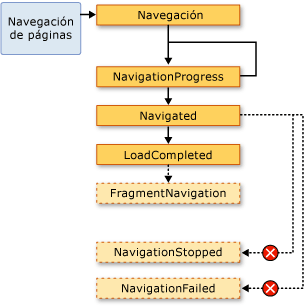  
  
 En general, un <xref:System.Windows.Controls.Page> no está preocupado por estos eventos. Es más probable que una aplicación se refiere a ellos y, por esta razón, estos eventos también se generan si la <xref:System.Windows.Application> clase:  
  
-   <xref:System.Windows.Application.Navigating?displayProperty=nameWithType>  
  
-   <xref:System.Windows.Application.NavigationProgress?displayProperty=nameWithType>  
  
-   <xref:System.Windows.Application.Navigated?displayProperty=nameWithType>  
  
-   <xref:System.Windows.Application.NavigationFailed?displayProperty=nameWithType>  
  
-   <xref:System.Windows.Application.NavigationStopped?displayProperty=nameWithType>  
  
-   <xref:System.Windows.Application.LoadCompleted?displayProperty=nameWithType>  
  
-   <xref:System.Windows.Application.FragmentNavigation?displayProperty=nameWithType>  
  
 Cada vez que <xref:System.Windows.Navigation.NavigationService> genera un evento, el <xref:System.Windows.Application> clase provoca el evento correspondiente. <xref:System.Windows.Controls.Frame> y <xref:System.Windows.Navigation.NavigationWindow> ofrecen los mismos eventos para detectar la navegación en sus respectivos ámbitos.  
  
 En algunos casos, un <xref:System.Windows.Controls.Page> podría estar interesado en estos eventos. Por ejemplo, un <xref:System.Windows.Controls.Page> puede controlar la <xref:System.Windows.Navigation.NavigationService.Navigating?displayProperty=nameWithType> evento para determinar si se debe o no cancelar la navegación fuera del propio. Esta implementación se muestra en el ejemplo siguiente.  
  
 [!code-xaml[NavigationOverviewSnippets#CancelNavigationPageXAML](../../../../samples/snippets/csharp/VS_Snippets_Wpf/NavigationOverviewSnippets/CSharp/CancelNavigationPage.xaml#cancelnavigationpagexaml)]  
  
 [!code-csharp[NavigationOverviewSnippets#CancelNavigationPageCODEBEHIND](../../../../samples/snippets/csharp/VS_Snippets_Wpf/NavigationOverviewSnippets/CSharp/CancelNavigationPage.xaml.cs#cancelnavigationpagecodebehind)]
 [!code-vb[NavigationOverviewSnippets#CancelNavigationPageCODEBEHIND](../../../../samples/snippets/visualbasic/VS_Snippets_Wpf/NavigationOverviewSnippets/VisualBasic/CancelNavigationPage.xaml.vb#cancelnavigationpagecodebehind)]  
  
 Si registra un controlador con un evento de navegación de un <xref:System.Windows.Controls.Page>, igual que el ejemplo anterior, también debe anular el registro del controlador de eventos. Si no lo hace, puede haber efectos secundarios con respecto a cómo [!INCLUDE[TLA2#tla_wpf](../../../../includes/tla2sharptla-wpf-md.md)] recuerda la navegación <xref:System.Windows.Controls.Page> navegación con el diario.  
  
   
### Registro de la navegación con el diario  
 [!INCLUDE[TLA2#tla_wpf](../../../../includes/tla2sharptla-wpf-md.md)] usa dos pilas para recordar las páginas desde las que ha navegado: una pila de retroceso y una pila de avance. Cuando se desplaza actual <xref:System.Windows.Controls.Page> a una nueva <xref:System.Windows.Controls.Page> o hacia delante en una existente <xref:System.Windows.Controls.Page>, actual <xref:System.Windows.Controls.Page> se agrega a la *pila de retroceso*. Cuando se desplaza actual <xref:System.Windows.Controls.Page> con la anterior <xref:System.Windows.Controls.Page>, actual <xref:System.Windows.Controls.Page> se agrega a la *pila de avance*. La pila de retroceso, la pila de avance y la funcionalidad para administrarlas se conocen en conjunto como el diario. Cada elemento de la pila de retroceso y la pila de avance es una instancia de la <xref:System.Windows.Navigation.JournalEntry> clase y se conoce como un *entrada de diario*.  
  
#### Navegación por el diario desde Internet Explorer  
 Conceptualmente, el diario funciona de la misma forma en que la **Atrás** y **al día** botones [!INCLUDE[TLA2#tla_ie](../../../../includes/tla2sharptla-ie-md.md)] hacer. Esto se muestra en la siguiente ilustración.  
  
   
  
 Para [!INCLUDE[TLA2#tla_xbap#plural](../../../../includes/tla2sharptla-xbapsharpplural-md.md)] hospedados por [!INCLUDE[TLA2#tla_ie](../../../../includes/tla2sharptla-ie-md.md)], [!INCLUDE[TLA2#tla_wpf](../../../../includes/tla2sharptla-wpf-md.md)] se integra en el diario en el panel de navegación [!INCLUDE[TLA2#tla_ui](../../../../includes/tla2sharptla-ui-md.md)] de [!INCLUDE[TLA2#tla_ie](../../../../includes/tla2sharptla-ie-md.md)]. Esto permite a los usuarios navegar por las páginas en un [!INCLUDE[TLA2#tla_xbap](../../../../includes/tla2sharptla-xbap-md.md)] mediante el uso de la **Atrás**, **al día**, y **páginas recientes** botones [!INCLUDE[TLA2#tla_ie](../../../../includes/tla2sharptla-ie-md.md)]. El diario no está integrado en [!INCLUDE[TLA2#tla_ie6](../../../../includes/tla2sharptla-ie6-md.md)] de la misma manera que es para [!INCLUDE[TLA2#tla_ie7](../../../../includes/tla2sharptla-ie7-md.md)] o Internet Explorer 8. En su lugar, [!INCLUDE[TLA2#tla_wpf](../../../../includes/tla2sharptla-wpf-md.md)] representa una navegación sustituto [!INCLUDE[TLA2#tla_ui](../../../../includes/tla2sharptla-ui-md.md)].  
  
> [!IMPORTANT]
>  En [!INCLUDE[TLA2#tla_ie](../../../../includes/tla2sharptla-ie-md.md)], cuando un usuario se desplaza fuera de y de vuelta a un [!INCLUDE[TLA2#tla_xbap](../../../../includes/tla2sharptla-xbap-md.md)], solo las entradas de diario para las páginas que no se mantuvieron activas se conservan en el diario. Para obtener una explicación sobre el mantenimiento activo de páginas, vea [duración de la página y el diario de](#PageLifetime) más adelante en este tema.  
  
 De forma predeterminada, el texto de cada <xref:System.Windows.Controls.Page> que aparece en el **páginas recientes** lista de [!INCLUDE[TLA2#tla_ie](../../../../includes/tla2sharptla-ie-md.md)] es el [!INCLUDE[TLA2#tla_uri](../../../../includes/tla2sharptla-uri-md.md)] para el <xref:System.Windows.Controls.Page>. En muchos casos, esto no es especialmente significativo para el usuario. Afortunadamente, puede cambiar el texto mediante una de las siguientes opciones:  
  
1.  El archivo adjunto `JournalEntry.Name` valor de atributo.  
  
2.  La `Page.Title` valor de atributo.  
  
3.  El `Page.WindowTitle` valor del atributo y el [!INCLUDE[TLA2#tla_uri](../../../../includes/tla2sharptla-uri-md.md)] actuales <xref:System.Windows.Controls.Page>.  
  
4.  [!INCLUDE[TLA2#tla_uri](../../../../includes/tla2sharptla-uri-md.md)] de la <xref:System.Windows.Controls.Page> actual. (Predeterminado)  
  
 El orden en que se enumeran las opciones coincide con el orden de prioridad para buscar el texto. Por ejemplo, si `JournalEntry.Name` se establece, se omiten los demás valores.  
  
 En el ejemplo siguiente se usa el `Page.Title` atributo para cambiar el texto que aparece para una entrada de diario.  
  
 [!code-xaml[NavigationOverviewSnippets#PageTitleMARKUP1](../../../../samples/snippets/csharp/VS_Snippets_Wpf/NavigationOverviewSnippets/CSharp/PageWithTitle.xaml#pagetitlemarkup1)]  
[!code-xaml[NavigationOverviewSnippets#PageTitleMARKUP2](../../../../samples/snippets/csharp/VS_Snippets_Wpf/NavigationOverviewSnippets/CSharp/PageWithTitle.xaml#pagetitlemarkup2)]  
  
 [!code-csharp[NavigationOverviewSnippets#PageTitleCODEBEHIND1](../../../../samples/snippets/csharp/VS_Snippets_Wpf/NavigationOverviewSnippets/CSharp/PageWithTitle.xaml.cs#pagetitlecodebehind1)]
 [!code-vb[NavigationOverviewSnippets#PageTitleCODEBEHIND1](../../../../samples/snippets/visualbasic/VS_Snippets_Wpf/NavigationOverviewSnippets/VisualBasic/PageWithTitle.xaml.vb#pagetitlecodebehind1)]  
[!code-csharp[NavigationOverviewSnippets#PageTitleCODEBEHIND2](../../../../samples/snippets/csharp/VS_Snippets_Wpf/NavigationOverviewSnippets/CSharp/PageWithTitle.xaml.cs#pagetitlecodebehind2)]
[!code-vb[NavigationOverviewSnippets#PageTitleCODEBEHIND2](../../../../samples/snippets/visualbasic/VS_Snippets_Wpf/NavigationOverviewSnippets/VisualBasic/PageWithTitle.xaml.vb#pagetitlecodebehind2)]  
  
#### Navegación por el diario mediante WPF  
 Aunque un usuario puede navegar por el diario mediante el uso de la **Atrás**, **al día**, y **páginas recientes** en [!INCLUDE[TLA2#tla_ie](../../../../includes/tla2sharptla-ie-md.md)], también puede navegar el diario de uso mecanismos declarativos y de programación proporcionados por [!INCLUDE[TLA2#tla_wpf](../../../../includes/tla2sharptla-wpf-md.md)]. Una de las razones para ello es proporcionar navegación personalizada [!INCLUDE[TLA2#tla_ui#plural](../../../../includes/tla2sharptla-uisharpplural-md.md)] en las páginas.  
  
 Mediante declaración puede agregar compatibilidad de navegación de diario mediante los comandos de navegación expuestos por <xref:System.Windows.Input.NavigationCommands>. En el ejemplo siguiente se muestra cómo utilizar el `BrowseBack` comandos de navegación.  
  
 [!code-xaml[NavigationOverviewSnippets#NavigationCommandsPageXAML1](../../../../samples/snippets/csharp/VS_Snippets_Wpf/NavigationOverviewSnippets/CSharp/NavigationCommandsPage.xaml#navigationcommandspagexaml1)]  
[!code-xaml[NavigationOverviewSnippets#NavigationCommandsPageXAML2](../../../../samples/snippets/csharp/VS_Snippets_Wpf/NavigationOverviewSnippets/CSharp/NavigationCommandsPage.xaml#navigationcommandspagexaml2)]  
[!code-xaml[NavigationOverviewSnippets#NavigationCommandsPageXAML3](../../../../samples/snippets/csharp/VS_Snippets_Wpf/NavigationOverviewSnippets/CSharp/NavigationCommandsPage.xaml#navigationcommandspagexaml3)]  
[!code-xaml[NavigationOverviewSnippets#NavigationCommandsPageXAML4](../../../../samples/snippets/csharp/VS_Snippets_Wpf/NavigationOverviewSnippets/CSharp/NavigationCommandsPage.xaml#navigationcommandspagexaml4)]  
  
 Puede navegar mediante programación el diario mediante uno de los siguientes miembros de la <xref:System.Windows.Navigation.NavigationService> clase:  
  
-   <xref:System.Windows.Navigation.NavigationService.GoBack%2A>  
  
-   <xref:System.Windows.Navigation.NavigationService.GoForward%2A>  
  
-   <xref:System.Windows.Navigation.NavigationService.CanGoBack%2A>  
  
-   <xref:System.Windows.Navigation.NavigationService.CanGoForward%2A>  
  
 El diario también se puede manipular mediante programación, como se describe en [conservar el estado de contenido con el historial de navegación](#RetainingContentStateWithNavigationHistory) más adelante en este tema.  
  
   
### Duración de la página y el diario  
 Considere la posibilidad de un [!INCLUDE[TLA2#tla_xbap](../../../../includes/tla2sharptla-xbap-md.md)] con varias páginas que contienen contenido enriquecido, incluidos gráficos, animaciones y multimedia. La superficie de memoria de este tipo de páginas podría ser bastante grande, especialmente si se usan elementos multimedia de audio y vídeo. Dado que el diario "recuerda" las páginas que se han navegado a, como un [!INCLUDE[TLA2#tla_xbap](../../../../includes/tla2sharptla-xbap-md.md)] rápidamente podría consumir una cantidad considerable de memoria.  
  
 Por esta razón, el comportamiento predeterminado del diario es almacenar <xref:System.Windows.Controls.Page> metadatos en cada entrada de diario en lugar de una referencia a un <xref:System.Windows.Controls.Page> objeto. Cuando se navega una entrada de diario, su <xref:System.Windows.Controls.Page> metadatos se usan para crear una nueva instancia del elemento especificado <xref:System.Windows.Controls.Page>. En consecuencia, cada <xref:System.Windows.Controls.Page> que se navega tiene la duración que se muestra en la ilustración siguiente.  
  
 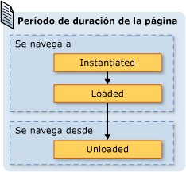  
  
 Aunque se utiliza el comportamiento de registro en diario predeterminado puede ahorrar en el consumo de memoria, podría reducirse el rendimiento de la representación de cada página; reinstantiating un <xref:System.Windows.Controls.Page> puede llevar mucho tiempo, especialmente si tiene mucho contenido. Si necesita conservar un <xref:System.Windows.Controls.Page> instancia en journal, puede dibujar en estas dos técnicas para hacerlo. En primer lugar, puede navegar mediante programación a un <xref:System.Windows.Controls.Page> objeto mediante una llamada a la <xref:System.Windows.Navigation.NavigationService.Navigate%2A?displayProperty=nameWithType> método.  
  
 En segundo lugar, puede especificar que [!INCLUDE[TLA2#tla_wpf](../../../../includes/tla2sharptla-wpf-md.md)] conservar una instancia de un <xref:System.Windows.Controls.Page> en el diario estableciendo la <xref:System.Windows.Controls.Page.KeepAlive%2A> propiedad `true` (el valor predeterminado es `false`). Como se muestra en el ejemplo siguiente, puede establecer <xref:System.Windows.Controls.Page.KeepAlive%2A> mediante declaración en el marcado.  
  
 [!code-xaml[NavigationOverviewSnippets#KeepAlivePageXAML](../../../../samples/snippets/csharp/VS_Snippets_Wpf/NavigationOverviewSnippets/CSharp/KeepAlivePage.xaml#keepalivepagexaml)]  
  
 La duración de un <xref:System.Windows.Controls.Page> decir mantiene activo es ligeramente diferente de uno que no está. La primera vez un <xref:System.Windows.Controls.Page> que se mantiene activo se navega a, se crea una instancia como un <xref:System.Windows.Controls.Page> que no se mantiene activo. Sin embargo, dado que una instancia de la <xref:System.Windows.Controls.Page> se conserva en el diario, nunca se crean instancias nuevo para mientras permanece en el diario. Por lo tanto, si un <xref:System.Windows.Controls.Page> tiene una lógica de inicialización que deba llamarse cada vez el <xref:System.Windows.Controls.Page> se navega a, debe moverlo desde el constructor en un controlador para el <xref:System.Windows.FrameworkElement.Loaded> eventos. Como se muestra en la ilustración siguiente, la <xref:System.Windows.FrameworkElement.Loaded> y <xref:System.Windows.FrameworkElement.Unloaded> todavía se generan eventos cada vez que un <xref:System.Windows.Controls.Page> se navega hacia y desde, respectivamente.  
  
 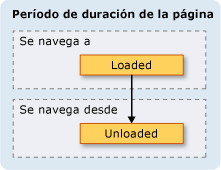  
  
 Cuando un <xref:System.Windows.Controls.Page> no es mantiene activo, no debería realizar cualquiera de las siguientes acciones:  
  
-   Almacenar una referencia a la base de datos ni ninguna parte de esta.  
  
-   Registrar controladores de eventos con eventos que no haya implementado.  
  
 Realice cualquiera de estos creará las referencias que forzar la <xref:System.Windows.Controls.Page> deben retenerse en memoria, incluso después de que se ha quitado del diario.  
  
 En general, es preferible el valor predeterminado <xref:System.Windows.Controls.Page> comportamiento de no se debe mantener un <xref:System.Windows.Controls.Page> activo. Sin embargo, esto conlleva implicaciones de estado que se describen en la sección siguiente.  
  
   
### Conservación del estado del contenido con el historial de navegación  
 ¿Si un <xref:System.Windows.Controls.Page> no se mantiene activo, y tiene controles que recopilan datos del usuario, lo que ocurre con los datos si un usuario se desplaza fuera de y de vuelta a la <xref:System.Windows.Controls.Page>? Desde la perspectiva de una experiencia de usuario, el usuario debería ver los datos que especificó anteriormente. Por desgracia, dado que una nueva instancia de la <xref:System.Windows.Controls.Page> se crea con cada panel de navegación, los controles que los datos recopilados se vuelve y se pierden los datos.  
  
 Afortunadamente, el diario proporciona compatibilidad para recordar los datos a través de <xref:System.Windows.Controls.Page> navegaciones, incluidos los datos de control. En concreto, la entrada de diario para cada <xref:System.Windows.Controls.Page> actúa como un contenedor temporal para la asociada <xref:System.Windows.Controls.Page> estado. Los siguientes pasos describen cómo se utiliza esta compatibilidad cuando un <xref:System.Windows.Controls.Page> se navega desde:  
  
1.  Una entrada para el actual <xref:System.Windows.Controls.Page> se agrega al diario.  
  
2.  El estado de la <xref:System.Windows.Controls.Page> se almacena con la entrada de diario para esa página, que se agrega a la pila de retroceso.  
  
3.  El nuevo <xref:System.Windows.Controls.Page> se navega.  
  
 Cuando la página <xref:System.Windows.Controls.Page> es navegado a, con el diario de los siguientes pasos tienen lugar:  
  
1.  El <xref:System.Windows.Controls.Page> se crea una instancia (la entrada de diario superior en la pila de retroceso).  
  
2.  El <xref:System.Windows.Controls.Page> se actualiza con el estado que se almacenó con la entrada de diario para el <xref:System.Windows.Controls.Page>.  
  
3.  El <xref:System.Windows.Controls.Page> se retrocede al.  
  
 [!INCLUDE[TLA2#tla_wpf](../../../../includes/tla2sharptla-wpf-md.md)] utiliza automáticamente esta compatibilidad cuando se utilizan los siguientes controles en un <xref:System.Windows.Controls.Page>:  
  
-   <xref:System.Windows.Controls.CheckBox>  
  
-   <xref:System.Windows.Controls.ComboBox>  
  
-   <xref:System.Windows.Controls.Expander>  
  
-   <xref:System.Windows.Controls.Frame>  
  
-   <xref:System.Windows.Controls.ListBox>  
  
-   <xref:System.Windows.Controls.ListBoxItem>  
  
-   <xref:System.Windows.Controls.MenuItem>  
  
-   <xref:System.Windows.Controls.ProgressBar>  
  
-   <xref:System.Windows.Controls.RadioButton>  
  
-   <xref:System.Windows.Controls.Slider>  
  
-   <xref:System.Windows.Controls.TabControl>  
  
-   <xref:System.Windows.Controls.TabItem>  
  
-   <xref:System.Windows.Controls.TextBox>  
  
 Si un <xref:System.Windows.Controls.Page> utiliza estos controles, los datos introducidos en ellos se recuerdan a través de <xref:System.Windows.Controls.Page> navegaciones, como se muestra en el **su Color favorito** <xref:System.Windows.Controls.ListBox> en la ilustración siguiente.  
  
   
  
 Cuando un <xref:System.Windows.Controls.Page> tiene controles distintos de los de la lista anterior, o cuando el estado se almacena en objetos personalizados, tiene que escribir código para hacer que el diario para recordar el estado a través de <xref:System.Windows.Controls.Page> navegaciones.  
  
 Si necesita recordar pequeños fragmentos de estado a través de <xref:System.Windows.Controls.Page> navegaciones, puede usar las propiedades de dependencia (vea <xref:System.Windows.DependencyProperty>) que se configuran con el <xref:System.Windows.FrameworkPropertyMetadata.Journal%2A?displayProperty=nameWithType> marca de metadatos.  
  
 Si el estado que la <xref:System.Windows.Controls.Page> debe recordar durante la navegación consta de varios segmentos de datos, quizá le resulte menos código intensivas para encapsular el estado en una sola clase e implementar el <xref:System.Windows.Navigation.IProvideCustomContentState> interfaz.  
  
 Si se necesita navegar por los distintos Estados de una sola <xref:System.Windows.Controls.Page>, sin navegar desde el <xref:System.Windows.Controls.Page> propio, puede usar <xref:System.Windows.Navigation.IProvideCustomContentState> y <xref:System.Windows.Navigation.NavigationService.AddBackEntry%2A?displayProperty=nameWithType>.  
  
   
### Cookies  
 Otra forma en que [!INCLUDE[TLA2#tla_wpf](../../../../includes/tla2sharptla-wpf-md.md)] aplicaciones pueden almacenar datos es con las cookies, que se crean, actualizan y eliminan mediante el uso de la <xref:System.Windows.Application.SetCookie%2A> y <xref:System.Windows.Application.GetCookie%2A> métodos. Las cookies que se pueden crear en [!INCLUDE[TLA2#tla_wpf](../../../../includes/tla2sharptla-wpf-md.md)] son los mismos cookies que otros tipos de aplicaciones Web usan; las cookies son fragmentos arbitrarios de datos que se almacenan por una aplicación en un equipo cliente durante una o varias sesiones de la aplicación. Los datos de las cookies normalmente adoptan la forma de un par de nombre-valor en el formato siguiente.  
  
 *Name* `=` *Value*  
  
 Cuando los datos se pasan a <xref:System.Windows.Application.SetCookie%2A>, junto con el <xref:System.Uri> de la ubicación para la que se debe establecer la cookie, se crea una cookie en memoria, y solo está disponible para la duración de la sesión actual de la aplicación. Este tipo de cookie se conoce como un *cookie de sesión*.  
  
 Para almacenar una cookie mediante sesiones de la aplicación, debe agregarse una fecha de expiración para la cookie, con el formato siguiente.  
  
 *NAME* `=` *VALUE* `; expires=DAY, DD-MMM-YYYY HH:MM:SS GMT`  
  
 Se almacena una cookie con una fecha de expiración actual [!INCLUDE[TLA#tla_mswin](../../../../includes/tlasharptla-mswin-md.md)] carpeta de archivos temporales de Internet de la instalación hasta que expire la cookie. Este tipo de cookie se conoce como un *cookie persistente* porque se conserva entre las sesiones de la aplicación.  
  
 Recuperar la sesión y las cookies persistentes mediante una llamada a la <xref:System.Windows.Application.GetCookie%2A> método, pasando el <xref:System.Uri> de la ubicación donde se estableció la cookie con el <xref:System.Windows.Application.SetCookie%2A> método.  
  
 Los siguientes son algunas de las maneras en que se admiten cookies en [!INCLUDE[TLA2#tla_wpf](../../../../includes/tla2sharptla-wpf-md.md)]:  
  
-   [!INCLUDE[TLA2#tla_wpf](../../../../includes/tla2sharptla-wpf-md.md)] las aplicaciones independientes y [!INCLUDE[TLA2#tla_xbap#plural](../../../../includes/tla2sharptla-xbapsharpplural-md.md)] puede crear y administrar las cookies.  
  
-   Las cookies que se crean mediante una [!INCLUDE[TLA2#tla_xbap](../../../../includes/tla2sharptla-xbap-md.md)] puede tener acceso desde el explorador.  
  
-   [!INCLUDE[TLA2#tla_xbap#plural](../../../../includes/tla2sharptla-xbapsharpplural-md.md)] del mismo dominio puede crear y compartir cookies.  
  
-   [!INCLUDE[TLA2#tla_xbap#plural](../../../../includes/tla2sharptla-xbapsharpplural-md.md)] y [!INCLUDE[TLA2#tla_html](../../../../includes/tla2sharptla-html-md.md)] páginas del mismo dominio pueden crear y compartir las cookies.  
  
-   Las cookies se envían al [!INCLUDE[TLA2#tla_xbap#plural](../../../../includes/tla2sharptla-xbapsharpplural-md.md)] y malas [!INCLUDE[TLA2#tla_xaml](../../../../includes/tla2sharptla-xaml-md.md)] páginas hacer solicitudes Web.  
  
-   Ambos nivel superior [!INCLUDE[TLA2#tla_xbap#plural](../../../../includes/tla2sharptla-xbapsharpplural-md.md)] y [!INCLUDE[TLA2#tla_xbap#plural](../../../../includes/tla2sharptla-xbapsharpplural-md.md)] alojado en IFRAMES puede tener acceso a las cookies.  
  
-   Compatibilidad con las cookies en [!INCLUDE[TLA2#tla_wpf](../../../../includes/tla2sharptla-wpf-md.md)] es el mismo para todos los exploradores compatibles.  
  
-   En [!INCLUDE[TLA2#tla_ie](../../../../includes/tla2sharptla-ie-md.md)], se admite la directiva de P3P que pertenece a las cookies por [!INCLUDE[TLA2#tla_wpf](../../../../includes/tla2sharptla-wpf-md.md)], especialmente con respecto a los propios y de otros fabricantes [!INCLUDE[TLA2#tla_xbap#plural](../../../../includes/tla2sharptla-xbapsharpplural-md.md)].  
  
   
### Navegación estructurada  
 Si tiene que pasar datos de una <xref:System.Windows.Controls.Page> a otro, puede pasar los datos como argumentos a un constructor no predeterminado de la <xref:System.Windows.Controls.Page>. Tenga en cuenta que si utiliza esta técnica, debe mantener la <xref:System.Windows.Controls.Page> alive; si no es así, la próxima vez navegue a la <xref:System.Windows.Controls.Page>, [!INCLUDE[TLA2#tla_wpf](../../../../includes/tla2sharptla-wpf-md.md)] vuelve el <xref:System.Windows.Controls.Page> utilizando el constructor predeterminado.  
  
 Como alternativa, su <xref:System.Windows.Controls.Page> puede implementar propiedades que se establecen con los datos que deben pasarse. Cosas plantear problemas, sin embargo, cuando un <xref:System.Windows.Controls.Page> necesitan para pasar datos se vuelven a la <xref:System.Windows.Controls.Page> que navegado hasta él. El problema es que navegación no admite de forma nativa mecanismos para garantizar que un <xref:System.Windows.Controls.Page> se devolverá una vez que se navega desde. Esencialmente, la navegación no admite la semántica de llamada/devolución. Para solucionar este problema, [!INCLUDE[TLA2#tla_wpf](../../../../includes/tla2sharptla-wpf-md.md)] proporciona el <xref:System.Windows.Navigation.PageFunction%601> clase que puede usar para asegurarse de que un <xref:System.Windows.Controls.Page> se devuelve de una manera predecible y estructurada. Para obtener más información, consulte [Structured Navigation Overview](../../../../docs/framework/wpf/app-development/structured-navigation-overview.md).  
  
   
## Clase NavigationWindow  
 En este punto, ha visto la gama de servicios de navegación que probablemente usará para compilar aplicaciones con contenido navegable. Estos servicios se trataron en el contexto de [!INCLUDE[TLA2#tla_xbap#plural](../../../../includes/tla2sharptla-xbapsharpplural-md.md)], aunque no se limitan a [!INCLUDE[TLA2#tla_xbap#plural](../../../../includes/tla2sharptla-xbapsharpplural-md.md)]. Los sistemas operativos modernos y las aplicaciones de Windows aprovechar la experiencia de exploración de los usuarios para incorporar una navegación de estilo explorador en las aplicaciones independientes. Estos son algunos ejemplos comunes:  
  
-   **Diccionario de sinónimos de Word**: navegación por las opciones de Word.  
  
-   **Explorador de archivos**: navegación por archivos y carpetas.  
  
-   **Asistentes**: desglose de una tarea compleja en varias páginas entre las que se puede navegar. Un ejemplo es el Asistente para componentes de Windows que controla la adición y eliminación de las características de Windows.  
  
 Para incorporar una navegación de estilo explorador en las aplicaciones independientes, puede usar el <xref:System.Windows.Navigation.NavigationWindow> clase. <xref:System.Windows.Navigation.NavigationWindow> se deriva de <xref:System.Windows.Window> y lo extiende con la misma compatibilidad de navegación que [!INCLUDE[TLA2#tla_xbap#plural](../../../../includes/tla2sharptla-xbapsharpplural-md.md)] proporcionar. Puede usar <xref:System.Windows.Navigation.NavigationWindow> como la ventana principal de la aplicación independiente o como una ventana secundaria como un cuadro de diálogo.  
  
 Para implementar un <xref:System.Windows.Navigation.NavigationWindow>, al igual que con la mayoría de las clases nivel superior en [!INCLUDE[TLA2#tla_wpf](../../../../includes/tla2sharptla-wpf-md.md)] (<xref:System.Windows.Window>, <xref:System.Windows.Controls.Page>, etc.), utilice una combinación de marcado y código subyacente. Esta implementación se muestra en el ejemplo siguiente.  
  
 [!code-xaml[IntroToNavNavigationWindowSnippets#NavigationWindowMARKUP](../../../../samples/snippets/csharp/VS_Snippets_Wpf/IntroToNavNavigationWindowSnippets/CSharp/MainWindow.xaml#navigationwindowmarkup)]  
  
 [!code-csharp[IntroToNavNavigationWindowSnippets#NavigationWindowCODEBEHIND](../../../../samples/snippets/csharp/VS_Snippets_Wpf/IntroToNavNavigationWindowSnippets/CSharp/MainWindow.xaml.cs#navigationwindowcodebehind)]
 [!code-vb[IntroToNavNavigationWindowSnippets#NavigationWindowCODEBEHIND](../../../../samples/snippets/visualbasic/VS_Snippets_Wpf/IntroToNavNavigationWindowSnippets/VisualBasic/MainWindow.xaml.vb#navigationwindowcodebehind)]  
  
 Este código crea un <xref:System.Windows.Navigation.NavigationWindow> que navega automáticamente a un <xref:System.Windows.Controls.Page> (HomePage.xaml) cuando el <xref:System.Windows.Navigation.NavigationWindow> se abre. Si el <xref:System.Windows.Navigation.NavigationWindow> es la ventana de la aplicación principal, puede usar el `StartupUri` atributo para iniciarla. Esto se muestra en la marcación siguiente.  
  
 [!code-xaml[IntroToNavNavigationWindowSnippets#AppLaunchNavWindow](../../../../samples/snippets/csharp/VS_Snippets_Wpf/IntroToNavNavigationWindowSnippets/CSharp/App.xaml#applaunchnavwindow)]  
  
 La siguiente ilustración muestra el <xref:System.Windows.Navigation.NavigationWindow> como la ventana principal de una aplicación independiente.  
  
   
  
 En la ilustración, puede ver que el <xref:System.Windows.Navigation.NavigationWindow> tiene un título, aunque no se estableció la <xref:System.Windows.Navigation.NavigationWindow> código de implementación del ejemplo anterior. En su lugar, el título se establece mediante el <xref:System.Windows.Controls.Page.WindowTitle%2A> propiedad, que se muestra en el código siguiente.  
  
 [!code-xaml[IntroToNavNavigationWindowSnippets#HomePageMARKUP1](../../../../samples/snippets/csharp/VS_Snippets_Wpf/IntroToNavNavigationWindowSnippets/CSharp/HomePage.xaml#homepagemarkup1)]  
[!code-xaml[IntroToNavNavigationWindowSnippets#HomePageMARKUP2](../../../../samples/snippets/csharp/VS_Snippets_Wpf/IntroToNavNavigationWindowSnippets/CSharp/HomePage.xaml#homepagemarkup2)]  
  
 Establecer el <xref:System.Windows.Controls.Page.WindowWidth%2A> y <xref:System.Windows.Controls.Page.WindowHeight%2A> propiedades también afecta a la <xref:System.Windows.Navigation.NavigationWindow>.  
  
 Normalmente, implementará su propio <xref:System.Windows.Navigation.NavigationWindow> cuando necesite personalizar su comportamiento o su apariencia. Si no realiza nada, puede usar un acceso directo. Si especifica el módulo [!INCLUDE[TLA2#tla_uri](../../../../includes/tla2sharptla-uri-md.md)] de un <xref:System.Windows.Controls.Page> como el <xref:System.Windows.Application.StartupUri%2A> en una aplicación independiente, <xref:System.Windows.Application> crea automáticamente un <xref:System.Windows.Navigation.NavigationWindow> al host la <xref:System.Windows.Controls.Page>. En la marcación siguiente se muestra cómo habilitar esta opción.  
  
 [!code-xaml[IntroToNavNavigationWindowSnippets#AppLaunchPage](../../../../samples/snippets/csharp/VS_Snippets_Wpf/IntroToNavNavigationWindowSnippets/CSharp/AnotherApp.xaml#applaunchpage)]  
  
 Si desea que una ventana de la aplicación secundaria como un cuadro de diálogo sea un <xref:System.Windows.Navigation.NavigationWindow>, puede utilizar el código en el ejemplo siguiente para abrirlo.  
  
 [!code-csharp[IntroToNavNavigationWindowSnippets#CreateNWDialogBox](../../../../samples/snippets/csharp/VS_Snippets_Wpf/IntroToNavNavigationWindowSnippets/CSharp/DialogOwnerWindow.xaml.cs#createnwdialogbox)]
 [!code-vb[IntroToNavNavigationWindowSnippets#CreateNWDialogBox](../../../../samples/snippets/visualbasic/VS_Snippets_Wpf/IntroToNavNavigationWindowSnippets/VisualBasic/DialogOwnerWindow.xaml.vb#createnwdialogbox)]  
  
 En la siguiente ilustración se muestra el resultado.  
  
   
  
 Como puede ver, <xref:System.Windows.Navigation.NavigationWindow> muestra [!INCLUDE[TLA2#tla_ie](../../../../includes/tla2sharptla-ie-md.md)]-estilo **Atrás** y **al día** botones que permiten a los usuarios a navegar por el diario. Estos botones proporcionan la misma experiencia de usuario, como se muestra en la ilustración siguiente.  
  
   
  
 Si sus páginas proporcionan sus propios compatibilidad de navegación de diario y la interfaz de usuario, puede ocultar la **Atrás** y **al día** botones que se muestran por <xref:System.Windows.Navigation.NavigationWindow> estableciendo el valor de la <xref:System.Windows.Navigation.NavigationWindow.ShowsNavigationUI%2A> propiedad `false`.  
  
 Como alternativa, puede utilizar la personalización en [!INCLUDE[TLA2#tla_wpf](../../../../includes/tla2sharptla-wpf-md.md)] para reemplazar el [!INCLUDE[TLA2#tla_ui](../../../../includes/tla2sharptla-ui-md.md)] de la <xref:System.Windows.Navigation.NavigationWindow> propio.  
  
   
## Clase Frame  
 Tanto el explorador y <xref:System.Windows.Navigation.NavigationWindow> son ventanas que hospedan contenido navegable. En algunos casos, las aplicaciones tienen contenido que no hace falta que los hospede una ventana completa. En su lugar, dicho contenido se hospeda dentro de otro contenido. Puede insertar contenido navegable en otro tipo de contenido mediante el uso de la <xref:System.Windows.Controls.Frame> clase. <xref:System.Windows.Controls.Frame> proporciona la misma compatibilidad como <xref:System.Windows.Navigation.NavigationWindow> y [!INCLUDE[TLA2#tla_xbap#plural](../../../../includes/tla2sharptla-xbapsharpplural-md.md)].  
  
 En el ejemplo siguiente se muestra cómo agregar un <xref:System.Windows.Controls.Frame> a una <xref:System.Windows.Controls.Page> manera declarativa mediante el uso de la `Frame` elemento.  
  
 [!code-xaml[NavigationOverviewSnippets#FrameHostPageXAML1](../../../../samples/snippets/csharp/VS_Snippets_Wpf/NavigationOverviewSnippets/CSharp/FrameHostPage.xaml#framehostpagexaml1)]  
[!code-xaml[NavigationOverviewSnippets#FrameHostPageXAML2](../../../../samples/snippets/csharp/VS_Snippets_Wpf/NavigationOverviewSnippets/CSharp/FrameHostPage.xaml#framehostpagexaml2)]  
[!code-xaml[NavigationOverviewSnippets#FrameHostPageXAML3](../../../../samples/snippets/csharp/VS_Snippets_Wpf/NavigationOverviewSnippets/CSharp/FrameHostPage.xaml#framehostpagexaml3)]  
  
 Este marcado establece el `Source` atributo de la `Frame` elemento con un módulo de [!INCLUDE[TLA2#tla_uri](../../../../includes/tla2sharptla-uri-md.md)] para el <xref:System.Windows.Controls.Page> que la <xref:System.Windows.Controls.Frame> inicialmente debe navegar hasta. La siguiente ilustración muestra un [!INCLUDE[TLA2#tla_xbap](../../../../includes/tla2sharptla-xbap-md.md)] con un <xref:System.Windows.Controls.Page> que tiene un <xref:System.Windows.Controls.Frame> que ha navegado entre varias páginas.  
  
 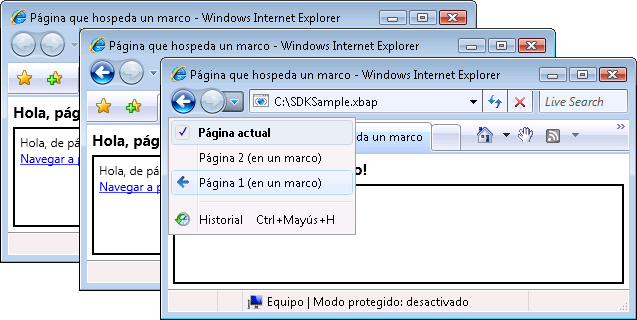  
  
 No basta con usar <xref:System.Windows.Controls.Frame> dentro del contenido de un <xref:System.Windows.Controls.Page>. También es común para hospedar un <xref:System.Windows.Controls.Frame> dentro del contenido de un <xref:System.Windows.Window>.  
  
 De forma predeterminada, <xref:System.Windows.Controls.Frame> sólo utiliza su propio diario en ausencia de otro diario. Si un <xref:System.Windows.Controls.Frame> forma parte del contenido que se hospeda dentro de cualquiera de un <xref:System.Windows.Navigation.NavigationWindow> o un [!INCLUDE[TLA2#tla_xbap](../../../../includes/tla2sharptla-xbap-md.md)], <xref:System.Windows.Controls.Frame> utiliza el diario que pertenece a la <xref:System.Windows.Navigation.NavigationWindow> o [!INCLUDE[TLA2#tla_xbap](../../../../includes/tla2sharptla-xbap-md.md)]. A veces, sin embargo, un <xref:System.Windows.Controls.Frame> posible que deba ser responsable de su propio diario. Una de las razones para ello es permitir la navegación de diario dentro de las páginas que están hospedadas por un <xref:System.Windows.Controls.Frame>. Esto se muestra en la ilustración siguiente.  
  
 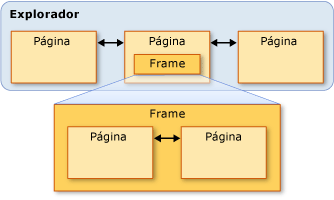  
  
 En este caso, puede configurar la <xref:System.Windows.Controls.Frame> usar su propio diario estableciendo la <xref:System.Windows.Controls.Frame.JournalOwnership%2A> propiedad de la <xref:System.Windows.Controls.Frame> a <xref:System.Windows.Navigation.JournalOwnership.OwnsJournal>. Esto se muestra en la marcación siguiente.  
  
 [!code-xaml[NavigationOverviewSnippets#FrameHostPageOwnJournalXAML1](../../../../samples/snippets/csharp/VS_Snippets_Wpf/NavigationOverviewSnippets/CSharp/FrameHostPageOwnJournal.xaml#framehostpageownjournalxaml1)]  
[!code-xaml[NavigationOverviewSnippets#FrameHostPageOwnJournalXAML2](../../../../samples/snippets/csharp/VS_Snippets_Wpf/NavigationOverviewSnippets/CSharp/FrameHostPageOwnJournal.xaml#framehostpageownjournalxaml2)]  
[!code-xaml[NavigationOverviewSnippets#FrameHostPageOwnJournalXAML3](../../../../samples/snippets/csharp/VS_Snippets_Wpf/NavigationOverviewSnippets/CSharp/FrameHostPageOwnJournal.xaml#framehostpageownjournalxaml3)]  
  
 La ilustración siguiente muestra el efecto de navegar dentro de un <xref:System.Windows.Controls.Frame> que usa su propio diario.  
  
 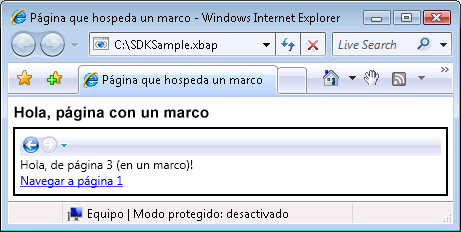  
  
 Observe que las entradas del diario se muestra en el panel de navegación [!INCLUDE[TLA2#tla_ui](../../../../includes/tla2sharptla-ui-md.md)] en el <xref:System.Windows.Controls.Frame>, en lugar de [!INCLUDE[TLA2#tla_ie](../../../../includes/tla2sharptla-ie-md.md)].  
  
> [!NOTE]
>  Si un <xref:System.Windows.Controls.Frame> forma parte del contenido que se hospeda en un <xref:System.Windows.Window>, <xref:System.Windows.Controls.Frame> utiliza su propio diario y, por lo tanto, muestra su propia navegación [!INCLUDE[TLA2#tla_ui](../../../../includes/tla2sharptla-ui-md.md)].  
  
 Si su experiencia de usuario requiere una <xref:System.Windows.Controls.Frame> para proporcionar su propio diario sin mostrar el panel de navegación [!INCLUDE[TLA2#tla_ui](../../../../includes/tla2sharptla-ui-md.md)], puede ocultar el panel de navegación [!INCLUDE[TLA2#tla_ui](../../../../includes/tla2sharptla-ui-md.md)] estableciendo la <xref:System.Windows.Controls.Frame.NavigationUIVisibility%2A> a <xref:System.Windows.Visibility.Hidden>. Esto se muestra en la marcación siguiente.  
  
 [!code-xaml[NavigationOverviewSnippets#FrameHostPageHidesUIXAML1](../../../../samples/snippets/csharp/VS_Snippets_Wpf/NavigationOverviewSnippets/CSharp/FrameHostPageOwnHiddenJournal.xaml#framehostpagehidesuixaml1)]  
[!code-xaml[NavigationOverviewSnippets#FrameHostPageHidesUIXAML2](../../../../samples/snippets/csharp/VS_Snippets_Wpf/NavigationOverviewSnippets/CSharp/FrameHostPageOwnHiddenJournal.xaml#framehostpagehidesuixaml2)]  
[!code-xaml[NavigationOverviewSnippets#FrameHostPageHidesUIXAML3](../../../../samples/snippets/csharp/VS_Snippets_Wpf/NavigationOverviewSnippets/CSharp/FrameHostPageOwnHiddenJournal.xaml#framehostpagehidesuixaml3)]  
  
   
## Hosts de navegación  
 <xref:System.Windows.Controls.Frame> y <xref:System.Windows.Navigation.NavigationWindow> son clases que se conocen como hosts de navegación. A *host de navegación* es una clase que puede navegar y mostrar el contenido. Para lograr esto, cada host de navegación utiliza su propio <xref:System.Windows.Navigation.NavigationService> y diario. La construcción de un host de navegación básica se muestra en la ilustración siguiente.  
  
   
  
 En esencia, esto permite <xref:System.Windows.Navigation.NavigationWindow> y <xref:System.Windows.Controls.Frame> admite navegación para proporcionar el mismo que un [!INCLUDE[TLA2#tla_xbap](../../../../includes/tla2sharptla-xbap-md.md)] proporciona cuando se hospeda en el explorador.  
  
 Además de usar <xref:System.Windows.Navigation.NavigationService> y un diario, hosts de navegación implementan los mismos miembros que <xref:System.Windows.Navigation.NavigationService> implementa. Esto se muestra en la ilustración siguiente.  
  
 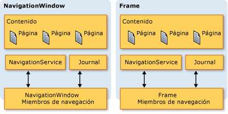  
  
 Esto le permite programar la compatibilidad con la navegación directamente con ellos. Puede considerar esta opción si tiene que proporcionar una navegación personalizada [!INCLUDE[TLA2#tla_ui](../../../../includes/tla2sharptla-ui-md.md)] para un <xref:System.Windows.Controls.Frame> que se hospeda en un <xref:System.Windows.Window>. Además, ambos tipos implementan miembros adicionales, relacionados con la navegación, incluidas las `BackStack` (<xref:System.Windows.Navigation.NavigationWindow.BackStack%2A?displayProperty=nameWithType>, <xref:System.Windows.Controls.Frame.BackStack%2A?displayProperty=nameWithType>) y `ForwardStack` (<xref:System.Windows.Navigation.NavigationWindow.ForwardStack%2A?displayProperty=nameWithType>, <xref:System.Windows.Controls.Frame.ForwardStack%2A?displayProperty=nameWithType>), que permite enumerar las entradas del diario en la parte posterior la pila y reenviar la pila, respectivamente.  
  
 Como se mencionó anteriormente, pueden haber varios diarios dentro de una aplicación. En la siguiente ilustración se muestra un ejemplo de cuándo ocurre esto.  
  
   
  
   
## Navegar a contenido distinto de páginas XAML  
 En este tema, <xref:System.Windows.Controls.Page> y módulo [!INCLUDE[TLA2#tla_xbap#plural](../../../../includes/tla2sharptla-xbapsharpplural-md.md)] se usaron para demostrar las distintas capacidades de navegación de [!INCLUDE[TLA2#tla_wpf](../../../../includes/tla2sharptla-wpf-md.md)]. Sin embargo, un <xref:System.Windows.Controls.Page> decir compilado en una aplicación no es el único tipo de contenido que se puede navegar y módulo [!INCLUDE[TLA2#tla_xbap#plural](../../../../includes/tla2sharptla-xbapsharpplural-md.md)] no son la única manera de identificar el contenido.  
  
 Como se muestra en esta sección, también puede desplazarse a perder [!INCLUDE[TLA2#tla_xaml](../../../../includes/tla2sharptla-xaml-md.md)] archivos [!INCLUDE[TLA2#tla_html](../../../../includes/tla2sharptla-html-md.md)] archivos y objetos.  
  
   
### Navegación por archivos XAML dinámicos  
 Un malas [!INCLUDE[TLA2#tla_xaml](../../../../includes/tla2sharptla-xaml-md.md)] archivo es un archivo con las siguientes características:  
  
-   Solo contiene [!INCLUDE[TLA2#tla_xaml](../../../../includes/tla2sharptla-xaml-md.md)] (es decir, sin código).  
  
-   Tiene una declaración de espacio de nombres adecuada.  
  
-   Tiene la extensión de nombre de archivo .xaml.  
  
 Por ejemplo, considere el siguiente contenido que se almacena como un malas [!INCLUDE[TLA2#tla_xaml](../../../../includes/tla2sharptla-xaml-md.md)] archivo Person.xaml.  
  
 [!code-xaml[NavigationOverviewSnippets#LooseXAML](../../../../samples/snippets/csharp/VS_Snippets_Wpf/NavigationOverviewSnippets/CSharp/Person.xaml#loosexaml)]  
  
 Al hacer doble clic en el archivo, el explorador se abre y se desplaza al contenido y lo muestra. Esto se muestra en la siguiente ilustración.  
  
 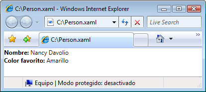  
  
 Puede mostrar un malas [!INCLUDE[TLA2#tla_xaml](../../../../includes/tla2sharptla-xaml-md.md)] archivo entre las opciones siguientes:  
  
-   Un sitio web en la máquina local, la intranet o Internet.  
  
-   Un [!INCLUDE[TLA#tla_unc](../../../../includes/tlasharptla-unc-md.md)] recurso compartido de archivos.  
  
-   El disco local.  
  
 Un malas [!INCLUDE[TLA2#tla_xaml](../../../../includes/tla2sharptla-xaml-md.md)] archivo puede agregarse a los favoritos del explorador, o ser la página principal del explorador.  
  
> [!NOTE]
>  Para obtener más información sobre cómo publicar e iniciar suelto [!INCLUDE[TLA2#tla_xaml](../../../../includes/tla2sharptla-xaml-md.md)] páginas, vea [implementar una aplicación WPF](../../../../docs/framework/wpf/app-development/deploying-a-wpf-application-wpf.md).  
  
 Una limitación con respecto a perder [!INCLUDE[TLA2#tla_xaml](../../../../includes/tla2sharptla-xaml-md.md)] es que solo puede hospedar contenido que es seguro ejecutar en confianza parcial. Por ejemplo, `Window` no puede ser el elemento raíz de un malas [!INCLUDE[TLA2#tla_xaml](../../../../includes/tla2sharptla-xaml-md.md)] archivo. Para obtener más información, vea [Seguridad de confianza parcial de WPF](../../../../docs/framework/wpf/wpf-partial-trust-security.md).  
  
   
### Navegación a archivos HTML mediante Frame  
 Como cabría esperar, también puede desplazarse a [!INCLUDE[TLA2#tla_html](../../../../includes/tla2sharptla-html-md.md)]. Basta con proporcionar un [!INCLUDE[TLA2#tla_uri](../../../../includes/tla2sharptla-uri-md.md)] que utiliza el esquema http. Por ejemplo, la siguiente [!INCLUDE[TLA2#tla_xaml](../../../../includes/tla2sharptla-xaml-md.md)] muestra un <xref:System.Windows.Controls.Frame> que navega a una [!INCLUDE[TLA2#tla_html](../../../../includes/tla2sharptla-html-md.md)] página.  
  
 [!code-xaml[NavigationOverviewSnippets#FrameHtmlNavMARKUP](../../../../samples/snippets/csharp/VS_Snippets_Wpf/NavigationOverviewSnippets/CSharp/FrameHTMLNavPage.xaml#framehtmlnavmarkup)]  
  
 Vaya a [!INCLUDE[TLA2#tla_html](../../../../includes/tla2sharptla-html-md.md)] requiere permisos especiales. Por ejemplo, no se puede navegar desde un [!INCLUDE[TLA2#tla_xbap](../../../../includes/tla2sharptla-xbap-md.md)] que se ejecuta en el recinto de seguridad de confianza parcial de zona de Internet. Para obtener más información, vea [Seguridad de confianza parcial de WPF](../../../../docs/framework/wpf/wpf-partial-trust-security.md).  
  
   
### Navegación a archivos HTML mediante el Control WebBrowser  
 El <xref:System.Windows.Controls.WebBrowser> controlar admite [!INCLUDE[TLA2#tla_html](../../../../includes/tla2sharptla-html-md.md)] interoperabilidad de código de hospedaje de documentos, navegación y secuencias de comandos o administrada. Para obtener información detallada sobre la <xref:System.Windows.Controls.WebBrowser> control, vea <xref:System.Windows.Controls.WebBrowser>.  
  
 Al igual que <xref:System.Windows.Controls.Frame>, navegación a [!INCLUDE[TLA2#tla_html](../../../../includes/tla2sharptla-html-md.md)] con <xref:System.Windows.Controls.WebBrowser> requiere permisos especiales. Por ejemplo, desde una aplicación de confianza parcial, puede navegar solo a [!INCLUDE[TLA2#tla_html](../../../../includes/tla2sharptla-html-md.md)] ubicado en el sitio de origen. Para obtener más información, vea [Seguridad de confianza parcial de WPF](../../../../docs/framework/wpf/wpf-partial-trust-security.md).  
  
   
### Navegación por objetos personalizados  
 Si tiene datos que se almacenan como objetos personalizados, una manera de mostrar los datos consiste en crear un <xref:System.Windows.Controls.Page> con contenido que está enlazado a esos objetos (vea [información general sobre el enlace de datos](../../../../docs/framework/wpf/data/data-binding-overview.md)). Si no necesita la sobrecarga de la creación de una página completa para mostrar los objetos, puede navegar directamente a ellos en su lugar.  
  
 Tenga en cuenta la `Person` clase que se implementa en el código siguiente.  
  
 [!code-csharp[NavigateToObjectSnippets#PersonClassCODE](../../../../samples/snippets/csharp/VS_Snippets_Wpf/NavigateToObjectSnippets/CSharp/Person.cs#personclasscode)]
 [!code-vb[NavigateToObjectSnippets#PersonClassCODE](../../../../samples/snippets/visualbasic/VS_Snippets_Wpf/NavigateToObjectSnippets/VisualBasic/Person.vb#personclasscode)]  
  
 Para navegar hasta él, se llama a la <xref:System.Windows.Navigation.NavigationWindow.Navigate%2A?displayProperty=nameWithType> método, como se muestra en el código siguiente.  
  
 [!code-xaml[NavigateToObjectSnippets#PageThatNavsToObject1](../../../../samples/snippets/csharp/VS_Snippets_Wpf/NavigateToObjectSnippets/CSharp/HomePage.xaml#pagethatnavstoobject1)]  
[!code-xaml[NavigateToObjectSnippets#PageThatNavsToObject2](../../../../samples/snippets/csharp/VS_Snippets_Wpf/NavigateToObjectSnippets/CSharp/HomePage.xaml#pagethatnavstoobject2)]  
[!code-xaml[NavigateToObjectSnippets#PageThatNavsToObject3](../../../../samples/snippets/csharp/VS_Snippets_Wpf/NavigateToObjectSnippets/CSharp/HomePage.xaml#pagethatnavstoobject3)]  
  
 [!code-csharp[NavigateToObjectSnippets#PageThatNavsToObjectCODEBEHIND](../../../../samples/snippets/csharp/VS_Snippets_Wpf/NavigateToObjectSnippets/CSharp/HomePage.xaml.cs#pagethatnavstoobjectcodebehind)]
 [!code-vb[NavigateToObjectSnippets#PageThatNavsToObjectCODEBEHIND](../../../../samples/snippets/visualbasic/VS_Snippets_Wpf/NavigateToObjectSnippets/VisualBasic/HomePage.xaml.vb#pagethatnavstoobjectcodebehind)]  
  
 En la siguiente ilustración se muestra el resultado.  
  
 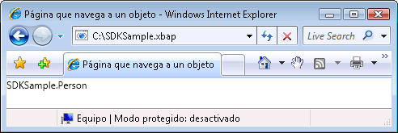  
  
 En esta ilustración, puede ver que no se muestra nada útil. De hecho, el valor que se muestra es el valor devuelto de la `ToString` método para el **persona** objeto; de forma predeterminada, este es el único valor que [!INCLUDE[TLA2#tla_wpf](../../../../includes/tla2sharptla-wpf-md.md)] puede usar para representar el objeto. Podría invalidar la `ToString` método para devolver información más significativa, aunque sigue ser solo un valor de cadena. Puede usar una técnica que aprovecha las ventajas de las capacidades de presentación de [!INCLUDE[TLA2#tla_wpf](../../../../includes/tla2sharptla-wpf-md.md)] consiste en usar una plantilla de datos. Puede implementar una plantilla de datos que [!INCLUDE[TLA2#tla_wpf](../../../../includes/tla2sharptla-wpf-md.md)] puede asociar a un objeto de un tipo determinado. El código siguiente muestra una plantilla de datos para el `Person` objeto.  
  
 [!code-xaml[NavigateToObjectSnippets#DataTemplateMARKUP](../../../../samples/snippets/csharp/VS_Snippets_Wpf/NavigateToObjectSnippets/CSharp/App.xaml#datatemplatemarkup)]  
  
 En este caso, la plantilla de datos está asociada con el `Person` tipo usando el `x:Type` extensión de marcado en el `DataType` atributo. La plantilla de datos, a continuación, enlaza `TextBlock` elementos (consulte <xref:System.Windows.Controls.TextBlock>) a las propiedades de la `Person` clase. La siguiente ilustración muestra el aspecto actualizado de la `Person` objeto.  
  
 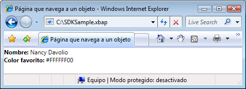  
  
 Una ventaja de esta técnica es la coherencia que obtiene al poder volver a usar la plantilla de datos para mostrar los objetos de forma coherente en cualquier parte de la aplicación.  
  
 Para obtener más información sobre plantillas de datos, vea [información general sobre plantillas de datos](../../../../docs/framework/wpf/data/data-templating-overview.md).  
  
   
## Seguridad  
 [!INCLUDE[TLA2#tla_wpf](../../../../includes/tla2sharptla-wpf-md.md)] permite la compatibilidad de navegación [!INCLUDE[TLA2#tla_xbap#plural](../../../../includes/tla2sharptla-xbapsharpplural-md.md)] navegar a través de Internet y permite a las aplicaciones para hospedar contenido de terceros. Para proteger las aplicaciones y los usuarios de un comportamiento malintencionado, [!INCLUDE[TLA2#tla_wpf](../../../../includes/tla2sharptla-wpf-md.md)] proporciona una variedad de características de seguridad que se describen en [seguridad](../../../../docs/framework/wpf/security-wpf.md) y [seguridad de confianza parcial de WPF](../../../../docs/framework/wpf/wpf-partial-trust-security.md).  
  
## Vea también  
 <xref:System.Windows.Application.SetCookie%2A>  
 <xref:System.Windows.Application.GetCookie%2A>  
 [Información general sobre la administración de aplicaciones](../../../../docs/framework/wpf/app-development/application-management-overview.md)  
 [Identificadores URI de paquete en WPF](../../../../docs/framework/wpf/app-development/pack-uris-in-wpf.md)  
 [Información general sobre la navegación estructurada](../../../../docs/framework/wpf/app-development/structured-navigation-overview.md)  
 [Información general sobre topologías de navegación](../../../../docs/framework/wpf/app-development/navigation-topologies-overview.md)  
 [Temas "Cómo..."](../../../../docs/framework/wpf/app-development/navigation-how-to-topics.md)  
 [Implementar una aplicación WPF](../../../../docs/framework/wpf/app-development/deploying-a-wpf-application-wpf.md)
