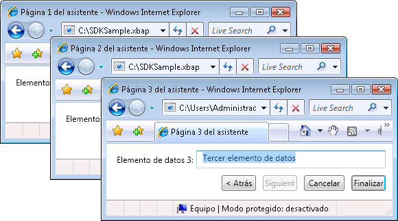
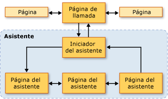
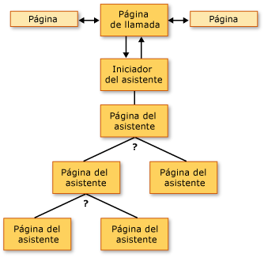
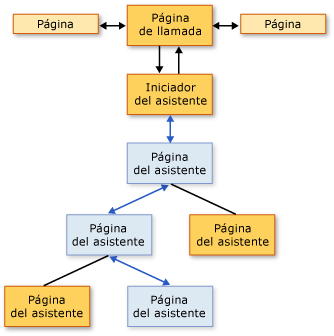
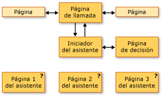
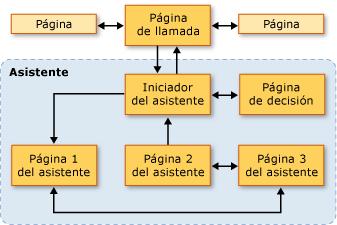

# Información general sobre topologías de navegación
Esta información general proporciona una introducción a las topologías de navegación en [!INCLUDE[TLA2#tla_wpf](../../../../includes/tla2sharptla-wpf-md.md)]. Posteriormente, se tratan tres topologías de navegación comunes y se incluyen ejemplos de estas.  
  
> [!NOTE]
>  Antes de leer este tema, debe estar familiarizado con el concepto de navegación estructurada de [!INCLUDE[TLA2#tla_wpf](../../../../includes/tla2sharptla-wpf-md.md)] mediante funciones de página. Para obtener más información acerca de estos temas, consulte [Structured Navigation Overview](../../../../docs/framework/wpf/app-development/structured-navigation-overview.md).  
  
 Este tema contiene las siguientes secciones:  
  
-   [Topologías de navegación](#Navigation_Topologies)  
  
-   [Topologías de navegación estructurada](#Structured_Navigation_Topologies)  
  
-   [Navegación mediante una topología lineal fija](#Navigation_over_a_Fixed_Linear_Topology)  
  
-   [Navegación dinámica mediante una topología jerárquica fija](#Dynamic_Navigation_over_a_Fixed_Hierarchical_Topology)  
  
-   [Navegación mediante una topología generada dinámicamente](#Navigation_over_a_Dynamically_Generated_Topology)  
  
   
## Topologías de navegación  
 En [!INCLUDE[TLA2#tla_wpf](../../../../includes/tla2sharptla-wpf-md.md)], navegación suele estar compuesta de páginas (<xref:System.Windows.Controls.Page>) con hipervínculos (<xref:System.Windows.Documents.Hyperlink>) que navegar a otras páginas cuando hace clic en. Las páginas que se navega se identifican por [!INCLUDE[TLA#tla_uri#plural](../../../../includes/tlasharptla-urisharpplural-md.md)] (consulte [Pack URI en WPF](../../../../docs/framework/wpf/app-development/pack-uris-in-wpf.md)). Considere el siguiente ejemplo simple que muestra las páginas, hipervínculos, y [!INCLUDE[TLA#tla_uri#plural](../../../../includes/tlasharptla-urisharpplural-md.md)]:  
  
 [!code-xaml[NavigationTopologiesOverviewSnippets#Page1](../../../../samples/snippets/csharp/VS_Snippets_Wpf/NavigationTopologiesOverviewSnippets/CS/Page1.xaml#page1)]  
  
 [!code-xaml[NavigationTopologiesOverviewSnippets#Page2](../../../../samples/snippets/csharp/VS_Snippets_Wpf/NavigationTopologiesOverviewSnippets/CS/Page2.xaml#page2)]  
  
 Estas páginas están organizadas en una *topología de navegación* cuya estructura viene determinado por cómo puede navegar entre las páginas. Esta topología de navegación concreta es adecuada en escenarios simples, aunque la navegación puede exigir topologías más complejas, algunas de las cuales solo pueden definirse cuando se ejecuta una aplicación.  
  
 Este tema abarca tres topologías de navegación comunes: *fija lineal*, *fija jerárquica*, y *generado dinámicamente*. Cada topología de navegación se muestra con un ejemplo que tiene un [!INCLUDE[TLA2#tla_ui](../../../../includes/tla2sharptla-ui-md.md)] como el que se muestra en la ilustración siguiente:  
  
   
  
   
## Topologías de navegación estructurada  
 Hay dos tipos generales de topologías de navegación:  
  
-   **Topología fija**: se define en tiempo de compilación y no cambia en tiempo de ejecución. Las topologías fijas son útiles para la navegación a través de una secuencia fija de páginas en un orden lineal o jerárquico.  
  
-   **Topología dinámica**: se define en tiempo de ejecución en función de la entrada que se recopila del usuario, la aplicación o el sistema. Las topologías dinámicas son útiles cuando las páginas pueden navegarse en secuencias diferentes.  
  
 Aunque es posible crear topologías de navegación mediante páginas, los ejemplos usan funciones de página porque proporcionan compatibilidad adicional que simplifica la compatibilidad para pasar y devolver los datos a través de las páginas de una topología.  
  
   
## Navegación mediante una topología lineal fija  
 Una topología lineal fija se parece a la estructura de un asistente que tiene una o más páginas por las que se navega en una secuencia fija. En la ilustración siguiente se muestra la estructura de alto nivel y el flujo de un asistente con una topología lineal fija.  
  
   
  
 Los comportamientos típicos de la navegación mediante una topología lineal fija son los siguientes:  
  
-   Navegación desde la página de llamada a una página de inicio que inicializa el asistente y dirige a la primera página del asistente. Una página de inicio (un [!INCLUDE[TLA2#tla_ui](../../../../includes/tla2sharptla-ui-md.md)]-menos <xref:System.Windows.Navigation.PageFunction%601>) no es necesaria, ya que una página que realiza la llamada puede llamar directamente a la primera página del asistente. Sin embargo, el uso de una página de inicio puede simplificar la inicialización del asistente, especialmente si es compleja.  
  
-   Los usuarios pueden navegar entre páginas mediante los botones Atrás y Adelante (o hipervínculos).  
  
-   Los usuarios pueden navegar entre páginas mediante el diario.  
  
-   Los usuarios pueden cancelar al asistente desde cualquier página del asistente presionando el botón Cancelar.  
  
-   Los usuarios pueden aceptar al asistente en la última página de este presionando el botón Finalizar.  
  
-   Si se cancela un asistente, este devuelve un resultado adecuado y no devuelve ningún dato.  
  
-   Si un usuario acepta un asistente, este devuelve un resultado adecuado y los datos que recopiló.  
  
-   Cuando se completa el asistente (se acepta o se cancela), las páginas que componen el asistente se quitan del diario. Esto mantiene cada instancia del asistente aislada, lo que evita posibles anomalías de los datos o el estado.  
  
   
## Navegación dinámica mediante una topología jerárquica fija  
 En algunas aplicaciones, las páginas permiten la navegación a dos o más páginas, como se muestra en la ilustración siguiente.  
  
   
  
 Esta estructura se conoce como topología jerárquica fija, y la secuencia en la que se recorre la jerarquía a menudo la determinan en tiempo de ejecución la aplicación o el usuario. En tiempo de ejecución, cada página de la jerarquía que permite la navegación a dos o más páginas recopila los datos necesarios para determinar a qué página se debe navegar. En la siguiente ilustración se muestra una de varias secuencias de navegación posibles según la ilustración anterior.  
  
   
  
 Aunque la secuencia en la que se navega por las páginas de una estructura jerárquica fija se determina en tiempo de ejecución, la experiencia del usuario es la misma que la de una topología lineal fija:  
  
-   Navegación desde la página de llamada a una página de inicio que inicializa el asistente y dirige a la primera página del asistente. Una página de inicio (un [!INCLUDE[TLA2#tla_ui](../../../../includes/tla2sharptla-ui-md.md)]-menos <xref:System.Windows.Navigation.PageFunction%601>) no es necesaria, ya que una página que realiza la llamada puede llamar directamente a la primera página del asistente. Sin embargo, el uso de una página de inicio puede simplificar la inicialización del asistente, especialmente si es compleja.  
  
-   Los usuarios pueden navegar entre páginas mediante los botones Atrás y Adelante (o hipervínculos).  
  
-   Los usuarios pueden navegar entre páginas mediante el diario.  
  
-   Los usuarios pueden cambiar la secuencia de exploración si navegan hacia atrás a través del diario.  
  
-   Los usuarios pueden cancelar al asistente desde cualquier página del asistente presionando el botón Cancelar.  
  
-   Los usuarios pueden aceptar al asistente en la última página de este presionando el botón Finalizar.  
  
-   Si se cancela un asistente, este devuelve un resultado adecuado y no devuelve ningún dato.  
  
-   Si un usuario acepta un asistente, este devuelve un resultado adecuado y los datos que recopiló.  
  
-   Cuando se completa el asistente (se acepta o se cancela), las páginas que componen el asistente se quitan del diario. Esto mantiene cada instancia del asistente aislada, lo que evita posibles anomalías de los datos o el estado.  
  
   
## Navegación mediante una topología generada dinámicamente  
 En algunas aplicaciones, la secuencia en la que se navega por dos o más páginas solo la puede determinar en tiempo de ejecución el usuario, la aplicación o los datos externos. En la ilustración siguiente se muestra un conjunto de páginas con una secuencia de navegación indeterminada.  
  
   
  
 En la ilustración siguiente se muestra una secuencia de navegación que eligió el usuario en tiempo de ejecución.  
  
   
  
 La secuencia de navegación se conoce como topología generada dinámicamente. Para el usuario, al igual que con las otras topologías de navegación, la experiencia del usuario es la misma que en las topologías anteriores:  
  
-   Navegación desde la página de llamada a una página de inicio que inicializa el asistente y dirige a la primera página del asistente. Una página de inicio (un [!INCLUDE[TLA2#tla_ui](../../../../includes/tla2sharptla-ui-md.md)]-menos <xref:System.Windows.Navigation.PageFunction%601>) no es necesaria, ya que una página que realiza la llamada puede llamar directamente a la primera página del asistente. Sin embargo, el uso de una página de inicio puede simplificar la inicialización del asistente, especialmente si es compleja.  
  
-   Los usuarios pueden navegar entre páginas mediante los botones Atrás y Adelante (o hipervínculos).  
  
-   Los usuarios pueden navegar entre páginas mediante el diario.  
  
-   Los usuarios pueden cancelar al asistente desde cualquier página del asistente presionando el botón Cancelar.  
  
-   Los usuarios pueden aceptar al asistente en la última página de este presionando el botón Finalizar.  
  
-   Si se cancela un asistente, este devuelve un resultado adecuado y no devuelve ningún dato.  
  
-   Si un usuario acepta un asistente, este devuelve un resultado adecuado y los datos que recopiló.  
  
-   Cuando se completa el asistente (se acepta o se cancela), las páginas que componen el asistente se quitan del diario. Esto mantiene cada instancia del asistente aislada, lo que evita posibles anomalías de los datos o el estado.  
  
## Vea también  
 <xref:System.Windows.Controls.Page>  
 <xref:System.Windows.Navigation.PageFunction%601>  
 <xref:System.Windows.Navigation.NavigationService>  
 [Información general sobre la navegación estructurada](../../../../docs/framework/wpf/app-development/structured-navigation-overview.md)
