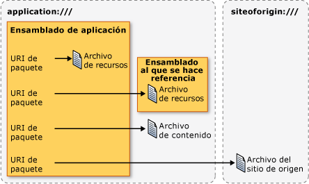

# <a name="pack-uris-in-wpf"></a><span data-ttu-id="6a5d1-102">Pack URI en WPF</span><span class="sxs-lookup"><span data-stu-id="6a5d1-102">Pack URIs in WPF</span></span>
<span data-ttu-id="6a5d1-103">En [!INCLUDE[TLA#tla_wpf](../../../../includes/tlasharptla-wpf-md.md)], [!INCLUDE[TLA#tla_uri#plural](../../../../includes/tlasharptla-urisharpplural-md.md)] se usan para identificar y cargar archivos de muchas maneras, incluido lo siguiente:</span><span class="sxs-lookup"><span data-stu-id="6a5d1-103">In [!INCLUDE[TLA#tla_wpf](../../../../includes/tlasharptla-wpf-md.md)], [!INCLUDE[TLA#tla_uri#plural](../../../../includes/tlasharptla-urisharpplural-md.md)] are used to identify and load files in many ways, including the following:</span></span>  
  
-   <span data-ttu-id="6a5d1-104">Especificar el [!INCLUDE[TLA#tla_ui](../../../../includes/tlasharptla-ui-md.md)] para mostrar cuando una aplicación inicia por primera vez.</span><span class="sxs-lookup"><span data-stu-id="6a5d1-104">Specifying the [!INCLUDE[TLA#tla_ui](../../../../includes/tlasharptla-ui-md.md)] to show when an application first starts.</span></span>  
  
-   <span data-ttu-id="6a5d1-105">Cargando imágenes.</span><span class="sxs-lookup"><span data-stu-id="6a5d1-105">Loading images.</span></span>  
  
-   <span data-ttu-id="6a5d1-106">Navegando a páginas.</span><span class="sxs-lookup"><span data-stu-id="6a5d1-106">Navigating to pages.</span></span>  
  
-   <span data-ttu-id="6a5d1-107">Cargando archivos de datos no ejecutables.</span><span class="sxs-lookup"><span data-stu-id="6a5d1-107">Loading non-executable data files.</span></span>  
  
 <span data-ttu-id="6a5d1-108">Además, [!INCLUDE[TLA2#tla_uri#plural](../../../../includes/tla2sharptla-urisharpplural-md.md)] puede usarse para identificar y cargar archivos desde una variedad de ubicaciones, incluidos los siguientes:</span><span class="sxs-lookup"><span data-stu-id="6a5d1-108">Furthermore, [!INCLUDE[TLA2#tla_uri#plural](../../../../includes/tla2sharptla-urisharpplural-md.md)] can be used to identify and load files from a variety of locations, including the following:</span></span>  
  
-   <span data-ttu-id="6a5d1-109">Ensamblado actual.</span><span class="sxs-lookup"><span data-stu-id="6a5d1-109">The current assembly.</span></span>  
  
-   <span data-ttu-id="6a5d1-110">El ensamblado al que se hace referencia.</span><span class="sxs-lookup"><span data-stu-id="6a5d1-110">A referenced assembly.</span></span>  
  
-   <span data-ttu-id="6a5d1-111">Una ubicación relativa a un ensamblado.</span><span class="sxs-lookup"><span data-stu-id="6a5d1-111">A location relative to an assembly.</span></span>  
  
-   <span data-ttu-id="6a5d1-112">El sitio de origen de la aplicación.</span><span class="sxs-lookup"><span data-stu-id="6a5d1-112">The application's site of origin.</span></span>  
  
 <span data-ttu-id="6a5d1-113">Para proporcionar un mecanismo coherente para identificar y cargar estos tipos de archivos de estas ubicaciones, [!INCLUDE[TLA2#tla_wpf](../../../../includes/tla2sharptla-wpf-md.md)] aprovecha la extensibilidad de la *esquema de pack URI*.</span><span class="sxs-lookup"><span data-stu-id="6a5d1-113">To provide a consistent mechanism for identifying and loading these types of files from these locations, [!INCLUDE[TLA2#tla_wpf](../../../../includes/tla2sharptla-wpf-md.md)] leverages the extensibility of the *pack URI scheme*.</span></span> <span data-ttu-id="6a5d1-114">Este tema proporciona información general sobre el esquema, se describe cómo construir pack [!INCLUDE[TLA2#tla_uri#plural](../../../../includes/tla2sharptla-urisharpplural-md.md)] para una variedad de escenarios, se describen absolute y relative [!INCLUDE[TLA2#tla_uri#plural](../../../../includes/tla2sharptla-urisharpplural-md.md)] y [!INCLUDE[TLA2#tla_uri](../../../../includes/tla2sharptla-uri-md.md)] resolución, antes de que se muestra cómo utilizar el módulo [!INCLUDE[TLA2#tla_uri#plural](../../../../includes/tla2sharptla-urisharpplural-md.md)] en ambos marcado y el código.</span><span class="sxs-lookup"><span data-stu-id="6a5d1-114">This topic provides an overview of the scheme, covers how to construct pack [!INCLUDE[TLA2#tla_uri#plural](../../../../includes/tla2sharptla-urisharpplural-md.md)] for a variety of scenarios, discusses absolute and relative [!INCLUDE[TLA2#tla_uri#plural](../../../../includes/tla2sharptla-urisharpplural-md.md)] and [!INCLUDE[TLA2#tla_uri](../../../../includes/tla2sharptla-uri-md.md)] resolution, before showing how to use pack [!INCLUDE[TLA2#tla_uri#plural](../../../../includes/tla2sharptla-urisharpplural-md.md)] from both markup and code.</span></span>  
  
  
<a name="The_Pack_URI_Scheme"></a>   
## <a name="the-pack-uri-scheme"></a><span data-ttu-id="6a5d1-115">Esquema de Pack URI</span><span class="sxs-lookup"><span data-stu-id="6a5d1-115">The Pack URI Scheme</span></span>  
 <span data-ttu-id="6a5d1-116">El módulo [!INCLUDE[TLA2#tla_uri](../../../../includes/tla2sharptla-uri-md.md)] esquema utilizado por el [Open Packaging Conventions](http://go.microsoft.com/fwlink/?LinkID=71255) especificación (OPC), que describe un modelo para organizar e identificar contenido.</span><span class="sxs-lookup"><span data-stu-id="6a5d1-116">The pack [!INCLUDE[TLA2#tla_uri](../../../../includes/tla2sharptla-uri-md.md)] scheme is used by the [Open Packaging Conventions](http://go.microsoft.com/fwlink/?LinkID=71255) (OPC) specification, which describes a model for organizing and identifying content.</span></span> <span data-ttu-id="6a5d1-117">Los elementos clave de este modelo son paquetes y las partes, donde un *paquete* es un contenedor lógico para uno o más lógica *elementos*.</span><span class="sxs-lookup"><span data-stu-id="6a5d1-117">The key elements of this model are packages and parts, where a *package* is a logical container for one or more logical *parts*.</span></span> <span data-ttu-id="6a5d1-118">La figura siguiente ilustra este concepto.</span><span class="sxs-lookup"><span data-stu-id="6a5d1-118">The following figure illustrates this concept.</span></span>  
  
 <span data-ttu-id="6a5d1-119"></span><span class="sxs-lookup"><span data-stu-id="6a5d1-119"></span></span>  
  
 <span data-ttu-id="6a5d1-120">Para identificar las partes, la especificación de OPC aprovecha la extensibilidad de RFC 2396 (identificadores uniformes de recursos (URI): sintaxis genérica) para definir el módulo [!INCLUDE[TLA2#tla_uri](../../../../includes/tla2sharptla-uri-md.md)] esquema.</span><span class="sxs-lookup"><span data-stu-id="6a5d1-120">To identify parts, the OPC specification leverages the extensibility of RFC 2396 (Uniform Resource Identifiers (URI): Generic Syntax) to define the pack [!INCLUDE[TLA2#tla_uri](../../../../includes/tla2sharptla-uri-md.md)] scheme.</span></span>  
  
 <span data-ttu-id="6a5d1-121">El esquema especificado por un [!INCLUDE[TLA2#tla_uri](../../../../includes/tla2sharptla-uri-md.md)] se define por su prefijo; http, ftp y file son ejemplos conocidos.</span><span class="sxs-lookup"><span data-stu-id="6a5d1-121">The scheme that is specified by a [!INCLUDE[TLA2#tla_uri](../../../../includes/tla2sharptla-uri-md.md)] is defined by its prefix; http, ftp, and file are well-known examples.</span></span> <span data-ttu-id="6a5d1-122">El módulo [!INCLUDE[TLA2#tla_uri](../../../../includes/tla2sharptla-uri-md.md)] esquema utiliza "pack" como su esquema y contiene dos componentes: autoridad y ruta de acceso.</span><span class="sxs-lookup"><span data-stu-id="6a5d1-122">The pack [!INCLUDE[TLA2#tla_uri](../../../../includes/tla2sharptla-uri-md.md)] scheme uses "pack" as its scheme, and contains two components: authority and path.</span></span> <span data-ttu-id="6a5d1-123">Éste es el formato de un módulo de [!INCLUDE[TLA2#tla_uri](../../../../includes/tla2sharptla-uri-md.md)].</span><span class="sxs-lookup"><span data-stu-id="6a5d1-123">The following is the format for a pack [!INCLUDE[TLA2#tla_uri](../../../../includes/tla2sharptla-uri-md.md)].</span></span>  
  
 <span data-ttu-id="6a5d1-124">Pack: / /*autoridad*/*ruta de acceso*</span><span class="sxs-lookup"><span data-stu-id="6a5d1-124">pack://*authority*/*path*</span></span>
  
 <span data-ttu-id="6a5d1-125">El *autoridad* especifica el tipo de paquete que contiene un elemento, mientras que la *ruta de acceso* especifica la ubicación de un elemento dentro de un paquete.</span><span class="sxs-lookup"><span data-stu-id="6a5d1-125">The *authority* specifies the type of package that a part is contained by, while the *path* specifies the location of a part within a package.</span></span>  
  
 <span data-ttu-id="6a5d1-126">Este concepto se muestra en la ilustración siguiente:</span><span class="sxs-lookup"><span data-stu-id="6a5d1-126">This concept is illustrated by the following figure:</span></span>  
  
 <span data-ttu-id="6a5d1-127"></span><span class="sxs-lookup"><span data-stu-id="6a5d1-127"></span></span>  
  
 <span data-ttu-id="6a5d1-128">Los paquetes y los elementos son análogos a las aplicaciones y los archivos, donde una aplicación (paquete) puede incluir uno o más archivos (elementos), como los siguientes:</span><span class="sxs-lookup"><span data-stu-id="6a5d1-128">Packages and parts are analogous to applications and files, where an application (package) can include one or more files (parts), including:</span></span>  
  
-   <span data-ttu-id="6a5d1-129">Archivos de recursos que se compilan en el ensamblado local.</span><span class="sxs-lookup"><span data-stu-id="6a5d1-129">Resource files that are compiled into the local assembly.</span></span>  
  
-   <span data-ttu-id="6a5d1-130">Archivos de recursos que se compilan en un ensamblado al que se hace referencia.</span><span class="sxs-lookup"><span data-stu-id="6a5d1-130">Resource files that are compiled into a referenced assembly.</span></span>  
  
-   <span data-ttu-id="6a5d1-131">Archivos de recursos que se compilan en un ensamblado que hace referencia.</span><span class="sxs-lookup"><span data-stu-id="6a5d1-131">Resource files that are compiled into a referencing assembly.</span></span>  
  
-   <span data-ttu-id="6a5d1-132">Archivos de contenido.</span><span class="sxs-lookup"><span data-stu-id="6a5d1-132">Content files.</span></span>  
  
-   <span data-ttu-id="6a5d1-133">Archivos de sitio de origen.</span><span class="sxs-lookup"><span data-stu-id="6a5d1-133">Site of origin files.</span></span>  
  
 <span data-ttu-id="6a5d1-134">Para obtener acceso a estos tipos de archivos, [!INCLUDE[TLA2#tla_wpf](../../../../includes/tla2sharptla-wpf-md.md)] admite dos autoridades: application: / / / y siteoforigin: / / /.</span><span class="sxs-lookup"><span data-stu-id="6a5d1-134">To access these types of files, [!INCLUDE[TLA2#tla_wpf](../../../../includes/tla2sharptla-wpf-md.md)] supports two authorities: application:/// and siteoforigin:///.</span></span> <span data-ttu-id="6a5d1-135">La autoridad application:/// identifica los archivos de datos de aplicación que se conocen en tiempo de compilación, incluidos los archivos de recursos y de contenido.</span><span class="sxs-lookup"><span data-stu-id="6a5d1-135">The application:/// authority identifies application data files that are known at compile time, including resource and content files.</span></span> <span data-ttu-id="6a5d1-136">La autoridad siteoforigin:/// identifica los archivos de sitio de origen.</span><span class="sxs-lookup"><span data-stu-id="6a5d1-136">The siteoforigin:/// authority identifies site of origin files.</span></span> <span data-ttu-id="6a5d1-137">El ámbito de cada autoridad se muestra en la figura siguiente.</span><span class="sxs-lookup"><span data-stu-id="6a5d1-137">The scope of each authority is shown in the following figure.</span></span>  
  
 <span data-ttu-id="6a5d1-138"></span><span class="sxs-lookup"><span data-stu-id="6a5d1-138"></span></span>  
  
> [!NOTE]
>  <span data-ttu-id="6a5d1-139">El componente de autoridad de un módulo de [!INCLUDE[TLA2#tla_uri](../../../../includes/tla2sharptla-uri-md.md)] está incrustada [!INCLUDE[TLA2#tla_uri](../../../../includes/tla2sharptla-uri-md.md)] que apunta a un paquete y debe ajustarse a RFC 2396.</span><span class="sxs-lookup"><span data-stu-id="6a5d1-139">The authority component of a pack [!INCLUDE[TLA2#tla_uri](../../../../includes/tla2sharptla-uri-md.md)] is an embedded [!INCLUDE[TLA2#tla_uri](../../../../includes/tla2sharptla-uri-md.md)] that points to a package and must conform to RFC 2396.</span></span> <span data-ttu-id="6a5d1-140">Además, el carácter "/" se debe reemplazar por el carácter ",", y los caracteres reservados "%" y "?" deben incluirse en secuencias de escape.</span><span class="sxs-lookup"><span data-stu-id="6a5d1-140">Additionally, the "/" character must be replaced with the "," character, and reserved characters such as "%" and "?" must be escaped.</span></span> <span data-ttu-id="6a5d1-141">Consulte la especificación de OPC para detalles.</span><span class="sxs-lookup"><span data-stu-id="6a5d1-141">See the OPC for details.</span></span>  
  
 <span data-ttu-id="6a5d1-142">Las siguientes secciones explican cómo construir pack [!INCLUDE[TLA2#tla_uri#plural](../../../../includes/tla2sharptla-urisharpplural-md.md)] utilizando estas dos autoridades junto con las rutas apropiadas para la identificación de recurso, el contenido y el sitio de los archivos de origen.</span><span class="sxs-lookup"><span data-stu-id="6a5d1-142">The following sections explain how to construct pack [!INCLUDE[TLA2#tla_uri#plural](../../../../includes/tla2sharptla-urisharpplural-md.md)] using these two authorities in conjunction with the appropriate paths for identifying resource, content, and site of origin files.</span></span>  
  
<a name="Resource_File_Pack_URIs___Local_Assembly"></a>   
## <a name="resource-file-pack-uris"></a><span data-ttu-id="6a5d1-143">Pack URI de archivos de recursos</span><span class="sxs-lookup"><span data-stu-id="6a5d1-143">Resource File Pack URIs</span></span>  
 <span data-ttu-id="6a5d1-144">Archivos de recursos se configuran como [!INCLUDE[TLA2#tla_msbuild](../../../../includes/tla2sharptla-msbuild-md.md)] `Resource` los elementos y se compilan en ensamblados.</span><span class="sxs-lookup"><span data-stu-id="6a5d1-144">Resource files are configured as [!INCLUDE[TLA2#tla_msbuild](../../../../includes/tla2sharptla-msbuild-md.md)]`Resource` items and are compiled into assemblies.</span></span> [!INCLUDE[TLA2#tla_wpf](../../../../includes/tla2sharptla-wpf-md.md)]<span data-ttu-id="6a5d1-145">admite la construcción del módulo de [!INCLUDE[TLA2#tla_uri#plural](../../../../includes/tla2sharptla-urisharpplural-md.md)] que puede usarse para identificar los archivos de recursos que se compilan en el ensamblado local o compila en un ensamblado que se hace referencia desde el ensamblado local.</span><span class="sxs-lookup"><span data-stu-id="6a5d1-145"> supports the construction of pack [!INCLUDE[TLA2#tla_uri#plural](../../../../includes/tla2sharptla-urisharpplural-md.md)] that can be used to identify resource files that are either compiled into the local assembly or compiled into an assembly that is referenced from the local assembly.</span></span>  
  
<a name="Local_Assembly_Resource_File"></a>   
### <a name="local-assembly-resource-file"></a><span data-ttu-id="6a5d1-146">Archivo de recursos del ensamblado local</span><span class="sxs-lookup"><span data-stu-id="6a5d1-146">Local Assembly Resource File</span></span>  
 <span data-ttu-id="6a5d1-147">El módulo de [!INCLUDE[TLA2#tla_uri](../../../../includes/tla2sharptla-uri-md.md)] para un recurso de archivo que se compila en el ensamblado local utiliza la siguiente autoridad y ruta de acceso:</span><span class="sxs-lookup"><span data-stu-id="6a5d1-147">The pack [!INCLUDE[TLA2#tla_uri](../../../../includes/tla2sharptla-uri-md.md)] for a resource file that is compiled into the local assembly uses the following authority and path:</span></span>  
  
-   <span data-ttu-id="6a5d1-148">**Autoridad**: application:///.</span><span class="sxs-lookup"><span data-stu-id="6a5d1-148">**Authority**: application:///.</span></span>  
  
-   <span data-ttu-id="6a5d1-149">**Ruta de acceso**: nombre del archivo de recursos, incluida su ruta de acceso relativa a la carpeta raíz del proyecto de ensamblado local.</span><span class="sxs-lookup"><span data-stu-id="6a5d1-149">**Path**: The name of the resource file, including its path, relative to the local assembly project folder root.</span></span>  
  
 <span data-ttu-id="6a5d1-150">En el ejemplo siguiente se muestra el módulo [!INCLUDE[TLA2#tla_uri](../../../../includes/tla2sharptla-uri-md.md)] para un [!INCLUDE[TLA2#tla_xaml](../../../../includes/tla2sharptla-xaml-md.md)] archivo de recursos que se encuentra en la raíz de la carpeta del proyecto de ensamblado local.</span><span class="sxs-lookup"><span data-stu-id="6a5d1-150">The following example shows the pack [!INCLUDE[TLA2#tla_uri](../../../../includes/tla2sharptla-uri-md.md)] for a [!INCLUDE[TLA2#tla_xaml](../../../../includes/tla2sharptla-xaml-md.md)] resource file that is located in the root of the local assembly's project folder.</span></span>  
  
 `pack://application:,,,/ResourceFile.xaml`  
  
 <span data-ttu-id="6a5d1-151">En el ejemplo siguiente se muestra el módulo [!INCLUDE[TLA2#tla_uri](../../../../includes/tla2sharptla-uri-md.md)] para un [!INCLUDE[TLA2#tla_xaml](../../../../includes/tla2sharptla-xaml-md.md)] archivo de recursos que se encuentra en una subcarpeta de la carpeta del proyecto de ensamblado local.</span><span class="sxs-lookup"><span data-stu-id="6a5d1-151">The following example shows the pack [!INCLUDE[TLA2#tla_uri](../../../../includes/tla2sharptla-uri-md.md)] for a [!INCLUDE[TLA2#tla_xaml](../../../../includes/tla2sharptla-xaml-md.md)] resource file that is located in a subfolder of the local assembly's project folder.</span></span>  
  
 `pack://application:,,,/Subfolder/ResourceFile.xaml`  
  
<a name="Resource_File_Pack_URIs___Referenced_Assembly"></a>   
### <a name="referenced-assembly-resource-file"></a><span data-ttu-id="6a5d1-152">Archivo de recursos del ensamblado al que se hace referencia</span><span class="sxs-lookup"><span data-stu-id="6a5d1-152">Referenced Assembly Resource File</span></span>  
 <span data-ttu-id="6a5d1-153">El módulo de [!INCLUDE[TLA2#tla_uri](../../../../includes/tla2sharptla-uri-md.md)] para un recurso de archivo que se compila en un ensamblado que se hace referencia utiliza la siguiente autoridad y ruta de acceso:</span><span class="sxs-lookup"><span data-stu-id="6a5d1-153">The pack [!INCLUDE[TLA2#tla_uri](../../../../includes/tla2sharptla-uri-md.md)] for a resource file that is compiled into a referenced assembly uses the following authority and path:</span></span>  
  
-   <span data-ttu-id="6a5d1-154">**Autoridad**: application:///.</span><span class="sxs-lookup"><span data-stu-id="6a5d1-154">**Authority**: application:///.</span></span>  
  
-   <span data-ttu-id="6a5d1-155">**Ruta de acceso**: nombre de un archivo de recursos que se compila en un ensamblado al que se hace referencia.</span><span class="sxs-lookup"><span data-stu-id="6a5d1-155">**Path**: The name of a resource file that is compiled into a referenced assembly.</span></span> <span data-ttu-id="6a5d1-156">La ruta de acceso debe tener el formato siguiente:</span><span class="sxs-lookup"><span data-stu-id="6a5d1-156">The path must conform to the following format:</span></span>  
  
     <span data-ttu-id="6a5d1-157">*NombreCortoDeEnsamblado*{*; Versión*] {*; PublicKey*]; component /*ruta de acceso*</span><span class="sxs-lookup"><span data-stu-id="6a5d1-157">*AssemblyShortName*{*;Version*]{*;PublicKey*];component/*Path*</span></span>  
  
    -   <span data-ttu-id="6a5d1-158">**AssemblyShortName**: nombre corto del ensamblado al que se hace referencia.</span><span class="sxs-lookup"><span data-stu-id="6a5d1-158">**AssemblyShortName**: the short name for the referenced assembly.</span></span>  
  
    -   <span data-ttu-id="6a5d1-159">**;Version** [opcional]: versión del ensamblado al que se hace referencia y que contiene el archivo de recursos.</span><span class="sxs-lookup"><span data-stu-id="6a5d1-159">**;Version** [optional]: the version of the referenced assembly that contains the resource file.</span></span> <span data-ttu-id="6a5d1-160">Se usa cuando hay cargados dos o más ensamblados a los que se hace referencia con el mismo nombre corto.</span><span class="sxs-lookup"><span data-stu-id="6a5d1-160">This is used when two or more referenced assemblies with the same short name are loaded.</span></span>  
  
    -   <span data-ttu-id="6a5d1-161">**;PublicKey** [opcional]: clave pública que se usó para firmar el ensamblado al que se hace referencia.</span><span class="sxs-lookup"><span data-stu-id="6a5d1-161">**;PublicKey** [optional]: the public key that was used to sign the referenced assembly.</span></span> <span data-ttu-id="6a5d1-162">Se usa cuando hay cargados dos o más ensamblados a los que se hace referencia con el mismo nombre corto.</span><span class="sxs-lookup"><span data-stu-id="6a5d1-162">This is used when two or more referenced assemblies with the same short name are loaded.</span></span>  
  
    -   <span data-ttu-id="6a5d1-163">**;component**: especifica que la referencia al ensamblado se hace desde el ensamblado local.</span><span class="sxs-lookup"><span data-stu-id="6a5d1-163">**;component**: specifies that the assembly being referred to is referenced from the local assembly.</span></span>  
  
    -   <span data-ttu-id="6a5d1-164">**/Path**: nombre del archivo de recursos, incluida su ruta de acceso relativa a la raíz de la carpeta del proyecto del ensamblado al que se hace referencia.</span><span class="sxs-lookup"><span data-stu-id="6a5d1-164">**/Path**: the name of the resource file, including its path, relative to the root of the referenced assembly's project folder.</span></span>  
  
 <span data-ttu-id="6a5d1-165">En el ejemplo siguiente se muestra el módulo [!INCLUDE[TLA2#tla_uri](../../../../includes/tla2sharptla-uri-md.md)] para un [!INCLUDE[TLA2#tla_xaml](../../../../includes/tla2sharptla-xaml-md.md)] archivo de recursos que se encuentra en la raíz de la carpeta del proyecto del ensamblado que se hace referencia.</span><span class="sxs-lookup"><span data-stu-id="6a5d1-165">The following example shows the pack [!INCLUDE[TLA2#tla_uri](../../../../includes/tla2sharptla-uri-md.md)] for a [!INCLUDE[TLA2#tla_xaml](../../../../includes/tla2sharptla-xaml-md.md)] resource file that is located in the root of the referenced assembly's project folder.</span></span>  
  
 `pack://application:,,,/ReferencedAssembly;component/ResourceFile.xaml`  
  
 <span data-ttu-id="6a5d1-166">En el ejemplo siguiente se muestra el módulo [!INCLUDE[TLA2#tla_uri](../../../../includes/tla2sharptla-uri-md.md)] para un [!INCLUDE[TLA2#tla_xaml](../../../../includes/tla2sharptla-xaml-md.md)] archivo de recursos que se encuentra en una subcarpeta de la carpeta del proyecto del ensamblado que se hace referencia.</span><span class="sxs-lookup"><span data-stu-id="6a5d1-166">The following example shows the pack [!INCLUDE[TLA2#tla_uri](../../../../includes/tla2sharptla-uri-md.md)] for a [!INCLUDE[TLA2#tla_xaml](../../../../includes/tla2sharptla-xaml-md.md)] resource file that is located in a subfolder of the referenced assembly's project folder.</span></span>  
  
 `pack://application:,,,/ReferencedAssembly;component/Subfolder/ResourceFile.xaml`  
  
 <span data-ttu-id="6a5d1-167">En el ejemplo siguiente se muestra el módulo [!INCLUDE[TLA2#tla_uri](../../../../includes/tla2sharptla-uri-md.md)] para un [!INCLUDE[TLA2#tla_xaml](../../../../includes/tla2sharptla-xaml-md.md)] archivo de recursos que se encuentra en la carpeta raíz de la carpeta del proyecto de un ensamblado que se hace referencia, específico de la versión.</span><span class="sxs-lookup"><span data-stu-id="6a5d1-167">The following example shows the pack [!INCLUDE[TLA2#tla_uri](../../../../includes/tla2sharptla-uri-md.md)] for a [!INCLUDE[TLA2#tla_xaml](../../../../includes/tla2sharptla-xaml-md.md)] resource file that is located in the root folder of a referenced, version-specific assembly's project folder.</span></span>  
  
 `pack://application:,,,/ReferencedAssembly;v1.0.0.1;component/ResourceFile.xaml`  
  
 <span data-ttu-id="6a5d1-168">Tenga en cuenta que el módulo [!INCLUDE[TLA2#tla_uri](../../../../includes/tla2sharptla-uri-md.md)] sintaxis para archivos de recursos de ensamblado que se hace referencia se puede usar únicamente con la aplicación: / / / entidad.</span><span class="sxs-lookup"><span data-stu-id="6a5d1-168">Note that the pack [!INCLUDE[TLA2#tla_uri](../../../../includes/tla2sharptla-uri-md.md)] syntax for referenced assembly resource files can be used only with the application:/// authority.</span></span> <span data-ttu-id="6a5d1-169">Por ejemplo, los siguientes no se admiten en [!INCLUDE[TLA2#tla_wpf](../../../../includes/tla2sharptla-wpf-md.md)].</span><span class="sxs-lookup"><span data-stu-id="6a5d1-169">For example, the following is not supported in [!INCLUDE[TLA2#tla_wpf](../../../../includes/tla2sharptla-wpf-md.md)].</span></span>  
  
 `pack://siteoforigin:,,,/SomeAssembly;component/ResourceFile.xaml`  
  
<a name="Content_File_Pack_URIs"></a>   
## <a name="content-file-pack-uris"></a><span data-ttu-id="6a5d1-170">Pack URI de archivos de contenido</span><span class="sxs-lookup"><span data-stu-id="6a5d1-170">Content File Pack URIs</span></span>  
 <span data-ttu-id="6a5d1-171">El módulo [!INCLUDE[TLA2#tla_uri](../../../../includes/tla2sharptla-uri-md.md)] de un archivo de contenido utiliza la siguiente autoridad y ruta de acceso:</span><span class="sxs-lookup"><span data-stu-id="6a5d1-171">The pack [!INCLUDE[TLA2#tla_uri](../../../../includes/tla2sharptla-uri-md.md)] for a content file uses the following authority and path:</span></span>  
  
-   <span data-ttu-id="6a5d1-172">**Autoridad**: application:///.</span><span class="sxs-lookup"><span data-stu-id="6a5d1-172">**Authority**: application:///.</span></span>  
  
-   <span data-ttu-id="6a5d1-173">**Ruta de acceso**: nombre del archivo de contenido, incluida su ruta de acceso relativa a la ubicación del sistema de archivos del ensamblado ejecutable principal de la aplicación.</span><span class="sxs-lookup"><span data-stu-id="6a5d1-173">**Path**: The name of the content file, including its path relative to the file system location of the application's main executable assembly.</span></span>  
  
 <span data-ttu-id="6a5d1-174">En el ejemplo siguiente se muestra el módulo [!INCLUDE[TLA2#tla_uri](../../../../includes/tla2sharptla-uri-md.md)] para un [!INCLUDE[TLA2#tla_xaml](../../../../includes/tla2sharptla-xaml-md.md)] archivo de contenido, ubicado en la misma carpeta que el ensamblado ejecutable.</span><span class="sxs-lookup"><span data-stu-id="6a5d1-174">The following example shows the pack [!INCLUDE[TLA2#tla_uri](../../../../includes/tla2sharptla-uri-md.md)] for a [!INCLUDE[TLA2#tla_xaml](../../../../includes/tla2sharptla-xaml-md.md)] content file, located in the same folder as the executable assembly.</span></span>  
  
 `pack://application:,,,/ContentFile.xaml`  
  
 <span data-ttu-id="6a5d1-175">En el ejemplo siguiente se muestra el módulo [!INCLUDE[TLA2#tla_uri](../../../../includes/tla2sharptla-uri-md.md)] para un [!INCLUDE[TLA2#tla_xaml](../../../../includes/tla2sharptla-xaml-md.md)] archivo de contenido, ubicado en una subcarpeta que esté en relación con el ensamblado ejecutable de la aplicación.</span><span class="sxs-lookup"><span data-stu-id="6a5d1-175">The following example shows the pack [!INCLUDE[TLA2#tla_uri](../../../../includes/tla2sharptla-uri-md.md)] for a [!INCLUDE[TLA2#tla_xaml](../../../../includes/tla2sharptla-xaml-md.md)] content file, located in a subfolder that is relative to the application's executable assembly.</span></span>  
  
 `pack://application:,,,/Subfolder/ContentFile.xaml`  
  
> [!NOTE]
>  <span data-ttu-id="6a5d1-176">No se puede navegar a los archivos de contenido [!INCLUDE[TLA2#tla_html](../../../../includes/tla2sharptla-html-md.md)].</span><span class="sxs-lookup"><span data-stu-id="6a5d1-176">[!INCLUDE[TLA2#tla_html](../../../../includes/tla2sharptla-html-md.md)] content files cannot be navigated to.</span></span> <span data-ttu-id="6a5d1-177">El [!INCLUDE[TLA2#tla_uri](../../../../includes/tla2sharptla-uri-md.md)] esquema solo admite la navegación a [!INCLUDE[TLA2#tla_html](../../../../includes/tla2sharptla-html-md.md)] archivos que se encuentran en el sitio de origen.</span><span class="sxs-lookup"><span data-stu-id="6a5d1-177">The [!INCLUDE[TLA2#tla_uri](../../../../includes/tla2sharptla-uri-md.md)] scheme only supports navigation to [!INCLUDE[TLA2#tla_html](../../../../includes/tla2sharptla-html-md.md)] files that are located at the site of origin.</span></span>  
  
<a name="The_siteoforigin_____Authority"></a>   
## <a name="site-of-origin-pack-uris"></a><span data-ttu-id="6a5d1-178">Pack URI de sitio de origen</span><span class="sxs-lookup"><span data-stu-id="6a5d1-178">Site of Origin Pack URIs</span></span>  
 <span data-ttu-id="6a5d1-179">El módulo de [!INCLUDE[TLA2#tla_uri](../../../../includes/tla2sharptla-uri-md.md)] para un sitio de origen archivo utiliza la siguiente autoridad y ruta de acceso:</span><span class="sxs-lookup"><span data-stu-id="6a5d1-179">The pack [!INCLUDE[TLA2#tla_uri](../../../../includes/tla2sharptla-uri-md.md)] for a site of origin file uses the following authority and path:</span></span>  
  
-   <span data-ttu-id="6a5d1-180">**Autoridad**: siteoforigin:///.</span><span class="sxs-lookup"><span data-stu-id="6a5d1-180">**Authority**: siteoforigin:///.</span></span>  
  
-   <span data-ttu-id="6a5d1-181">**Ruta de acceso**: nombre del archivo de sitio de origen, incluida su ruta de acceso relativa a la ubicación desde donde se inició el ensamblado ejecutable.</span><span class="sxs-lookup"><span data-stu-id="6a5d1-181">**Path**: The name of the site of origin file, including its path relative to the location from which the executable assembly was launched.</span></span>  
  
 <span data-ttu-id="6a5d1-182">En el ejemplo siguiente se muestra el módulo [!INCLUDE[TLA2#tla_uri](../../../../includes/tla2sharptla-uri-md.md)] para un [!INCLUDE[TLA2#tla_xaml](../../../../includes/tla2sharptla-xaml-md.md)] sitio del archivo de origen, almacenado en la ubicación desde la que se inicia el ensamblado ejecutable.</span><span class="sxs-lookup"><span data-stu-id="6a5d1-182">The following example shows the pack [!INCLUDE[TLA2#tla_uri](../../../../includes/tla2sharptla-uri-md.md)] for a [!INCLUDE[TLA2#tla_xaml](../../../../includes/tla2sharptla-xaml-md.md)] site of origin file, stored in the location from which the executable assembly is launched.</span></span>  
  
 `pack://siteoforigin:,,,/SiteOfOriginFile.xaml`  
  
 <span data-ttu-id="6a5d1-183">En el ejemplo siguiente se muestra el módulo [!INCLUDE[TLA2#tla_uri](../../../../includes/tla2sharptla-uri-md.md)] para un [!INCLUDE[TLA2#tla_xaml](../../../../includes/tla2sharptla-xaml-md.md)] sitio del archivo de origen, almacenado en la subcarpeta que es relativa a la ubicación desde la que se inicia el ensamblado ejecutable de la aplicación.</span><span class="sxs-lookup"><span data-stu-id="6a5d1-183">The following example shows the pack [!INCLUDE[TLA2#tla_uri](../../../../includes/tla2sharptla-uri-md.md)] for a [!INCLUDE[TLA2#tla_xaml](../../../../includes/tla2sharptla-xaml-md.md)] site of origin file, stored in subfolder that is relative to the location from which the application's executable assembly is launched.</span></span>  
  
 `pack://siteoforigin:,,,/Subfolder/SiteOfOriginFile.xaml`  
  
<a name="Page_Files"></a>   
## <a name="page-files"></a><span data-ttu-id="6a5d1-184">Archivos de paginación</span><span class="sxs-lookup"><span data-stu-id="6a5d1-184">Page Files</span></span>  
 [!INCLUDE[TLA2#tla_xaml](../../../../includes/tla2sharptla-xaml-md.md)]<span data-ttu-id="6a5d1-185">archivos que están configurados como [!INCLUDE[TLA2#tla_msbuild](../../../../includes/tla2sharptla-msbuild-md.md)] `Page` elementos se compilan en ensamblados de la misma manera como archivos de recursos.</span><span class="sxs-lookup"><span data-stu-id="6a5d1-185"> files that are configured as [!INCLUDE[TLA2#tla_msbuild](../../../../includes/tla2sharptla-msbuild-md.md)]`Page` items are compiled into assemblies in the same way as resource files.</span></span> <span data-ttu-id="6a5d1-186">Por lo tanto, [!INCLUDE[TLA2#tla_msbuild](../../../../includes/tla2sharptla-msbuild-md.md)] `Page` elementos pueden identificarse mediante el uso de módulo [!INCLUDE[TLA2#tla_uri#plural](../../../../includes/tla2sharptla-urisharpplural-md.md)] para archivos de recursos.</span><span class="sxs-lookup"><span data-stu-id="6a5d1-186">Consequently, [!INCLUDE[TLA2#tla_msbuild](../../../../includes/tla2sharptla-msbuild-md.md)]`Page` items can be identified using pack [!INCLUDE[TLA2#tla_uri#plural](../../../../includes/tla2sharptla-urisharpplural-md.md)] for resource files.</span></span>  
  
 <span data-ttu-id="6a5d1-187">Los tipos de [!INCLUDE[TLA2#tla_xaml](../../../../includes/tla2sharptla-xaml-md.md)] archivos que normalmente están configurados como [!INCLUDE[TLA2#tla_msbuild](../../../../includes/tla2sharptla-msbuild-md.md)] `Page` elementos tienen uno de los siguientes como su elemento raíz:</span><span class="sxs-lookup"><span data-stu-id="6a5d1-187">The types of [!INCLUDE[TLA2#tla_xaml](../../../../includes/tla2sharptla-xaml-md.md)] files that are commonly configured as [!INCLUDE[TLA2#tla_msbuild](../../../../includes/tla2sharptla-msbuild-md.md)]`Page` items have one of the following as their root element:</span></span>  
  
-   <xref:System.Windows.Window?displayProperty=nameWithType>  
  
-   <xref:System.Windows.Controls.Page?displayProperty=nameWithType>  
  
-   <xref:System.Windows.Navigation.PageFunction%601?displayProperty=nameWithType>  
  
-   <xref:System.Windows.ResourceDictionary?displayProperty=nameWithType>  
  
-   <xref:System.Windows.Documents.FlowDocument?displayProperty=nameWithType>  
  
-   <xref:System.Windows.Controls.UserControl?displayProperty=nameWithType>  
  
<a name="Absolute_vs_Relative_Pack_URIs"></a>   
## <a name="absolute-vs-relative-pack-uris"></a><span data-ttu-id="6a5d1-188">Comparación entre Pack URI absolutos y relativos</span><span class="sxs-lookup"><span data-stu-id="6a5d1-188">Absolute vs. Relative Pack URIs</span></span>  
 <span data-ttu-id="6a5d1-189">Un módulo completo [!INCLUDE[TLA2#tla_uri](../../../../includes/tla2sharptla-uri-md.md)] incluye el esquema, la autoridad y la ruta de acceso, y se considera un módulo absoluto [!INCLUDE[TLA2#tla_uri](../../../../includes/tla2sharptla-uri-md.md)].</span><span class="sxs-lookup"><span data-stu-id="6a5d1-189">A fully qualified pack [!INCLUDE[TLA2#tla_uri](../../../../includes/tla2sharptla-uri-md.md)] includes the scheme, the authority, and the path, and it is considered an absolute pack [!INCLUDE[TLA2#tla_uri](../../../../includes/tla2sharptla-uri-md.md)].</span></span> <span data-ttu-id="6a5d1-190">Como simplificación para los desarrolladores, [!INCLUDE[TLA2#tla_xaml](../../../../includes/tla2sharptla-xaml-md.md)] elementos normalmente le permiten establecer los atributos adecuados con un módulo relativo [!INCLUDE[TLA2#tla_uri](../../../../includes/tla2sharptla-uri-md.md)], que incluye solo la ruta de acceso.</span><span class="sxs-lookup"><span data-stu-id="6a5d1-190">As a simplification for developers, [!INCLUDE[TLA2#tla_xaml](../../../../includes/tla2sharptla-xaml-md.md)] elements typically allow you to set appropriate attributes with a relative pack [!INCLUDE[TLA2#tla_uri](../../../../includes/tla2sharptla-uri-md.md)], which includes only the path.</span></span>  
  
 <span data-ttu-id="6a5d1-191">Por ejemplo, considere el siguiente pack absoluto [!INCLUDE[TLA2#tla_uri](../../../../includes/tla2sharptla-uri-md.md)] un archivo de recursos en el ensamblado local.</span><span class="sxs-lookup"><span data-stu-id="6a5d1-191">For example, consider the following absolute pack [!INCLUDE[TLA2#tla_uri](../../../../includes/tla2sharptla-uri-md.md)] for a resource file in the local assembly.</span></span>  
  
 `pack://application:,,,/ResourceFile.xaml`  
  
 <span data-ttu-id="6a5d1-192">El módulo relativo [!INCLUDE[TLA2#tla_uri](../../../../includes/tla2sharptla-uri-md.md)] que hace referencia a este recurso de archivo sería la siguiente.</span><span class="sxs-lookup"><span data-stu-id="6a5d1-192">The relative pack [!INCLUDE[TLA2#tla_uri](../../../../includes/tla2sharptla-uri-md.md)] that refers to this resource file would be the following.</span></span>  
  
 `/ResourceFile.xaml`  
  
> [!NOTE]
>  <span data-ttu-id="6a5d1-193">Porque el sitio de los archivos de origen no están asociados a ensamblados, pueden solo hacer referencia absoluta Pack [!INCLUDE[TLA2#tla_uri#plural](../../../../includes/tla2sharptla-urisharpplural-md.md)].</span><span class="sxs-lookup"><span data-stu-id="6a5d1-193">Because site of origin files are not associated with assemblies, they can only be referred to with absolute pack [!INCLUDE[TLA2#tla_uri#plural](../../../../includes/tla2sharptla-urisharpplural-md.md)].</span></span>  
  
 <span data-ttu-id="6a5d1-194">De forma predeterminada, un módulo relativo [!INCLUDE[TLA2#tla_uri](../../../../includes/tla2sharptla-uri-md.md)] se considera relativa a la ubicación del marcado o el código que contiene la referencia.</span><span class="sxs-lookup"><span data-stu-id="6a5d1-194">By default, a relative pack [!INCLUDE[TLA2#tla_uri](../../../../includes/tla2sharptla-uri-md.md)] is considered relative to the location of the markup or code that contains the reference.</span></span> <span data-ttu-id="6a5d1-195">Si se usa una barra diagonal inversa inicial, sin embargo, la relación del módulo [!INCLUDE[TLA2#tla_uri](../../../../includes/tla2sharptla-uri-md.md)] referencia, a continuación, se considera relativa a la raíz de la aplicación.</span><span class="sxs-lookup"><span data-stu-id="6a5d1-195">If a leading backslash is used, however, the relative pack [!INCLUDE[TLA2#tla_uri](../../../../includes/tla2sharptla-uri-md.md)] reference is then considered relative to the root of the application.</span></span> <span data-ttu-id="6a5d1-196">Por ejemplo, considere la estructura de proyecto siguiente.</span><span class="sxs-lookup"><span data-stu-id="6a5d1-196">For example, consider the following project structure.</span></span>  
  
 `App.xaml`  
  
 `Page2.xaml`  
  
 `\SubFolder`  
  
 `+ Page1.xaml`  
  
 `+ Page2.xaml`  
  
 <span data-ttu-id="6a5d1-197">Si Page1.xaml contiene un [!INCLUDE[TLA2#tla_uri](../../../../includes/tla2sharptla-uri-md.md)] que hace referencia a *raíz*\SubFolder\Page2.xaml, la referencia puede utilizar el siguiente módulo relativo [!INCLUDE[TLA2#tla_uri](../../../../includes/tla2sharptla-uri-md.md)].</span><span class="sxs-lookup"><span data-stu-id="6a5d1-197">If Page1.xaml contains a [!INCLUDE[TLA2#tla_uri](../../../../includes/tla2sharptla-uri-md.md)] that references *Root*\SubFolder\Page2.xaml, the reference can use the following relative pack [!INCLUDE[TLA2#tla_uri](../../../../includes/tla2sharptla-uri-md.md)].</span></span>  
  
 `Page2.xaml`  
  
 <span data-ttu-id="6a5d1-198">Si Page1.xaml contiene un [!INCLUDE[TLA2#tla_uri](../../../../includes/tla2sharptla-uri-md.md)] que hace referencia a *raíz*\Page2.xaml, la referencia puede utilizar el siguiente módulo relativo [!INCLUDE[TLA2#tla_uri](../../../../includes/tla2sharptla-uri-md.md)].</span><span class="sxs-lookup"><span data-stu-id="6a5d1-198">If Page1.xaml contains a [!INCLUDE[TLA2#tla_uri](../../../../includes/tla2sharptla-uri-md.md)] that references *Root*\Page2.xaml, the reference can use the following relative pack [!INCLUDE[TLA2#tla_uri](../../../../includes/tla2sharptla-uri-md.md)].</span></span>  
  
 `/Page2.xaml`  
  
<a name="Pack_URI_Resolution"></a>   
## <a name="pack-uri-resolution"></a><span data-ttu-id="6a5d1-199">Resolución de Pack URI</span><span class="sxs-lookup"><span data-stu-id="6a5d1-199">Pack URI Resolution</span></span>  
 <span data-ttu-id="6a5d1-200">El formato de módulo [!INCLUDE[TLA2#tla_uri#plural](../../../../includes/tla2sharptla-urisharpplural-md.md)] hace posible para el módulo [!INCLUDE[TLA2#tla_uri#plural](../../../../includes/tla2sharptla-urisharpplural-md.md)] para diferentes tipos de archivos que se va a tener la misma apariencia.</span><span class="sxs-lookup"><span data-stu-id="6a5d1-200">The format of pack [!INCLUDE[TLA2#tla_uri#plural](../../../../includes/tla2sharptla-urisharpplural-md.md)] makes it is possible for pack [!INCLUDE[TLA2#tla_uri#plural](../../../../includes/tla2sharptla-urisharpplural-md.md)] for different types of files to look the same.</span></span> <span data-ttu-id="6a5d1-201">Por ejemplo, considere el siguiente pack absoluto [!INCLUDE[TLA2#tla_uri](../../../../includes/tla2sharptla-uri-md.md)].</span><span class="sxs-lookup"><span data-stu-id="6a5d1-201">For example, consider the following absolute pack [!INCLUDE[TLA2#tla_uri](../../../../includes/tla2sharptla-uri-md.md)].</span></span>  
  
 `pack://application:,,,/ResourceOrContentFile.xaml`  
  
 <span data-ttu-id="6a5d1-202">Este módulo absoluta [!INCLUDE[TLA2#tla_uri](../../../../includes/tla2sharptla-uri-md.md)] podría referirse a un archivo de recursos en el ensamblado local o un archivo de contenido.</span><span class="sxs-lookup"><span data-stu-id="6a5d1-202">This absolute pack [!INCLUDE[TLA2#tla_uri](../../../../includes/tla2sharptla-uri-md.md)] could refer to either a resource file in the local assembly or a content file.</span></span> <span data-ttu-id="6a5d1-203">Lo mismo puede decirse de la relación siguiente [!INCLUDE[TLA2#tla_uri](../../../../includes/tla2sharptla-uri-md.md)].</span><span class="sxs-lookup"><span data-stu-id="6a5d1-203">The same is true for the following relative [!INCLUDE[TLA2#tla_uri](../../../../includes/tla2sharptla-uri-md.md)].</span></span>  
  
 `/ResourceOrContentFile.xaml`  
  
 <span data-ttu-id="6a5d1-204">Para determinar el tipo de archivo que un módulo [!INCLUDE[TLA2#tla_uri](../../../../includes/tla2sharptla-uri-md.md)] hace referencia a, [!INCLUDE[TLA2#tla_wpf](../../../../includes/tla2sharptla-wpf-md.md)] resuelve [!INCLUDE[TLA2#tla_uri#plural](../../../../includes/tla2sharptla-urisharpplural-md.md)] para archivos de recursos en los ensamblados locales y los archivos de contenido mediante la heurística siguiente:</span><span class="sxs-lookup"><span data-stu-id="6a5d1-204">In order to determine the type of file that a pack [!INCLUDE[TLA2#tla_uri](../../../../includes/tla2sharptla-uri-md.md)] refers to, [!INCLUDE[TLA2#tla_wpf](../../../../includes/tla2sharptla-wpf-md.md)] resolves [!INCLUDE[TLA2#tla_uri#plural](../../../../includes/tla2sharptla-urisharpplural-md.md)] for resource files in local assemblies and content files by using the following heuristics:</span></span>  
  
1.  <span data-ttu-id="6a5d1-205">Sondeo de los metadatos del ensamblado para una <xref:System.Windows.Resources.AssemblyAssociatedContentFileAttribute> atributo que coincida con el módulo [!INCLUDE[TLA2#tla_uri](../../../../includes/tla2sharptla-uri-md.md)].</span><span class="sxs-lookup"><span data-stu-id="6a5d1-205">Probe the assembly metadata for an <xref:System.Windows.Resources.AssemblyAssociatedContentFileAttribute> attribute that matches the pack [!INCLUDE[TLA2#tla_uri](../../../../includes/tla2sharptla-uri-md.md)].</span></span>  
  
2.  <span data-ttu-id="6a5d1-206">Si el <xref:System.Windows.Resources.AssemblyAssociatedContentFileAttribute> se encuentra el atributo, la ruta de acceso del módulo de [!INCLUDE[TLA2#tla_uri](../../../../includes/tla2sharptla-uri-md.md)] hace referencia a un archivo de contenido.</span><span class="sxs-lookup"><span data-stu-id="6a5d1-206">If the <xref:System.Windows.Resources.AssemblyAssociatedContentFileAttribute> attribute is found, the path of the pack [!INCLUDE[TLA2#tla_uri](../../../../includes/tla2sharptla-uri-md.md)] refers to a content file.</span></span>  
  
3.  <span data-ttu-id="6a5d1-207">Si el <xref:System.Windows.Resources.AssemblyAssociatedContentFileAttribute> no se encuentra el atributo, el sondeo de los archivos de recursos de conjunto que se compilan en el ensamblado local.</span><span class="sxs-lookup"><span data-stu-id="6a5d1-207">If the <xref:System.Windows.Resources.AssemblyAssociatedContentFileAttribute> attribute is not found, probe the set resource files that are compiled into the local assembly.</span></span>  
  
4.  <span data-ttu-id="6a5d1-208">Si un archivo de recursos que coincide con la ruta de acceso del módulo de [!INCLUDE[TLA2#tla_uri](../../../../includes/tla2sharptla-uri-md.md)] se encuentra la ruta de acceso del módulo de [!INCLUDE[TLA2#tla_uri](../../../../includes/tla2sharptla-uri-md.md)] hace referencia a un archivo de recursos.</span><span class="sxs-lookup"><span data-stu-id="6a5d1-208">If a resource file that matches the path of the pack [!INCLUDE[TLA2#tla_uri](../../../../includes/tla2sharptla-uri-md.md)] is found, the path of the pack [!INCLUDE[TLA2#tla_uri](../../../../includes/tla2sharptla-uri-md.md)] refers to a resource file.</span></span>  
  
5.  <span data-ttu-id="6a5d1-209">Si el recurso no se encuentra, creado internamente <xref:System.Uri> no es válido.</span><span class="sxs-lookup"><span data-stu-id="6a5d1-209">If the resource is not found, the internally created <xref:System.Uri> is invalid.</span></span>  
  
 [!INCLUDE[TLA2#tla_uri](../../../../includes/tla2sharptla-uri-md.md)]<span data-ttu-id="6a5d1-210">resolución no se aplica a [!INCLUDE[TLA2#tla_uri#plural](../../../../includes/tla2sharptla-urisharpplural-md.md)] que hacen referencia a lo siguiente:</span><span class="sxs-lookup"><span data-stu-id="6a5d1-210"> resolution does not apply for [!INCLUDE[TLA2#tla_uri#plural](../../../../includes/tla2sharptla-urisharpplural-md.md)] that refer to the following:</span></span>  
  
-   <span data-ttu-id="6a5d1-211">Archivos de contenido en los ensamblados que se hace referencia: estos tipos de archivo no son compatibles con [!INCLUDE[TLA2#tla_wpf](../../../../includes/tla2sharptla-wpf-md.md)].</span><span class="sxs-lookup"><span data-stu-id="6a5d1-211">Content files in referenced assemblies: these file types are not supported by [!INCLUDE[TLA2#tla_wpf](../../../../includes/tla2sharptla-wpf-md.md)].</span></span>  
  
-   <span data-ttu-id="6a5d1-212">Archivos incrustados en ensamblados de referencia: [!INCLUDE[TLA2#tla_uri#plural](../../../../includes/tla2sharptla-urisharpplural-md.md)] que los identifican son únicos porque incluyen tanto el nombre del ensamblado que se hace referencia y la `;component` sufijo.</span><span class="sxs-lookup"><span data-stu-id="6a5d1-212">Embedded files in referenced assemblies: [!INCLUDE[TLA2#tla_uri#plural](../../../../includes/tla2sharptla-urisharpplural-md.md)] that identify them are unique because they include both the name of the referenced assembly and the `;component` suffix.</span></span>  
  
-   <span data-ttu-id="6a5d1-213">Sitio de los archivos de origen: [!INCLUDE[TLA2#tla_uri#plural](../../../../includes/tla2sharptla-urisharpplural-md.md)] que identifican son únicos porque son solo los archivos que se pueden identificar por módulo [!INCLUDE[TLA2#tla_uri#plural](../../../../includes/tla2sharptla-urisharpplural-md.md)] que contienen el siteoforigin: / / / entidad.</span><span class="sxs-lookup"><span data-stu-id="6a5d1-213">Site of origin files: [!INCLUDE[TLA2#tla_uri#plural](../../../../includes/tla2sharptla-urisharpplural-md.md)] that identify them are unique because they are the only files that can be identified by pack [!INCLUDE[TLA2#tla_uri#plural](../../../../includes/tla2sharptla-urisharpplural-md.md)] that contain the siteoforigin:/// authority.</span></span>  
  
 <span data-ttu-id="6a5d1-214">Simplificación de un módulo [!INCLUDE[TLA2#tla_uri](../../../../includes/tla2sharptla-uri-md.md)] resolución permite es para que código que sean un poco independientes de las ubicaciones de archivos de recursos y de contenido.</span><span class="sxs-lookup"><span data-stu-id="6a5d1-214">One simplification that pack [!INCLUDE[TLA2#tla_uri](../../../../includes/tla2sharptla-uri-md.md)] resolution allows is for code to be somewhat independent of the locations of resource and content files.</span></span> <span data-ttu-id="6a5d1-215">Por ejemplo, si tiene un archivo de recursos en el ensamblado local que se vuelve a configurar para que sea un archivo de contenido, el módulo de [!INCLUDE[TLA2#tla_uri](../../../../includes/tla2sharptla-uri-md.md)] para el recurso sigue siendo el mismo, al igual que el código que usa el módulo [!INCLUDE[TLA2#tla_uri](../../../../includes/tla2sharptla-uri-md.md)].</span><span class="sxs-lookup"><span data-stu-id="6a5d1-215">For example, if you have a resource file in the local assembly that is reconfigured to be a content file, the pack [!INCLUDE[TLA2#tla_uri](../../../../includes/tla2sharptla-uri-md.md)] for the resource remains the same, as does the code that uses the pack [!INCLUDE[TLA2#tla_uri](../../../../includes/tla2sharptla-uri-md.md)].</span></span>  
  
<a name="Programming_with_Pack_URIs"></a>   
## <a name="programming-with-pack-uris"></a><span data-ttu-id="6a5d1-216">Programación con Pack URI</span><span class="sxs-lookup"><span data-stu-id="6a5d1-216">Programming with Pack URIs</span></span>  
 <span data-ttu-id="6a5d1-217">Muchos [!INCLUDE[TLA2#tla_wpf](../../../../includes/tla2sharptla-wpf-md.md)] clases implementan propiedades que se pueden establecer con el módulo [!INCLUDE[TLA2#tla_uri#plural](../../../../includes/tla2sharptla-urisharpplural-md.md)], incluido:</span><span class="sxs-lookup"><span data-stu-id="6a5d1-217">Many [!INCLUDE[TLA2#tla_wpf](../../../../includes/tla2sharptla-wpf-md.md)] classes implement properties that can be set with pack [!INCLUDE[TLA2#tla_uri#plural](../../../../includes/tla2sharptla-urisharpplural-md.md)], including:</span></span>  
  
-   <xref:System.Windows.Application.StartupUri%2A?displayProperty=nameWithType>  
  
-   <xref:System.Windows.Controls.Frame.Source%2A?displayProperty=nameWithType>  
  
-   <xref:System.Windows.Navigation.NavigationWindow.Source%2A?displayProperty=nameWithType>  
  
-   <xref:System.Windows.Documents.Hyperlink.NavigateUri%2A?displayProperty=nameWithType>  
  
-   <xref:System.Windows.Window.Icon%2A?displayProperty=nameWithType>  
  
-   <xref:System.Windows.Controls.Image.Source%2A?displayProperty=nameWithType>  
  
 <span data-ttu-id="6a5d1-218">Estas propiedades se pueden establecer tanto desde el marcado como desde el código.</span><span class="sxs-lookup"><span data-stu-id="6a5d1-218">These properties can be set from both markup and code.</span></span> <span data-ttu-id="6a5d1-219">En esta sección se muestran las construcciones básicas para ambos y, luego, se muestran ejemplos de escenarios comunes.</span><span class="sxs-lookup"><span data-stu-id="6a5d1-219">This section demonstrates the basic constructions for both and then shows examples of common scenarios.</span></span>  
  
<a name="Using_Pack_URIs_in_Markup"></a>   
### <a name="using-pack-uris-in-markup"></a><span data-ttu-id="6a5d1-220">Uso de los Pack URI en el marcado</span><span class="sxs-lookup"><span data-stu-id="6a5d1-220">Using Pack URIs in Markup</span></span>  
 <span data-ttu-id="6a5d1-221">Un módulo de [!INCLUDE[TLA2#tla_uri](../../../../includes/tla2sharptla-uri-md.md)] se especifica en el marcado estableciendo el elemento de un atributo con el módulo [!INCLUDE[TLA2#tla_uri](../../../../includes/tla2sharptla-uri-md.md)].</span><span class="sxs-lookup"><span data-stu-id="6a5d1-221">A pack [!INCLUDE[TLA2#tla_uri](../../../../includes/tla2sharptla-uri-md.md)] is specified in markup by setting the element of an attribute with the pack [!INCLUDE[TLA2#tla_uri](../../../../includes/tla2sharptla-uri-md.md)].</span></span> <span data-ttu-id="6a5d1-222">Por ejemplo:</span><span class="sxs-lookup"><span data-stu-id="6a5d1-222">For example:</span></span>  
  
 `<element attribute="pack://application:,,,/File.xaml" />`  
  
 <span data-ttu-id="6a5d1-223">Tabla 1 muestra los diversos pack absoluto [!INCLUDE[TLA2#tla_uri#plural](../../../../includes/tla2sharptla-urisharpplural-md.md)] que puede especificar en el marcado.</span><span class="sxs-lookup"><span data-stu-id="6a5d1-223">Table 1 illustrates the various absolute pack [!INCLUDE[TLA2#tla_uri#plural](../../../../includes/tla2sharptla-urisharpplural-md.md)] that you can specify in markup.</span></span>  
  
 <span data-ttu-id="6a5d1-224">Tabla 1: Pack URI absolutos en el marcado</span><span class="sxs-lookup"><span data-stu-id="6a5d1-224">Table 1: Absolute Pack URIs in Markup</span></span>  
  
|<span data-ttu-id="6a5d1-225">Archivo</span><span class="sxs-lookup"><span data-stu-id="6a5d1-225">File</span></span>|<span data-ttu-id="6a5d1-226">Módulo absoluta[!INCLUDE[TLA2#tla_uri](../../../../includes/tla2sharptla-uri-md.md)]</span><span class="sxs-lookup"><span data-stu-id="6a5d1-226">Absolute pack [!INCLUDE[TLA2#tla_uri](../../../../includes/tla2sharptla-uri-md.md)]</span></span>|  
|----------|-------------------------------------------------------------------------------------------------------------------------|  
|<span data-ttu-id="6a5d1-227">Archivo de recursos: ensamblado local</span><span class="sxs-lookup"><span data-stu-id="6a5d1-227">Resource file - local assembly</span></span>|`"pack://application:,,,/ResourceFile.xaml"`|  
|<span data-ttu-id="6a5d1-228">Archivo de recursos en subcarpeta: ensamblado local</span><span class="sxs-lookup"><span data-stu-id="6a5d1-228">Resource file in subfolder - local assembly</span></span>|`"pack://application:,,,/Subfolder/ResourceFile.xaml"`|  
|<span data-ttu-id="6a5d1-229">Archivo de recursos: ensamblado al que se hace referencia</span><span class="sxs-lookup"><span data-stu-id="6a5d1-229">Resource file - referenced assembly</span></span>|`"pack://application:,,,/ReferencedAssembly;component/ResourceFile.xaml"`|  
|<span data-ttu-id="6a5d1-230">Archivo de recursos en subcarpeta del ensamblado al que se hace referencia</span><span class="sxs-lookup"><span data-stu-id="6a5d1-230">Resource file in subfolder of referenced assembly</span></span>|`"pack://application:,,,/ReferencedAssembly;component/Subfolder/ResourceFile.xaml"`|  
|<span data-ttu-id="6a5d1-231">Archivo de recursos en el ensamblado al que se hace referencia con versiones</span><span class="sxs-lookup"><span data-stu-id="6a5d1-231">Resource file in versioned referenced assembly</span></span>|`"pack://application:,,,/ReferencedAssembly;v1.0.0.0;component/ResourceFile.xaml"`|  
|<span data-ttu-id="6a5d1-232">Archivo de contenido</span><span class="sxs-lookup"><span data-stu-id="6a5d1-232">Content file</span></span>|`"pack://application:,,,/ContentFile.xaml"`|  
|<span data-ttu-id="6a5d1-233">Archivo de contenido en subcarpeta</span><span class="sxs-lookup"><span data-stu-id="6a5d1-233">Content file in subfolder</span></span>|`"pack://application:,,,/Subfolder/ContentFile.xaml"`|  
|<span data-ttu-id="6a5d1-234">Archivo de sitio de origen</span><span class="sxs-lookup"><span data-stu-id="6a5d1-234">Site of origin file</span></span>|`"pack://siteoforigin:,,,/SOOFile.xaml"`|  
|<span data-ttu-id="6a5d1-235">Archivo de sitio de origen en subcarpeta</span><span class="sxs-lookup"><span data-stu-id="6a5d1-235">Site of origin file in subfolder</span></span>|`"pack://siteoforigin:,,,/Subfolder/SOOFile.xaml"`|  
  
 <span data-ttu-id="6a5d1-236">Tabla 2 muestra los diversos pack relativo [!INCLUDE[TLA2#tla_uri#plural](../../../../includes/tla2sharptla-urisharpplural-md.md)] que puede especificar en el marcado.</span><span class="sxs-lookup"><span data-stu-id="6a5d1-236">Table 2 illustrates the various relative pack [!INCLUDE[TLA2#tla_uri#plural](../../../../includes/tla2sharptla-urisharpplural-md.md)] that you can specify in markup.</span></span>  
  
 <span data-ttu-id="6a5d1-237">Tabla 2: Pack URI relativos en el marcado</span><span class="sxs-lookup"><span data-stu-id="6a5d1-237">Table 2: Relative Pack URIs in Markup</span></span>  
  
|<span data-ttu-id="6a5d1-238">Archivo</span><span class="sxs-lookup"><span data-stu-id="6a5d1-238">File</span></span>|<span data-ttu-id="6a5d1-239">Módulo relativa[!INCLUDE[TLA2#tla_uri](../../../../includes/tla2sharptla-uri-md.md)]</span><span class="sxs-lookup"><span data-stu-id="6a5d1-239">Relative pack [!INCLUDE[TLA2#tla_uri](../../../../includes/tla2sharptla-uri-md.md)]</span></span>|  
|----------|-------------------------------------------------------------------------------------------------------------------------|  
|<span data-ttu-id="6a5d1-240">Archivo de recursos en el ensamblado local</span><span class="sxs-lookup"><span data-stu-id="6a5d1-240">Resource file in local assembly</span></span>|`"/ResourceFile.xaml"`|  
|<span data-ttu-id="6a5d1-241">Archivo de recursos en subcarpeta del ensamblado local</span><span class="sxs-lookup"><span data-stu-id="6a5d1-241">Resource file in subfolder of local assembly</span></span>|`"/Subfolder/ResourceFile.xaml"`|  
|<span data-ttu-id="6a5d1-242">Archivo de recursos en el ensamblado al que se hace referencia</span><span class="sxs-lookup"><span data-stu-id="6a5d1-242">Resource file in referenced assembly</span></span>|`"/ReferencedAssembly;component/ResourceFile.xaml"`|  
|<span data-ttu-id="6a5d1-243">Archivo de recursos en subcarpeta del ensamblado al que se hace referencia</span><span class="sxs-lookup"><span data-stu-id="6a5d1-243">Resource file in subfolder of referenced assembly</span></span>|`"/ReferencedAssembly;component/Subfolder/ResourceFile.xaml"`|  
|<span data-ttu-id="6a5d1-244">Archivo de contenido</span><span class="sxs-lookup"><span data-stu-id="6a5d1-244">Content file</span></span>|`"/ContentFile.xaml"`|  
|<span data-ttu-id="6a5d1-245">Archivo de contenido en subcarpeta</span><span class="sxs-lookup"><span data-stu-id="6a5d1-245">Content file in subfolder</span></span>|`"/Subfolder/ContentFile.xaml"`|  
  
<a name="Using_Pack_URIs_in_Code"></a>   
### <a name="using-pack-uris-in-code"></a><span data-ttu-id="6a5d1-246">Uso de los Pack URI en el código</span><span class="sxs-lookup"><span data-stu-id="6a5d1-246">Using Pack URIs in Code</span></span>  
 <span data-ttu-id="6a5d1-247">Especificar un paquete [!INCLUDE[TLA2#tla_uri](../../../../includes/tla2sharptla-uri-md.md)] en código creando instancias de la <xref:System.Uri> clase y pasando el módulo [!INCLUDE[TLA2#tla_uri](../../../../includes/tla2sharptla-uri-md.md)] como un parámetro al constructor.</span><span class="sxs-lookup"><span data-stu-id="6a5d1-247">You specify a pack [!INCLUDE[TLA2#tla_uri](../../../../includes/tla2sharptla-uri-md.md)] in code by instantiating the <xref:System.Uri> class and passing the pack [!INCLUDE[TLA2#tla_uri](../../../../includes/tla2sharptla-uri-md.md)] as a parameter to the constructor.</span></span> <span data-ttu-id="6a5d1-248">Esto último se muestra en el ejemplo siguiente.</span><span class="sxs-lookup"><span data-stu-id="6a5d1-248">This is demonstrated in the following example.</span></span>  
  
```csharp  
Uri uri = new Uri("pack://application:,,,/File.xaml");  
```  
  
 <span data-ttu-id="6a5d1-249">De forma predeterminada, el <xref:System.Uri> clase considera pack [!INCLUDE[TLA2#tla_uri#plural](../../../../includes/tla2sharptla-urisharpplural-md.md)] para ser absolutos.</span><span class="sxs-lookup"><span data-stu-id="6a5d1-249">By default, the <xref:System.Uri> class considers pack [!INCLUDE[TLA2#tla_uri#plural](../../../../includes/tla2sharptla-urisharpplural-md.md)] to be absolute.</span></span> <span data-ttu-id="6a5d1-250">Por lo tanto, se produce una excepción cuando una instancia de la <xref:System.Uri> se crea una clase con un módulo relativo [!INCLUDE[TLA2#tla_uri](../../../../includes/tla2sharptla-uri-md.md)].</span><span class="sxs-lookup"><span data-stu-id="6a5d1-250">Consequently, an exception is raised when an instance of the <xref:System.Uri> class is created with a relative pack [!INCLUDE[TLA2#tla_uri](../../../../includes/tla2sharptla-uri-md.md)].</span></span>  
  
```csharp  
Uri uri = new Uri("/File.xaml");  
```  
  
 <span data-ttu-id="6a5d1-251">Afortunadamente, la <xref:System.Uri.%23ctor%28System.String%2CSystem.UriKind%29> sobrecarga de la <xref:System.Uri> constructor de clase acepta un parámetro de tipo <xref:System.UriKind> para que pueda especificar si un módulo [!INCLUDE[TLA2#tla_uri](../../../../includes/tla2sharptla-uri-md.md)] es absoluta o relativa.</span><span class="sxs-lookup"><span data-stu-id="6a5d1-251">Fortunately, the <xref:System.Uri.%23ctor%28System.String%2CSystem.UriKind%29> overload of the <xref:System.Uri> class constructor accepts a parameter of type <xref:System.UriKind> to allow you to specify whether a pack [!INCLUDE[TLA2#tla_uri](../../../../includes/tla2sharptla-uri-md.md)] is either absolute or relative.</span></span>  
  
```csharp  
// Absolute URI (default)  
Uri absoluteUri = new Uri("pack://application:,,,/File.xaml", UriKind.Absolute);  
// Relative URI  
Uri relativeUri = new Uri("/File.xaml",   
                        UriKind.Relative);  
```  
  
 <span data-ttu-id="6a5d1-252">Sólo se debe especificar <xref:System.UriKind.Absolute> o <xref:System.UriKind.Relative> cuando esté seguro de que el paquete proporcionado [!INCLUDE[TLA2#tla_uri](../../../../includes/tla2sharptla-uri-md.md)] es uno de los dos.</span><span class="sxs-lookup"><span data-stu-id="6a5d1-252">You should specify only <xref:System.UriKind.Absolute> or <xref:System.UriKind.Relative> when you are certain that the provided pack [!INCLUDE[TLA2#tla_uri](../../../../includes/tla2sharptla-uri-md.md)] is one or the other.</span></span> <span data-ttu-id="6a5d1-253">Si no conoce el tipo de módulo [!INCLUDE[TLA2#tla_uri](../../../../includes/tla2sharptla-uri-md.md)] que se utiliza, por ejemplo, cuando un usuario entra en un módulo de [!INCLUDE[TLA2#tla_uri](../../../../includes/tla2sharptla-uri-md.md)] en tiempo de ejecución, use <xref:System.UriKind.RelativeOrAbsolute> en su lugar.</span><span class="sxs-lookup"><span data-stu-id="6a5d1-253">If you don't know the type of pack [!INCLUDE[TLA2#tla_uri](../../../../includes/tla2sharptla-uri-md.md)] that is used, such as when a user enters a pack [!INCLUDE[TLA2#tla_uri](../../../../includes/tla2sharptla-uri-md.md)] at run time, use <xref:System.UriKind.RelativeOrAbsolute> instead.</span></span>  
  
```csharp  
// Relative or Absolute URI provided by user via a text box  
TextBox userProvidedUriTextBox = new TextBox();  
Uri uri = new Uri(userProvidedUriTextBox.Text, UriKind.RelativeOrAbsolute);  
```  
  
 <span data-ttu-id="6a5d1-254">Tabla 3 muestra los diversos pack relativo [!INCLUDE[TLA2#tla_uri#plural](../../../../includes/tla2sharptla-urisharpplural-md.md)] que puede especificar en el código mediante el uso de <xref:System.Uri?displayProperty=nameWithType>.</span><span class="sxs-lookup"><span data-stu-id="6a5d1-254">Table 3 illustrates the various relative pack [!INCLUDE[TLA2#tla_uri#plural](../../../../includes/tla2sharptla-urisharpplural-md.md)] that you can specify in code by using <xref:System.Uri?displayProperty=nameWithType>.</span></span>  
  
 <span data-ttu-id="6a5d1-255">Tabla 3: Pack URI absolutos en el código</span><span class="sxs-lookup"><span data-stu-id="6a5d1-255">Table 3: Absolute Pack URIs in Code</span></span>  
  
|<span data-ttu-id="6a5d1-256">Archivo</span><span class="sxs-lookup"><span data-stu-id="6a5d1-256">File</span></span>|<span data-ttu-id="6a5d1-257">Módulo absoluta[!INCLUDE[TLA2#tla_uri](../../../../includes/tla2sharptla-uri-md.md)]</span><span class="sxs-lookup"><span data-stu-id="6a5d1-257">Absolute pack [!INCLUDE[TLA2#tla_uri](../../../../includes/tla2sharptla-uri-md.md)]</span></span>|  
|----------|-------------------------------------------------------------------------------------------------------------------------|  
|<span data-ttu-id="6a5d1-258">Archivo de recursos: ensamblado local</span><span class="sxs-lookup"><span data-stu-id="6a5d1-258">Resource file - local assembly</span></span>|`Uri uri = new Uri("pack://application:,,,/ResourceFile.xaml", UriKind.Absolute);`|  
|<span data-ttu-id="6a5d1-259">Archivo de recursos en subcarpeta: ensamblado local</span><span class="sxs-lookup"><span data-stu-id="6a5d1-259">Resource file in subfolder - local assembly</span></span>|`Uri uri = new Uri("pack://application:,,,/Subfolder/ResourceFile.xaml", UriKind.Absolute);`|  
|<span data-ttu-id="6a5d1-260">Archivo de recursos: ensamblado al que se hace referencia</span><span class="sxs-lookup"><span data-stu-id="6a5d1-260">Resource file - referenced assembly</span></span>|`Uri uri = new Uri("pack://application:,,,/ReferencedAssembly;component/ResourceFile.xaml", UriKind.Absolute);`|  
|<span data-ttu-id="6a5d1-261">Archivo de recursos en subcarpeta del ensamblado al que se hace referencia</span><span class="sxs-lookup"><span data-stu-id="6a5d1-261">Resource file in subfolder of referenced assembly</span></span>|`Uri uri = new Uri("pack://application:,,,/ReferencedAssembly;component/Subfolder/ResourceFile.xaml", UriKind.Absolute);`|  
|<span data-ttu-id="6a5d1-262">Archivo de recursos en el ensamblado al que se hace referencia con versiones</span><span class="sxs-lookup"><span data-stu-id="6a5d1-262">Resource file in versioned referenced assembly</span></span>|`Uri uri = new Uri("pack://application:,,,/ReferencedAssembly;v1.0.0.0;component/ResourceFile.xaml", UriKind.Absolute);`|  
|<span data-ttu-id="6a5d1-263">Archivo de contenido</span><span class="sxs-lookup"><span data-stu-id="6a5d1-263">Content file</span></span>|`Uri uri = new Uri("pack://application:,,,/ContentFile.xaml", UriKind.Absolute);`|  
|<span data-ttu-id="6a5d1-264">Archivo de contenido en subcarpeta</span><span class="sxs-lookup"><span data-stu-id="6a5d1-264">Content file in subfolder</span></span>|`Uri uri = new Uri("pack://application:,,,/Subfolder/ContentFile.xaml", UriKind.Absolute);`|  
|<span data-ttu-id="6a5d1-265">Archivo de sitio de origen</span><span class="sxs-lookup"><span data-stu-id="6a5d1-265">Site of origin file</span></span>|`Uri uri = new Uri("pack://siteoforigin:,,,/SOOFile.xaml", UriKind.Absolute);`|  
|<span data-ttu-id="6a5d1-266">Archivo de sitio de origen en subcarpeta</span><span class="sxs-lookup"><span data-stu-id="6a5d1-266">Site of origin file in subfolder</span></span>|`Uri uri = new Uri("pack://siteoforigin:,,,/Subfolder/SOOFile.xaml", UriKind.Absolute);`|  
  
 <span data-ttu-id="6a5d1-267">Tabla 4 muestran los diversos pack relativo [!INCLUDE[TLA2#tla_uri#plural](../../../../includes/tla2sharptla-urisharpplural-md.md)] que puede especificar en el código mediante <xref:System.Uri?displayProperty=nameWithType>.</span><span class="sxs-lookup"><span data-stu-id="6a5d1-267">Table 4 illustrates the various relative pack [!INCLUDE[TLA2#tla_uri#plural](../../../../includes/tla2sharptla-urisharpplural-md.md)] that you can specify in code using <xref:System.Uri?displayProperty=nameWithType>.</span></span>  
  
 <span data-ttu-id="6a5d1-268">Tabla 4: Pack URI relativos en el código</span><span class="sxs-lookup"><span data-stu-id="6a5d1-268">Table 4: Relative Pack URIs in Code</span></span>  
  
|<span data-ttu-id="6a5d1-269">Archivo</span><span class="sxs-lookup"><span data-stu-id="6a5d1-269">File</span></span>|<span data-ttu-id="6a5d1-270">Módulo relativa[!INCLUDE[TLA2#tla_uri](../../../../includes/tla2sharptla-uri-md.md)]</span><span class="sxs-lookup"><span data-stu-id="6a5d1-270">Relative pack [!INCLUDE[TLA2#tla_uri](../../../../includes/tla2sharptla-uri-md.md)]</span></span>|  
|----------|-------------------------------------------------------------------------------------------------------------------------|  
|<span data-ttu-id="6a5d1-271">Archivo de recursos: ensamblado local</span><span class="sxs-lookup"><span data-stu-id="6a5d1-271">Resource file - local assembly</span></span>|`Uri uri = new Uri("/ResourceFile.xaml", UriKind.Relative);`|  
|<span data-ttu-id="6a5d1-272">Archivo de recursos en subcarpeta: ensamblado local</span><span class="sxs-lookup"><span data-stu-id="6a5d1-272">Resource file in subfolder - local assembly</span></span>|`Uri uri = new Uri("/Subfolder/ResourceFile.xaml", UriKind.Relative);`|  
|<span data-ttu-id="6a5d1-273">Archivo de recursos: ensamblado al que se hace referencia</span><span class="sxs-lookup"><span data-stu-id="6a5d1-273">Resource file - referenced assembly</span></span>|`Uri uri = new Uri("/ReferencedAssembly;component/ResourceFile.xaml", UriKind.Relative);`|  
|<span data-ttu-id="6a5d1-274">Archivo de recursos en subcarpeta: ensamblado al que se hace referencia</span><span class="sxs-lookup"><span data-stu-id="6a5d1-274">Resource file in subfolder - referenced assembly</span></span>|`Uri uri = new Uri("/ReferencedAssembly;component/Subfolder/ResourceFile.xaml", UriKind.Relative);`|  
|<span data-ttu-id="6a5d1-275">Archivo de contenido</span><span class="sxs-lookup"><span data-stu-id="6a5d1-275">Content file</span></span>|`Uri uri = new Uri("/ContentFile.xaml", UriKind.Relative);`|  
|<span data-ttu-id="6a5d1-276">Archivo de contenido en subcarpeta</span><span class="sxs-lookup"><span data-stu-id="6a5d1-276">Content file in subfolder</span></span>|`Uri uri = new Uri("/Subfolder/ContentFile.xaml", UriKind.Relative);`|  
  
<a name="Common_Pack_URI_Scenarios"></a>   
### <a name="common-pack-uri-scenarios"></a><span data-ttu-id="6a5d1-277">Escenarios comunes de Pack URI</span><span class="sxs-lookup"><span data-stu-id="6a5d1-277">Common Pack URI Scenarios</span></span>  
 <span data-ttu-id="6a5d1-278">En las secciones anteriores se han explicado cómo construir pack [!INCLUDE[TLA2#tla_uri#plural](../../../../includes/tla2sharptla-urisharpplural-md.md)] para identificar el recurso, el contenido y el sitio de los archivos de origen.</span><span class="sxs-lookup"><span data-stu-id="6a5d1-278">The preceding sections have discussed how to construct pack [!INCLUDE[TLA2#tla_uri#plural](../../../../includes/tla2sharptla-urisharpplural-md.md)] to identify resource, content, and site of origin files.</span></span> <span data-ttu-id="6a5d1-279">En [!INCLUDE[TLA2#tla_wpf](../../../../includes/tla2sharptla-wpf-md.md)], estas construcciones se usan en una variedad de formas y las secciones siguientes tratan varios usos comunes.</span><span class="sxs-lookup"><span data-stu-id="6a5d1-279">In [!INCLUDE[TLA2#tla_wpf](../../../../includes/tla2sharptla-wpf-md.md)], these constructions are used in a variety of ways, and the following sections cover several common usages.</span></span>  
  
<a name="Specifying_the_UI_to_Show_when_an_Application_Starts"></a>   
#### <a name="specifying-the-ui-to-show-when-an-application-starts"></a><span data-ttu-id="6a5d1-280">Especificación de la UI que se va a mostrar cuando una aplicación se inicia por primera vez</span><span class="sxs-lookup"><span data-stu-id="6a5d1-280">Specifying the UI to Show When an Application Starts</span></span>  
 <span data-ttu-id="6a5d1-281"><xref:System.Windows.Application.StartupUri%2A>Especifica el primer [!INCLUDE[TLA2#tla_ui](../../../../includes/tla2sharptla-ui-md.md)] para mostrar cuándo una [!INCLUDE[TLA2#tla_wpf](../../../../includes/tla2sharptla-wpf-md.md)] se inicia la aplicación.</span><span class="sxs-lookup"><span data-stu-id="6a5d1-281"><xref:System.Windows.Application.StartupUri%2A> specifies the first [!INCLUDE[TLA2#tla_ui](../../../../includes/tla2sharptla-ui-md.md)] to show when a [!INCLUDE[TLA2#tla_wpf](../../../../includes/tla2sharptla-wpf-md.md)] application is launched.</span></span> <span data-ttu-id="6a5d1-282">Para aplicaciones independientes, la [!INCLUDE[TLA2#tla_ui](../../../../includes/tla2sharptla-ui-md.md)] puede ser una ventana, tal como se muestra en el ejemplo siguiente.</span><span class="sxs-lookup"><span data-stu-id="6a5d1-282">For standalone applications, the [!INCLUDE[TLA2#tla_ui](../../../../includes/tla2sharptla-ui-md.md)] can be a window, as shown in the following example.</span></span>  
  
 [!code-xaml[PackURIOverviewSnippets#StartupUriWindow](../../../../samples/snippets/csharp/VS_Snippets_Wpf/PackURIOverviewSnippets/CS/Copy of App.xaml#startupuriwindow)]  
  
 <span data-ttu-id="6a5d1-283">Las aplicaciones independientes y [!INCLUDE[TLA#tla_xbap#plural](../../../../includes/tlasharptla-xbapsharpplural-md.md)] también se puede especificar una página como la interfaz de usuario inicial, tal como se muestra en el ejemplo siguiente.</span><span class="sxs-lookup"><span data-stu-id="6a5d1-283">Standalone applications and [!INCLUDE[TLA#tla_xbap#plural](../../../../includes/tlasharptla-xbapsharpplural-md.md)] can also specify a page as the initial UI, as shown in the following example.</span></span>  
  
 [!code-xaml[PackURIOverviewSnippets#StartupUriPage](../../../../samples/snippets/csharp/VS_Snippets_Wpf/PackURIOverviewSnippets/CS/App.xaml#startupuripage)]  
  
 <span data-ttu-id="6a5d1-284">Si la aplicación es una aplicación independiente y se especifica una página con <xref:System.Windows.Application.StartupUri%2A>, [!INCLUDE[TLA2#tla_wpf](../../../../includes/tla2sharptla-wpf-md.md)] abre un <xref:System.Windows.Navigation.NavigationWindow> para hospedar la página.</span><span class="sxs-lookup"><span data-stu-id="6a5d1-284">If the application is a standalone application and a page is specified with <xref:System.Windows.Application.StartupUri%2A>, [!INCLUDE[TLA2#tla_wpf](../../../../includes/tla2sharptla-wpf-md.md)] opens a <xref:System.Windows.Navigation.NavigationWindow> to host the page.</span></span> <span data-ttu-id="6a5d1-285">Para [!INCLUDE[TLA2#tla_xbap#plural](../../../../includes/tla2sharptla-xbapsharpplural-md.md)], la página se muestra en el explorador del host.</span><span class="sxs-lookup"><span data-stu-id="6a5d1-285">For [!INCLUDE[TLA2#tla_xbap#plural](../../../../includes/tla2sharptla-xbapsharpplural-md.md)], the page is shown in the host browser.</span></span>  
  
<a name="Navigating_to_a_Page"></a>   
#### <a name="navigating-to-a-page"></a><span data-ttu-id="6a5d1-286">Navegación a una página</span><span class="sxs-lookup"><span data-stu-id="6a5d1-286">Navigating to a Page</span></span>  
 <span data-ttu-id="6a5d1-287">En el ejemplo siguiente se muestra cómo navegar a una página.</span><span class="sxs-lookup"><span data-stu-id="6a5d1-287">The following example shows how to navigate to a page.</span></span>  
  
 [!code-xaml[NavigationOverviewSnippets#HyperlinkXAML1](../../../../samples/snippets/csharp/VS_Snippets_Wpf/NavigationOverviewSnippets/CSharp/PageWithHyperlink.xaml#hyperlinkxaml1)]  
[!code-xaml[NavigationOverviewSnippets#HyperlinkXAML2](../../../../samples/snippets/csharp/VS_Snippets_Wpf/NavigationOverviewSnippets/CSharp/PageWithHyperlink.xaml#hyperlinkxaml2)]  
[!code-xaml[NavigationOverviewSnippets#HyperlinkXAML3](../../../../samples/snippets/csharp/VS_Snippets_Wpf/NavigationOverviewSnippets/CSharp/PageWithHyperlink.xaml#hyperlinkxaml3)]  
  
 <span data-ttu-id="6a5d1-288">Para obtener más información sobre las diversas maneras de navegar por [!INCLUDE[TLA2#tla_wpf](../../../../includes/tla2sharptla-wpf-md.md)], consulte [Navigation Overview](../../../../docs/framework/wpf/app-development/navigation-overview.md).</span><span class="sxs-lookup"><span data-stu-id="6a5d1-288">For more information on the various ways to navigate in [!INCLUDE[TLA2#tla_wpf](../../../../includes/tla2sharptla-wpf-md.md)], see [Navigation Overview](../../../../docs/framework/wpf/app-development/navigation-overview.md).</span></span>  
  
<a name="Specifying_a_Window_Icon"></a>   
#### <a name="specifying-a-window-icon"></a><span data-ttu-id="6a5d1-289">Especificación de un icono de ventana</span><span class="sxs-lookup"><span data-stu-id="6a5d1-289">Specifying a Window Icon</span></span>  
 <span data-ttu-id="6a5d1-290">En el ejemplo siguiente se muestra cómo usar un identificador URI para especificar el icono de una ventana.</span><span class="sxs-lookup"><span data-stu-id="6a5d1-290">The following example shows how to use a URI to specify a window's icon.</span></span>  
  
 [!code-xaml[WindowIconSnippets#WindowIconSetXAML](../../../../samples/snippets/xaml/VS_Snippets_Wpf/WindowIconSnippets/XAML/MainWindow.xaml#windowiconsetxaml)]  
  
 <span data-ttu-id="6a5d1-291">Para obtener más información, consulta <xref:System.Windows.Window.Icon%2A>.</span><span class="sxs-lookup"><span data-stu-id="6a5d1-291">For more information, see <xref:System.Windows.Window.Icon%2A>.</span></span>  
  
<a name="Loading_Image__Audio__and_Video_Files"></a>   
#### <a name="loading-image-audio-and-video-files"></a><span data-ttu-id="6a5d1-292">Carga de archivos de imagen, audio y vídeo</span><span class="sxs-lookup"><span data-stu-id="6a5d1-292">Loading Image, Audio, and Video Files</span></span>  
 [!INCLUDE[TLA2#tla_wpf](../../../../includes/tla2sharptla-wpf-md.md)]<span data-ttu-id="6a5d1-293">permite que las aplicaciones utilizan una gran variedad de tipos de medios, todos los cuales pueden identificar y cargar Pack [!INCLUDE[TLA2#tla_uri#plural](../../../../includes/tla2sharptla-urisharpplural-md.md)], tal y como se muestra en los ejemplos siguientes.</span><span class="sxs-lookup"><span data-stu-id="6a5d1-293"> allows applications to use a wide variety of media types, all of which can be identified and loaded with pack [!INCLUDE[TLA2#tla_uri#plural](../../../../includes/tla2sharptla-urisharpplural-md.md)], as shown in the following examples.</span></span>  
  
 [!code-xaml[MediaPlayerVideoSample#VideoPackURIAtSOO](../../../../samples/snippets/csharp/VS_Snippets_Wpf/MediaPlayerVideoSample/CS/HomePage.xaml#videopackuriatsoo)]  
  
 [!code-xaml[MediaPlayerAudioSample#AudioPackURIAtSOO](../../../../samples/snippets/csharp/VS_Snippets_Wpf/MediaPlayerAudioSample/CS/HomePage.xaml#audiopackuriatsoo)]  
  
 [!code-xaml[ImageSample#ImagePackURIContent](../../../../samples/snippets/csharp/VS_Snippets_Wpf/ImageSample/CS/HomePage.xaml#imagepackuricontent)]  
  
 <span data-ttu-id="6a5d1-294">Para obtener más información sobre cómo trabajar con contenido multimedia, consulte [gráficos y Multimedia](../../../../docs/framework/wpf/graphics-multimedia/index.md).</span><span class="sxs-lookup"><span data-stu-id="6a5d1-294">For more information on working with media content, see [Graphics and Multimedia](../../../../docs/framework/wpf/graphics-multimedia/index.md).</span></span>  
  
<a name="Loading_a_Resource_Dictionary_from_the_Site_of_Origin"></a>   
#### <a name="loading-a-resource-dictionary-from-the-site-of-origin"></a><span data-ttu-id="6a5d1-295">Carga de un diccionario de recursos desde el sitio de origen</span><span class="sxs-lookup"><span data-stu-id="6a5d1-295">Loading a Resource Dictionary from the Site of Origin</span></span>  
 <span data-ttu-id="6a5d1-296">Los diccionarios de recursos (<xref:System.Windows.ResourceDictionary>) puede utilizarse para admitir los temas de la aplicación.</span><span class="sxs-lookup"><span data-stu-id="6a5d1-296">Resource dictionaries (<xref:System.Windows.ResourceDictionary>) can be used to support application themes.</span></span> <span data-ttu-id="6a5d1-297">Una forma de crear y administrar temas consiste en crear varios temas como diccionarios de recursos que están ubicados en el sitio de origen de una aplicación.</span><span class="sxs-lookup"><span data-stu-id="6a5d1-297">One way to create and manage themes is to create multiple themes as resource dictionaries that are located at an application's site of origin.</span></span> <span data-ttu-id="6a5d1-298">Esto permite agregar temas y actualizarlos sin tener que volver a compilar e implementar una aplicación.</span><span class="sxs-lookup"><span data-stu-id="6a5d1-298">This allows themes to be added and updated without recompiling and redeploying an application.</span></span> <span data-ttu-id="6a5d1-299">Estos diccionarios de recursos se puede identificar y cargar mediante pack [!INCLUDE[TLA2#tla_uri#plural](../../../../includes/tla2sharptla-urisharpplural-md.md)], que se muestra en el ejemplo siguiente.</span><span class="sxs-lookup"><span data-stu-id="6a5d1-299">These resource dictionaries can be identified and loaded using pack [!INCLUDE[TLA2#tla_uri#plural](../../../../includes/tla2sharptla-urisharpplural-md.md)], which is shown in the following example.</span></span>  
  
 [!code-xaml[ResourceDictionarySnippets#ResourceDictionaryPackURI](../../../../samples/snippets/csharp/VS_Snippets_Wpf/ResourceDictionarySnippets/CS/App.xaml#resourcedictionarypackuri)]  
  
 <span data-ttu-id="6a5d1-300">Para obtener información general de los temas en [!INCLUDE[TLA2#tla_wpf](../../../../includes/tla2sharptla-wpf-md.md)], consulte [estilos y plantillas](../../../../docs/framework/wpf/controls/styling-and-templating.md).</span><span class="sxs-lookup"><span data-stu-id="6a5d1-300">For an overview of themes in [!INCLUDE[TLA2#tla_wpf](../../../../includes/tla2sharptla-wpf-md.md)], see [Styling and Templating](../../../../docs/framework/wpf/controls/styling-and-templating.md).</span></span>  
  
## <a name="see-also"></a><span data-ttu-id="6a5d1-301">Vea también</span><span class="sxs-lookup"><span data-stu-id="6a5d1-301">See Also</span></span>  
 [<span data-ttu-id="6a5d1-302">Archivos de recursos, contenido y datos de aplicaciones de WPF</span><span class="sxs-lookup"><span data-stu-id="6a5d1-302">WPF Application Resource, Content, and Data Files</span></span>](../../../../docs/framework/wpf/app-development/wpf-application-resource-content-and-data-files.md)
