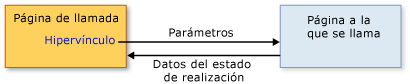

# Información general sobre la navegación estructuradaStructured Navigation Overview
Contenido que puede hospedarse en una [!INCLUDE[TLA#tla_xbap](../../../../includes/tlasharptla-xbap-md.md)], un <xref:System.Windows.Controls.Frame>, o un <xref:System.Windows.Navigation.NavigationWindow> se compone de páginas que se pueden identificar por módulo [!INCLUDE[TLA#tla_uri#plural](../../../../includes/tlasharptla-urisharpplural-md.md)] y navegar mediante hipervínculos.Content that can be hosted by an [!INCLUDE[TLA#tla_xbap](../../../../includes/tlasharptla-xbap-md.md)], a <xref:System.Windows.Controls.Frame>, or a <xref:System.Windows.Navigation.NavigationWindow> is composed of pages that can be identified by pack [!INCLUDE[TLA#tla_uri#plural](../../../../includes/tlasharptla-urisharpplural-md.md)] and navigated to by hyperlinks. La estructura de páginas y las formas en que se puede navegar por ellas, tal como se define mediante hipervínculos, se conoce como topología de navegación.The structure of pages and the ways in which they can be navigated, as defined by hyperlinks, is known as a navigation topology. Esta topología se adapta a diversos tipos de aplicaciones, especialmente a aquéllas que navegan por documentos.Such a topology suits a variety of application types, particularly those that navigate through documents. Con estas aplicaciones, el usuario puede navegar de una página a otra sin necesidad de saber nada sobre la otra.For such applications, the user can navigate from one page to another page without either page needing to know anything about the other.  
  
 Sin embargo, otros tipos de aplicaciones tienen páginas que necesitan saber cuándo se ha navegado entre ellas.However, other types of applications have pages that do need to know when they have been navigated between. Por ejemplo, suponga una aplicación de recursos humanos que tiene una página con una lista de todos los empleados de una organización, la página "Lista de empleados".For example, consider a human resources application that has one page to list all the employees in an organization—the "List Employees" page. Esta página también podría permitir a los usuarios agregar a un nuevo empleado haciendo clic en un hipervínculo.This page could also allow users to add a new employee by clicking a hyperlink. Al hacer clic en ella, la página navega a una página "Agregar un empleado" para recopilar los datos del nuevo empleado y llevarlos a la página "Lista de empleados" para crear al nuevo empleado y actualizar la lista.When clicked, the page navigates to an "Add an Employee" page to gather the new employee's details and return them to the "List Employees" page to create the new employee and update the list. Este estilo de navegación es similar a llamar a un método para realizar algún procesamiento y devolver un valor, que se conoce como programación estructurada.This style of navigation is similar to calling a method to perform some processing and return a value, which is known as structured programming. Por tanto, este estilo de navegación se conoce como *navegación estructurada*.As such, this style of navigation is known as *structured navigation*.  
  
 La <xref:System.Windows.Controls.Page> clase no implementa la compatibilidad con la navegación estructurada.The <xref:System.Windows.Controls.Page> class doesn't implement support for structured navigation. En su lugar, el <xref:System.Windows.Navigation.PageFunction%601> clase se deriva de <xref:System.Windows.Controls.Page> y lo extiende con las estructuras básicas requeridas para la navegación estructurada.Instead, the <xref:System.Windows.Navigation.PageFunction%601> class derives from <xref:System.Windows.Controls.Page> and extends it with the basic constructs required for structured navigation. En este tema se muestra cómo establecer el uso de la navegación estructurada <xref:System.Windows.Navigation.PageFunction%601>.This topic shows how to establish structured navigation using <xref:System.Windows.Navigation.PageFunction%601>.  
  
 
  
   
## Navegación estructuradaStructured Navigation  
 Cuando una página llama a otra página en una navegación estructurada, se requieren algunos o todos los comportamientos siguientes:When one page calls another page in a structured navigation, some or all of the following behaviors are required:  
  
-   La página que llama navega a la página llamada y, opcionalmente, pasa los parámetros requeridos por la página llamada.The calling page navigates to the called page, optionally passing parameters required by the called page.  
  
-   La página llamada, cuando un usuario ha terminado de usar la página que llama, vuelve específicamente a la página que llama y, opcionalmente:The called page, when a user has completed using the calling page, returns specifically to the calling page, optionally:  
  
    -   Devuelve información de estado que describe cómo se completó la página que llama (por ejemplo, si un usuario presionó un botón Aceptar o Cancelar).Returning state information that describes how the calling page was completed (for example, whether a user pressed an OK button or a Cancel button).  
  
    -   Devuelve los datos recopilados del usuario (por ejemplo, los datos de un nuevo empleado).Returning that data that was collected from the user (for example, new employee details).  
  
-   Cuando se devuelve la página que llama a la página llamada, la página llamada se quita del historial de navegación para aislar cada instancia de una página llamada de otra.When the calling page returns to the called page, the called page is removed from navigation history to isolate one instance of a called page from another.  
  
 En la ilustración siguiente se muestran estos comportamientos.These behaviors are illustrated by the following figure.  
  
   
  
 Puede implementar estos comportamientos mediante un <xref:System.Windows.Navigation.PageFunction%601> como la página llamada.You can implement these behaviors by using a <xref:System.Windows.Navigation.PageFunction%601> as the called page.  
  
   
## Navegación estructurada con PageFunctionStructured Navigation with PageFunction  
 En este tema se muestra cómo implementar los mecanismos básicos de navegación estructurada que implica un solo <xref:System.Windows.Navigation.PageFunction%601>.This topic shows how to implement the basic mechanics of structured navigation involving a single <xref:System.Windows.Navigation.PageFunction%601>. En este ejemplo, un <xref:System.Windows.Controls.Page> llamadas un <xref:System.Windows.Navigation.PageFunction%601> para obtener un <xref:System.String> valor del usuario y devolverlo.In this sample, a <xref:System.Windows.Controls.Page> calls a <xref:System.Windows.Navigation.PageFunction%601> to get a <xref:System.String> value from the user and return it.  
  
### Creación de una página que llamaCreating a Calling Page  
 La página que llama un <xref:System.Windows.Navigation.PageFunction%601> puede ser un <xref:System.Windows.Controls.Page> o <xref:System.Windows.Navigation.PageFunction%601>.The page that calls a <xref:System.Windows.Navigation.PageFunction%601> can be either a <xref:System.Windows.Controls.Page> or a <xref:System.Windows.Navigation.PageFunction%601>. En este ejemplo, es un <xref:System.Windows.Controls.Page>, tal y como se muestra en el código siguiente.In this example, it is a <xref:System.Windows.Controls.Page>, as shown in the following code.  
  
 [!code-xaml[StructuredNavigationSample#CallingPageDefaultMARKUP1](../../../../samples/snippets/csharp/VS_Snippets_Wpf/StructuredNavigationSample/CSharp/CallingPage.xaml#callingpagedefaultmarkup1)]  
[!code-xaml[StructuredNavigationSample#CallingPageDefaultMARKUP2](../../../../samples/snippets/csharp/VS_Snippets_Wpf/StructuredNavigationSample/CSharp/CallingPage.xaml#callingpagedefaultmarkup2)]  
  
 [!code-csharp[StructuredNavigationSample#CallingPageDefaultCODEBEHIND1](../../../../samples/snippets/csharp/VS_Snippets_Wpf/StructuredNavigationSample/CSharp/CallingPage.xaml.cs#callingpagedefaultcodebehind1)]
 [!code-vb[StructuredNavigationSample#CallingPageDefaultCODEBEHIND1](../../../../samples/snippets/visualbasic/VS_Snippets_Wpf/StructuredNavigationSample/VisualBasic/CallingPage.xaml.vb#callingpagedefaultcodebehind1)]  
[!code-csharp[StructuredNavigationSample#CallingPageDefaultCODEBEHIND2](../../../../samples/snippets/csharp/VS_Snippets_Wpf/StructuredNavigationSample/CSharp/CallingPage.xaml.cs#callingpagedefaultcodebehind2)]
[!code-vb[StructuredNavigationSample#CallingPageDefaultCODEBEHIND2](../../../../samples/snippets/visualbasic/VS_Snippets_Wpf/StructuredNavigationSample/VisualBasic/CallingPage.xaml.vb#callingpagedefaultcodebehind2)]  
[!code-csharp[StructuredNavigationSample#CallingPageDefaultCODEBEHIND3](../../../../samples/snippets/csharp/VS_Snippets_Wpf/StructuredNavigationSample/CSharp/CallingPage.xaml.cs#callingpagedefaultcodebehind3)]
[!code-vb[StructuredNavigationSample#CallingPageDefaultCODEBEHIND3](../../../../samples/snippets/visualbasic/VS_Snippets_Wpf/StructuredNavigationSample/VisualBasic/CallingPage.xaml.vb#callingpagedefaultcodebehind3)]  
  
### Creación de una función de página para realizar la llamadaCreating a Page Function to Call  
 Dado que la página que realiza la llamada puede usar la página llamada para recopilar y devolver los datos del usuario, <xref:System.Windows.Navigation.PageFunction%601> se implementa como una clase genérica cuyo argumento de tipo especifica el tipo del valor que devolverá la página llamada.Because the calling page can use the called page to collect and return data from the user, <xref:System.Windows.Navigation.PageFunction%601> is implemented as a generic class whose type argument specifies the type of the value that the called page will return. El código siguiente muestra la implementación inicial de la llamada página mediante un <xref:System.Windows.Navigation.PageFunction%601>, que devuelve un <xref:System.String>.The following code shows the initial implementation of the called page, using a <xref:System.Windows.Navigation.PageFunction%601>, which returns a <xref:System.String>.  
  
 [!code-xaml[StructuredNavigationSample#CalledPageFunctionMARKUP](../../../../samples/snippets/csharp/VS_Snippets_Wpf/StructuredNavigationSample/CSharp/CalledPageFunction.xaml#calledpagefunctionmarkup)]  
  
 [!code-csharp[StructuredNavigationSample#CalledPageFunctionCODEBEHIND1](../../../../samples/snippets/csharp/VS_Snippets_Wpf/StructuredNavigationSample/CSharp/CalledPageFunction.xaml.cs#calledpagefunctioncodebehind1)]
 [!code-vb[StructuredNavigationSample#CalledPageFunctionCODEBEHIND1](../../../../samples/snippets/visualbasic/VS_Snippets_Wpf/StructuredNavigationSample/VisualBasic/CalledPageFunction.xaml.vb#calledpagefunctioncodebehind1)]  
[!code-csharp[StructuredNavigationSample#CalledPageFunctionCODEBEHIND2](../../../../samples/snippets/csharp/VS_Snippets_Wpf/StructuredNavigationSample/CSharp/CalledPageFunction.xaml.cs#calledpagefunctioncodebehind2)]
[!code-vb[StructuredNavigationSample#CalledPageFunctionCODEBEHIND2](../../../../samples/snippets/visualbasic/VS_Snippets_Wpf/StructuredNavigationSample/VisualBasic/CalledPageFunction.xaml.vb#calledpagefunctioncodebehind2)]  
  
 La declaración de un <xref:System.Windows.Navigation.PageFunction%601> es similar a la declaración de un <xref:System.Windows.Controls.Page> con la adición de los argumentos de tipo.The declaration of a <xref:System.Windows.Navigation.PageFunction%601> is similar to the declaration of a <xref:System.Windows.Controls.Page> with the addition of the type arguments. Como puede ver en el ejemplo de código, se especifican los argumentos de tipo en el marcado [!INCLUDE[TLA2#tla_xaml](../../../../includes/tla2sharptla-xaml-md.md)], con el atributo `x:TypeArguments`, y en el código subyacente, con la sintaxis del argumento de tipo genérico estándar.As you can see from the code example, the type arguments are specified in both [!INCLUDE[TLA2#tla_xaml](../../../../includes/tla2sharptla-xaml-md.md)] markup, using the `x:TypeArguments` attribute, and code-behind, using standard generic type argument syntax.  
  
 No tiene que usar sólo clases [!INCLUDE[dnprdnshort](../../../../includes/dnprdnshort-md.md)] como argumentos de tipo.You don't have to use only [!INCLUDE[dnprdnshort](../../../../includes/dnprdnshort-md.md)] classes as type arguments. Un <xref:System.Windows.Navigation.PageFunction%601> podría invocarse para recopilar datos específicos de dominio que se resuman como un tipo personalizado.A <xref:System.Windows.Navigation.PageFunction%601> could be called to gather domain-specific data that is abstracted as a custom type. El código siguiente muestra cómo usar un tipo personalizado como un argumento de tipo para un <xref:System.Windows.Navigation.PageFunction%601>.The following code shows how to use a custom type as a type argument for a <xref:System.Windows.Navigation.PageFunction%601>.  
  
 [!code-csharp[CustomTypePageFunctionSnippets#CustomTypeCODE1](../../../../samples/snippets/csharp/VS_Snippets_Wpf/CustomTypePageFunctionSnippets/CSharp/CustomType.cs#customtypecode1)]
 [!code-vb[CustomTypePageFunctionSnippets#CustomTypeCODE1](../../../../samples/snippets/visualbasic/VS_Snippets_Wpf/CustomTypePageFunctionSnippets/VisualBasic/CustomType.vb#customtypecode1)]  
[!code-csharp[CustomTypePageFunctionSnippets#CustomTypeCODE2](../../../../samples/snippets/csharp/VS_Snippets_Wpf/CustomTypePageFunctionSnippets/CSharp/CustomType.cs#customtypecode2)]
[!code-vb[CustomTypePageFunctionSnippets#CustomTypeCODE2](../../../../samples/snippets/visualbasic/VS_Snippets_Wpf/CustomTypePageFunctionSnippets/VisualBasic/CustomType.vb#customtypecode2)]  
  
 [!code-xaml[CustomTypePageFunctionSnippets#CustomTypePageFunctionMARKUP1](../../../../samples/snippets/csharp/VS_Snippets_Wpf/CustomTypePageFunctionSnippets/CSharp/CustomTypePageFunction.xaml#customtypepagefunctionmarkup1)]  
[!code-xaml[CustomTypePageFunctionSnippets#CustomTypePageFunctionMARKUP2](../../../../samples/snippets/csharp/VS_Snippets_Wpf/CustomTypePageFunctionSnippets/CSharp/CustomTypePageFunction.xaml#customtypepagefunctionmarkup2)]  
  
 [!code-csharp[CustomTypePageFunctionSnippets#CustomTypePageFunctionCODEBEHIND1](../../../../samples/snippets/csharp/VS_Snippets_Wpf/CustomTypePageFunctionSnippets/CSharp/CustomTypePageFunction.xaml.cs#customtypepagefunctioncodebehind1)]
 [!code-vb[CustomTypePageFunctionSnippets#CustomTypePageFunctionCODEBEHIND1](../../../../samples/snippets/visualbasic/VS_Snippets_Wpf/CustomTypePageFunctionSnippets/VisualBasic/CustomTypePageFunction.xaml.vb#customtypepagefunctioncodebehind1)]  
[!code-csharp[CustomTypePageFunctionSnippets#CustomTypePageFunctionCODEBEHIND2](../../../../samples/snippets/csharp/VS_Snippets_Wpf/CustomTypePageFunctionSnippets/CSharp/CustomTypePageFunction.xaml.cs#customtypepagefunctioncodebehind2)]
[!code-vb[CustomTypePageFunctionSnippets#CustomTypePageFunctionCODEBEHIND2](../../../../samples/snippets/visualbasic/VS_Snippets_Wpf/CustomTypePageFunctionSnippets/VisualBasic/CustomTypePageFunction.xaml.vb#customtypepagefunctioncodebehind2)]  
  
 Los argumentos de tipo para el <xref:System.Windows.Navigation.PageFunction%601> ofrecen los cimientos para la comunicación entre una página que llama y la página llamada, que se describen en las secciones siguientes.The type arguments for the <xref:System.Windows.Navigation.PageFunction%601> provide the foundation for the communication between a calling page and the called page, which are discussed in the following sections.  
  
 Como verá, el tipo que se identifica con la declaración de un <xref:System.Windows.Navigation.PageFunction%601> desempeña un papel importante en la devolución de datos desde un <xref:System.Windows.Navigation.PageFunction%601> a la página que realiza la llamada.As you'll see, the type that is identified with the declaration of a <xref:System.Windows.Navigation.PageFunction%601> plays an important role in returning data from a <xref:System.Windows.Navigation.PageFunction%601> to the calling page.  
  
### Llamada a una clase PageFunction y transmisión de parámetrosCalling a PageFunction and Passing Parameters  
 Para llamar a una página, debe crear una instancia de la página llamada y navegar a ella mediante la página que llama el <xref:System.Windows.Navigation.NavigationService.Navigate%2A> método.To call a page, the calling page must instantiate the called page and navigate to it using the <xref:System.Windows.Navigation.NavigationService.Navigate%2A> method. Esto permite que la página que llama pase los datos iniciales a la página llamada, como valores predeterminados para los datos recopilados por la página llamada.This allows the calling page to pass initial data to the called page, such as default values for the data being gathered by the called page.  
  
 El código siguiente muestra la página llamada con un constructor no predeterminado para aceptar parámetros de la página que llama.The following code shows the called page with a non-default constructor to accept parameters from the calling page.  
  
 [!code-csharp[StructuredNavigationSample#AcceptsInitialDataCODEBEHIND1](../../../../samples/snippets/csharp/VS_Snippets_Wpf/StructuredNavigationSample/CSharp/CalledPageFunction.xaml.cs#acceptsinitialdatacodebehind1)]
 [!code-vb[StructuredNavigationSample#AcceptsInitialDataCODEBEHIND1](../../../../samples/snippets/visualbasic/VS_Snippets_Wpf/StructuredNavigationSample/VisualBasic/CalledPageFunction.xaml.vb#acceptsinitialdatacodebehind1)]  
[!code-csharp[StructuredNavigationSample#AcceptsInitialDataCODEBEHIND2](../../../../samples/snippets/csharp/VS_Snippets_Wpf/StructuredNavigationSample/CSharp/CalledPageFunction.xaml.cs#acceptsinitialdatacodebehind2)]
[!code-vb[StructuredNavigationSample#AcceptsInitialDataCODEBEHIND2](../../../../samples/snippets/visualbasic/VS_Snippets_Wpf/StructuredNavigationSample/VisualBasic/CalledPageFunction.xaml.vb#acceptsinitialdatacodebehind2)]  
[!code-csharp[StructuredNavigationSample#AcceptsInitialDataCODEBEHIND3](../../../../samples/snippets/csharp/VS_Snippets_Wpf/StructuredNavigationSample/CSharp/CalledPageFunction.xaml.cs#acceptsinitialdatacodebehind3)]
[!code-vb[StructuredNavigationSample#AcceptsInitialDataCODEBEHIND3](../../../../samples/snippets/visualbasic/VS_Snippets_Wpf/StructuredNavigationSample/VisualBasic/CalledPageFunction.xaml.vb#acceptsinitialdatacodebehind3)]  
[!code-csharp[StructuredNavigationSample#AcceptsInitialDataCODEBEHIND4](../../../../samples/snippets/csharp/VS_Snippets_Wpf/StructuredNavigationSample/CSharp/CalledPageFunction.xaml.cs#acceptsinitialdatacodebehind4)]
[!code-vb[StructuredNavigationSample#AcceptsInitialDataCODEBEHIND4](../../../../samples/snippets/visualbasic/VS_Snippets_Wpf/StructuredNavigationSample/VisualBasic/CalledPageFunction.xaml.vb#acceptsinitialdatacodebehind4)]  
  
 El código siguiente muestra el control de página que realiza la llamada la <xref:System.Windows.Documents.Hyperlink.Click> eventos de la <xref:System.Windows.Documents.Hyperlink> para crear una instancia de la página llamada y pasarle un valor de cadena inicial.The following code shows the calling page handling the <xref:System.Windows.Documents.Hyperlink.Click> event of the <xref:System.Windows.Documents.Hyperlink> to instantiate the called page and pass it an initial string value.  
  
 [!code-xaml[StructuredNavigationSample#PassingDataMARKUP2](../../../../samples/snippets/csharp/VS_Snippets_Wpf/StructuredNavigationSample/CSharp/CallingPage.xaml#passingdatamarkup2)]  
[!code-csharp[StructuredNavigationSample#PassingDataCODEBEHIND1](../../../../samples/snippets/csharp/VS_Snippets_Wpf/StructuredNavigationSample/CSharp/CallingPage.xaml.cs#passingdatacodebehind1)]
[!code-vb[StructuredNavigationSample#PassingDataCODEBEHIND1](../../../../samples/snippets/visualbasic/VS_Snippets_Wpf/StructuredNavigationSample/VisualBasic/CallingPage.xaml.vb#passingdatacodebehind1)]  
[!code-csharp[StructuredNavigationSample#PassingDataCODEBEHIND2](../../../../samples/snippets/csharp/VS_Snippets_Wpf/StructuredNavigationSample/CSharp/CallingPage.xaml.cs#passingdatacodebehind2)]
[!code-vb[StructuredNavigationSample#PassingDataCODEBEHIND2](../../../../samples/snippets/visualbasic/VS_Snippets_Wpf/StructuredNavigationSample/VisualBasic/CallingPage.xaml.vb#passingdatacodebehind2)]  
[!code-csharp[StructuredNavigationSample#PassingDataCODEBEHIND3](../../../../samples/snippets/csharp/VS_Snippets_Wpf/StructuredNavigationSample/CSharp/CallingPage.xaml.cs#passingdatacodebehind3)]
[!code-vb[StructuredNavigationSample#PassingDataCODEBEHIND3](../../../../samples/snippets/visualbasic/VS_Snippets_Wpf/StructuredNavigationSample/VisualBasic/CallingPage.xaml.vb#passingdatacodebehind3)]  
  
 No es necesario pasar parámetros a la página llamada.You are not required to pass parameters to the called page. En su lugar, podría hacer lo siguiente:Instead, you could do the following:  
  
-   En la página que llama:From the calling page:  
  
    1.  Crear una instancia de la llamada <xref:System.Windows.Navigation.PageFunction%601> utilizando el constructor predeterminado.Instantiate the called <xref:System.Windows.Navigation.PageFunction%601> using the default constructor.  
  
    2.  Store los parámetros en <xref:System.Windows.Application.Properties%2A>.Store the parameters in <xref:System.Windows.Application.Properties%2A>.  
  
    3.  Vaya a la llamada <xref:System.Windows.Navigation.PageFunction%601>.Navigate to the called <xref:System.Windows.Navigation.PageFunction%601>.  
  
-   Desde la llamada <xref:System.Windows.Navigation.PageFunction%601>:From the called <xref:System.Windows.Navigation.PageFunction%601>:  
  
    -   Recuperar y utilizar los parámetros almacenados en <xref:System.Windows.Application.Properties%2A>.Retrieve and use the parameters stored in <xref:System.Windows.Application.Properties%2A>.  
  
 Pero, como verá en breve, aún necesitará utilizar código para crear una instancia y navegar a la página llamada para recopilar los datos devueltos por la página llamada.But, as you'll see shortly, you'll still need use code to instantiate and navigate to the called page to collect the data returned by the called page. Por este motivo, el <xref:System.Windows.Navigation.PageFunction%601> debe mantenerse activo; de lo contrario, la próxima vez vaya a la <xref:System.Windows.Navigation.PageFunction%601>, [!INCLUDE[TLA2#tla_wpf](../../../../includes/tla2sharptla-wpf-md.md)] crea una instancia de la <xref:System.Windows.Navigation.PageFunction%601> utilizando el constructor predeterminado.For this reason, the <xref:System.Windows.Navigation.PageFunction%601> needs to be kept alive; otherwise, the next time you navigate to the <xref:System.Windows.Navigation.PageFunction%601>, [!INCLUDE[TLA2#tla_wpf](../../../../includes/tla2sharptla-wpf-md.md)] instantiates the <xref:System.Windows.Navigation.PageFunction%601> using the default constructor.  
  
 Sin embargo, antes de la página llamada pueda volver, debe devolver los datos para que los pueda recuperar la página que llama.Before the called page can return, however, it needs to return data that can be retrieved by the calling page.  
  
### Devolución de los resultados y los datos de la tarea de una tarea a una página que llamaReturning Task Result and Task Data from a Task to a Calling Page  
 Una vez que el usuario ha terminado de utilizar la página llamada, en este ejemplo indicado al presionar los botones Aceptar o Cancelar, la página llamada debe volver.Once the user has finished using the called page, signified in this example by pressing either the OK or Cancel buttons, the called page needs to return. Puesto que la página que llama utilizó la página llamada para recopilar datos del usuario, la página que llama requiere dos tipos de información:Since the calling page used the called page to collect data from the user, the calling page requires two types of information:  
  
1.  Si el usuario canceló la página llamada (presionando el botón Aceptar o el botón Cancelar en este ejemplo).Whether the user canceled the called page (by pressing either the OK button or the Cancel button in this example). Esto permite que la página que llama determine si se procesan los datos que recopiló del usuario.This allows the calling page to determine whether to process the data that the calling page gathered from the user.  
  
2.  Los datos proporcionados por el usuario.The data that was provided by the user.  
  
 Para devolver información, <xref:System.Windows.Navigation.PageFunction%601> implementa el <xref:System.Windows.Navigation.PageFunction%601.OnReturn%2A> método.To return information, <xref:System.Windows.Navigation.PageFunction%601> implements the <xref:System.Windows.Navigation.PageFunction%601.OnReturn%2A> method. El siguiente código muestra cómo llamarlo.The following code shows how to call it.  
  
 [!code-csharp[StructuredNavigationSample#ReturnCODEBEHIND1](../../../../samples/snippets/csharp/VS_Snippets_Wpf/StructuredNavigationSample/CSharp/CalledPageFunction.xaml.cs#returncodebehind1)]
 [!code-vb[StructuredNavigationSample#ReturnCODEBEHIND1](../../../../samples/snippets/visualbasic/VS_Snippets_Wpf/StructuredNavigationSample/VisualBasic/CalledPageFunction.xaml.vb#returncodebehind1)]  
[!code-csharp[StructuredNavigationSample#ReturnCODEBEHIND2](../../../../samples/snippets/csharp/VS_Snippets_Wpf/StructuredNavigationSample/CSharp/CalledPageFunction.xaml.cs#returncodebehind2)]
[!code-vb[StructuredNavigationSample#ReturnCODEBEHIND2](../../../../samples/snippets/visualbasic/VS_Snippets_Wpf/StructuredNavigationSample/VisualBasic/CalledPageFunction.xaml.vb#returncodebehind2)]  
  
 En este ejemplo, si un usuario presiona el botón Cancelar, se devuelve un valor de `null` a la página que llama.In this example, if a user presses the Cancel button, a value of `null` is returned to the calling page. En cambio, si se presiona el botón Aceptar, se devuelve el valor de cadena proporcionado por el usuario.If the OK button is pressed instead, the string value provided by the user is returned. <xref:System.Windows.Navigation.PageFunction%601.OnReturn%2A> es un `protected virtual` método al que se llama para devolver los datos a la página que realiza la llamada.<xref:System.Windows.Navigation.PageFunction%601.OnReturn%2A> is a `protected virtual` method that you call to return your data to the calling page. Los datos deben empaquetarse en una instancia de la clase genérica <xref:System.Windows.Navigation.ReturnEventArgs%601> tipo, cuyo argumento de tipo especifica el tipo de valor que <xref:System.Windows.Navigation.ReturnEventArgs%601.Result%2A> devuelve.Your data needs to be packaged in an instance of the generic <xref:System.Windows.Navigation.ReturnEventArgs%601> type, whose type argument specifies the type of value that <xref:System.Windows.Navigation.ReturnEventArgs%601.Result%2A> returns. De este modo, cuando se declara un <xref:System.Windows.Navigation.PageFunction%601> con un argumento de tipo en particular, se indica que un <xref:System.Windows.Navigation.PageFunction%601> devolverá una instancia del tipo especificado por el argumento de tipo.In this way, when you declare a <xref:System.Windows.Navigation.PageFunction%601> with a particular type argument, you are stating that a <xref:System.Windows.Navigation.PageFunction%601> will return an instance of the type that is specified by the type argument. En este ejemplo, el argumento de tipo y, por lo tanto, el valor devuelto es de tipo <xref:System.String>.In this example, the type argument and, consequently, the return value is of type <xref:System.String>.  
  
 Cuando <xref:System.Windows.Navigation.PageFunction%601.OnReturn%2A> se llama a las necesidades de la página que realiza la llamada alguna manera de recibir el valor devuelto de la <xref:System.Windows.Navigation.PageFunction%601>.When <xref:System.Windows.Navigation.PageFunction%601.OnReturn%2A> is called, the calling page needs some way of receiving the return value of the <xref:System.Windows.Navigation.PageFunction%601>. Por este motivo, <xref:System.Windows.Navigation.PageFunction%601> implementa el <xref:System.Windows.Navigation.PageFunction%601.Return> eventos para llamar a las páginas para controlar.For this reason, <xref:System.Windows.Navigation.PageFunction%601> implements the <xref:System.Windows.Navigation.PageFunction%601.Return> event for calling pages to handle. Cuando <xref:System.Windows.Navigation.PageFunction%601.OnReturn%2A> se llama, <xref:System.Windows.Navigation.PageFunction%601.Return> se genera, por lo que la página que llama puede registrar con <xref:System.Windows.Navigation.PageFunction%601.Return> para recibir la notificación.When <xref:System.Windows.Navigation.PageFunction%601.OnReturn%2A> is called, <xref:System.Windows.Navigation.PageFunction%601.Return> is raised, so the calling page can register with <xref:System.Windows.Navigation.PageFunction%601.Return> to receive the notification.  
  
 [!code-csharp[StructuredNavigationSample#ProcessResultCODEBEHIND1](../../../../samples/snippets/csharp/VS_Snippets_Wpf/StructuredNavigationSample/CSharp/CallingPage.xaml.cs#processresultcodebehind1)]
 [!code-vb[StructuredNavigationSample#ProcessResultCODEBEHIND1](../../../../samples/snippets/visualbasic/VS_Snippets_Wpf/StructuredNavigationSample/VisualBasic/CallingPage.xaml.vb#processresultcodebehind1)]  
[!code-csharp[StructuredNavigationSample#ProcessResultCODEBEHIND2](../../../../samples/snippets/csharp/VS_Snippets_Wpf/StructuredNavigationSample/CSharp/CallingPage.xaml.cs#processresultcodebehind2)]
[!code-vb[StructuredNavigationSample#ProcessResultCODEBEHIND2](../../../../samples/snippets/visualbasic/VS_Snippets_Wpf/StructuredNavigationSample/VisualBasic/CallingPage.xaml.vb#processresultcodebehind2)]  
  
### Eliminación de páginas de tarea cuando se completa una tareaRemoving Task Pages When a Task Completes  
 Cuando vuelve una página llamada y el usuario no la había cancelado, la página que llama procesará los datos proporcionados por el usuario y los devueltos desde la página llamada.When a called page returns, and the user didn't cancel the called page, the calling page will process the data that was provided by the user and also returned from the called page. La adquisición de datos de esta manera suele ser una actividad aislada; cuando la página llamada vuelve, la página que llama debe crear y navegar a una nueva página que llama para capturar más datos.Data acquisition in this way is usually an isolated activity; when the called page returns, the calling page needs to create and navigate to a new calling page to capture more data.  
  
 Sin embargo, a menos que una página llamada se quite del diario, un usuario podrá volver a una instancia anterior de la página que llama.However, unless a called page is removed from the journal, a user will be able to navigate back to a previous instance of the calling page. Si un <xref:System.Windows.Navigation.PageFunction%601> se conserva en el diario está determinado por la <xref:System.Windows.Navigation.PageFunctionBase.RemoveFromJournal%2A> propiedad.Whether a <xref:System.Windows.Navigation.PageFunction%601> is retained in the journal is determined by the <xref:System.Windows.Navigation.PageFunctionBase.RemoveFromJournal%2A> property. De forma predeterminada, una función de página es automáticamente cuando quita <xref:System.Windows.Navigation.PageFunction%601.OnReturn%2A> se denomina porque <xref:System.Windows.Navigation.PageFunctionBase.RemoveFromJournal%2A> está establecido en `true`.By default, a page function is automatically removed when <xref:System.Windows.Navigation.PageFunction%601.OnReturn%2A> is called because <xref:System.Windows.Navigation.PageFunctionBase.RemoveFromJournal%2A> is set to `true`. Para mantener una función de página en el historial de navegación después <xref:System.Windows.Navigation.PageFunction%601.OnReturn%2A> se llama, establezca <xref:System.Windows.Navigation.PageFunctionBase.RemoveFromJournal%2A> a `false`.To keep a page function in navigation history after <xref:System.Windows.Navigation.PageFunction%601.OnReturn%2A> is called, set <xref:System.Windows.Navigation.PageFunctionBase.RemoveFromJournal%2A> to `false`.  
  
   
## Otros tipos de navegación estructuradaOther Types of Structured Navigation  
 En este tema se muestra el uso más básico de un <xref:System.Windows.Navigation.PageFunction%601> admitir la llamada/devolución navegación estructurada.This topic illustrates the most basic use of a <xref:System.Windows.Navigation.PageFunction%601> to support call/return structured navigation. Esta base proporciona la capacidad de crear tipos más complejos de navegación estructurada.This foundation provides you with the ability to create more complex types of structured navigation.  
  
 Por ejemplo, a veces son necesarias varias páginas en una página que llama para recopilar suficientes datos de un usuario o para realizar una tarea.For example, sometimes multiple pages are required by a calling page to gather enough data from a user or to perform a task. El uso de varias páginas se conoce como un "asistente".The use of multiple pages is referred to as a "wizard".  
  
 En otros casos, las aplicaciones pueden tener topologías de navegación complejas que dependen de la navegación estructurada para funcionar eficazmente.In other cases, applications may have complex navigation topologies that depend on structured navigation to operate effectively. Para más información, consulte [Información general sobre topologías de navegación](../../../../docs/framework/wpf/app-development/navigation-topologies-overview.md).For more information, see [Navigation Topologies Overview](../../../../docs/framework/wpf/app-development/navigation-topologies-overview.md).  
  
## Vea tambiénSee Also  
 <xref:System.Windows.Navigation.PageFunction%601>  
 <xref:System.Windows.Navigation.NavigationService>  
 [Información general sobre topologías de navegaciónNavigation Topologies Overview](../../../../docs/framework/wpf/app-development/navigation-topologies-overview.md)
