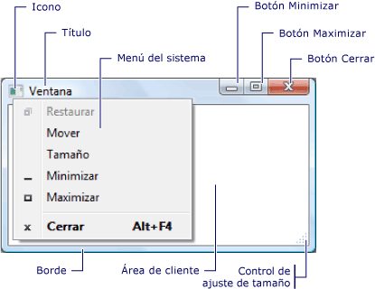
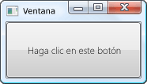
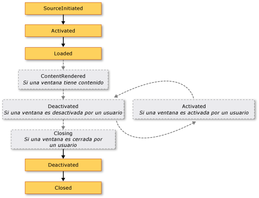
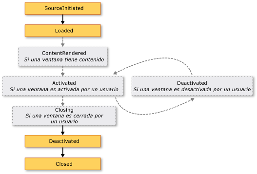
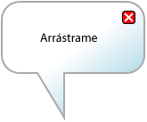

# <a name="wpf-windows-overview"></a><span data-ttu-id="16495-102">Información general sobre ventanas de WPF</span><span class="sxs-lookup"><span data-stu-id="16495-102">WPF Windows Overview</span></span>
<span data-ttu-id="16495-103">Los usuarios interactúan con las aplicaciones independientes de [!INCLUDE[TLA#tla_wpf](../../../../includes/tlasharptla-wpf-md.md)] por medio de ventanas.</span><span class="sxs-lookup"><span data-stu-id="16495-103">Users interact with [!INCLUDE[TLA#tla_wpf](../../../../includes/tlasharptla-wpf-md.md)] standalone applications through windows.</span></span> <span data-ttu-id="16495-104">El propósito principal de una ventana es hospedar contenido que permita visualizar datos y que permita a los usuarios interactuar con estos.</span><span class="sxs-lookup"><span data-stu-id="16495-104">The primary purpose of a window is to host content that visualizes data and enables users to interact with data.</span></span> <span data-ttu-id="16495-105">Independiente [!INCLUDE[TLA2#tla_wpf](../../../../includes/tla2sharptla-wpf-md.md)] aplicaciones proporcionan sus propias ventanas mediante la <xref:System.Windows.Window> clase.</span><span class="sxs-lookup"><span data-stu-id="16495-105">Standalone [!INCLUDE[TLA2#tla_wpf](../../../../includes/tla2sharptla-wpf-md.md)] applications provide their own windows by using the <xref:System.Windows.Window> class.</span></span> <span data-ttu-id="16495-106">Este tema se presentan <xref:System.Windows.Window> antes de tratar los conceptos básicos de creación y administración de windows en las aplicaciones independientes.</span><span class="sxs-lookup"><span data-stu-id="16495-106">This topic introduces <xref:System.Windows.Window> before covering the fundamentals of creating and managing windows in standalone applications.</span></span>  
  
> [!NOTE]
>  <span data-ttu-id="16495-107">Hospedadas en explorador [!INCLUDE[TLA2#tla_wpf](../../../../includes/tla2sharptla-wpf-md.md)] aplicaciones, incluidos [!INCLUDE[TLA#tla_xbap#plural](../../../../includes/tlasharptla-xbapsharpplural-md.md)] y malas [!INCLUDE[TLA#tla_xaml](../../../../includes/tlasharptla-xaml-md.md)] páginas, no proporcionan sus propias ventanas.</span><span class="sxs-lookup"><span data-stu-id="16495-107">Browser-hosted [!INCLUDE[TLA2#tla_wpf](../../../../includes/tla2sharptla-wpf-md.md)] applications, including [!INCLUDE[TLA#tla_xbap#plural](../../../../includes/tlasharptla-xbapsharpplural-md.md)] and loose [!INCLUDE[TLA#tla_xaml](../../../../includes/tlasharptla-xaml-md.md)] pages, don't provide their own windows.</span></span> <span data-ttu-id="16495-108">En su lugar, se hospedan en ventanas proporcionadas por [!INCLUDE[TLA#tla_iegeneric](../../../../includes/tlasharptla-iegeneric-md.md)].</span><span class="sxs-lookup"><span data-stu-id="16495-108">Instead, they are hosted in windows provided by [!INCLUDE[TLA#tla_iegeneric](../../../../includes/tlasharptla-iegeneric-md.md)].</span></span> <span data-ttu-id="16495-109">Vea [información general de las aplicaciones de explorador XAML de WPF](../../../../docs/framework/wpf/app-development/wpf-xaml-browser-applications-overview.md).</span><span class="sxs-lookup"><span data-stu-id="16495-109">See [WPF XAML Browser Applications Overview](../../../../docs/framework/wpf/app-development/wpf-xaml-browser-applications-overview.md).</span></span>  
  
  
<a name="TheWindowClass"></a>   
## <a name="the-window-class"></a><span data-ttu-id="16495-110">Clase de la ventana</span><span class="sxs-lookup"><span data-stu-id="16495-110">The Window Class</span></span>  
 <span data-ttu-id="16495-111">La ilustración siguiente muestra las partes constituyentes de una ventana.</span><span class="sxs-lookup"><span data-stu-id="16495-111">The following figure illustrates the constituent parts of a window.</span></span>  
  
 <span data-ttu-id="16495-112"></span><span class="sxs-lookup"><span data-stu-id="16495-112"></span></span>  
  
 <span data-ttu-id="16495-113">Una ventana se divide en dos áreas: el área distinta del cliente y el área cliente.</span><span class="sxs-lookup"><span data-stu-id="16495-113">A window is divided into two areas: the non-client area and client area.</span></span>  
  
 <span data-ttu-id="16495-114">El *área no cliente* de una ventana se implementa mediante [!INCLUDE[TLA2#tla_wpf](../../../../includes/tla2sharptla-wpf-md.md)] e incluye las partes de una ventana que son comunes a la mayoría de las ventanas, incluidos los siguientes:</span><span class="sxs-lookup"><span data-stu-id="16495-114">The *non-client area* of a window is implemented by [!INCLUDE[TLA2#tla_wpf](../../../../includes/tla2sharptla-wpf-md.md)] and includes the parts of a window that are common to most windows, including the following:</span></span>  
  
-   <span data-ttu-id="16495-115">Un borde.</span><span class="sxs-lookup"><span data-stu-id="16495-115">A border.</span></span>  
  
-   <span data-ttu-id="16495-116">Una barra de título.</span><span class="sxs-lookup"><span data-stu-id="16495-116">A title bar.</span></span>  
  
-   <span data-ttu-id="16495-117">Un icono.</span><span class="sxs-lookup"><span data-stu-id="16495-117">An icon.</span></span>  
  
-   <span data-ttu-id="16495-118">Botones Minimizar, Maximizar y Restaurar.</span><span class="sxs-lookup"><span data-stu-id="16495-118">Minimize, Maximize, and Restore buttons.</span></span>  
  
-   <span data-ttu-id="16495-119">Un botón Cerrar.</span><span class="sxs-lookup"><span data-stu-id="16495-119">A Close button.</span></span>  
  
-   <span data-ttu-id="16495-120">Un menú de sistema con elementos de menú que permiten a los usuarios minimizar, maximizar, restaurar, mover, cambiar el tamaño y cerrar una ventana.</span><span class="sxs-lookup"><span data-stu-id="16495-120">A System menu with menu items that allow users to minimize, maximize, restore, move, resize, and close a window.</span></span>  
  
 <span data-ttu-id="16495-121">El *área cliente* de una ventana es el área dentro del área no cliente de una ventana y lo utilizan los desarrolladores para agregar contenido específico de la aplicación, como barras de menús, barras de herramientas y controles.</span><span class="sxs-lookup"><span data-stu-id="16495-121">The *client area* of a window is the area within a window's non-client area and is used by developers to add application-specific content, such as menu bars, tool bars, and controls.</span></span>  
  
 <span data-ttu-id="16495-122">En [!INCLUDE[TLA2#tla_wpf](../../../../includes/tla2sharptla-wpf-md.md)], una ventana es encapsulada por el <xref:System.Windows.Window> clase que usa para hacer lo siguiente:</span><span class="sxs-lookup"><span data-stu-id="16495-122">In [!INCLUDE[TLA2#tla_wpf](../../../../includes/tla2sharptla-wpf-md.md)], a window is encapsulated by the <xref:System.Windows.Window> class that you use to do the following:</span></span>  
  
-   <span data-ttu-id="16495-123">Mostrar una ventana.</span><span class="sxs-lookup"><span data-stu-id="16495-123">Display a window.</span></span>  
  
-   <span data-ttu-id="16495-124">Configurar el tamaño, posición y aspecto de una ventana.</span><span class="sxs-lookup"><span data-stu-id="16495-124">Configure the size, position, and appearance of a window.</span></span>  
  
-   <span data-ttu-id="16495-125">Hospedar contenido específico de la aplicación.</span><span class="sxs-lookup"><span data-stu-id="16495-125">Host application-specific content.</span></span>  
  
-   <span data-ttu-id="16495-126">Administrar la duración de una ventana.</span><span class="sxs-lookup"><span data-stu-id="16495-126">Manage the lifetime of a window.</span></span>  
  
<a name="DefiningAWindow"></a>   
## <a name="implementing-a-window"></a><span data-ttu-id="16495-127">Implementar una ventana</span><span class="sxs-lookup"><span data-stu-id="16495-127">Implementing a Window</span></span>  
 <span data-ttu-id="16495-128">La implementación de una ventana típica consta de apariencia y comportamiento, donde *apariencia* define el aspecto de una ventana para usuarios y *comportamiento* define la forma en que las funciones de una ventana cuando los usuarios interactúan con él.</span><span class="sxs-lookup"><span data-stu-id="16495-128">The implementation of a typical window comprises both appearance and behavior, where *appearance* defines how a window looks to users and *behavior* defines the way a window functions as users interact with it.</span></span> <span data-ttu-id="16495-129">En [!INCLUDE[TLA2#tla_wpf](../../../../includes/tla2sharptla-wpf-md.md)], puede implementar la apariencia y comportamiento de una ventana con codificar o [!INCLUDE[TLA2#tla_xaml](../../../../includes/tla2sharptla-xaml-md.md)] marcado.</span><span class="sxs-lookup"><span data-stu-id="16495-129">In [!INCLUDE[TLA2#tla_wpf](../../../../includes/tla2sharptla-wpf-md.md)], you can implement the appearance and behavior of a window using either code or [!INCLUDE[TLA2#tla_xaml](../../../../includes/tla2sharptla-xaml-md.md)] markup.</span></span>  
  
 <span data-ttu-id="16495-130">En general, sin embargo, la apariencia de una ventana se implementa mediante [!INCLUDE[TLA2#tla_xaml](../../../../includes/tla2sharptla-xaml-md.md)] marcado y su comportamiento se implementa mediante código subyacente, como se muestra en el ejemplo siguiente.</span><span class="sxs-lookup"><span data-stu-id="16495-130">In general, however, the appearance of a window is implemented using [!INCLUDE[TLA2#tla_xaml](../../../../includes/tla2sharptla-xaml-md.md)] markup, and its behavior is implemented using code-behind, as shown in the following example.</span></span>  
  
 [!code-xaml[WindowsOverviewSnippets#MarkupAndCodeBehindWindowMARKUP](../../../../samples/snippets/csharp/VS_Snippets_Wpf/WindowsOverviewSnippets/CSharp/MarkupAndCodeBehindWindow.xaml#markupandcodebehindwindowmarkup)]  
  
 [!code-csharp[WindowsOverviewSnippets#MarkupAndCodeBehindWindowCODEBEHIND](../../../../samples/snippets/csharp/VS_Snippets_Wpf/WindowsOverviewSnippets/CSharp/MarkupAndCodeBehindWindow.xaml.cs#markupandcodebehindwindowcodebehind)]
 [!code-vb[WindowsOverviewSnippets#MarkupAndCodeBehindWindowCODEBEHIND](../../../../samples/snippets/visualbasic/VS_Snippets_Wpf/WindowsOverviewSnippets/VisualBasic/MarkupAndCodeBehindWindow.xaml.vb#markupandcodebehindwindowcodebehind)]  
  
 <span data-ttu-id="16495-131">Para habilitar un [!INCLUDE[TLA2#tla_xaml](../../../../includes/tla2sharptla-xaml-md.md)] archivo de marcado y el archivo de código subyacente para trabajar conjuntamente, se necesita lo siguiente:</span><span class="sxs-lookup"><span data-stu-id="16495-131">To enable a [!INCLUDE[TLA2#tla_xaml](../../../../includes/tla2sharptla-xaml-md.md)] markup file and code-behind file to work together, the following are required:</span></span>  
  
-   <span data-ttu-id="16495-132">En el marcado, el `Window` elemento debe incluir el `x:Class` atributo.</span><span class="sxs-lookup"><span data-stu-id="16495-132">In markup, the `Window` element must include the `x:Class` attribute.</span></span> <span data-ttu-id="16495-133">Cuando se compila la aplicación, la existencia de `x:Class` en el marcado hace archivo [!INCLUDE[TLA#tla_msbuild](../../../../includes/tlasharptla-msbuild-md.md)] para crear un `partial` clase que deriva de <xref:System.Windows.Window> y tiene el nombre especificado por el `x:Class` atributo.</span><span class="sxs-lookup"><span data-stu-id="16495-133">When the application is built, the existence of `x:Class` in the markup file causes [!INCLUDE[TLA#tla_msbuild](../../../../includes/tlasharptla-msbuild-md.md)] to create a `partial` class that derives from <xref:System.Windows.Window> and has the name that is specified by the `x:Class` attribute.</span></span> <span data-ttu-id="16495-134">Esto requiere la adición de un [!INCLUDE[TLA2#tla_xml](../../../../includes/tla2sharptla-xml-md.md)] declaración de espacio de nombres para el [!INCLUDE[TLA2#tla_xaml](../../../../includes/tla2sharptla-xaml-md.md)] esquema ( `xmlns:x="http://schemas.microsoft.com/winfx/2006/xaml"` ).</span><span class="sxs-lookup"><span data-stu-id="16495-134">This requires the addition of an [!INCLUDE[TLA2#tla_xml](../../../../includes/tla2sharptla-xml-md.md)] namespace declaration for the [!INCLUDE[TLA2#tla_xaml](../../../../includes/tla2sharptla-xaml-md.md)] schema ( `xmlns:x="http://schemas.microsoft.com/winfx/2006/xaml"` ).</span></span> <span data-ttu-id="16495-135">Generado `partial` la clase implementa la `InitializeComponent` método, que se llama para registrar los eventos y establecer las propiedades que se implementan en el marcado.</span><span class="sxs-lookup"><span data-stu-id="16495-135">The generated `partial` class implements the `InitializeComponent` method, which is called to register the events and set the properties that are implemented in markup.</span></span>  
  
-   <span data-ttu-id="16495-136">En el código subyacente, la clase debe ser un `partial` clase con el mismo nombre que se especifica mediante la `x:Class` atributo en el marcado y se debe derivar de <xref:System.Windows.Window>.</span><span class="sxs-lookup"><span data-stu-id="16495-136">In code-behind, the class must be a `partial` class with the same name that is specified by the `x:Class` attribute in markup, and it must derive from <xref:System.Windows.Window>.</span></span> <span data-ttu-id="16495-137">Esto permite que el archivo de código subyacente asociar a la `partial` clase que se genera para el archivo de marcado cuando se compila la aplicación (consulte [compilar una aplicación de WPF](../../../../docs/framework/wpf/app-development/building-a-wpf-application-wpf.md)).</span><span class="sxs-lookup"><span data-stu-id="16495-137">This allows the code-behind file to be associated with the `partial` class that is generated for the markup file when the application is built (see [Building a WPF Application](../../../../docs/framework/wpf/app-development/building-a-wpf-application-wpf.md)).</span></span>  
  
-   <span data-ttu-id="16495-138">En el código subyacente, el <xref:System.Windows.Window> clase debe implementar un constructor que llama el `InitializeComponent` método.</span><span class="sxs-lookup"><span data-stu-id="16495-138">In code-behind, the <xref:System.Windows.Window> class must implement a constructor that calls the `InitializeComponent` method.</span></span> <span data-ttu-id="16495-139">`InitializeComponent`se implementa mediante el marcado generado de archivo `partial` clase para registrar eventos y establecer las propiedades que se definen en el marcado.</span><span class="sxs-lookup"><span data-stu-id="16495-139">`InitializeComponent` is implemented by the markup file's generated `partial` class to register events and set properties that are defined in markup.</span></span>  
  
> [!NOTE]
>  <span data-ttu-id="16495-140">Cuando se agrega un nuevo <xref:System.Windows.Window> al proyecto mediante el uso de [!INCLUDE[TLA#tla_visualstu](../../../../includes/tlasharptla-visualstu-md.md)], el <xref:System.Windows.Window> se implementa mediante marcado y código subyacente e incluye la configuración necesaria para crear la asociación entre los archivos de código subyacente y marcado como se describe aquí.</span><span class="sxs-lookup"><span data-stu-id="16495-140">When you add a new <xref:System.Windows.Window> to your project by using [!INCLUDE[TLA#tla_visualstu](../../../../includes/tlasharptla-visualstu-md.md)], the <xref:System.Windows.Window> is implemented using both markup and code-behind, and includes the necessary configuration to create the association between the markup and code-behind files as described here.</span></span>  
  
 <span data-ttu-id="16495-141">Con esta configuración en su lugar, puede centrarse en definir el aspecto de la ventana de [!INCLUDE[TLA2#tla_xaml](../../../../includes/tla2sharptla-xaml-md.md)] marcado e implementar su comportamiento en el código subyacente.</span><span class="sxs-lookup"><span data-stu-id="16495-141">With this configuration in place, you can focus on defining the appearance of the window in [!INCLUDE[TLA2#tla_xaml](../../../../includes/tla2sharptla-xaml-md.md)] markup and implementing its behavior in code-behind.</span></span> <span data-ttu-id="16495-142">En el ejemplo siguiente se muestra una ventana con un botón, implementado en [!INCLUDE[TLA2#tla_xaml](../../../../includes/tla2sharptla-xaml-md.md)] marcado y un controlador de eventos para el botón <xref:System.Windows.Controls.Primitives.ButtonBase.Click> evento, implementado en código subyacente.</span><span class="sxs-lookup"><span data-stu-id="16495-142">The following example shows a window with a button, implemented in [!INCLUDE[TLA2#tla_xaml](../../../../includes/tla2sharptla-xaml-md.md)] markup, and an event handler for the button's <xref:System.Windows.Controls.Primitives.ButtonBase.Click> event, implemented in code-behind.</span></span>  
  
 [!code-xaml[WindowsOverviewWindowWithButtonSnippets#MarkupAndCodeBehindWindowMARKUP](../../../../samples/snippets/csharp/VS_Snippets_Wpf/WindowsOverviewWindowWithButtonSnippets/CSharp/MarkupAndCodeBehindWindow.xaml#markupandcodebehindwindowmarkup)]  
  
 [!code-csharp[WindowsOverviewWindowWithButtonSnippets#MarkupAndCodeBehindWindowCODEBEHIND](../../../../samples/snippets/csharp/VS_Snippets_Wpf/WindowsOverviewWindowWithButtonSnippets/CSharp/MarkupAndCodeBehindWindow.xaml.cs#markupandcodebehindwindowcodebehind)]
 [!code-vb[WindowsOverviewWindowWithButtonSnippets#MarkupAndCodeBehindWindowCODEBEHIND](../../../../samples/snippets/visualbasic/VS_Snippets_Wpf/WindowsOverviewWindowWithButtonSnippets/VisualBasic/MarkupAndCodeBehindWindow.xaml.vb#markupandcodebehindwindowcodebehind)]  
  
<a name="ConfiguringWindowForMSBuild"></a>   
## <a name="configuring-a-window-definition-for-msbuild"></a><span data-ttu-id="16495-143">Configuración de una definición de ventana para MSBuild</span><span class="sxs-lookup"><span data-stu-id="16495-143">Configuring a Window Definition for MSBuild</span></span>  
 <span data-ttu-id="16495-144">Cómo implementar la ventana determina cómo está configurada para [!INCLUDE[TLA2#tla_msbuild](../../../../includes/tla2sharptla-msbuild-md.md)].</span><span class="sxs-lookup"><span data-stu-id="16495-144">How you implement your window determines how it is configured for [!INCLUDE[TLA2#tla_msbuild](../../../../includes/tla2sharptla-msbuild-md.md)].</span></span> <span data-ttu-id="16495-145">Para una ventana que se define utilizando tanto [!INCLUDE[TLA2#tla_xaml](../../../../includes/tla2sharptla-xaml-md.md)] marcado y código subyacente:</span><span class="sxs-lookup"><span data-stu-id="16495-145">For a window that is defined using both [!INCLUDE[TLA2#tla_xaml](../../../../includes/tla2sharptla-xaml-md.md)] markup and code-behind:</span></span>  
  
-   [!INCLUDE[TLA2#tla_xaml](../../../../includes/tla2sharptla-xaml-md.md)] <span data-ttu-id="16495-146">archivos de marcado se configuran como [!INCLUDE[TLA2#tla_msbuild](../../../../includes/tla2sharptla-msbuild-md.md)] `Page` elementos.</span><span class="sxs-lookup"><span data-stu-id="16495-146">markup files are configured as [!INCLUDE[TLA2#tla_msbuild](../../../../includes/tla2sharptla-msbuild-md.md)]`Page` items.</span></span>  
  
-   <span data-ttu-id="16495-147">Archivos de código subyacente se configuran como [!INCLUDE[TLA2#tla_msbuild](../../../../includes/tla2sharptla-msbuild-md.md)] `Compile` elementos.</span><span class="sxs-lookup"><span data-stu-id="16495-147">Code-behind files are configured as [!INCLUDE[TLA2#tla_msbuild](../../../../includes/tla2sharptla-msbuild-md.md)]`Compile` items.</span></span>  
  
 <span data-ttu-id="16495-148">Esto se muestra en la siguiente [!INCLUDE[TLA2#tla_msbuild](../../../../includes/tla2sharptla-msbuild-md.md)] archivo de proyecto.</span><span class="sxs-lookup"><span data-stu-id="16495-148">This is shown in the following [!INCLUDE[TLA2#tla_msbuild](../../../../includes/tla2sharptla-msbuild-md.md)] project file.</span></span>  
  
```xml  
<Project ...  
                xmlns="http://schemas.microsoft.com/developer/msbuild/2003">  
    ...  
    <Page Include="MarkupAndCodeBehindWindow.xaml" />  
    <Compile Include=" MarkupAndCodeBehindWindow.xaml.cs" />  
    ...  
</Project>  
```  
  
 <span data-ttu-id="16495-149">Para obtener información sobre la compilación [!INCLUDE[TLA2#tla_wpf](../../../../includes/tla2sharptla-wpf-md.md)] las aplicaciones, vea [compilar una aplicación de WPF](../../../../docs/framework/wpf/app-development/building-a-wpf-application-wpf.md).</span><span class="sxs-lookup"><span data-stu-id="16495-149">For information about building [!INCLUDE[TLA2#tla_wpf](../../../../includes/tla2sharptla-wpf-md.md)] applications, see [Building a WPF Application](../../../../docs/framework/wpf/app-development/building-a-wpf-application-wpf.md).</span></span>  
  
<a name="WindowLifetime"></a>   
## <a name="window-lifetime"></a><span data-ttu-id="16495-150">Duración de ventana</span><span class="sxs-lookup"><span data-stu-id="16495-150">Window Lifetime</span></span>  
 <span data-ttu-id="16495-151">Como cualquier clase, una ventana tiene una vigencia que comienza cuando se crea una instancia por primera vez, después de lo cual se abre, activa y desactiva y, finalmente, se cierra.</span><span class="sxs-lookup"><span data-stu-id="16495-151">As with any class, a window has a lifetime that begins when it is first instantiated, after which it is opened, activated and deactivated, and eventually closed.</span></span>  
  
  
<a name="Opening_a_Window"></a>   
### <a name="opening-a-window"></a><span data-ttu-id="16495-152">Abrir una ventana</span><span class="sxs-lookup"><span data-stu-id="16495-152">Opening a Window</span></span>  
 <span data-ttu-id="16495-153">Para abrir una ventana, primero hay que crear una instancia de esta, como se muestra en el ejemplo siguiente.</span><span class="sxs-lookup"><span data-stu-id="16495-153">To open a window, you first create an instance of it, which is demonstrated in the following example.</span></span>  
  
 [!code-xaml[WindowsOverviewStartupEventSnippets#AppMARKUP](../../../../samples/snippets/csharp/VS_Snippets_Wpf/WindowsOverviewStartupEventSnippets/CSharp/App.xaml#appmarkup)]  
  
 [!code-csharp[WindowsOverviewStartupEventSnippets#AppCODEBEHIND](../../../../samples/snippets/csharp/VS_Snippets_Wpf/WindowsOverviewStartupEventSnippets/CSharp/App.xaml.cs#appcodebehind)]  
  
 <span data-ttu-id="16495-154">En este ejemplo, el `MarkupAndCodeBehindWindow` se crea una instancia cuando se inicia la aplicación, que se produce cuando el <xref:System.Windows.Application.Startup> evento se desencadena.</span><span class="sxs-lookup"><span data-stu-id="16495-154">In this example, the `MarkupAndCodeBehindWindow` is instantiated when the application starts, which occurs when the <xref:System.Windows.Application.Startup> event is raised.</span></span>  
  
 <span data-ttu-id="16495-155">Cuando se crea una instancia de una ventana, automáticamente se agrega una referencia a él a una lista de windows que administra el <xref:System.Windows.Application> objeto (consulte <xref:System.Windows.Application.Windows%2A?displayProperty=nameWithType>).</span><span class="sxs-lookup"><span data-stu-id="16495-155">When a window is instantiated, a reference to it is automatically added to a list of windows that is managed by the <xref:System.Windows.Application> object (see <xref:System.Windows.Application.Windows%2A?displayProperty=nameWithType>).</span></span> <span data-ttu-id="16495-156">Además, la primera ventana que se creará una instancia, de forma predeterminada, establece <xref:System.Windows.Application> como la ventana de la aplicación principal (vea <xref:System.Windows.Application.MainWindow%2A?displayProperty=nameWithType>).</span><span class="sxs-lookup"><span data-stu-id="16495-156">Additionally, the first window to be instantiated is, by default, set by <xref:System.Windows.Application> as the main application window (see <xref:System.Windows.Application.MainWindow%2A?displayProperty=nameWithType>).</span></span>  
  
 <span data-ttu-id="16495-157">Por último, se abre la ventana mediante una llamada a la <xref:System.Windows.Window.Show%2A> método; el resultado se muestra en la ilustración siguiente.</span><span class="sxs-lookup"><span data-stu-id="16495-157">The window is finally opened by calling the <xref:System.Windows.Window.Show%2A> method; the result is shown in the following figure.</span></span>  
  
 <span data-ttu-id="16495-158"></span><span class="sxs-lookup"><span data-stu-id="16495-158"></span></span>  
  
 <span data-ttu-id="16495-159">Una ventana que se abre mediante una llamada a <xref:System.Windows.Window.Show%2A> es una ventana no modal, lo que significa que la aplicación funciona en un modo que permite a los usuarios activar otras ventanas en la misma aplicación.</span><span class="sxs-lookup"><span data-stu-id="16495-159">A window that is opened by calling <xref:System.Windows.Window.Show%2A> is a modeless window, which means that the application operates in a mode that allows users to activate other windows in the same application.</span></span>  
  
> [!NOTE]
>  <span data-ttu-id="16495-160"><xref:System.Windows.Window.ShowDialog%2A>se llama para abrir ventanas como cuadros de diálogo de forma modal.</span><span class="sxs-lookup"><span data-stu-id="16495-160"><xref:System.Windows.Window.ShowDialog%2A> is called to open windows such as dialog boxes modally.</span></span> <span data-ttu-id="16495-161">Vea [información general de cuadros de diálogo](../../../../docs/framework/wpf/app-development/dialog-boxes-overview.md) para obtener más información.</span><span class="sxs-lookup"><span data-stu-id="16495-161">See [Dialog Boxes Overview](../../../../docs/framework/wpf/app-development/dialog-boxes-overview.md) for more information.</span></span>  
  
 <span data-ttu-id="16495-162">Cuando <xref:System.Windows.Window.Show%2A> es llama, una ventana realiza trabajo de inicialización antes de que se muestra para establecer una infraestructura que le permite recibir proporcionados por el usuario.</span><span class="sxs-lookup"><span data-stu-id="16495-162">When <xref:System.Windows.Window.Show%2A> is called, a window performs initialization work before it is shown to establish infrastructure that allows it to receive user input.</span></span> <span data-ttu-id="16495-163">Cuando se inicializa la ventana, el <xref:System.Windows.Window.SourceInitialized> se genera el evento y se muestra la ventana.</span><span class="sxs-lookup"><span data-stu-id="16495-163">When the window is initialized, the <xref:System.Windows.Window.SourceInitialized> event is raised and the window is shown.</span></span>  
  
 <span data-ttu-id="16495-164">Como método abreviado, <xref:System.Windows.Application.StartupUri%2A> se puede establecer para especificar la primera ventana que se abre automáticamente cuando se inicia una aplicación.</span><span class="sxs-lookup"><span data-stu-id="16495-164">As a shortcut, <xref:System.Windows.Application.StartupUri%2A> can be set to specify the first window that is opened automatically when an application starts.</span></span>  
  
 [!code-xaml[WindowsOverviewSnippets#ApplicationStartupUriMARKUP](../../../../samples/snippets/csharp/VS_Snippets_Wpf/WindowsOverviewSnippets/CSharp/App.xaml#applicationstartupurimarkup)]  
  
 <span data-ttu-id="16495-165">Cuando se inicia la aplicación, la ventana especificada por el valor de <xref:System.Windows.Application.StartupUri%2A> se abre forma no modal; internamente, la ventana se abre mediante una llamada a su <xref:System.Windows.Window.Show%2A> método.</span><span class="sxs-lookup"><span data-stu-id="16495-165">When the application starts, the window specified by the value of <xref:System.Windows.Application.StartupUri%2A> is opened modelessly; internally, the window is opened by calling its <xref:System.Windows.Window.Show%2A> method.</span></span>  
  
<a name="Ownership"></a>   
#### <a name="window-ownership"></a><span data-ttu-id="16495-166">Propiedad de la ventana</span><span class="sxs-lookup"><span data-stu-id="16495-166">Window Ownership</span></span>  
 <span data-ttu-id="16495-167">Una ventana que se abre mediante el <xref:System.Windows.Window.Show%2A> método no tiene una relación implícita con la ventana que lo creó; los usuarios pueden interactuar con cualquier ventana independientemente de la otra, lo que significa que cualquier ventana puede hacer lo siguiente:</span><span class="sxs-lookup"><span data-stu-id="16495-167">A window that is opened by using the <xref:System.Windows.Window.Show%2A> method does not have an implicit relationship with the window that created it; users can interact with either window independently of the other, which means that either window can do the following:</span></span>  
  
-   <span data-ttu-id="16495-168">Cubrir las demás (a menos que una de las ventanas tenga su <xref:System.Windows.Window.Topmost%2A> propiedad establecida en `true`).</span><span class="sxs-lookup"><span data-stu-id="16495-168">Cover the other (unless one of the windows has its <xref:System.Windows.Window.Topmost%2A> property set to `true`).</span></span>  
  
-   <span data-ttu-id="16495-169">Minimizarse, maximizarse y restaurarse sin que afecte a las demás.</span><span class="sxs-lookup"><span data-stu-id="16495-169">Be minimized, maximized, and restored without affecting the other.</span></span>  
  
 <span data-ttu-id="16495-170">Algunas ventanas requieren una relación con la ventana que las abre.</span><span class="sxs-lookup"><span data-stu-id="16495-170">Some windows require a relationship with the window that opens them.</span></span> <span data-ttu-id="16495-171">Por ejemplo, un [!INCLUDE[TLA#tla_ide](../../../../includes/tlasharptla-ide-md.md)] aplicación puede abrir ventanas de propiedades y las ventanas de herramientas cuyo comportamiento típico es cubrir la ventana que las crea.</span><span class="sxs-lookup"><span data-stu-id="16495-171">For example, an [!INCLUDE[TLA#tla_ide](../../../../includes/tlasharptla-ide-md.md)] application may open property windows and tool windows whose typical behavior is to cover the window that creates them.</span></span> <span data-ttu-id="16495-172">Además, dichas ventanas se deben siempre cerrar, minimizar, maximizar y restaurar de acuerdo con la ventana que las creó.</span><span class="sxs-lookup"><span data-stu-id="16495-172">Furthermore, such windows should always close, minimize, maximize, and restore in concert with the window that created them.</span></span> <span data-ttu-id="16495-173">Este tipo de relación se puede establecer mediante la realización de una ventana *propio* otro y se logra estableciendo la <xref:System.Windows.Window.Owner%2A> propiedad de la *propiedad de la ventana* con una referencia a la *propietario ventana*.</span><span class="sxs-lookup"><span data-stu-id="16495-173">Such a relationship can be established by making one window *own* another, and is achieved by setting the <xref:System.Windows.Window.Owner%2A> property of the *owned window* with a reference to the *owner window*.</span></span> <span data-ttu-id="16495-174">Esta implementación se muestra en el ejemplo siguiente.</span><span class="sxs-lookup"><span data-stu-id="16495-174">This is shown in the following example.</span></span>  
  
 [!code-csharp[WindowOwnerOwnedWindowsSnippets#SetWindowOwnerCODE](../../../../samples/snippets/csharp/VS_Snippets_Wpf/WindowOwnerOwnedWindowsSnippets/CSharp/MainWindow.xaml.cs#setwindowownercode)]
 [!code-vb[WindowOwnerOwnedWindowsSnippets#SetWindowOwnerCODE](../../../../samples/snippets/visualbasic/VS_Snippets_Wpf/WindowOwnerOwnedWindowsSnippets/visualbasic/mainwindow.xaml.vb#setwindowownercode)]  
  
 <span data-ttu-id="16495-175">Una vez establecida la propiedad:</span><span class="sxs-lookup"><span data-stu-id="16495-175">After ownership is established:</span></span>  
  
-   <span data-ttu-id="16495-176">La ventana de propiedad puede hacer referencia a su ventana propietaria inspeccionando el valor de su <xref:System.Windows.Window.Owner%2A> propiedad.</span><span class="sxs-lookup"><span data-stu-id="16495-176">The owned window can reference its owner window by inspecting the value of its <xref:System.Windows.Window.Owner%2A> property.</span></span>  
  
-   <span data-ttu-id="16495-177">La ventana propietaria puede detectar todas las ventanas que posee inspeccionando el valor de su <xref:System.Windows.Window.OwnedWindows%2A> propiedad.</span><span class="sxs-lookup"><span data-stu-id="16495-177">The owner window can discover all the windows it owns by inspecting the value of its <xref:System.Windows.Window.OwnedWindows%2A> property.</span></span>  
  
<a name="Preventing"></a>   
#### <a name="preventing-window-activation"></a><span data-ttu-id="16495-178">Prevención de la activación de ventanas</span><span class="sxs-lookup"><span data-stu-id="16495-178">Preventing Window Activation</span></span>  
 <span data-ttu-id="16495-179">Existen escenarios donde windows no deben activarse si se muestran como ventanas de conversación de una aplicación de estilo de mensajería de Internet o ventanas de notificación de una aplicación de correo electrónico.</span><span class="sxs-lookup"><span data-stu-id="16495-179">There are scenarios where windows should not be activated when shown, such as conversation windows of an Internet messenger-style application or notification windows of an email application.</span></span>  
  
 <span data-ttu-id="16495-180">Si la aplicación tiene una ventana que no debería activarse cuando se muestra, puede establecer su <xref:System.Windows.Window.ShowActivated%2A> propiedad `false` antes de llamar a la <xref:System.Windows.Window.Show%2A> método por primera vez.</span><span class="sxs-lookup"><span data-stu-id="16495-180">If your application has a window that shouldn't be activated when shown, you can set its <xref:System.Windows.Window.ShowActivated%2A> property to `false` before calling the <xref:System.Windows.Window.Show%2A> method for the first time.</span></span> <span data-ttu-id="16495-181">Como resultado:</span><span class="sxs-lookup"><span data-stu-id="16495-181">As a consequence:</span></span>  
  
-   <span data-ttu-id="16495-182">La ventana no está activada.</span><span class="sxs-lookup"><span data-stu-id="16495-182">The window is not activated.</span></span>  
  
-   <span data-ttu-id="16495-183">La ventana <xref:System.Windows.Window.Activated> no se produce el evento.</span><span class="sxs-lookup"><span data-stu-id="16495-183">The window's <xref:System.Windows.Window.Activated> event is not raised.</span></span>  
  
-   <span data-ttu-id="16495-184">La ventana actualmente activada permanece activada.</span><span class="sxs-lookup"><span data-stu-id="16495-184">The currently activated window remains activated.</span></span>  
  
 <span data-ttu-id="16495-185">Sin embargo, la ventana se activará tan pronto como el usuario la active haciendo clic en el área de cliente o en el área distinta del cliente.</span><span class="sxs-lookup"><span data-stu-id="16495-185">The window will become activated, however, as soon as the user activates it by clicking either the client or non-client area.</span></span> <span data-ttu-id="16495-186">En este caso:</span><span class="sxs-lookup"><span data-stu-id="16495-186">In this case:</span></span>  
  
-   <span data-ttu-id="16495-187">La ventana se activa.</span><span class="sxs-lookup"><span data-stu-id="16495-187">The window is activated.</span></span>  
  
-   <span data-ttu-id="16495-188">La ventana <xref:System.Windows.Window.Activated> evento se desencadena.</span><span class="sxs-lookup"><span data-stu-id="16495-188">The window's <xref:System.Windows.Window.Activated> event is raised.</span></span>  
  
-   <span data-ttu-id="16495-189">La ventana activada previamente se desactiva.</span><span class="sxs-lookup"><span data-stu-id="16495-189">The previously activated window is deactivated.</span></span>  
  
-   <span data-ttu-id="16495-190">La ventana <xref:System.Windows.Window.Deactivated> y <xref:System.Windows.Window.Activated> posteriormente se generan eventos según lo previsto en respuesta a las acciones del usuario.</span><span class="sxs-lookup"><span data-stu-id="16495-190">The window's <xref:System.Windows.Window.Deactivated> and <xref:System.Windows.Window.Activated> events are subsequently raised as expected in response to user actions.</span></span>  
  
<a name="Window_Activation"></a>   
### <a name="window-activation"></a><span data-ttu-id="16495-191">Activación de ventanas</span><span class="sxs-lookup"><span data-stu-id="16495-191">Window Activation</span></span>  
 <span data-ttu-id="16495-192">Cuando se abre una ventana por primera vez, se convierte en la ventana activa (a menos que se muestra con <xref:System.Windows.Window.ShowActivated%2A> establecido en `false`).</span><span class="sxs-lookup"><span data-stu-id="16495-192">When a window is first opened, it becomes the active window (unless it is shown with <xref:System.Windows.Window.ShowActivated%2A> set to `false`).</span></span> <span data-ttu-id="16495-193">El *ventana activa* es la ventana que está capturando los proporcionados por el usuario, como las pulsaciones de teclas y los clics del mouse.</span><span class="sxs-lookup"><span data-stu-id="16495-193">The *active window* is the window that is currently capturing user input, such as key strokes and mouse clicks.</span></span> <span data-ttu-id="16495-194">Cuando se convierte en una ventana activa, se produce la <xref:System.Windows.Window.Activated> eventos.</span><span class="sxs-lookup"><span data-stu-id="16495-194">When a window becomes active, it raises the <xref:System.Windows.Window.Activated> event.</span></span>  
  
> [!NOTE]
>  <span data-ttu-id="16495-195">Cuando se abre una ventana por primera vez, el <xref:System.Windows.FrameworkElement.Loaded> y <xref:System.Windows.Window.ContentRendered> se generan eventos sólo después el <xref:System.Windows.Window.Activated> evento se desencadena.</span><span class="sxs-lookup"><span data-stu-id="16495-195">When a window is first opened, the <xref:System.Windows.FrameworkElement.Loaded> and <xref:System.Windows.Window.ContentRendered> events are raised only after the <xref:System.Windows.Window.Activated> event is raised.</span></span> <span data-ttu-id="16495-196">Con esto en mente, una ventana de forma eficaz se puede considerar abierto cuando <xref:System.Windows.Window.ContentRendered> se genera.</span><span class="sxs-lookup"><span data-stu-id="16495-196">With this in mind, a window can effectively be considered opened when <xref:System.Windows.Window.ContentRendered> is raised.</span></span>  
  
 <span data-ttu-id="16495-197">Después de que se activa una ventana, un usuario puede activar otra ventana de la misma aplicación o activar otra aplicación.</span><span class="sxs-lookup"><span data-stu-id="16495-197">After a window becomes active, a user can activate another window in the same application, or activate another application.</span></span> <span data-ttu-id="16495-198">Cuando esto ocurre, la ventana actualmente activa se convierte en desactivado y genera el <xref:System.Windows.Window.Deactivated> eventos.</span><span class="sxs-lookup"><span data-stu-id="16495-198">When that happens, the currently active window becomes deactivated and raises the <xref:System.Windows.Window.Deactivated> event.</span></span> <span data-ttu-id="16495-199">Del mismo modo, cuando el usuario selecciona una ventana actualmente desactivada, la ventana se vuelve activa y <xref:System.Windows.Window.Activated> se genera.</span><span class="sxs-lookup"><span data-stu-id="16495-199">Likewise, when the user selects a currently deactivated window, the window becomes active again and <xref:System.Windows.Window.Activated> is raised.</span></span>  
  
 <span data-ttu-id="16495-200">Un motivo habitual para controlar <xref:System.Windows.Window.Activated> y <xref:System.Windows.Window.Deactivated> es habilitar y deshabilitar la funcionalidad que se puede ejecutar sólo cuando una ventana está activa.</span><span class="sxs-lookup"><span data-stu-id="16495-200">One common reason to handle <xref:System.Windows.Window.Activated> and <xref:System.Windows.Window.Deactivated> is to enable and disable functionality that can only run when a window is active.</span></span> <span data-ttu-id="16495-201">Por ejemplo, algunas ventanas muestran contenido interactivo que requiere la entrada o atención del usuario constante, incluidos los reproductores de vídeo y los juegos.</span><span class="sxs-lookup"><span data-stu-id="16495-201">For example, some windows display interactive content that requires constant user input or attention, including games and video players.</span></span> <span data-ttu-id="16495-202">El ejemplo siguiente es un Reproductor de vídeo simplificado que muestra cómo controlar <xref:System.Windows.Window.Activated> y <xref:System.Windows.Window.Deactivated> para implementar este comportamiento.</span><span class="sxs-lookup"><span data-stu-id="16495-202">The following example is a simplified video player that demonstrates how to handle <xref:System.Windows.Window.Activated> and <xref:System.Windows.Window.Deactivated> to implement this behavior.</span></span>  
  
 [!code-xaml[WindowsOverviewSnippets#ActivationDeactivationMARKUP](../../../../samples/snippets/csharp/VS_Snippets_Wpf/WindowsOverviewSnippets/CSharp/CustomMediaPlayerWindow.xaml#activationdeactivationmarkup)]  
  
 [!code-csharp[WindowsOverviewSnippets#ActivationDeactivationCODEBEHIND](../../../../samples/snippets/csharp/VS_Snippets_Wpf/WindowsOverviewSnippets/CSharp/CustomMediaPlayerWindow.xaml.cs#activationdeactivationcodebehind)]
 [!code-vb[WindowsOverviewSnippets#ActivationDeactivationCODEBEHIND](../../../../samples/snippets/visualbasic/VS_Snippets_Wpf/WindowsOverviewSnippets/VisualBasic/CustomMediaPlayerWindow.xaml.vb#activationdeactivationcodebehind)]  
  
 <span data-ttu-id="16495-203">Cuando se desactiva una ventana, otros tipos de aplicaciones pueden ejecutar código en segundo plano.</span><span class="sxs-lookup"><span data-stu-id="16495-203">Other types of applications may still run code in the background when a window is deactivated.</span></span> <span data-ttu-id="16495-204">Por ejemplo, un cliente de correo puede continuar sondeando el servidor de correo electrónico mientras el usuario está utilizando otras aplicaciones.</span><span class="sxs-lookup"><span data-stu-id="16495-204">For example, a mail client may continue polling the mail server while the user is using other applications.</span></span> <span data-ttu-id="16495-205">Las aplicaciones como estas suelen ofrecen un comportamiento diferente o adicional mientras la ventana principal está desactivada.</span><span class="sxs-lookup"><span data-stu-id="16495-205">Applications like these often provide different or additional behavior while the main window is deactivated.</span></span> <span data-ttu-id="16495-206">Con respecto al programa de correo electrónico, esto puede significar agregar el nuevo elemento de correo a la bandeja de entrada o agregar un icono de notificación a la bandeja del sistema.</span><span class="sxs-lookup"><span data-stu-id="16495-206">With respect to the mail program, this may mean both adding the new mail item to the inbox and adding a notification icon to the system tray.</span></span> <span data-ttu-id="16495-207">Solamente es necesario mostrar un icono de notificación cuando la ventana de correo electrónico no está activo, que se puede determinar mediante la inspección del <xref:System.Windows.Window.IsActive%2A> propiedad.</span><span class="sxs-lookup"><span data-stu-id="16495-207">A notification icon need only be displayed when the mail window isn't active, which can be determined by inspecting the <xref:System.Windows.Window.IsActive%2A> property.</span></span>  
  
 <span data-ttu-id="16495-208">Si se completa una tarea en segundo plano, una ventana que desee notificar al usuario más urgente mediante una llamada a <xref:System.Windows.Window.Activate%2A> método.</span><span class="sxs-lookup"><span data-stu-id="16495-208">If a background task completes, a window may want to notify the user more urgently by calling <xref:System.Windows.Window.Activate%2A> method.</span></span> <span data-ttu-id="16495-209">Si el usuario está interactuando con otra aplicación activada cuando <xref:System.Windows.Window.Activate%2A> se llama, parpadeará el botón de barra de tareas de la ventana.</span><span class="sxs-lookup"><span data-stu-id="16495-209">If the user is interacting with another application activated when <xref:System.Windows.Window.Activate%2A> is called, the window's taskbar button flashes.</span></span> <span data-ttu-id="16495-210">Si un usuario está interactuando con la aplicación actual, la llamada a <xref:System.Windows.Window.Activate%2A> aparecerá la ventana a primer plano.</span><span class="sxs-lookup"><span data-stu-id="16495-210">If a user is interacting with the current application, calling <xref:System.Windows.Window.Activate%2A> will bring the window to the foreground.</span></span>  
  
> [!NOTE]
>  <span data-ttu-id="16495-211">Puede administrar la activación del ámbito de la aplicación utilizando la <xref:System.Windows.Application.Activated?displayProperty=nameWithType> y <xref:System.Windows.Application.Deactivated?displayProperty=nameWithType> eventos.</span><span class="sxs-lookup"><span data-stu-id="16495-211">You can handle application-scope activation using the <xref:System.Windows.Application.Activated?displayProperty=nameWithType> and <xref:System.Windows.Application.Deactivated?displayProperty=nameWithType> events.</span></span>  
  
<a name="Closing_a_Window"></a>   
### <a name="closing-a-window"></a><span data-ttu-id="16495-212">Cerrar una ventana</span><span class="sxs-lookup"><span data-stu-id="16495-212">Closing a Window</span></span>  
 <span data-ttu-id="16495-213">La vigencia de una ventana llega a su fin cuando un usuario la cierra.</span><span class="sxs-lookup"><span data-stu-id="16495-213">The life of a window starts coming to an end when a user closes it.</span></span> <span data-ttu-id="16495-214">Se puede cerrar una ventana mediante elementos del área distinta del cliente, entre los que cabe incluir los siguientes:</span><span class="sxs-lookup"><span data-stu-id="16495-214">A window can be closed by using elements in the non-client area, including the following:</span></span>  
  
-   <span data-ttu-id="16495-215">El **cerrar** elemento de la **System** menú.</span><span class="sxs-lookup"><span data-stu-id="16495-215">The **Close** item of the **System** menu.</span></span>  
  
-   <span data-ttu-id="16495-216">Presionar ALT+F4.</span><span class="sxs-lookup"><span data-stu-id="16495-216">Pressing ALT+F4.</span></span>  
  
-   <span data-ttu-id="16495-217">Al presionar la **cerrar** botón.</span><span class="sxs-lookup"><span data-stu-id="16495-217">Pressing the **Close** button.</span></span>  
  
 <span data-ttu-id="16495-218">Puede proporcionar mecanismos adicionales al área cliente para cerrar una ventana. Entre los más habituales se incluyen los siguientes:</span><span class="sxs-lookup"><span data-stu-id="16495-218">You can provide additional mechanisms to the client area to close a window, the more common of which include the following:</span></span>  
  
-   <span data-ttu-id="16495-219">Un **Exit** de elemento en el **archivo** menú, normalmente para ventanas de la aplicación principal.</span><span class="sxs-lookup"><span data-stu-id="16495-219">An **Exit** item in the **File** menu, typically for main application windows.</span></span>  
  
-   <span data-ttu-id="16495-220">A **cerrar** de elemento en el **archivo** menú, normalmente en una ventana secundaria de la aplicación.</span><span class="sxs-lookup"><span data-stu-id="16495-220">A **Close** item in the **File** menu, typically on a secondary application window.</span></span>  
  
-   <span data-ttu-id="16495-221">A **cancelar** botón, normalmente en un cuadro de diálogo modal.</span><span class="sxs-lookup"><span data-stu-id="16495-221">A **Cancel** button, typically on a modal dialog box.</span></span>  
  
-   <span data-ttu-id="16495-222">A **cerrar** botón, normalmente en un cuadro de diálogo no modal.</span><span class="sxs-lookup"><span data-stu-id="16495-222">A **Close** button, typically on a modeless dialog box.</span></span>  
  
 <span data-ttu-id="16495-223">Para cerrar una ventana en respuesta a uno de estos mecanismos personalizados, debe llamar a la <xref:System.Windows.Window.Close%2A> método.</span><span class="sxs-lookup"><span data-stu-id="16495-223">To close a window in response to one of these custom mechanisms, you need to call the <xref:System.Windows.Window.Close%2A> method.</span></span> <span data-ttu-id="16495-224">En el ejemplo siguiente se implementa la capacidad de cerrar una ventana eligiendo la **Exit** en el **archivo** menú.</span><span class="sxs-lookup"><span data-stu-id="16495-224">The following example implements the ability to close a window by choosing the **Exit** on the **File** menu.</span></span>  
  
 [!code-xaml[WindowsOverviewSnippets#WindowWithFileExitMARKUP](../../../../samples/snippets/csharp/VS_Snippets_Wpf/WindowsOverviewSnippets/CSharp/WindowWithFileExit.xaml#windowwithfileexitmarkup)]  
  
 [!code-csharp[WindowsOverviewSnippets#WindowWithFileExitCODEBEHIND](../../../../samples/snippets/csharp/VS_Snippets_Wpf/WindowsOverviewSnippets/CSharp/WindowWithFileExit.xaml.cs#windowwithfileexitcodebehind)]
 [!code-vb[WindowsOverviewSnippets#WindowWithFileExitCODEBEHIND](../../../../samples/snippets/visualbasic/VS_Snippets_Wpf/WindowsOverviewSnippets/VisualBasic/WindowWithFileExit.xaml.vb#windowwithfileexitcodebehind)]  
  
 <span data-ttu-id="16495-225">Cuando se cierra una ventana, genera dos eventos: <xref:System.Windows.Window.Closing> y <xref:System.Windows.Window.Closed>.</span><span class="sxs-lookup"><span data-stu-id="16495-225">When a window closes, it raises two events: <xref:System.Windows.Window.Closing> and <xref:System.Windows.Window.Closed>.</span></span>  
  
 <span data-ttu-id="16495-226"><xref:System.Windows.Window.Closing>se produce antes de que se cierra la ventana y proporciona un mecanismo de qué ventana se puede evitar la cierre.</span><span class="sxs-lookup"><span data-stu-id="16495-226"><xref:System.Windows.Window.Closing> is raised before the window closes, and it provides a mechanism by which window closure can be prevented.</span></span> <span data-ttu-id="16495-227">Una razón común para evitar el cierre de la ventana se produce en caso de que el contenido de la ventana contenga datos modificados.</span><span class="sxs-lookup"><span data-stu-id="16495-227">One common reason to prevent window closure is if window content contains modified data.</span></span> <span data-ttu-id="16495-228">En esta situación, el <xref:System.Windows.Window.Closing> se puede controlar el evento para determinar si los datos están desfasadas y, si es así, para preguntar al usuario si desea continuar cerrando la ventana sin guardar los datos o cancelar el cierre de la ventana.</span><span class="sxs-lookup"><span data-stu-id="16495-228">In this situation, the <xref:System.Windows.Window.Closing> event can be handled to determine whether data is dirty and, if so, to ask the user whether to either continue closing the window without saving the data or to cancel window closure.</span></span> <span data-ttu-id="16495-229">En el ejemplo siguiente se muestra los aspectos clave del control <xref:System.Windows.Window.Closing>.</span><span class="sxs-lookup"><span data-stu-id="16495-229">The following example shows the key aspects of handling <xref:System.Windows.Window.Closing>.</span></span>  
  
 [!code-csharp[WindowClosingSnippets](../../../../samples/snippets/csharp/VS_Snippets_Wpf/WindowClosingSnippets/CSharp/DataWindow.xaml.cs)]
 [!code-vb[WindowClosingSnippets](../../../../samples/snippets/visualbasic/VS_Snippets_Wpf/WindowClosingSnippets/visualbasic/datawindow.xaml.vb)]  
 
  
 <span data-ttu-id="16495-230">El <xref:System.Windows.Window.Closing> controlador de eventos se pasa un <xref:System.ComponentModel.CancelEventArgs>, que implementa el `Boolean` <xref:System.ComponentModel.CancelEventArgs.Cancel%2A> propiedad que se establece en `true` para impedir que se cierre una ventana.</span><span class="sxs-lookup"><span data-stu-id="16495-230">The <xref:System.Windows.Window.Closing> event handler is passed a <xref:System.ComponentModel.CancelEventArgs>, which implements the `Boolean`<xref:System.ComponentModel.CancelEventArgs.Cancel%2A> property that you set to `true` to prevent a window from closing.</span></span>  
  
 <span data-ttu-id="16495-231">Si <xref:System.Windows.Window.Closing> no está controlado, o se administra pero no cancela, la ventana se cerrará.</span><span class="sxs-lookup"><span data-stu-id="16495-231">If <xref:System.Windows.Window.Closing> is not handled, or it is handled but not canceled, the window will close.</span></span> <span data-ttu-id="16495-232">Justo antes de que realmente se cierra una ventana, <xref:System.Windows.Window.Closed> se genera.</span><span class="sxs-lookup"><span data-stu-id="16495-232">Just before a window actually closes, <xref:System.Windows.Window.Closed> is raised.</span></span> <span data-ttu-id="16495-233">En este momento, ya no se puede impedir el cierre de la ventana.</span><span class="sxs-lookup"><span data-stu-id="16495-233">At this point, a window cannot be prevented from closing.</span></span>  
  
> [!NOTE]
>  <span data-ttu-id="16495-234">Una aplicación puede configurarse para apagar automáticamente cuando se cierra la ventana de aplicación principal (vea <xref:System.Windows.Application.MainWindow%2A>) o se cierra la última ventana.</span><span class="sxs-lookup"><span data-stu-id="16495-234">An application can be configured to shut down automatically when either the main application window closes (see <xref:System.Windows.Application.MainWindow%2A>) or the last window closes.</span></span> <span data-ttu-id="16495-235">Para obtener información detallada, vea <xref:System.Windows.Application.ShutdownMode%2A>.</span><span class="sxs-lookup"><span data-stu-id="16495-235">For details, see <xref:System.Windows.Application.ShutdownMode%2A>.</span></span>  
  
 <span data-ttu-id="16495-236">Mientras que una ventana se puede cerrar explícitamente a través de los mecanismos proporcionados en las áreas de cliente y no cliente, una ventana también se puede cerrar implícitamente como resultado un comportamiento en otras partes de la aplicación o [!INCLUDE[TLA#tla_mswin](../../../../includes/tlasharptla-mswin-md.md)], incluidos los siguientes:</span><span class="sxs-lookup"><span data-stu-id="16495-236">While a window can be explicitly closed through mechanisms provided in the non-client and client areas, a window can also be implicitly closed as a result of behavior in other parts of the application or [!INCLUDE[TLA#tla_mswin](../../../../includes/tlasharptla-mswin-md.md)], including the following:</span></span>  
  
-   <span data-ttu-id="16495-237">Un usuario cierra la sesión o se apaga [!INCLUDE[TLA2#tla_mswin](../../../../includes/tla2sharptla-mswin-md.md)].</span><span class="sxs-lookup"><span data-stu-id="16495-237">A user logs off or shuts down [!INCLUDE[TLA2#tla_mswin](../../../../includes/tla2sharptla-mswin-md.md)].</span></span>  
  
-   <span data-ttu-id="16495-238">Propietario de la ventana se cierra (consulte <xref:System.Windows.Window.Owner%2A>).</span><span class="sxs-lookup"><span data-stu-id="16495-238">A window's owner closes (see <xref:System.Windows.Window.Owner%2A>).</span></span>  
  
-   <span data-ttu-id="16495-239">Se cierra la ventana de la aplicación principal y <xref:System.Windows.Application.ShutdownMode%2A> es <xref:System.Windows.ShutdownMode.OnMainWindowClose>.</span><span class="sxs-lookup"><span data-stu-id="16495-239">The main application window is closed and <xref:System.Windows.Application.ShutdownMode%2A> is <xref:System.Windows.ShutdownMode.OnMainWindowClose>.</span></span>  
  
-   <span data-ttu-id="16495-240">Se llama a <xref:System.Windows.Application.Shutdown%2A>.</span><span class="sxs-lookup"><span data-stu-id="16495-240"><xref:System.Windows.Application.Shutdown%2A> is called.</span></span>  
  
> [!NOTE]
>  <span data-ttu-id="16495-241">No se puede volver a abrir una ventana cuando se ha cerrado.</span><span class="sxs-lookup"><span data-stu-id="16495-241">A window cannot be reopened after it is closed.</span></span>  
  
<a name="Window_Lifetime_Events"></a>   
### <a name="window-lifetime-events"></a><span data-ttu-id="16495-242">Eventos de vigencia de ventanas</span><span class="sxs-lookup"><span data-stu-id="16495-242">Window Lifetime Events</span></span>  
 <span data-ttu-id="16495-243">La ilustración siguiente muestra la secuencia de eventos principales en la vigencia de una ventana.</span><span class="sxs-lookup"><span data-stu-id="16495-243">The following illustration shows the sequence of the principal events in the lifetime of a window.</span></span>  
  
 <span data-ttu-id="16495-244"></span><span class="sxs-lookup"><span data-stu-id="16495-244"></span></span>  
  
 <span data-ttu-id="16495-245">En la siguiente ilustración muestra la secuencia de eventos principales en la duración de una ventana que se muestra sin activación (<xref:System.Windows.Window.ShowActivated%2A> está establecido en `false` antes de que se muestra la ventana).</span><span class="sxs-lookup"><span data-stu-id="16495-245">The following illustration shows the sequence of the principal events in the lifetime of a window that is shown without activation (<xref:System.Windows.Window.ShowActivated%2A> is set to `false` before the window is shown).</span></span>  
  
 <span data-ttu-id="16495-246"></span><span class="sxs-lookup"><span data-stu-id="16495-246"></span></span>  
  
<a name="WindowLocation"></a>   
## <a name="window-location"></a><span data-ttu-id="16495-247">Ubicación de la ventana</span><span class="sxs-lookup"><span data-stu-id="16495-247">Window Location</span></span>  
 <span data-ttu-id="16495-248">Mientras una ventana está abierta, tiene una ubicación en las dimensiones x e y en relación con el escritorio.</span><span class="sxs-lookup"><span data-stu-id="16495-248">While a window is open, it has a location in the x and y dimensions relative to the desktop.</span></span> <span data-ttu-id="16495-249">Esta ubicación puede determinarse inspeccionando la <xref:System.Windows.Window.Left%2A> y <xref:System.Windows.Window.Top%2A> propiedades, respectivamente.</span><span class="sxs-lookup"><span data-stu-id="16495-249">This location can be determined by inspecting the <xref:System.Windows.Window.Left%2A> and <xref:System.Windows.Window.Top%2A> properties, respectively.</span></span> <span data-ttu-id="16495-250">Puede establecer estas propiedades para cambiar la ubicación de la ventana.</span><span class="sxs-lookup"><span data-stu-id="16495-250">You can set these properties to change the location of the window.</span></span>  
  
 <span data-ttu-id="16495-251">También puede especificar la ubicación inicial de un <xref:System.Windows.Window> cuando aparece por primera vez estableciendo la <xref:System.Windows.Window.WindowStartupLocation%2A> propiedad con uno de los siguientes <xref:System.Windows.WindowStartupLocation> valores de enumeración:</span><span class="sxs-lookup"><span data-stu-id="16495-251">You can also specify the initial location of a <xref:System.Windows.Window> when it first appears by setting the <xref:System.Windows.Window.WindowStartupLocation%2A> property with one of the following <xref:System.Windows.WindowStartupLocation> enumeration values:</span></span>  
  
-   <span data-ttu-id="16495-252"><xref:System.Windows.WindowStartupLocation.CenterOwner> (valor predeterminado)</span><span class="sxs-lookup"><span data-stu-id="16495-252"><xref:System.Windows.WindowStartupLocation.CenterOwner> (default)</span></span>  
  
-   <xref:System.Windows.WindowStartupLocation.CenterScreen>  
  
-   <xref:System.Windows.WindowStartupLocation.Manual>  
  
 <span data-ttu-id="16495-253">Si se especifica la ubicación de inicio como <xref:System.Windows.WindowStartupLocation.Manual>y el <xref:System.Windows.Window.Left%2A> y <xref:System.Windows.Window.Top%2A> no se han establecido propiedades, <xref:System.Windows.Window> le preguntará [!INCLUDE[TLA2#tla_mswin](../../../../includes/tla2sharptla-mswin-md.md)] aparecen en una ubicación.</span><span class="sxs-lookup"><span data-stu-id="16495-253">If the startup location is specified as <xref:System.Windows.WindowStartupLocation.Manual>, and the <xref:System.Windows.Window.Left%2A> and <xref:System.Windows.Window.Top%2A> properties have not been set, <xref:System.Windows.Window> will ask [!INCLUDE[TLA2#tla_mswin](../../../../includes/tla2sharptla-mswin-md.md)] for a location to appear in.</span></span>  
  
<a name="Topmost_Windows_and_Z_Order"></a>   
### <a name="topmost-windows-and-z-order"></a><span data-ttu-id="16495-254">Ventanas de nivel superior y orden Z</span><span class="sxs-lookup"><span data-stu-id="16495-254">Topmost Windows and Z-Order</span></span>  
 <span data-ttu-id="16495-255">Además de tener una ubicación x e y, una ventana también tiene una ubicación en la dimensión z, que determina su posición vertical con respecto a otras ventanas.</span><span class="sxs-lookup"><span data-stu-id="16495-255">Besides having an x and y location, a window also has a location in the z dimension, which determines its vertical position with respect to other windows.</span></span> <span data-ttu-id="16495-256">Esto se conoce como el orden z de la ventana y hay dos tipos: orden z normal y orden z superior.</span><span class="sxs-lookup"><span data-stu-id="16495-256">This is known as the window's z-order, and there are two types: normal z-order and topmost z-order.</span></span> <span data-ttu-id="16495-257">La ubicación de una ventana en la *orden z normal* se determina por si está actualmente activa o no.</span><span class="sxs-lookup"><span data-stu-id="16495-257">The location of a window in the *normal z-order* is determined by whether it is currently active or not.</span></span> <span data-ttu-id="16495-258">De forma predeterminada, una ventana se encuentra en el orden z normal.</span><span class="sxs-lookup"><span data-stu-id="16495-258">By default, a window is located in the normal z-order.</span></span> <span data-ttu-id="16495-259">La ubicación de una ventana en la *orden z superior* también se determina por si está actualmente activa o no.</span><span class="sxs-lookup"><span data-stu-id="16495-259">The location of a window in the *topmost z-order* is also determined by whether it is currently active or not.</span></span> <span data-ttu-id="16495-260">Además, las ventanas del orden z superior siempre se encuentran por encima de aquellas del orden z normal.</span><span class="sxs-lookup"><span data-stu-id="16495-260">Furthermore, windows in the topmost z-order are always located above windows in the normal z-order.</span></span> <span data-ttu-id="16495-261">Una ventana se encuentra en el orden z superior estableciendo su <xref:System.Windows.Window.Topmost%2A> propiedad `true`.</span><span class="sxs-lookup"><span data-stu-id="16495-261">A window is located in the topmost z-order by setting its <xref:System.Windows.Window.Topmost%2A> property to `true`.</span></span>  
  
 [!code-xaml[WindowsOverviewSnippets#TopmostWindowMARKUP1](../../../../samples/snippets/csharp/VS_Snippets_Wpf/WindowsOverviewSnippets/CSharp/TopmostWindow.xaml#topmostwindowmarkup1)]  
[!code-xaml[WindowsOverviewSnippets#TopmostWindowMARKUP2](../../../../samples/snippets/csharp/VS_Snippets_Wpf/WindowsOverviewSnippets/CSharp/TopmostWindow.xaml#topmostwindowmarkup2)]  
  
 <span data-ttu-id="16495-262">Dentro de cada orden z, la ventana actualmente activa aparece encima de las demás ventanas del mismo orden z.</span><span class="sxs-lookup"><span data-stu-id="16495-262">Within each z-order, the currently active window appears above all other windows in the same z-order.</span></span>  
  
<a name="WindowSize"></a>   
## <a name="window-size"></a><span data-ttu-id="16495-263">Tamaño de ventana</span><span class="sxs-lookup"><span data-stu-id="16495-263">Window Size</span></span>  
 <span data-ttu-id="16495-264">Además de tener una ubicación en el escritorio, una ventana tiene un tamaño determinado por varias propiedades, incluidas las distintas propiedades de ancho y alto y <xref:System.Windows.Window.SizeToContent%2A>.</span><span class="sxs-lookup"><span data-stu-id="16495-264">Besides having a desktop location, a window has a size that is determined by several properties, including the various width and height properties and <xref:System.Windows.Window.SizeToContent%2A>.</span></span>  
  
 <span data-ttu-id="16495-265"><xref:System.Windows.FrameworkElement.MinWidth%2A>, <xref:System.Windows.FrameworkElement.Width%2A>, y <xref:System.Windows.FrameworkElement.MaxWidth%2A> se utilizan para administrar el intervalo de anchos una ventana puede tener durante su duración y que están configuradas tal como se muestra en el ejemplo siguiente.</span><span class="sxs-lookup"><span data-stu-id="16495-265"><xref:System.Windows.FrameworkElement.MinWidth%2A>, <xref:System.Windows.FrameworkElement.Width%2A>, and <xref:System.Windows.FrameworkElement.MaxWidth%2A> are used to manage the range of widths that a window can have during its lifetime, and are configured as shown in the following example.</span></span>  
  
 [!code-xaml[WindowsOverviewSnippets#WidthWindowMARKUP1](../../../../samples/snippets/csharp/VS_Snippets_Wpf/WindowsOverviewSnippets/CSharp/WidthWindow.xaml#widthwindowmarkup1)]  
[!code-xaml[WindowsOverviewSnippets#WidthWindowMARKUP2](../../../../samples/snippets/csharp/VS_Snippets_Wpf/WindowsOverviewSnippets/CSharp/WidthWindow.xaml#widthwindowmarkup2)]  
  
 <span data-ttu-id="16495-266">Alto de la ventana está administrado por <xref:System.Windows.FrameworkElement.MinHeight%2A>, <xref:System.Windows.FrameworkElement.Height%2A>, y <xref:System.Windows.FrameworkElement.MaxHeight%2A>y están configuradas tal como se muestra en el ejemplo siguiente.</span><span class="sxs-lookup"><span data-stu-id="16495-266">Window height is managed by <xref:System.Windows.FrameworkElement.MinHeight%2A>, <xref:System.Windows.FrameworkElement.Height%2A>, and <xref:System.Windows.FrameworkElement.MaxHeight%2A>, and are configured as shown in the following example.</span></span>  
  
 [!code-xaml[WindowsOverviewSnippets#HeightWindowMARKUP1](../../../../samples/snippets/csharp/VS_Snippets_Wpf/WindowsOverviewSnippets/CSharp/HeightWindow.xaml#heightwindowmarkup1)]  
[!code-xaml[WindowsOverviewSnippets#HeightWindowMARKUP2](../../../../samples/snippets/csharp/VS_Snippets_Wpf/WindowsOverviewSnippets/CSharp/HeightWindow.xaml#heightwindowmarkup2)]  
  
 <span data-ttu-id="16495-267">Dado que los distintos valores de anchura y altura especifican cada uno de ellos un intervalo, es posible que la anchura y altura de una ventana de tamaño ajustable se encuentre dentro del intervalo especificado para la dimensión correspondiente.</span><span class="sxs-lookup"><span data-stu-id="16495-267">Because the various width values and height values each specify a range, it is possible for the width and height of a resizable window to be anywhere within the specified range for the respective dimension.</span></span> <span data-ttu-id="16495-268">Para detectar su ancho y alto actuales, inspeccione <xref:System.Windows.FrameworkElement.ActualWidth%2A> y <xref:System.Windows.FrameworkElement.ActualHeight%2A>, respectivamente.</span><span class="sxs-lookup"><span data-stu-id="16495-268">To detect its current width and height, inspect <xref:System.Windows.FrameworkElement.ActualWidth%2A> and <xref:System.Windows.FrameworkElement.ActualHeight%2A>, respectively.</span></span>  
  
 <span data-ttu-id="16495-269">Si desea que el ancho y alto de la ventana para tener un tamaño que se ajuste al tamaño de la ventana del contenido, puede usar el <xref:System.Windows.Window.SizeToContent%2A> propiedad, que tiene los siguientes valores:</span><span class="sxs-lookup"><span data-stu-id="16495-269">If you'd like the width and height of your window to have a size that fits to the size of the window's content, you can use the <xref:System.Windows.Window.SizeToContent%2A> property, which has the following values:</span></span>  
  
-   <span data-ttu-id="16495-270"><xref:System.Windows.SizeToContent.Manual>.</span><span class="sxs-lookup"><span data-stu-id="16495-270"><xref:System.Windows.SizeToContent.Manual>.</span></span> <span data-ttu-id="16495-271">Ningún efecto (valor predeterminado).</span><span class="sxs-lookup"><span data-stu-id="16495-271">No effect (default).</span></span>  
  
-   <span data-ttu-id="16495-272"><xref:System.Windows.SizeToContent.Width>.</span><span class="sxs-lookup"><span data-stu-id="16495-272"><xref:System.Windows.SizeToContent.Width>.</span></span> <span data-ttu-id="16495-273">Ajustar al ancho del contenido, que tiene el mismo efecto que establecer ambos <xref:System.Windows.FrameworkElement.MinWidth%2A> y <xref:System.Windows.FrameworkElement.MaxWidth%2A> el ancho del contenido.</span><span class="sxs-lookup"><span data-stu-id="16495-273">Fit to content width, which has the same effect as setting both <xref:System.Windows.FrameworkElement.MinWidth%2A> and <xref:System.Windows.FrameworkElement.MaxWidth%2A> to the width of the content.</span></span>  
  
-   <span data-ttu-id="16495-274"><xref:System.Windows.SizeToContent.Height>.</span><span class="sxs-lookup"><span data-stu-id="16495-274"><xref:System.Windows.SizeToContent.Height>.</span></span> <span data-ttu-id="16495-275">Ajustar al alto del contenido, que tiene el mismo efecto que establecer ambos <xref:System.Windows.FrameworkElement.MinHeight%2A> y <xref:System.Windows.FrameworkElement.MaxHeight%2A> el alto del contenido.</span><span class="sxs-lookup"><span data-stu-id="16495-275">Fit to content height, which has the same effect as setting both <xref:System.Windows.FrameworkElement.MinHeight%2A> and <xref:System.Windows.FrameworkElement.MaxHeight%2A> to the height of the content.</span></span>  
  
-   <span data-ttu-id="16495-276"><xref:System.Windows.SizeToContent.WidthAndHeight>.</span><span class="sxs-lookup"><span data-stu-id="16495-276"><xref:System.Windows.SizeToContent.WidthAndHeight>.</span></span> <span data-ttu-id="16495-277">Ajustar al ancho del contenido y el alto, que tiene el mismo efecto que establecer ambos <xref:System.Windows.FrameworkElement.MinHeight%2A> y <xref:System.Windows.FrameworkElement.MaxHeight%2A> el alto del contenido y configuración de ambos <xref:System.Windows.FrameworkElement.MinWidth%2A> y <xref:System.Windows.FrameworkElement.MaxWidth%2A> el ancho del contenido.</span><span class="sxs-lookup"><span data-stu-id="16495-277">Fit to content width and height, which has the same effect as setting both <xref:System.Windows.FrameworkElement.MinHeight%2A> and <xref:System.Windows.FrameworkElement.MaxHeight%2A> to the height of the content, and setting both <xref:System.Windows.FrameworkElement.MinWidth%2A> and <xref:System.Windows.FrameworkElement.MaxWidth%2A> to the width of the content.</span></span>  
  
 <span data-ttu-id="16495-278">En el ejemplo siguiente se muestra una ventana que se redimensiona automáticamente para ajustarse al contenido, tanto vertical como horizontalmente, cuando se muestra por primera vez.</span><span class="sxs-lookup"><span data-stu-id="16495-278">The following example shows a window that automatically sizes to fit its content, both vertically and horizontally, when first shown.</span></span>  
  
 [!code-xaml[WindowsOverviewSnippets#SizeToContentWindowMARKUP1](../../../../samples/snippets/csharp/VS_Snippets_Wpf/WindowsOverviewSnippets/CSharp/SizeToContentWindow.xaml#sizetocontentwindowmarkup1)]  
[!code-xaml[WindowsOverviewSnippets#SizeToContentWindowMARKUP2](../../../../samples/snippets/csharp/VS_Snippets_Wpf/WindowsOverviewSnippets/CSharp/SizeToContentWindow.xaml#sizetocontentwindowmarkup2)]  
  
 <span data-ttu-id="16495-279">En el ejemplo siguiente se muestra cómo establecer el <xref:System.Windows.Window.SizeToContent%2A> propiedad en el código para especificar cómo cambia el tamaño de una ventana para ajustar su contenido.</span><span class="sxs-lookup"><span data-stu-id="16495-279">The following example shows how to set the <xref:System.Windows.Window.SizeToContent%2A> property in code to specify how a window resizes to fit its content    .</span></span>
  
 [!code-csharp[HOWTOWindowManagementSnippets#SetWindowSizeToContentPropertyCODE](../../../../samples/snippets/csharp/VS_Snippets_Wpf/HOWTOWindowManagementSnippets/CSharp/MainWindow.xaml.cs#setwindowsizetocontentpropertycode)]
 [!code-vb[HOWTOWindowManagementSnippets#SetWindowSizeToContentPropertyCODE](../../../../samples/snippets/visualbasic/VS_Snippets_Wpf/HOWTOWindowManagementSnippets/visualbasic/mainwindow.xaml.vb#setwindowsizetocontentpropertycode)]  
  
<a name="OrderOfPrecedence"></a>   
## <a name="order-of-precedence-for-sizing-properties"></a><span data-ttu-id="16495-280">Orden de prioridad de las propiedades de tamaño</span><span class="sxs-lookup"><span data-stu-id="16495-280">Order of Precedence for Sizing Properties</span></span>  
 <span data-ttu-id="16495-281">Esencialmente, las diversas propiedades de tamaño de una ventana se combinan para definir el intervalo de anchura y altura de una ventana de tamaño ajustable.</span><span class="sxs-lookup"><span data-stu-id="16495-281">Essentially, the various sizes properties of a window combine to define the range of width and height for a resizable window.</span></span> <span data-ttu-id="16495-282">Para asegurarse de que se mantiene un intervalo válido, <xref:System.Windows.Window> evalúa los valores de las propiedades de tamaño utilizando las órdenes de prioridad siguientes.</span><span class="sxs-lookup"><span data-stu-id="16495-282">To ensure a valid range is maintained, <xref:System.Windows.Window> evaluates the values of the size properties using the following orders of precedence.</span></span>  
  
 <span data-ttu-id="16495-283">**Para las propiedades de altura:**</span><span class="sxs-lookup"><span data-stu-id="16495-283">**For Height Properties:**</span></span>  
  
1.  <xref:System.Windows.FrameworkElement.MinHeight%2A?displayProperty=nameWithType> >  
  
2.  <xref:System.Windows.FrameworkElement.MaxHeight%2A?displayProperty=nameWithType> >  
  
3.  <xref:System.Windows.SizeToContent.Height?displayProperty=nameWithType>/<xref:System.Windows.SizeToContent.WidthAndHeight?displayProperty=nameWithType> >  
  
4.  <xref:System.Windows.FrameworkElement.Height%2A?displayProperty=nameWithType>  
  
 <span data-ttu-id="16495-284">**Para las propiedades de anchura:**</span><span class="sxs-lookup"><span data-stu-id="16495-284">**For Width Properties:**</span></span>  
  
1.  <xref:System.Windows.FrameworkElement.MinWidth%2A?displayProperty=nameWithType> >  
  
2.  <xref:System.Windows.FrameworkElement.MaxWidth%2A?displayProperty=nameWithType> >  
  
3.  <xref:System.Windows.SizeToContent.Width?displayProperty=nameWithType>/<xref:System.Windows.SizeToContent.WidthAndHeight?displayProperty=nameWithType> >  
  
4.  <xref:System.Windows.FrameworkElement.Width%2A?displayProperty=nameWithType>  
  
 <span data-ttu-id="16495-285">El orden de precedencia puede determinar el tamaño de una ventana cuando está maximizado, que se administran mediante el <xref:System.Windows.Window.WindowState%2A> propiedad.</span><span class="sxs-lookup"><span data-stu-id="16495-285">The order of precedence can also determine the size of a window when it is maximized, which is managed with the <xref:System.Windows.Window.WindowState%2A> property.</span></span>  
  
<a name="WindowState"></a>   
## <a name="window-state"></a><span data-ttu-id="16495-286">Estado de la ventana</span><span class="sxs-lookup"><span data-stu-id="16495-286">Window State</span></span>  
 <span data-ttu-id="16495-287">Durante la vigencia de una ventana de tamaño ajustable, esta puede tener tres estados: normal, minimizado y maximizado.</span><span class="sxs-lookup"><span data-stu-id="16495-287">During the lifetime of a resizable window, it can have three states: normal, minimized, and maximized.</span></span> <span data-ttu-id="16495-288">Una ventana con un *normal* estado es el estado predeterminado de una ventana.</span><span class="sxs-lookup"><span data-stu-id="16495-288">A window with a *normal* state is the default state of a window.</span></span> <span data-ttu-id="16495-289">Una ventana con este estado permite al usuario moverla y cambiar su tamaño mediante los controles de cambio de tamaño o el borde, si es de tamaño ajustable.</span><span class="sxs-lookup"><span data-stu-id="16495-289">A window with this state allows a user to move and resize it by using a resize grip or the border, if it is resizable.</span></span>  
  
 <span data-ttu-id="16495-290">Una ventana con un *minimizado* estado se contrae hasta su botón de barra de tareas si <xref:System.Windows.Window.ShowInTaskbar%2A> está establecido en `true`; en caso contrario, contrae hasta el tamaño más pequeño posible puede ser y reubica en la esquina inferior izquierda del escritorio.</span><span class="sxs-lookup"><span data-stu-id="16495-290">A window with a *minimized* state collapses to its task bar button if <xref:System.Windows.Window.ShowInTaskbar%2A> is set to `true`; otherwise, it collapses to the smallest possible size it can be and relocates itself to the bottom-left corner of the desktop.</span></span> <span data-ttu-id="16495-291">Ningún tipo de ventana minimizada puede cambiar de tamaño mediante el borde ni mediante los controles de cambio de tamaño, aunque si no aparece en la barra de tareas se podrá arrastrar a cualquier parte del escritorio.</span><span class="sxs-lookup"><span data-stu-id="16495-291">Neither type of minimized window can be resized using a border or resize grip, although a minimized window that isn't shown in the task bar can be dragged around the desktop.</span></span>  
  
 <span data-ttu-id="16495-292">Una ventana con un *maximizado* estado se expande hasta el tamaño máximo que puede ser, que solo será tan grande como su <xref:System.Windows.FrameworkElement.MaxWidth%2A>, <xref:System.Windows.FrameworkElement.MaxHeight%2A>, y <xref:System.Windows.Window.SizeToContent%2A> dictan de propiedades.</span><span class="sxs-lookup"><span data-stu-id="16495-292">A window with a *maximized* state expands to the maximum size it can be, which will only be as large as its <xref:System.Windows.FrameworkElement.MaxWidth%2A>, <xref:System.Windows.FrameworkElement.MaxHeight%2A>, and <xref:System.Windows.Window.SizeToContent%2A> properties dictate.</span></span> <span data-ttu-id="16495-293">Al igual que una ventana minimizada, no puede cambiarse el tamaño de una ventana maximizada mediante un control de cambio de tamaño ni arrastrando el borde.</span><span class="sxs-lookup"><span data-stu-id="16495-293">Like a minimized window, a maximized window cannot be resized by using a resize grip or by dragging the border.</span></span>  
  
> [!NOTE]
>  <span data-ttu-id="16495-294">Los valores de la <xref:System.Windows.Window.Top%2A>, <xref:System.Windows.Window.Left%2A>, <xref:System.Windows.FrameworkElement.Width%2A>, y <xref:System.Windows.FrameworkElement.Height%2A> propiedades de una ventana siempre representan los valores para el estado normal, incluso cuando la ventana actualmente está maximizada o minimizada.</span><span class="sxs-lookup"><span data-stu-id="16495-294">The values of the <xref:System.Windows.Window.Top%2A>, <xref:System.Windows.Window.Left%2A>, <xref:System.Windows.FrameworkElement.Width%2A>, and <xref:System.Windows.FrameworkElement.Height%2A> properties of a window always represent the values for the normal state, even when the window is currently maximized or minimized.</span></span>  
  
 <span data-ttu-id="16495-295">El estado de una ventana se puede configurar estableciendo su <xref:System.Windows.Window.WindowState%2A> propiedad, que puede tener uno de los siguientes <xref:System.Windows.WindowState> valores de enumeración:</span><span class="sxs-lookup"><span data-stu-id="16495-295">The state of a window can be configured by setting its <xref:System.Windows.Window.WindowState%2A> property, which can have one of the following <xref:System.Windows.WindowState> enumeration values:</span></span>  
  
-   <span data-ttu-id="16495-296"><xref:System.Windows.WindowState.Normal> (valor predeterminado)</span><span class="sxs-lookup"><span data-stu-id="16495-296"><xref:System.Windows.WindowState.Normal> (default)</span></span>  
  
-   <xref:System.Windows.WindowState.Maximized>  
  
-   <xref:System.Windows.WindowState.Minimized>  
  
 <span data-ttu-id="16495-297">En el ejemplo siguiente se muestra cómo crear una ventana que se muestra como maximizada cuando se abre.</span><span class="sxs-lookup"><span data-stu-id="16495-297">The following example shows how to create a window that is shown as maximized when it opens.</span></span>  
  
 [!code-xaml[WindowsOverviewSnippets#WindowStateWindowMARKUP1](../../../../samples/snippets/csharp/VS_Snippets_Wpf/WindowsOverviewSnippets/CSharp/WindowStateWindow.xaml#windowstatewindowmarkup1)]  
[!code-xaml[WindowsOverviewSnippets#WindowStateWindowMARKUP2](../../../../samples/snippets/csharp/VS_Snippets_Wpf/WindowsOverviewSnippets/CSharp/WindowStateWindow.xaml#windowstatewindowmarkup2)]  
  
 <span data-ttu-id="16495-298">En general, debería establecer <xref:System.Windows.Window.WindowState%2A> para configurar el estado inicial de una ventana.</span><span class="sxs-lookup"><span data-stu-id="16495-298">In general, you should set <xref:System.Windows.Window.WindowState%2A> to configure the initial state of a window.</span></span> <span data-ttu-id="16495-299">Cuando aparece una ventana de tamaño ajustable, los usuarios pueden presionar los botones para minimizar, maximizar y restaurar situados en la barra de título de la ventana para cambiar el estado de esta.</span><span class="sxs-lookup"><span data-stu-id="16495-299">Once a resizable window is shown, users can press the minimize, maximize, and restore buttons on the window's title bar to change the window state.</span></span>  
  
<a name="WindowAppearance"></a>   
## <a name="window-appearance"></a><span data-ttu-id="16495-300">Aspecto de la ventana</span><span class="sxs-lookup"><span data-stu-id="16495-300">Window Appearance</span></span>  
 <span data-ttu-id="16495-301">Puede cambiar el aspecto del área cliente de una ventana mediante la adición de contenido específico, como botones, etiquetas y cuadros de texto.</span><span class="sxs-lookup"><span data-stu-id="16495-301">You change the appearance of the client area of a window by adding window-specific content to it, such as buttons, labels, and text boxes.</span></span> <span data-ttu-id="16495-302">Para configurar el área no cliente, <xref:System.Windows.Window> proporciona varias propiedades, que incluyen <xref:System.Windows.Window.Icon%2A> para establecer el icono de una ventana y <xref:System.Windows.Window.Title%2A> para establecer su título.</span><span class="sxs-lookup"><span data-stu-id="16495-302">To configure the non-client area, <xref:System.Windows.Window> provides several properties, which include <xref:System.Windows.Window.Icon%2A> to set a window's icon and <xref:System.Windows.Window.Title%2A> to set its title.</span></span>  
  
 <span data-ttu-id="16495-303">También puede cambiar el aspecto y comportamiento del borde del área distinta del cliente configurando el modo de cambio de tamaño de la ventana, el estilo de esta y si aparece como un botón en la barra de tareas del escritorio.</span><span class="sxs-lookup"><span data-stu-id="16495-303">You can also change the appearance and behavior of non-client area border by configuring a window's resize mode, window style, and whether it appears as a button in the desktop task bar.</span></span>  
  
  
<a name="Resize_Mode"></a>   
### <a name="resize-mode"></a><span data-ttu-id="16495-304">Modo de cambio de tamaño</span><span class="sxs-lookup"><span data-stu-id="16495-304">Resize Mode</span></span>  
 <span data-ttu-id="16495-305">En función de la <xref:System.Windows.Window.WindowStyle%2A> propiedad, puede controlar cómo (y si) se puede cambiar el tamaño de la ventana.</span><span class="sxs-lookup"><span data-stu-id="16495-305">Depending on the <xref:System.Windows.Window.WindowStyle%2A> property, you can control how (and if) users can resize the window.</span></span> <span data-ttu-id="16495-306">La opción de estilo de ventana determina si un usuario puede cambiar el tamaño de la ventana arrastrando su borde con el mouse, si la **minimizar**, **maximizar**, y **cambiar el tamaño de** botones aparecen en el área no cliente, y, si aparecen, si están habilitadas.</span><span class="sxs-lookup"><span data-stu-id="16495-306">The choice of window style affects whether a user can resize the window by dragging its border with the mouse, whether the **Minimize**, **Maximize**, and **Resize** buttons appear on the non-client area, and, if they do appear, whether they are enabled.</span></span>  
  
 <span data-ttu-id="16495-307">Puede configurar cómo cambia el tamaño de una ventana estableciendo su <xref:System.Windows.Window.ResizeMode%2A> propiedad, que puede ser uno de los siguientes <xref:System.Windows.ResizeMode> valores de enumeración:</span><span class="sxs-lookup"><span data-stu-id="16495-307">You can configure how a window resizes by setting its <xref:System.Windows.Window.ResizeMode%2A> property, which can be one of the following <xref:System.Windows.ResizeMode> enumeration values:</span></span>  
  
-   <xref:System.Windows.ResizeMode.NoResize>  
  
-   <xref:System.Windows.ResizeMode.CanMinimize>  
  
-   <span data-ttu-id="16495-308"><xref:System.Windows.ResizeMode.CanResize> (valor predeterminado)</span><span class="sxs-lookup"><span data-stu-id="16495-308"><xref:System.Windows.ResizeMode.CanResize> (default)</span></span>  
  
-   <xref:System.Windows.ResizeMode.CanResizeWithGrip>  
  
 <span data-ttu-id="16495-309">Al igual que con <xref:System.Windows.Window.WindowStyle%2A>, es improbable que cambie durante su duración, lo que significa que es más probable es que configuran desde el modo de cambio de tamaño de una ventana [!INCLUDE[TLA2#tla_xaml](../../../../includes/tla2sharptla-xaml-md.md)] marcado.</span><span class="sxs-lookup"><span data-stu-id="16495-309">As with <xref:System.Windows.Window.WindowStyle%2A>, the resize mode of a window is unlikely to change during its lifetime, which means that you'll most likely set it from [!INCLUDE[TLA2#tla_xaml](../../../../includes/tla2sharptla-xaml-md.md)] markup.</span></span>  
  
 [!code-xaml[WindowsOverviewSnippets#ResizeModeWindowMARKUP1](../../../../samples/snippets/csharp/VS_Snippets_Wpf/WindowsOverviewSnippets/CSharp/ResizeModeWindow.xaml#resizemodewindowmarkup1)]  
[!code-xaml[WindowsOverviewSnippets#ResizeModeWindowMARKUP2](../../../../samples/snippets/csharp/VS_Snippets_Wpf/WindowsOverviewSnippets/CSharp/ResizeModeWindow.xaml#resizemodewindowmarkup2)]  
  
 <span data-ttu-id="16495-310">Tenga en cuenta que puede detectar si una ventana está maximizada, minimizada o restaurada inspeccionando el <xref:System.Windows.Window.WindowState%2A> propiedad.</span><span class="sxs-lookup"><span data-stu-id="16495-310">Note that you can detect whether a window is maximized, minimized, or restored by inspecting the <xref:System.Windows.Window.WindowState%2A> property.</span></span>  
  
<a name="Window_Style"></a>   
### <a name="window-style"></a><span data-ttu-id="16495-311">Estilo de ventana</span><span class="sxs-lookup"><span data-stu-id="16495-311">Window Style</span></span>  
 <span data-ttu-id="16495-312">El borde que se expone desde el área distinta del cliente de una ventana es adecuado para la mayoría de las aplicaciones.</span><span class="sxs-lookup"><span data-stu-id="16495-312">The border that is exposed from the non-client area of a window is suitable for most applications.</span></span> <span data-ttu-id="16495-313">Sin embargo, hay circunstancias donde se necesitan tipos diferentes de borde o no se necesita ningún borde en absoluto, dependiendo del tipo de ventana.</span><span class="sxs-lookup"><span data-stu-id="16495-313">However, there are circumstances where different types of borders are needed, or no borders are needed at all, depending on the type of window.</span></span>  
  
 <span data-ttu-id="16495-314">Para controlar qué tipo de borde de una ventana obtiene, establecer su <xref:System.Windows.Window.WindowStyle%2A> propiedad con uno de los siguientes valores de la <xref:System.Windows.WindowStyle> enumeración:</span><span class="sxs-lookup"><span data-stu-id="16495-314">To control what type of border a window gets, you set its <xref:System.Windows.Window.WindowStyle%2A> property with one of the following values of the <xref:System.Windows.WindowStyle> enumeration:</span></span>  
  
-   <xref:System.Windows.WindowStyle.None>  
  
-   <span data-ttu-id="16495-315"><xref:System.Windows.WindowStyle.SingleBorderWindow> (valor predeterminado)</span><span class="sxs-lookup"><span data-stu-id="16495-315"><xref:System.Windows.WindowStyle.SingleBorderWindow> (default)</span></span>  
  
-   <xref:System.Windows.WindowStyle.ThreeDBorderWindow>  
  
-   <xref:System.Windows.WindowStyle.ToolWindow>  
  
 <span data-ttu-id="16495-316">El efecto de estos estilos de ventana se muestra en la ilustración siguiente.</span><span class="sxs-lookup"><span data-stu-id="16495-316">The effect of these window styles are illustrated in the following figure.</span></span>  
  
 <span data-ttu-id="16495-317"></span><span class="sxs-lookup"><span data-stu-id="16495-317"></span></span>  
  
 <span data-ttu-id="16495-318">Puede establecer <xref:System.Windows.Window.WindowStyle%2A> mediante [!INCLUDE[TLA2#tla_xaml](../../../../includes/tla2sharptla-xaml-md.md)] o marcado del código; porque es improbable que cambie durante la duración de una ventana, más probable es que configurará con [!INCLUDE[TLA2#tla_xaml](../../../../includes/tla2sharptla-xaml-md.md)] marcado.</span><span class="sxs-lookup"><span data-stu-id="16495-318">You can set <xref:System.Windows.Window.WindowStyle%2A> using either [!INCLUDE[TLA2#tla_xaml](../../../../includes/tla2sharptla-xaml-md.md)] markup or code; because it is unlikely to change during the lifetime of a window, you will most likely configure it using [!INCLUDE[TLA2#tla_xaml](../../../../includes/tla2sharptla-xaml-md.md)] markup.</span></span>  
  
 [!code-xaml[WindowsOverviewSnippets#WindowStyleWindowMARKUP1](../../../../samples/snippets/csharp/VS_Snippets_Wpf/WindowsOverviewSnippets/CSharp/WindowStyleWindow.xaml#windowstylewindowmarkup1)]  
[!code-xaml[WindowsOverviewSnippets#WindowStyleWindowMARKUP2](../../../../samples/snippets/csharp/VS_Snippets_Wpf/WindowsOverviewSnippets/CSharp/WindowStyleWindow.xaml#windowstylewindowmarkup2)]  
  
#### <a name="non-rectangular-window-style"></a><span data-ttu-id="16495-319">Estilo de ventana no rectangular</span><span class="sxs-lookup"><span data-stu-id="16495-319">Non-Rectangular Window Style</span></span>  
 <span data-ttu-id="16495-320">También hay situaciones donde el borde estilos que <xref:System.Windows.Window.WindowStyle%2A> permite tener no es suficientes.</span><span class="sxs-lookup"><span data-stu-id="16495-320">There are also situations where the border styles that <xref:System.Windows.Window.WindowStyle%2A> allows you to have are not sufficient.</span></span> <span data-ttu-id="16495-321">Por ejemplo, puede que desee crear una aplicación con un borde no rectangular, como [!INCLUDE[TLA#tla_wmp](../../../../includes/tlasharptla-wmp-md.md)] usa.</span><span class="sxs-lookup"><span data-stu-id="16495-321">For example, you may want to create an application with a non-rectangular border, like [!INCLUDE[TLA#tla_wmp](../../../../includes/tlasharptla-wmp-md.md)] uses.</span></span>  
  
 <span data-ttu-id="16495-322">Considere, por ejemplo, la ventana de globo que se muestra en la ilustración siguiente.</span><span class="sxs-lookup"><span data-stu-id="16495-322">For example, consider the speech bubble window shown in the following figure.</span></span>  
  
 <span data-ttu-id="16495-323"></span><span class="sxs-lookup"><span data-stu-id="16495-323"></span></span>  
  
 <span data-ttu-id="16495-324">Se puede crear este tipo de ventana estableciendo la <xref:System.Windows.Window.WindowStyle%2A> propiedad <xref:System.Windows.WindowStyle.None>y mediante el comando especial compatible con esto <xref:System.Windows.Window> tiene para la transparencia.</span><span class="sxs-lookup"><span data-stu-id="16495-324">This type of window can be created by setting the <xref:System.Windows.Window.WindowStyle%2A> property to <xref:System.Windows.WindowStyle.None>, and by using special support that <xref:System.Windows.Window> has for transparency.</span></span>  
  
 [!code-xaml[WindowsOverviewSnippets#TransparentWindowMARKUP1](../../../../samples/snippets/csharp/VS_Snippets_Wpf/WindowsOverviewSnippets/CSharp/TransparentWindow.xaml#transparentwindowmarkup1)]  
[!code-xaml[WindowsOverviewSnippets#TransparentWindowMARKUP2](../../../../samples/snippets/csharp/VS_Snippets_Wpf/WindowsOverviewSnippets/CSharp/TransparentWindow.xaml#transparentwindowmarkup2)]  
  
 <span data-ttu-id="16495-325">Esta combinación de valores indica a la ventana que se puede representar de forma totalmente transparente.</span><span class="sxs-lookup"><span data-stu-id="16495-325">This combination of values instructs the window to render completely transparent.</span></span> <span data-ttu-id="16495-326">En este estado, no se pueden usar las opciones del área distinta del cliente de la ventana (el menú Cerrar, los botones para minimizar, maximizar y restaurar, etc.).</span><span class="sxs-lookup"><span data-stu-id="16495-326">In this state, the window's non-client area adornments (the Close menu, Minimize, Maximize, and Restore buttons, and so on) cannot be used.</span></span> <span data-ttu-id="16495-327">Por consiguiente, deberá proporcionar las suyas propias.</span><span class="sxs-lookup"><span data-stu-id="16495-327">Consequently, you need to provide your own.</span></span>  
  
<a name="Task_Bar_Presence"></a>   
### <a name="task-bar-presence"></a><span data-ttu-id="16495-328">Presencia de la barra de tareas</span><span class="sxs-lookup"><span data-stu-id="16495-328">Task Bar Presence</span></span>  
 <span data-ttu-id="16495-329">El aspecto predeterminado de una ventana incluye un botón de barra de tareas, como el que se muestra en la siguiente ilustración.</span><span class="sxs-lookup"><span data-stu-id="16495-329">The default appearance of a window includes a task bar button, like the one shown in the following figure.</span></span>  
  
 <span data-ttu-id="16495-330"></span><span class="sxs-lookup"><span data-stu-id="16495-330"></span></span>  
  
 <span data-ttu-id="16495-331">Algunos tipos de windows no tienen un botón de barra de tareas, como cuadros de mensaje y cuadros de diálogo (vea [información general de cuadros de diálogo](../../../../docs/framework/wpf/app-development/dialog-boxes-overview.md)).</span><span class="sxs-lookup"><span data-stu-id="16495-331">Some types of windows don't have a task bar button, such as message boxes and dialog boxes (see [Dialog Boxes Overview](../../../../docs/framework/wpf/app-development/dialog-boxes-overview.md)).</span></span> <span data-ttu-id="16495-332">Puede controlar si se muestra el botón de barra de tareas para una ventana estableciendo la <xref:System.Windows.Window.ShowInTaskbar%2A> propiedad (`true` de forma predeterminada).</span><span class="sxs-lookup"><span data-stu-id="16495-332">You can control whether the task bar button for a window is shown by setting the <xref:System.Windows.Window.ShowInTaskbar%2A> property (`true` by default).</span></span>  
  
 [!code-xaml[WindowsOverviewSnippets#ShowInTaskbarWindowMARKUP1](../../../../samples/snippets/csharp/VS_Snippets_Wpf/WindowsOverviewSnippets/CSharp/ShowInTaskbarWindow.xaml#showintaskbarwindowmarkup1)]  
[!code-xaml[WindowsOverviewSnippets#ShowInTaskbarWindowMARKUP2](../../../../samples/snippets/csharp/VS_Snippets_Wpf/WindowsOverviewSnippets/CSharp/ShowInTaskbarWindow.xaml#showintaskbarwindowmarkup2)]  
  
<a name="SecurityConsiderations"></a>   
## <a name="security-considerations"></a><span data-ttu-id="16495-333">Consideraciones de seguridad</span><span class="sxs-lookup"><span data-stu-id="16495-333">Security Considerations</span></span>  
 <span data-ttu-id="16495-334"><xref:System.Windows.Window>requiere `UnmanagedCode` permiso de seguridad que se creará una instancia.</span><span class="sxs-lookup"><span data-stu-id="16495-334"><xref:System.Windows.Window> requires `UnmanagedCode` security permission to be instantiated.</span></span> <span data-ttu-id="16495-335">Para aquellas aplicaciones instaladas e iniciadas desde la máquina local, esto pertenece al conjunto de permisos que se conceden a la aplicación.</span><span class="sxs-lookup"><span data-stu-id="16495-335">For applications installed on and launched from the local machine, this falls within the set of permissions that are granted to the application.</span></span>  
  
 <span data-ttu-id="16495-336">Sin embargo, esto no entra en el conjunto de permisos concedidos a las aplicaciones que se inician desde la Internet o Local intranet zona utilizando [!INCLUDE[TLA#tla_clickonce](../../../../includes/tlasharptla-clickonce-md.md)].</span><span class="sxs-lookup"><span data-stu-id="16495-336">However, this falls outside the set of permissions granted to applications that are launched from the Internet or Local intranet zone using [!INCLUDE[TLA#tla_clickonce](../../../../includes/tlasharptla-clickonce-md.md)].</span></span> <span data-ttu-id="16495-337">Por lo tanto, los usuarios recibirán un [!INCLUDE[TLA2#tla_clickonce](../../../../includes/tla2sharptla-clickonce-md.md)] advertencia de seguridad y tendrá que elevar el conjunto de permisos para la aplicación en plena confianza.</span><span class="sxs-lookup"><span data-stu-id="16495-337">Consequently, users will receive a [!INCLUDE[TLA2#tla_clickonce](../../../../includes/tla2sharptla-clickonce-md.md)] security warning and will need to elevate the permission set for the application to full trust.</span></span>  
  
 <span data-ttu-id="16495-338">Además, [!INCLUDE[TLA2#tla_xbap#plural](../../../../includes/tla2sharptla-xbapsharpplural-md.md)] no se pueden mostrar ventanas o cuadros de diálogo de forma predeterminada.</span><span class="sxs-lookup"><span data-stu-id="16495-338">Additionally, [!INCLUDE[TLA2#tla_xbap#plural](../../../../includes/tla2sharptla-xbapsharpplural-md.md)] cannot show windows or dialog boxes by default.</span></span> <span data-ttu-id="16495-339">Para obtener información sobre las consideraciones de seguridad de aplicación independiente, consulte [estrategia de seguridad de WPF: seguridad de la plataforma](../../../../docs/framework/wpf/wpf-security-strategy-platform-security.md).</span><span class="sxs-lookup"><span data-stu-id="16495-339">For a discussion on standalone application security considerations, see [WPF Security Strategy - Platform Security](../../../../docs/framework/wpf/wpf-security-strategy-platform-security.md).</span></span>  
  
<a name="Other_Types_of_Windows"></a>   
## <a name="other-types-of-windows"></a><span data-ttu-id="16495-340">Otros tipos de ventanas</span><span class="sxs-lookup"><span data-stu-id="16495-340">Other Types of Windows</span></span>  
 <span data-ttu-id="16495-341"><xref:System.Windows.Navigation.NavigationWindow>es una ventana diseñada para hospedar contenido navegable.</span><span class="sxs-lookup"><span data-stu-id="16495-341"><xref:System.Windows.Navigation.NavigationWindow> is a window that is designed to host navigable content.</span></span> <span data-ttu-id="16495-342">Para obtener más información, consulte [Navigation Overview](../../../../docs/framework/wpf/app-development/navigation-overview.md)).</span><span class="sxs-lookup"><span data-stu-id="16495-342">For more information, see [Navigation Overview](../../../../docs/framework/wpf/app-development/navigation-overview.md)).</span></span>  
  
 <span data-ttu-id="16495-343">Los cuadros de diálogo son ventanas que se suelen utilizar para recopilar información de un usuario para completar una función.</span><span class="sxs-lookup"><span data-stu-id="16495-343">Dialog boxes are windows that are often used to gather information from a user to complete a function.</span></span> <span data-ttu-id="16495-344">Por ejemplo, cuando un usuario desea abrir un archivo, el **abrir archivo** cuadro de diálogo se muestra normalmente una aplicación para obtener el nombre de archivo del usuario.</span><span class="sxs-lookup"><span data-stu-id="16495-344">For example, when a user wants to open a file, the **Open File** dialog box is usually displayed by an application to get the file name from the user.</span></span> <span data-ttu-id="16495-345">Para obtener más información, vea [Información general sobre cuadros de diálogo](../../../../docs/framework/wpf/app-development/dialog-boxes-overview.md).</span><span class="sxs-lookup"><span data-stu-id="16495-345">For more information, see [Dialog Boxes Overview](../../../../docs/framework/wpf/app-development/dialog-boxes-overview.md).</span></span>  
  
## <a name="see-also"></a><span data-ttu-id="16495-346">Vea también</span><span class="sxs-lookup"><span data-stu-id="16495-346">See Also</span></span>  
 <xref:System.Windows.Window>  
 <xref:System.Windows.MessageBox>  
 <xref:System.Windows.Navigation.NavigationWindow>  
 <xref:System.Windows.Application>  
 [<span data-ttu-id="16495-347">Información general sobre cuadros de diálogo</span><span class="sxs-lookup"><span data-stu-id="16495-347">Dialog Boxes Overview</span></span>](../../../../docs/framework/wpf/app-development/dialog-boxes-overview.md)  
 [<span data-ttu-id="16495-348">Compilar una aplicación de WPF</span><span class="sxs-lookup"><span data-stu-id="16495-348">Building a WPF Application</span></span>](../../../../docs/framework/wpf/app-development/building-a-wpf-application-wpf.md)
