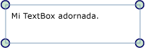

# Informaci&#243;n general sobre adornos
Las etiquetas contextuales son un tipo especial de <xref:System.Windows.FrameworkElement>, que se utiliza para proporcionar indicaciones visuales a un usuario.  Entre otros usos se pueden utilizar para agregar controladores funcionales a los elementos o proporcionar información de estado sobre un control.  
  
 [!INCLUDE[autoOutline](../Token/autoOutline_md.md)]  
  
   
## Etiquetas contextuales  
 Un <xref:System.Windows.Documents.Adorner> es un elemento de marco \(<xref:System.Windows.FrameworkElement>\) personalizado que se enlaza a un elemento de interfaz de usuario \(<xref:System.Windows.UIElement>\).  Las etiquetas contextuales se representan en una capa de <xref:System.Windows.Documents.AdornerLayer>\), que es una superficie de representación que siempre se encuentra encima del elemento con etiqueta o de una colección de elementos con etiqueta.  La representación de una etiqueta contextual es independiente de la representación del <xref:System.Windows.UIElement> al que está enlazado la etiqueta contextual.  Una etiqueta contextual se suele colocar con relación al elemento al que se enlaza, utilizando el origen de coordenadas 2D estándar situado en la parte superior izquierda del elemento adornado.  
  
 Algunas aplicaciones comunes de las etiquetas contextuales son:  
  
-   Agregar controladores funcionales a un <xref:System.Windows.UIElement>, que permiten al usuario manipular el elemento de alguna manera \(cambiar su tamaño o posición, girarlo, etc.\).  
  
-   Proporcionar comentarios visuales para indicar diversos estados o en respuesta a distintos eventos.  
  
-   Superponer etiquetas contextuales visuales en un <xref:System.Windows.UIElement>.  
  
-   Invalidar o enmascarar visualmente la totalidad o parte de un <xref:System.Windows.UIElement>.  
  
 [!INCLUDE[TLA#tla_winclient](../../../../includes/tlasharptla-winclient-md.md)] proporciona un marco de trabajo básico para etiquetar elementos visuales.  En la tabla siguiente se muestra una lista de los tipos principales utilizados al etiquetar objetos y su finalidad.  A continuación, se presentan varios ejemplos de uso.  
  
|||  
|-|-|  
|<xref:System.Windows.Documents.Adorner>|Una clase base abstracta de la que heredan todas las implementaciones de etiquetas contextuales concretas.|  
|<xref:System.Windows.Documents.AdornerLayer>|Una clase que representa una capa de representación para la o las etiquetas contextuales de uno o más elementos.|  
|<xref:System.Windows.Documents.AdornerDecorator>|Una clase que permite asociar una capa de etiquetas contextuales a una colección de elementos.|  
  
   
## Implementación de una etiqueta contextual personalizada  
 El marco de trabajo de etiquetas contextuales proporcionado por [!INCLUDE[TLA#tla_winclient](../../../../includes/tlasharptla-winclient-md.md)] está diseñado principalmente para admitir la creación de etiquetas contextuales personalizadas.  Un adorno personalizado se crea implementando una clase que hereda de la clase <xref:System.Windows.Documents.Adorner> abstracta.  
  
> [!NOTE]
>  El elemento primario de un objeto <xref:System.Windows.Documents.Adorner> es <xref:System.Windows.Documents.AdornerLayer>, que representa el <xref:System.Windows.Documents.Adorner>, no el elemento etiquetado.  
  
 En el ejemplo siguiente se muestra una clase que implementa una etiqueta contextual simple.  La etiqueta contextual del ejemplo se limita a etiquetar las esquinas de un <xref:System.Windows.UIElement> con círculos.  
  
 [!code-csharp[Adorners_SimpleCircleAdorner#_SimpleCircleAdornerBody](../../../../samples/snippets/csharp/VS_Snippets_Wpf/Adorners_SimpleCircleAdorner/CSharp/Window1.xaml.cs#_simplecircleadornerbody)]
 [!code-vb[Adorners_SimpleCircleAdorner#_SimpleCircleAdornerBody](../../../../samples/snippets/visualbasic/VS_Snippets_Wpf/Adorners_SimpleCircleAdorner/VisualBasic/Window1.xaml.vb#_simplecircleadornerbody)]  
  
 En la ilustración siguiente se muestra la etiqueta contextual SimpleCircleAdorner aplicada a un control <xref:System.Windows.Controls.TextBox>.  
  
   
  
   
## Comportamiento de representación de las etiquetas contextuales  
 Es importante tener en cuenta que los adornos no incluyen ningún comportamiento de representación inherente; asegurarse de que un adorno se representa es responsabilidad del implementador del adorno.  Una manera común de implementar el comportamiento de representación es invalidar el método <xref:System.Windows.UIElement.OnRender%2A> y utilizar uno o más objetos <xref:System.Windows.Media.DrawingContext> para representar los elementos visuales de la etiqueta contextual, según sea necesario \(como se muestra en el ejemplo anterior\).  
  
> [!NOTE]
>  Todo aquello que se coloca en la capa de etiquetas contextuales se representa encima del resto de estilos que se han establecido.  En otras palabras, las etiquetas contextuales siempre están visualmente encima y no pueden invalidar utilizando el [orden z](GTMT).  
  
   
## Eventos y pruebas de posicionamiento  
 Las etiquetas contextuales reciben los eventos de entrada exactamente igual que cualquier otro elemento <xref:System.Windows.FrameworkElement>.  Dado que una etiqueta contextual siempre tiene un [orden z](GTMT) más alto que el elemento que adorna, la etiqueta contextual recibe los eventos de entrada \(como <xref:System.Windows.UIElement.Drop> o <xref:System.Windows.UIElement.MouseMove>\) que podrían estar dirigidos al elemento adornado subyacente.  Una etiqueta contextual puede realizar escuchas para ciertos eventos de entrada y pasárselos al elemento etiquetado subyacente volviendo a provocar el evento.  
  
 Para habilitar las pruebas de posicionamiento indirectas de los elementos que se encuentran debajo de una etiqueta contextual, establezca la propiedad <xref:System.Windows.UIElement.IsHitTestVisible%2A> de la etiqueta contextual en **false**.  Para obtener más información sobre pruebas de posicionamiento, consulte  
  
 [Realizar pruebas de posicionamiento en la capa visual](../../../../docs/framework/wpf/graphics-multimedia/hit-testing-in-the-visual-layer.md).  
  
   
## Agregar una etiqueta contextual a un solo elemento de interfaz de usuario  
 Para enlazar un adorno a un elemento <xref:System.Windows.UIElement> determinado, siga estos pasos:  
  
1.  Llame al método estático <xref:System.Windows.Documents.AdornerLayer.GetAdornerLayer%2A> para obtener un objeto <xref:System.Windows.Documents.AdornerLayer> del elemento <xref:System.Windows.UIElement> que se va a adornar.  <xref:System.Windows.Documents.AdornerLayer.GetAdornerLayer%2A> recorre el árbol visual en sentido ascendente, empezando por el elemento <xref:System.Windows.UIElement> especificado, y devuelve la primera capa de adornos que encuentra.  \(Si no se encuentra ninguna capa, el método devuelve null.\)  
  
2.  Llame al método <xref:System.Windows.Documents.AdornerLayer.Add%2A> para enlazar la etiqueta contextual al <xref:System.Windows.UIElement> de destino.  
  
 En el ejemplo siguiente se enlaza el adorno SimpleCircleAdorner \(mostrado anteriormente\) a un control <xref:System.Windows.Controls.TextBox> denominado *myTextBox*.  
  
 [!code-csharp[Adorners_SimpleCircleAdorner#_AdornSingleElement](../../../../samples/snippets/csharp/VS_Snippets_Wpf/Adorners_SimpleCircleAdorner/CSharp/Window1.xaml.cs#_adornsingleelement)]
 [!code-vb[Adorners_SimpleCircleAdorner#_AdornSingleElement](../../../../samples/snippets/visualbasic/VS_Snippets_Wpf/Adorners_SimpleCircleAdorner/VisualBasic/Window1.xaml.vb#_adornsingleelement)]  
  
> [!NOTE]
>  En la actualidad, no se admite el uso de [!INCLUDE[TLA#tla_xaml](../../../../includes/tlasharptla-xaml-md.md)] para enlazar un adorno a otro elemento.  
  
   
## Agregar etiquetas contextuales a elementos secundarios de un panel  
 Para enlazar un adorno contextual a los elementos secundarios de un control <xref:System.Windows.Controls.Panel>, siga estos pasos:  
  
1.  Llame al método `static` <xref:System.Windows.Documents.AdornerLayer.GetAdornerLayer%2A> para buscar una capa de etiquetas contextuales del elemento cuyos elementos secundarios desea etiquetar.  
  
2.  Enumere los elementos secundarios del elemento primario y llame al método <xref:System.Windows.Documents.AdornerLayer.Add%2A> para enlazar un adorno a cada elemento secundario.  
  
 En el ejemplo siguiente se enlaza el adorno SimpleCircleAdorner \(mostrada anteriormente\) a los elementos secundarios de un control <xref:System.Windows.Controls.StackPanel> denominado *myStackPanel*.  
  
 [!code-csharp[Adorners_SimpleCircleAdorner#_AdornChildren](../../../../samples/snippets/csharp/VS_Snippets_Wpf/Adorners_SimpleCircleAdorner/CSharp/Window1.xaml.cs#_adornchildren)]
 [!code-vb[Adorners_SimpleCircleAdorner#_AdornChildren](../../../../samples/snippets/visualbasic/VS_Snippets_Wpf/Adorners_SimpleCircleAdorner/VisualBasic/Window1.xaml.vb#_adornchildren)]  
  
## Vea también  
 <xref:System.Windows.Media.AdornerHitTestResult>   
 [Información general sobre formas y dibujo básico en WPF](../../../../docs/framework/wpf/graphics-multimedia/shapes-and-basic-drawing-in-wpf-overview.md)   
 [Pintar con imágenes, dibujos y elementos visuales](../../../../docs/framework/wpf/graphics-multimedia/painting-with-images-drawings-and-visuals.md)   
 [Información general sobre objetos Drawing](../../../../docs/framework/wpf/graphics-multimedia/drawing-objects-overview.md)   
 [Temas "Cómo..."](../../../../docs/framework/wpf/controls/adorners-how-to-topics.md)